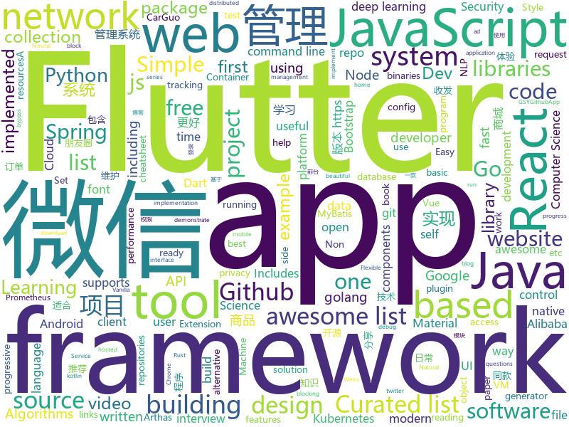

# 2019-01-01
See what the GitHub community is most excited about today.

## python
* [inter](https://github.com/rsms/inter)(**157 stars today**): The Inter UI font family
* [home-assistant](https://github.com/home-assistant/home-assistant)(**116 stars today**): 🏡Open source home automation that puts local control and privacy first
* [sherlock](https://github.com/sdushantha/sherlock)(**82 stars today**): 🔎Find usernames across social networks
* [awesome-python-applications](https://github.com/mahmoud/awesome-python-applications)(**63 stars today**): 💿Free software that works great, and also happens to be open-source Python.
* [faceswap](https://github.com/deepfakes/faceswap)(**46 stars today**): Non official project based on original /r/Deepfakes thread. Many thanks to him!
* [Super-SloMo](https://github.com/avinashpaliwal/Super-SloMo)(**45 stars today**): PyTorch implementation of Super SloMo by Jiang et al.
* [public-apis](https://github.com/toddmotto/public-apis)(**44 stars today**): A collective list of free APIs for use in software and web development.
* [youtube-dl](https://github.com/rg3/youtube-dl)(**34 stars today**): Command-line program to download videos from YouTube.com and other video sites
* [bert](https://github.com/google-research/bert)(**27 stars today**): TensorFlow code and pre-trained models for BERT
* [awesome-python](https://github.com/vinta/awesome-python)(**24 stars today**): A curated list of awesome Python frameworks, libraries, software and resources
* [system-design-primer](https://github.com/donnemartin/system-design-primer)(**24 stars today**): Learn how to design large-scale systems. Prep for the system design interview. Includes Anki flashcards.
* [pytext](https://github.com/facebookresearch/pytext)(**24 stars today**): A natural language modeling framework based on PyTorch
* [keras](https://github.com/keras-team/keras)(**20 stars today**): Deep Learning for humans
* [models](https://github.com/tensorflow/models)(**18 stars today**): Models and examples built with TensorFlow
* [35c3ctf-challs](https://github.com/niklasb/35c3ctf-challs)(**26 stars today**): 
* [DeepFaceLab](https://github.com/iperov/DeepFaceLab)(**23 stars today**): DeepFaceLab is a tool that utilizes deep learning to recognize and swap faces in pictures and videos. Includes prebuilt ready to work standalone Windows 7,8,10 binary (look readme.md).
* [drive-cli](https://github.com/nurdtechie98/drive-cli)(**24 stars today**): A command line interface for accessing google drive
* [Python](https://github.com/TheAlgorithms/Python)(**20 stars today**): All Algorithms implemented in Python
* [HelloGitHub](https://github.com/521xueweihan/HelloGitHub)(**20 stars today**): 分享 GitHub 上有趣、入门级的开源项目，帮你找到编程的乐趣。欢迎推荐、自荐项目，让更多人知道你的项目⭐️
* [awesome-machine-learning](https://github.com/josephmisiti/awesome-machine-learning)(**18 stars today**): A curated list of awesome Machine Learning frameworks, libraries and software.
* [autokeras](https://github.com/jhfjhfj1/autokeras)(**18 stars today**): accessible AutoML for deep learning.
* [django](https://github.com/django/django)(**15 stars today**): The Web framework for perfectionists with deadlines.
* [pro_gan_pytorch](https://github.com/akanimax/pro_gan_pytorch)(**19 stars today**): ProGAN package implemented as an extension of PyTorch nn.Module
* [black](https://github.com/ambv/black)(**17 stars today**): The uncompromising Python code formatter
* [toolkit](https://github.com/got-10k/toolkit)(**16 stars today**): Official Python toolkit for generic object tracking benchmark GOT-10k

## java
* [website](https://github.com/risk-first/website)(**115 stars today**): Risk-First Analysis Framework
* [advanced-java](https://github.com/doocs/advanced-java)(**85 stars today**): 😮互联网 Java 工程师进阶知识完全扫盲
* [JavaGuide](https://github.com/Snailclimb/JavaGuide)(**31 stars today**): 【Java学习+面试指南】 一份涵盖大部分Java程序员所需要掌握的核心知识。
* [mall](https://github.com/macrozheng/mall)(**32 stars today**): mall项目是一套电商系统，包括前台商城系统及后台管理系统，基于SpringBoot+MyBatis实现。 前台商城系统包含首页门户、商品推荐、商品搜索、商品展示、购物车、订单流程、会员中心、客户服务、帮助中心等模块。 后台管理系统包含商品管理、订单管理、会员管理、促销管理、运营管理、内容管理、统计报表、财务管理、权限管理、设置等模块。
* [spring-boot](https://github.com/spring-projects/spring-boot)(**26 stars today**): Spring Boot
* [tutorials](https://github.com/eugenp/tutorials)(**15 stars today**): The "REST With Spring" Course:
* [hope-plus](https://github.com/java-aodeng/hope-plus)(**28 stars today**): Hope-plus是一款nice的权限管理系统。基于Springboot2开发，整合使用mybatis+shiro+redis+thymeleaf+maven等实用技术。🏷
* [SchemaCrawler](https://github.com/schemacrawler/SchemaCrawler)(**27 stars today**): Free database schema discovery and comprehension tool
* [matrix](https://github.com/Tencent/matrix)(**25 stars today**): Matrix is a plugin style, non-invasive APM system developed by WeChat.
* [halo](https://github.com/ruibaby/halo)(**20 stars today**): Halo可能是最好的Java博客系统😉
* [gravitee-gateway](https://github.com/gravitee-io/gravitee-gateway)(**19 stars today**): Gravitee.io - API Management - Gateway
* [Magisk](https://github.com/topjohnwu/Magisk)(**15 stars today**): A Magic Mask to Alter Android System Systemless-ly
* [elasticsearch](https://github.com/elastic/elasticsearch)(**13 stars today**): Open Source, Distributed, RESTful Search Engine
* [symphony](https://github.com/b3log/symphony)(**14 stars today**): 🎶一款用 Java 实现的现代化社区（论坛/BBS/社交网络/博客）平台。https://hacpai.com
* [RxJava](https://github.com/ReactiveX/RxJava)(**13 stars today**): RxJava – Reactive Extensions for the JVM – a library for composing asynchronous and event-based programs using observable sequences for the Java VM.
* [spring-cloud-alibaba](https://github.com/spring-cloud-incubator/spring-cloud-alibaba)(**14 stars today**): Spring Cloud Alibaba provides a one-stop solution for application development for the distributed solutions of Alibaba middleware.
* [Java](https://github.com/TheAlgorithms/Java)(**12 stars today**): All Algorithms implemented in Java
* [NetGuard](https://github.com/M66B/NetGuard)(**12 stars today**): A simple way to block access to the internet per application
* [arthas](https://github.com/alibaba/arthas)(**11 stars today**): Alibaba Java Diagnostic Tool Arthas/Alibaba Java诊断利器Arthas
* [tech-weekly](https://github.com/mercyblitz/tech-weekly)(**11 stars today**): 「小马哥技术周报」
* [okhttp](https://github.com/square/okhttp)(**10 stars today**): An HTTP+HTTP/2 client for Android and Java applications.
* [spring-framework](https://github.com/spring-projects/spring-framework)(**6 stars today**): Spring Framework
* [mybatis-3](https://github.com/mybatis/mybatis-3)(**8 stars today**): MyBatis SQL mapper framework for Java
* [litemall](https://github.com/linlinjava/litemall)(**8 stars today**): 又一个小商城。litemall = Spring Boot后端 + Vue管理员前端 + 微信小程序用户前端
* [XMDebug](https://github.com/guobao90/XMDebug)(**10 stars today**): XMDebugView is debug tool to help debug app

## unknown
* [awesome-interview-questions](https://github.com/MaximAbramchuck/awesome-interview-questions)(**953 stars today**): A curated awesome list of lists of interview questions. Feel free to contribute!🎓
* [awesome-awesome-awesome](https://github.com/jonatasbaldin/awesome-awesome-awesome)(**218 stars today**): Awesome list of repositories of awesome lists🤷‍♀️
* [Best-websites-a-programmer-should-visit](https://github.com/sdmg15/Best-websites-a-programmer-should-visit)(**135 stars today**): 🔗Some useful websites for programmers.
* [awesome](https://github.com/sindresorhus/awesome)(**125 stars today**): 😎Curated list of awesome lists
* [the-book-of-secret-knowledge](https://github.com/trimstray/the-book-of-secret-knowledge)(**110 stars today**): 💫A collection of awesome lists, manuals, blogs, hacks, one-liners, cli/web tools and more. Especially for System and Network Administrators, DevOps, Pentesters or Security Researchers.
* [Pi-Hole-PiVPN-on-Google-Compute-Engine-Free-Tier-with-Full-Tunnel-and-Split-Tunnel-OpenVPN-Configs](https://github.com/rajannpatel/Pi-Hole-PiVPN-on-Google-Compute-Engine-Free-Tier-with-Full-Tunnel-and-Split-Tunnel-OpenVPN-Configs)(**101 stars today**): Run your own privacy-first ad blocking service in the cloud for free on Google Cloud Services.
* [deep_learning_object_detection](https://github.com/hoya012/deep_learning_object_detection)(**84 stars today**): A paper list of object detection using deep learning.
* [developer-roadmap](https://github.com/kamranahmedse/developer-roadmap)(**84 stars today**): Roadmap to becoming a web developer in 2019
* [ds-cheatsheets](https://github.com/FavioVazquez/ds-cheatsheets)(**72 stars today**): List of Data Science Cheatsheets to rule the world
* [react-typescript-cheatsheet](https://github.com/sw-yx/react-typescript-cheatsheet)(**60 stars today**): a cheatsheet for react users using typescript with react for the first (or nth!) time
* [CS-Notes](https://github.com/CyC2018/CS-Notes)(**49 stars today**): 📚Computer Science Learning Notes
* [GNNPapers](https://github.com/thunlp/GNNPapers)(**45 stars today**): Must-read papers on graph neural networks (GNN)
* [You-Dont-Know-JS](https://github.com/getify/You-Dont-Know-JS)(**41 stars today**): A book series on JavaScript. @YDKJS on twitter.
* [project-based-learning](https://github.com/tuvtran/project-based-learning)(**42 stars today**): Curated list of project-based tutorials
* [spec](https://github.com/ulid/spec)(**39 stars today**): The canonical spec for ulid
* [EmojiPackage](https://github.com/getActivity/EmojiPackage)(**37 stars today**): A rich emoji package resources
* [coding-interview-university](https://github.com/jwasham/coding-interview-university)(**27 stars today**): A complete computer science study plan to become a software engineer.
* [free-programming-books](https://github.com/EbookFoundation/free-programming-books)(**25 stars today**): 📚Freely available programming books
* [ixy-languages](https://github.com/ixy-languages/ixy-languages)(**31 stars today**): The same high-speed user space network driver written in lots of different high-level languages.
* [gitignore](https://github.com/github/gitignore)(**24 stars today**): A collection of useful .gitignore templates
* [MathAndScienceNotes](https://github.com/melling/MathAndScienceNotes)(**29 stars today**): Notes/links on math and science, including statistics, bayes, cmpsc, quant trading, machine learning, etc
* [algorithms](https://github.com/jeffgerickson/algorithms)(**27 stars today**): Bug-tracking for Jeff's algorithms book, notes, etc.
* [Flutter-for-Android-developers](https://github.com/m3sv/Flutter-for-Android-developers)(**24 stars today**): Compilation of Flutter materials for Android developers
* [CS231N_17_KOR_SUB](https://github.com/insurgent92/CS231N_17_KOR_SUB)(**21 stars today**): CS231N 2017 video subtitles translation project for Korean Computer Science students
* [awesome-golang-security](https://github.com/guardrailsio/awesome-golang-security)(**21 stars today**): Awesome golang Security resources

## javascript
* [Motrix](https://github.com/agalwood/Motrix)(**133 stars today**): A full-featured download manger.
* [brain.js](https://github.com/BrainJS/brain.js)(**117 stars today**): 🤖Neural networks in JavaScript
* [node-security](https://github.com/matthaywardwebdesign/node-security)(**101 stars today**): 🔑The easiest way to control what npm modules can access
* [swc](https://github.com/swc-project/swc)(**71 stars today**): Super-fast alternative for babel written in rust
* [vue](https://github.com/vuejs/vue)(**56 stars today**): 🖖Vue.js is a progressive, incrementally-adoptable JavaScript framework for building UI on the web.
* [otter](https://github.com/poowf/otter)(**44 stars today**): A relatively automatic CRUD backend administration panel
* [javascript-algorithms](https://github.com/trekhleb/javascript-algorithms)(**38 stars today**): 📝Algorithms and data structures implemented in JavaScript with explanations and links to further readings
* [33-js-concepts](https://github.com/leonardomso/33-js-concepts)(**42 stars today**): 📜33 concepts every JavaScript developer should know.
* [nodebestpractices](https://github.com/i0natan/nodebestpractices)(**41 stars today**): The largest Node.JS best practices list (November 2018)
* [react](https://github.com/facebook/react)(**33 stars today**): A declarative, efficient, and flexible JavaScript library for building user interfaces.
* [Magic-Grid](https://github.com/e-oj/Magic-Grid)(**41 stars today**): A simple, lightweight Javascript library for dynamic grid layouts.
* [react-async](https://github.com/ghengeveld/react-async)(**39 stars today**): 🍾Flexible promise-based React data loader
* [react-native](https://github.com/facebook/react-native)(**36 stars today**): A framework for building native apps with React.
* [overreacted.io](https://github.com/gaearon/overreacted.io)(**34 stars today**): Personal blog by Dan Abramov.
* [gatsby](https://github.com/gatsbyjs/gatsby)(**34 stars today**): Build blazing fast, modern apps and websites with React
* [30-seconds-of-code](https://github.com/30-seconds/30-seconds-of-code)(**35 stars today**): Curated collection of useful JavaScript snippets that you can understand in 30 seconds or less.
* [create-react-app](https://github.com/facebook/create-react-app)(**31 stars today**): Set up a modern web app by running one command.
* [react-cosmos](https://github.com/react-cosmos/react-cosmos)(**31 stars today**): Dev tool for creating reusable React components
* [edex-ui](https://github.com/GitSquared/edex-ui)(**29 stars today**): A science fiction terminal emulator designed for large touchscreens that runs on all major OSs.
* [next.js](https://github.com/zeit/next.js)(**28 stars today**): The React Framework
* [javascript](https://github.com/airbnb/javascript)(**28 stars today**): JavaScript Style Guide
* [tng-hooks](https://github.com/getify/tng-hooks)(**28 stars today**): Provides React-inspired 'hooks' like useState(..) for stand-alone functions
* [node](https://github.com/nodejs/node)(**24 stars today**): Node.js JavaScript runtime✨🐢🚀✨
* [material-ui](https://github.com/mui-org/material-ui)(**21 stars today**): React components that implement Google's Material Design.
* [autoComplete.js](https://github.com/TarekRaafat/autoComplete.js)(**25 stars today**): Simple autocomplete pure vanilla Javascript library.

## html
* [NLP-progress](https://github.com/sebastianruder/NLP-progress)(**14 stars today**): Repository to track the progress in Natural Language Processing (NLP), including the datasets and the current state-of-the-art for the most common NLP tasks.
* [website](https://github.com/kubernetes/website)(**9 stars today**): Kubernetes website and documentation repo:
* [node_passport_login](https://github.com/bradtraversy/node_passport_login)(**11 stars today**): Node.js login, registration and access control using Express and Passport
* [nginxconfig.io](https://github.com/valentinxxx/nginxconfig.io)(**12 stars today**): ⚙️NGiИX config generator generator on steroids💉
* [GTFOBins.github.io](https://github.com/GTFOBins/GTFOBins.github.io)(**11 stars today**): Curated list of Unix binaries that can be exploited to bypass system security restrictions
* [fastText](https://github.com/facebookresearch/fastText)(**11 stars today**): Library for fast text representation and classification.
* [portainer](https://github.com/portainer/portainer)(**10 stars today**): Simple management UI for Docker
* [ionic](https://github.com/ionic-team/ionic)(**7 stars today**): Build amazing native and progressive web apps with open web technologies. One app running on everything🎉
* [Spoon-Knife](https://github.com/octocat/Spoon-Knife)(****): This repo is for demonstration purposes only.
* [JavaScript30](https://github.com/wesbos/JavaScript30)(**6 stars today**): 30 Day Vanilla JS Challenge
* [BlessYourCodeTag](https://github.com/LunaGao/BlessYourCodeTag)(**9 stars today**): Bless your code. 保佑你的代码。
* [design-blocks](https://github.com/froala/design-blocks)(**8 stars today**): A set of 170+ Bootstrap based design blocks ready to be used to create clean modern websites.
* [EIPs](https://github.com/ethereum/EIPs)(**7 stars today**): The Ethereum Improvement Proposal repository
* [Front-end-Developer-Interview-Questions](https://github.com/h5bp/Front-end-Developer-Interview-Questions)(**7 stars today**): A list of helpful front-end related questions you can use to interview potential candidates, test yourself or completely ignore.
* [fonts](https://github.com/google/fonts)(**6 stars today**): Font files available from Google Fonts
* [iA-Fonts](https://github.com/iaolo/iA-Fonts)(**6 stars today**): Free variable writing fonts from iA
* [opencvjs](https://github.com/haoking/opencvjs)(**6 stars today**): Complete opencvjs for single channel.(With the lastest OpenCV 4.0.0+)
* [now-github-starter](https://github.com/zeit/now-github-starter)(****): Starter project to demonstrate a project whose pull requests get automatically deployed
* [www.rust-lang.org](https://github.com/rust-lang/www.rust-lang.org)(**5 stars today**): the home of the Rust website
* [bootstrap-table](https://github.com/wenzhixin/bootstrap-table)(**5 stars today**): An extended Bootstrap table with radio, checkbox, sort, pagination, and other added features. (supports twitter bootstrap v2, v3 and v4)
* [speedtest](https://github.com/adolfintel/speedtest)(**5 stars today**): Self-hosted HTML5 Speedtest. Easy setup, examples, configurable, responsive and mobile friendly. Supports PHP, Node, and more.
* [DoomFirePSX](https://github.com/fabiensanglard/DoomFirePSX)(**5 stars today**): Fire effect from Doom PSX/Nintendo64
* [Mac.WeChat.WebApi.Simple](https://github.com/changtuiqie/Mac.WeChat.WebApi.Simple)(**5 stars today**): mac微信,ipad微信 webapi封装好的实现方案，免IIS一键部署。 可实现微信80%功能；支持62数据登录、扫码登录、收发朋友圈、查看朋友圈、微信建群、微信拉人进群、微信公众号阅读、微信消息收发、微信附近的人定位、微信添加好友、微信红包接收、微信防撤回、分享小程序、微信加粉、微信收藏、微信标签等
* [learning-area](https://github.com/mdn/learning-area)(****): Github repo for the MDN Learning Area.
* [patchwork](https://github.com/jlord/patchwork)(****): All the Git-it Workshop completers!

## dart
* [HistoryOfEverything](https://github.com/2d-inc/HistoryOfEverything)(**130 stars today**): Flutter Launch Timeline Demo
* [flutter](https://github.com/flutter/flutter)(**64 stars today**): Flutter makes it easy and fast to build beautiful mobile apps.
* [awesome-flutter](https://github.com/Solido/awesome-flutter)(**36 stars today**): An awesome list that curates the best Flutter libraries, tools, tutorials, articles and more.
* [flutter_experiment_phone_ide](https://github.com/Norbert515/flutter_experiment_phone_ide)(**19 stars today**): An experimental way to change Flutter source-code in Flutter itself.
* [plugins](https://github.com/flutter/plugins)(**12 stars today**): Plugins for Flutter, including FlutterFire, maintained by the Flutter team
* [Liquid-Pull-To-Refresh](https://github.com/aagarwal1012/Liquid-Pull-To-Refresh)(**10 stars today**): 🔁A custom refresh indicator for flutter.
* [flutter-ui-nice](https://github.com/nb312/flutter-ui-nice)(**8 stars today**): More than 130+ pages in this beautiful app and more than 45 developers has contributed to it.
* [flutter_catalog](https://github.com/X-Wei/flutter_catalog)(**8 stars today**): An app showcasing Flutter components, with side-by-side source code view.
* [bloc](https://github.com/felangel/bloc)(**7 stars today**): A collection of packages that help implement the BLoC design pattern
* [Flutter-Notebook](https://github.com/OpenFlutter/Flutter-Notebook)(**5 stars today**): 日更的FlutterDemo合集，今天你fu了吗
* [Flare-Flutter](https://github.com/2d-inc/Flare-Flutter)(**5 stars today**): 
* [flutter-examples](https://github.com/nisrulz/flutter-examples)(**5 stars today**): [Examples] Simple basic isolated apps, for budding flutter devs.
* [password_animation](https://github.com/tunitowen/password_animation)(**5 stars today**): Flutter app to demonstrate password validation design idea
* [aqueduct](https://github.com/stablekernel/aqueduct)(****): Dart HTTP server framework for building REST APIs. Includes PostgreSQL ORM and OAuth2 provider.
* [material-components-flutter-codelabs](https://github.com/material-components/material-components-flutter-codelabs)(****): Codelabs for Material Components for Flutter (MDC-Flutter)
* [fluttercrashcourse-lessons](https://github.com/seenickcode/fluttercrashcourse-lessons)(****): 
* [BookSearch](https://github.com/Norbert515/BookSearch)(****): A digital BookShelf for your reading progress.
* [console.dart](https://github.com/DirectMyFile/console.dart)(****): Console Library
* [birb](https://github.com/abraham/birb)(****): WIP: Instagram for birds
* [chromedeveditor](https://github.com/googlearchive/chromedeveditor)(****): Chrome Dev Editor is a developer tool for building apps on the Chrome platform - Chrome Apps and Web Apps, in JavaScript or Dart. (NO LONGER IN ACTIVE DEVELOPMENT)
* [sdk](https://github.com/dart-lang/sdk)(****): The Dart SDK, including the VM, dart2js, core libraries, and more.
* [GSYGithubAppFlutter](https://github.com/CarGuo/GSYGithubAppFlutter)(****): 超完整的Flutter项目，功能丰富，适合学习和日常使用。GSYGithubApp系列的优势：我们目前已经拥有Flutter、Weex、ReactNative、kotlin 四个版本。 功能齐全，项目框架内技术涉及面广，完成度高，持续维护，配套文章，适合全面学习，对比参考。跨平台的开源Github客户端App，更好的体验，更丰富的功能，旨在更好的日常管理和维护个人Github，提供更好更方便的驾车体验Σ(￣。￣ﾉ)ﾉ。同款Weex版本 ： https://github.com/CarGuo/GSYGithubAppWeex 、同款React Native版本 ： https://github.com/CarGuo/GSYGithubApp 、原生 kotlin 版本 https://g…
* [FlutterExampleApps](https://github.com/iampawan/FlutterExampleApps)(****): [Example APPS] Basic Flutter apps, for flutter devs.
* [dio](https://github.com/flutterchina/dio)(****): A powerful Http client for Dart, which supports Interceptors, FormData, Request Cancellation, File Downloading, Timeout etc.
* [flutter_architecture_samples](https://github.com/brianegan/flutter_architecture_samples)(****): TodoMVC for Flutter

## go
* [cli](https://github.com/kubedb/cli)(**43 stars today**): KubeDB CLI
* [kubernetes](https://github.com/kubernetes/kubernetes)(**28 stars today**): Production-Grade Container Scheduling and Management
* [AdGuardHome](https://github.com/AdguardTeam/AdGuardHome)(**35 stars today**): Network-wide ads & trackers blocking DNS server
* [gmailfilters](https://github.com/jessfraz/gmailfilters)(**33 stars today**): A tool to sync Gmail filters from a config file to your account.
* [gitbatch](https://github.com/isacikgoz/gitbatch)(**32 stars today**): manage your git repositories in one place
* [dive](https://github.com/wagoodman/dive)(**29 stars today**): A tool for exploring each layer in a docker image
* [loki](https://github.com/grafana/loki)(**29 stars today**): Like Prometheus, but for logs.
* [go](https://github.com/golang/go)(**25 stars today**): The Go programming language
* [awesome-go](https://github.com/avelino/awesome-go)(**25 stars today**): A curated list of awesome Go frameworks, libraries and software
* [goldpinger](https://github.com/bloomberg/goldpinger)(**25 stars today**): Debugging tool for Kubernetes which tests and displays connectivity between nodes in the cluster.
* [fyne](https://github.com/fyne-io/fyne)(**22 stars today**): Cross platform GUIs in Go based on EFL
* [hugo](https://github.com/gohugoio/hugo)(**21 stars today**): The world’s fastest framework for building websites.
* [netcap](https://github.com/dreadl0ck/netcap)(**20 stars today**): A framework for secure and scalable network traffic analysis
* [gitea](https://github.com/go-gitea/gitea)(**19 stars today**): Git with a cup of tea, painless self-hosted git service
* [helm](https://github.com/helm/helm)(**16 stars today**): The Kubernetes Package Manager
* [iotex-core](https://github.com/iotexproject/iotex-core)(**17 stars today**): Official Go implementation of the IoTeX protocol
* [tldr](https://github.com/isacikgoz/tldr)(**17 stars today**): fast and interactive tldr client written with go
* [build-web-application-with-golang](https://github.com/astaxie/build-web-application-with-golang)(**15 stars today**): A golang ebook intro how to build a web with golang
* [binctr](https://github.com/genuinetools/binctr)(**16 stars today**): Fully static, unprivileged, self-contained, containers as executable binaries.
* [v2ray-core](https://github.com/v2ray/v2ray-core)(**13 stars today**): A platform for building proxies to bypass network restrictions.
* [fzf](https://github.com/junegunn/fzf)(**13 stars today**): 🌸A command-line fuzzy finder
* [prometheus](https://github.com/prometheus/prometheus)(**13 stars today**): The Prometheus monitoring system and time series database.
* [go-micro](https://github.com/micro/go-micro)(**12 stars today**): A microservice framework
* [mattermost-server](https://github.com/mattermost/mattermost-server)(**13 stars today**): Open source Slack-alternative in Golang and React - Mattermost
* [gin](https://github.com/gin-gonic/gin)(**12 stars today**): Gin is a HTTP web framework written in Go (Golang). It features a Martini-like API with much better performance -- up to 40 times faster. If you need smashing performance, get yourself some Gin.

## WordCloud

