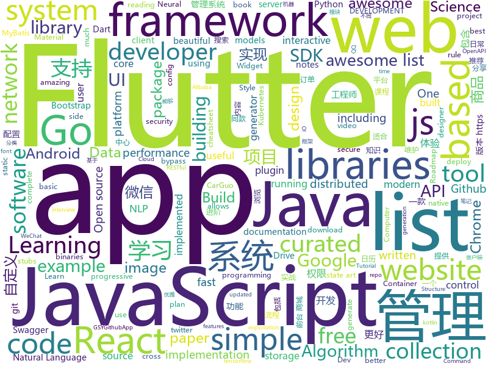

# 2019-01-03
See what the GitHub community is most excited about today.

## python
* [flair](https://github.com/zalandoresearch/flair)(**1,248 stars today**): A very simple framework for state-of-the-art Natural Language Processing (NLP)
* [uncaptcha2](https://github.com/ecthros/uncaptcha2)(**436 stars today**): defeating the latest version of ReCaptcha with 91% accuracy
* [sherlock](https://github.com/TheYahya/sherlock)(**318 stars today**): 🔎Find usernames across social networks
* [Deep-Learning-Papers-Reading-Roadmap](https://github.com/floodsung/Deep-Learning-Papers-Reading-Roadmap)(**181 stars today**): Deep Learning papers reading roadmap for anyone who are eager to learn this amazing tech!
* [inter](https://github.com/rsms/inter)(**189 stars today**): The Inter UI font family
* [TsetlinMachine](https://github.com/cair/TsetlinMachine)(**127 stars today**): The code and datasets for the Tsetlin Machine
* [faceswap](https://github.com/deepfakes/faceswap)(**107 stars today**): Non official project based on original /r/Deepfakes thread. Many thanks to him!
* [instagan](https://github.com/sangwoomo/instagan)(**97 stars today**): PyTorch implementation of "InstaGAN: Instance-aware Image Translation" (ICLR 2019)
* [awesome-python-applications](https://github.com/mahmoud/awesome-python-applications)(**85 stars today**): 💿Free software that works great, and also happens to be open-source Python.
* [awesome-python](https://github.com/vinta/awesome-python)(**77 stars today**): A curated list of awesome Python frameworks, libraries, software and resources
* [system-design-primer](https://github.com/donnemartin/system-design-primer)(**70 stars today**): Learn how to design large-scale systems. Prep for the system design interview. Includes Anki flashcards.
* [models](https://github.com/tensorflow/models)(**53 stars today**): Models and examples built with TensorFlow
* [Super-SloMo](https://github.com/avinashpaliwal/Super-SloMo)(**65 stars today**): PyTorch implementation of Super SloMo by Jiang et al.
* [bert](https://github.com/google-research/bert)(**53 stars today**): TensorFlow code and pre-trained models for BERT
* [Python](https://github.com/TheAlgorithms/Python)(**49 stars today**): All Algorithms implemented in Python
* [public-apis](https://github.com/toddmotto/public-apis)(**51 stars today**): A collective list of free APIs for use in software and web development.
* [algorithm-exercise](https://github.com/billryan/algorithm-exercise)(**49 stars today**): Data Structure and Algorithm notes. 数据结构与算法/leetcode/lintcode题解/
* [pytext](https://github.com/facebookresearch/pytext)(**48 stars today**): A natural language modeling framework based on PyTorch
* [home-assistant](https://github.com/home-assistant/home-assistant)(**45 stars today**): 🏡Open source home automation that puts local control and privacy first
* [youtube-dl](https://github.com/rg3/youtube-dl)(**41 stars today**): Command-line program to download videos from YouTube.com and other video sites
* [black](https://github.com/ambv/black)(**41 stars today**): The uncompromising Python code formatter
* [FeelUOwn](https://github.com/cosven/FeelUOwn)(**42 stars today**): trying to be a user-friendly and hackable music player
* [keras](https://github.com/keras-team/keras)(**37 stars today**): Deep Learning for humans
* [Gather-Tensorflow-Serving](https://github.com/huseinzol05/Gather-Tensorflow-Serving)(**39 stars today**): Gather how to deploy tensorflow models using nginx, hadoop, kafka, flask, gunicorn, socketio, docker swarm, luigi spotify and so much more
* [awesome-machine-learning](https://github.com/josephmisiti/awesome-machine-learning)(**39 stars today**): A curated list of awesome Machine Learning frameworks, libraries and software.

## java
* [cim](https://github.com/crossoverJie/cim)(**308 stars today**): 📲cim(cross IM) 适用于开发者的即时通讯系统
* [advanced-java](https://github.com/doocs/advanced-java)(**264 stars today**): 😮互联网 Java 工程师进阶知识完全扫盲
* [JavaGuide](https://github.com/Snailclimb/JavaGuide)(**136 stars today**): 【Java学习+面试指南】 一份涵盖大部分Java程序员所需要掌握的核心知识。
* [matrix](https://github.com/Tencent/matrix)(**104 stars today**): Matrix is a plugin style, non-invasive APM system developed by WeChat.
* [mall](https://github.com/macrozheng/mall)(**95 stars today**): mall项目是一套电商系统，包括前台商城系统及后台管理系统，基于SpringBoot+MyBatis实现。 前台商城系统包含首页门户、商品推荐、商品搜索、商品展示、购物车、订单流程、会员中心、客户服务、帮助中心等模块。 后台管理系统包含商品管理、订单管理、会员管理、促销管理、运营管理、内容管理、统计报表、财务管理、权限管理、设置等模块。
* [JCSprout](https://github.com/crossoverJie/JCSprout)(**47 stars today**): 👨‍🎓Java Core Sprout : basic, concurrent, algorithm
* [tutorials](https://github.com/eugenp/tutorials)(**33 stars today**): The "REST With Spring" Course:
* [arthas](https://github.com/alibaba/arthas)(**41 stars today**): Alibaba Java Diagnostic Tool Arthas/Alibaba Java诊断利器Arthas
* [hope-plus](https://github.com/java-aodeng/hope-plus)(**42 stars today**): Hope-plus是一款nice的权限管理系统。基于Springboot2开发，整合使用mybatis+shiro+redis+thymeleaf+maven等实用技术。🏷
* [symphony](https://github.com/b3log/symphony)(**42 stars today**): 🎶一款用 Java 实现的现代化社区（论坛/BBS/社交网络/博客）平台。https://hacpai.com
* [x7](https://github.com/x-ream/x7)(**43 stars today**): 
* [miaosha](https://github.com/qiurunze123/miaosha)(**38 stars today**): 😮😮秒杀系统设计与实现.互联网工程师进阶与分析🙋🐓
* [spring-boot](https://github.com/spring-projects/spring-boot)(**36 stars today**): Spring Boot
* [CalendarView](https://github.com/huanghaibin-dev/CalendarView)(**39 stars today**): Android上一个优雅、万能自定义UI、支持周视图、自定义周起始、性能高效的日历控件，支持热插拔实现的UI定制！支持标记、自定义颜色、农历、自定义月视图各种显示模式等。Canvas绘制，速度快、占用内存低，你真的想不到日历居然还可以如此优雅！An elegant, highly customized and high-performance Calendar Widget on Android.
* [netty](https://github.com/netty/netty)(**34 stars today**): Netty project - an event-driven asynchronous network application framework
* [elasticsearch](https://github.com/elastic/elasticsearch)(**33 stars today**): Open Source, Distributed, RESTful Search Engine
* [incubator-dubbo](https://github.com/apache/incubator-dubbo)(**29 stars today**): Apache Dubbo (incubating) is a high-performance, java based, open source RPC framework.
* [apollo](https://github.com/ctripcorp/apollo)(**30 stars today**): Apollo（阿波罗）是携程框架部门研发的分布式配置中心，能够集中化管理应用不同环境、不同集群的配置，配置修改后能够实时推送到应用端，并且具备规范的权限、流程治理等特性，适用于微服务配置管理场景。
* [flink](https://github.com/apache/flink)(**31 stars today**): Apache Flink
* [WxJava](https://github.com/Wechat-Group/WxJava)(**27 stars today**): WxJava （微信开发 Java SDK），支持包括微信支付、开放平台、小程序、企业微信/企业号和公众号等的后端开发
* [telegram-sms](https://github.com/qwe7002/telegram-sms)(**31 stars today**): A Telegram Bot running on Android to forward SMS
* [halo](https://github.com/ruibaby/halo)(**27 stars today**): Halo可能是最好的Java博客系统😉
* [Java](https://github.com/TheAlgorithms/Java)(**22 stars today**): All Algorithms implemented in Java
* [SocialSdkLibrary](https://github.com/chendongMarch/SocialSdkLibrary)(**27 stars today**): 提供微博、微信、QQ、Tim、QQ 轻聊版、钉钉的登陆分享功能支持;
* [guava](https://github.com/google/guava)(**25 stars today**): Google core libraries for Java

## unknown
* [awesome-interview-questions](https://github.com/MaximAbramchuck/awesome-interview-questions)(**702 stars today**): A curated awesome list of lists of interview questions. Feel free to contribute!🎓
* [algorithms](https://github.com/jeffgerickson/algorithms)(**301 stars today**): Bug-tracking for Jeff's algorithms book, notes, etc.
* [GitHubDaily](https://github.com/GitHubDaily/GitHubDaily)(**231 stars today**): GitHubDaily 分享内容定期整理与分类。欢迎推荐、自荐项目，让更多人知道你的项目。
* [Best-websites-a-programmer-should-visit](https://github.com/sdmg15/Best-websites-a-programmer-should-visit)(**217 stars today**): 🔗Some useful websites for programmers.
* [developer-roadmap](https://github.com/kamranahmedse/developer-roadmap)(**175 stars today**): Roadmap to becoming a web developer in 2019
* [awesome-awesome-awesome](https://github.com/jonatasbaldin/awesome-awesome-awesome)(**176 stars today**): Awesome list of repositories of awesome lists🤷‍♀️
* [react-typescript-cheatsheet](https://github.com/sw-yx/react-typescript-cheatsheet)(**169 stars today**): a cheatsheet for react users using typescript with react for the first (or nth!) time
* [the-book-of-secret-knowledge](https://github.com/trimstray/the-book-of-secret-knowledge)(**138 stars today**): 💫A collection of awesome lists, manuals, blogs, hacks, one-liners, cli/web tools and more. Especially for System and Network Administrators, DevOps, Pentesters or Security Researchers.
* [pwc](https://github.com/zziz/pwc)(**116 stars today**): Papers with code. Sorted by stars. Updated weekly.
* [CS-Notes](https://github.com/CyC2018/CS-Notes)(**100 stars today**): 📚Computer Science Learning Notes
* [OI-wiki](https://github.com/24OI/OI-wiki)(**111 stars today**): 🌟Wiki for OI / ICPC. （某大型游戏线上攻略，内含炫酷算术魔法）
* [deep_learning_object_detection](https://github.com/hoya012/deep_learning_object_detection)(**95 stars today**): A paper list of object detection using deep learning.
* [ds-cheatsheets](https://github.com/FavioVazquez/ds-cheatsheets)(**76 stars today**): List of Data Science Cheatsheets to rule the world
* [awesome](https://github.com/sindresorhus/awesome)(**76 stars today**): 😎Curated list of awesome lists
* [developer-roadmap-chinese](https://github.com/goodjack/developer-roadmap-chinese)(**73 stars today**): 2019 年成為 Web 開發人員的路線圖
* [free-programming-books](https://github.com/EbookFoundation/free-programming-books)(**69 stars today**): 📚Freely available programming books
* [GNNPapers](https://github.com/thunlp/GNNPapers)(**68 stars today**): Must-read papers on graph neural networks (GNN)
* [Awesome-Android-Notebook](https://github.com/JsonChao/Awesome-Android-Notebook)(**68 stars today**): 💻A complete plan for better android developers.（continuous updating ...）
* [You-Dont-Know-JS](https://github.com/getify/You-Dont-Know-JS)(**63 stars today**): A book series on JavaScript. @YDKJS on twitter.
* [EmojiPackage](https://github.com/getActivity/EmojiPackage)(**66 stars today**): A rich emoji package resources
* [build-your-own-x](https://github.com/danistefanovic/build-your-own-x)(**66 stars today**): 🤓Build your own (insert technology here)
* [awesome-browser-exploit](https://github.com/Escapingbug/awesome-browser-exploit)(**56 stars today**): awesome list of browser exploitation tutorials
* [gitignore](https://github.com/github/gitignore)(**44 stars today**): A collection of useful .gitignore templates
* [trackerslist](https://github.com/ngosang/trackerslist)(**41 stars today**): An updated list of public BitTorrent trackers
* [coding-interview-university](https://github.com/jwasham/coding-interview-university)(**39 stars today**): A complete computer science study plan to become a software engineer.

## javascript
* [learn-json-web-tokens](https://github.com/dwyl/learn-json-web-tokens)(**466 stars today**): 🔐Learn how to use JSON Web Token (JWT) to secure your next Web App! (Tutorial/Example with Tests!!)
* [Motrix](https://github.com/agalwood/Motrix)(**173 stars today**): A full-featured download manger.
* [nodebestpractices](https://github.com/i0natan/nodebestpractices)(**133 stars today**): The largest Node.JS best practices list (November 2018)
* [brain.js](https://github.com/BrainJS/brain.js)(**128 stars today**): 🤖Neural networks in JavaScript
* [vue](https://github.com/vuejs/vue)(**111 stars today**): 🖖Vue.js is a progressive, incrementally-adoptable JavaScript framework for building UI on the web.
* [30-seconds-of-code](https://github.com/30-seconds/30-seconds-of-code)(**104 stars today**): Curated collection of useful JavaScript snippets that you can understand in 30 seconds or less.
* [tng-hooks](https://github.com/getify/tng-hooks)(**108 stars today**): Provides React-inspired 'hooks' like useState(..) for stand-alone functions
* [33-js-concepts](https://github.com/leonardomso/33-js-concepts)(**97 stars today**): 📜33 concepts every JavaScript developer should know.
* [javascript-algorithms](https://github.com/trekhleb/javascript-algorithms)(**90 stars today**): 📝Algorithms and data structures implemented in JavaScript with explanations and links to further readings
* [dayjs](https://github.com/iamkun/dayjs)(**87 stars today**): ⏰Day.js 2KB immutable date library alternative to Moment.js with the same modern API
* [react](https://github.com/facebook/react)(**78 stars today**): A declarative, efficient, and flexible JavaScript library for building user interfaces.
* [RSSHub](https://github.com/DIYgod/RSSHub)(**76 stars today**): 🍰万物皆可 RSS
* [Bandersnatch](https://github.com/Ahmad-Magdy-Osman/Bandersnatch)(**73 stars today**): 💻Interactive Black Mirror: Bandersnatch Paths Website🎥
* [yapi](https://github.com/YMFE/yapi)(**70 stars today**): YApi 是一个可本地部署的、打通前后端及QA的、可视化的接口管理平台
* [javascript](https://github.com/airbnb/javascript)(**59 stars today**): JavaScript Style Guide
* [next.js](https://github.com/zeit/next.js)(**59 stars today**): The React Framework
* [edex-ui](https://github.com/GitSquared/edex-ui)(**60 stars today**): A science fiction terminal emulator designed for large touchscreens that runs on all major OSs.
* [create-react-app](https://github.com/facebook/create-react-app)(**50 stars today**): Set up a modern web app by running one command.
* [swc](https://github.com/swc-project/swc)(**57 stars today**): Super-fast alternative for babel written in rust
* [33-js-concepts](https://github.com/stephentian/33-js-concepts)(**54 stars today**): 📜每个 JavaScript 工程师都应懂的33个概念 @leonardomso
* [Magic-Grid](https://github.com/e-oj/Magic-Grid)(**49 stars today**): A simple, lightweight Javascript library for dynamic grid layouts.
* [learnGitBranching](https://github.com/pcottle/learnGitBranching)(**45 stars today**): An interactive git visualization to challenge and educate!
* [node](https://github.com/nodejs/node)(**39 stars today**): Node.js JavaScript runtime✨🐢🚀✨
* [material-ui](https://github.com/mui-org/material-ui)(**43 stars today**): React components that implement Google's Material Design.
* [three.js](https://github.com/mrdoob/three.js)(**40 stars today**): JavaScript 3D library.

## html
* [nginxconfig.io](https://github.com/valentinxxx/nginxconfig.io)(**25 stars today**): ⚙️NGiИX config generator generator on steroids💉
* [fastText](https://github.com/facebookresearch/fastText)(**23 stars today**): Library for fast text representation and classification.
* [openmoji](https://github.com/hfg-gmuend/openmoji)(**24 stars today**): Open-source emojis for designers, developers and everyone else!
* [NLP-progress](https://github.com/sebastianruder/NLP-progress)(**20 stars today**): Repository to track the progress in Natural Language Processing (NLP), including the datasets and the current state-of-the-art for the most common NLP tasks.
* [flutter-in-action](https://github.com/flutterchina/flutter-in-action)(**19 stars today**): 《Flutter实战》电子书
* [frida-all-in-one](https://github.com/hookmaster/frida-all-in-one)(**17 stars today**): 《FRIDA操作手册》by @hluwa @r0ysue
* [Coursera-ML-AndrewNg-Notes](https://github.com/fengdu78/Coursera-ML-AndrewNg-Notes)(**15 stars today**): 吴恩达老师的机器学习课程个人笔记
* [JavaScript30](https://github.com/wesbos/JavaScript30)(**9 stars today**): 30 Day Vanilla JS Challenge
* [react-app-rewired](https://github.com/timarney/react-app-rewired)(**14 stars today**): Override create-react-app webpack configs without ejecting
* [Spoon-Knife](https://github.com/octocat/Spoon-Knife)(****): This repo is for demonstration purposes only.
* [Seeing-Theory](https://github.com/seeingtheory/Seeing-Theory)(**15 stars today**): A visual introduction to probability and statistics.
* [ionic](https://github.com/ionic-team/ionic)(**11 stars today**): Build amazing native and progressive web apps with open web technologies. One app running on everything🎉
* [deeplearning_ai_books](https://github.com/fengdu78/deeplearning_ai_books)(**12 stars today**): deeplearning.ai（吴恩达老师的深度学习课程笔记及资源）
* [swagger-codegen](https://github.com/swagger-api/swagger-codegen)(**10 stars today**): swagger-codegen contains a template-driven engine to generate documentation, API clients and server stubs in different languages by parsing your OpenAPI / Swagger definition.
* [iA-Fonts](https://github.com/iaolo/iA-Fonts)(**11 stars today**): Free variable writing fonts from iA
* [GTFOBins.github.io](https://github.com/GTFOBins/GTFOBins.github.io)(**9 stars today**): Curated list of Unix binaries that can be exploited to bypass system security restrictions
* [responsive-html-email-template](https://github.com/leemunroe/responsive-html-email-template)(**6 stars today**): A free simple responsive HTML email template
* [design-blocks](https://github.com/froala/design-blocks)(**8 stars today**): A set of 170+ Bootstrap based design blocks ready to be used to create clean modern websites.
* [portainer](https://github.com/portainer/portainer)(**8 stars today**): Simple management UI for Docker
* [DoomFirePSX](https://github.com/fabiensanglard/DoomFirePSX)(**8 stars today**): Fire effect from Doom PSX/Nintendo64
* [openapi-generator](https://github.com/OpenAPITools/openapi-generator)(**5 stars today**): OpenAPI Generator allows generation of API client libraries (SDK generation), server stubs, documentation and configuration automatically given an OpenAPI Spec (v2, v3)
* [bootstrap-table](https://github.com/wenzhixin/bootstrap-table)(**7 stars today**): An extended Bootstrap table with radio, checkbox, sort, pagination, and other added features. (supports twitter bootstrap v2, v3 and v4)
* [Machine-Learning-in-Action-Python3](https://github.com/wzy6642/Machine-Learning-in-Action-Python3)(**7 stars today**): 《机器学习实战》python3源码
* [samples](https://github.com/GoogleChrome/samples)(**6 stars today**): A repo containing samples tied to new functionality in each release of Google Chrome.
* [hugo-academic](https://github.com/gcushen/hugo-academic)(**6 stars today**): The website designer for Hugo. Build and deploy a beautiful website in minutes🚀

## dart
* [HistoryOfEverything](https://github.com/2d-inc/HistoryOfEverything)(**146 stars today**): Flutter Launch Timeline Demo
* [flutter](https://github.com/flutter/flutter)(**145 stars today**): Flutter makes it easy and fast to build beautiful mobile apps.
* [awesome-flutter](https://github.com/Solido/awesome-flutter)(**74 stars today**): An awesome list that curates the best Flutter libraries, tools, tutorials, articles and more.
* [flutter-ui-nice](https://github.com/nb312/flutter-ui-nice)(**31 stars today**): More than 130+ pages in this beautiful app and more than 45 developers has contributed to it.
* [GSYGithubAppFlutter](https://github.com/CarGuo/GSYGithubAppFlutter)(**28 stars today**): 超完整的Flutter项目，功能丰富，适合学习和日常使用。GSYGithubApp系列的优势：我们目前已经拥有Flutter、Weex、ReactNative、kotlin 四个版本。 功能齐全，项目框架内技术涉及面广，完成度高，持续维护，配套文章，适合全面学习，对比参考。跨平台的开源Github客户端App，更好的体验，更丰富的功能，旨在更好的日常管理和维护个人Github，提供更好更方便的驾车体验Σ(￣。￣ﾉ)ﾉ。同款Weex版本 ： https://github.com/CarGuo/GSYGithubAppWeex 、同款React Native版本 ： https://github.com/CarGuo/GSYGithubApp 、原生 kotlin 版本 https://g…
* [plugins](https://github.com/flutter/plugins)(**24 stars today**): Plugins for Flutter, including FlutterFire, maintained by the Flutter team
* [flutter-examples](https://github.com/nisrulz/flutter-examples)(**18 stars today**): [Examples] Simple basic isolated apps, for budding flutter devs.
* [flutter_gank](https://github.com/lijinshanmx/flutter_gank)(**12 stars today**): 🔥「干货集中营」是一款注重体验的 Gank.io 官方客户端，App整体秉承Material简洁风格，包含搜索，收藏，提交干货，按期浏览、分类浏览等功能，还有漂亮的妹纸等你哦，快来下载吧~。
* [samples](https://github.com/flutter/samples)(**11 stars today**): A collection of Flutter examples and demos.
* [tab_bar_animation](https://github.com/tunitowen/tab_bar_animation)(**10 stars today**): Flutter app to demonstrate a tab bar animation found on Dribbble
* [flutter_catalog](https://github.com/X-Wei/flutter_catalog)(**9 stars today**): An app showcasing Flutter components, with side-by-side source code view.
* [Flutter-Notebook](https://github.com/OpenFlutter/Flutter-Notebook)(**7 stars today**): 日更的FlutterDemo合集，今天你fu了吗
* [Flare-Flutter](https://github.com/2d-inc/Flare-Flutter)(**7 stars today**): 
* [Liquid-Pull-To-Refresh](https://github.com/aagarwal1012/Liquid-Pull-To-Refresh)(**6 stars today**): 🔁A custom refresh indicator for flutter.
* [fluwx](https://github.com/OpenFlutter/fluwx)(**6 stars today**): Flutter版微信SDK.WeChat SDK for flutter.
* [flame](https://github.com/luanpotter/flame)(**6 stars today**): A minimalist Flutter game engine
* [sdk](https://github.com/dart-lang/sdk)(**6 stars today**): The Dart SDK, including the VM, dart2js, core libraries, and more.
* [flutter_map](https://github.com/johnpryan/flutter_map)(****): A Flutter map package based on leaflet
* [site-www](https://github.com/dart-lang/site-www)(****): Source for Dart website
* [flutter-chat-app](https://github.com/rohan20/flutter-chat-app)(****): A chat app built on Flutter with firebase authentication and image sharing capability.
* [photo_view](https://github.com/renancaraujo/photo_view)(****): 📸A simple zoomable image widget for Flutter
* [pub](https://github.com/dart-lang/pub)(****): The package manager for Dart
* [flutter_layout](https://github.com/nb312/flutter_layout)(****): Layout of the flutter example.such as Row,Comlun,listview,Just for learning.
* [multi_image_picker](https://github.com/Sh1d0w/multi_image_picker)(****): Flutter plugin that allows you to display multi image picker on iOS and Android.👌🔝🎉
* [chromedeveditor](https://github.com/googlearchive/chromedeveditor)(****): Chrome Dev Editor is a developer tool for building apps on the Chrome platform - Chrome Apps and Web Apps, in JavaScript or Dart. (NO LONGER IN ACTIVE DEVELOPMENT)

## go
* [merlin](https://github.com/Ne0nd0g/merlin)(**335 stars today**): Merlin is a cross-platform post-exploitation HTTP/2 Command & Control server and agent written in golang.
* [kingbus](https://github.com/flike/kingbus)(**138 stars today**): A distributed MySQL binlog storage system built on Raft
* [binctr](https://github.com/genuinetools/binctr)(**99 stars today**): Fully static, unprivileged, self-contained, containers as executable binaries.
* [dhcplb](https://github.com/facebookincubator/dhcplb)(**88 stars today**): dhcplb is Facebook's implementation of a load balancer for DHCP.
* [clash](https://github.com/Dreamacro/clash)(**78 stars today**): A rule-based tunnel in Go.
* [kubernetes](https://github.com/kubernetes/kubernetes)(**68 stars today**): Production-Grade Container Scheduling and Management
* [syncthing](https://github.com/syncthing/syncthing)(**62 stars today**): Open Source Continuous File Synchronization
* [go-tools](https://github.com/dominikh/go-tools)(**63 stars today**): A collection of tools and libraries for working with Go code, including linters and static analysis
* [fyne](https://github.com/fyne-io/fyne)(**56 stars today**): Cross platform GUIs in Go based on EFL
* [swag](https://github.com/swaggo/swag)(**53 stars today**): Automatically generate RESTful API documentation with Swagger 2.0 for Go.
* [go](https://github.com/golang/go)(**47 stars today**): The Go programming language
* [awesome-go](https://github.com/avelino/awesome-go)(**39 stars today**): A curated list of awesome Go frameworks, libraries and software
* [dive](https://github.com/wagoodman/dive)(**40 stars today**): A tool for exploring each layer in a docker image
* [hugo](https://github.com/gohugoio/hugo)(**35 stars today**): The world’s fastest framework for building websites.
* [tldr](https://github.com/isacikgoz/tldr)(**37 stars today**): fast and interactive tldr client written with go
* [gin](https://github.com/gin-gonic/gin)(**34 stars today**): Gin is a HTTP web framework written in Go (Golang). It features a Martini-like API with much better performance -- up to 40 times faster. If you need smashing performance, get yourself some Gin.
* [rclone](https://github.com/ncw/rclone)(**33 stars today**): "rsync for cloud storage" - Google Drive, Amazon Drive, S3, Dropbox, Backblaze B2, One Drive, Swift, Hubic, Cloudfiles, Google Cloud Storage, Yandex Files
* [loki](https://github.com/grafana/loki)(**34 stars today**): Like Prometheus, but for logs.
* [gitea](https://github.com/go-gitea/gitea)(**29 stars today**): Git with a cup of tea, painless self-hosted git service
* [helm](https://github.com/helm/helm)(**29 stars today**): The Kubernetes Package Manager
* [minikube](https://github.com/kubernetes/minikube)(**25 stars today**): Run Kubernetes locally
* [istio](https://github.com/istio/istio)(**27 stars today**): Connect, secure, control, and observe services.
* [v2ray-core](https://github.com/v2ray/v2ray-core)(**25 stars today**): A platform for building proxies to bypass network restrictions.
* [etcd](https://github.com/etcd-io/etcd)(**26 stars today**): Distributed reliable key-value store for the most critical data of a distributed system
* [go-ethereum](https://github.com/ethereum/go-ethereum)(**24 stars today**): Official Go implementation of the Ethereum protocol

## WordCloud

