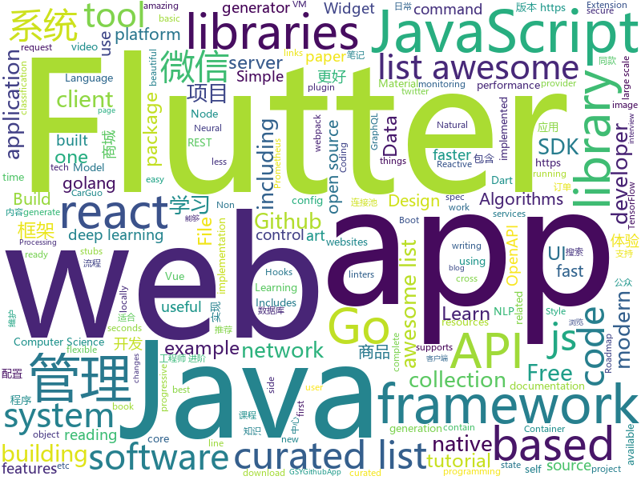

# 2019-01-04
See what the GitHub community is most excited about today.

## python
* [flair](https://github.com/zalandoresearch/flair)(**427 stars today**): A very simple framework for state-of-the-art Natural Language Processing (NLP)
* [sherlock](https://github.com/TheYahya/sherlock)(**309 stars today**): 🔎Find usernames across social networks
* [uncaptcha2](https://github.com/ecthros/uncaptcha2)(**276 stars today**): defeating the latest version of ReCaptcha with 91% accuracy
* [awesome-python-applications](https://github.com/mahmoud/awesome-python-applications)(**155 stars today**): 💿Free software that works great, and also happens to be open-source Python.
* [faceswap](https://github.com/deepfakes/faceswap)(**88 stars today**): Non official project based on original /r/Deepfakes thread. Many thanks to him!
* [Deep-Learning-Papers-Reading-Roadmap](https://github.com/floodsung/Deep-Learning-Papers-Reading-Roadmap)(**86 stars today**): Deep Learning papers reading roadmap for anyone who are eager to learn this amazing tech!
* [models](https://github.com/tensorflow/models)(**63 stars today**): Models and examples built with TensorFlow
* [instagan](https://github.com/sangwoomo/instagan)(**75 stars today**): PyTorch implementation of "InstaGAN: Instance-aware Image Translation" (ICLR 2019)
* [system-design-primer](https://github.com/donnemartin/system-design-primer)(**67 stars today**): Learn how to design large-scale systems. Prep for the system design interview. Includes Anki flashcards.
* [bert](https://github.com/google-research/bert)(**56 stars today**): TensorFlow code and pre-trained models for BERT
* [Super-SloMo](https://github.com/avinashpaliwal/Super-SloMo)(**63 stars today**): PyTorch implementation of Super SloMo by Jiang et al.
* [12306](https://github.com/testerSunshine/12306)(**53 stars today**): 12306智能刷票，订票
* [Python](https://github.com/TheAlgorithms/Python)(**50 stars today**): All Algorithms implemented in Python
* [inter](https://github.com/rsms/inter)(**53 stars today**): The Inter UI font family
* [mars](https://github.com/mars-project/mars)(**53 stars today**): Mars is a tensor-based unified framework for large-scale data computation.
* [awesome-python](https://github.com/vinta/awesome-python)(**47 stars today**): A curated list of awesome Python frameworks, libraries, software and resources
* [youtube-dl](https://github.com/rg3/youtube-dl)(**45 stars today**): Command-line program to download videos from YouTube.com and other video sites
* [keras](https://github.com/keras-team/keras)(**43 stars today**): Deep Learning for humans
* [DeepFaceLab](https://github.com/iperov/DeepFaceLab)(**47 stars today**): DeepFaceLab is a tool that utilizes deep learning to recognize and swap faces in pictures and videos. Includes prebuilt ready to work standalone Windows 7,8,10 binary (look readme.md).
* [public-apis](https://github.com/toddmotto/public-apis)(**46 stars today**): A collective list of free APIs for use in software and web development.
* [TensorFlow-Course](https://github.com/osforscience/TensorFlow-Course)(**36 stars today**): Simple and ready-to-use tutorials for TensorFlow
* [awesome-machine-learning](https://github.com/josephmisiti/awesome-machine-learning)(**41 stars today**): A curated list of awesome Machine Learning frameworks, libraries and software.
* [fenchel-young-losses](https://github.com/mblondel/fenchel-young-losses)(**45 stars today**): Probabilistic classification in PyTorch/TensorFlow/scikit-learn with Fenchel-Young losses
* [word-embedding-dimensionality-selection](https://github.com/ziyin-dl/word-embedding-dimensionality-selection)(**41 stars today**): On the Dimensionality of Word Embedding
* [weixin_crawler](https://github.com/wonderfulsuccess/weixin_crawler)(**38 stars today**): 高效微信公众号历史文章和阅读数据爬虫powered by scrapy

## java
* [cim](https://github.com/crossoverJie/cim)(**303 stars today**): 📲cim(cross IM) 适用于开发者的即时通讯系统
* [advanced-java](https://github.com/doocs/advanced-java)(**301 stars today**): 😮互联网 Java 工程师进阶知识完全扫盲
* [JavaGuide](https://github.com/Snailclimb/JavaGuide)(**160 stars today**): 【Java学习+面试指南】 一份涵盖大部分Java程序员所需要掌握的核心知识。
* [matrix](https://github.com/Tencent/matrix)(**127 stars today**): Matrix is a plugin style, non-invasive APM system developed by WeChat.
* [mall](https://github.com/macrozheng/mall)(**100 stars today**): mall项目是一套电商系统，包括前台商城系统及后台管理系统，基于SpringBoot+MyBatis实现。 前台商城系统包含首页门户、商品推荐、商品搜索、商品展示、购物车、订单流程、会员中心、客户服务、帮助中心等模块。 后台管理系统包含商品管理、订单管理、会员管理、促销管理、运营管理、内容管理、统计报表、财务管理、权限管理、设置等模块。
* [miaosha](https://github.com/qiurunze123/miaosha)(**61 stars today**): 😮😮秒杀系统设计与实现.互联网工程师进阶与分析🙋🐓
* [tutorials](https://github.com/eugenp/tutorials)(**38 stars today**): The "REST With Spring" Course:
* [JCSprout](https://github.com/crossoverJie/JCSprout)(**50 stars today**): 👨‍🎓Java Core Sprout : basic, concurrent, algorithm
* [arthas](https://github.com/alibaba/arthas)(**46 stars today**): Alibaba Java Diagnostic Tool Arthas/Alibaba Java诊断利器Arthas
* [spring-boot](https://github.com/spring-projects/spring-boot)(**36 stars today**): Spring Boot
* [symphony](https://github.com/b3log/symphony)(**46 stars today**): 🎶一款用 Java 实现的现代化社区（论坛/BBS/社交网络/博客）平台。https://hacpai.com
* [incubator-dubbo](https://github.com/apache/incubator-dubbo)(**32 stars today**): Apache Dubbo (incubating) is a high-performance, java based, open source RPC framework.
* [Java](https://github.com/TheAlgorithms/Java)(**32 stars today**): All Algorithms implemented in Java
* [spring-framework](https://github.com/spring-projects/spring-framework)(**25 stars today**): Spring Framework
* [elasticsearch](https://github.com/elastic/elasticsearch)(**31 stars today**): Open Source, Distributed, RESTful Search Engine
* [apollo](https://github.com/ctripcorp/apollo)(**32 stars today**): Apollo（阿波罗）是携程框架部门研发的分布式配置中心，能够集中化管理应用不同环境、不同集群的配置，配置修改后能够实时推送到应用端，并且具备规范的权限、流程治理等特性，适用于微服务配置管理场景。
* [litemall](https://github.com/linlinjava/litemall)(**30 stars today**): 又一个小商城。litemall = Spring Boot后端 + Vue管理员前端 + 微信小程序用户前端
* [guava](https://github.com/google/guava)(**29 stars today**): Google core libraries for Java
* [WxJava](https://github.com/Wechat-Group/WxJava)(**29 stars today**): WxJava （微信开发 Java SDK），支持包括微信支付、开放平台、小程序、企业微信/企业号和公众号等的后端开发
* [druid](https://github.com/alibaba/druid)(**26 stars today**): 阿里巴巴数据库事业部出品，为监控而生的数据库连接池。阿里云Data Lake Analytics(https://www.aliyun.com/product/datalakeanalytics )、DRDS、TDDL 连接池powered by Druid
* [okhttp](https://github.com/square/okhttp)(**26 stars today**): An HTTP+HTTP/2 client for Android and Java applications.
* [Sentinel](https://github.com/alibaba/Sentinel)(**23 stars today**): A lightweight flow-control library providing high-available protection and monitoring (高可用防护的流量管理框架)
* [BaseRecyclerViewAdapterHelper](https://github.com/CymChad/BaseRecyclerViewAdapterHelper)(**22 stars today**): BRVAH:Powerful and flexible RecyclerAdapter
* [halo](https://github.com/ruibaby/halo)(**20 stars today**): Halo可能是最好的Java博客系统😉
* [RxJava](https://github.com/ReactiveX/RxJava)(**20 stars today**): RxJava – Reactive Extensions for the JVM – a library for composing asynchronous and event-based programs using observable sequences for the Java VM.

## unknown
* [algorithms](https://github.com/jeffgerickson/algorithms)(**835 stars today**): Bug-tracking for Jeff's algorithms book, notes, etc.
* [awesome-interview-questions](https://github.com/MaximAbramchuck/awesome-interview-questions)(**407 stars today**): A curated awesome list of lists of interview questions. Feel free to contribute!🎓
* [Best-websites-a-programmer-should-visit](https://github.com/sdmg15/Best-websites-a-programmer-should-visit)(**169 stars today**): 🔗Some useful websites for programmers.
* [developer-roadmap](https://github.com/kamranahmedse/developer-roadmap)(**165 stars today**): Roadmap to becoming a web developer in 2019
* [pwc](https://github.com/zziz/pwc)(**133 stars today**): Papers with code. Sorted by stars. Updated weekly.
* [the-book-of-secret-knowledge](https://github.com/trimstray/the-book-of-secret-knowledge)(**133 stars today**): 💫A collection of awesome lists, manuals, blogs, hacks, one-liners, cli/web tools and more. Especially for System and Network Administrators, DevOps, Pentesters or Security Researchers.
* [CS-Notes](https://github.com/CyC2018/CS-Notes)(**109 stars today**): 📚Computer Science Learning Notes
* [GitHubDaily](https://github.com/GitHubDaily/GitHubDaily)(**123 stars today**): GitHubDaily 分享内容定期整理与分类。欢迎推荐、自荐项目，让更多人知道你的项目。
* [awesome-awesome-awesome](https://github.com/jonatasbaldin/awesome-awesome-awesome)(**102 stars today**): Awesome list of repositories of awesome lists🤷‍♀️
* [react-typescript-cheatsheet](https://github.com/sw-yx/react-typescript-cheatsheet)(**99 stars today**): a cheatsheet for react users using typescript with react for the first (or nth!) time
* [awesome](https://github.com/sindresorhus/awesome)(**87 stars today**): 😎Curated list of awesome lists
* [You-Dont-Know-JS](https://github.com/getify/You-Dont-Know-JS)(**66 stars today**): A book series on JavaScript. @YDKJS on twitter.
* [free-programming-books](https://github.com/EbookFoundation/free-programming-books)(**64 stars today**): 📚Freely available programming books
* [gitignore](https://github.com/github/gitignore)(**47 stars today**): A collection of useful .gitignore templates
* [blog](https://github.com/aszx87410/blog)(**58 stars today**): A tech blog about Front-end and JavaScript
* [coding-interview-university](https://github.com/jwasham/coding-interview-university)(**47 stars today**): A complete computer science study plan to become a software engineer.
* [developer-roadmap-chinese](https://github.com/goodjack/developer-roadmap-chinese)(**47 stars today**): 2019 年成為 Web 開發人員的路線圖
* [awesome-vue](https://github.com/vuejs/awesome-vue)(**44 stars today**): 🎉A curated list of awesome things related to Vue.js
* [GNNPapers](https://github.com/thunlp/GNNPapers)(**42 stars today**): Must-read papers on graph neural networks (GNN)
* [deep_learning_object_detection](https://github.com/hoya012/deep_learning_object_detection)(**43 stars today**): A paper list of object detection using deep learning.
* [project-based-learning](https://github.com/tuvtran/project-based-learning)(**39 stars today**): Curated list of project-based tutorials
* [awesome-deno](https://github.com/denolib/awesome-deno)(**43 stars today**): 🎉A curated list of awesome things related to Deno
* [EmojiPackage](https://github.com/getActivity/EmojiPackage)(**36 stars today**): A rich emoji package resources
* [computer-science](https://github.com/ossu/computer-science)(**32 stars today**): 🎓Path to a free self-taught education in Computer Science!
* [awesome-nodejs](https://github.com/sindresorhus/awesome-nodejs)(**33 stars today**): ⚡️Delightful Node.js packages and resources

## javascript
* [learn-json-web-tokens](https://github.com/dwyl/learn-json-web-tokens)(**667 stars today**): 🔐Learn how to use JSON Web Token (JWT) to secure your next Web App! (Tutorial/Example with Tests!!)
* [countly-server](https://github.com/Countly/countly-server)(**352 stars today**): Countly helps you get insights from your application. Available self-hosted or on private cloud.
* [fbt](https://github.com/facebookincubator/fbt)(**344 stars today**): A JavaScript Internationalization Framework
* [Motrix](https://github.com/agalwood/Motrix)(**243 stars today**): A full-featured download manger.
* [vue](https://github.com/vuejs/vue)(**111 stars today**): 🖖Vue.js is a progressive, incrementally-adoptable JavaScript framework for building UI on the web.
* [nodebestpractices](https://github.com/i0natan/nodebestpractices)(**102 stars today**): The largest Node.JS best practices list (November 2018)
* [react](https://github.com/facebook/react)(**81 stars today**): A declarative, efficient, and flexible JavaScript library for building user interfaces.
* [30-seconds-of-code](https://github.com/30-seconds/30-seconds-of-code)(**84 stars today**): Curated collection of useful JavaScript snippets that you can understand in 30 seconds or less.
* [javascript-algorithms](https://github.com/trekhleb/javascript-algorithms)(**75 stars today**): 📝Algorithms and data structures implemented in JavaScript with explanations and links to further readings
* [33-js-concepts](https://github.com/leonardomso/33-js-concepts)(**76 stars today**): 📜33 concepts every JavaScript developer should know.
* [brain.js](https://github.com/BrainJS/brain.js)(**74 stars today**): 🤖Neural networks in JavaScript
* [dayjs](https://github.com/iamkun/dayjs)(**70 stars today**): ⏰Day.js 2KB immutable date library alternative to Moment.js with the same modern API
* [taro](https://github.com/NervJS/taro)(**66 stars today**): 多端统一开发框架，支持用 React 的开发方式编写一次代码，生成能运行在微信/百度/支付宝/字节跳动小程序、H5、React Native 等的应用。 https://taro.js.org/
* [javascript](https://github.com/airbnb/javascript)(**65 stars today**): JavaScript Style Guide
* [gatsby](https://github.com/gatsbyjs/gatsby)(**53 stars today**): Build blazing fast, modern apps and websites with React
* [create-react-app](https://github.com/facebook/create-react-app)(**49 stars today**): Set up a modern web app by running one command.
* [react-native-magic-move](https://github.com/IjzerenHein/react-native-magic-move)(**59 stars today**): Create magical move transitions between scenes in react-native🐰🎩✨
* [quicklink](https://github.com/GoogleChromeLabs/quicklink)(**58 stars today**): ⚡️Faster subsequent page-loads by prefetching in-viewport links during idle time
* [json-server](https://github.com/typicode/json-server)(**55 stars today**): Get a full fake REST API with zero coding in less than 30 seconds (seriously)
* [potential-changes-for-github](https://github.com/dzhavat/potential-changes-for-github)(**54 stars today**): Potential changes for GitHub: Browser extension that shows which pull requests contain changes related to a file.
* [puppeteer](https://github.com/GoogleChrome/puppeteer)(**51 stars today**): Headless Chrome Node API
* [Photon](https://github.com/alanzhangzm/Photon)(**50 stars today**): A lightweight multi-threaded downloader based on aria2.
* [jetpack](https://github.com/KidkArolis/jetpack)(**46 stars today**): 🚀Jetpack – webpack made more convenient.
* [awesome-selfhosted](https://github.com/Kickball/awesome-selfhosted)(**43 stars today**): This is a list of Free Software network services and web applications which can be hosted locally. Selfhosting is the process of locally hosting and managing applications instead of renting from SaaS providers.
* [three.js](https://github.com/mrdoob/three.js)(**36 stars today**): JavaScript 3D library.

## html
* [ionic](https://github.com/ionic-team/ionic)(**17 stars today**): Build amazing native and progressive web apps with open web technologies. One app running on everything🎉
* [flutter-in-action](https://github.com/flutterchina/flutter-in-action)(**21 stars today**): 《Flutter实战》电子书
* [fastText](https://github.com/facebookresearch/fastText)(**21 stars today**): Library for fast text representation and classification.
* [NLP-progress](https://github.com/sebastianruder/NLP-progress)(**17 stars today**): Repository to track the progress in Natural Language Processing (NLP), including the datasets and the current state-of-the-art for the most common NLP tasks.
* [JavaScript30](https://github.com/wesbos/JavaScript30)(**9 stars today**): 30 Day Vanilla JS Challenge
* [nginxconfig.io](https://github.com/valentinxxx/nginxconfig.io)(**15 stars today**): ⚙️NGiИX config generator generator on steroids💉
* [Seeing-Theory](https://github.com/seeingtheory/Seeing-Theory)(**14 stars today**): A visual introduction to probability and statistics.
* [Coursera-ML-AndrewNg-Notes](https://github.com/fengdu78/Coursera-ML-AndrewNg-Notes)(**12 stars today**): 吴恩达老师的机器学习课程个人笔记
* [deeplearning_ai_books](https://github.com/fengdu78/deeplearning_ai_books)(**11 stars today**): deeplearning.ai（吴恩达老师的深度学习课程笔记及资源）
* [Spoon-Knife](https://github.com/octocat/Spoon-Knife)(****): This repo is for demonstration purposes only.
* [trpl-zh-cn](https://github.com/KaiserY/trpl-zh-cn)(**10 stars today**): Rust 程序设计语言（第二版 & 2018 edition）
* [react-app-rewired](https://github.com/timarney/react-app-rewired)(**10 stars today**): Override create-react-app webpack configs without ejecting
* [website](https://github.com/risk-first/website)(**10 stars today**): Risk-First Analysis Framework
* [ecma262](https://github.com/tc39/ecma262)(**9 stars today**): Status, process, and documents for ECMA262
* [bootstrap-table](https://github.com/wenzhixin/bootstrap-table)(**7 stars today**): An extended Bootstrap table with radio, checkbox, sort, pagination, and other added features. (supports twitter bootstrap v2, v3 and v4)
* [iA-Fonts](https://github.com/iaolo/iA-Fonts)(**9 stars today**): Free variable writing fonts from iA
* [portainer](https://github.com/portainer/portainer)(**8 stars today**): Simple management UI for Docker
* [swagger-codegen](https://github.com/swagger-api/swagger-codegen)(**6 stars today**): swagger-codegen contains a template-driven engine to generate documentation, API clients and server stubs in different languages by parsing your OpenAPI / Swagger definition.
* [openmoji](https://github.com/hfg-gmuend/openmoji)(**8 stars today**): Open-source emojis for designers, developers and everyone else!
* [openapi-generator](https://github.com/OpenAPITools/openapi-generator)(**7 stars today**): OpenAPI Generator allows generation of API client libraries (SDK generation), server stubs, documentation and configuration automatically given an OpenAPI Spec (v2, v3)
* [frida-all-in-one](https://github.com/hookmaster/frida-all-in-one)(**7 stars today**): 《FRIDA操作手册》by @hluwa @r0ysue
* [awesome-creative-coding](https://github.com/terkelg/awesome-creative-coding)(**7 stars today**): 🎨Creative Coding: Generative Art, Data visualization, Interaction Design, Resources.
* [javascript-tutorial-en](https://github.com/iliakan/javascript-tutorial-en)(**5 stars today**): Modern JavaScript Tutorial
* [wpt](https://github.com/web-platform-tests/wpt)(**7 stars today**): Test suites for Web platform specs — including WHATWG, W3C, and others
* [mkdocs-material](https://github.com/squidfunk/mkdocs-material)(**7 stars today**): A Material Design theme for MkDocs

## dart
* [flutter](https://github.com/flutter/flutter)(**173 stars today**): Flutter makes it easy and fast to build beautiful mobile apps.
* [flutter_hooks](https://github.com/rrousselGit/flutter_hooks)(**100 stars today**): React hooks for Flutter. Hooks are a new kind of object that manages a Widget life-cycles. They are used to increase code sharing between widgets and as a complete replacement for StatefulWidget.
* [HistoryOfEverything](https://github.com/2d-inc/HistoryOfEverything)(**89 stars today**): Flutter Launch Timeline Demo
* [awesome-flutter](https://github.com/Solido/awesome-flutter)(**70 stars today**): An awesome list that curates the best Flutter libraries, tools, tutorials, articles and more.
* [flutter-mix](https://github.com/flschweiger/flutter-mix)(**24 stars today**): UI experiments with Flutter. What else?
* [plugins](https://github.com/flutter/plugins)(**20 stars today**): Plugins for Flutter, including FlutterFire, maintained by the Flutter team
* [GSYGithubAppFlutter](https://github.com/CarGuo/GSYGithubAppFlutter)(**23 stars today**): 超完整的Flutter项目，功能丰富，适合学习和日常使用。GSYGithubApp系列的优势：我们目前已经拥有Flutter、Weex、ReactNative、kotlin 四个版本。 功能齐全，项目框架内技术涉及面广，完成度高，持续维护，配套文章，适合全面学习，对比参考。跨平台的开源Github客户端App，更好的体验，更丰富的功能，旨在更好的日常管理和维护个人Github，提供更好更方便的驾车体验Σ(￣。￣ﾉ)ﾉ。同款Weex版本 ： https://github.com/CarGuo/GSYGithubAppWeex 、同款React Native版本 ： https://github.com/CarGuo/GSYGithubApp 、原生 kotlin 版本 https://g…
* [dio](https://github.com/flutterchina/dio)(**20 stars today**): A powerful Http client for Dart, which supports Interceptors, FormData, Request Cancellation, File Downloading, Timeout etc.
* [flutter-examples](https://github.com/nisrulz/flutter-examples)(**18 stars today**): [Examples] Simple basic isolated apps, for budding flutter devs.
* [flutter_gank](https://github.com/lijinshanmx/flutter_gank)(**18 stars today**): 🔥「干货集中营」是一款注重体验的 Gank.io 官方客户端，App整体秉承Material简洁风格，包含搜索，收藏，提交干货，按期浏览、分类浏览等功能，还有漂亮的妹纸等你哦，快来下载吧~。
* [samples](https://github.com/flutter/samples)(**16 stars today**): A collection of Flutter examples and demos.
* [Flutter-Notebook](https://github.com/OpenFlutter/Flutter-Notebook)(**15 stars today**): 日更的FlutterDemo合集，今天你fu了吗
* [flutter-ui-nice](https://github.com/nb312/flutter-ui-nice)(**13 stars today**): More than 130+ pages in this beautiful app and more than 45 developers has contributed to it.
* [sdk](https://github.com/dart-lang/sdk)(**11 stars today**): The Dart SDK, including the VM, dart2js, core libraries, and more.
* [aqueduct](https://github.com/stablekernel/aqueduct)(**7 stars today**): Dart HTTP server framework for building REST APIs. Includes PostgreSQL ORM and OAuth2 provider.
* [flutter-chat-app](https://github.com/rohan20/flutter-chat-app)(**6 stars today**): A chat app built on Flutter with firebase authentication and image sharing capability.
* [flame](https://github.com/luanpotter/flame)(**6 stars today**): A minimalist Flutter game engine
* [graphql-flutter](https://github.com/zino-app/graphql-flutter)(**6 stars today**): A GraphQL client for Flutter, bringing all the features from a modern GraphQL client to one easy to use package.
* [udacity-course](https://github.com/flutter/udacity-course)(**5 stars today**): Build native mobile apps with Flutter
* [quiet-flutter](https://github.com/boyan01/quiet-flutter)(**5 stars today**): flutter music player application （仿网易云音乐）
* [fluwx](https://github.com/OpenFlutter/fluwx)(**5 stars today**): Flutter版微信SDK.WeChat SDK for flutter.
* [scoped_model](https://github.com/brianegan/scoped_model)(**5 stars today**): A Widget that passes a Reactive Model to all of it's children
* [flutter_catalog](https://github.com/X-Wei/flutter_catalog)(**5 stars today**): An app showcasing Flutter components, with side-by-side source code view.
* [flutter_google_places](https://github.com/lejard-h/flutter_google_places)(****): 
* [source_gen](https://github.com/dart-lang/source_gen)(****): Automatic source code generation for Dart

## go
* [binctr](https://github.com/genuinetools/binctr)(**189 stars today**): Fully static, unprivileged, self-contained, containers as executable binaries.
* [merlin](https://github.com/Ne0nd0g/merlin)(**94 stars today**): Merlin is a cross-platform post-exploitation HTTP/2 Command & Control server and agent written in golang.
* [kingbus](https://github.com/flike/kingbus)(**85 stars today**): A distributed MySQL binlog storage system built on Raft
* [kubernetes](https://github.com/kubernetes/kubernetes)(**65 stars today**): Production-Grade Container Scheduling and Management
* [go](https://github.com/golang/go)(**47 stars today**): The Go programming language
* [excelize](https://github.com/360EntSecGroup-Skylar/excelize)(**53 stars today**): Golang library for reading and writing Microsoft Excel™ (XLSX) files.
* [go-tools](https://github.com/dominikh/go-tools)(**45 stars today**): A collection of tools and libraries for working with Go code, including linters and static analysis
* [fyne](https://github.com/fyne-io/fyne)(**43 stars today**): Cross platform GUI in Go based on Material Design
* [hugo](https://github.com/gohugoio/hugo)(**37 stars today**): The world’s fastest framework for building websites.
* [loki](https://github.com/grafana/loki)(**39 stars today**): Like Prometheus, but for logs.
* [awesome-go](https://github.com/avelino/awesome-go)(**34 stars today**): A curated list of awesome Go frameworks, libraries and software
* [dhcplb](https://github.com/facebookincubator/dhcplb)(**35 stars today**): dhcplb is Facebook's implementation of a load balancer for DHCP.
* [prometheus](https://github.com/prometheus/prometheus)(**31 stars today**): The Prometheus monitoring system and time series database.
* [syncthing](https://github.com/syncthing/syncthing)(**31 stars today**): Open Source Continuous File Synchronization
* [gin](https://github.com/gin-gonic/gin)(**31 stars today**): Gin is a HTTP web framework written in Go (Golang). It features a Martini-like API with much better performance -- up to 40 times faster. If you need smashing performance, get yourself some Gin.
* [badger](https://github.com/dgraph-io/badger)(**33 stars today**): Fast key-value DB in Go.
* [golangci-lint](https://github.com/golangci/golangci-lint)(**32 stars today**): Linters Runner for Go. 5x faster than gometalinter. Nice colored output. Can report only new issues. Fewer false-positives. Yaml/toml config.
* [build-web-application-with-golang](https://github.com/astaxie/build-web-application-with-golang)(**28 stars today**): A golang ebook intro how to build a web with golang
* [swag](https://github.com/swaggo/swag)(**30 stars today**): Automatically generate RESTful API documentation with Swagger 2.0 for Go.
* [istio](https://github.com/istio/istio)(**26 stars today**): Connect, secure, control, and observe services.
* [v2ray-core](https://github.com/v2ray/v2ray-core)(**24 stars today**): A platform for building proxies to bypass network restrictions.
* [helm](https://github.com/helm/helm)(**24 stars today**): The Kubernetes Package Manager
* [terraform](https://github.com/hashicorp/terraform)(**26 stars today**): Terraform is a tool for building, changing, and combining infrastructure safely and efficiently.
* [fzf](https://github.com/junegunn/fzf)(**25 stars today**): 🌸A command-line fuzzy finder
* [gorm](https://github.com/jinzhu/gorm)(**23 stars today**): The fantastic ORM library for Golang, aims to be developer friendly

## WordCloud

