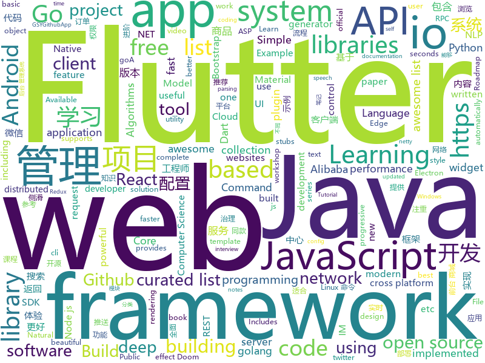

# 2019-01-06
See what the GitHub community is most excited about today.

## python
* [uncaptcha2](https://github.com/ecthros/uncaptcha2)(**734 stars today**): defeating the latest version of ReCaptcha with 91% accuracy
* [12306](https://github.com/testerSunshine/12306)(**337 stars today**): 12306智能刷票，订票
* [edge-connect](https://github.com/knazeri/edge-connect)(**147 stars today**): EdgeConnect: Generative Image Inpainting with Adversarial Edge Learning. https://arxiv.org/abs/1901.00212
* [litecli](https://github.com/dbcli/litecli)(**134 stars today**): CLI for SQLite Databases with auto-completion and syntax highlighting
* [flair](https://github.com/zalandoresearch/flair)(**103 stars today**): A very simple framework for state-of-the-art Natural Language Processing (NLP)
* [imageDist](https://github.com/ghost123gg/imageDist)(**106 stars today**): Code for "Image Distribution"
* [sherlock](https://github.com/TheYahya/sherlock)(**75 stars today**): 🔎Find usernames across social networks
* [awesome-python-applications](https://github.com/mahmoud/awesome-python-applications)(**75 stars today**): 💿Free software that works great, and also happens to be open-source Python.
* [youtube-dl](https://github.com/rg3/youtube-dl)(**68 stars today**): Command-line program to download videos from YouTube.com and other video sites
* [matrixprofile-ts](https://github.com/target/matrixprofile-ts)(**69 stars today**): A Python library for detecting patterns and anomalies in massive datasets using the Matrix Profile
* [releaseName](https://github.com/ghost123gg/releaseName)(**69 stars today**): Started as a joke, then became a real thing at work: quick & dirty release naming tool for D&D fans
* [public-apis](https://github.com/toddmotto/public-apis)(**46 stars today**): A collective list of free APIs for use in software and web development.
* [awesome-python](https://github.com/vinta/awesome-python)(**44 stars today**): A curated list of awesome Python frameworks, libraries, software and resources
* [system-design-primer](https://github.com/donnemartin/system-design-primer)(**42 stars today**): Learn how to design large-scale systems. Prep for the system design interview. Includes Anki flashcards.
* [models](https://github.com/tensorflow/models)(**35 stars today**): Models and examples built with TensorFlow
* [Python](https://github.com/TheAlgorithms/Python)(**38 stars today**): All Algorithms implemented in Python
* [coconut](https://github.com/evhub/coconut)(**39 stars today**): Simple, elegant, Pythonic functional programming.
* [home-assistant](https://github.com/home-assistant/home-assistant)(**32 stars today**): 🏡Open source home automation that puts local control and privacy first
* [faceswap](https://github.com/deepfakes/faceswap)(**33 stars today**): Non official project based on original /r/Deepfakes thread. Many thanks to him!
* [walle-web](https://github.com/meolu/walle-web)(**33 stars today**): walle - 瓦力 开源项目代码部署平台
* [bert](https://github.com/google-research/bert)(**32 stars today**): TensorFlow code and pre-trained models for BERT
* [keras](https://github.com/keras-team/keras)(**28 stars today**): Deep Learning for humans
* [Python](https://github.com/geekcomputers/Python)(**32 stars today**): My Python Examples
* [awesome-machine-learning](https://github.com/josephmisiti/awesome-machine-learning)(**27 stars today**): A curated list of awesome Machine Learning frameworks, libraries and software.
* [Deep-Learning-Papers-Reading-Roadmap](https://github.com/floodsung/Deep-Learning-Papers-Reading-Roadmap)(**28 stars today**): Deep Learning papers reading roadmap for anyone who are eager to learn this amazing tech!

## java
* [JavaGuide](https://github.com/Snailclimb/JavaGuide)(**131 stars today**): 【Java学习+面试指南】 一份涵盖大部分Java程序员所需要掌握的核心知识。
* [advanced-java](https://github.com/doocs/advanced-java)(**120 stars today**): 😮互联网 Java 工程师进阶知识完全扫盲
* [mall](https://github.com/macrozheng/mall)(**75 stars today**): mall项目是一套电商系统，包括前台商城系统及后台管理系统，基于SpringBoot+MyBatis实现。 前台商城系统包含首页门户、商品推荐、商品搜索、商品展示、购物车、订单流程、会员中心、客户服务、帮助中心等模块。 后台管理系统包含商品管理、订单管理、会员管理、促销管理、运营管理、内容管理、统计报表、财务管理、权限管理、设置等模块。
* [cim](https://github.com/crossoverJie/cim)(**48 stars today**): 📲cim(cross IM) 适用于开发者的即时通讯系统
* [miaosha](https://github.com/qiurunze123/miaosha)(**47 stars today**): 😮😮秒杀系统设计与实现.互联网工程师进阶与分析🙋🐓
* [spring-boot](https://github.com/spring-projects/spring-boot)(**27 stars today**): Spring Boot
* [symphony](https://github.com/b3log/symphony)(**32 stars today**): 🎶一款用 Java 实现的现代化社区（论坛/BBS/社交网络/博客）平台。https://hacpai.com
* [matrix](https://github.com/Tencent/matrix)(**32 stars today**): Matrix is a plugin style, non-invasive APM system developed by WeChat.
* [tutorials](https://github.com/eugenp/tutorials)(**18 stars today**): The "REST With Spring" Course:
* [apollo](https://github.com/ctripcorp/apollo)(**26 stars today**): Apollo（阿波罗）是携程框架部门研发的分布式配置中心，能够集中化管理应用不同环境、不同集群的配置，配置修改后能够实时推送到应用端，并且具备规范的权限、流程治理等特性，适用于微服务配置管理场景。
* [Java](https://github.com/TheAlgorithms/Java)(**23 stars today**): All Algorithms implemented in Java
* [spring-framework](https://github.com/spring-projects/spring-framework)(**18 stars today**): Spring Framework
* [t-io](https://github.com/tywo45/t-io)(**19 stars today**): t-io是基于aio(nio2)的网络编程框架，和netty属于同类，但t-io更注重开发一线工程师的感受，提供了大量和业务相关的API。基于t-io来开发IM、TCP私有协议、RPC、游戏服务器端、推送服务、实时监控、物联网、UDP、Socket将会变得空前的简单。
* [incubator-dubbo](https://github.com/apache/incubator-dubbo)(**15 stars today**): Apache Dubbo (incubating) is a high-performance, java based, open source RPC framework.
* [arthas](https://github.com/alibaba/arthas)(**20 stars today**): Alibaba Java Diagnostic Tool Arthas/Alibaba Java诊断利器Arthas
* [elasticsearch](https://github.com/elastic/elasticsearch)(**18 stars today**): Open Source, Distributed, RESTful Search Engine
* [guava](https://github.com/google/guava)(**15 stars today**): Google core libraries for Java
* [x7](https://github.com/x-ream/x7)(**20 stars today**): 
* [SlideBack](https://github.com/ParfoisMeng/SlideBack)(**18 stars today**): 无需继承的Activity侧滑返回库 类全面屏返回手势效果 仿“即刻”侧滑返回
* [JCSprout](https://github.com/crossoverJie/JCSprout)(**15 stars today**): 👨‍🎓Java Core Sprout : basic, concurrent, algorithm
* [Magisk](https://github.com/topjohnwu/Magisk)(**15 stars today**): A Magic Mask to Alter Android System Systemless-ly
* [spring-cloud-alibaba](https://github.com/spring-cloud-incubator/spring-cloud-alibaba)(**14 stars today**): Spring Cloud Alibaba provides a one-stop solution for application development for the distributed solutions of Alibaba middleware.
* [netty](https://github.com/netty/netty)(**11 stars today**): Netty project - an event-driven asynchronous network application framework
* [okhttp](https://github.com/square/okhttp)(**13 stars today**): An HTTP+HTTP/2 client for Android and Java applications.
* [WxJava](https://github.com/Wechat-Group/WxJava)(**13 stars today**): WxJava （微信开发 Java SDK），支持包括微信支付、开放平台、小程序、企业微信/企业号和公众号等的后端开发

## unknown
* [awesome-interview-questions](https://github.com/MaximAbramchuck/awesome-interview-questions)(**179 stars today**): A curated awesome list of lists of interview questions. Feel free to contribute!🎓
* [algorithms](https://github.com/jeffgerickson/algorithms)(**164 stars today**): Bug-tracking for Jeff's algorithms book, notes, etc.
* [CS-Notes](https://github.com/CyC2018/CS-Notes)(**121 stars today**): 📚Computer Science Learning Notes
* [Girls-In-AI](https://github.com/YZHANG1270/Girls-In-AI)(**93 stars today**): Coding is the new sexy.
* [developer-roadmap](https://github.com/kamranahmedse/developer-roadmap)(**68 stars today**): Roadmap to becoming a web developer in 2019
* [the-book-of-secret-knowledge](https://github.com/trimstray/the-book-of-secret-knowledge)(**69 stars today**): 💫A collection of awesome lists, manuals, blogs, hacks, one-liners, cli/web tools and more. Especially for System and Network Administrators, DevOps, Pentesters or Security Researchers.
* [pwc](https://github.com/zziz/pwc)(**57 stars today**): Papers with code. Sorted by stars. Updated weekly.
* [Windows-Kernel-Explorer](https://github.com/AxtMueller/Windows-Kernel-Explorer)(**53 stars today**): A free but powerful Windows kernel research tool
* [gitignore](https://github.com/github/gitignore)(**41 stars today**): A collection of useful .gitignore templates
* [awesome](https://github.com/sindresorhus/awesome)(**50 stars today**): 😎Curated list of awesome lists
* [You-Dont-Know-JS](https://github.com/getify/You-Dont-Know-JS)(**46 stars today**): A book series on JavaScript. @YDKJS on twitter.
* [free-programming-books](https://github.com/EbookFoundation/free-programming-books)(**35 stars today**): 📚Freely available programming books
* [react-typescript-cheatsheet](https://github.com/sw-yx/react-typescript-cheatsheet)(**38 stars today**): a cheatsheet for react users using typescript with react for the first (or nth!) time
* [Best-websites-a-programmer-should-visit](https://github.com/sdmg15/Best-websites-a-programmer-should-visit)(**34 stars today**): 🔗Some useful websites for programmers.
* [GitHubDaily](https://github.com/GitHubDaily/GitHubDaily)(**33 stars today**): GitHubDaily 分享内容定期整理与分类。欢迎推荐、自荐项目，让更多人知道你的项目。
* [coding-interview-university](https://github.com/jwasham/coding-interview-university)(**27 stars today**): A complete computer science study plan to become a software engineer.
* [computer-science](https://github.com/ossu/computer-science)(**29 stars today**): 🎓Path to a free self-taught education in Computer Science!
* [project-based-learning](https://github.com/tuvtran/project-based-learning)(**24 stars today**): Curated list of project-based tutorials
* [awesome-female-workshop-leads](https://github.com/SaraVieira/awesome-female-workshop-leads)(**30 stars today**): Awesome female workshop leads in the programming community
* [awesome-awesome-awesome](https://github.com/jonatasbaldin/awesome-awesome-awesome)(**29 stars today**): Awesome list of repositories of awesome lists🤷‍♀️
* [deep_learning_object_detection](https://github.com/hoya012/deep_learning_object_detection)(**27 stars today**): A paper list of object detection using deep learning.
* [flutter_ide](https://github.com/Norbert515/flutter_ide)(**28 stars today**): 
* [Awesome-Hacking](https://github.com/Hack-with-Github/Awesome-Hacking)(**26 stars today**): A collection of various awesome lists for hackers, pentesters and security researchers
* [trackerslist](https://github.com/ngosang/trackerslist)(**24 stars today**): An updated list of public BitTorrent trackers
* [hosts](https://github.com/googlehosts/hosts)(**17 stars today**): 镜像：https://coding.net/u/scaffrey/p/hosts/git

## javascript
* [fbt](https://github.com/facebookincubator/fbt)(**281 stars today**): A JavaScript Internationalization Framework
* [learn-json-web-tokens](https://github.com/dwyl/learn-json-web-tokens)(**201 stars today**): 🔐Learn how to use JSON Web Token (JWT) to secure your next Web App! (Tutorial/Example with Tests!!)
* [string-similarity](https://github.com/aceakash/string-similarity)(**164 stars today**): Finds degree of similarity between two strings, based on Dice's Coefficient, which is mostly better than Levenshtein distance.
* [jetpack](https://github.com/KidkArolis/jetpack)(**163 stars today**): 🚀Jetpack – webpack made more convenient.
* [react-with-gesture](https://github.com/drcmda/react-with-gesture)(**126 stars today**): 👇Bread n butter utility for component-tied mouse/touch gestures in React
* [doom-fire-algorithm](https://github.com/filipedeschamps/doom-fire-algorithm)(**117 stars today**): Fire effect from Doom implemented in plain JavaScript
* [Here](https://github.com/caijinyc/Here)(**98 stars today**): Here Music 一个 使用 Electron + React 开发的音乐客户端
* [deeptraffic](https://github.com/lexfridman/deeptraffic)(**86 stars today**): DeepTraffic is a deep reinforcement learning competition, part of the MIT Deep Learning series.
* [30-seconds-of-code](https://github.com/30-seconds/30-seconds-of-code)(**79 stars today**): Curated collection of useful JavaScript snippets that you can understand in 30 seconds or less.
* [fibre](https://github.com/portsmouth/fibre)(**81 stars today**): WebGL 3d dynamical systems visualization
* [vue](https://github.com/vuejs/vue)(**75 stars today**): 🖖Vue.js is a progressive, incrementally-adoptable JavaScript framework for building UI on the web.
* [react](https://github.com/facebook/react)(**63 stars today**): A declarative, efficient, and flexible JavaScript library for building user interfaces.
* [brain.js](https://github.com/BrainJS/brain.js)(**56 stars today**): 🤖Neural networks in JavaScript
* [countly-server](https://github.com/Countly/countly-server)(**53 stars today**): Countly helps you get insights from your application. Available self-hosted or on private cloud.
* [NeteaseCloudMusicApi](https://github.com/Binaryify/NeteaseCloudMusicApi)(**47 stars today**): 网易云音乐 Node.js API service
* [FromJS](https://github.com/mattzeunert/FromJS)(**48 stars today**): See where each character on the screen came from in code.
* [omniclone](https://github.com/jfet97/omniclone)(**48 stars today**): An isomorphic and configurable javascript utility for objects deep cloning.
* [javascript-algorithms](https://github.com/trekhleb/javascript-algorithms)(**42 stars today**): 📝Algorithms and data structures implemented in JavaScript with explanations and links to further readings
* [nodebestpractices](https://github.com/i0natan/nodebestpractices)(**43 stars today**): The largest Node.JS best practices list (November 2018)
* [33-js-concepts](https://github.com/leonardomso/33-js-concepts)(**42 stars today**): 📜33 concepts every JavaScript developer should know.
* [create-react-app](https://github.com/facebook/create-react-app)(**36 stars today**): Set up a modern web app by running one command.
* [Magic-Grid](https://github.com/e-oj/Magic-Grid)(**41 stars today**): A simple, lightweight Javascript library for dynamic grid layouts.
* [json-server](https://github.com/typicode/json-server)(**39 stars today**): Get a full fake REST API with zero coding in less than 30 seconds (seriously)
* [gatsby](https://github.com/gatsbyjs/gatsby)(**33 stars today**): Build blazing fast, modern apps and websites with React
* [store-system](https://github.com/steniowagner/store-system)(**36 stars today**): A Store System built with Electron, React, Material-UI, Redux, Redux-Saga, MySQL and Sequelize.

## html
* [Coursera-ML-AndrewNg-Notes](https://github.com/fengdu78/Coursera-ML-AndrewNg-Notes)(**16 stars today**): 吴恩达老师的机器学习课程个人笔记
* [deeplearning_ai_books](https://github.com/fengdu78/deeplearning_ai_books)(**17 stars today**): deeplearning.ai（吴恩达老师的深度学习课程笔记及资源）
* [fastText](https://github.com/facebookresearch/fastText)(**13 stars today**): Library for fast text representation and classification.
* [JavaScript30](https://github.com/wesbos/JavaScript30)(**9 stars today**): 30 Day Vanilla JS Challenge
* [AdminLTE](https://github.com/almasaeed2010/AdminLTE)(**8 stars today**): AdminLTE - Free Premium Admin control Panel Theme Based On Bootstrap 3.x
* [styleguide](https://github.com/google/styleguide)(**10 stars today**): Style guides for Google-originated open-source projects
* [NLP-progress](https://github.com/sebastianruder/NLP-progress)(**10 stars today**): Repository to track the progress in Natural Language Processing (NLP), including the datasets and the current state-of-the-art for the most common NLP tasks.
* [dont-kill-my-app](https://github.com/urbandroid-team/dont-kill-my-app)(**9 stars today**): Android vendors, don't kill my app!
* [portainer](https://github.com/portainer/portainer)(**9 stars today**): Simple management UI for Docker
* [DoomFirePSX](https://github.com/fabiensanglard/DoomFirePSX)(**8 stars today**): Fire effect from Doom PSX/Nintendo64
* [web-profiler-bundle](https://github.com/symfony/web-profiler-bundle)(**8 stars today**): The WebProfilerBundle provides detailed technical information about each request execution and displays it in both the web debug toolbar and the profiler.
* [nginxconfig.io](https://github.com/valentinxxx/nginxconfig.io)(**7 stars today**): ⚙️NGiИX config generator generator on steroids💉
* [Spoon-Knife](https://github.com/octocat/Spoon-Knife)(****): This repo is for demonstration purposes only.
* [capacitor](https://github.com/ionic-team/capacitor)(**7 stars today**): Build cross-platform Native Progressive Web Apps for iOS, Android, and the web⚡️
* [microservice-deploy](https://github.com/zengqinglei/microservice-deploy)(**7 stars today**): 微服务部署示例项目(高可用负载、配置中心、服务注册发现治理、API网关、性能监控及跟踪、Elk日志)
* [zenbot](https://github.com/DeviaVir/zenbot)(**6 stars today**): Zenbot is a command-line cryptocurrency trading bot using Node.js and MongoDB.
* [linux-command](https://github.com/jaywcjlove/linux-command)(**5 stars today**): Linux命令大全搜索工具，内容包含Linux命令手册、详解、学习、搜集。https://git.io/linux
* [openapi-generator](https://github.com/OpenAPITools/openapi-generator)(**5 stars today**): OpenAPI Generator allows generation of API client libraries (SDK generation), server stubs, documentation and configuration automatically given an OpenAPI Spec (v2, v3)
* [cs231n.github.io](https://github.com/cs231n/cs231n.github.io)(**5 stars today**): Public facing notes page
* [swagger-codegen](https://github.com/swagger-api/swagger-codegen)(**5 stars today**): swagger-codegen contains a template-driven engine to generate documentation, API clients and server stubs in different languages by parsing your OpenAPI / Swagger definition.
* [bootstrap-table](https://github.com/wenzhixin/bootstrap-table)(**5 stars today**): An extended Bootstrap table with radio, checkbox, sort, pagination, and other added features. (supports twitter bootstrap v2, v3 and v4)
* [Iosevka](https://github.com/be5invis/Iosevka)(**5 stars today**): Slender typeface for code, from code.
* [Winds](https://github.com/GetStream/Winds)(**5 stars today**): A Beautiful Open Source RSS & Podcast App Powered by Getstream.io
* [aspnetcore-for-beginners](https://github.com/dotnet-presentations/aspnetcore-for-beginners)(**5 stars today**): Half day workshop for developers who are completely new to .NET Core and ASP.NET ASP.NET
* [now-github-starter](https://github.com/zeit/now-github-starter)(****): Starter project to demonstrate a project whose pull requests get automatically deployed

## dart
* [flutter](https://github.com/flutter/flutter)(**97 stars today**): Flutter makes it easy and fast to build beautiful mobile apps.
* [awesome-flutter](https://github.com/Solido/awesome-flutter)(**44 stars today**): An awesome list that curates the best Flutter libraries, tools, tutorials, articles and more.
* [HistoryOfEverything](https://github.com/2d-inc/HistoryOfEverything)(**30 stars today**): Flutter Launch Timeline Demo
* [flutter-canvas](https://github.com/FlutterOpen/flutter-canvas)(**12 stars today**): About using of canvas in the flutter
* [WhatsApp-Clone](https://github.com/mtellect/WhatsApp-Clone)(**11 stars today**): 
* [flutter-examples](https://github.com/nisrulz/flutter-examples)(**10 stars today**): [Examples] Simple basic isolated apps, for budding flutter devs.
* [flutter_gank](https://github.com/lijinshanmx/flutter_gank)(**10 stars today**): 🔥「干货集中营」是一款注重体验的 Gank.io 官方客户端，App整体秉承Material简洁风格，包含搜索，收藏，提交干货，按期浏览、分类浏览等功能，还有漂亮的妹纸等你哦，快来下载吧~。【windows 上如果编译出现:FormatException: Bad UTF-8 encoding，请参考closed issue#2】
* [plugins](https://github.com/flutter/plugins)(**9 stars today**): Plugins for Flutter, including FlutterFire, maintained by the Flutter team
* [GSYGithubAppFlutter](https://github.com/CarGuo/GSYGithubAppFlutter)(**9 stars today**): 超完整的Flutter项目，功能丰富，适合学习和日常使用。GSYGithubApp系列的优势：我们目前已经拥有Flutter、Weex、ReactNative、kotlin 四个版本。 功能齐全，项目框架内技术涉及面广，完成度高，持续维护，配套文章，适合全面学习，对比参考。跨平台的开源Github客户端App，更好的体验，更丰富的功能，旨在更好的日常管理和维护个人Github，提供更好更方便的驾车体验Σ(￣。￣ﾉ)ﾉ。同款Weex版本 ： https://github.com/CarGuo/GSYGithubAppWeex 、同款React Native版本 ： https://github.com/CarGuo/GSYGithubApp 、原生 kotlin 版本 https://g…
* [dio](https://github.com/flutterchina/dio)(**7 stars today**): A powerful Http client for Dart, which supports Interceptors, FormData, Request Cancellation, File Downloading, Timeout etc.
* [aqueduct](https://github.com/stablekernel/aqueduct)(**7 stars today**): Dart HTTP server framework for building REST APIs. Includes PostgreSQL ORM and OAuth2 provider.
* [scoped_model](https://github.com/brianegan/scoped_model)(**6 stars today**): A Widget that passes a Reactive Model to all of it's children
* [Flutter-learning](https://github.com/AweiLoveAndroid/Flutter-learning)(**6 stars today**): 🔥👍🌟⭐️⭐️⭐️Flutter安装和配置，Flutter开发遇到的难题，Flutter示例代码和模板，Flutter项目实战，Dart语言学习示例代码。
* [sdk](https://github.com/dart-lang/sdk)(**6 stars today**): The Dart SDK, including the VM, dart2js, core libraries, and more.
* [flutter_architecture_samples](https://github.com/brianegan/flutter_architecture_samples)(**5 stars today**): TodoMVC for Flutter
* [built_value.dart](https://github.com/google/built_value.dart)(****): Immutable value types, enum classes, and serialization.
* [github.dart](https://github.com/DirectMyFile/github.dart)(****): GitHub Client Library for Dart
* [flutter-nfc-reader](https://github.com/matteocrippa/flutter-nfc-reader)(****): Flutter NFC reader plugin for iOS and Android
* [flutter-cupertino-date-picker](https://github.com/wuzhendev/flutter-cupertino-date-picker)(****): Flutter cupertino style date picker.
* [flutter_svg](https://github.com/dnfield/flutter_svg)(****): SVG parsing, rendering, and widget library for Flutter
* [angular](https://github.com/dart-lang/angular)(****): Fast and productive web framework provided by Dart
* [kamino](https://github.com/ApolloTVofficial/kamino)(****): The official Kamino (iOS and Android app) repository for ApolloTV.
* [speech_recognition](https://github.com/rxlabz/speech_recognition)(****): A Flutter plugin to use speech recognition on iOS & Android (Swift/Java)
* [flutter_html](https://github.com/Sub6Resources/flutter_html)(****): A Flutter widget for rendering static html as Flutter widgets (Will render over 70 different html tags!)
* [flutter_tts](https://github.com/dlutton/flutter_tts)(****): Flutter Text to Speech package

## go
* [tilt](https://github.com/windmilleng/tilt)(**401 stars today**): Local Kubernetes development with no stress
* [dragonboat](https://github.com/lni/dragonboat)(**172 stars today**): Dragonboat is a feature complete and high performance multi-group Raft library in Go.
* [gaia](https://github.com/gaia-pipeline/gaia)(**167 stars today**): Build powerful pipelines in any programming language.
* [syncthing](https://github.com/syncthing/syncthing)(**57 stars today**): Open Source Continuous File Synchronization
* [go](https://github.com/golang/go)(**42 stars today**): The Go programming language
* [kubernetes](https://github.com/kubernetes/kubernetes)(**37 stars today**): Production-Grade Container Scheduling and Management
* [Modlishka](https://github.com/drk1wi/Modlishka)(**34 stars today**): Modlishka. Reverse Proxy. Phishing NG.
* [hugo](https://github.com/gohugoio/hugo)(**32 stars today**): The world’s fastest framework for building websites.
* [merlin](https://github.com/Ne0nd0g/merlin)(**30 stars today**): Merlin is a cross-platform post-exploitation HTTP/2 Command & Control server and agent written in golang.
* [ssh-chat](https://github.com/shazow/ssh-chat)(**26 stars today**): Chat over SSH.
* [awesome-go](https://github.com/avelino/awesome-go)(**20 stars today**): A curated list of awesome Go frameworks, libraries and software
* [v2ray-core](https://github.com/v2ray/v2ray-core)(**20 stars today**): A platform for building proxies to bypass network restrictions.
* [dque](https://github.com/joncrlsn/dque)(**23 stars today**): dque is a fast, embedded, durable queue for Go
* [kingbus](https://github.com/flike/kingbus)(**22 stars today**): A distributed MySQL binlog storage system built on Raft
* [loki](https://github.com/grafana/loki)(**21 stars today**): Like Prometheus, but for logs.
* [golangci-lint](https://github.com/golangci/golangci-lint)(**20 stars today**): Linters Runner for Go. 5x faster than gometalinter. Nice colored output. Can report only new issues. Fewer false-positives. Yaml/toml config.
* [fyne](https://github.com/fyne-io/fyne)(**19 stars today**): Cross platform GUI in Go based on Material Design
* [traefik](https://github.com/containous/traefik)(**18 stars today**): The Cloud Native Edge Router
* [terraform](https://github.com/hashicorp/terraform)(**18 stars today**): Terraform is a tool for building, changing, and combining infrastructure safely and efficiently.
* [aminal](https://github.com/liamg/aminal)(**18 stars today**): Golang terminal emulator from scratch
* [meq](https://github.com/mafanr/meq)(**17 stars today**): A modern messaging platform for Message Push、IM、IoT etc, based on MQTT protocol
* [tldr](https://github.com/isacikgoz/tldr)(**17 stars today**): fast and interactive tldr client written with go
* [build-web-application-with-golang](https://github.com/astaxie/build-web-application-with-golang)(**15 stars today**): A golang ebook intro how to build a web with golang
* [go-ethereum](https://github.com/ethereum/go-ethereum)(**14 stars today**): Official Go implementation of the Ethereum protocol
* [gin](https://github.com/gin-gonic/gin)(**15 stars today**): Gin is a HTTP web framework written in Go (Golang). It features a Martini-like API with much better performance -- up to 40 times faster. If you need smashing performance, get yourself some Gin.

## WordCloud

