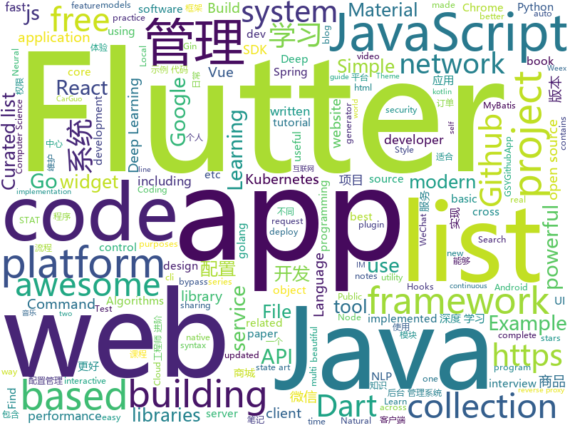

# 2019-01-07
See what the GitHub community is most excited about today.

## python
* [uncaptcha2](https://github.com/ecthros/uncaptcha2)(**493 stars today**): defeating the latest version of ReCaptcha with 91% accuracy
* [litecli](https://github.com/dbcli/litecli)(**250 stars today**): CLI for SQLite Databases with auto-completion and syntax highlighting
* [12306](https://github.com/testerSunshine/12306)(**204 stars today**): 12306智能刷票，订票
* [edge-connect](https://github.com/knazeri/edge-connect)(**116 stars today**): EdgeConnect: Generative Image Inpainting with Adversarial Edge Learning. https://arxiv.org/abs/1901.00212
* [pycm](https://github.com/sepandhaghighi/pycm)(**80 stars today**): Multi-class confusion matrix library in Python
* [flair](https://github.com/zalandoresearch/flair)(**84 stars today**): A very simple framework for state-of-the-art Natural Language Processing (NLP)
* [system-design-primer](https://github.com/donnemartin/system-design-primer)(**59 stars today**): Learn how to design large-scale systems. Prep for the system design interview. Includes Anki flashcards.
* [sherlock](https://github.com/TheYahya/sherlock)(**57 stars today**): 🔎Find usernames across social networks
* [faceswap](https://github.com/deepfakes/faceswap)(**48 stars today**): Non official project based on original /r/Deepfakes thread. Many thanks to him!
* [awesome-python-applications](https://github.com/mahmoud/awesome-python-applications)(**50 stars today**): 💿Free software that works great, and also happens to be open-source Python.
* [models](https://github.com/tensorflow/models)(**37 stars today**): Models and examples built with TensorFlow
* [public-apis](https://github.com/toddmotto/public-apis)(**45 stars today**): A collective list of free APIs for use in software and web development.
* [youtube-dl](https://github.com/rg3/youtube-dl)(**42 stars today**): Command-line program to download videos from YouTube.com and other video sites
* [Python](https://github.com/TheAlgorithms/Python)(**35 stars today**): All Algorithms implemented in Python
* [bert](https://github.com/google-research/bert)(**32 stars today**): TensorFlow code and pre-trained models for BERT
* [awesome-python](https://github.com/vinta/awesome-python)(**32 stars today**): A curated list of awesome Python frameworks, libraries, software and resources
* [loguru](https://github.com/Delgan/loguru)(**34 stars today**): Python logging made (stupidly) simple
* [Python](https://github.com/geekcomputers/Python)(**32 stars today**): My Python Examples
* [kubeflow](https://github.com/kubeflow/kubeflow)(**33 stars today**): Machine Learning Toolkit for Kubernetes
* [pgcli](https://github.com/dbcli/pgcli)(**33 stars today**): Postgres CLI with autocompletion and syntax highlighting
* [home-assistant](https://github.com/home-assistant/home-assistant)(**25 stars today**): 🏡Open source home automation that puts local control and privacy first
* [python-prompt-toolkit](https://github.com/prompt-toolkit/python-prompt-toolkit)(**31 stars today**): Library for building powerful interactive command line applications in Python
* [d2l-en](https://github.com/d2l-ai/d2l-en)(**27 stars today**): Dive into Deep Learning, Berkeley STAT 157 (Spring 2019) textbook. With code, math, and discussions.
* [d2l-zh](https://github.com/d2l-ai/d2l-zh)(**25 stars today**): 《动手学深度学习》，英文版即伯克利深度学习（STAT 157，2019春）教材。面向中文读者、能运行、可讨论。
* [keras](https://github.com/keras-team/keras)(**20 stars today**): Deep Learning for humans

## java
* [JavaGuide](https://github.com/Snailclimb/JavaGuide)(**189 stars today**): 【Java学习+面试指南】 一份涵盖大部分Java程序员所需要掌握的核心知识。
* [advanced-java](https://github.com/doocs/advanced-java)(**113 stars today**): 😮互联网 Java 工程师进阶知识完全扫盲
* [mall](https://github.com/macrozheng/mall)(**66 stars today**): mall项目是一套电商系统，包括前台商城系统及后台管理系统，基于SpringBoot+MyBatis实现。 前台商城系统包含首页门户、商品推荐、商品搜索、商品展示、购物车、订单流程、会员中心、客户服务、帮助中心等模块。 后台管理系统包含商品管理、订单管理、会员管理、促销管理、运营管理、内容管理、统计报表、财务管理、权限管理、设置等模块。
* [miaosha](https://github.com/qiurunze123/miaosha)(**56 stars today**): 😮😮秒杀系统设计与实现.互联网工程师进阶与分析🙋🐓
* [tutorials](https://github.com/eugenp/tutorials)(**35 stars today**): The "REST With Spring" Course:
* [cim](https://github.com/crossoverJie/cim)(**35 stars today**): 📲cim(cross IM) 适用于开发者的即时通讯系统
* [symphony](https://github.com/b3log/symphony)(**32 stars today**): 🎶一款用 Java 实现的现代化社区（论坛/BBS/社交网络/博客）平台。https://hacpai.com
* [spring-boot](https://github.com/spring-projects/spring-boot)(**24 stars today**): Spring Boot
* [Java](https://github.com/TheAlgorithms/Java)(**24 stars today**): All Algorithms implemented in Java
* [spring-framework](https://github.com/spring-projects/spring-framework)(**17 stars today**): Spring Framework
* [elasticsearch](https://github.com/elastic/elasticsearch)(**16 stars today**): Open Source, Distributed, RESTful Search Engine
* [matrix](https://github.com/Tencent/matrix)(**17 stars today**): Matrix is a plugin style, non-invasive APM system developed by WeChat.
* [mybatis-boost](https://github.com/zhang-rf/mybatis-boost)(**17 stars today**): Boost your mybatis sql developing experience
* [JCSprout](https://github.com/crossoverJie/JCSprout)(**14 stars today**): 👨‍🎓Java Core Sprout : basic, concurrent, algorithm
* [apollo](https://github.com/ctripcorp/apollo)(**14 stars today**): Apollo（阿波罗）是携程框架部门研发的分布式配置中心，能够集中化管理应用不同环境、不同集群的配置，配置修改后能够实时推送到应用端，并且具备规范的权限、流程治理等特性，适用于微服务配置管理场景。
* [incubator-dubbo](https://github.com/apache/incubator-dubbo)(**11 stars today**): Apache Dubbo (incubating) is a high-performance, java based, open source RPC framework.
* [WxJava](https://github.com/Wechat-Group/WxJava)(**14 stars today**): WxJava （微信开发 Java SDK），支持包括微信支付、开放平台、小程序、企业微信/企业号和公众号等的后端开发
* [guava](https://github.com/google/guava)(**13 stars today**): Google core libraries for Java
* [litemall](https://github.com/linlinjava/litemall)(**12 stars today**): 又一个小商城。litemall = Spring Boot后端 + Vue管理员前端 + 微信小程序用户前端
* [netty](https://github.com/netty/netty)(**10 stars today**): Netty project - an event-driven asynchronous network application framework
* [Magisk](https://github.com/topjohnwu/Magisk)(**12 stars today**): A Magic Mask to Alter Android System Systemless-ly
* [arthas](https://github.com/alibaba/arthas)(**12 stars today**): Alibaba Java Diagnostic Tool Arthas/Alibaba Java诊断利器Arthas
* [nacos](https://github.com/alibaba/nacos)(**12 stars today**): an easy-to-use dynamic service discovery, configuration and service management platform for building cloud native applications(更易于构建云原生应用的动态服务发现、配置管理和服务管理平台)
* [okhttp](https://github.com/square/okhttp)(**13 stars today**): An HTTP+HTTP/2 client for Android and Java applications.
* [flink](https://github.com/apache/flink)(**9 stars today**): Apache Flink

## unknown
* [CS-Notes](https://github.com/CyC2018/CS-Notes)(**162 stars today**): 📚Computer Science Learning Notes
* [algorithms](https://github.com/jeffgerickson/algorithms)(**167 stars today**): Bug-tracking for Jeff's algorithms book, notes, etc.
* [awesome-interview-questions](https://github.com/MaximAbramchuck/awesome-interview-questions)(**161 stars today**): A curated awesome list of lists of interview questions. Feel free to contribute!🎓
* [pwc](https://github.com/zziz/pwc)(**124 stars today**): Papers with code. Sorted by stars. Updated weekly.
* [Girls-In-AI](https://github.com/YZHANG1270/Girls-In-AI)(**97 stars today**): Coding is the new sexy.
* [the-book-of-secret-knowledge](https://github.com/trimstray/the-book-of-secret-knowledge)(**67 stars today**): 💫A collection of awesome lists, manuals, blogs, hacks, one-liners, cli/web tools and more. Especially for System and Network Administrators, DevOps, Pentesters or Security Researchers.
* [developer-roadmap](https://github.com/kamranahmedse/developer-roadmap)(**62 stars today**): Roadmap to becoming a web developer in 2019
* [awesome](https://github.com/sindresorhus/awesome)(**60 stars today**): 😎Curated list of awesome lists
* [You-Dont-Know-JS](https://github.com/getify/You-Dont-Know-JS)(**47 stars today**): A book series on JavaScript. @YDKJS on twitter.
* [gitignore](https://github.com/github/gitignore)(**34 stars today**): A collection of useful .gitignore templates
* [runjs](https://github.com/lukehaas/runjs)(**38 stars today**): A JavaScript playground that auto-evaluates you type
* [remote-working](https://github.com/greatghoul/remote-working)(**37 stars today**): 收集整理远程工作相关的资料
* [stanford-cs-230-deep-learning](https://github.com/afshinea/stanford-cs-230-deep-learning)(**28 stars today**): VIP cheatsheets for Stanford's CS 230 Deep Learning
* [project-based-learning](https://github.com/tuvtran/project-based-learning)(**31 stars today**): Curated list of project-based tutorials
* [awesome-vue](https://github.com/vuejs/awesome-vue)(**32 stars today**): 🎉A curated list of awesome things related to Vue.js
* [deep_learning_object_detection](https://github.com/hoya012/deep_learning_object_detection)(**31 stars today**): A paper list of object detection using deep learning.
* [free-programming-books](https://github.com/EbookFoundation/free-programming-books)(**29 stars today**): 📚Freely available programming books
* [Best-websites-a-programmer-should-visit](https://github.com/sdmg15/Best-websites-a-programmer-should-visit)(**26 stars today**): 🔗Some useful websites for programmers.
* [GNNPapers](https://github.com/thunlp/GNNPapers)(**22 stars today**): Must-read papers on graph neural networks (GNN)
* [Windows-Kernel-Explorer](https://github.com/AxtMueller/Windows-Kernel-Explorer)(**21 stars today**): A free but powerful Windows kernel research tool
* [trackerslist](https://github.com/ngosang/trackerslist)(**22 stars today**): An updated list of public BitTorrent trackers
* [kubernetes-the-hard-way](https://github.com/kelseyhightower/kubernetes-the-hard-way)(**20 stars today**): Bootstrap Kubernetes the hard way on Google Cloud Platform. No scripts.
* [hosts](https://github.com/googlehosts/hosts)(**19 stars today**): 镜像：https://coding.net/u/scaffrey/p/hosts/git
* [awesome-mlss](https://github.com/sshkhr/awesome-mlss)(**22 stars today**): List of summer schools in machine learning + related fields across the globe
* [computer-science](https://github.com/ossu/computer-science)(**21 stars today**): 🎓Path to a free self-taught education in Computer Science!

## javascript
* [deeptraffic](https://github.com/lexfridman/deeptraffic)(**298 stars today**): DeepTraffic is a deep reinforcement learning competition, part of the MIT Deep Learning series.
* [string-similarity](https://github.com/aceakash/string-similarity)(**177 stars today**): Finds degree of similarity between two strings, based on Dice's Coefficient, which is mostly better than Levenshtein distance.
* [fbt](https://github.com/facebookincubator/fbt)(**171 stars today**): A JavaScript Internationalization Framework
* [react-with-gesture](https://github.com/drcmda/react-with-gesture)(**138 stars today**): 👇Bread n butter utility for component-tied mouse/touch gestures in React
* [learn-json-web-tokens](https://github.com/dwyl/learn-json-web-tokens)(**124 stars today**): 🔐Learn how to use JSON Web Token (JWT) to secure your next Web App! (Tutorial/Example with Tests!!)
* [Here](https://github.com/caijinyc/Here)(**114 stars today**): Here Music 一个 使用 Electron + React 开发的音乐客户端
* [doom-fire-algorithm](https://github.com/filipedeschamps/doom-fire-algorithm)(**111 stars today**): Fire effect from Doom implemented in plain JavaScript
* [create-react-app](https://github.com/facebook/create-react-app)(**65 stars today**): Set up a modern web app by running one command.
* [jetpack](https://github.com/KidkArolis/jetpack)(**69 stars today**): 🚀Jetpack – webpack made more convenient.
* [vue](https://github.com/vuejs/vue)(**65 stars today**): 🖖Vue.js is a progressive, incrementally-adoptable JavaScript framework for building UI on the web.
* [omniclone](https://github.com/jfet97/omniclone)(**63 stars today**): An isomorphic and configurable javascript utility for objects deep cloning.
* [30-seconds-of-code](https://github.com/30-seconds/30-seconds-of-code)(**58 stars today**): Curated collection of useful JavaScript snippets that you can understand in 30 seconds or less.
* [react](https://github.com/facebook/react)(**56 stars today**): A declarative, efficient, and flexible JavaScript library for building user interfaces.
* [lit-vue](https://github.com/egoist/lit-vue)(**58 stars today**): 🔥Vue SFC goodies directly in JavaScript files.
* [react-katas](https://github.com/luismartinezs/react-katas)(**50 stars today**): Each folder contains a "kata" to practice a specific technique of intermediate to advanced React
* [linaria](https://github.com/callstack/linaria)(**49 stars today**): Zero-runtime CSS in JS library
* [nodebestpractices](https://github.com/i0natan/nodebestpractices)(**47 stars today**): The largest Node.js best practices list (January 2019)
* [gatsby](https://github.com/gatsbyjs/gatsby)(**40 stars today**): Build blazing fast, modern apps and websites with React
* [33-js-concepts](https://github.com/leonardomso/33-js-concepts)(**44 stars today**): 📜33 concepts every JavaScript developer should know.
* [codelf](https://github.com/unbug/codelf)(**39 stars today**): Best GitHub stars, repositories tagger and organizer. Search over projects from Github, Bitbucket, Google Code, Codeplex, Sourceforge, Fedora Project, GitLab to find real-world usage variable names
* [blog-html-to-pdf](https://github.com/xiaohanyu/blog-html-to-pdf)(**39 stars today**): A sample program to convert blog website to merged pdf.
* [FromJS](https://github.com/mattzeunert/FromJS)(**38 stars today**): See where each character on the screen came from in code.
* [simple-redux](https://github.com/eddyerburgh/simple-redux)(**36 stars today**): A bare-bones redux implementation for teaching purposes
* [NeteaseCloudMusicApi](https://github.com/Binaryify/NeteaseCloudMusicApi)(**32 stars today**): 网易云音乐 Node.js API service
* [brain.js](https://github.com/BrainJS/brain.js)(**33 stars today**): 🤖Neural networks in JavaScript

## html
* [build-your-own-mint](https://github.com/yyx990803/build-your-own-mint)(**531 stars today**): Build your own personal finance analytics using Plaid, Google Sheets and CircleCI.
* [dimage.js](https://github.com/jjkaufman/dimage.js)(**33 stars today**): Never settle for two dimensions
* [Coursera-ML-AndrewNg-Notes](https://github.com/fengdu78/Coursera-ML-AndrewNg-Notes)(**13 stars today**): 吴恩达老师的机器学习课程个人笔记
* [home_assistant](https://github.com/seangreen2/home_assistant)(**14 stars today**): 
* [OSCP-Prep](https://github.com/RustyShackleford221/OSCP-Prep)(**12 stars today**): A comprehensive guide/material for anyone looking to get into infosec or take the OSCP exam
* [AdminLTE](https://github.com/almasaeed2010/AdminLTE)(**11 stars today**): AdminLTE - Free Premium Admin control Panel Theme Based On Bootstrap 3.x
* [Front-end-Developer-Interview-Questions](https://github.com/h5bp/Front-end-Developer-Interview-Questions)(**11 stars today**): A list of helpful front-end related questions you can use to interview potential candidates, test yourself or completely ignore.
* [awesome-modern-cpp](https://github.com/rigtorp/awesome-modern-cpp)(**12 stars today**): A collection of resources on modern C++
* [JavaScript30](https://github.com/wesbos/JavaScript30)(**7 stars today**): 30 Day Vanilla JS Challenge
* [fastText](https://github.com/facebookresearch/fastText)(**10 stars today**): Library for fast text representation and classification.
* [portainer](https://github.com/portainer/portainer)(**8 stars today**): Simple management UI for Docker
* [NLP-progress](https://github.com/sebastianruder/NLP-progress)(**8 stars today**): Repository to track the progress in Natural Language Processing (NLP), including the datasets and the current state-of-the-art for the most common NLP tasks.
* [cs231n.github.io](https://github.com/cs231n/cs231n.github.io)(**8 stars today**): Public facing notes page
* [dont-kill-my-app](https://github.com/urbandroid-team/dont-kill-my-app)(**8 stars today**): Android vendors, don't kill my app!
* [styleguide](https://github.com/google/styleguide)(**6 stars today**): Style guides for Google-originated open-source projects
* [nginxconfig.io](https://github.com/valentinxxx/nginxconfig.io)(**7 stars today**): ⚙️NGiИX config generator generator on steroids💉
* [Spoon-Knife](https://github.com/octocat/Spoon-Knife)(****): This repo is for demonstration purposes only.
* [now-github-starter](https://github.com/zeit/now-github-starter)(****): Starter project to demonstrate a project whose pull requests get automatically deployed
* [deeplearning_ai_books](https://github.com/fengdu78/deeplearning_ai_books)(**6 stars today**): deeplearning.ai（吴恩达老师的深度学习课程笔记及资源）
* [GTFOBins.github.io](https://github.com/GTFOBins/GTFOBins.github.io)(**6 stars today**): Curated list of Unix binaries that can be exploited to bypass system security restrictions
* [swagger-codegen](https://github.com/swagger-api/swagger-codegen)(**5 stars today**): swagger-codegen contains a template-driven engine to generate documentation, API clients and server stubs in different languages by parsing your OpenAPI / Swagger definition.
* [mkdocs-material](https://github.com/squidfunk/mkdocs-material)(**5 stars today**): A Material Design theme for MkDocs
* [Iosevka](https://github.com/be5invis/Iosevka)(**5 stars today**): Slender typeface for code, from code.
* [Dozer](https://github.com/Mortennn/Dozer)(**5 stars today**): Hide MacOS menubar items.
* [EIPs](https://github.com/ethereum/EIPs)(**5 stars today**): The Ethereum Improvement Proposal repository

## dart
* [flutter](https://github.com/flutter/flutter)(**71 stars today**): Flutter makes it easy and fast to build beautiful mobile apps.
* [awesome-flutter](https://github.com/Solido/awesome-flutter)(**45 stars today**): An awesome list that curates the best Flutter libraries, tools, tutorials, articles and more.
* [GSYGithubAppFlutter](https://github.com/CarGuo/GSYGithubAppFlutter)(**15 stars today**): 超完整的Flutter项目，功能丰富，适合学习和日常使用。GSYGithubApp系列的优势：我们目前已经拥有Flutter、Weex、ReactNative、kotlin 四个版本。 功能齐全，项目框架内技术涉及面广，完成度高，持续维护，配套文章，适合全面学习，对比参考。跨平台的开源Github客户端App，更好的体验，更丰富的功能，旨在更好的日常管理和维护个人Github，提供更好更方便的驾车体验Σ(￣。￣ﾉ)ﾉ。同款Weex版本 ： https://github.com/CarGuo/GSYGithubAppWeex 、同款React Native版本 ： https://github.com/CarGuo/GSYGithubApp 、原生 kotlin 版本 https://g…
* [flutter-examples](https://github.com/nisrulz/flutter-examples)(**12 stars today**): [Examples] Simple basic isolated apps, for budding flutter devs.
* [plugins](https://github.com/flutter/plugins)(**10 stars today**): Plugins for Flutter, including FlutterFire, maintained by the Flutter team
* [sdk](https://github.com/dart-lang/sdk)(**11 stars today**): The Dart SDK, including the VM, dart2js, core libraries, and more.
* [flutter_architecture_samples](https://github.com/brianegan/flutter_architecture_samples)(**9 stars today**): TodoMVC for Flutter
* [Flutter-learning](https://github.com/AweiLoveAndroid/Flutter-learning)(**9 stars today**): 🔥👍🌟⭐️⭐️⭐️Flutter安装和配置，Flutter开发遇到的难题，Flutter示例代码和模板，Flutter项目实战，Dart语言学习示例代码。
* [Flare-Flutter](https://github.com/2d-inc/Flare-Flutter)(**9 stars today**): 
* [flutter_hooks](https://github.com/rrousselGit/flutter_hooks)(**8 stars today**): React hooks for Flutter. Hooks are a new kind of object that manages a Widget life-cycles. They are used to increase code sharing between widgets and as a complete replacement for StatefulWidget.
* [samples](https://github.com/flutter/samples)(**7 stars today**): A collection of Flutter examples and demos.
* [flutter-ui-nice](https://github.com/nb312/flutter-ui-nice)(**5 stars today**): More than 130+ pages in this beautiful app and more than 45 developers has contributed to it.
* [dio](https://github.com/flutterchina/dio)(**5 stars today**): A powerful Http client for Dart, which supports Interceptors, FormData, Request Cancellation, File Downloading, Timeout etc.
* [fluwx](https://github.com/OpenFlutter/fluwx)(**5 stars today**): Flutter版微信SDK.WeChat SDK for flutter.
* [flutter_experiment_phone_ide](https://github.com/Norbert515/flutter_experiment_phone_ide)(**5 stars today**): An experimental way to change Flutter source-code in Flutter itself.
* [flutter-canvas](https://github.com/FlutterOpen/flutter-canvas)(**5 stars today**): About using of canvas in the flutter
* [twitter.dart](https://github.com/sh4869/twitter.dart)(****): Twitter API Library in Dart
* [flutter_html](https://github.com/Sub6Resources/flutter_html)(****): A Flutter widget for rendering static html as Flutter widgets (Will render over 70 different html tags!)
* [dart-sass](https://github.com/sass/dart-sass)(****): The reference implementation of Sass, written in Dart.
* [material-components-flutter-codelabs](https://github.com/material-components/material-components-flutter-codelabs)(****): Codelabs for Material Components for Flutter (MDC-Flutter)
* [chromedeveditor](https://github.com/googlearchive/chromedeveditor)(****): Chrome Dev Editor is a developer tool for building apps on the Chrome platform - Chrome Apps and Web Apps, in JavaScript or Dart. (NO LONGER IN ACTIVE DEVELOPMENT)
* [FlutterExampleApps](https://github.com/iampawan/FlutterExampleApps)(****): [Example APPS] Basic Flutter apps, for flutter devs.
* [HistoryOfEverything](https://github.com/2d-inc/HistoryOfEverything)(****): Flutter Launch Timeline Demo
* [Flutter-UI-Kit](https://github.com/iampawan/Flutter-UI-Kit)(****): Flutter app for collection of UI in a UIKit
* [inKino](https://github.com/roughike/inKino)(****): A multiplatform Dart movie app with 40% of code sharing between Flutter and the Web.

## go
* [tilt](https://github.com/windmilleng/tilt)(**407 stars today**): Local Kubernetes development with no stress
* [Modlishka](https://github.com/drk1wi/Modlishka)(**129 stars today**): Modlishka. Reverse Proxy. Phishing NG.
* [skipper](https://github.com/zalando/skipper)(**121 stars today**): An HTTP router and reverse proxy for service composition, including use cases like Kubernetes Ingress
* [dragonboat](https://github.com/lni/dragonboat)(**109 stars today**): Dragonboat is a feature complete and high performance multi-group Raft library in Go.
* [gaia](https://github.com/gaia-pipeline/gaia)(**95 stars today**): Build powerful pipelines in any programming language.
* [txqr](https://github.com/divan/txqr)(**68 stars today**): Transfer data via animated QR codes
* [go](https://github.com/golang/go)(**44 stars today**): The Go programming language
* [syncthing](https://github.com/syncthing/syncthing)(**41 stars today**): Open Source Continuous File Synchronization
* [kubernetes](https://github.com/kubernetes/kubernetes)(**39 stars today**): Production-Grade Container Scheduling and Management
* [go-micro](https://github.com/micro/go-micro)(**36 stars today**): A microservice framework
* [meq](https://github.com/mafanr/meq)(**32 stars today**): A modern messaging platform for Message Push、IM、IoT etc, based on MQTT protocol
* [loki](https://github.com/grafana/loki)(**33 stars today**): Like Prometheus, but for logs.
* [hugo](https://github.com/gohugoio/hugo)(**32 stars today**): The world’s fastest framework for building websites.
* [dque](https://github.com/joncrlsn/dque)(**24 stars today**): dque is a fast, embedded, durable queue for Go
* [caddy](https://github.com/mholt/caddy)(**21 stars today**): Fast, cross-platform HTTP/2 web server with automatic HTTPS
* [fyne](https://github.com/fyne-io/fyne)(**20 stars today**): Cross platform GUI in Go based on Material Design
* [ecs-deploy](https://github.com/in4it/ecs-deploy)(**19 stars today**): ecs-deploy is a continuous deployment platform for AWS ECS. It automates deploys based a simple json/yaml file which can be integrated in your CI/CD
* [helm](https://github.com/helm/helm)(**17 stars today**): The Kubernetes Package Manager
* [v2ray-core](https://github.com/v2ray/v2ray-core)(**16 stars today**): A platform for building proxies to bypass network restrictions.
* [gogs](https://github.com/gogs/gogs)(**17 stars today**): Gogs is a painless self-hosted Git service.
* [redix](https://github.com/alash3al/redix)(**19 stars today**): a persistent real-time key-value store, with the same redis protocol with powerful features
* [merlin](https://github.com/Ne0nd0g/merlin)(**18 stars today**): Merlin is a cross-platform post-exploitation HTTP/2 Command & Control server and agent written in golang.
* [gin](https://github.com/gin-gonic/gin)(**17 stars today**): Gin is a HTTP web framework written in Go (Golang). It features a Martini-like API with much better performance -- up to 40 times faster. If you need smashing performance, get yourself some Gin.
* [build-web-application-with-golang](https://github.com/astaxie/build-web-application-with-golang)(**14 stars today**): A golang ebook intro how to build a web with golang
* [tldr](https://github.com/isacikgoz/tldr)(**15 stars today**): fast and interactive tldr client written with go

## WordCloud

