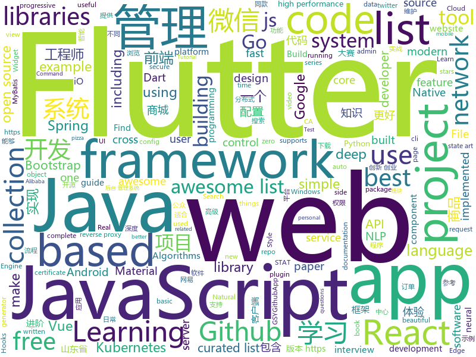

# 2019-01-08
See what the GitHub community is most excited about today.

## python
* [12306](https://github.com/testerSunshine/12306)(**414 stars today**): 12306智能刷票，订票
* [uncaptcha2](https://github.com/ecthros/uncaptcha2)(**433 stars today**): defeating the latest version of ReCaptcha with 91% accuracy
* [walle-web](https://github.com/meolu/walle-web)(**332 stars today**): walle - 瓦力 开源项目代码部署平台
* [litecli](https://github.com/dbcli/litecli)(**141 stars today**): CLI for SQLite Databases with auto-completion and syntax highlighting
* [flair](https://github.com/zalandoresearch/flair)(**132 stars today**): A very simple framework for state-of-the-art Natural Language Processing (NLP)
* [CopyTranslator](https://github.com/elliottzheng/CopyTranslator)(**128 stars today**): Foreign paper reading and translation assistant based on copy and translate.(Latest: v0.0.7-Kylin-RC1)
* [edge-connect](https://github.com/knazeri/edge-connect)(**96 stars today**): EdgeConnect: Generative Image Inpainting with Adversarial Edge Learning. https://arxiv.org/abs/1901.00212
* [d2l-en](https://github.com/d2l-ai/d2l-en)(**86 stars today**): Dive into Deep Learning, Berkeley STAT 157 (Spring 2019) textbook. With code, math, and discussions.
* [awesome-python-applications](https://github.com/mahmoud/awesome-python-applications)(**88 stars today**): 💿Free software that works great, and also happens to be open-source Python.
* [models](https://github.com/tensorflow/models)(**64 stars today**): Models and examples built with TensorFlow
* [faceswap](https://github.com/deepfakes/faceswap)(**68 stars today**): Non official project based on original /r/Deepfakes thread. Many thanks to him!
* [bert](https://github.com/google-research/bert)(**73 stars today**): TensorFlow code and pre-trained models for BERT
* [d2l-zh](https://github.com/d2l-ai/d2l-zh)(**73 stars today**): 《动手学深度学习》，英文版即伯克利深度学习（STAT 157，2019春）教材。面向中文读者、能运行、可讨论。
* [public-apis](https://github.com/toddmotto/public-apis)(**72 stars today**): A collective list of free APIs for use in software and web development.
* [system-design-primer](https://github.com/donnemartin/system-design-primer)(**61 stars today**): Learn how to design large-scale systems. Prep for the system design interview. Includes Anki flashcards.
* [awesome-python](https://github.com/vinta/awesome-python)(**61 stars today**): A curated list of awesome Python frameworks, libraries, software and resources
* [sherlock](https://github.com/TheYahya/sherlock)(**63 stars today**): 🔎Find usernames across social networks
* [face.evoLVe.PyTorch](https://github.com/ZhaoJ9014/face.evoLVe.PyTorch)(**59 stars today**): 🔥🔥High-Performance Face Recognition Library on PyTorch🔥🔥
* [mindsdb](https://github.com/mindsdb/mindsdb)(**60 stars today**): Framework to streamline use of neural networks
* [SlackPirate](https://github.com/emtunc/SlackPirate)(**53 stars today**): Slack Enumeration and Extraction Tool - extract sensitive information from a Slack Workspace
* [keras](https://github.com/keras-team/keras)(**47 stars today**): Deep Learning for humans
* [youtube-dl](https://github.com/rg3/youtube-dl)(**50 stars today**): Command-line program to download videos from YouTube.com and other video sites
* [WeRoBot](https://github.com/offu/WeRoBot)(**48 stars today**): WeRoBot 是一个微信公众号开发框架
* [Python](https://github.com/TheAlgorithms/Python)(**44 stars today**): All Algorithms implemented in Python
* [flask](https://github.com/pallets/flask)(****): The Python micro framework for building web applications.

## java
* [JavaGuide](https://github.com/Snailclimb/JavaGuide)(**282 stars today**): 【Java学习+面试指南】 一份涵盖大部分Java程序员所需要掌握的核心知识。
* [advanced-java](https://github.com/doocs/advanced-java)(**161 stars today**): 😮互联网 Java 工程师进阶知识完全扫盲
* [miaosha](https://github.com/qiurunze123/miaosha)(**135 stars today**): 😮😮秒杀系统设计与实现.互联网工程师进阶与分析🙋🐓
* [mall](https://github.com/macrozheng/mall)(**97 stars today**): mall项目是一套电商系统，包括前台商城系统及后台管理系统，基于SpringBoot+MyBatis实现。 前台商城系统包含首页门户、商品推荐、商品搜索、商品展示、购物车、订单流程、会员中心、客户服务、帮助中心等模块。 后台管理系统包含商品管理、订单管理、会员管理、促销管理、运营管理、内容管理、统计报表、财务管理、权限管理、设置等模块。
* [tutorials](https://github.com/eugenp/tutorials)(**51 stars today**): The "REST With Spring" Course:
* [cim](https://github.com/crossoverJie/cim)(**61 stars today**): 📲cim(cross IM) 适用于开发者的即时通讯系统
* [arthas](https://github.com/alibaba/arthas)(**58 stars today**): Alibaba Java Diagnostic Tool Arthas/Alibaba Java诊断利器Arthas
* [spring-boot](https://github.com/spring-projects/spring-boot)(**46 stars today**): Spring Boot
* [elasticsearch](https://github.com/elastic/elasticsearch)(**48 stars today**): Open Source, Distributed, RESTful Search Engine
* [symphony](https://github.com/b3log/symphony)(**42 stars today**): 🎶一款用 Java 实现的现代化社区（论坛/BBS/社交网络/博客）平台。https://hacpai.com
* [matrix](https://github.com/Tencent/matrix)(**44 stars today**): Matrix is a plugin style, non-invasive APM system developed by WeChat.
* [WxJava](https://github.com/Wechat-Group/WxJava)(**39 stars today**): WxJava （微信开发 Java SDK），支持包括微信支付、开放平台、小程序、企业微信/企业号和公众号等的后端开发
* [Java](https://github.com/TheAlgorithms/Java)(**33 stars today**): All Algorithms implemented in Java
* [JCSprout](https://github.com/crossoverJie/JCSprout)(**36 stars today**): 👨‍🎓Java Core Sprout : basic, concurrent, algorithm
* [spring-framework](https://github.com/spring-projects/spring-framework)(**28 stars today**): Spring Framework
* [incubator-dubbo](https://github.com/apache/incubator-dubbo)(**29 stars today**): Apache Dubbo (incubating) is a high-performance, java based, open source RPC framework.
* [litemall](https://github.com/linlinjava/litemall)(**32 stars today**): 又一个小商城。litemall = Spring Boot后端 + Vue管理员前端 + 微信小程序用户前端
* [apollo](https://github.com/ctripcorp/apollo)(**28 stars today**): Apollo（阿波罗）是携程框架部门研发的分布式配置中心，能够集中化管理应用不同环境、不同集群的配置，配置修改后能够实时推送到应用端，并且具备规范的权限、流程治理等特性，适用于微服务配置管理场景。
* [Doctor](https://github.com/yueshutong/Doctor)(**29 stars today**): 基于知识图谱的分布式智能医疗诊断系统（提供医生机器人的实现方案）（获山东省大学生软件大赛一等奖、山东省大学生移动互联创新创业大赛二等奖、山东省新动能软件创新创业大赛三等奖）
* [guava](https://github.com/google/guava)(**25 stars today**): Google core libraries for Java
* [AndroidUtilCode](https://github.com/Blankj/AndroidUtilCode)(**26 stars today**): 🔥Android developers should collect the following utils(updating).
* [selenium](https://github.com/SeleniumHQ/selenium)(**25 stars today**): A browser automation framework and ecosystem.
* [SpringCloudLearning](https://github.com/forezp/SpringCloudLearning)(**22 stars today**): 《史上最简单的Spring Cloud教程源码》
* [mybatis-boost](https://github.com/zhang-rf/mybatis-boost)(**22 stars today**): Boost your mybatis sql developing experience
* [lottie-android](https://github.com/airbnb/lottie-android)(**19 stars today**): Render After Effects animations natively on Android and iOS, Web, and React Native

## unknown
* [pizza-dough](https://github.com/hendricius/pizza-dough)(**394 stars today**): This recipe is dedicated to helping you make the best possible pizza dough for Neapolitan pizza.
* [ChinaMobilePhoneNumberRegex](https://github.com/VincentSit/ChinaMobilePhoneNumberRegex)(**365 stars today**): Regular expressions that match the mobile phone number in mainland China. / 一组匹配中国大陆手机号码的正则表达式。
* [CS-Notes](https://github.com/CyC2018/CS-Notes)(**233 stars today**): 📚Computer Science Learning Notes
* [awesome-interview-questions](https://github.com/MaximAbramchuck/awesome-interview-questions)(**216 stars today**): A curated awesome list of lists of interview questions. Feel free to contribute!🎓
* [Biu-blog](https://github.com/CommanderXL/Biu-blog)(**208 stars today**): 个人博客
* [developer-roadmap](https://github.com/kamranahmedse/developer-roadmap)(**134 stars today**): Roadmap to becoming a web developer in 2019
* [pwc](https://github.com/zziz/pwc)(**115 stars today**): Papers with code. Sorted by stars. Updated weekly.
* [the-book-of-secret-knowledge](https://github.com/trimstray/the-book-of-secret-knowledge)(**96 stars today**): 💫A collection of awesome lists, manuals, blogs, hacks, one-liners, cli/web tools and more. Especially for System and Network Administrators, DevOps, Pentesters or Security Researchers.
* [Adult](https://github.com/no-Dark/Adult)(**86 stars today**): 
* [You-Dont-Know-JS](https://github.com/getify/You-Dont-Know-JS)(**94 stars today**): A book series on JavaScript. @YDKJS on twitter.
* [free-programming-books](https://github.com/EbookFoundation/free-programming-books)(**84 stars today**): 📚Freely available programming books
* [blog](https://github.com/yygmind/blog)(**91 stars today**): 我是木易杨，网易高级前端工程师，跟着我每周重点攻克一个前端面试重难点。接下来让我带你走进高级前端的世界，在进阶的路上，共勉！
* [toBeTopJavaer](https://github.com/hollischuang/toBeTopJavaer)(**82 stars today**): To Be Top Javaer - Java工程师成神之路
* [Girls-In-AI](https://github.com/YZHANG1270/Girls-In-AI)(**73 stars today**): Coding is the new sexy.
* [gitignore](https://github.com/github/gitignore)(**52 stars today**): A collection of useful .gitignore templates
* [GNNPapers](https://github.com/thunlp/GNNPapers)(**68 stars today**): Must-read papers on graph neural networks (GNN)
* [awesome](https://github.com/sindresorhus/awesome)(**57 stars today**): 😎Curated list of awesome lists
* [high-speed-downloader](https://github.com/high-speed-downloader/high-speed-downloader)(**55 stars today**): 百度网盘不限速下载 支持Windows和Mac 2018年1月16日更新
* [deep_learning_object_detection](https://github.com/hoya012/deep_learning_object_detection)(**47 stars today**): A paper list of object detection using deep learning.
* [react-typescript-cheatsheet](https://github.com/sw-yx/react-typescript-cheatsheet)(**44 stars today**): a cheatsheet for react users using typescript with react for the first (or nth!) time
* [spec](https://github.com/ulid/spec)(**44 stars today**): The canonical spec for ulid
* [runjs](https://github.com/lukehaas/runjs)(**44 stars today**): A JavaScript playground that auto-evaluates you type
* [awesome-vue](https://github.com/vuejs/awesome-vue)(**35 stars today**): 🎉A curated list of awesome things related to Vue.js
* [project-based-learning](https://github.com/tuvtran/project-based-learning)(**34 stars today**): Curated list of project-based tutorials
* [Awesome-Hacking](https://github.com/Hack-with-Github/Awesome-Hacking)(**29 stars today**): A collection of various awesome lists for hackers, pentesters and security researchers

## javascript
* [trilium](https://github.com/zadam/trilium)(**1,133 stars today**): Build your personal knowledge base with Trilium Notes
* [fbt](https://github.com/facebookincubator/fbt)(**263 stars today**): A JavaScript Internationalization Framework
* [deeptraffic](https://github.com/lexfridman/deeptraffic)(**238 stars today**): DeepTraffic is a deep reinforcement learning competition, part of the MIT Deep Learning series.
* [string-similarity](https://github.com/aceakash/string-similarity)(**235 stars today**): Finds degree of similarity between two strings, based on Dice's Coefficient, which is mostly better than Levenshtein distance.
* [codelf](https://github.com/unbug/codelf)(**230 stars today**): Best GitHub stars, repositories tagger and organizer. Search over projects from Github, Bitbucket, Google Code, Codeplex, Sourceforge, Fedora Project, GitLab to find real-world usage variable names
* [react-with-gesture](https://github.com/drcmda/react-with-gesture)(**200 stars today**): 👇Bread n butter utility for component-tied mouse/touch gestures in React
* [Here](https://github.com/caijinyc/Here)(**191 stars today**): Here Music 一个使用 Electron + React 开发的音乐客户端
* [next](https://github.com/alibaba-fusion/next)(**162 stars today**): A configurable component library for web built on React.
* [learn-json-web-tokens](https://github.com/dwyl/learn-json-web-tokens)(**153 stars today**): 🔐Learn how to use JSON Web Token (JWT) to secure your next Web App! (Tutorial/Example with Tests!!)
* [vue](https://github.com/vuejs/vue)(**137 stars today**): 🖖Vue.js is a progressive, incrementally-adoptable JavaScript framework for building UI on the web.
* [NeteaseCloudMusicApi](https://github.com/Binaryify/NeteaseCloudMusicApi)(**133 stars today**): 网易云音乐 Node.js API service
* [30-seconds-of-code](https://github.com/30-seconds/30-seconds-of-code)(**116 stars today**): Curated collection of useful JavaScript snippets that you can understand in 30 seconds or less.
* [nodebestpractices](https://github.com/i0natan/nodebestpractices)(**102 stars today**): The largest Node.js best practices list (January 2019)
* [jetpack](https://github.com/KidkArolis/jetpack)(**105 stars today**): 🚀Jetpack – webpack made more convenient.
* [react](https://github.com/facebook/react)(**91 stars today**): A declarative, efficient, and flexible JavaScript library for building user interfaces.
* [33-js-concepts](https://github.com/leonardomso/33-js-concepts)(**94 stars today**): 📜33 concepts every JavaScript developer should know.
* [linaria](https://github.com/callstack/linaria)(**97 stars today**): Zero-runtime CSS in JS library
* [create-react-app](https://github.com/facebook/create-react-app)(**79 stars today**): Set up a modern web app by running one command.
* [react-rewards](https://github.com/thedevelobear/react-rewards)(**88 stars today**): Reward your users for little things and make them smile!
* [javascript-algorithms](https://github.com/trekhleb/javascript-algorithms)(**76 stars today**): 📝Algorithms and data structures implemented in JavaScript with explanations and links to further readings
* [gatsby](https://github.com/gatsbyjs/gatsby)(**70 stars today**): Build blazing fast, modern apps and websites with React
* [brain.js](https://github.com/BrainJS/brain.js)(**73 stars today**): 🤖Neural networks in JavaScript
* [awesome-wechat-weapp](https://github.com/justjavac/awesome-wechat-weapp)(**58 stars today**): 微信小程序开发资源汇总💯
* [javascript](https://github.com/airbnb/javascript)(**56 stars today**): JavaScript Style Guide
* [lit-vue](https://github.com/egoist/lit-vue)(**61 stars today**): 🔥Vue SFC goodies directly in JavaScript files.

## html
* [build-your-own-mint](https://github.com/yyx990803/build-your-own-mint)(**620 stars today**): Build your own personal finance analytics using Plaid, Google Sheets and CircleCI.
* [OSCP-Prep](https://github.com/RustyShackleford221/OSCP-Prep)(**74 stars today**): A comprehensive guide/material for anyone looking to get into infosec or take the OSCP exam
* [bootstrap4_chinese](https://github.com/tmplink/bootstrap4_chinese)(**40 stars today**): Bootstrap4 Chinese documentation
* [home_assistant](https://github.com/seangreen2/home_assistant)(**34 stars today**): 
* [fastText](https://github.com/facebookresearch/fastText)(**28 stars today**): Library for fast text representation and classification.
* [Spoon-Knife](https://github.com/octocat/Spoon-Knife)(****): This repo is for demonstration purposes only.
* [Front-end-Developer-Interview-Questions](https://github.com/h5bp/Front-end-Developer-Interview-Questions)(**22 stars today**): A list of helpful front-end related questions you can use to interview potential candidates, test yourself or completely ignore.
* [ionic](https://github.com/ionic-team/ionic)(**18 stars today**): Build amazing native and progressive web apps with open web technologies. One app running on everything🎉
* [AdminLTE](https://github.com/almasaeed2010/AdminLTE)(**16 stars today**): AdminLTE - Free Premium Admin control Panel Theme Based On Bootstrap 3.x
* [styleguide](https://github.com/google/styleguide)(**18 stars today**): Style guides for Google-originated open-source projects
* [NLP-progress](https://github.com/sebastianruder/NLP-progress)(**18 stars today**): Repository to track the progress in Natural Language Processing (NLP), including the datasets and the current state-of-the-art for the most common NLP tasks.
* [flutter-in-action](https://github.com/flutterchina/flutter-in-action)(**16 stars today**): 《Flutter实战》电子书
* [website](https://github.com/kubernetes/website)(**11 stars today**): Kubernetes website and documentation repo:
* [JavaScript30](https://github.com/wesbos/JavaScript30)(**9 stars today**): 30 Day Vanilla JS Challenge
* [coreui-free-bootstrap-admin-template](https://github.com/coreui/coreui-free-bootstrap-admin-template)(**13 stars today**): CoreUI is free bootstrap admin template
* [dynamic-import-polyfill](https://github.com/uupaa/dynamic-import-polyfill)(**14 stars today**): Dynamic import() polyfill for browser.
* [nginxconfig.io](https://github.com/valentinxxx/nginxconfig.io)(**12 stars today**): ⚙️NGiИX config generator generator on steroids💉
* [cs231n.github.io](https://github.com/cs231n/cs231n.github.io)(**10 stars today**): Public facing notes page
* [portainer](https://github.com/portainer/portainer)(**10 stars today**): Simple management UI for Docker
* [electron-api-demos](https://github.com/electron/electron-api-demos)(**9 stars today**): Explore the Electron APIs
* [swagger-codegen](https://github.com/swagger-api/swagger-codegen)(**9 stars today**): swagger-codegen contains a template-driven engine to generate documentation, API clients and server stubs in different languages by parsing your OpenAPI / Swagger definition.
* [bootstrap-table](https://github.com/wenzhixin/bootstrap-table)(**8 stars today**): An extended Bootstrap table with radio, checkbox, sort, pagination, and other added features. (supports twitter bootstrap v2, v3 and v4)
* [dev-tips](https://github.com/HomoEfficio/dev-tips)(**8 stars today**): 개발하다 마주쳤던 작은 문제들과 해결 방법 정리
* [javascript-tutorial-en](https://github.com/iliakan/javascript-tutorial-en)(**8 stars today**): Modern JavaScript Tutorial
* [now-github-starter](https://github.com/zeit/now-github-starter)(****): Starter project to demonstrate a project whose pull requests get automatically deployed

## dart
* [Flutter-CuriosityApp](https://github.com/xumaohuai/Flutter-CuriosityApp)(**237 stars today**): Flutter高仿好奇心日报
* [flutter](https://github.com/flutter/flutter)(**137 stars today**): Flutter makes it easy and fast to build beautiful mobile apps.
* [awesome-flutter](https://github.com/Solido/awesome-flutter)(**71 stars today**): An awesome list that curates the best Flutter libraries, tools, tutorials, articles and more.
* [Flare-Flutter](https://github.com/2d-inc/Flare-Flutter)(**28 stars today**): 
* [samples](https://github.com/flutter/samples)(**22 stars today**): A collection of Flutter examples and demos.
* [plugins](https://github.com/flutter/plugins)(**17 stars today**): Plugins for Flutter, including FlutterFire, maintained by the Flutter team
* [avflutter](https://github.com/wqandroid/avflutter)(**19 stars today**): flutter av list project
* [GSYGithubAppFlutter](https://github.com/CarGuo/GSYGithubAppFlutter)(**18 stars today**): 超完整的Flutter项目，功能丰富，适合学习和日常使用。GSYGithubApp系列的优势：我们目前已经拥有Flutter、Weex、ReactNative、kotlin 四个版本。 功能齐全，项目框架内技术涉及面广，完成度高，持续维护，配套文章，适合全面学习，对比参考。跨平台的开源Github客户端App，更好的体验，更丰富的功能，旨在更好的日常管理和维护个人Github，提供更好更方便的驾车体验Σ(￣。￣ﾉ)ﾉ。同款Weex版本 ： https://github.com/CarGuo/GSYGithubAppWeex 、同款React Native版本 ： https://github.com/CarGuo/GSYGithubApp 、原生 kotlin 版本 https://g…
* [flutter-examples](https://github.com/nisrulz/flutter-examples)(**18 stars today**): [Examples] Simple basic isolated apps, for budding flutter devs.
* [flutter_architecture_samples](https://github.com/brianegan/flutter_architecture_samples)(**16 stars today**): TodoMVC for Flutter
* [dio](https://github.com/flutterchina/dio)(**13 stars today**): A powerful Http client for Dart, which supports Interceptors, FormData, Request Cancellation, File Downloading, Timeout etc.
* [flutter_staggered_grid_view](https://github.com/letsar/flutter_staggered_grid_view)(**13 stars today**): A Flutter staggered grid view
* [Flutter-learning](https://github.com/AweiLoveAndroid/Flutter-learning)(**10 stars today**): 🔥👍🌟⭐️⭐️⭐️Flutter安装和配置，Flutter开发遇到的难题，Flutter示例代码和模板，Flutter项目实战，Dart语言学习示例代码。
* [flutter_gank](https://github.com/lijinshanmx/flutter_gank)(**10 stars today**): 🔥「干货集中营」是一款注重体验的 Gank.io 官方客户端，App整体秉承Material简洁风格，包含搜索，收藏，提交干货，按期浏览、分类浏览等功能，还有漂亮的妹纸等你哦，快来下载吧~。【windows 上如果编译出现:FormatException: Bad UTF-8 encoding，请参考closed issue#2】,官网地址:
* [sdk](https://github.com/dart-lang/sdk)(**9 stars today**): The Dart SDK, including the VM, dart2js, core libraries, and more.
* [flutter-ui-nice](https://github.com/nb312/flutter-ui-nice)(**9 stars today**): More than 130+ pages in this beautiful app and more than 45 developers has contributed to it.
* [flutter-canvas](https://github.com/FlutterOpen/flutter-canvas)(**8 stars today**): About using of canvas in the flutter
* [bloc](https://github.com/felangel/bloc)(**8 stars today**): A collection of packages that help implement the BLoC design pattern
* [flutter_hooks](https://github.com/rrousselGit/flutter_hooks)(**8 stars today**): React hooks for Flutter. Hooks are a new kind of object that manages a Widget life-cycles. They are used to increase code sharing between widgets and as a complete replacement for StatefulWidget.
* [flutter_experiment_phone_ide](https://github.com/Norbert515/flutter_experiment_phone_ide)(**8 stars today**): An experimental way to change Flutter source-code in Flutter itself.
* [flame](https://github.com/luanpotter/flame)(**6 stars today**): A minimalist Flutter game engine
* [flutter_swiper](https://github.com/best-flutter/flutter_swiper)(**6 stars today**): The best swiper for flutter , with multiple layouts, infinite loop. Compatible with Android & iOS.
* [flutter_catalog](https://github.com/X-Wei/flutter_catalog)(**5 stars today**): An app showcasing Flutter components, with side-by-side source code view.
* [flutter_page_transition](https://github.com/kalismeras61/flutter_page_transition)(**5 stars today**): This is Flutter Page Transition Package
* [website](https://github.com/flutter/website)(****): Flutter web site

## go
* [mkcert](https://github.com/FiloSottile/mkcert)(**1,510 stars today**): A simple zero-config tool to make locally trusted development certificates with any names you'd like.
* [tilt](https://github.com/windmilleng/tilt)(**345 stars today**): Local Kubernetes development with no stress
* [Modlishka](https://github.com/drk1wi/Modlishka)(**269 stars today**): Modlishka. Reverse Proxy. Phishing NG.
* [dragonboat](https://github.com/lni/dragonboat)(**148 stars today**): Dragonboat is a feature complete and high performance multi-group Raft library in Go.
* [skipper](https://github.com/zalando/skipper)(**99 stars today**): An HTTP router and reverse proxy for service composition, including use cases like Kubernetes Ingress
* [kubernetes](https://github.com/kubernetes/kubernetes)(**83 stars today**): Production-Grade Container Scheduling and Management
* [gaia](https://github.com/gaia-pipeline/gaia)(**78 stars today**): Build powerful pipelines in any programming language.
* [txqr](https://github.com/divan/txqr)(**68 stars today**): Transfer data via animated QR codes
* [go](https://github.com/golang/go)(**61 stars today**): The Go programming language
* [Beaver](https://github.com/Clivern/Beaver)(**58 stars today**): 💨A Real Time Messaging Server.
* [loki](https://github.com/grafana/loki)(**54 stars today**): Like Prometheus, but for logs.
* [awesome-go](https://github.com/avelino/awesome-go)(**38 stars today**): A curated list of awesome Go frameworks, libraries and software
* [gin](https://github.com/gin-gonic/gin)(**39 stars today**): Gin is a HTTP web framework written in Go (Golang). It features a Martini-like API with much better performance -- up to 40 times faster. If you need smashing performance, get yourself some Gin.
* [hugo](https://github.com/gohugoio/hugo)(**39 stars today**): The world’s fastest framework for building websites.
* [kingbus](https://github.com/flike/kingbus)(**37 stars today**): A distributed MySQL binlog storage system built on Raft
* [minica](https://github.com/jsha/minica)(**38 stars today**): minica is a small, simple CA intended for use in situations where the CA operator also operates each host where a certificate will be used.
* [syncthing](https://github.com/syncthing/syncthing)(**35 stars today**): Open Source Continuous File Synchronization
* [istio](https://github.com/istio/istio)(**32 stars today**): Connect, secure, control, and observe services.
* [fyne](https://github.com/fyne-io/fyne)(**32 stars today**): Cross platform GUI in Go based on Material Design
* [go-micro](https://github.com/micro/go-micro)(**31 stars today**): A microservice framework
* [merlin](https://github.com/Ne0nd0g/merlin)(**28 stars today**): Merlin is a cross-platform post-exploitation HTTP/2 Command & Control server and agent written in golang.
* [traefik](https://github.com/containous/traefik)(**28 stars today**): The Cloud Native Edge Router
* [helm](https://github.com/helm/helm)(**26 stars today**): The Kubernetes Package Manager
* [gogs](https://github.com/gogs/gogs)(**27 stars today**): Gogs is a painless self-hosted Git service.
* [v2ray-core](https://github.com/v2ray/v2ray-core)(**25 stars today**): A platform for building proxies to bypass network restrictions.

## WordCloud

