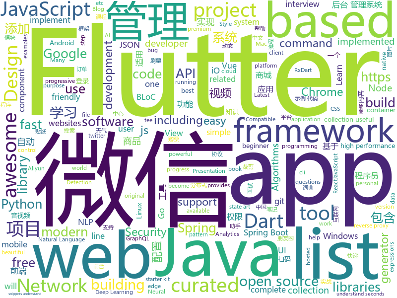

# 2019-01-13
See what the GitHub community is most excited about today.

## python
* [12306](https://github.com/testerSunshine/12306)(**205 stars today**): 12306智能刷票，订票
* [transformer-xl](https://github.com/kimiyoung/transformer-xl)(**106 stars today**): 
* [py_regular_expressions](https://github.com/learnbyexample/py_regular_expressions)(**94 stars today**): Learn Python Regular Expressions step by step from beginner to advanced levels
* [pkuseg-python](https://github.com/lancopku/pkuseg-python)(**90 stars today**): python版本：领域细分的中文分词工具，简单易用，跟现有开源工具相比提高了分词的准确率。
* [Anime-InPainting](https://github.com/youyuge34/Anime-InPainting)(**80 stars today**): An application tool of edge-connect, which can do anime inpainting and drawing. 动漫人物图片自动修复，去马赛克，填补，去瑕疵
* [d2l-en](https://github.com/d2l-ai/d2l-en)(**66 stars today**): Dive into Deep Learning, Berkeley STAT 157 (Spring 2019) textbook. With code, math, and discussions.
* [CopyTranslator](https://github.com/elliottzheng/CopyTranslator)(**51 stars today**): Foreign paper reading and translation assistant based on copy and translate.(Latest: v0.0.7-Kylin-RC1)
* [models](https://github.com/tensorflow/models)(**39 stars today**): Models and examples built with TensorFlow
* [12306-booking](https://github.com/hack12306/12306-booking)(**41 stars today**): 12306 订票助手：扫码登录，自动刷票，自动下单，自动跳转微信支付，扫码支付
* [tensorflow-yolov3](https://github.com/YunYang1994/tensorflow-yolov3)(**38 stars today**): Pure tensorflow Implement of YOLOv3 with support to train your own dataset
* [pyod](https://github.com/yzhao062/pyod)(**40 stars today**): A Python Toolkit for Scalable Outlier Detection (Anomaly Detection)
* [Python](https://github.com/TheAlgorithms/Python)(**38 stars today**): All Algorithms implemented in Python
* [youtube-dl](https://github.com/rg3/youtube-dl)(**37 stars today**): Command-line program to download videos from YouTube.com and other video sites
* [public-apis](https://github.com/toddmotto/public-apis)(**39 stars today**): A collective list of free APIs for use in software and web development.
* [py12306](https://github.com/pjialin/py12306)(**34 stars today**): 🚂12306 购票助手，支持分布式，多账号，多任务购票
* [httpie](https://github.com/jakubroztocil/httpie)(**38 stars today**): As easy as httpie /aitch-tee-tee-pie/ 🥧 Modern command line HTTP client – user-friendly curl alternative with intuitive UI, JSON support, syntax highlighting, wget-like downloads, extensions, etc. https://twitter.com/clihttp
* [awesome-python](https://github.com/vinta/awesome-python)(**34 stars today**): A curated list of awesome Python frameworks, libraries, software and resources
* [system-design-primer](https://github.com/donnemartin/system-design-primer)(**31 stars today**): Learn how to design large-scale systems. Prep for the system design interview. Includes Anki flashcards.
* [uncaptcha2](https://github.com/ecthros/uncaptcha2)(**32 stars today**): defeating the latest version of ReCaptcha with 91% accuracy
* [faceswap](https://github.com/deepfakes/faceswap)(**27 stars today**): Non official project based on original /r/Deepfakes thread. Many thanks to him!
* [awesome-python-applications](https://github.com/mahmoud/awesome-python-applications)(**29 stars today**): 💿Free software that works great, and also happens to be open-source Python.
* [flair](https://github.com/zalandoresearch/flair)(**29 stars today**): A very simple framework for state-of-the-art Natural Language Processing (NLP)
* [keras](https://github.com/keras-team/keras)(**25 stars today**): Deep Learning for humans
* [face_recognition](https://github.com/ageitgey/face_recognition)(**22 stars today**): The world's simplest facial recognition api for Python and the command line
* [google-research](https://github.com/google-research/google-research)(**22 stars today**): Google AI Research

## java
* [fescar](https://github.com/alibaba/fescar)(**251 stars today**): Fescar is an easy-to-use, high-performance, java based, open source distributed transaction solution.
* [JavaGuide](https://github.com/Snailclimb/JavaGuide)(**113 stars today**): 【Java学习+面试指南】 一份涵盖大部分Java程序员所需要掌握的核心知识。
* [RxFFmpeg](https://github.com/microshow/RxFFmpeg)(**129 stars today**): RxFFmpeg 是基于 ( FFmpeg 4.0 + X264 + mp3lame + fdk-aac ) 编译的适用于 Android 平台的音视频编辑、视频剪辑的快速处理框架，包含以下功能（视频拼接，转码，压缩，裁剪，片头片尾，分离音视频，变速，添加静态贴纸和gif动态贴纸，添加字幕，添加滤镜，添加背景音乐，加速减速视频，倒放音视频，音频裁剪，变声，混音，图片合成视频，视频解码图片等主流特色功能
* [advanced-java](https://github.com/doocs/advanced-java)(**76 stars today**): 😮互联网 Java 工程师进阶知识完全扫盲
* [mall](https://github.com/macrozheng/mall)(**47 stars today**): mall项目是一套电商系统，包括前台商城系统及后台管理系统，基于SpringBoot+MyBatis实现。 前台商城系统包含首页门户、商品推荐、商品搜索、商品展示、购物车、订单流程、会员中心、客户服务、帮助中心等模块。 后台管理系统包含商品管理、订单管理、会员管理、促销管理、运营管理、内容管理、统计报表、财务管理、权限管理、设置等模块。
* [NestedTouchScrollingLayout](https://github.com/JarvisGG/NestedTouchScrollingLayout)(**46 stars today**): 🎱处理子 View，父 View 嵌套滚动，成本比 support v4 NestedScrolling 低，放心食用～
* [spring-boot](https://github.com/spring-projects/spring-boot)(**27 stars today**): Spring Boot
* [arthas](https://github.com/alibaba/arthas)(**25 stars today**): Alibaba Java Diagnostic Tool Arthas/Alibaba Java诊断利器Arthas
* [VirtualUETool](https://github.com/zhangke3016/VirtualUETool)(**28 stars today**): Show/edit any view's attributions, any app.
* [java-design-patterns](https://github.com/iluwatar/java-design-patterns)(**22 stars today**): Design patterns implemented in Java
* [Java](https://github.com/TheAlgorithms/Java)(**20 stars today**): All Algorithms implemented in Java
* [miaosha](https://github.com/qiurunze123/miaosha)(**25 stars today**): ⛹️🐘秒杀系统设计与实现.互联网工程师进阶与分析🙋🐓
* [tutorials](https://github.com/eugenp/tutorials)(**11 stars today**): The "REST With Spring" Course:
* [spring-framework](https://github.com/spring-projects/spring-framework)(**17 stars today**): Spring Framework
* [fastjson](https://github.com/alibaba/fastjson)(**19 stars today**): 🚄A fast JSON parser/generator for Java. (Aliyun Data Lake Analytics https://www.aliyun.com/product/datalakeanalytics powered by fastjson )
* [eladmin](https://github.com/elunez/eladmin)(**18 stars today**): 项目基于 Spring Boot 2.1.0 、 Spring Boot Jpa、 JWT、Spring Security、Redis、Vue的前后端分离后台管理系统， 权限控制采用 RBAC，前端菜单动态路由
* [guava](https://github.com/google/guava)(**19 stars today**): Google core libraries for Java
* [litemall](https://github.com/linlinjava/litemall)(**18 stars today**): 又一个小商城。litemall = Spring Boot后端 + Vue管理员前端 + 微信小程序用户前端
* [symphony](https://github.com/b3log/symphony)(**18 stars today**): 🎶一款用 Java 实现的现代化社区（论坛/BBS/社交网络/博客）平台。https://hacpai.com
* [incubator-dubbo](https://github.com/apache/incubator-dubbo)(**16 stars today**): Apache Dubbo (incubating) is a high-performance, java based, open source RPC framework.
* [Sentinel](https://github.com/alibaba/Sentinel)(**17 stars today**): A lightweight powerful flow control component enabling reliability and monitoring for microservices
* [cim](https://github.com/crossoverJie/cim)(**15 stars today**): 📲cim(cross IM) 适用于开发者的即时通讯系统
* [flink](https://github.com/apache/flink)(**14 stars today**): Apache Flink
* [apollo](https://github.com/ctripcorp/apollo)(**13 stars today**): Apollo（阿波罗）是携程框架部门研发的分布式配置中心，能够集中化管理应用不同环境、不同集群的配置，配置修改后能够实时推送到应用端，并且具备规范的权限、流程治理等特性，适用于微服务配置管理场景。
* [elasticsearch](https://github.com/elastic/elasticsearch)(**13 stars today**): Open Source, Distributed, RESTful Search Engine

## unknown
* [A-Programmers-Guide-to-English](https://github.com/yujiangshui/A-Programmers-Guide-to-English)(**381 stars today**): 专为程序员编写的英语学习指南。v1.0
* [developer-roadmap](https://github.com/kamranahmedse/developer-roadmap)(**341 stars today**): Roadmap to becoming a web developer in 2019
* [the-book-of-secret-knowledge](https://github.com/trimstray/the-book-of-secret-knowledge)(**150 stars today**): A collection of awesome lists, manuals, blogs, hacks, one-liners, cli/web tools and more. Especially for System and Network Administrators, DevOps, Pentesters or Security Researchers.
* [CS-Notes](https://github.com/CyC2018/CS-Notes)(**73 stars today**): 📚面试必备基础知识
* [OrgKit](https://github.com/SwiftOnSecurity/OrgKit)(**83 stars today**): Provision a brand-new company with proper defaults in Windows, Offic365, and Azure
* [ChinaMobilePhoneNumberRegex](https://github.com/VincentSit/ChinaMobilePhoneNumberRegex)(**62 stars today**): Regular expressions that match the mobile phone number in mainland China. / 一组匹配中国大陆手机号码的正则表达式。
* [awesome](https://github.com/sindresorhus/awesome)(**57 stars today**): 😎Curated list of awesome lists
* [Mac.WeChat](https://github.com/changtuiqie/Mac.WeChat)(**54 stars today**): 微信ipad协议、微信mac协议，可实现微信80%功能；支持62数据登录、扫码登录、收发朋友圈、查看朋友圈、微信建群、微信拉人进群、微信公众号阅读、微信消息收发、微信附近的人定位、微信添加好友、微信红包接收、微信防撤回、分享小程序、微信加粉、微信收藏、微信标签等
* [dad-jokes](https://github.com/wesbos/dad-jokes)(**49 stars today**): dad jokes
* [GitHubDaily](https://github.com/GitHubDaily/GitHubDaily)(**47 stars today**): GitHubDaily 分享内容定期整理与分类。欢迎推荐、自荐项目，让更多人知道你的项目。
* [free-programming-books](https://github.com/EbookFoundation/free-programming-books)(**44 stars today**): 📚Freely available programming books
* [You-Dont-Know-JS](https://github.com/getify/You-Dont-Know-JS)(**44 stars today**): A book series on JavaScript. @YDKJS on twitter.
* [gitignore](https://github.com/github/gitignore)(**34 stars today**): A collection of useful .gitignore templates
* [pwc](https://github.com/zziz/pwc)(**38 stars today**): Papers with code. Sorted by stars. Updated weekly.
* [chinese-programmer-wrong-pronunciation](https://github.com/shimohq/chinese-programmer-wrong-pronunciation)(**38 stars today**): 中国程序员容易发音错误的单词
* [coding-interview-university](https://github.com/jwasham/coding-interview-university)(**32 stars today**): A complete computer science study plan to become a software engineer.
* [Windows-Kernel-Explorer](https://github.com/AxtMueller/Windows-Kernel-Explorer)(**33 stars today**): A free but powerful Windows kernel research tool
* [-Api](https://github.com/jokermonn/-Api)(**36 stars today**): 📖「一个」、「Time 时光」、「开眼」、「一席」、「梨视频」、「微软必应词典」、「金山词典」、「豆瓣电影」、「中央天气」、「魅族天气」、「每日一文」、「12306」、「途牛」、「快递100」、「快递」应用 Api。仅供学习，禁止商业使用，侵权请联系删除。
* [HackingResource](https://github.com/xuanhun/HackingResource)(**32 stars today**): “玄魂工作室--安全圈” 知识星球内资源汇总
* [project-based-learning](https://github.com/tuvtran/project-based-learning)(**29 stars today**): Curated list of project-based tutorials
* [awesome-for-beginners](https://github.com/MunGell/awesome-for-beginners)(**28 stars today**): A list of awesome beginners-friendly projects.
* [awesome-interview-questions](https://github.com/MaximAbramchuck/awesome-interview-questions)(**26 stars today**): A curated awesome list of lists of interview questions. Feel free to contribute!🎓
* [algorithms](https://github.com/jeffgerickson/algorithms)(**25 stars today**): Bug-tracking for Jeff's algorithms book, notes, etc.
* [stockpredictionai](https://github.com/borisbanushev/stockpredictionai)(**21 stars today**): In this noteboook I will create a complete process for predicting stock price movements. Follow along and we will achieve some pretty good results. For that purpose we will use a Generative Adversarial Network (GAN) with LSTM, a type of Recurrent Neural Network, as generator, and a Convolutional Neural Network, CNN, as a discriminator. We use L…
* [hosts](https://github.com/googlehosts/hosts)(**19 stars today**): 镜像：https://coding.net/u/scaffrey/p/hosts/git

## javascript
* [anime](https://github.com/juliangarnier/anime)(**500 stars today**): JavaScript animation engine
* [CSS-Inspiration](https://github.com/chokcoco/CSS-Inspiration)(**235 stars today**): CSS Inspiration，在这里找到写 CSS 的灵感！
* [awesome-mac](https://github.com/jaywcjlove/awesome-mac)(**179 stars today**):  Now we have become very big, Different from the original idea. Collect premium software in various categories.
* [little-virtual-computer](https://github.com/jsdf/little-virtual-computer)(**179 stars today**): Learn how computers work by simulating them in Javascript
* [sayit](https://github.com/anvaka/sayit)(**137 stars today**): Visualization of related subreddits
* [trilium](https://github.com/zadam/trilium)(**121 stars today**): Build your personal knowledge base with Trilium Notes
* [react](https://github.com/facebook/react)(**98 stars today**): A declarative, efficient, and flexible JavaScript library for building user interfaces.
* [static-site-boilerplate](https://github.com/ericalli/static-site-boilerplate)(**90 stars today**): A better workflow for building modern static websites.
* [vue](https://github.com/vuejs/vue)(**67 stars today**): 🖖Vue.js is a progressive, incrementally-adoptable JavaScript framework for building UI on the web.
* [33-js-concepts](https://github.com/leonardomso/33-js-concepts)(**68 stars today**): 📜33 concepts every JavaScript developer should know.
* [30-seconds-of-code](https://github.com/30-seconds/30-seconds-of-code)(**57 stars today**): Curated collection of useful JavaScript snippets that you can understand in 30 seconds or less.
* [nodebestpractices](https://github.com/i0natan/nodebestpractices)(**47 stars today**): The largest Node.js best practices list (January 2019)
* [edex-ui](https://github.com/GitSquared/edex-ui)(**47 stars today**): A science fiction terminal emulator designed for large touchscreens that runs on all major OSs.
* [create-react-app](https://github.com/facebook/create-react-app)(**38 stars today**): Set up a modern web app by running one command.
* [axios](https://github.com/axios/axios)(**39 stars today**): Promise based HTTP client for the browser and node.js
* [javascript-algorithms](https://github.com/trekhleb/javascript-algorithms)(**38 stars today**): 📝Algorithms and data structures implemented in JavaScript with explanations and links to further readings
* [puppeteer](https://github.com/GoogleChrome/puppeteer)(**40 stars today**): Headless Chrome Node API
* [uos](https://github.com/vaneenige/uos)(**40 stars today**): 🐭A tiny 250b scroll listener with progress.
* [next.js](https://github.com/zeit/next.js)(**35 stars today**): The React Framework
* [react-with-gesture](https://github.com/drcmda/react-with-gesture)(**33 stars today**): 👇Bread n butter utility for component-tied mouse/touch gestures in React
* [three.js](https://github.com/mrdoob/three.js)(**29 stars today**): JavaScript 3D library.
* [gatsby](https://github.com/gatsbyjs/gatsby)(**31 stars today**): Build blazing fast, modern apps and websites with React
* [javascript](https://github.com/airbnb/javascript)(**27 stars today**): JavaScript Style Guide
* [reveal.js](https://github.com/hakimel/reveal.js)(**31 stars today**): The HTML Presentation Framework
* [material-ui](https://github.com/mui-org/material-ui)(**25 stars today**): React components that implement Google's Material Design.

## html
* [AdminLTE](https://github.com/almasaeed2010/AdminLTE)(**20 stars today**): AdminLTE - Free Premium Admin control Panel Theme Based On Bootstrap 3.x
* [security_whitepapers](https://github.com/bl4de/security_whitepapers)(**19 stars today**): Collection of misc IT Security related whitepapers, presentations, slides - hacking, bug bounty, web application security, XSS, CSRF, SQLi
* [build-your-own-mint](https://github.com/yyx990803/build-your-own-mint)(**20 stars today**): Build your own personal finance analytics using Plaid, Google Sheets and CircleCI.
* [Front-end-Developer-Interview-Questions](https://github.com/h5bp/Front-end-Developer-Interview-Questions)(**17 stars today**): A list of helpful front-end related questions you can use to interview potential candidates, test yourself or completely ignore.
* [ionic](https://github.com/ionic-team/ionic)(**15 stars today**): Build amazing native and progressive web apps with open web technologies. One app running on everything🎉
* [Iosevka](https://github.com/be5invis/Iosevka)(**16 stars today**): Slender typeface for code, from code.
* [Coursera-ML-AndrewNg-Notes](https://github.com/fengdu78/Coursera-ML-AndrewNg-Notes)(**12 stars today**): 吴恩达老师的机器学习课程个人笔记
* [Spoon-Knife](https://github.com/octocat/Spoon-Knife)(****): This repo is for demonstration purposes only.
* [deeplearning_ai_books](https://github.com/fengdu78/deeplearning_ai_books)(**13 stars today**): deeplearning.ai（吴恩达老师的深度学习课程笔记及资源）
* [fastText](https://github.com/facebookresearch/fastText)(**11 stars today**): Library for fast text representation and classification.
* [JavaScript30](https://github.com/wesbos/JavaScript30)(**7 stars today**): 30 Day Vanilla JS Challenge
* [qiubaiying.github.io](https://github.com/qiubaiying/qiubaiying.github.io)(**5 stars today**): BY Blog ->
* [styleguide](https://github.com/google/styleguide)(**11 stars today**): Style guides for Google-originated open-source projects
* [portainer](https://github.com/portainer/portainer)(**11 stars today**): Simple management UI for Docker
* [NLP-progress](https://github.com/sebastianruder/NLP-progress)(**10 stars today**): Repository to track the progress in Natural Language Processing (NLP), including the datasets and the current state-of-the-art for the most common NLP tasks.
* [linux-command](https://github.com/jaywcjlove/linux-command)(**9 stars today**): Linux命令大全搜索工具，内容包含Linux命令手册、详解、学习、搜集。https://git.io/linux
* [speedtest](https://github.com/adolfintel/speedtest)(**8 stars today**): Self-hosted HTML5 Speedtest. Easy setup, examples, configurable, responsive and mobile friendly. Supports PHP, Node, and more.
* [destyle.css](https://github.com/nicolas-cusan/destyle.css)(**9 stars today**): Opinionated reset stylesheet that provides a clean styling slate for your project.
* [30-seconds-of-css](https://github.com/30-seconds/30-seconds-of-css)(**8 stars today**): A curated collection of useful CSS snippets you can understand in 30 seconds or less.
* [fonts](https://github.com/google/fonts)(**8 stars today**): Font files available from Google Fonts
* [flutter-in-action](https://github.com/flutterchina/flutter-in-action)(**7 stars today**): 《Flutter实战》电子书
* [nginxconfig.io](https://github.com/valentinxxx/nginxconfig.io)(**7 stars today**): ⚙️NGiИX config generator generator on steroids💉
* [awesome-modern-cpp](https://github.com/rigtorp/awesome-modern-cpp)(**6 stars today**): A collection of resources on modern C++
* [Seeing-Theory](https://github.com/seeingtheory/Seeing-Theory)(**5 stars today**): A visual introduction to probability and statistics.
* [EIPs](https://github.com/ethereum/EIPs)(**5 stars today**): The Ethereum Improvement Proposal repository

## dart
* [flutter-go](https://github.com/alibaba/flutter-go)(**230 stars today**): flutter 开发者帮助 APP，包含 flutter 常用 130+ 组件的中文文档与 demo 演示
* [flutter](https://github.com/flutter/flutter)(**68 stars today**): Flutter makes it easy and fast to build beautiful mobile apps.
* [flutter_starter_kit](https://github.com/KingWu/flutter_starter_kit)(**43 stars today**): A starter kit for beginner learns with Bloc pattern, RxDart, sqflite, Fluro and Dio to architect a flutter project. This starter kit build an App Store app as a example
* [kt.dart](https://github.com/passsy/kt.dart)(**32 stars today**): A port of kotlin-stdlib for Dart/Flutter including collections (KtList, KtMap, KtSet) and other packages
* [awesome-flutter](https://github.com/Solido/awesome-flutter)(**28 stars today**): An awesome list that curates the best Flutter libraries, tools, tutorials, articles and more.
* [flutter_wanandroid](https://github.com/Sky24n/flutter_wanandroid)(**21 stars today**): 一个完整的Flutter项目，BLoC、RxDart 、国际化、启动页、引导页
* [HistoryOfEverything](https://github.com/2d-inc/HistoryOfEverything)(**20 stars today**): Flutter Launch Timeline Demo
* [plugins](https://github.com/flutter/plugins)(**16 stars today**): Plugins for Flutter, including FlutterFire, maintained by the Flutter team
* [flutter_architecture_samples](https://github.com/brianegan/flutter_architecture_samples)(**17 stars today**): TodoMVC for Flutter
* [Flutter-learning](https://github.com/AweiLoveAndroid/Flutter-learning)(**15 stars today**): 🔥👍🌟⭐️⭐️⭐️Flutter安装和配置，Flutter开发遇到的难题，Flutter示例代码和模板，Flutter项目实战，Dart语言学习示例代码。
* [sdk](https://github.com/dart-lang/sdk)(**12 stars today**): The Dart SDK, including the VM, dart2js, core libraries, and more.
* [bloc](https://github.com/felangel/bloc)(**8 stars today**): A collection of packages that help implement the BLoC design pattern
* [inKino](https://github.com/roughike/inKino)(**7 stars today**): A multiplatform Dart movie app with 40% of code sharing between Flutter and the Web.
* [charts](https://github.com/google/charts)(**7 stars today**): 
* [Flare-Flutter](https://github.com/2d-inc/Flare-Flutter)(**7 stars today**): 
* [flutter-ui-nice](https://github.com/nb312/flutter-ui-nice)(**6 stars today**): More than 130+ pages in this beautiful app and more than 45 developers has contributed to it.
* [Flutter-CuriosityApp](https://github.com/xumaohuai/Flutter-CuriosityApp)(**6 stars today**): Flutter高仿好奇心日报
* [Flutter-Notebook](https://github.com/OpenFlutter/Flutter-Notebook)(**5 stars today**): 日更的FlutterDemo合集，今天你fu了吗
* [flutter_swiper](https://github.com/best-flutter/flutter_swiper)(**5 stars today**): The best swiper for flutter , with multiple layouts, infinite loop. Compatible with Android & iOS.
* [language](https://github.com/dart-lang/language)(**5 stars today**): Design of the Dart language
* [pointycastle](https://github.com/PointyCastle/pointycastle)(**5 stars today**): Cryptography library for Dart programmers mainly based on Bouncy Castle Java library
* [Grocery-App](https://github.com/Widle-Studio/Grocery-App)(****): Flutter Grocery Shopping App
* [flutter_facebook_login](https://github.com/roughike/flutter_facebook_login)(****): A Flutter plugin for allowing users to authenticate with native Android & iOS Facebook login SDKs.
* [json_serializable](https://github.com/dart-lang/json_serializable)(****): Generates utilities to aid in serializing to/from JSON.
* [chromedeveditor](https://github.com/googlearchive/chromedeveditor)(****): Chrome Dev Editor is a developer tool for building apps on the Chrome platform - Chrome Apps and Web Apps, in JavaScript or Dart. (NO LONGER IN ACTIVE DEVELOPMENT)

## go
* [mkcert](https://github.com/FiloSottile/mkcert)(**182 stars today**): A simple zero-config tool to make locally trusted development certificates with any names you'd like.
* [Modlishka](https://github.com/drk1wi/Modlishka)(**44 stars today**): Modlishka. Reverse Proxy. Phishing NG.
* [v2ray-plugin](https://github.com/madeye/v2ray-plugin)(**47 stars today**): A SIP003 plugin based on v2ray
* [go](https://github.com/golang/go)(**40 stars today**): The Go programming language
* [sqler](https://github.com/alash3al/sqler)(**39 stars today**): write APIs using direct SQL queries with no hassle, let's rethink about SQL
* [FlyingCarpet](https://github.com/spieglt/FlyingCarpet)(**36 stars today**): Wireless, encrypted file transfer over automatically configured ad hoc networking. No network infrastructure required (access point, router, switch). Just two laptops with wireless chips in close range. Mac, Windows, and Linux.
* [loki](https://github.com/grafana/loki)(**36 stars today**): Like Prometheus, but for logs.
* [awesome-go](https://github.com/avelino/awesome-go)(**30 stars today**): A curated list of awesome Go frameworks, libraries and software
* [frp](https://github.com/fatedier/frp)(**28 stars today**): A fast reverse proxy to help you expose a local server behind a NAT or firewall to the internet.
* [fzf](https://github.com/junegunn/fzf)(**28 stars today**): 🌸A command-line fuzzy finder
* [avo](https://github.com/mmcloughlin/avo)(**26 stars today**): Generate x86 Assembly with Go
* [kubernetes](https://github.com/kubernetes/kubernetes)(**22 stars today**): Production-Grade Container Scheduling and Management
* [tilt](https://github.com/windmilleng/tilt)(**24 stars today**): Local Kubernetes development with no stress
* [dragonboat](https://github.com/lni/dragonboat)(**22 stars today**): Dragonboat is a feature complete and high performance multi-group Raft library in Go.
* [moby](https://github.com/moby/moby)(**21 stars today**): Moby Project - a collaborative project for the container ecosystem to assemble container-based systems
* [gql](https://github.com/slothking-online/gql)(**22 stars today**): Very simple CLI for many GraphQL schemas in the cloud. Provides autocompletion for GraphQL queries
* [minikube](https://github.com/kubernetes/minikube)(**20 stars today**): Run Kubernetes locally
* [v2ray-core](https://github.com/v2ray/v2ray-core)(**17 stars today**): A platform for building proxies to bypass network restrictions.
* [gitea](https://github.com/go-gitea/gitea)(**17 stars today**): Git with a cup of tea, painless self-hosted git service
* [hugo](https://github.com/gohugoio/hugo)(**17 stars today**): The world’s fastest framework for building websites.
* [minio](https://github.com/minio/minio)(**18 stars today**): Minio is an open source object storage server compatible with Amazon S3 APIs
* [rook](https://github.com/rook/rook)(**17 stars today**): Storage Orchestration for Kubernetes
* [traefik](https://github.com/containous/traefik)(**16 stars today**): The Cloud Native Edge Router
* [build-web-application-with-golang](https://github.com/astaxie/build-web-application-with-golang)(**14 stars today**): A golang ebook intro how to build a web with golang
* [hcl2](https://github.com/hashicorp/hcl2)(**16 stars today**): Temporary home for experimental new version of HCL

## WordCloud

