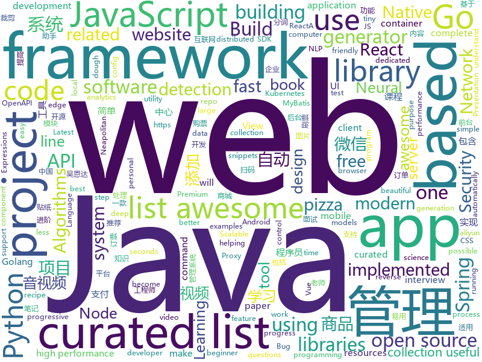

# 2019-01-14
See what the GitHub community is most excited about today.

## python
* [12306](https://github.com/testerSunshine/12306)(**165 stars today**): 12306智能刷票，订票
* [py_regular_expressions](https://github.com/learnbyexample/py_regular_expressions)(**87 stars today**): Learn Python Regular Expressions step by step from beginner to advanced levels
* [d2l-en](https://github.com/d2l-ai/d2l-en)(**60 stars today**): Dive into Deep Learning, Berkeley STAT 157 (Spring 2019) textbook. With code, math, and discussions.
* [12306-booking](https://github.com/hack12306/12306-booking)(**58 stars today**): 12306 订票助手：自动刷票，扫码登录，自动下单，自动跳转微信支付，扫码支付
* [transformer-xl](https://github.com/kimiyoung/transformer-xl)(**57 stars today**): 
* [mindsdb](https://github.com/mindsdb/mindsdb)(**57 stars today**): Framework to streamline use of neural networks
* [pkuseg-python](https://github.com/lancopku/pkuseg-python)(**49 stars today**): python版本：领域细分的中文分词工具，简单易用，跟现有开源工具相比提高了分词的准确率。
* [models](https://github.com/tensorflow/models)(**34 stars today**): Models and examples built with TensorFlow
* [youtube-dl](https://github.com/rg3/youtube-dl)(**45 stars today**): Command-line program to download videos from YouTube.com and other video sites
* [awesome-python](https://github.com/vinta/awesome-python)(**40 stars today**): A curated list of awesome Python frameworks, libraries, software and resources
* [system-design-primer](https://github.com/donnemartin/system-design-primer)(**39 stars today**): Learn how to design large-scale systems. Prep for the system design interview. Includes Anki flashcards.
* [ESRGAN](https://github.com/xinntao/ESRGAN)(**39 stars today**): ECCV18 Workshops - Enhanced SRGAN. Champion PIRM Challenge on Perceptual Super-Resolution (Third Region)
* [py12306](https://github.com/pjialin/py12306)(**38 stars today**): 🚂12306 购票助手，支持分布式，多账号，多任务购票以及 Web 页面管理
* [Python](https://github.com/TheAlgorithms/Python)(**34 stars today**): All Algorithms implemented in Python
* [bert](https://github.com/google-research/bert)(**30 stars today**): TensorFlow code and pre-trained models for BERT
* [keras](https://github.com/keras-team/keras)(**31 stars today**): Deep Learning for humans
* [uncaptcha2](https://github.com/ecthros/uncaptcha2)(**35 stars today**): defeating the latest version of ReCaptcha with 91% accuracy
* [CopyTranslator](https://github.com/elliottzheng/CopyTranslator)(**33 stars today**): Foreign paper reading and translation assistant based on copy and translate.(Latest: v0.0.7-Kylin-RC1)
* [awesome-python-applications](https://github.com/mahmoud/awesome-python-applications)(**33 stars today**): 💿Free software that works great, and also happens to be open-source Python.
* [django](https://github.com/django/django)(**30 stars today**): The Web framework for perfectionists with deadlines.
* [home-assistant](https://github.com/home-assistant/home-assistant)(**25 stars today**): 🏡Open source home automation that puts local control and privacy first
* [public-apis](https://github.com/toddmotto/public-apis)(**29 stars today**): A collective list of free APIs for use in software and web development.
* [pyod](https://github.com/yzhao062/pyod)(**28 stars today**): A Python Toolkit for Scalable Outlier Detection (Anomaly Detection)
* [Python-for-beginners](https://github.com/mraza007/Python-for-beginners)(**29 stars today**): I created this repo to save all my python related language notes
* [Anime-InPainting](https://github.com/youyuge34/Anime-InPainting)(**27 stars today**): An application tool of edge-connect, which can do anime inpainting and drawing. 动漫人物图片自动修复，去马赛克，填补，去瑕疵

## java
* [fescar](https://github.com/alibaba/fescar)(**120 stars today**): Fescar is an easy-to-use, high-performance, java based, open source distributed transaction solution.
* [JavaGuide](https://github.com/Snailclimb/JavaGuide)(**76 stars today**): 【Java学习+面试指南】 一份涵盖大部分Java程序员所需要掌握的核心知识。
* [RxFFmpeg](https://github.com/microshow/RxFFmpeg)(**53 stars today**): RxFFmpeg 是基于 ( FFmpeg 4.0 + X264 + mp3lame + fdk-aac ) 编译的适用于 Android 平台的音视频编辑、视频剪辑的快速处理框架，包含以下功能（视频拼接，转码，压缩，裁剪，片头片尾，分离音视频，变速，添加静态贴纸和gif动态贴纸，添加字幕，添加滤镜，添加背景音乐，加速减速视频，倒放音视频，音频裁剪，变声，混音，图片合成视频，视频解码图片等主流特色功能
* [advanced-java](https://github.com/doocs/advanced-java)(**51 stars today**): 😮互联网 Java 工程师进阶知识完全扫盲
* [mall](https://github.com/macrozheng/mall)(**40 stars today**): mall项目是一套电商系统，包括前台商城系统及后台管理系统，基于SpringBoot+MyBatis实现。 前台商城系统包含首页门户、商品推荐、商品搜索、商品展示、购物车、订单流程、会员中心、客户服务、帮助中心等模块。 后台管理系统包含商品管理、订单管理、会员管理、促销管理、运营管理、内容管理、统计报表、财务管理、权限管理、设置等模块。
* [java-design-patterns](https://github.com/iluwatar/java-design-patterns)(**33 stars today**): Design patterns implemented in Java
* [miaosha](https://github.com/qiurunze123/miaosha)(**32 stars today**): ⛹️🐘秒杀系统设计与实现.互联网工程师进阶与分析🙋🐓
* [spring-boot](https://github.com/spring-projects/spring-boot)(**25 stars today**): Spring Boot
* [VirtualUETool](https://github.com/zhangke3016/VirtualUETool)(**25 stars today**): Show/edit any view's attributions, any app.
* [Java](https://github.com/TheAlgorithms/Java)(**23 stars today**): All Algorithms implemented in Java
* [spring-framework](https://github.com/spring-projects/spring-framework)(**18 stars today**): Spring Framework
* [tutorials](https://github.com/eugenp/tutorials)(**14 stars today**): The "REST With Spring" Course:
* [elasticsearch](https://github.com/elastic/elasticsearch)(**19 stars today**): Open Source, Distributed, RESTful Search Engine
* [flink](https://github.com/apache/flink)(**20 stars today**): Apache Flink
* [guava](https://github.com/google/guava)(**18 stars today**): Google core libraries for Java
* [symphony](https://github.com/b3log/symphony)(**16 stars today**): 🎶一款用 Java 实现的现代化社区（论坛/BBS/社交网络/博客）平台。https://hacpai.com
* [cim](https://github.com/crossoverJie/cim)(**15 stars today**): 📲cim(cross IM) 适用于开发者的即时通讯系统
* [WxJava](https://github.com/Wechat-Group/WxJava)(**12 stars today**): WxJava （微信开发 Java SDK），支持包括微信支付、开放平台、小程序、企业微信/企业号和公众号等的后端开发
* [incubator-dubbo](https://github.com/apache/incubator-dubbo)(**8 stars today**): Apache Dubbo (incubating) is a high-performance, java based, open source RPC framework.
* [isolating-the-domain](https://github.com/system-sekkei/isolating-the-domain)(**14 stars today**): architecture sample using : Spring Boot gradle, Spring MVC, Thymeleaf, and MyBatis
* [spring-cloud-cli](https://github.com/coderqianlq/spring-cloud-cli)(**13 stars today**): ☁️自己搭建的简单的springcloud项目，主要集成了注册中心、服务网关、配置中心、负载均衡、消息总线。
* [okhttp](https://github.com/square/okhttp)(**12 stars today**): An HTTP+HTTP/2 client for Android and Java applications.
* [RxJava](https://github.com/ReactiveX/RxJava)(**12 stars today**): RxJava – Reactive Extensions for the JVM – a library for composing asynchronous and event-based programs using observable sequences for the Java VM.
* [NestedTouchScrollingLayout](https://github.com/JarvisGG/NestedTouchScrollingLayout)(**13 stars today**): 🎱处理子 View，父 View 嵌套滚动，成本比 support v4 NestedScrolling 低，放心食用～
* [fastjson](https://github.com/alibaba/fastjson)(**12 stars today**): 🚄A fast JSON parser/generator for Java. (Aliyun Data Lake Analytics https://www.aliyun.com/product/datalakeanalytics powered by fastjson )

## unknown
* [developer-roadmap](https://github.com/kamranahmedse/developer-roadmap)(**252 stars today**): Roadmap to becoming a web developer in 2019
* [A-Programmers-Guide-to-English](https://github.com/yujiangshui/A-Programmers-Guide-to-English)(**240 stars today**): 专为程序员编写的英语学习指南。v1.0
* [the-book-of-secret-knowledge](https://github.com/trimstray/the-book-of-secret-knowledge)(**137 stars today**): A collection of awesome lists, manuals, blogs, hacks, one-liners, cli/web tools and more. Especially for System and Network Administrators, DevOps, Pentesters or Security Researchers.
* [GitHubDaily](https://github.com/GitHubDaily/GitHubDaily)(**125 stars today**): GitHubDaily 分享内容定期整理与分类。欢迎推荐、自荐项目，让更多人知道你的项目。
* [CS-Notes](https://github.com/CyC2018/CS-Notes)(**92 stars today**): 📚面试必备基础知识
* [pwc](https://github.com/zziz/pwc)(**73 stars today**): Papers with code. Sorted by stars. Updated weekly.
* [gitignore](https://github.com/github/gitignore)(**43 stars today**): A collection of useful .gitignore templates
* [ChinaMobilePhoneNumberRegex](https://github.com/VincentSit/ChinaMobilePhoneNumberRegex)(**57 stars today**): Regular expressions that match the mobile phone number in mainland China. / 一组匹配中国大陆手机号码的正则表达式。
* [awesome](https://github.com/sindresorhus/awesome)(**50 stars today**): 😎Curated list of awesome lists
* [OrgKit](https://github.com/SwiftOnSecurity/OrgKit)(**54 stars today**): Provision a brand-new company with proper defaults in Windows, Offic365, and Azure
* [You-Dont-Know-JS](https://github.com/getify/You-Dont-Know-JS)(**48 stars today**): A book series on JavaScript. @YDKJS on twitter.
* [free-programming-books](https://github.com/EbookFoundation/free-programming-books)(**40 stars today**): 📚Freely available programming books
* [chinese-programmer-wrong-pronunciation](https://github.com/shimohq/chinese-programmer-wrong-pronunciation)(**41 stars today**): 中国程序员容易发音错误的单词
* [awesome-portfolios](https://github.com/iRaul/awesome-portfolios)(**40 stars today**): A curated list of Awesome Creative Portfolios.🎨
* [awesome-for-beginners](https://github.com/MunGell/awesome-for-beginners)(**35 stars today**): A list of awesome beginners-friendly projects.
* [awesome-web-security](https://github.com/qazbnm456/awesome-web-security)(**33 stars today**): 🐶A curated list of Web Security materials and resources.
* [coding-interview-university](https://github.com/jwasham/coding-interview-university)(**30 stars today**): A complete computer science study plan to become a software engineer.
* [project-based-learning](https://github.com/tuvtran/project-based-learning)(**32 stars today**): Curated list of project-based tutorials
* [the-art-of-command-line](https://github.com/jlevy/the-art-of-command-line)(**33 stars today**): Master the command line, in one page
* [awesome-interview-questions](https://github.com/MaximAbramchuck/awesome-interview-questions)(**33 stars today**): A curated awesome list of lists of interview questions. Feel free to contribute!🎓
* [pizza-dough](https://github.com/hendricius/pizza-dough)(**31 stars today**): This recipe is dedicated to helping you make the best possible pizza dough for Neapolitan pizza.
* [deep_learning_object_detection](https://github.com/hoya012/deep_learning_object_detection)(**28 stars today**): A paper list of object detection using deep learning.
* [stockpredictionai](https://github.com/borisbanushev/stockpredictionai)(**27 stars today**): In this noteboook I will create a complete process for predicting stock price movements. Follow along and we will achieve some pretty good results. For that purpose we will use a Generative Adversarial Network (GAN) with LSTM, a type of Recurrent Neural Network, as generator, and a Convolutional Neural Network, CNN, as a discriminator. We use L…
* [awesome-cpp](https://github.com/fffaraz/awesome-cpp)(**27 stars today**): A curated list of awesome C++ (or C) frameworks, libraries, resources, and shiny things. Inspired by awesome-... stuff.
* [algorithms](https://github.com/jeffgerickson/algorithms)(**26 stars today**): Bug-tracking for Jeff's algorithms book, notes, etc.

## javascript
* [anime](https://github.com/juliangarnier/anime)(**380 stars today**): JavaScript animation engine
* [CSS-Inspiration](https://github.com/chokcoco/CSS-Inspiration)(**269 stars today**): CSS Inspiration，在这里找到写 CSS 的灵感！
* [awesome-mac](https://github.com/jaywcjlove/awesome-mac)(**166 stars today**):  Now we have become very big, Different from the original idea. Collect premium software in various categories.
* [trilium](https://github.com/zadam/trilium)(**148 stars today**): Build your personal knowledge base with Trilium Notes
* [little-virtual-computer](https://github.com/jsdf/little-virtual-computer)(**123 stars today**): Learn how computers work by simulating them in Javascript
* [sayit](https://github.com/anvaka/sayit)(**96 stars today**): Visualization of related subreddits
* [react](https://github.com/facebook/react)(**73 stars today**): A declarative, efficient, and flexible JavaScript library for building user interfaces.
* [vue](https://github.com/vuejs/vue)(**65 stars today**): 🖖Vue.js is a progressive, incrementally-adoptable JavaScript framework for building UI on the web.
* [static-site-boilerplate](https://github.com/ericalli/static-site-boilerplate)(**54 stars today**): A better workflow for building modern static websites.
* [create-react-app](https://github.com/facebook/create-react-app)(**49 stars today**): Set up a modern web app by running one command.
* [30-seconds-of-code](https://github.com/30-seconds/30-seconds-of-code)(**49 stars today**): Curated collection of useful JavaScript snippets that you can understand in 30 seconds or less.
* [puppeteer](https://github.com/GoogleChrome/puppeteer)(**46 stars today**): Headless Chrome Node API
* [javascript-algorithms](https://github.com/trekhleb/javascript-algorithms)(**40 stars today**): 📝Algorithms and data structures implemented in JavaScript with explanations and links to further readings
* [gatsby](https://github.com/gatsbyjs/gatsby)(**42 stars today**): Build blazing fast, modern apps and websites with React
* [edex-ui](https://github.com/GitSquared/edex-ui)(**45 stars today**): A science fiction terminal emulator designed for large touchscreens that runs on all major OSs.
* [33-js-concepts](https://github.com/leonardomso/33-js-concepts)(**42 stars today**): 📜33 concepts every JavaScript developer should know.
* [react-with-gesture](https://github.com/drcmda/react-with-gesture)(**38 stars today**): 👇Bread n butter utility for component-tied mouse/touch gestures in React
* [react-native](https://github.com/facebook/react-native)(**34 stars today**): A framework for building native apps with React.
* [qss](https://github.com/lukeed/qss)(**37 stars today**): A tiny (294b) browser utility for encoding & decoding a querystring.
* [reveal.js](https://github.com/hakimel/reveal.js)(**35 stars today**): The HTML Presentation Framework
* [storybook](https://github.com/storybooks/storybook)(**32 stars today**): Interactive UI component dev & test: React, React Native, Vue, Angular, Ember
* [uos](https://github.com/vaneenige/uos)(**31 stars today**): 🐭A tiny 250b scroll listener with progress.
* [pizza-dough](https://github.com/hendricius/pizza-dough)(**31 stars today**): This recipe is dedicated to helping you make the best possible pizza dough for Neapolitan pizza.
* [next.js](https://github.com/zeit/next.js)(**27 stars today**): The React Framework
* [axios](https://github.com/axios/axios)(**28 stars today**): Promise based HTTP client for the browser and node.js

## html
* [security_whitepapers](https://github.com/bl4de/security_whitepapers)(**81 stars today**): Collection of misc IT Security related whitepapers, presentations, slides - hacking, bug bounty, web application security, XSS, CSRF, SQLi
* [Iosevka](https://github.com/be5invis/Iosevka)(**28 stars today**): Slender typeface for code, from code.
* [NLP-progress](https://github.com/sebastianruder/NLP-progress)(**19 stars today**): Repository to track the progress in Natural Language Processing (NLP), including the datasets and the current state-of-the-art for the most common NLP tasks.
* [build-your-own-mint](https://github.com/yyx990803/build-your-own-mint)(**17 stars today**): Build your own personal finance analytics using Plaid, Google Sheets and CircleCI.
* [beautiful-jekyll](https://github.com/daattali/beautiful-jekyll)(**7 stars today**): ✨Build a beautiful and simple website in literally minutes. Demo at http://deanattali.com/beautiful-jekyll
* [destyle.css](https://github.com/nicolas-cusan/destyle.css)(**15 stars today**): Opinionated reset stylesheet that provides a clean styling slate for your project.
* [AdminLTE](https://github.com/almasaeed2010/AdminLTE)(**11 stars today**): AdminLTE - Free Premium Admin control Panel Theme Based On Bootstrap 3.x
* [Coursera-ML-AndrewNg-Notes](https://github.com/fengdu78/Coursera-ML-AndrewNg-Notes)(**9 stars today**): 吴恩达老师的机器学习课程个人笔记
* [Selena-Gomez-Discography](https://github.com/OrionStar25/Selena-Gomez-Discography)(**8 stars today**): One Pager containing all of her albums, songs, singles :)
* [Spoon-Knife](https://github.com/octocat/Spoon-Knife)(****): This repo is for demonstration purposes only.
* [30-seconds-of-css](https://github.com/30-seconds/30-seconds-of-css)(**12 stars today**): A curated collection of useful CSS snippets you can understand in 30 seconds or less.
* [JavaScript30](https://github.com/wesbos/JavaScript30)(**7 stars today**): 30 Day Vanilla JS Challenge
* [deeplearning_ai_books](https://github.com/fengdu78/deeplearning_ai_books)(**7 stars today**): deeplearning.ai（吴恩达老师的深度学习课程笔记及资源）
* [zju-icicles](https://github.com/QSCTech/zju-icicles)(**7 stars today**): 浙江大学课程攻略共享计划
* [Front-end-Developer-Interview-Questions](https://github.com/h5bp/Front-end-Developer-Interview-Questions)(**9 stars today**): A list of helpful front-end related questions you can use to interview potential candidates, test yourself or completely ignore.
* [now-github-starter](https://github.com/zeit/now-github-starter)(****): Starter project to demonstrate a project whose pull requests get automatically deployed
* [ionic](https://github.com/ionic-team/ionic)(**7 stars today**): Build amazing native and progressive web apps with open web technologies. One app running on everything🎉
* [fastText](https://github.com/facebookresearch/fastText)(**7 stars today**): Library for fast text representation and classification.
* [nginxconfig.io](https://github.com/valentinxxx/nginxconfig.io)(**8 stars today**): ⚙️NGiИX config generator generator on steroids💉
* [openapi-generator](https://github.com/OpenAPITools/openapi-generator)(**7 stars today**): OpenAPI Generator allows generation of API client libraries (SDK generation), server stubs, documentation and configuration automatically given an OpenAPI Spec (v2, v3)
* [flutter-in-action](https://github.com/flutterchina/flutter-in-action)(**7 stars today**): 《Flutter实战》电子书
* [speedtest](https://github.com/adolfintel/speedtest)(**7 stars today**): Self-hosted HTML5 Speedtest. Easy setup, examples, configurable, responsive and mobile friendly. Supports PHP, Node, and more.
* [ecma262](https://github.com/tc39/ecma262)(**6 stars today**): Status, process, and documents for ECMA262
* [portainer](https://github.com/portainer/portainer)(**7 stars today**): Simple management UI for Docker
* [awesome-modern-cpp](https://github.com/rigtorp/awesome-modern-cpp)(**7 stars today**): A collection of resources on modern C++

## go
* [mkcert](https://github.com/FiloSottile/mkcert)(**146 stars today**): A simple zero-config tool to make locally trusted development certificates with any names you'd like.
* [syncd](https://github.com/dreamans/syncd)(**94 stars today**): syncd是一款开源的代码部署工具，它具有简单、高效、易用等特点，可以提高团队的工作效率.
* [whapp-irc](https://github.com/lieuwex/whapp-irc)(**58 stars today**): whatsapp web <-> irc gateway
* [pigo](https://github.com/esimov/pigo)(**47 stars today**): Golang implementation of Pico face detection library.
* [kubernetes](https://github.com/kubernetes/kubernetes)(**43 stars today**): Production-Grade Container Scheduling and Management
* [go](https://github.com/golang/go)(**37 stars today**): The Go programming language
* [sqler](https://github.com/alash3al/sqler)(**34 stars today**): write APIs using direct SQL queries with no hassle, let's rethink about SQL
* [awesome-go](https://github.com/avelino/awesome-go)(**34 stars today**): A curated list of awesome Go frameworks, libraries and software
* [Modlishka](https://github.com/drk1wi/Modlishka)(**29 stars today**): Modlishka. Reverse Proxy. Phishing NG.
* [traefik](https://github.com/containous/traefik)(**29 stars today**): The Cloud Native Edge Router
* [tilt](https://github.com/windmilleng/tilt)(**29 stars today**): Local Kubernetes development with no stress
* [loki](https://github.com/grafana/loki)(**28 stars today**): Like Prometheus, but for logs.
* [hugo](https://github.com/gohugoio/hugo)(**27 stars today**): The world’s fastest framework for building websites.
* [fzf](https://github.com/junegunn/fzf)(**25 stars today**): 🌸A command-line fuzzy finder
* [frp](https://github.com/fatedier/frp)(**21 stars today**): A fast reverse proxy to help you expose a local server behind a NAT or firewall to the internet.
* [dragonboat](https://github.com/lni/dragonboat)(**22 stars today**): A feature complete and high performance multi-group Raft library in Go.
* [koazee](https://github.com/wesovilabs/koazee)(**21 stars today**): A StreamLike, Immutable, Lazy Loading and smart Golang Library to deal with slices.
* [mongo-go-driver](https://github.com/mongodb/mongo-go-driver)(**19 stars today**): The Go driver for MongoDB
* [minikube](https://github.com/kubernetes/minikube)(**18 stars today**): Run Kubernetes locally
* [rook](https://github.com/rook/rook)(**17 stars today**): Storage Orchestration for Kubernetes
* [gin](https://github.com/gin-gonic/gin)(**17 stars today**): Gin is a HTTP web framework written in Go (Golang). It features a Martini-like API with much better performance -- up to 40 times faster. If you need smashing performance, get yourself some Gin.
* [moby](https://github.com/moby/moby)(**15 stars today**): Moby Project - a collaborative project for the container ecosystem to assemble container-based systems
* [Beaver](https://github.com/Clivern/Beaver)(**16 stars today**): 💨A real time messaging server to build a scalable in-app notifications, multiplayer games, chat apps in web and mobile apps.
* [build-web-application-with-golang](https://github.com/astaxie/build-web-application-with-golang)(**15 stars today**): A golang ebook intro how to build a web with golang
* [avo](https://github.com/mmcloughlin/avo)(**15 stars today**): Generate x86 Assembly with Go

## WordCloud

