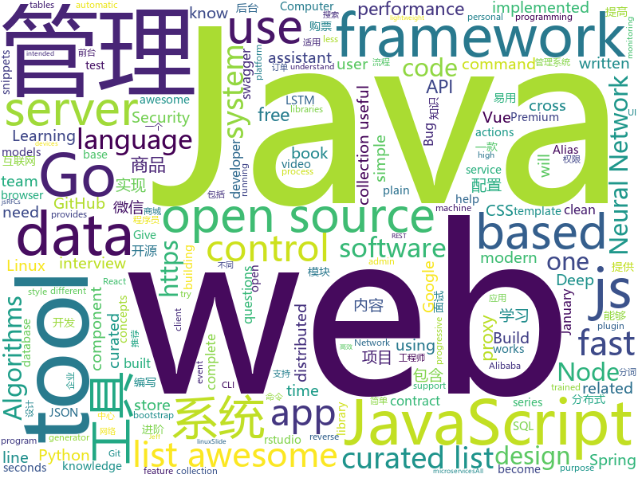

# 2019-01-16
See what the GitHub community is most excited about today.

## python
* [12306](https://github.com/testerSunshine/12306)(**465 stars today**): 12306智能刷票，订票
* [py12306](https://github.com/pjialin/py12306)(**321 stars today**): 🚂12306 购票助手，支持分布式，多账号，多任务购票以及 Web 页面管理
* [awesome-python-applications](https://github.com/mahmoud/awesome-python-applications)(**269 stars today**): 💿Free software that works great, and also happens to be open-source Python.
* [deep-learning-ocean](https://github.com/osforscience/deep-learning-ocean)(**238 stars today**): 📡All You Need to Know About Deep Learning - A kick-starter
* [project_alias](https://github.com/bjoernkarmann/project_alias)(**244 stars today**): Alias is a teachable “parasite” that is designed to give users more control over their smart assistants, both when it comes to customisation and privacy. Through a simple app the user can train Alias to react on a custom wake-word/sound, and once trained, Alias can take control over your home assistant by activating it for you.
* [Virtuailor](https://github.com/0xgalz/Virtuailor)(**125 stars today**): IDAPython tool for creating automatic C++ virtual tables in IDA Pro
* [pkuseg-python](https://github.com/lancopku/pkuseg-python)(**111 stars today**): python版本：领域细分的中文分词工具，简单易用，跟现有开源工具相比提高了分词的准确率。
* [super-inspire-end](https://github.com/super-inspire/super-inspire-end)(**118 stars today**): 在不到30s内得到一个干净的开箱即用的临时linux系统.(暂时提供Ubuntu, Centos, Alpine进行测试, 后续会提供更多)
* [Bashfuscator](https://github.com/Bashfuscator/Bashfuscator)(**110 stars today**): A fully configurable and extendable Bash obfuscation framework. This tool is intended to help both red team and blue team.
* [models](https://github.com/tensorflow/models)(**64 stars today**): Models and examples built with TensorFlow
* [vimade](https://github.com/TaDaa/vimade)(**82 stars today**): An eye friendly plugin that fades your inactive buffers and preserves your syntax highlighting!
* [12306](https://github.com/V-I-C-T-O-R/12306)(**73 stars today**): IP封禁好厉害，希望大家都能顺利回家！！！
* [python_12306](https://github.com/versionzhang/python_12306)(**71 stars today**): python 12306 抢票工具
* [awesome-python](https://github.com/vinta/awesome-python)(**68 stars today**): A curated list of awesome Python frameworks, libraries, software and resources
* [Deep-Reinforcement-Learning-Algorithms-with-PyTorch](https://github.com/p-christ/Deep-Reinforcement-Learning-Algorithms-with-PyTorch)(**69 stars today**): 
* [system-design-primer](https://github.com/donnemartin/system-design-primer)(**67 stars today**): Learn how to design large-scale systems. Prep for the system design interview. Includes Anki flashcards.
* [bert](https://github.com/google-research/bert)(**63 stars today**): TensorFlow code and pre-trained models for BERT
* [dnc](https://github.com/krocki/dnc)(**63 stars today**): Simple RNN, LSTM and Differentiable Neural Computer in pure Numpy
* [transformer-xl](https://github.com/kimiyoung/transformer-xl)(**64 stars today**): 
* [youtube-dl](https://github.com/rg3/youtube-dl)(**57 stars today**): Command-line program to download videos from YouTube.com and other video sites
* [torchdiffeq](https://github.com/rtqichen/torchdiffeq)(**52 stars today**): Differentiable ODE solvers with full GPU support and O(1)-memory backpropagation.
* [Python](https://github.com/TheAlgorithms/Python)(**50 stars today**): All Algorithms implemented in Python
* [CopyTranslator](https://github.com/elliottzheng/CopyTranslator)(**50 stars today**): Foreign language reading and translation assistant based on copy and translate.(Latest: v0.0.7-Kylin-RC1)
* [keras](https://github.com/keras-team/keras)(**45 stars today**): Deep Learning for humans
* [delira](https://github.com/justusschock/delira)(**50 stars today**): Lightweight framework for fast prototyping and training deep neural networks in medical imaging

## java
* [JavaGuide](https://github.com/Snailclimb/JavaGuide)(**317 stars today**): 【Java学习+面试指南】 一份涵盖大部分Java程序员所需要掌握的核心知识。
* [mall](https://github.com/macrozheng/mall)(**251 stars today**): mall项目是一套电商系统，包括前台商城系统及后台管理系统，基于SpringBoot+MyBatis实现。 前台商城系统包含首页门户、商品推荐、商品搜索、商品展示、购物车、订单流程、会员中心、客户服务、帮助中心等模块。 后台管理系统包含商品管理、订单管理、会员管理、促销管理、运营管理、内容管理、统计报表、财务管理、权限管理、设置等模块。
* [advanced-java](https://github.com/doocs/advanced-java)(**246 stars today**): 😮互联网 Java 工程师进阶知识完全扫盲
* [fdb-record-layer](https://github.com/FoundationDB/fdb-record-layer)(**215 stars today**): A record-oriented store built on FoundationDB
* [fescar](https://github.com/alibaba/fescar)(**197 stars today**): Fescar is an easy-to-use, high-performance, java based, open source distributed transaction solution.
* [miaosha](https://github.com/qiurunze123/miaosha)(**113 stars today**): ⛹️🐘秒杀系统设计与实现.互联网工程师进阶与分析🙋🐓
* [spring-boot](https://github.com/spring-projects/spring-boot)(**67 stars today**): Spring Boot
* [tutorials](https://github.com/eugenp/tutorials)(**47 stars today**): The "REST With Spring" Course:
* [arthas](https://github.com/alibaba/arthas)(**55 stars today**): Alibaba Java Diagnostic Tool Arthas/Alibaba Java诊断利器Arthas
* [incubator-dubbo](https://github.com/apache/incubator-dubbo)(**52 stars today**): Apache Dubbo (incubating) is a high-performance, java based, open source RPC framework.
* [symphony](https://github.com/b3log/symphony)(**53 stars today**): 🎶一款用 Java 实现的现代化社区（论坛/BBS/社交网络/博客）平台。https://hacpai.com
* [cim](https://github.com/crossoverJie/cim)(**51 stars today**): 📲cim(cross IM) 适用于开发者的即时通讯系统
* [elasticsearch](https://github.com/elastic/elasticsearch)(**46 stars today**): Open Source, Distributed, RESTful Search Engine
* [apollo](https://github.com/ctripcorp/apollo)(**44 stars today**): Apollo（阿波罗）是携程框架部门研发的分布式配置中心，能够集中化管理应用不同环境、不同集群的配置，配置修改后能够实时推送到应用端，并且具备规范的权限、流程治理等特性，适用于微服务配置管理场景。
* [spring-framework](https://github.com/spring-projects/spring-framework)(**34 stars today**): Spring Framework
* [interviews](https://github.com/kdn251/interviews)(**36 stars today**): Everything you need to know to get the job.
* [RxJava](https://github.com/ReactiveX/RxJava)(**35 stars today**): RxJava – Reactive Extensions for the JVM – a library for composing asynchronous and event-based programs using observable sequences for the Java VM.
* [matrix](https://github.com/Tencent/matrix)(**36 stars today**): Matrix is a plugin style, non-invasive APM system developed by WeChat.
* [Sentinel](https://github.com/alibaba/Sentinel)(**34 stars today**): A lightweight powerful flow control component enabling reliability and monitoring for microservices
* [Java](https://github.com/TheAlgorithms/Java)(**31 stars today**): All Algorithms implemented in Java
* [algorithm-study](https://github.com/randian666/algorithm-study)(**30 stars today**): hello world
* [flink](https://github.com/apache/flink)(**27 stars today**): Apache Flink
* [x7](https://github.com/x-ream/x7)(**31 stars today**): 
* [WxJava](https://github.com/Wechat-Group/WxJava)(**28 stars today**): WxJava （微信开发 Java SDK），支持包括微信支付、开放平台、小程序、企业微信/企业号和公众号等的后端开发
* [hutool](https://github.com/looly/hutool)(**26 stars today**): A set of tools that keep Java sweet.

## unknown
* [A-Programmers-Guide-to-English](https://github.com/yujiangshui/A-Programmers-Guide-to-English)(**379 stars today**): 专为程序员编写的英语学习指南。v1.0
* [developer-roadmap](https://github.com/kamranahmedse/developer-roadmap)(**347 stars today**): Roadmap to becoming a web developer in 2019
* [awesome-public-datasets](https://github.com/awesomedata/awesome-public-datasets)(**173 stars today**): A topic-centric list of HQ open datasets in public domains. PR ☛☛☛
* [CS-Notes](https://github.com/CyC2018/CS-Notes)(**144 stars today**): 📚面试必备基础知识
* [the-book-of-secret-knowledge](https://github.com/trimstray/the-book-of-secret-knowledge)(**135 stars today**): A collection of awesome lists, manuals, blogs, hacks, one-liners, cli/web tools and more. Especially for System and Network Administrators, DevOps, Pentesters or Security Researchers.
* [You-Dont-Know-JS](https://github.com/getify/You-Dont-Know-JS)(**106 stars today**): A book series on JavaScript. @YDKJS on twitter.
* [GitHubDaily](https://github.com/GitHubDaily/GitHubDaily)(**87 stars today**): GitHubDaily 分享内容定期整理与分类。欢迎推荐、自荐项目，让更多人知道你的项目。
* [awesome](https://github.com/sindresorhus/awesome)(**66 stars today**): 😎Curated list of awesome lists
* [ChinaMobilePhoneNumberRegex](https://github.com/VincentSit/ChinaMobilePhoneNumberRegex)(**66 stars today**): Regular expressions that match the mobile phone number in mainland China. / 一组匹配中国大陆手机号码的正则表达式。
* [free-programming-books](https://github.com/EbookFoundation/free-programming-books)(**56 stars today**): 📚Freely available programming books
* [gitignore](https://github.com/github/gitignore)(**48 stars today**): A collection of useful .gitignore templates
* [dad-jokes](https://github.com/wesbos/dad-jokes)(**61 stars today**): dad jokes
* [awesome-vue](https://github.com/vuejs/awesome-vue)(**57 stars today**): 🎉A curated list of awesome things related to Vue.js
* [rfcs](https://github.com/vuejs/rfcs)(**62 stars today**): RFCs for substantial changes / feature additions to Vue core
* [coding-interview-university](https://github.com/jwasham/coding-interview-university)(**46 stars today**): A complete computer science study plan to become a software engineer.
* [the-plain-contract](https://github.com/jackmorgan/the-plain-contract)(**49 stars today**): The Plain Contract is a crowsourced, open source freelance contract template, written in plain language.
* [awesome-actions](https://github.com/sdras/awesome-actions)(**48 stars today**): A curated list of awesome actions to use on GitHub
* [build-your-own-x](https://github.com/danistefanovic/build-your-own-x)(**42 stars today**): 🤓Build your own (insert technology here)
* [awesome-interview-questions](https://github.com/MaximAbramchuck/awesome-interview-questions)(**42 stars today**): A curated awesome list of lists of interview questions. Feel free to contribute!🎓
* [hosts](https://github.com/googlehosts/hosts)(**34 stars today**): 镜像：https://coding.net/u/scaffrey/p/hosts/git
* [GNNPapers](https://github.com/thunlp/GNNPapers)(**40 stars today**): Must-read papers on graph neural networks (GNN)
* [the-art-of-command-line](https://github.com/jlevy/the-art-of-command-line)(**39 stars today**): Master the command line, in one page
* [OrgKit](https://github.com/SwiftOnSecurity/OrgKit)(**40 stars today**): Provision a brand-new company with proper defaults in Windows, Offic365, and Azure
* [stockpredictionai](https://github.com/borisbanushev/stockpredictionai)(**33 stars today**): In this noteboook I will create a complete process for predicting stock price movements. Follow along and we will achieve some pretty good results. For that purpose we will use a Generative Adversarial Network (GAN) with LSTM, a type of Recurrent Neural Network, as generator, and a Convolutional Neural Network, CNN, as a discriminator. We use L…
* [algorithms](https://github.com/jeffgerickson/algorithms)(**36 stars today**): Bug-tracking for Jeff's algorithms book, notes, etc.

## javascript
* [earth-reverse-engineering](https://github.com/retroplasma/earth-reverse-engineering)(**466 stars today**): WIP
* [anime](https://github.com/juliangarnier/anime)(**428 stars today**): JavaScript animation engine
* [nodebestpractices](https://github.com/i0natan/nodebestpractices)(**321 stars today**): The largest Node.js best practices list (January 2019)
* [CSS-Inspiration](https://github.com/chokcoco/CSS-Inspiration)(**275 stars today**): CSS Inspiration，在这里找到写 CSS 的灵感！
* [alasql](https://github.com/agershun/alasql)(**255 stars today**): AlaSQL.js - JavaScript SQL database for browser and Node.js. Handles both traditional relational tables and nested JSON data (NoSQL). Export, store, and import data from localStorage, IndexedDB, or Excel.
* [33-js-concepts](https://github.com/leonardomso/33-js-concepts)(**238 stars today**): 📜33 concepts every JavaScript developer should know.
* [awesome-mac](https://github.com/jaywcjlove/awesome-mac)(**215 stars today**):  Now we have become very big, Different from the original idea. Collect premium software in various categories.
* [nuclear](https://github.com/nukeop/nuclear)(**186 stars today**): Popcorn Time for music
* [vue](https://github.com/vuejs/vue)(**159 stars today**): 🖖Vue.js is a progressive, incrementally-adoptable JavaScript framework for building UI on the web.
* [security-checklist](https://github.com/brianlovin/security-checklist)(**155 stars today**): A checklist for staying safe on the internet
* [react](https://github.com/facebook/react)(**128 stars today**): A declarative, efficient, and flexible JavaScript library for building user interfaces.
* [30-seconds-of-code](https://github.com/30-seconds/30-seconds-of-code)(**109 stars today**): Curated collection of useful JavaScript snippets that you can understand in 30 seconds or less.
* [gatsby](https://github.com/gatsbyjs/gatsby)(**94 stars today**): Build blazing fast, modern apps and websites with React
* [trilium](https://github.com/zadam/trilium)(**96 stars today**): Build your personal knowledge base with Trilium Notes
* [puppeteer](https://github.com/GoogleChrome/puppeteer)(**92 stars today**): Headless Chrome Node API
* [create-react-app](https://github.com/facebook/create-react-app)(**82 stars today**): Set up a modern web app by running one command.
* [javascript](https://github.com/airbnb/javascript)(**83 stars today**): JavaScript Style Guide
* [outline](https://github.com/outline/outline)(**80 stars today**): 📝Open source wiki and knowledge base for growing teams. Give it a try:
* [axios](https://github.com/axios/axios)(**73 stars today**): Promise based HTTP client for the browser and node.js
* [clean-code-javascript](https://github.com/ryanmcdermott/clean-code-javascript)(**68 stars today**): 🛁Clean Code concepts adapted for JavaScript
* [material-ui](https://github.com/mui-org/material-ui)(**62 stars today**): React components that implement Google's Material Design.
* [BitVision](https://github.com/shobrook/BitVision)(**67 stars today**): Bitcoin forecasting, trading, and charting software that works entirely in the terminal
* [javascript-algorithms](https://github.com/trekhleb/javascript-algorithms)(**59 stars today**): 📝Algorithms and data structures implemented in JavaScript with explanations and links to further readings
* [next.js](https://github.com/zeit/next.js)(**59 stars today**): The React Framework
* [electron-quick-start](https://github.com/electron/electron-quick-start)(**57 stars today**): Clone to try a simple Electron app

## html
* [blog_os](https://github.com/phil-opp/blog_os)(**102 stars today**): Writing an OS in Rust
* [dataviz](https://github.com/clauswilke/dataviz)(**43 stars today**): A book covering the fundamentals of data visualization.
* [AdminLTE](https://github.com/almasaeed2010/AdminLTE)(**36 stars today**): AdminLTE - Free Premium Admin control Panel Theme Based On Bootstrap 3.x
* [destyle.css](https://github.com/nicolas-cusan/destyle.css)(**36 stars today**): Opinionated reset stylesheet that provides a clean styling slate for your project.
* [ionic](https://github.com/ionic-team/ionic)(**24 stars today**): Build amazing native and progressive web apps with open web technologies. One app running on everything🎉
* [Front-end-Developer-Interview-Questions](https://github.com/h5bp/Front-end-Developer-Interview-Questions)(**24 stars today**): A list of helpful front-end related questions you can use to interview potential candidates, test yourself or completely ignore.
* [security_whitepapers](https://github.com/bl4de/security_whitepapers)(**20 stars today**): Collection of misc IT Security related whitepapers, presentations, slides - hacking, bug bounty, web application security, XSS, CSRF, SQLi
* [JavaScript30](https://github.com/wesbos/JavaScript30)(**13 stars today**): 30 Day Vanilla JS Challenge
* [fastText](https://github.com/facebookresearch/fastText)(**17 stars today**): Library for fast text representation and classification.
* [swagger-codegen](https://github.com/swagger-api/swagger-codegen)(**14 stars today**): swagger-codegen contains a template-driven engine to generate documentation, API clients and server stubs in different languages by parsing your OpenAPI / Swagger definition.
* [linux-command](https://github.com/jaywcjlove/linux-command)(**16 stars today**): Linux命令大全搜索工具，内容包含Linux命令手册、详解、学习、搜集。https://git.io/linux
* [rstudio-conf-2019](https://github.com/topepo/rstudio-conf-2019)(**11 stars today**): Slide, code and data for "Applied Machine Learning" at Rstudio-conf 2019
* [coreui-free-bootstrap-admin-template](https://github.com/coreui/coreui-free-bootstrap-admin-template)(**16 stars today**): CoreUI is free bootstrap admin template
* [30-seconds-of-css](https://github.com/30-seconds/30-seconds-of-css)(**16 stars today**): A curated collection of useful CSS snippets you can understand in 30 seconds or less.
* [flutter-in-action](https://github.com/flutterchina/flutter-in-action)(**15 stars today**): 《Flutter实战》电子书
* [Spoon-Knife](https://github.com/octocat/Spoon-Knife)(****): This repo is for demonstration purposes only.
* [HiddenEye](https://github.com/DarkSecDevelopers/HiddenEye)(**15 stars today**): Modern phishing tool with advanced functionality
* [design-system-components](https://github.com/govau/design-system-components)(**15 stars today**): 🛠Component code and tests for the design system
* [wtf-2019-rsc](https://github.com/jennybc/wtf-2019-rsc)(**15 stars today**): What They Forgot to Teach You About R, 2019 January 15/16 @ rstudio::conf
* [portainer](https://github.com/portainer/portainer)(**14 stars today**): Simple management UI for Docker
* [patchwork](https://github.com/jlord/patchwork)(****): All the Git-it Workshop completers!
* [blog](https://github.com/kjk/blog)(**13 stars today**): Static site generator for my blog
* [build-your-own-mint](https://github.com/yyx990803/build-your-own-mint)(**12 stars today**): Build your own personal finance analytics using Plaid, Google Sheets and CircleCI.
* [ecma262](https://github.com/tc39/ecma262)(**13 stars today**): Status, process, and documents for ECMA262
* [deeplearning_ai_books](https://github.com/fengdu78/deeplearning_ai_books)(**11 stars today**): deeplearning.ai（吴恩达老师的深度学习课程笔记及资源）

## go
* [chezmoi](https://github.com/twpayne/chezmoi)(**293 stars today**): Manage your dotfiles securely across multiple machines.
* [syncd](https://github.com/dreamans/syncd)(**174 stars today**): syncd是一款开源的代码部署工具，它具有简单、高效、易用等特点，可以提高团队的工作效率.
* [act](https://github.com/nektos/act)(**139 stars today**): Run your GitHub Actions locally
* [mkcert](https://github.com/FiloSottile/mkcert)(**116 stars today**): A simple zero-config tool to make locally trusted development certificates with any names you'd like.
* [yj](https://github.com/sclevine/yj)(**96 stars today**): CLI - YAML <-> TOML <-> JSON <-> HCL
* [openedge](https://github.com/baidu/openedge)(**94 stars today**): Extend cloud computing, data and service seamlessly to edge devices.
* [kubernetes](https://github.com/kubernetes/kubernetes)(**58 stars today**): Production-Grade Container Scheduling and Management
* [go](https://github.com/golang/go)(**60 stars today**): The Go programming language
* [notionapi](https://github.com/kjk/notionapi)(**61 stars today**): Unofficial Go API for https://notion.so
* [sower](https://github.com/wweir/sower)(**61 stars today**): Yet another cross platform transparent proxy tool
* [sqler](https://github.com/alash3al/sqler)(**57 stars today**): write APIs using direct SQL queries with no hassle, let's rethink about SQL
* [coredhcp](https://github.com/coredhcp/coredhcp)(**55 stars today**): Fast, multithreaded, modular and extensible DHCP server written in Go
* [BaiduPCS-Go](https://github.com/iikira/BaiduPCS-Go)(**47 stars today**): 百度网盘客户端 - Go语言编写
* [frp](https://github.com/fatedier/frp)(**45 stars today**): A fast reverse proxy to help you expose a local server behind a NAT or firewall to the internet.
* [awesome-go](https://github.com/avelino/awesome-go)(**40 stars today**): A curated list of awesome Go frameworks, libraries and software
* [go-langserver](https://github.com/sourcegraph/go-langserver)(**43 stars today**): Go language server to add Go support to editors and other tools that use the Language Server Protocol (LSP)
* [gap-proxy](https://github.com/fanpei91/gap-proxy)(**43 stars today**): gap-proxy 是一个加速网络的 SOCKS5 安全代理工具，使用了专门设计的加密传输协议。
* [caddy](https://github.com/mholt/caddy)(**39 stars today**): Fast, cross-platform HTTP/2 web server with automatic HTTPS
* [etcd](https://github.com/etcd-io/etcd)(**37 stars today**): Distributed reliable key-value store for the most critical data of a distributed system
* [oauth2_proxy](https://github.com/pusher/oauth2_proxy)(**40 stars today**): A reverse proxy that provides authentication with Google, Github or other provider
* [goes](https://github.com/bloom42/goes)(**39 stars today**): Go Event Sourcing made easy
* [gin](https://github.com/gin-gonic/gin)(**31 stars today**): Gin is a HTTP web framework written in Go (Golang). It features a Martini-like API with much better performance -- up to 40 times faster. If you need smashing performance, get yourself some Gin.
* [prometheus](https://github.com/prometheus/prometheus)(**32 stars today**): The Prometheus monitoring system and time series database.
* [istio](https://github.com/istio/istio)(**27 stars today**): Connect, secure, control, and observe services.
* [fzf](https://github.com/junegunn/fzf)(**30 stars today**): 🌸A command-line fuzzy finder

## WordCloud

