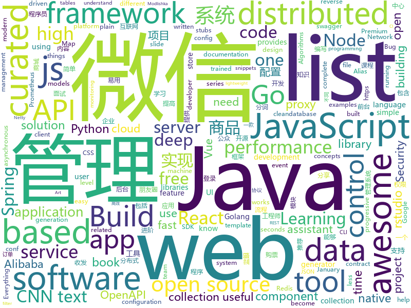

# 2019-01-17
See what the GitHub community is most excited about today.

## python
* [py12306](https://github.com/pjialin/py12306)(**521 stars today**): 🚂12306 购票助手，支持分布式，多账号，多任务购票以及 Web 页面管理
* [12306](https://github.com/testerSunshine/12306)(**376 stars today**): 12306智能刷票，订票
* [deep-learning-ocean](https://github.com/osforscience/deep-learning-ocean)(**331 stars today**): 📡All You Need to Know About Deep Learning - A kick-starter
* [project_alias](https://github.com/bjoernkarmann/project_alias)(**219 stars today**): Alias is a teachable “parasite” that is designed to give users more control over their smart assistants, both when it comes to customisation and privacy. Through a simple app the user can train Alias to react on a custom wake-word/sound, and once trained, Alias can take control over your home assistant by activating it for you.
* [ESFileExplorerOpenPortVuln](https://github.com/fs0c131y/ESFileExplorerOpenPortVuln)(**162 stars today**): ES File Explorer Open Port Vulnerability - CVE-2019-6447
* [super-inspire-end](https://github.com/super-inspire/super-inspire-end)(**148 stars today**): 在不到30s内得到一个干净的开箱即用的临时linux系统.(暂时提供Ubuntu, Centos, Alpine进行测试, 后续会提供更多)
* [CopyTranslator](https://github.com/elliottzheng/CopyTranslator)(**148 stars today**): Foreign language reading and translation assistant based on copy and translate.(Latest: v0.0.7-Kylin-RC1)
* [Gasyori100knock](https://github.com/yoyoyo-yo/Gasyori100knock)(**109 stars today**): 
* [awesome-python-applications](https://github.com/mahmoud/awesome-python-applications)(**98 stars today**): 💿Free software that works great, and also happens to be open-source Python.
* [ObjectDetection-OneStageDet](https://github.com/TencentYoutuResearch/ObjectDetection-OneStageDet)(**88 stars today**): 
* [models](https://github.com/tensorflow/models)(**67 stars today**): Models and examples built with TensorFlow
* [mps-youtube](https://github.com/mps-youtube/mps-youtube)(**82 stars today**): Terminal based YouTube player and downloader
* [Very-deep-cnn-tensorflow](https://github.com/1991viet/Very-deep-cnn-tensorflow)(**63 stars today**): Very deep CNN for text classification
* [Virtuailor](https://github.com/0xgalz/Virtuailor)(**73 stars today**): IDAPython tool for creating automatic C++ virtual tables in IDA Pro
* [Character-level-cnn-pytorch](https://github.com/1991viet/Character-level-cnn-pytorch)(**63 stars today**): Character-level CNN for text classification
* [Character-level-cnn-tensorflow](https://github.com/1991viet/Character-level-cnn-tensorflow)(**60 stars today**): Character-level CNN for text classification
* [Very-deep-cnn-pytorch](https://github.com/1991viet/Very-deep-cnn-pytorch)(**60 stars today**): Very deep CNN for text classification
* [bert](https://github.com/google-research/bert)(**59 stars today**): TensorFlow code and pre-trained models for BERT
* [Bashfuscator](https://github.com/Bashfuscator/Bashfuscator)(**63 stars today**): A fully configurable and extendable Bash obfuscation framework. This tool is intended to help both red team and blue team.
* [pkuseg-python](https://github.com/lancopku/pkuseg-python)(**62 stars today**): python版本：领域细分的中文分词工具，简单易用，跟现有开源工具相比提高了分词的准确率。
* [keras](https://github.com/keras-team/keras)(**52 stars today**): Deep Learning for humans
* [awesome-python](https://github.com/vinta/awesome-python)(**54 stars today**): A curated list of awesome Python frameworks, libraries, software and resources
* [12306](https://github.com/V-I-C-T-O-R/12306)(**57 stars today**): IP封禁好厉害，希望大家都能顺利回家！！！
* [public-apis](https://github.com/toddmotto/public-apis)(**52 stars today**): A collective list of free APIs for use in software and web development.
* [FaceBoxes.PyTorch](https://github.com/zisianw/FaceBoxes.PyTorch)(**44 stars today**): A PyTorch Implementation of FaceBoxes

## java
* [advanced-java](https://github.com/doocs/advanced-java)(**255 stars today**): 😮互联网 Java 工程师进阶知识完全扫盲
* [JavaGuide](https://github.com/Snailclimb/JavaGuide)(**201 stars today**): 【Java学习+面试指南】 一份涵盖大部分Java程序员所需要掌握的核心知识。
* [mall](https://github.com/macrozheng/mall)(**148 stars today**): mall项目是一套电商系统，包括前台商城系统及后台管理系统，基于SpringBoot+MyBatis实现。 前台商城系统包含首页门户、商品推荐、商品搜索、商品展示、购物车、订单流程、会员中心、客户服务、帮助中心等模块。 后台管理系统包含商品管理、订单管理、会员管理、促销管理、运营管理、内容管理、统计报表、财务管理、权限管理、设置等模块。
* [miaosha](https://github.com/qiurunze123/miaosha)(**130 stars today**): ⛹️🐘秒杀系统设计与实现.互联网工程师进阶与分析🙋🐓
* [fescar](https://github.com/alibaba/fescar)(**122 stars today**): Fescar is an easy-to-use, high-performance, java based, open source distributed transaction solution.
* [apollo](https://github.com/ctripcorp/apollo)(**67 stars today**): Apollo（阿波罗）是携程框架部门研发的分布式配置中心，能够集中化管理应用不同环境、不同集群的配置，配置修改后能够实时推送到应用端，并且具备规范的权限、流程治理等特性，适用于微服务配置管理场景。
* [interviews](https://github.com/kdn251/interviews)(**56 stars today**): Everything you need to know to get the job.
* [DDMQ](https://github.com/didi/DDMQ)(**54 stars today**): DDMQ is a distributed messaging product with low latency, high throughput and high availability.
* [tutorials](https://github.com/eugenp/tutorials)(**34 stars today**): The "REST With Spring" Course:
* [spring-boot](https://github.com/spring-projects/spring-boot)(**48 stars today**): Spring Boot
* [arthas](https://github.com/alibaba/arthas)(**50 stars today**): Alibaba Java Diagnostic Tool Arthas/Alibaba Java诊断利器Arthas
* [fdb-record-layer](https://github.com/FoundationDB/fdb-record-layer)(**53 stars today**): A record-oriented store built on FoundationDB
* [nacos](https://github.com/alibaba/nacos)(**47 stars today**): an easy-to-use dynamic service discovery, configuration and service management platform for building cloud native applications.
* [symphony](https://github.com/b3log/symphony)(**45 stars today**): 🎶一款用 Java 实现的现代化社区（论坛/BBS/社交网络/博客）平台。https://hacpai.com
* [XUI](https://github.com/xuexiangjys/XUI)(**41 stars today**): 💍一个简洁而优雅的Android原生UI框架，解放你的双手！
* [spring-framework](https://github.com/spring-projects/spring-framework)(**32 stars today**): Spring Framework
* [redisson](https://github.com/redisson/redisson)(**41 stars today**): Redisson - distributed Java objects and services (Set, Multimap, SortedSet, Map, List, Queue, Deque, Semaphore, Lock, AtomicLong, Map Reduce, Publish / Subscribe, Bloom filter, Spring Cache, Tomcat, Scheduler, JCache API, Hibernate) on top of Redis server. State of the Art Redis Java client
* [incubator-dubbo](https://github.com/apache/incubator-dubbo)(**32 stars today**): Apache Dubbo (incubating) is a high-performance, java based, open source RPC framework.
* [elasticsearch](https://github.com/elastic/elasticsearch)(**34 stars today**): Open Source, Distributed, RESTful Search Engine
* [Sentinel](https://github.com/alibaba/Sentinel)(**34 stars today**): A lightweight powerful flow control component enabling reliability and monitoring for microservices
* [algorithm-study](https://github.com/randian666/algorithm-study)(**30 stars today**): hello world
* [spring-cloud-alibaba](https://github.com/spring-cloud-incubator/spring-cloud-alibaba)(**24 stars today**): Spring Cloud Alibaba provides a one-stop solution for application development for the distributed solutions of Alibaba middleware.
* [netty](https://github.com/netty/netty)(**26 stars today**): Netty project - an event-driven asynchronous network application framework
* [WxJava](https://github.com/Wechat-Group/WxJava)(**27 stars today**): WxJava （微信开发 Java SDK），支持包括微信支付、开放平台、小程序、企业微信/企业号和公众号等的后端开发
* [RxJava](https://github.com/ReactiveX/RxJava)(**26 stars today**): RxJava – Reactive Extensions for the JVM – a library for composing asynchronous and event-based programs using observable sequences for the Java VM.

## unknown
* [A-Programmers-Guide-to-English](https://github.com/yujiangshui/A-Programmers-Guide-to-English)(**403 stars today**): 专为程序员编写的英语学习指南 v1.1
* [developer-roadmap](https://github.com/kamranahmedse/developer-roadmap)(**362 stars today**): Roadmap to becoming a web developer in 2019
* [CS-Notes](https://github.com/CyC2018/CS-Notes)(**120 stars today**): 📚面试必备基础知识
* [gamedesign-playlist](https://github.com/kkga/gamedesign-playlist)(**128 stars today**): 
* [the-book-of-secret-knowledge](https://github.com/trimstray/the-book-of-secret-knowledge)(**114 stars today**): A collection of awesome lists, manuals, blogs, hacks, one-liners, cli/web tools and more. Especially for System and Network Administrators, DevOps, Pentesters or Security Researchers.
* [awesome-react](https://github.com/enaqx/awesome-react)(**111 stars today**): A collection of awesome things regarding React ecosystem.
* [awesome](https://github.com/sindresorhus/awesome)(**95 stars today**): 😎Curated list of awesome lists
* [gitignore](https://github.com/github/gitignore)(**72 stars today**): A collection of useful .gitignore templates
* [You-Dont-Know-JS](https://github.com/getify/You-Dont-Know-JS)(**77 stars today**): A book series on JavaScript. @YDKJS on twitter.
* [GitHubDaily](https://github.com/GitHubDaily/GitHubDaily)(**62 stars today**): GitHubDaily 分享内容定期整理与分类。欢迎推荐、自荐项目，让更多人知道你的项目。
* [awesome-public-datasets](https://github.com/awesomedata/awesome-public-datasets)(**60 stars today**): A topic-centric list of HQ open datasets in public domains. PR ☛☛☛
* [golang-for-nodejs-developers](https://github.com/miguelmota/golang-for-nodejs-developers)(**59 stars today**): Examples of Golang compared to Node.js for learning
* [free-programming-books](https://github.com/EbookFoundation/free-programming-books)(**53 stars today**): 📚Freely available programming books
* [coding-interview-university](https://github.com/jwasham/coding-interview-university)(**46 stars today**): A complete computer science study plan to become a software engineer.
* [Mac.WeChat](https://github.com/changtuiqie/Mac.WeChat)(**54 stars today**): 微信ipad协议、微信mac协议，可实现微信80%功能；支持62数据登录、扫码登录、收发朋友圈、查看朋友圈、微信建群、微信拉人进群、微信公众号阅读、微信消息收发、微信附近的人定位、微信添加好友、微信红包接收、微信防撤回、分享小程序、微信加粉、微信收藏、微信标签等
* [awesome-vue](https://github.com/vuejs/awesome-vue)(**49 stars today**): 🎉A curated list of awesome things related to Vue.js
* [hosts](https://github.com/googlehosts/hosts)(**42 stars today**): 镜像：https://coding.net/u/scaffrey/p/hosts/git
* [rfcs](https://github.com/vuejs/rfcs)(**45 stars today**): RFCs for substantial changes / feature additions to Vue core
* [project-based-learning](https://github.com/tuvtran/project-based-learning)(**40 stars today**): Curated list of project-based tutorials
* [dad-jokes](https://github.com/wesbos/dad-jokes)(**41 stars today**): dad jokes
* [thinkphp-RCE-POC-Collection](https://github.com/SkyBlueEternal/thinkphp-RCE-POC-Collection)(**40 stars today**): thinkphp v5.x 远程代码执行漏洞-POC集合
* [algorithms](https://github.com/jeffgerickson/algorithms)(**35 stars today**): Bug-tracking for Jeff's algorithms book, notes, etc.
* [build-your-own-x](https://github.com/danistefanovic/build-your-own-x)(**36 stars today**): 🤓Build your own (insert technology here)
* [awesome-interview-questions](https://github.com/MaximAbramchuck/awesome-interview-questions)(**32 stars today**): A curated awesome list of lists of interview questions. Feel free to contribute!🎓
* [the-plain-contract](https://github.com/jackmorgan/the-plain-contract)(**36 stars today**): The Plain Contract is a crowsourced, open source freelance contract template, written in plain language.

## javascript
* [nuclear](https://github.com/nukeop/nuclear)(**934 stars today**): Popcorn Time for music
* [shiny](https://github.com/rikschennink/shiny)(**723 stars today**): 🌟Shiny reflections for mobile websites
* [anime](https://github.com/juliangarnier/anime)(**324 stars today**): JavaScript animation engine
* [nodebestpractices](https://github.com/i0natan/nodebestpractices)(**278 stars today**): The largest Node.js best practices list (January 2019)
* [BitVision](https://github.com/shobrook/BitVision)(**245 stars today**): Bitcoin forecasting, trading, and charting software that works entirely in the terminal
* [earth-reverse-engineering](https://github.com/retroplasma/earth-reverse-engineering)(**227 stars today**): WIP
* [CSS-Inspiration](https://github.com/chokcoco/CSS-Inspiration)(**202 stars today**): CSS Inspiration，在这里找到写 CSS 的灵感！
* [alasql](https://github.com/agershun/alasql)(**160 stars today**): AlaSQL.js - JavaScript SQL database for browser and Node.js. Handles both traditional relational tables and nested JSON data (NoSQL). Export, store, and import data from localStorage, IndexedDB, or Excel.
* [vue](https://github.com/vuejs/vue)(**146 stars today**): 🖖Vue.js is a progressive, incrementally-adoptable JavaScript framework for building UI on the web.
* [awesome-mac](https://github.com/jaywcjlove/awesome-mac)(**135 stars today**):  Now we have become very big, Different from the original idea. Collect premium software in various categories.
* [33-js-concepts](https://github.com/leonardomso/33-js-concepts)(**119 stars today**): 📜33 concepts every JavaScript developer should know.
* [react](https://github.com/facebook/react)(**105 stars today**): A declarative, efficient, and flexible JavaScript library for building user interfaces.
* [30-seconds-of-code](https://github.com/30-seconds/30-seconds-of-code)(**101 stars today**): Curated collection of useful JavaScript snippets that you can understand in 30 seconds or less.
* [react-native-web](https://github.com/necolas/react-native-web)(**95 stars today**): React Native for Web
* [security-checklist](https://github.com/brianlovin/security-checklist)(**90 stars today**): A checklist for staying safe on the internet
* [create-react-app](https://github.com/facebook/create-react-app)(**76 stars today**): Set up a modern web app by running one command.
* [gatsby](https://github.com/gatsbyjs/gatsby)(**76 stars today**): Build blazing fast, modern apps and websites with React
* [clean-code-javascript](https://github.com/ryanmcdermott/clean-code-javascript)(**77 stars today**): 🛁Clean Code concepts adapted for JavaScript
* [javascript](https://github.com/airbnb/javascript)(**64 stars today**): JavaScript Style Guide
* [puppeteer](https://github.com/GoogleChrome/puppeteer)(**69 stars today**): Headless Chrome Node API
* [javascript-algorithms](https://github.com/trekhleb/javascript-algorithms)(**66 stars today**): 📝Algorithms and data structures implemented in JavaScript with explanations and links to further readings
* [material-ui](https://github.com/mui-org/material-ui)(**54 stars today**): React components that implement Google's Material Design.
* [taiko-web](https://github.com/bui/taiko-web)(**57 stars today**): Taiko no Tatsujin simulator
* [jest](https://github.com/facebook/jest)(**56 stars today**): Delightful JavaScript Testing.
* [next.js](https://github.com/zeit/next.js)(**54 stars today**): The React Framework

## html
* [AdminLTE](https://github.com/almasaeed2010/AdminLTE)(**54 stars today**): AdminLTE - Free Premium Admin control Panel Theme Based On Bootstrap 3.x
* [blog_os](https://github.com/phil-opp/blog_os)(**43 stars today**): Writing an OS in Rust
* [wtf-2019-rsc](https://github.com/jennybc/wtf-2019-rsc)(**6 stars today**): What They Forgot to Teach You About R, 2019 January 15/16 @ rstudio::conf
* [dataviz](https://github.com/clauswilke/dataviz)(**25 stars today**): A book covering the fundamentals of data visualization.
* [ionic](https://github.com/ionic-team/ionic)(**19 stars today**): Build amazing native and progressive web apps with open web technologies. One app running on everything🎉
* [Spoon-Knife](https://github.com/octocat/Spoon-Knife)(****): This repo is for demonstration purposes only.
* [security_whitepapers](https://github.com/bl4de/security_whitepapers)(**16 stars today**): Collection of misc IT Security related whitepapers, presentations, slides - hacking, bug bounty, web application security, XSS, CSRF, SQLi
* [fastText](https://github.com/facebookresearch/fastText)(**16 stars today**): Library for fast text representation and classification.
* [frida-all-in-one](https://github.com/hookmaster/frida-all-in-one)(**14 stars today**): 《FRIDA操作手册》by @hluwa @r0ysue
* [flutter-in-action](https://github.com/flutterchina/flutter-in-action)(**13 stars today**): 《Flutter实战》电子书
* [zju-icicles](https://github.com/QSCTech/zju-icicles)(**12 stars today**): 浙江大学课程攻略共享计划
* [build-your-own-mint](https://github.com/yyx990803/build-your-own-mint)(**14 stars today**): Build your own personal finance analytics using Plaid, Google Sheets and CircleCI.
* [openapi-generator](https://github.com/OpenAPITools/openapi-generator)(**11 stars today**): OpenAPI Generator allows generation of API client libraries (SDK generation), server stubs, documentation and configuration automatically given an OpenAPI Spec (v2, v3)
* [nginxconfig.io](https://github.com/valentinxxx/nginxconfig.io)(**12 stars today**): ⚙️NGiИX config generator generator on steroids💉
* [swagger-codegen](https://github.com/swagger-api/swagger-codegen)(**9 stars today**): swagger-codegen contains a template-driven engine to generate documentation, API clients and server stubs in different languages by parsing your OpenAPI / Swagger definition.
* [rstudio-conf-2019](https://github.com/topepo/rstudio-conf-2019)(**10 stars today**): Slide, code and data for "Applied Machine Learning" at Rstudio-conf 2019
* [deeplearning_ai_books](https://github.com/fengdu78/deeplearning_ai_books)(**8 stars today**): deeplearning.ai（吴恩达老师的深度学习课程笔记及资源）
* [30-seconds-of-css](https://github.com/30-seconds/30-seconds-of-css)(**9 stars today**): A curated collection of useful CSS snippets you can understand in 30 seconds or less.
* [portainer](https://github.com/portainer/portainer)(**9 stars today**): Simple management UI for Docker
* [JavaScript30](https://github.com/wesbos/JavaScript30)(**7 stars today**): 30 Day Vanilla JS Challenge
* [destyle.css](https://github.com/nicolas-cusan/destyle.css)(**10 stars today**): Opinionated reset stylesheet that provides a clean styling slate for your project.
* [ecma262](https://github.com/tc39/ecma262)(**9 stars today**): Status, process, and documents for ECMA262
* [EIPs](https://github.com/ethereum/EIPs)(**7 stars today**): The Ethereum Improvement Proposal repository
* [design-system-components](https://github.com/govau/design-system-components)(**9 stars today**): 🛠Component code and tests for the design system
* [arm-workshop-rsc2019](https://github.com/rstudio-education/arm-workshop-rsc2019)(**9 stars today**): Materials for the rstudio::conf 2019 Advanced R Markdown workshop

## go
* [act](https://github.com/nektos/act)(**253 stars today**): Run your GitHub Actions locally
* [chezmoi](https://github.com/twpayne/chezmoi)(**160 stars today**): Manage your dotfiles securely across multiple machines.
* [openedge](https://github.com/baidu/openedge)(**105 stars today**): Extend cloud computing, data and service seamlessly to edge devices.
* [go-micro](https://github.com/micro/go-micro)(**100 stars today**): A microservice framework
* [sower](https://github.com/wweir/sower)(**98 stars today**): Yet another cross platform transparent proxy tool
* [stegify](https://github.com/DimitarPetrov/stegify)(**82 stars today**): Go tool for LSB steganography, capable of hiding any file within an image.
* [syncd](https://github.com/dreamans/syncd)(**76 stars today**): syncd是一款开源的代码部署工具，它具有简单、高效、易用等特点，可以提高团队的工作效率.
* [kubernetes](https://github.com/kubernetes/kubernetes)(**59 stars today**): Production-Grade Container Scheduling and Management
* [dragonboat](https://github.com/lni/dragonboat)(**61 stars today**): A feature complete and high performance multi-group Raft library in Go.
* [go](https://github.com/golang/go)(**54 stars today**): The Go programming language
* [mkcert](https://github.com/FiloSottile/mkcert)(**52 stars today**): A simple zero-config tool to make locally trusted development certificates with any names you'd like.
* [gardens](https://github.com/yunnet/gardens)(**45 stars today**): 💎kexin backend manager
* [loki](https://github.com/grafana/loki)(**45 stars today**): Like Prometheus, but for logs.
* [frp](https://github.com/fatedier/frp)(**44 stars today**): A fast reverse proxy to help you expose a local server behind a NAT or firewall to the internet.
* [awesome-go](https://github.com/avelino/awesome-go)(**45 stars today**): A curated list of awesome Go frameworks, libraries and software
* [BaiduPCS-Go](https://github.com/iikira/BaiduPCS-Go)(**40 stars today**): 百度网盘客户端 - Go语言编写
* [prometheus](https://github.com/prometheus/prometheus)(**39 stars today**): The Prometheus monitoring system and time series database.
* [tank](https://github.com/eyebluecn/tank)(**35 stars today**): 蓝眼系列软件之《蓝眼云盘》
* [Modlishka](https://github.com/drk1wi/Modlishka)(**31 stars today**): Modlishka. Reverse Proxy. Phishing NG.
* [etcd](https://github.com/etcd-io/etcd)(**32 stars today**): Distributed reliable key-value store for the most critical data of a distributed system
* [jx](https://github.com/jenkins-x/jx)(**35 stars today**): Jenkins X provides automated CI+CD for Kubernetes with Preview Environments on Pull Requests using Jenkins, Knative Build, Prow, Skaffold and Helm
* [istio](https://github.com/istio/istio)(**30 stars today**): Connect, secure, control, and observe services.
* [build-web-application-with-golang](https://github.com/astaxie/build-web-application-with-golang)(**29 stars today**): A golang ebook intro how to build a web with golang
* [gin](https://github.com/gin-gonic/gin)(**30 stars today**): Gin is a HTTP web framework written in Go (Golang). It features a Martini-like API with much better performance -- up to 40 times faster. If you need smashing performance, get yourself some Gin.
* [yj](https://github.com/sclevine/yj)(**30 stars today**): CLI - YAML <-> TOML <-> JSON <-> HCL

## WordCloud

