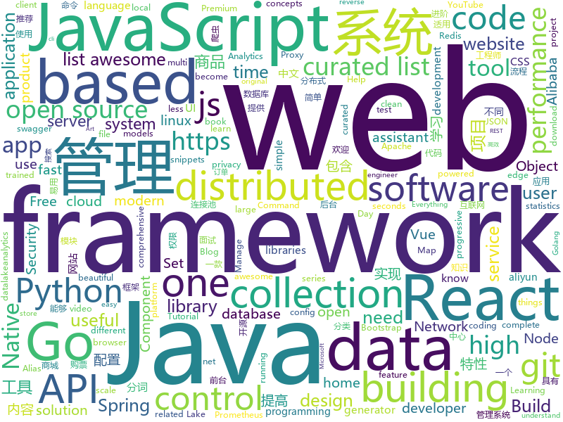

# 2019-01-18
See what the GitHub community is most excited about today.

## python
* [py12306](https://github.com/pjialin/py12306)(**395 stars today**): 🚂12306 购票助手，支持分布式，多账号，多任务购票以及 Web 页面管理
* [12306](https://github.com/testerSunshine/12306)(**251 stars today**): 12306智能刷票，订票
* [deep-learning-ocean](https://github.com/osforscience/deep-learning-ocean)(**270 stars today**): 📡All You Need to Know About Deep Learning - A kick-starter
* [mars](https://github.com/mars-project/mars)(**242 stars today**): Mars is a tensor-based unified framework for large-scale data computation.
* [ObjectDetection-OneStageDet](https://github.com/TencentYoutuResearch/ObjectDetection-OneStageDet)(**212 stars today**): 
* [ESFileExplorerOpenPortVuln](https://github.com/fs0c131y/ESFileExplorerOpenPortVuln)(**149 stars today**): ES File Explorer Open Port Vulnerability - CVE-2019-6447
* [awesome-python](https://github.com/vinta/awesome-python)(**103 stars today**): A curated list of awesome Python frameworks, libraries, software and resources
* [project_alias](https://github.com/bjoernkarmann/project_alias)(**108 stars today**): Alias is a teachable “parasite” that is designed to give users more control over their smart assistants, both when it comes to customisation and privacy. Through a simple app the user can train Alias to react on a custom wake-word/sound, and once trained, Alias can take control over your home assistant by activating it for you.
* [super-inspire-end](https://github.com/super-inspire/super-inspire-end)(**105 stars today**): 在不到30s内得到一个干净的开箱即用的临时linux系统.(暂时提供Ubuntu, Centos, Alpine进行测试, 后续会提供更多, 服务器墙外, 不能翻墙会不稳定, 请在README中找国内版使用)
* [models](https://github.com/tensorflow/models)(**71 stars today**): Models and examples built with TensorFlow
* [system-design-primer](https://github.com/donnemartin/system-design-primer)(**75 stars today**): Learn how to design large-scale systems. Prep for the system design interview. Includes Anki flashcards.
* [awesome-python-applications](https://github.com/mahmoud/awesome-python-applications)(**68 stars today**): 💿Free software that works great, and also happens to be open-source Python.
* [pkuseg-python](https://github.com/lancopku/pkuseg-python)(**65 stars today**): python版本：领域细分的中文分词工具，简单易用，跟现有开源工具相比提高了分词的准确率。
* [mps-youtube](https://github.com/mps-youtube/mps-youtube)(**68 stars today**): Terminal based YouTube player and downloader
* [bert](https://github.com/google-research/bert)(**54 stars today**): TensorFlow code and pre-trained models for BERT
* [public-apis](https://github.com/toddmotto/public-apis)(**58 stars today**): A collective list of free APIs for use in software and web development.
* [CopyTranslator](https://github.com/elliottzheng/CopyTranslator)(**61 stars today**): Foreign language reading and translation assistant based on copy and translate.(Latest: v0.0.7-Kylin-RC1)
* [youtube-dl](https://github.com/rg3/youtube-dl)(**51 stars today**): Command-line program to download videos from YouTube.com and other video sites
* [Python](https://github.com/geekcomputers/Python)(**49 stars today**): My Python Examples
* [keras](https://github.com/keras-team/keras)(**42 stars today**): Deep Learning for humans
* [DenseFusion](https://github.com/j96w/DenseFusion)(**50 stars today**): "DenseFusion: 6D Object Pose Estimation by Iterative Dense Fusion" code repository
* [MORAN_v2](https://github.com/Canjie-Luo/MORAN_v2)(**45 stars today**): MORAN: A Multi-Object Rectified Attention Network for Scene Text Recognition
* [home-assistant](https://github.com/home-assistant/home-assistant)(**36 stars today**): 🏡Open source home automation that puts local control and privacy first
* [django](https://github.com/django/django)(**32 stars today**): The Web framework for perfectionists with deadlines.
* [flask](https://github.com/pallets/flask)(****): The Python micro framework for building web applications.

## java
* [advanced-java](https://github.com/doocs/advanced-java)(**186 stars today**): 😮互联网 Java 工程师进阶知识完全扫盲
* [JavaGuide](https://github.com/Snailclimb/JavaGuide)(**165 stars today**): 【Java学习+面试指南】 一份涵盖大部分Java程序员所需要掌握的核心知识。
* [fescar](https://github.com/alibaba/fescar)(**154 stars today**): Fescar is an easy-to-use, high-performance, java based, open source distributed transaction solution.
* [DDMQ](https://github.com/didi/DDMQ)(**141 stars today**): DDMQ is a distributed messaging product with low latency, high throughput and high availability.
* [miaosha](https://github.com/qiurunze123/miaosha)(**139 stars today**): ⛹️🐘秒杀系统设计与实现.互联网工程师进阶与分析🙋🐓
* [mall](https://github.com/macrozheng/mall)(**107 stars today**): mall项目是一套电商系统，包括前台商城系统及后台管理系统，基于SpringBoot+MyBatis实现。 前台商城系统包含首页门户、商品推荐、商品搜索、商品展示、购物车、订单流程、会员中心、客户服务、帮助中心等模块。 后台管理系统包含商品管理、订单管理、会员管理、促销管理、运营管理、内容管理、统计报表、财务管理、权限管理、设置等模块。
* [XUI](https://github.com/xuexiangjys/XUI)(**84 stars today**): 💍一个简洁而优雅的Android原生UI框架，解放你的双手！
* [nacos](https://github.com/alibaba/nacos)(**70 stars today**): an easy-to-use dynamic service discovery, configuration and service management platform for building cloud native applications.
* [tutorials](https://github.com/eugenp/tutorials)(**31 stars today**): The "REST With Spring" Course:
* [spring-boot](https://github.com/spring-projects/spring-boot)(**46 stars today**): Spring Boot
* [arthas](https://github.com/alibaba/arthas)(**42 stars today**): Alibaba Java Diagnostic Tool Arthas/Alibaba Java诊断利器Arthas
* [elasticsearch](https://github.com/elastic/elasticsearch)(**40 stars today**): Open Source, Distributed, RESTful Search Engine
* [apollo](https://github.com/ctripcorp/apollo)(**37 stars today**): Apollo（阿波罗）是携程框架部门研发的分布式配置中心，能够集中化管理应用不同环境、不同集群的配置，配置修改后能够实时推送到应用端，并且具备规范的权限、流程治理等特性，适用于微服务配置管理场景。
* [incubator-dubbo](https://github.com/apache/incubator-dubbo)(**37 stars today**): Apache Dubbo (incubating) is a high-performance, java based, open source RPC framework.
* [symphony](https://github.com/b3log/symphony)(**37 stars today**): 🎶一款用 Java 实现的现代化社区（论坛/BBS/社交网络/博客）平台。https://hacpai.com
* [spring-cloud-alibaba](https://github.com/spring-cloud-incubator/spring-cloud-alibaba)(**37 stars today**): Spring Cloud Alibaba provides a one-stop solution for application development for the distributed solutions of Alibaba middleware.
* [interviews](https://github.com/kdn251/interviews)(**35 stars today**): Everything you need to know to get the job.
* [cim](https://github.com/crossoverJie/cim)(**32 stars today**): 📲cim(cross IM) 适用于开发者的即时通讯系统
* [spring-framework](https://github.com/spring-projects/spring-framework)(**26 stars today**): Spring Framework
* [fastjson](https://github.com/alibaba/fastjson)(**32 stars today**): 🚄A fast JSON parser/generator for Java. (Aliyun Data Lake Analytics https://www.aliyun.com/product/datalakeanalytics powered by fastjson )
* [HanLP](https://github.com/hankcs/HanLP)(**30 stars today**): 自然语言处理 中文分词 词性标注 命名实体识别 依存句法分析 新词发现 关键词短语提取 自动摘要 文本分类聚类 拼音简繁
* [flink](https://github.com/apache/flink)(**28 stars today**): Apache Flink
* [redisson](https://github.com/redisson/redisson)(**28 stars today**): Redisson - distributed Java objects and services (Set, Multimap, SortedSet, Map, List, Queue, Deque, Semaphore, Lock, AtomicLong, Map Reduce, Publish / Subscribe, Bloom filter, Spring Cache, Tomcat, Scheduler, JCache API, Hibernate) on top of Redis server. State of the Art Redis Java client
* [druid](https://github.com/alibaba/druid)(**28 stars today**): 阿里巴巴数据库事业部出品，为监控而生的数据库连接池。阿里云Data Lake Analytics(https://www.aliyun.com/product/datalakeanalytics )、DRDS、TDDL 连接池powered by Druid
* [guava](https://github.com/google/guava)(**26 stars today**): Google core libraries for Java

## unknown
* [developer-roadmap](https://github.com/kamranahmedse/developer-roadmap)(**380 stars today**): Roadmap to becoming a web developer in 2019
* [react-best-practices](https://github.com/kudos-dude/react-best-practices)(**153 stars today**): A comprehensive reference guide to kickstart your React architecting career!
* [CS-Notes](https://github.com/CyC2018/CS-Notes)(**128 stars today**): 📚面试必备基础知识
* [project-based-learning](https://github.com/tuvtran/project-based-learning)(**114 stars today**): Curated list of project-based tutorials
* [awesome](https://github.com/sindresorhus/awesome)(**110 stars today**): 😎Curated list of awesome lists
* [the-book-of-secret-knowledge](https://github.com/trimstray/the-book-of-secret-knowledge)(**103 stars today**): A collection of awesome lists, manuals, blogs, hacks, one-liners, cli/web tools and more. Especially for System and Network Administrators, DevOps, Pentesters or Security Researchers.
* [100-Days-Of-ML-Code](https://github.com/Avik-Jain/100-Days-Of-ML-Code)(**95 stars today**): 100 Days of ML Coding
* [build-your-own-x](https://github.com/danistefanovic/build-your-own-x)(**95 stars today**): 🤓Build your own (insert technology here)
* [podcast](https://github.com/SwiftCommunityPodcast/podcast)(**97 stars today**): About For and By the Swift Community
* [gitignore](https://github.com/github/gitignore)(**75 stars today**): A collection of useful .gitignore templates
* [You-Dont-Know-JS](https://github.com/getify/You-Dont-Know-JS)(**87 stars today**): A book series on JavaScript. @YDKJS on twitter.
* [free-programming-books](https://github.com/EbookFoundation/free-programming-books)(**61 stars today**): 📚Freely available programming books
* [refactoring-guide-in-turkish](https://github.com/alirizaadiyahsi/refactoring-guide-in-turkish)(**67 stars today**): Türkçe refactoring kılavuzu
* [evergreen-skills-developers](https://github.com/romenrg/evergreen-skills-developers)(**66 stars today**): List of evergreen skills that should serve as a fair assessment of software developers / engineers; as opposed to framework trends
* [awesome-react](https://github.com/enaqx/awesome-react)(**58 stars today**): A collection of awesome things regarding React ecosystem.
* [awesome-vue](https://github.com/vuejs/awesome-vue)(**45 stars today**): 🎉A curated list of awesome things related to Vue.js
* [awesome-public-datasets](https://github.com/awesomedata/awesome-public-datasets)(**41 stars today**): A topic-centric list of HQ open datasets in public domains. PR ☛☛☛
* [coding-interview-university](https://github.com/jwasham/coding-interview-university)(**33 stars today**): A complete computer science study plan to become a software engineer.
* [GitHubDaily](https://github.com/GitHubDaily/GitHubDaily)(**39 stars today**): GitHubDaily 分享内容定期整理与分类。欢迎推荐、自荐项目，让更多人知道你的项目。
* [rstudio2019](https://github.com/karthik/rstudio2019)(**35 stars today**): Resources from my Rstudio::conf 2019 talk
* [hosts](https://github.com/googlehosts/hosts)(**22 stars today**): 镜像：https://coding.net/u/scaffrey/p/hosts/git
* [first-contributions](https://github.com/firstcontributions/first-contributions)(**12 stars today**): 🚀✨Help beginners to contribute to open source projects
* [try](https://github.com/dotnet/try)(**29 stars today**): Try .NET is inline code runner and playground that enables people to experiment and learn about C# in the browser.
* [Best-websites-a-programmer-should-visit](https://github.com/sdmg15/Best-websites-a-programmer-should-visit)(**28 stars today**): 🔗Some useful websites for programmers.
* [react-typescript-cheatsheet](https://github.com/sw-yx/react-typescript-cheatsheet)(**28 stars today**): a cheatsheet for react users using typescript with react for the first (or nth!) time

## javascript
* [shiny](https://github.com/rikschennink/shiny)(**691 stars today**): 🌟Shiny reflections for mobile websites
* [nuclear](https://github.com/nukeop/nuclear)(**646 stars today**): Popcorn Time for music
* [anime](https://github.com/juliangarnier/anime)(**299 stars today**): JavaScript animation engine
* [graphql-engine](https://github.com/hasura/graphql-engine)(**253 stars today**): Blazing fast, instant realtime GraphQL APIs on Postgres with fine grained access control, also trigger webhooks on database events.
* [react-native-web](https://github.com/necolas/react-native-web)(**245 stars today**): React Native for Web
* [BitVision](https://github.com/shobrook/BitVision)(**196 stars today**): Terminal dashboard for Bitcoin trading, forecasting, and charting
* [nodebestpractices](https://github.com/i0natan/nodebestpractices)(**194 stars today**): The largest Node.js best practices list (January 2019)
* [vue](https://github.com/vuejs/vue)(**159 stars today**): 🖖Vue.js is a progressive, incrementally-adoptable JavaScript framework for building UI on the web.
* [CSS-Inspiration](https://github.com/chokcoco/CSS-Inspiration)(**165 stars today**): CSS Inspiration，在这里找到写 CSS 的灵感！
* [react](https://github.com/facebook/react)(**123 stars today**): A declarative, efficient, and flexible JavaScript library for building user interfaces.
* [clean-code-javascript](https://github.com/ryanmcdermott/clean-code-javascript)(**127 stars today**): 🛁Clean Code concepts adapted for JavaScript
* [gatsby-starter-egghead-blog](https://github.com/eggheadio/gatsby-starter-egghead-blog)(**97 stars today**): 
* [awesome-mac](https://github.com/jaywcjlove/awesome-mac)(**99 stars today**):  Now we have become very big, Different from the original idea. Collect premium software in various categories.
* [30-seconds-of-code](https://github.com/30-seconds/30-seconds-of-code)(**92 stars today**): Curated collection of useful JavaScript snippets that you can understand in 30 seconds or less.
* [puppeteer](https://github.com/GoogleChrome/puppeteer)(**84 stars today**): Headless Chrome Node API
* [33-js-concepts](https://github.com/leonardomso/33-js-concepts)(**81 stars today**): 📜33 concepts every JavaScript developer should know.
* [create-react-app](https://github.com/facebook/create-react-app)(**67 stars today**): Set up a modern web app by running one command.
* [alasql](https://github.com/agershun/alasql)(**78 stars today**): AlaSQL.js - JavaScript SQL database for browser and Node.js. Handles both traditional relational tables and nested JSON data (NoSQL). Export, store, and import data from localStorage, IndexedDB, or Excel.
* [javascript-algorithms](https://github.com/trekhleb/javascript-algorithms)(**73 stars today**): 📝Algorithms and data structures implemented in JavaScript with explanations and links to further readings
* [earth-reverse-engineering](https://github.com/retroplasma/earth-reverse-engineering)(**75 stars today**): WIP
* [Motrix](https://github.com/agalwood/Motrix)(**72 stars today**): A full-featured download manager.
* [taiko-web](https://github.com/bui/taiko-web)(**73 stars today**): Taiko no Tatsujin simulator
* [next.js](https://github.com/zeit/next.js)(**66 stars today**): The React Framework
* [storybook](https://github.com/storybooks/storybook)(**63 stars today**): Interactive UI component dev & test: React, React Native, Vue, Angular, Ember
* [javascript](https://github.com/airbnb/javascript)(**62 stars today**): JavaScript Style Guide

## html
* [AdminLTE](https://github.com/almasaeed2010/AdminLTE)(**33 stars today**): AdminLTE - Free Premium Admin control Panel Theme Based On Bootstrap 3.x
* [flutter-in-action](https://github.com/flutterchina/flutter-in-action)(**25 stars today**): 《Flutter实战》电子书
* [ionic](https://github.com/ionic-team/ionic)(**17 stars today**): Build amazing native and progressive web apps with open web technologies. One app running on everything🎉
* [swagger-codegen](https://github.com/swagger-api/swagger-codegen)(**20 stars today**): swagger-codegen contains a template-driven engine to generate documentation, API clients and server stubs in different languages by parsing your OpenAPI / Swagger definition.
* [design-system-components](https://github.com/govau/design-system-components)(**23 stars today**): 🛠Component code and tests for the design system
* [JavaScript30](https://github.com/wesbos/JavaScript30)(**19 stars today**): 30 Day Vanilla JS Challenge
* [Spoon-Knife](https://github.com/octocat/Spoon-Knife)(****): This repo is for demonstration purposes only.
* [solid](https://github.com/solid/solid)(**17 stars today**): Solid - Re-decentralizing the web (project directory)
* [blog_os](https://github.com/phil-opp/blog_os)(**16 stars today**): Writing an OS in Rust
* [30-seconds-of-css](https://github.com/30-seconds/30-seconds-of-css)(**15 stars today**): A curated collection of useful CSS snippets you can understand in 30 seconds or less.
* [htm-editable-resume](https://github.com/mucahitgurbuz/htm-editable-resume)(**16 stars today**): An highly editable resume form developed with HTM (Hyperscript Tagged Markup) which is JSX-like syntax in plain JavaScript.
* [MSEdgeExplainers](https://github.com/MicrosoftEdge/MSEdgeExplainers)(**14 stars today**): Home for explainer documents originated by the Microsoft Edge team
* [nginxconfig.io](https://github.com/valentinxxx/nginxconfig.io)(**14 stars today**): ⚙️NGiИX config generator generator on steroids💉
* [design-blocks](https://github.com/froala/design-blocks)(**13 stars today**): A set of 170+ Bootstrap based design blocks ready to be used to create clean modern websites.
* [qiubaiying.github.io](https://github.com/qiubaiying/qiubaiying.github.io)(**8 stars today**): BY Blog ->
* [Seeing-Theory](https://github.com/seeingtheory/Seeing-Theory)(**11 stars today**): A visual introduction to probability and statistics.
* [javascript-tutorial-en](https://github.com/iliakan/javascript-tutorial-en)(**11 stars today**): Modern JavaScript Tutorial
* [Anti-Anti-Spider](https://github.com/luyishisi/Anti-Anti-Spider)(**11 stars today**): 越来越多的网站具有反爬虫特性，有的用图片隐藏关键数据，有的使用反人类的验证码，建立反反爬虫的代码仓库，通过与不同特性的网站做斗争（无恶意）提高技术。（欢迎提交难以采集的网站）（因工作原因，项目暂停）
* [dataviz](https://github.com/clauswilke/dataviz)(**10 stars today**): A book covering the fundamentals of data visualization.
* [deeplearning_ai_books](https://github.com/fengdu78/deeplearning_ai_books)(**10 stars today**): deeplearning.ai（吴恩达老师的深度学习课程笔记及资源）
* [scikit-learn-doc-zh](https://github.com/apachecn/scikit-learn-doc-zh)(**9 stars today**): 📖[译] scikit-learn（sklearn） 中文文档
* [security_whitepapers](https://github.com/bl4de/security_whitepapers)(**9 stars today**): Collection of misc IT Security related whitepapers, presentations, slides - hacking, bug bounty, web application security, XSS, CSRF, SQLi
* [linux-command](https://github.com/jaywcjlove/linux-command)(**9 stars today**): Linux命令大全搜索工具，内容包含Linux命令手册、详解、学习、搜集。https://git.io/linux
* [beautiful-jekyll](https://github.com/daattali/beautiful-jekyll)(**5 stars today**): ✨Build a beautiful and simple website in literally minutes. Demo at http://deanattali.com/beautiful-jekyll
* [polymer](https://github.com/Polymer/polymer)(**9 stars today**): Our original Web Component library.

## go
* [act](https://github.com/nektos/act)(**290 stars today**): Run your GitHub Actions locally
* [syncd](https://github.com/dreamans/syncd)(**120 stars today**): syncd是一款开源的代码部署工具，它具有简单、高效、易用等特点，可以提高团队的工作效率.
* [gitbatch](https://github.com/isacikgoz/gitbatch)(**117 stars today**): manage your git repositories in one place
* [go-micro](https://github.com/micro/go-micro)(**108 stars today**): A microservice framework
* [Modlishka](https://github.com/drk1wi/Modlishka)(**82 stars today**): Modlishka. Reverse Proxy. Phishing NG.
* [chezmoi](https://github.com/twpayne/chezmoi)(**82 stars today**): Manage your dotfiles securely across multiple machines.
* [mkcert](https://github.com/FiloSottile/mkcert)(**82 stars today**): A simple zero-config tool to make locally trusted development certificates with any names you'd like.
* [stegify](https://github.com/DimitarPetrov/stegify)(**64 stars today**): Go tool for LSB steganography, capable of hiding any file within an image.
* [kubernetes](https://github.com/kubernetes/kubernetes)(**51 stars today**): Production-Grade Container Scheduling and Management
* [stats](https://github.com/montanaflynn/stats)(**60 stars today**): A well tested and comprehensive Golang statistics library package with no dependencies.
* [go](https://github.com/golang/go)(**52 stars today**): The Go programming language
* [frp](https://github.com/fatedier/frp)(**42 stars today**): A fast reverse proxy to help you expose a local server behind a NAT or firewall to the internet.
* [BaiduPCS-Go](https://github.com/iikira/BaiduPCS-Go)(**40 stars today**): 百度网盘客户端 - Go语言编写
* [hugo](https://github.com/gohugoio/hugo)(**40 stars today**): The world’s fastest framework for building websites.
* [awesome-go](https://github.com/avelino/awesome-go)(**37 stars today**): A curated list of awesome Go frameworks, libraries and software
* [etcd](https://github.com/etcd-io/etcd)(**33 stars today**): Distributed reliable key-value store for the most critical data of a distributed system
* [gin](https://github.com/gin-gonic/gin)(**31 stars today**): Gin is a HTTP web framework written in Go (Golang). It features a Martini-like API with much better performance -- up to 40 times faster. If you need smashing performance, get yourself some Gin.
* [loki](https://github.com/grafana/loki)(**32 stars today**): Like Prometheus, but for logs.
* [gitea](https://github.com/go-gitea/gitea)(**31 stars today**): Git with a cup of tea, painless self-hosted git service
* [openedge](https://github.com/baidu/openedge)(**31 stars today**): Extend cloud computing, data and service seamlessly to edge devices.
* [dragonboat](https://github.com/lni/dragonboat)(**29 stars today**): A feature complete and high performance multi-group Raft library in Go.
* [v2ray-core](https://github.com/v2ray/v2ray-core)(**27 stars today**): A platform for building proxies to bypass network restrictions.
* [prometheus](https://github.com/prometheus/prometheus)(**26 stars today**): The Prometheus monitoring system and time series database.
* [serve](https://github.com/syntaqx/serve)(**27 stars today**): a static http server anywhere you need one.
* [gaia](https://github.com/gaia-pipeline/gaia)(**26 stars today**): Build powerful pipelines in any programming language.

## WordCloud

