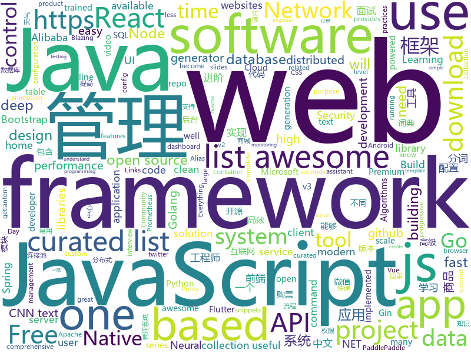

# 2019-01-19
See what the GitHub community is most excited about today.

## python
* [howmanypeoplearearound](https://github.com/schollz/howmanypeoplearearound)(**888 stars today**): Count the number of people around you👨‍👨‍👦by monitoring wifi signals📡
* [py12306](https://github.com/pjialin/py12306)(**366 stars today**): 🚂12306 购票助手，支持分布式，多账号，多任务购票以及 Web 页面管理
* [12306](https://github.com/testerSunshine/12306)(**224 stars today**): 12306智能刷票，订票
* [PARL](https://github.com/PaddlePaddle/PARL)(**110 stars today**): PARL PaddlePaddle Reinforcement Learning Framework
* [deep-learning-ocean](https://github.com/osforscience/deep-learning-ocean)(**123 stars today**): 📡All You Need to Know About Deep Learning - A kick-starter
* [weixin_crawler](https://github.com/wonderfulsuccess/weixin_crawler)(**94 stars today**): 高效微信公众号历史文章和阅读数据爬虫powered by scrapy
* [ObjectDetection-OneStageDet](https://github.com/TencentYoutuResearch/ObjectDetection-OneStageDet)(**84 stars today**): 
* [mars](https://github.com/mars-project/mars)(**84 stars today**): Mars is a tensor-based unified framework for large-scale data computation.
* [mindsdb](https://github.com/mindsdb/mindsdb)(**75 stars today**): Framework to streamline use of neural networks
* [models](https://github.com/tensorflow/models)(**58 stars today**): Models and examples built with TensorFlow
* [bert](https://github.com/google-research/bert)(**68 stars today**): TensorFlow code and pre-trained models for BERT
* [awesome-python](https://github.com/vinta/awesome-python)(**68 stars today**): A curated list of awesome Python frameworks, libraries, software and resources
* [system-design-primer](https://github.com/donnemartin/system-design-primer)(**59 stars today**): Learn how to design large-scale systems. Prep for the system design interview. Includes Anki flashcards.
* [ESFileExplorerOpenPortVuln](https://github.com/fs0c131y/ESFileExplorerOpenPortVuln)(**50 stars today**): ES File Explorer Open Port Vulnerability - CVE-2019-6447
* [project_alias](https://github.com/bjoernkarmann/project_alias)(**57 stars today**): Alias is a teachable “parasite” that is designed to give users more control over their smart assistants, both when it comes to customisation and privacy. Through a simple app the user can train Alias to react on a custom wake-word/sound, and once trained, Alias can take control over your home assistant by activating it for you.
* [youtube-dl](https://github.com/rg3/youtube-dl)(**54 stars today**): Command-line program to download videos from YouTube.com and other video sites
* [Character-level-cnn-tensorflow](https://github.com/1991viet/Character-level-cnn-tensorflow)(**53 stars today**): Character-level CNN for text classification
* [Very-deep-cnn-tensorflow](https://github.com/1991viet/Very-deep-cnn-tensorflow)(**53 stars today**): Very deep CNN for text classification
* [pkuseg-python](https://github.com/lancopku/pkuseg-python)(**55 stars today**): python版本：领域细分的中文分词工具，简单易用，跟现有开源工具相比提高了分词的准确率。
* [Very-deep-cnn-pytorch](https://github.com/1991viet/Very-deep-cnn-pytorch)(**51 stars today**): Very deep CNN for text classification
* [Character-level-cnn-pytorch](https://github.com/1991viet/Character-level-cnn-pytorch)(**51 stars today**): Character-level CNN for text classification
* [super-inspire-end](https://github.com/super-inspire/super-inspire-end)(**52 stars today**): Get a clean, out of the box, temporary Linux system in under 30s.(Ubuntu, Centos, Alpine are temporarily available for testing, and more will be provided later.)
* [MORAN_v2](https://github.com/Canjie-Luo/MORAN_v2)(**40 stars today**): MORAN: A Multi-Object Rectified Attention Network for Scene Text Recognition
* [awesome-python-applications](https://github.com/mahmoud/awesome-python-applications)(**44 stars today**): 💿Free software that works great, and also happens to be open-source Python.
* [public-apis](https://github.com/toddmotto/public-apis)(****): A collective list of free APIs for use in software and web development.

## java
* [dbeaver](https://github.com/dbeaver/dbeaver)(**238 stars today**): Free universal database tool and SQL client
* [JavaGuide](https://github.com/Snailclimb/JavaGuide)(**167 stars today**): 【Java学习+面试指南】 一份涵盖大部分Java程序员所需要掌握的核心知识。
* [advanced-java](https://github.com/doocs/advanced-java)(**144 stars today**): 😮互联网 Java 工程师进阶知识完全扫盲
* [fescar](https://github.com/alibaba/fescar)(**124 stars today**): Fescar is an easy-to-use, high-performance, java based, open source distributed transaction solution.
* [miaosha](https://github.com/qiurunze123/miaosha)(**107 stars today**): ⛹️🐘秒杀系统设计与实现.互联网工程师进阶与分析🙋🐓
* [nacos](https://github.com/alibaba/nacos)(**87 stars today**): an easy-to-use dynamic service discovery, configuration and service management platform for building cloud native applications.
* [mall](https://github.com/macrozheng/mall)(**61 stars today**): mall项目是一套电商系统，包括前台商城系统及后台管理系统，基于SpringBoot+MyBatis实现。 前台商城系统包含首页门户、商品推荐、商品搜索、商品展示、购物车、订单流程、会员中心、客户服务、帮助中心等模块。 后台管理系统包含商品管理、订单管理、会员管理、促销管理、运营管理、内容管理、统计报表、财务管理、权限管理、设置等模块。
* [incubator-dubbo](https://github.com/apache/incubator-dubbo)(**45 stars today**): Apache Dubbo (incubating) is a high-performance, java based, open source RPC framework.
* [spring-boot](https://github.com/spring-projects/spring-boot)(**42 stars today**): Spring Boot
* [arthas](https://github.com/alibaba/arthas)(**45 stars today**): Alibaba Java Diagnostic Tool Arthas/Alibaba Java诊断利器Arthas
* [spring-cloud-alibaba](https://github.com/spring-cloud-incubator/spring-cloud-alibaba)(**42 stars today**): Spring Cloud Alibaba provides a one-stop solution for application development for the distributed solutions of Alibaba middleware.
* [XUI](https://github.com/xuexiangjys/XUI)(**43 stars today**): 💍一个简洁而优雅的Android原生UI框架，解放你的双手！
* [elasticsearch](https://github.com/elastic/elasticsearch)(**35 stars today**): Open Source, Distributed, RESTful Search Engine
* [tutorials](https://github.com/eugenp/tutorials)(**23 stars today**): The "REST With Spring" Course:
* [interviews](https://github.com/kdn251/interviews)(**32 stars today**): Everything you need to know to get the job.
* [apollo](https://github.com/ctripcorp/apollo)(**31 stars today**): Apollo（阿波罗）是携程框架部门研发的分布式配置中心，能够集中化管理应用不同环境、不同集群的配置，配置修改后能够实时推送到应用端，并且具备规范的权限、流程治理等特性，适用于微服务配置管理场景。
* [spring-framework](https://github.com/spring-projects/spring-framework)(**25 stars today**): Spring Framework
* [symphony](https://github.com/b3log/symphony)(**31 stars today**): 🎶一款用 Java 实现的现代化社区（论坛/BBS/社交网络/博客）平台。https://hacpai.com
* [Java](https://github.com/TheAlgorithms/Java)(**26 stars today**): All Algorithms implemented in Java
* [druid](https://github.com/alibaba/druid)(**27 stars today**): 阿里巴巴数据库事业部出品，为监控而生的数据库连接池。阿里云Data Lake Analytics(https://www.aliyun.com/product/datalakeanalytics )、DRDS、TDDL 连接池powered by Druid
* [SpringBoot-Learning](https://github.com/dyc87112/SpringBoot-Learning)(**26 stars today**): Spring Boot教程
* [DDMQ](https://github.com/didi/DDMQ)(**25 stars today**): DDMQ is a distributed messaging product with low latency, high throughput and high availability.
* [rocketmq](https://github.com/apache/rocketmq)(**23 stars today**): Mirror of Apache RocketMQ
* [HanLP](https://github.com/hankcs/HanLP)(**26 stars today**): 自然语言处理 中文分词 词性标注 命名实体识别 依存句法分析 新词发现 关键词短语提取 自动摘要 文本分类聚类 拼音简繁
* [lottie-android](https://github.com/airbnb/lottie-android)(**25 stars today**): Render After Effects animations natively on Android and iOS, Web, and React Native

## unknown
* [developer-roadmap](https://github.com/kamranahmedse/developer-roadmap)(**270 stars today**): Roadmap to becoming a web developer in 2019
* [blog](https://github.com/yygmind/blog)(**179 stars today**): 我是木易杨，网易高级前端工程师，跟着我每周重点攻克一个前端面试重难点。接下来让我带你走进高级前端的世界，在进阶的路上，共勉！
* [the-book-of-secret-knowledge](https://github.com/trimstray/the-book-of-secret-knowledge)(**138 stars today**): A collection of awesome lists, manuals, blogs, hacks, one-liners, cli/web tools and more. Especially for System and Network Administrators, DevOps, Pentesters or Security Researchers.
* [awesome](https://github.com/sindresorhus/awesome)(**117 stars today**): 😎Curated list of awesome lists
* [100-Days-Of-ML-Code](https://github.com/Avik-Jain/100-Days-Of-ML-Code)(**92 stars today**): 100 Days of ML Coding
* [CS-Notes](https://github.com/CyC2018/CS-Notes)(**86 stars today**): 📚面试必备基础知识
* [awesome-jupyter](https://github.com/markusschanta/awesome-jupyter)(**76 stars today**): A curated list of awesome Jupyter projects, libraries and resources
* [You-Dont-Know-JS](https://github.com/getify/You-Dont-Know-JS)(**73 stars today**): A book series on JavaScript. @YDKJS on twitter.
* [react-best-practices](https://github.com/kudos-dude/react-best-practices)(**77 stars today**): A comprehensive reference guide to kickstart your React architecting career!
* [gitignore](https://github.com/github/gitignore)(**59 stars today**): A collection of useful .gitignore templates
* [free-programming-books](https://github.com/EbookFoundation/free-programming-books)(**59 stars today**): 📚Freely available programming books
* [easy-application](https://github.com/j-delaney/easy-application)(**60 stars today**): Over 400 software engineering companies that are easy to apply to
* [build-your-own-x](https://github.com/danistefanovic/build-your-own-x)(**57 stars today**): 🤓Build your own (insert technology here)
* [RStudioConf2019Slides](https://github.com/kbroman/RStudioConf2019Slides)(**50 stars today**): Links to slides for rstudio::conf 2019
* [evergreen-skills-developers](https://github.com/romenrg/evergreen-skills-developers)(**50 stars today**): List of evergreen skills that should serve as a fair assessment of software developers / engineers; as opposed to framework trends
* [stockpredictionai](https://github.com/borisbanushev/stockpredictionai)(**41 stars today**): In this noteboook I will create a complete process for predicting stock price movements. Follow along and we will achieve some pretty good results. For that purpose we will use a Generative Adversarial Network (GAN) with LSTM, a type of Recurrent Neural Network, as generator, and a Convolutional Neural Network, CNN, as a discriminator. We use L…
* [project-based-learning](https://github.com/tuvtran/project-based-learning)(**37 stars today**): Curated list of project-based tutorials
* [awesome-vue](https://github.com/vuejs/awesome-vue)(**37 stars today**): 🎉A curated list of awesome things related to Vue.js
* [coding-interview-university](https://github.com/jwasham/coding-interview-university)(**33 stars today**): A complete computer science study plan to become a software engineer.
* [-Api](https://github.com/jokermonn/-Api)(**32 stars today**): 📖「一个」、「Time 时光」、「开眼」、「一席」、「梨视频」、「微软必应词典」、「金山词典」、「豆瓣电影」、「中央天气」、「魅族天气」、「每日一文」、「12306」、「途牛」、「快递100」、「快递」应用 Api。仅供学习，禁止商业使用，侵权请联系删除。
* [awesome-for-beginners](https://github.com/MunGell/awesome-for-beginners)(**36 stars today**): A list of awesome beginners-friendly projects.
* [awesome-interview-questions](https://github.com/MaximAbramchuck/awesome-interview-questions)(**36 stars today**): A curated awesome list of lists of interview questions. Feel free to contribute!🎓
* [the-art-of-command-line](https://github.com/jlevy/the-art-of-command-line)(**36 stars today**): Master the command line, in one page
* [refactoring-guide-in-turkish](https://github.com/alirizaadiyahsi/refactoring-guide-in-turkish)(**33 stars today**): Türkçe refactoring kılavuzu
* [podcast](https://github.com/SwiftCommunityPodcast/podcast)(**33 stars today**): About For and By the Swift Community

## javascript
* [shiny](https://github.com/rikschennink/shiny)(**340 stars today**): 🌟Shiny reflections for mobile websites
* [nuclear](https://github.com/nukeop/nuclear)(**262 stars today**): Popcorn Time for music
* [anime](https://github.com/juliangarnier/anime)(**189 stars today**): JavaScript animation engine
* [Musish](https://github.com/Musish/Musish)(**183 stars today**): Apple Music...ish
* [vue](https://github.com/vuejs/vue)(**154 stars today**): 🖖Vue.js is a progressive, incrementally-adoptable JavaScript framework for building UI on the web.
* [graphql-engine](https://github.com/hasura/graphql-engine)(**164 stars today**): Blazing fast, instant realtime GraphQL APIs on Postgres with fine grained access control, also trigger webhooks on database events.
* [nodebestpractices](https://github.com/i0natan/nodebestpractices)(**159 stars today**): The largest Node.js best practices list (January 2019)
* [awesome-mac](https://github.com/jaywcjlove/awesome-mac)(**133 stars today**):  Now we have become very big, Different from the original idea. Collect premium software in various categories.
* [jsdiff](https://github.com/kpdecker/jsdiff)(**124 stars today**): A javascript text differencing implementation.
* [alasql](https://github.com/agershun/alasql)(**123 stars today**): AlaSQL.js - JavaScript SQL database for browser and Node.js. Handles both traditional relational tables and nested JSON data (NoSQL). Export, store, and import data from localStorage, IndexedDB, or Excel.
* [clean-code-javascript](https://github.com/ryanmcdermott/clean-code-javascript)(**110 stars today**): 🛁Clean Code concepts adapted for JavaScript
* [typescript-eslint](https://github.com/typescript-eslint/typescript-eslint)(**110 stars today**): ✨Monorepo for all the tooling which enables ESLint to support TypeScript
* [CSS-Inspiration](https://github.com/chokcoco/CSS-Inspiration)(**102 stars today**): CSS Inspiration，在这里找到写 CSS 的灵感！
* [react-native-web](https://github.com/necolas/react-native-web)(**100 stars today**): React Native for Web
* [react](https://github.com/facebook/react)(**84 stars today**): A declarative, efficient, and flexible JavaScript library for building user interfaces.
* [javascript-algorithms](https://github.com/trekhleb/javascript-algorithms)(**91 stars today**): 📝Algorithms and data structures implemented in JavaScript with explanations and links to further readings
* [30-seconds-of-code](https://github.com/30-seconds/30-seconds-of-code)(**74 stars today**): Curated collection of useful JavaScript snippets that you can understand in 30 seconds or less.
* [BitVision](https://github.com/shobrook/BitVision)(**70 stars today**): Terminal dashboard for Bitcoin trading, forecasting, and charting
* [create-react-app](https://github.com/facebook/create-react-app)(**55 stars today**): Set up a modern web app by running one command.
* [Motrix](https://github.com/agalwood/Motrix)(**60 stars today**): A full-featured download manager.
* [gatsby](https://github.com/gatsbyjs/gatsby)(**56 stars today**): Build blazing fast, modern apps and websites with React
* [puppeteer](https://github.com/GoogleChrome/puppeteer)(**53 stars today**): Headless Chrome Node API
* [javascript](https://github.com/airbnb/javascript)(**55 stars today**): JavaScript Style Guide
* [axios](https://github.com/axios/axios)(**53 stars today**): Promise based HTTP client for the browser and node.js
* [taro](https://github.com/NervJS/taro)(**51 stars today**): 多端统一开发框架，支持用 React 的开发方式编写一次代码，生成能运行在微信/百度/支付宝/字节跳动小程序、H5、React Native 等的应用。 https://taro.js.org/

## html
* [AdminLTE](https://github.com/almasaeed2010/AdminLTE)(**28 stars today**): AdminLTE - Free Premium Admin control Panel Theme Based On Bootstrap 3.x
* [30-seconds-of-css](https://github.com/30-seconds/30-seconds-of-css)(**24 stars today**): A curated collection of useful CSS snippets you can understand in 30 seconds or less.
* [Kakunin](https://github.com/TheSoftwareHouse/Kakunin)(**24 stars today**): An E2E testing framework
* [ionic](https://github.com/ionic-team/ionic)(**15 stars today**): Build amazing native and progressive web apps with open web technologies. One app running on everything🎉
* [flutter-in-action](https://github.com/flutterchina/flutter-in-action)(**19 stars today**): 《Flutter实战》电子书
* [JavaScript30](https://github.com/wesbos/JavaScript30)(**13 stars today**): 30 Day Vanilla JS Challenge
* [blog_os](https://github.com/phil-opp/blog_os)(**18 stars today**): Writing an OS in Rust
* [destyle.css](https://github.com/nicolas-cusan/destyle.css)(**16 stars today**): Opinionated reset stylesheet that provides a clean styling slate for your project.
* [Spoon-Knife](https://github.com/octocat/Spoon-Knife)(****): This repo is for demonstration purposes only.
* [design-system-components](https://github.com/govau/design-system-components)(**14 stars today**): 🛠Component code and tests for the design system
* [javascript-tutorial-en](https://github.com/iliakan/javascript-tutorial-en)(**10 stars today**): Modern JavaScript Tutorial
* [try_git](https://github.com/windyzj/try_git)(****): 
* [portainer](https://github.com/portainer/portainer)(**10 stars today**): Simple management UI for Docker
* [ITM2018](https://github.com/Jabont/ITM2018)(**9 stars today**): IT Multimedia 2018
* [nginxconfig.io](https://github.com/valentinxxx/nginxconfig.io)(**9 stars today**): ⚙️NGiИX config generator generator on steroids💉
* [MSEdgeExplainers](https://github.com/MicrosoftEdge/MSEdgeExplainers)(**9 stars today**): Home for explainer documents originated by the Microsoft Edge team
* [openapi-generator](https://github.com/OpenAPITools/openapi-generator)(**8 stars today**): OpenAPI Generator allows generation of API client libraries (SDK generation), server stubs, documentation and configuration automatically given an OpenAPI Spec (v2, v3)
* [security_whitepapers](https://github.com/bl4de/security_whitepapers)(**7 stars today**): Collection of misc IT Security related whitepapers, presentations, slides - hacking, bug bounty, web application security, XSS, CSRF, SQLi
* [WebFundamentals](https://github.com/google/WebFundamentals)(**5 stars today**): Best practices for modern web development
* [scikit-learn-doc-zh](https://github.com/apachecn/scikit-learn-doc-zh)(**5 stars today**): 📖[译] scikit-learn（sklearn） 中文文档
* [zju-icicles](https://github.com/QSCTech/zju-icicles)(**6 stars today**): 浙江大学课程攻略共享计划
* [bootstrap-table](https://github.com/wenzhixin/bootstrap-table)(**7 stars today**): An extended Bootstrap table with radio, checkbox, sort, pagination, and other added features. (supports twitter bootstrap v2, v3 and v4)
* [dotnet](https://github.com/Microsoft/dotnet)(**7 stars today**): This repo is the official home of .NET on GitHub. It's a great starting point to find many .NET OSS projects from Microsoft and the community, including many that are part of the .NET Foundation.
* [book](https://github.com/PaddlePaddle/book)(**5 stars today**): Deep Learning 101 with PaddlePaddle （深度学习框架入门教程）
* [Adminator-admin-dashboard](https://github.com/puikinsh/Adminator-admin-dashboard)(**5 stars today**): Adminator is a easy to use and well design admin dashboard template for web apps, websites, services and more

## go
* [go-flutter-desktop-embedder](https://github.com/Drakirus/go-flutter-desktop-embedder)(**295 stars today**): A Go (golang) Custom Flutter Engine Embedder for desktop
* [tengo](https://github.com/d5/tengo)(**280 stars today**): A fast script language for Go
* [act](https://github.com/nektos/act)(**238 stars today**): Run your GitHub Actions locally
* [go-micro](https://github.com/micro/go-micro)(**116 stars today**): A microservice framework
* [kubernetes](https://github.com/kubernetes/kubernetes)(**75 stars today**): Production-Grade Container Scheduling and Management
* [tinygo](https://github.com/aykevl/tinygo)(**83 stars today**): Go compiler for small devices, based on LLVM.
* [go](https://github.com/golang/go)(**76 stars today**): The Go programming language
* [chezmoi](https://github.com/twpayne/chezmoi)(**63 stars today**): Manage your dotfiles securely across multiple machines.
* [Modlishka](https://github.com/drk1wi/Modlishka)(**54 stars today**): Modlishka. Reverse Proxy. Phishing NG.
* [stats](https://github.com/montanaflynn/stats)(**59 stars today**): A well tested and comprehensive Golang statistics library package with no dependencies.
* [loki](https://github.com/grafana/loki)(**56 stars today**): Like Prometheus, but for logs.
* [frp](https://github.com/fatedier/frp)(**53 stars today**): A fast reverse proxy to help you expose a local server behind a NAT or firewall to the internet.
* [serve](https://github.com/syntaqx/serve)(**50 stars today**): a static http server anywhere you need one.
* [freno](https://github.com/github/freno)(**49 stars today**): freno: cooperative, highly available throttler service
* [mkcert](https://github.com/FiloSottile/mkcert)(**49 stars today**): A simple zero-config tool to make locally trusted development certificates with any names you'd like.
* [caire](https://github.com/esimov/caire)(**46 stars today**): Content aware image resize library
* [gitbatch](https://github.com/isacikgoz/gitbatch)(**42 stars today**): manage your git repositories in one place
* [awesome-go](https://github.com/avelino/awesome-go)(**37 stars today**): A curated list of awesome Go frameworks, libraries and software
* [syncd](https://github.com/dreamans/syncd)(**32 stars today**): syncd是一款开源的代码部署工具，它具有简单、高效、易用等特点，可以提高团队的工作效率.
* [libpod](https://github.com/containers/libpod)(**35 stars today**): libpod is a library used to create container pods.
* [gin](https://github.com/gin-gonic/gin)(**33 stars today**): Gin is a HTTP web framework written in Go (Golang). It features a Martini-like API with much better performance -- up to 40 times faster. If you need smashing performance, get yourself some Gin.
* [build-web-application-with-golang](https://github.com/astaxie/build-web-application-with-golang)(**28 stars today**): A golang ebook intro how to build a web with golang
* [hugo](https://github.com/gohugoio/hugo)(**32 stars today**): The world’s fastest framework for building websites.
* [prometheus](https://github.com/prometheus/prometheus)(**29 stars today**): The Prometheus monitoring system and time series database.
* [lantern](https://github.com/getlantern/lantern)(**30 stars today**): 🔴蓝灯最新版本下载 https://github.com/getlantern/download🔴Lantern Latest Download https://github.com/getlantern/download🔴

## WordCloud

