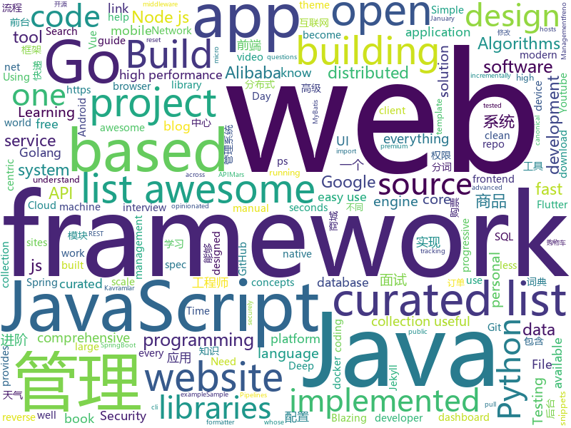

# 2019-01-20
See what the GitHub community is most excited about today.

## python
* [howmanypeoplearearound](https://github.com/schollz/howmanypeoplearearound)(**246 stars today**): Count the number of people around you👨‍👨‍👦by monitoring wifi signals📡
* [py12306](https://github.com/pjialin/py12306)(**152 stars today**): 🚂12306 购票助手，支持分布式，多账号，多任务购票以及 Web 页面管理
* [12306](https://github.com/testerSunshine/12306)(**106 stars today**): 12306智能刷票，订票
* [awesome-python](https://github.com/vinta/awesome-python)(**62 stars today**): A curated list of awesome Python frameworks, libraries, software and resources
* [models](https://github.com/tensorflow/models)(**47 stars today**): Models and examples built with TensorFlow
* [mindsdb](https://github.com/mindsdb/mindsdb)(**52 stars today**): Framework to streamline use of neural networks
* [youtube-dl](https://github.com/rg3/youtube-dl)(**42 stars today**): Command-line program to download videos from YouTube.com and other video sites
* [deep-learning-ocean](https://github.com/osforscience/deep-learning-ocean)(**44 stars today**): 📡All You Need to Know About Deep Learning - A kick-starter
* [system-design-primer](https://github.com/donnemartin/system-design-primer)(**40 stars today**): Learn how to design large-scale systems. Prep for the system design interview. Includes Anki flashcards.
* [lyanna](https://github.com/dongweiming/lyanna)(**38 stars today**): My Blog Using Sanic
* [ObjectDetection-OneStageDet](https://github.com/TencentYoutuResearch/ObjectDetection-OneStageDet)(**31 stars today**): 
* [Python](https://github.com/TheAlgorithms/Python)(**30 stars today**): All Algorithms implemented in Python
* [bert](https://github.com/google-research/bert)(**25 stars today**): TensorFlow code and pre-trained models for BERT
* [public-apis](https://github.com/toddmotto/public-apis)(**29 stars today**): A collective list of free APIs for use in software and web development.
* [keras](https://github.com/keras-team/keras)(**22 stars today**): Deep Learning for humans
* [django](https://github.com/django/django)(**22 stars today**): The Web framework for perfectionists with deadlines.
* [pkuseg-python](https://github.com/lancopku/pkuseg-python)(**27 stars today**): python版本：领域细分的中文分词工具，简单易用，跟现有开源工具相比提高了分词的准确率。
* [AnyAPI](https://github.com/FKLC/AnyAPI)(**28 stars today**): An API Wrapper For Every API
* [mars](https://github.com/mars-project/mars)(**24 stars today**): Mars is a tensor-based unified framework for large-scale data computation.
* [cpython](https://github.com/python/cpython)(**18 stars today**): The Python programming language
* [flask](https://github.com/pallets/flask)(**25 stars today**): The Python micro framework for building web applications.
* [docker-pretty-ps](https://github.com/politeauthority/docker-pretty-ps)(**25 stars today**): Tired of that awful super wide 'docker ps' output? Go vertical! Try docker-pretty-ps!
* [ESFileExplorerOpenPortVuln](https://github.com/fs0c131y/ESFileExplorerOpenPortVuln)(**20 stars today**): ES File Explorer Open Port Vulnerability - CVE-2019-6447
* [awesome-machine-learning](https://github.com/josephmisiti/awesome-machine-learning)(**21 stars today**): A curated list of awesome Machine Learning frameworks, libraries and software.
* [pytext](https://github.com/facebookresearch/pytext)(**18 stars today**): A natural language modeling framework based on PyTorch

## java
* [JavaGuide](https://github.com/Snailclimb/JavaGuide)(**113 stars today**): 【Java学习+面试指南】 一份涵盖大部分Java程序员所需要掌握的核心知识。
* [advanced-java](https://github.com/doocs/advanced-java)(**74 stars today**): 😮互联网 Java 工程师进阶知识完全扫盲
* [mall](https://github.com/macrozheng/mall)(**65 stars today**): mall项目是一套电商系统，包括前台商城系统及后台管理系统，基于SpringBoot+MyBatis实现。 前台商城系统包含首页门户、商品推荐、商品搜索、商品展示、购物车、订单流程、会员中心、客户服务、帮助中心等模块。 后台管理系统包含商品管理、订单管理、会员管理、促销管理、运营管理、内容管理、统计报表、财务管理、权限管理、设置等模块。
* [dbeaver](https://github.com/dbeaver/dbeaver)(**72 stars today**): Free universal database tool and SQL client
* [miaosha](https://github.com/qiurunze123/miaosha)(**61 stars today**): ⛹️🐘秒杀系统设计与实现.互联网工程师进阶与分析🙋🐓
* [nacos](https://github.com/alibaba/nacos)(**54 stars today**): an easy-to-use dynamic service discovery, configuration and service management platform for building cloud native applications.
* [tutorials](https://github.com/eugenp/tutorials)(**42 stars today**): The "REST With Spring" Course:
* [fescar](https://github.com/alibaba/fescar)(**43 stars today**): Fescar is an easy-to-use, high-performance, java based, open source distributed transaction solution.
* [spring-boot](https://github.com/spring-projects/spring-boot)(**31 stars today**): Spring Boot
* [symphony](https://github.com/b3log/symphony)(**35 stars today**): 🎶一款用 Java 实现的现代化社区（论坛/BBS/社交网络/博客）平台。https://hacpai.com
* [spring-cloud-alibaba](https://github.com/spring-cloud-incubator/spring-cloud-alibaba)(**34 stars today**): Spring Cloud Alibaba provides a one-stop solution for application development for the distributed solutions of Alibaba middleware.
* [DDMQ](https://github.com/didi/DDMQ)(**31 stars today**): DDMQ is a distributed messaging product with low latency, high throughput and high availability.
* [interviews](https://github.com/kdn251/interviews)(**24 stars today**): Everything you need to know to get the job.
* [NewPipe](https://github.com/TeamNewPipe/NewPipe)(**26 stars today**): A lightweight Youtube frontend for Android.
* [arthas](https://github.com/alibaba/arthas)(**25 stars today**): Alibaba Java Diagnostic Tool Arthas/Alibaba Java诊断利器Arthas
* [karate](https://github.com/intuit/karate)(**26 stars today**): Web-Services Testing Made Simple
* [Java](https://github.com/TheAlgorithms/Java)(**23 stars today**): All Algorithms implemented in Java
* [java-design-patterns](https://github.com/iluwatar/java-design-patterns)(**21 stars today**): Design patterns implemented in Java
* [elasticsearch](https://github.com/elastic/elasticsearch)(**21 stars today**): Open Source, Distributed, RESTful Search Engine
* [EdXposed](https://github.com/solohsu/EdXposed)(**23 stars today**): Elder driver Xposed Framework
* [XUI](https://github.com/xuexiangjys/XUI)(**20 stars today**): 💍一个简洁而优雅的Android原生UI框架，解放你的双手！
* [incubator-dubbo](https://github.com/apache/incubator-dubbo)(**16 stars today**): Apache Dubbo (incubating) is a high-performance, java based, open source RPC framework.
* [guava](https://github.com/google/guava)(**16 stars today**): Google core libraries for Java
* [JCSprout](https://github.com/crossoverJie/JCSprout)(**16 stars today**): 👨‍🎓Java Core Sprout : basic, concurrent, algorithm
* [apollo](https://github.com/ctripcorp/apollo)(**15 stars today**): Apollo（阿波罗）是携程框架部门研发的分布式配置中心，能够集中化管理应用不同环境、不同集群的配置，配置修改后能够实时推送到应用端，并且具备规范的权限、流程治理等特性，适用于微服务配置管理场景。

## unknown
* [developer-roadmap](https://github.com/kamranahmedse/developer-roadmap)(**177 stars today**): Roadmap to becoming a web developer in 2019
* [spec](https://github.com/ulid/spec)(**175 stars today**): The canonical spec for ulid
* [browser-pwn](https://github.com/m1ghtym0/browser-pwn)(**78 stars today**): An updated collection of resources targeting browser-exploitation.
* [100-Days-Of-ML-Code](https://github.com/Avik-Jain/100-Days-Of-ML-Code)(**63 stars today**): 100 Days of ML Coding
* [blog](https://github.com/yygmind/blog)(**67 stars today**): 我是木易杨，网易高级前端工程师，跟着我每周重点攻克一个前端面试重难点。接下来让我带你走进高级前端的世界，在进阶的路上，共勉！
* [gitignore](https://github.com/github/gitignore)(**47 stars today**): A collection of useful .gitignore templates
* [CS-Notes](https://github.com/CyC2018/CS-Notes)(**50 stars today**): 📚面试必备基础知识
* [the-book-of-secret-knowledge](https://github.com/trimstray/the-book-of-secret-knowledge)(**56 stars today**): A collection of awesome lists, manuals, blogs, hacks, one-liners, cli/web tools and more. Especially for System and Network Administrators, DevOps, Pentesters or Security Researchers.
* [awesome](https://github.com/sindresorhus/awesome)(**52 stars today**): 😎Curated list of awesome lists
* [You-Dont-Know-JS](https://github.com/getify/You-Dont-Know-JS)(**47 stars today**): A book series on JavaScript. @YDKJS on twitter.
* [Python-programming-exercises](https://github.com/zhiwehu/Python-programming-exercises)(**41 stars today**): 100+ Python challenging programming exercises
* [algorithms](https://github.com/jeffgerickson/algorithms)(**37 stars today**): Bug-tracking for Jeff's algorithms book, notes, etc.
* [free-programming-books](https://github.com/EbookFoundation/free-programming-books)(**35 stars today**): 📚Freely available programming books
* [build-your-own-x](https://github.com/danistefanovic/build-your-own-x)(**37 stars today**): 🤓Build your own (insert technology here)
* [coding-interview-university](https://github.com/jwasham/coding-interview-university)(**31 stars today**): A complete computer science study plan to become a software engineer.
* [RStudioConf2019Slides](https://github.com/kbroman/RStudioConf2019Slides)(**31 stars today**): Links to slides for rstudio::conf 2019
* [clean-code-javascript-tr](https://github.com/aligoren/clean-code-javascript-tr)(**32 stars today**): JavaScript için Uyarlanmış Temiz Kod Kavramları
* [awesome-public-datasets](https://github.com/awesomedata/awesome-public-datasets)(**32 stars today**): A topic-centric list of HQ open datasets in public domains. PR ☛☛☛
* [awesome-interview-questions](https://github.com/MaximAbramchuck/awesome-interview-questions)(**27 stars today**): A curated awesome list of lists of interview questions. Feel free to contribute!🎓
* [project-based-learning](https://github.com/tuvtran/project-based-learning)(**27 stars today**): Curated list of project-based tutorials
* [awesome-jupyter](https://github.com/markusschanta/awesome-jupyter)(**27 stars today**): A curated list of awesome Jupyter projects, libraries and resources
* [react-best-practices](https://github.com/kudos-dude/react-best-practices)(**26 stars today**): A comprehensive reference guide to kickstart your React architecting career!
* [-Api](https://github.com/jokermonn/-Api)(**23 stars today**): 📖「一个」、「Time 时光」、「开眼」、「一席」、「梨视频」、「微软必应词典」、「金山词典」、「豆瓣电影」、「中央天气」、「魅族天气」、「每日一文」、「12306」、「途牛」、「快递100」、「快递」应用 Api。仅供学习，禁止商业使用，侵权请联系删除。
* [hosts](https://github.com/googlehosts/hosts)(**19 stars today**): 镜像：https://coding.net/u/scaffrey/p/hosts/git
* [awesome-vue](https://github.com/vuejs/awesome-vue)(**19 stars today**): 🎉A curated list of awesome things related to Vue.js

## javascript
* [typescript-eslint](https://github.com/typescript-eslint/typescript-eslint)(**411 stars today**): ✨Monorepo for all the tooling which enables ESLint to support TypeScript
* [Musish](https://github.com/Musish/Musish)(**284 stars today**): Apple Music...ish
* [shiny](https://github.com/rikschennink/shiny)(**135 stars today**): 🌟Shiny reflections for mobile websites
* [vue](https://github.com/vuejs/vue)(**107 stars today**): 🖖Vue.js is a progressive, incrementally-adoptable JavaScript framework for building UI on the web.
* [anime](https://github.com/juliangarnier/anime)(**91 stars today**): JavaScript animation engine
* [javascript-algorithms](https://github.com/trekhleb/javascript-algorithms)(**71 stars today**): 📝Algorithms and data structures implemented in JavaScript with explanations and links to further readings
* [react](https://github.com/facebook/react)(**66 stars today**): A declarative, efficient, and flexible JavaScript library for building user interfaces.
* [jsdiff](https://github.com/kpdecker/jsdiff)(**72 stars today**): A javascript text differencing implementation.
* [nodebestpractices](https://github.com/i0natan/nodebestpractices)(**71 stars today**): The largest Node.js best practices list (January 2019)
* [nuclear](https://github.com/nukeop/nuclear)(**69 stars today**): Popcorn Time for music
* [alasql](https://github.com/agershun/alasql)(**58 stars today**): AlaSQL.js - JavaScript SQL database for browser and Node.js. Handles both traditional relational tables and nested JSON data (NoSQL). Export, store, and import data from localStorage, IndexedDB, or Excel.
* [polydev](https://github.com/ericclemmons/polydev)(**57 stars today**): Faster, route-centric development for Node.js apps with built-in Hot Module Replacement.
* [30-seconds-of-code](https://github.com/30-seconds/30-seconds-of-code)(**53 stars today**): Curated collection of useful JavaScript snippets that you can understand in 30 seconds or less.
* [awesome-mac](https://github.com/jaywcjlove/awesome-mac)(**51 stars today**):  Now we have become very big, Different from the original idea. Collect premium software in various categories.
* [graphql-engine](https://github.com/hasura/graphql-engine)(**51 stars today**): Blazing fast, instant realtime GraphQL APIs on Postgres with fine grained access control, also trigger webhooks on database events.
* [taiko-web](https://github.com/bui/taiko-web)(**44 stars today**): Taiko no Tatsujin simulator
* [create-react-app](https://github.com/facebook/create-react-app)(**44 stars today**): Set up a modern web app by running one command.
* [33-js-concepts](https://github.com/leonardomso/33-js-concepts)(**43 stars today**): 📜33 concepts every JavaScript developer should know.
* [clean-code-javascript](https://github.com/ryanmcdermott/clean-code-javascript)(**41 stars today**): 🛁Clean Code concepts adapted for JavaScript
* [Motrix](https://github.com/agalwood/Motrix)(**41 stars today**): A full-featured download manager.
* [prettier](https://github.com/prettier/prettier)(**42 stars today**): Prettier is an opinionated code formatter.
* [trilium](https://github.com/zadam/trilium)(**39 stars today**): Build your personal knowledge base with Trilium Notes
* [puppeteer](https://github.com/GoogleChrome/puppeteer)(**36 stars today**): Headless Chrome Node API
* [material-ui](https://github.com/mui-org/material-ui)(**31 stars today**): React components that implement Google's Material Design.
* [gatsby](https://github.com/gatsbyjs/gatsby)(**35 stars today**): Build blazing fast, modern apps and websites with React

## html
* [blog_os](https://github.com/phil-opp/blog_os)(**17 stars today**): Writing an OS in Rust
* [Spoon-Knife](https://github.com/octocat/Spoon-Knife)(****): This repo is for demonstration purposes only.
* [ionic](https://github.com/ionic-team/ionic)(**11 stars today**): Build amazing native and progressive web apps with open web technologies. One app running on everything🎉
* [portainer](https://github.com/portainer/portainer)(**10 stars today**): Simple management UI for Docker
* [Adminator-admin-dashboard](https://github.com/puikinsh/Adminator-admin-dashboard)(**9 stars today**): Adminator is a easy to use and well design admin dashboard template for web apps, websites, services and more
* [flutter-in-action](https://github.com/flutterchina/flutter-in-action)(**8 stars today**): 《Flutter实战》电子书
* [fonts](https://github.com/google/fonts)(**8 stars today**): Font files available from Google Fonts
* [JavaScript30](https://github.com/wesbos/JavaScript30)(**6 stars today**): 30 Day Vanilla JS Challenge
* [javascript-tutorial-en](https://github.com/iliakan/javascript-tutorial-en)(**7 stars today**): Modern JavaScript Tutorial
* [now-github-starter](https://github.com/zeit/now-github-starter)(****): Starter project to demonstrate a project whose pull requests get automatically deployed
* [hugo-academic](https://github.com/gcushen/hugo-academic)(**7 stars today**): The website designer for Hugo. Build and deploy a beautiful website in minutes🚀
* [owasp-mstg](https://github.com/OWASP/owasp-mstg)(**6 stars today**): The Mobile Security Testing Guide (MSTG) is a comprehensive manual for mobile app security testing and reverse engineering.
* [build-your-own-mint](https://github.com/yyx990803/build-your-own-mint)(**6 stars today**): Build your own personal finance analytics using Plaid, Google Sheets and CircleCI.
* [foundation-sites](https://github.com/zurb/foundation-sites)(**6 stars today**): The most advanced responsive front-end framework in the world. Quickly create prototypes and production code for sites that work on any kind of device.
* [solid](https://github.com/solid/solid)(**6 stars today**): Solid - Re-decentralizing the web (project directory)
* [wpt](https://github.com/web-platform-tests/wpt)(**6 stars today**): Test suites for Web platform specs — including WHATWG, W3C, and others
* [destyle.css](https://github.com/nicolas-cusan/destyle.css)(**5 stars today**): Opinionated reset stylesheet that provides a clean styling slate for your project.
* [30-seconds-of-css](https://github.com/30-seconds/30-seconds-of-css)(**5 stars today**): A curated collection of useful CSS snippets you can understand in 30 seconds or less.
* [nodejs-ex](https://github.com/sclorg/nodejs-ex)(****): node.js example
* [course-git-blog-project](https://github.com/udacity/course-git-blog-project)(****): Sample repo of a blog for the Git course
* [pipelines-dotnet-core](https://github.com/MicrosoftDocs/pipelines-dotnet-core)(****): Sample .NET core app for Azure Pipelines docs
* [ubuild-jekyll](https://github.com/forestryio/ubuild-jekyll)(****): A Jekyll theme designed to work with Forestry Blocks
* [recipes](https://github.com/tidymodels/recipes)(****): A preprocessing engine to generate design matrices
* [first-pr](https://github.com/ituring/first-pr)(****): 《GitHub实践入门》实验用仓库
* [documentation-theme-jekyll](https://github.com/tomjoht/documentation-theme-jekyll)(****): A Jekyll-based theme designed for documentation and help systems. See the link for detailed instructions on setting up and configuring everything.

## go
* [tengo](https://github.com/d5/tengo)(**193 stars today**): A fast script language for Go
* [go-flutter-desktop-embedder](https://github.com/Drakirus/go-flutter-desktop-embedder)(**160 stars today**): A Go (golang) Custom Flutter Engine Embedder for desktop
* [gunk](https://github.com/gunk/gunk)(**104 stars today**): Modern frontend and syntax for Protocol Buffers
* [act](https://github.com/nektos/act)(**80 stars today**): Run your GitHub Actions locally
* [kubernetes](https://github.com/kubernetes/kubernetes)(**34 stars today**): Production-Grade Container Scheduling and Management
* [freno](https://github.com/github/freno)(**42 stars today**): freno: cooperative, highly available throttler service
* [loki](https://github.com/grafana/loki)(**38 stars today**): Like Prometheus, but for logs.
* [go](https://github.com/golang/go)(**39 stars today**): The Go programming language
* [go-micro](https://github.com/micro/go-micro)(**39 stars today**): A microservice framework
* [frp](https://github.com/fatedier/frp)(**32 stars today**): A fast reverse proxy to help you expose a local server behind a NAT or firewall to the internet.
* [stats](https://github.com/montanaflynn/stats)(**34 stars today**): A well tested and comprehensive Golang statistics library package with no dependencies.
* [chezmoi](https://github.com/twpayne/chezmoi)(**27 stars today**): Manage your dotfiles securely across multiple machines.
* [BaiduPCS-Go](https://github.com/iikira/BaiduPCS-Go)(**27 stars today**): 百度网盘客户端 - Go语言编写
* [mkcert](https://github.com/FiloSottile/mkcert)(**25 stars today**): A simple zero-config tool to make locally trusted development certificates with any names you'd like.
* [v2ray-core](https://github.com/v2ray/v2ray-core)(**20 stars today**): A platform for building proxies to bypass network restrictions.
* [wtf](https://github.com/wtfutil/wtf)(**22 stars today**): The personal information dashboard for your terminal.
* [oneweekend](https://github.com/hunterloftis/oneweekend)(**23 stars today**): Ray Tracing in One Weekend implemented in Golang, chapter-by-chapter
* [caire](https://github.com/esimov/caire)(**22 stars today**): Content aware image resize library
* [awesome-go](https://github.com/avelino/awesome-go)(**18 stars today**): A curated list of awesome Go frameworks, libraries and software
* [tldr](https://github.com/isacikgoz/tldr)(**20 stars today**): fast and interactive tldr client written with go
* [beego](https://github.com/astaxie/beego)(**17 stars today**): beego is an open-source, high-performance web framework for the Go programming language.
* [tinygo](https://github.com/aykevl/tinygo)(**19 stars today**): Go compiler for small devices, based on LLVM.
* [sourcegraph](https://github.com/sourcegraph/sourcegraph)(**19 stars today**): Code search and intelligence, self-hosted and scalable
* [syncthing](https://github.com/syncthing/syncthing)(**18 stars today**): Open Source Continuous File Synchronization
* [hugo](https://github.com/gohugoio/hugo)(**18 stars today**): The world’s fastest framework for building websites.

## WordCloud

