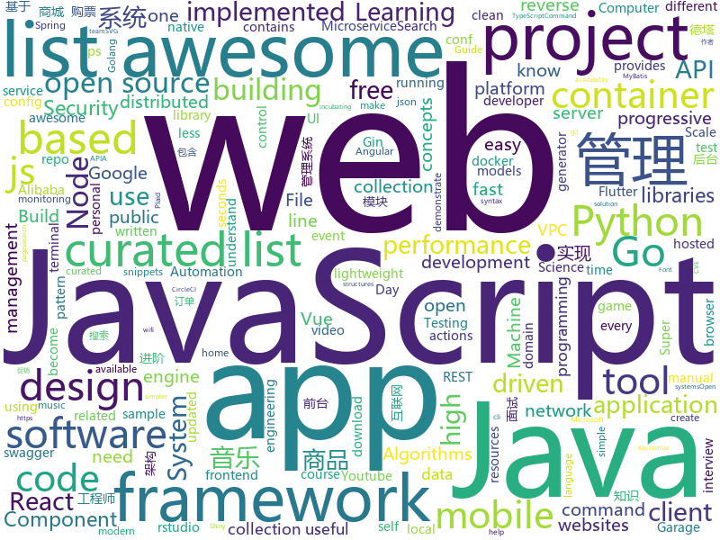

# 2019-01-21
See what the GitHub community is most excited about today.

## python
* [deep-learning-ocean](https://github.com/osforscience/deep-learning-ocean)(**207 stars today**): 📡All You Need to Know About Deep Learning - A kick-starter
* [howmanypeoplearearound](https://github.com/schollz/howmanypeoplearearound)(**152 stars today**): Count the number of people around you👨‍👨‍👦by monitoring wifi signals📡
* [py12306](https://github.com/pjialin/py12306)(**85 stars today**): 🚂12306 购票助手，支持分布式，多账号，多任务购票以及 Web 页面管理
* [tldr](https://github.com/tldr-pages/tldr)(**77 stars today**): 📚Simplified and community-driven man pages
* [music-dl](https://github.com/0xHJK/music-dl)(**70 stars today**): search and download music 从网易云音乐、QQ音乐、酷狗音乐、百度音乐等搜索和下载歌曲
* [12306](https://github.com/testerSunshine/12306)(**63 stars today**): 12306智能刷票，订票
* [models](https://github.com/tensorflow/models)(**40 stars today**): Models and examples built with TensorFlow
* [awesome-python](https://github.com/vinta/awesome-python)(**44 stars today**): A curated list of awesome Python frameworks, libraries, software and resources
* [awesome-python-applications](https://github.com/mahmoud/awesome-python-applications)(**45 stars today**): 💿Free software that works great, and also happens to be open-source Python.
* [youtube-dl](https://github.com/rg3/youtube-dl)(**43 stars today**): Command-line program to download videos from YouTube.com and other video sites
* [system-design-primer](https://github.com/donnemartin/system-design-primer)(**41 stars today**): Learn how to design large-scale systems. Prep for the system design interview. Includes Anki flashcards.
* [Python](https://github.com/TheAlgorithms/Python)(**37 stars today**): All Algorithms implemented in Python
* [tuned](https://github.com/redhat-performance/tuned)(**38 stars today**): Tuning Profile Delivery Mechanism for Linux
* [drymail](https://github.com/SkullTech/drymail)(**37 stars today**): Makes sending emails easy and DRY — For Python 3.
* [AnyAPI](https://github.com/FKLC/AnyAPI)(**36 stars today**): An API Wrapper For Every API
* [vorta](https://github.com/borgbase/vorta)(**34 stars today**): Desktop Backup Client based on BorgBackup
* [Airtest](https://github.com/AirtestProject/Airtest)(**31 stars today**): UI Test Automation Framework for Games and Apps
* [docker-pretty-ps](https://github.com/politeauthority/docker-pretty-ps)(**32 stars today**): Tired of that awful super wide 'docker ps' output? Go vertical! Try docker-pretty-ps!
* [bert](https://github.com/google-research/bert)(**26 stars today**): TensorFlow code and pre-trained models for BERT
* [public-apis](https://github.com/toddmotto/public-apis)(**28 stars today**): A collective list of free APIs for use in software and web development.
* [pyxel](https://github.com/kitao/pyxel)(**28 stars today**): A retro game engine for Python
* [home-assistant](https://github.com/home-assistant/home-assistant)(**22 stars today**): 🏡Open source home automation that puts local control and privacy first
* [awesome-machine-learning](https://github.com/josephmisiti/awesome-machine-learning)(**24 stars today**): A curated list of awesome Machine Learning frameworks, libraries and software.
* [ESFileExplorerOpenPortVuln](https://github.com/fs0c131y/ESFileExplorerOpenPortVuln)(**24 stars today**): ES File Explorer Open Port Vulnerability - CVE-2019-6447
* [dash](https://github.com/plotly/dash)(**26 stars today**): Analytical Web Apps for Python. No JavaScript Required.

## java
* [JavaGuide](https://github.com/Snailclimb/JavaGuide)(**95 stars today**): 【Java学习+面试指南】 一份涵盖大部分Java程序员所需要掌握的核心知识。
* [DETA_DataBase](https://github.com/yaoguangluo/DETA_DataBase)(**84 stars today**): 部署在德塔HTTP服务器/http server的德塔数据库系统/data base，全面采用VPC和VPCS架构引擎。基于VPC架构的无死锁，高并发，json，碎片，对象，rest map, 量子数据库。作者：罗瑶光
* [mall](https://github.com/macrozheng/mall)(**60 stars today**): mall项目是一套电商系统，包括前台商城系统及后台管理系统，基于SpringBoot+MyBatis实现。 前台商城系统包含首页门户、商品推荐、商品搜索、商品展示、购物车、订单流程、会员中心、客户服务、帮助中心等模块。 后台管理系统包含商品管理、订单管理、会员管理、促销管理、运营管理、内容管理、统计报表、财务管理、权限管理、设置等模块。
* [advanced-java](https://github.com/doocs/advanced-java)(**58 stars today**): 😮互联网 Java 工程师进阶知识完全扫盲
* [nacos](https://github.com/alibaba/nacos)(**44 stars today**): an easy-to-use dynamic service discovery, configuration and service management platform for building cloud native applications.
* [spring-boot](https://github.com/spring-projects/spring-boot)(**36 stars today**): Spring Boot
* [miaosha](https://github.com/qiurunze123/miaosha)(**32 stars today**): ⛹️🐘秒杀系统设计与实现.互联网工程师进阶与分析🙋🐓
* [tutorials](https://github.com/eugenp/tutorials)(**20 stars today**): The "REST With Spring" Course:
* [dbeaver](https://github.com/dbeaver/dbeaver)(**34 stars today**): Free universal database tool and SQL client
* [symphony](https://github.com/b3log/symphony)(**31 stars today**): 🎶一款用 Java 实现的现代化社区（论坛/BBS/社交网络/博客）平台。https://hacpai.com
* [fescar](https://github.com/alibaba/fescar)(**29 stars today**): Fescar is an easy-to-use, high-performance, java based, open source distributed transaction solution.
* [java-design-patterns](https://github.com/iluwatar/java-design-patterns)(**25 stars today**): Design patterns implemented in Java
* [interviews](https://github.com/kdn251/interviews)(**22 stars today**): Everything you need to know to get the job.
* [NewPipe](https://github.com/TeamNewPipe/NewPipe)(**21 stars today**): A lightweight Youtube frontend for Android.
* [arthas](https://github.com/alibaba/arthas)(**19 stars today**): Alibaba Java Diagnostic Tool Arthas/Alibaba Java诊断利器Arthas
* [spring-framework](https://github.com/spring-projects/spring-framework)(**14 stars today**): Spring Framework
* [Java](https://github.com/TheAlgorithms/Java)(**17 stars today**): All Algorithms implemented in Java
* [incubator-dubbo](https://github.com/apache/incubator-dubbo)(**12 stars today**): Apache Dubbo (incubating) is a high-performance, java based, open source RPC framework.
* [JCSprout](https://github.com/crossoverJie/JCSprout)(**14 stars today**): 👨‍🎓Java Core Sprout : basic, concurrent, algorithm
* [netty](https://github.com/netty/netty)(**12 stars today**): Netty project - an event-driven asynchronous network application framework
* [accumulo](https://github.com/apache/accumulo)(**14 stars today**): Apache Accumulo
* [jib](https://github.com/GoogleContainerTools/jib)(**13 stars today**): ⛵️Build container images for your Java applications.
* [Sentinel](https://github.com/alibaba/Sentinel)(**11 stars today**): A lightweight powerful flow control component enabling reliability and monitoring for microservices
* [DDMQ](https://github.com/didi/DDMQ)(**13 stars today**): DDMQ is a distributed messaging product with low latency, high throughput and high availability.
* [elasticsearch](https://github.com/elastic/elasticsearch)(**11 stars today**): Open Source, Distributed, RESTful Search Engine

## unknown
* [open-source-cs](https://github.com/ForrestKnight/open-source-cs)(**296 stars today**): 
* [developer-roadmap](https://github.com/kamranahmedse/developer-roadmap)(**232 stars today**): Roadmap to becoming a web developer in 2019
* [kubernetes-failure-stories](https://github.com/hjacobs/kubernetes-failure-stories)(**178 stars today**): Compilation of public failure/horror stories related to Kubernetes
* [gitignore](https://github.com/github/gitignore)(**47 stars today**): A collection of useful .gitignore templates
* [You-Dont-Know-JS](https://github.com/getify/You-Dont-Know-JS)(**54 stars today**): A book series on JavaScript. @YDKJS on twitter.
* [browser-pwn](https://github.com/m1ghtym0/browser-pwn)(**57 stars today**): An updated collection of resources targeting browser-exploitation.
* [CS-Notes](https://github.com/CyC2018/CS-Notes)(**52 stars today**): 📚面试必备基础知识
* [100-Days-Of-ML-Code](https://github.com/Avik-Jain/100-Days-Of-ML-Code)(**49 stars today**): 100 Days of ML Coding
* [awesome](https://github.com/sindresorhus/awesome)(**53 stars today**): 😎Curated list of awesome lists
* [awesome-jupyter](https://github.com/markusschanta/awesome-jupyter)(**46 stars today**): A curated list of awesome Jupyter projects, libraries and resources
* [awesome-actions](https://github.com/sdras/awesome-actions)(**48 stars today**): A curated list of awesome actions to use on GitHub
* [the-book-of-secret-knowledge](https://github.com/trimstray/the-book-of-secret-knowledge)(**43 stars today**): A collection of awesome lists, manuals, blogs, hacks, one-liners, cli/web tools and more. Especially for System and Network Administrators, DevOps, Pentesters or Security Researchers.
* [coding-interview-university](https://github.com/jwasham/coding-interview-university)(**36 stars today**): A complete computer science study plan to become a software engineer.
* [free-programming-books](https://github.com/EbookFoundation/free-programming-books)(**37 stars today**): 📚Freely available programming books
* [awesome-interview-questions](https://github.com/MaximAbramchuck/awesome-interview-questions)(**37 stars today**): A curated awesome list of lists of interview questions. Feel free to contribute!🎓
* [awesome-jamstack](https://github.com/automata/awesome-jamstack)(**34 stars today**): Carefully curated list of awesome JAMstack resources
* [RStudioConf2019Slides](https://github.com/kbroman/RStudioConf2019Slides)(**28 stars today**): Links to slides for rstudio::conf 2019
* [awesome-vue](https://github.com/vuejs/awesome-vue)(**27 stars today**): 🎉A curated list of awesome things related to Vue.js
* [Python-programming-exercises](https://github.com/zhiwehu/Python-programming-exercises)(**22 stars today**): 100+ Python challenging programming exercises
* [clean-code-javascript-tr](https://github.com/aligoren/clean-code-javascript-tr)(**24 stars today**): JavaScript için Uyarlanmış Temiz Kod Kavramları
* [technical-whitepapers](https://github.com/trimstray/technical-whitepapers)(**25 stars today**): Collection of IT whitepapers, presentations, pdfs; hacking, web app security, db, reverse engineering and more; EN/PL.
* [trackerslist](https://github.com/ngosang/trackerslist)(**23 stars today**): An updated list of public BitTorrent trackers
* [awesome-public-datasets](https://github.com/awesomedata/awesome-public-datasets)(**21 stars today**): A topic-centric list of HQ open datasets in public domains. PR ☛☛☛
* [awesome-for-beginners](https://github.com/MunGell/awesome-for-beginners)(**21 stars today**): A list of awesome beginners-friendly projects.
* [awesome-courses](https://github.com/prakhar1989/awesome-courses)(**19 stars today**): 📚List of awesome university courses for learning Computer Science!

## javascript
* [typescript-eslint](https://github.com/typescript-eslint/typescript-eslint)(**243 stars today**): ✨Monorepo for all the tooling which enables ESLint to support TypeScript
* [fx](https://github.com/antonmedv/fx)(**203 stars today**): Command-line tool and terminal JSON viewer🔥
* [Musish](https://github.com/Musish/Musish)(**185 stars today**): Apple Music...ish
* [shiny](https://github.com/rikschennink/shiny)(**164 stars today**): 🌟Shiny reflections for mobile websites
* [vue](https://github.com/vuejs/vue)(**99 stars today**): 🖖Vue.js is a progressive, incrementally-adoptable JavaScript framework for building UI on the web.
* [anime](https://github.com/juliangarnier/anime)(**91 stars today**): JavaScript animation engine
* [react](https://github.com/facebook/react)(**61 stars today**): A declarative, efficient, and flexible JavaScript library for building user interfaces.
* [OnsenUI](https://github.com/OnsenUI/OnsenUI)(**60 stars today**): Mobile app development framework and SDK using HTML5 and JavaScript. Create beautiful and performant cross-platform mobile apps. Based on Web Components, and provides bindings for Angular 1, 2, React and Vue.js.
* [javascript-algorithms](https://github.com/trekhleb/javascript-algorithms)(**56 stars today**): 📝Algorithms and data structures implemented in JavaScript with explanations and links to further readings
* [30-seconds-of-code](https://github.com/30-seconds/30-seconds-of-code)(**52 stars today**): Curated collection of useful JavaScript snippets that you can understand in 30 seconds or less.
* [taiko-web](https://github.com/bui/taiko-web)(**45 stars today**): Taiko no Tatsujin simulator
* [nuclear](https://github.com/nukeop/nuclear)(**44 stars today**): Popcorn Time for music
* [create-react-app](https://github.com/facebook/create-react-app)(**39 stars today**): Set up a modern web app by running one command.
* [axios](https://github.com/axios/axios)(**40 stars today**): Promise based HTTP client for the browser and node.js
* [nodebestpractices](https://github.com/i0natan/nodebestpractices)(**39 stars today**): The largest Node.js best practices list (January 2019)
* [puppeteer](https://github.com/GoogleChrome/puppeteer)(**41 stars today**): Headless Chrome Node API
* [jsdiff](https://github.com/kpdecker/jsdiff)(**40 stars today**): A javascript text differencing implementation.
* [javascript](https://github.com/airbnb/javascript)(**36 stars today**): JavaScript Style Guide
* [awesome-mac](https://github.com/jaywcjlove/awesome-mac)(**38 stars today**):  Now we have become very big, Different from the original idea. Collect premium software in various categories.
* [gatsby](https://github.com/gatsbyjs/gatsby)(**34 stars today**): Build blazing fast, modern apps and websites with React
* [clean-code-javascript](https://github.com/ryanmcdermott/clean-code-javascript)(**33 stars today**): 🛁Clean Code concepts adapted for JavaScript
* [realworld](https://github.com/gothinkster/realworld)(**30 stars today**): "The mother of all demo apps" — Exemplary fullstack Medium.com clone powered by React, Angular, Node, Django, and many more🏅
* [material-ui](https://github.com/mui-org/material-ui)(**24 stars today**): React components that implement Google's Material Design.
* [33-js-concepts](https://github.com/leonardomso/33-js-concepts)(**28 stars today**): 📜33 concepts every JavaScript developer should know.
* [node](https://github.com/nodejs/node)(**28 stars today**): Node.js JavaScript runtime✨🐢🚀✨

## html
* [hacker-news-pwas](https://github.com/tastejs/hacker-news-pwas)(**63 stars today**): HNPWA - Hacker News readers as Progressive Web Apps📱
* [Mozart](https://github.com/adamjgrant/Mozart)(**44 stars today**): A simple JavaScript pattern for slim, organized AJAX applications
* [vscode](https://github.com/DankNeon/vscode)(**25 stars today**): A danker, more neon theme for VS Code
* [Spoon-Knife](https://github.com/octocat/Spoon-Knife)(****): This repo is for demonstration purposes only.
* [solid](https://github.com/solid/solid)(**16 stars today**): Solid - Re-decentralizing the web (project directory)
* [JavaScript30](https://github.com/wesbos/JavaScript30)(**10 stars today**): 30 Day Vanilla JS Challenge
* [ionic](https://github.com/ionic-team/ionic)(**10 stars today**): Build amazing native and progressive web apps with open web technologies. One app running on everything🎉
* [destyle.css](https://github.com/nicolas-cusan/destyle.css)(**12 stars today**): Opinionated reset stylesheet that provides a clean styling slate for your project.
* [30-seconds-of-css](https://github.com/30-seconds/30-seconds-of-css)(**10 stars today**): A curated collection of useful CSS snippets you can understand in 30 seconds or less.
* [swagger-codegen](https://github.com/swagger-api/swagger-codegen)(**8 stars today**): swagger-codegen contains a template-driven engine to generate documentation, API clients and server stubs in different languages by parsing your OpenAPI / Swagger definition.
* [design-system-components](https://github.com/govau/design-system-components)(**10 stars today**): 🛠Component code and tests for the design system
* [blog_os](https://github.com/phil-opp/blog_os)(**9 stars today**): Writing an OS in Rust
* [owasp-mstg](https://github.com/OWASP/owasp-mstg)(**9 stars today**): The Mobile Security Testing Guide (MSTG) is a comprehensive manual for mobile app security testing and reverse engineering.
* [build-your-own-mint](https://github.com/yyx990803/build-your-own-mint)(**8 stars today**): Build your own personal finance analytics using Plaid, Google Sheets and CircleCI.
* [MSEdgeExplainers](https://github.com/MicrosoftEdge/MSEdgeExplainers)(**8 stars today**): Home for explainer documents originated by the Microsoft Edge team
* [simple-icons](https://github.com/simple-icons/simple-icons)(**7 stars today**): SVG icons for popular brands
* [portainer](https://github.com/portainer/portainer)(**7 stars today**): Simple management UI for Docker
* [rstudio-conf-2019](https://github.com/topepo/rstudio-conf-2019)(**6 stars today**): Slide, code and data for "Applied Machine Learning" at Rstudio-conf 2019
* [now-github-starter](https://github.com/zeit/now-github-starter)(****): Starter project to demonstrate a project whose pull requests get automatically deployed
* [zju-icicles](https://github.com/QSCTech/zju-icicles)(**5 stars today**): 浙江大学课程攻略共享计划
* [nginxconfig.io](https://github.com/valentinxxx/nginxconfig.io)(**7 stars today**): ⚙️NGiИX config generator generator on steroids💉
* [boost](https://github.com/boostorg/boost)(**7 stars today**): Super-project for modularized Boost
* [flutter-in-action](https://github.com/flutterchina/flutter-in-action)(**7 stars today**): 《Flutter实战》电子书
* [pitstop](https://github.com/EdwinVW/pitstop)(**6 stars today**): This repo contains a sample application based on a Garage Management System for PitStop - a fictitious garage. The primary goal of this sample is to demonstrate several Web-Scale Architecture concepts like: Microservices, CQRS, Event Sourcing, Domain Driven Design (DDD), Eventual Consistency.
* [fonts](https://github.com/google/fonts)(**6 stars today**): Font files available from Google Fonts

## go
* [task](https://github.com/go-task/task)(**190 stars today**): A task runner / simpler Make alternative written in Go
* [go-flutter-desktop-embedder](https://github.com/Drakirus/go-flutter-desktop-embedder)(**102 stars today**): A Go (golang) Custom Flutter Engine Embedder for desktop
* [tengo](https://github.com/d5/tengo)(**73 stars today**): A fast script language for Go
* [timeliner](https://github.com/mholt/timeliner)(**68 stars today**): All your digital life on a single timeline, stored locally
* [act](https://github.com/nektos/act)(**50 stars today**): Run your GitHub Actions locally
* [kubernetes](https://github.com/kubernetes/kubernetes)(**36 stars today**): Production-Grade Container Scheduling and Management
* [go](https://github.com/golang/go)(**39 stars today**): The Go programming language
* [gunk](https://github.com/gunk/gunk)(**37 stars today**): Modern frontend and syntax for Protocol Buffers
* [BaiduPCS-Go](https://github.com/iikira/BaiduPCS-Go)(**31 stars today**): 百度网盘客户端 - Go语言编写
* [awesome-go](https://github.com/avelino/awesome-go)(**27 stars today**): A curated list of awesome Go frameworks, libraries and software
* [hugo](https://github.com/gohugoio/hugo)(**27 stars today**): The world’s fastest framework for building websites.
* [chezmoi](https://github.com/twpayne/chezmoi)(**27 stars today**): Manage your dotfiles securely across multiple machines.
* [loki](https://github.com/grafana/loki)(**26 stars today**): Like Prometheus, but for logs.
* [v2ray-core](https://github.com/v2ray/v2ray-core)(**23 stars today**): A platform for building proxies to bypass network restrictions.
* [frp](https://github.com/fatedier/frp)(**22 stars today**): A fast reverse proxy to help you expose a local server behind a NAT or firewall to the internet.
* [mkcert](https://github.com/FiloSottile/mkcert)(**25 stars today**): A simple zero-config tool to make locally trusted development certificates with any names you'd like.
* [sourcegraph](https://github.com/sourcegraph/sourcegraph)(**24 stars today**): Code search and intelligence, self-hosted and scalable
* [go-micro](https://github.com/micro/go-micro)(**20 stars today**): A microservice framework
* [fzf](https://github.com/junegunn/fzf)(**20 stars today**): 🌸A command-line fuzzy finder
* [gitea](https://github.com/go-gitea/gitea)(**19 stars today**): Git with a cup of tea, painless self-hosted git service
* [wtf](https://github.com/wtfutil/wtf)(**18 stars today**): The personal information dashboard for your terminal.
* [moby](https://github.com/moby/moby)(**16 stars today**): Moby Project - a collaborative project for the container ecosystem to assemble container-based systems
* [syncthing](https://github.com/syncthing/syncthing)(**18 stars today**): Open Source Continuous File Synchronization
* [libpod](https://github.com/containers/libpod)(**17 stars today**): libpod is a library used to create container pods.
* [gin](https://github.com/gin-gonic/gin)(**17 stars today**): Gin is a HTTP web framework written in Go (Golang). It features a Martini-like API with much better performance -- up to 40 times faster. If you need smashing performance, get yourself some Gin.

## WordCloud

