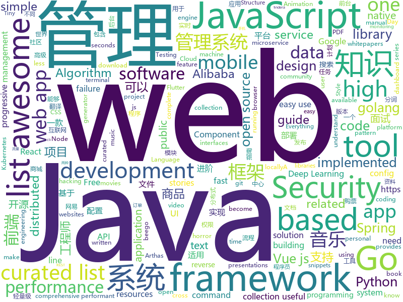

# 2019-01-22
See what the GitHub community is most excited about today.

## python
* [deep-learning-ocean](https://github.com/osforscience/deep-learning-ocean)(**377 stars today**): 📡All You Need to Know About Deep Learning - A kick-starter
* [py12306](https://github.com/pjialin/py12306)(**196 stars today**): 🚂12306 购票助手，支持分布式，多账号，多任务购票以及 Web 页面管理
* [howmanypeoplearearound](https://github.com/schollz/howmanypeoplearearound)(**187 stars today**): Count the number of people around you👨‍👨‍👦by monitoring wifi signals📡
* [12306](https://github.com/testerSunshine/12306)(**110 stars today**): 12306智能刷票，订票
* [DeOldify](https://github.com/jantic/DeOldify)(**86 stars today**): A Deep Learning based project for colorizing and restoring old images
* [models](https://github.com/tensorflow/models)(**58 stars today**): Models and examples built with TensorFlow
* [bert](https://github.com/google-research/bert)(**66 stars today**): TensorFlow code and pre-trained models for BERT
* [system-design-primer](https://github.com/donnemartin/system-design-primer)(**67 stars today**): Learn how to design large-scale systems. Prep for the system design interview. Includes Anki flashcards.
* [youtube-dl](https://github.com/rg3/youtube-dl)(**68 stars today**): Command-line program to download videos from YouTube.com and other video sites
* [YSL](https://github.com/rosuH/YSL)(**62 stars today**): 🏞Yellowstone Sound Library🎵
* [awesome-python-applications](https://github.com/mahmoud/awesome-python-applications)(**59 stars today**): 💿Free software that works great, and also happens to be open-source Python.
* [awesome-python](https://github.com/vinta/awesome-python)(**55 stars today**): A curated list of awesome Python frameworks, libraries, software and resources
* [tldr](https://github.com/tldr-pages/tldr)(**59 stars today**): 📚Simplified and community-driven man pages
* [music-dl](https://github.com/0xHJK/music-dl)(**53 stars today**): search and download music 从网易云音乐、QQ音乐、酷狗音乐、百度音乐、虾米音乐等搜索和下载歌曲
* [flair](https://github.com/zalandoresearch/flair)(**51 stars today**): A very simple framework for state-of-the-art Natural Language Processing (NLP)
* [keras](https://github.com/keras-team/keras)(**42 stars today**): Deep Learning for humans
* [impacket_static_binaries](https://github.com/ropnop/impacket_static_binaries)(**47 stars today**): Standalone binaries for Linux/Windows of Impacket's examples
* [drymail](https://github.com/SkullTech/drymail)(**48 stars today**): Makes sending emails easy and DRY — For Python 3.
* [pkuseg-python](https://github.com/lancopku/pkuseg-python)(**42 stars today**): python版本：领域细分的中文分词工具，简单易用，跟现有开源工具相比提高了分词的准确率。
* [django](https://github.com/django/django)(**30 stars today**): The Web framework for perfectionists with deadlines.
* [Python](https://github.com/TheAlgorithms/Python)(**33 stars today**): All Algorithms implemented in Python
* [public-apis](https://github.com/toddmotto/public-apis)(**39 stars today**): A collective list of free APIs for use in software and web development.
* [walle-web](https://github.com/meolu/walle-web)(**37 stars today**): walle - 瓦力 开源项目代码部署平台
* [ObjectDetection-OneStageDet](https://github.com/TencentYoutuResearch/ObjectDetection-OneStageDet)(**36 stars today**): 
* [manim](https://github.com/3b1b/manim)(**35 stars today**): Animation engine for explanatory math videos

## java
* [fescar](https://github.com/alibaba/fescar)(**171 stars today**): Fescar is an easy-to-use, high-performance, java based, open source distributed transaction solution.
* [mall](https://github.com/macrozheng/mall)(**169 stars today**): mall项目是一套电商系统，包括前台商城系统及后台管理系统，基于SpringBoot+MyBatis实现。 前台商城系统包含首页门户、商品推荐、商品搜索、商品展示、购物车、订单流程、会员中心、客户服务、帮助中心等模块。 后台管理系统包含商品管理、订单管理、会员管理、促销管理、运营管理、内容管理、统计报表、财务管理、权限管理、设置等模块。
* [JavaGuide](https://github.com/Snailclimb/JavaGuide)(**161 stars today**): 【Java学习+面试指南】 一份涵盖大部分Java程序员所需要掌握的核心知识。
* [advanced-java](https://github.com/doocs/advanced-java)(**149 stars today**): 😮互联网 Java 工程师进阶知识完全扫盲
* [arthas](https://github.com/alibaba/arthas)(**133 stars today**): Alibaba Java Diagnostic Tool Arthas/Alibaba Java诊断利器Arthas
* [miaosha](https://github.com/qiurunze123/miaosha)(**90 stars today**): ⛹️🐘秒杀系统设计与实现.互联网工程师进阶与分析🙋🐓
* [nacos](https://github.com/alibaba/nacos)(**69 stars today**): an easy-to-use dynamic service discovery, configuration and service management platform for building cloud native applications.
* [XUI](https://github.com/xuexiangjys/XUI)(**64 stars today**): 💍一个简洁而优雅的Android原生UI框架，解放你的双手！
* [interviews](https://github.com/kdn251/interviews)(**52 stars today**): Everything you need to know to get the job.
* [tutorials](https://github.com/eugenp/tutorials)(**34 stars today**): The "REST With Spring" Course:
* [spring-boot](https://github.com/spring-projects/spring-boot)(**42 stars today**): Spring Boot
* [java-design-patterns](https://github.com/iluwatar/java-design-patterns)(**42 stars today**): Design patterns implemented in Java
* [symphony](https://github.com/b3log/symphony)(**44 stars today**): 🎶一款用 Java 实现的现代化社区（论坛/BBS/社交网络/博客）平台。https://hacpai.com
* [elasticsearch](https://github.com/elastic/elasticsearch)(**38 stars today**): Open Source, Distributed, RESTful Search Engine
* [DDMQ](https://github.com/didi/DDMQ)(**39 stars today**): DDMQ is a distributed messaging product with low latency, high throughput and high availability.
* [cim](https://github.com/crossoverJie/cim)(**34 stars today**): 📲cim(cross IM) 适用于开发者的即时通讯系统
* [incubator-dubbo](https://github.com/apache/incubator-dubbo)(**31 stars today**): Apache Dubbo (incubating) is a high-performance, java based, open source RPC framework.
* [excel-boot](https://github.com/programmeres/excel-boot)(**34 stars today**): Easy-POI是一款Excel导入导出解决方案组成的轻量级开源组件。
* [spring-cloud-alibaba](https://github.com/spring-cloud-incubator/spring-cloud-alibaba)(**34 stars today**): Spring Cloud Alibaba provides a one-stop solution for application development for the distributed solutions of Alibaba middleware.
* [spring-framework](https://github.com/spring-projects/spring-framework)(**29 stars today**): Spring Framework
* [Sentinel](https://github.com/alibaba/Sentinel)(**28 stars today**): A lightweight powerful flow control component enabling reliability and monitoring for microservices. (轻量级的流量控制、熔断降级 Java 库)
* [JCSprout](https://github.com/crossoverJie/JCSprout)(**26 stars today**): 👨‍🎓Java Core Sprout : basic, concurrent, algorithm
* [Java](https://github.com/TheAlgorithms/Java)(**25 stars today**): All Algorithms implemented in Java
* [apollo](https://github.com/ctripcorp/apollo)(**23 stars today**): Apollo（阿波罗）是携程框架部门研发的分布式配置中心，能够集中化管理应用不同环境、不同集群的配置，配置修改后能够实时推送到应用端，并且具备规范的权限、流程治理等特性，适用于微服务配置管理场景。
* [dbeaver](https://github.com/dbeaver/dbeaver)(**28 stars today**): Free universal database tool and SQL client

## unknown
* [kubernetes-failure-stories](https://github.com/hjacobs/kubernetes-failure-stories)(**540 stars today**): Compilation of public failure/horror stories related to Kubernetes
* [open-source-cs](https://github.com/ForrestKnight/open-source-cs)(**518 stars today**): 
* [developer-roadmap](https://github.com/kamranahmedse/developer-roadmap)(**262 stars today**): Roadmap to becoming a web developer in 2019
* [serverless-failure-stories](https://github.com/cristim/serverless-failure-stories)(**154 stars today**): Compilation of public failure/horror stories related to Serverless, inspired by hjacobs/kubernetes-failure-stories
* [CS-Notes](https://github.com/CyC2018/CS-Notes)(**106 stars today**): 📚面试必备基础知识
* [awesome](https://github.com/sindresorhus/awesome)(**99 stars today**): 😎Curated list of awesome lists
* [100-Days-Of-ML-Code](https://github.com/Avik-Jain/100-Days-Of-ML-Code)(**89 stars today**): 100 Days of ML Coding
* [blog](https://github.com/yygmind/blog)(**92 stars today**): 我是木易杨，网易高级前端工程师，跟着我每周重点攻克一个前端面试重难点。接下来让我带你走进高级前端的世界，在进阶的路上，共勉！
* [the-book-of-secret-knowledge](https://github.com/trimstray/the-book-of-secret-knowledge)(**77 stars today**): A collection of awesome lists, manuals, blogs, hacks, one-liners, cli/web tools and more. Especially for System and Network Administrators, DevOps, Pentesters or Security Researchers.
* [You-Dont-Know-JS](https://github.com/getify/You-Dont-Know-JS)(**72 stars today**): A book series on JavaScript. @YDKJS on twitter.
* [devOps-patch](https://github.com/g0x7f/devOps-patch)(**73 stars today**): A Patch for Dev-Ops community https://t.me/devOpsPatch
* [technical-whitepapers](https://github.com/trimstray/technical-whitepapers)(**75 stars today**): Collection of IT whitepapers, presentations, pdfs; hacking, web app security, db, reverse engineering and more; EN/PL.
* [browser-pwn](https://github.com/m1ghtym0/browser-pwn)(**68 stars today**): An updated collection of resources targeting browser-exploitation.
* [gitignore](https://github.com/github/gitignore)(**51 stars today**): A collection of useful .gitignore templates
* [awesome-jamstack](https://github.com/automata/awesome-jamstack)(**69 stars today**): Carefully curated list of awesome JAMstack resources
* [setup.guide](https://github.com/phodal/setup.guide)(**64 stars today**): 前端程序员的 macOS 搭建指南
* [free-programming-books](https://github.com/EbookFoundation/free-programming-books)(**56 stars today**): 📚Freely available programming books
* [Front-end-knowledge](https://github.com/KieSun/Front-end-knowledge)(**54 stars today**): 前端知识集锦
* [Blog](https://github.com/KieSun/Blog)(**47 stars today**): 
* [coding-interview-university](https://github.com/jwasham/coding-interview-university)(**42 stars today**): A complete computer science study plan to become a software engineer.
* [awesome-public-datasets](https://github.com/awesomedata/awesome-public-datasets)(**39 stars today**): A topic-centric list of HQ open datasets in public domains. PR ☛☛☛
* [awesome-vue](https://github.com/vuejs/awesome-vue)(**38 stars today**): 🎉A curated list of awesome things related to Vue.js
* [hosts](https://github.com/googlehosts/hosts)(**32 stars today**): 镜像：https://coding.net/u/scaffrey/p/hosts/git
* [gold-miner](https://github.com/xitu/gold-miner)(**33 stars today**): 🥇掘金翻译计划，可能是世界最大最好的英译中技术社区，最懂读者和译者的翻译平台：
* [react-best-practices](https://github.com/kudos-dude/react-best-practices)(**36 stars today**): A comprehensive reference guide to kickstart your React architecting career!

## javascript
* [typescript-eslint](https://github.com/typescript-eslint/typescript-eslint)(**279 stars today**): ✨Monorepo for all the tooling which enables ESLint to support TypeScript
* [Musish](https://github.com/Musish/Musish)(**234 stars today**): Apple Music...ish
* [fx](https://github.com/antonmedv/fx)(**230 stars today**): Command-line tool and terminal JSON viewer🔥
* [shiny](https://github.com/rikschennink/shiny)(**167 stars today**): 🌟Shiny reflections for mobile websites
* [vue](https://github.com/vuejs/vue)(**143 stars today**): 🖖Vue.js is a progressive, incrementally-adoptable JavaScript framework for building UI on the web.
* [hiring-without-whiteboards](https://github.com/poteto/hiring-without-whiteboards)(**142 stars today**): ⭐️Companies that don't have a broken hiring process
* [anime](https://github.com/juliangarnier/anime)(**117 stars today**): JavaScript animation engine
* [react](https://github.com/facebook/react)(**97 stars today**): A declarative, efficient, and flexible JavaScript library for building user interfaces.
* [redom](https://github.com/redom/redom)(**104 stars today**): Tiny (2 KB) turboboosted JavaScript library for creating user interfaces.
* [awesome-mac](https://github.com/jaywcjlove/awesome-mac)(**96 stars today**):  Now we have become very big, Different from the original idea. Collect premium software in various categories.
* [ky](https://github.com/sindresorhus/ky)(**100 stars today**): Tiny and elegant HTTP client based on the browser Fetch API
* [taiko-web](https://github.com/bui/taiko-web)(**87 stars today**): Taiko no Tatsujin simulator
* [javascript-algorithms](https://github.com/trekhleb/javascript-algorithms)(**89 stars today**): 📝Algorithms and data structures implemented in JavaScript with explanations and links to further readings
* [nuclear](https://github.com/nukeop/nuclear)(**91 stars today**): Popcorn Time for music
* [nodebestpractices](https://github.com/i0natan/nodebestpractices)(**88 stars today**): The largest Node.js best practices list (January 2019)
* [30-seconds-of-code](https://github.com/30-seconds/30-seconds-of-code)(**77 stars today**): Curated collection of useful JavaScript snippets that you can understand in 30 seconds or less.
* [jsdiff](https://github.com/kpdecker/jsdiff)(**80 stars today**): A javascript text differencing implementation.
* [create-react-app](https://github.com/facebook/create-react-app)(**70 stars today**): Set up a modern web app by running one command.
* [OnsenUI](https://github.com/OnsenUI/OnsenUI)(**75 stars today**): Mobile app development framework and SDK using HTML5 and JavaScript. Create beautiful and performant cross-platform mobile apps. Based on Web Components, and provides bindings for Angular 1, 2, React and Vue.js.
* [clean-code-javascript](https://github.com/ryanmcdermott/clean-code-javascript)(**69 stars today**): 🛁Clean Code concepts adapted for JavaScript
* [cine-the-guide-movie](https://github.com/murillo94/cine-the-guide-movie)(**59 stars today**): A React Native app that interacts with the TMDb API showing the info about movies, series, actors and also for searching what you want in this context
* [CSS-Inspiration](https://github.com/chokcoco/CSS-Inspiration)(**64 stars today**): CSS Inspiration，在这里找到写 CSS 的灵感！
* [GGEditor](https://github.com/gaoli/GGEditor)(**65 stars today**): A visual graph editor based on G6 and React
* [puppeteer](https://github.com/GoogleChrome/puppeteer)(**63 stars today**): Headless Chrome Node API
* [javascript](https://github.com/airbnb/javascript)(**55 stars today**): JavaScript Style Guide

## html
* [flutter-in-action](https://github.com/flutterchina/flutter-in-action)(**217 stars today**): 《Flutter实战》电子书
* [hacker-news-pwas](https://github.com/tastejs/hacker-news-pwas)(**50 stars today**): HNPWA - Hacker News readers as Progressive Web Apps📱
* [zju-icicles](https://github.com/QSCTech/zju-icicles)(**29 stars today**): 浙江大学课程攻略共享计划
* [ionic](https://github.com/ionic-team/ionic)(**17 stars today**): Build amazing native and progressive web apps with open web technologies. One app running on everything🎉
* [30-seconds-of-css](https://github.com/30-seconds/30-seconds-of-css)(**17 stars today**): A curated collection of useful CSS snippets you can understand in 30 seconds or less.
* [solid](https://github.com/solid/solid)(**16 stars today**): Solid - Re-decentralizing the web (project directory)
* [Spoon-Knife](https://github.com/octocat/Spoon-Knife)(****): This repo is for demonstration purposes only.
* [owasp-mstg](https://github.com/OWASP/owasp-mstg)(**15 stars today**): The Mobile Security Testing Guide (MSTG) is a comprehensive manual for mobile app security testing and reverse engineering.
* [nginxconfig.io](https://github.com/valentinxxx/nginxconfig.io)(**15 stars today**): ⚙️NGiИX config generator generator on steroids💉
* [styleguide](https://github.com/google/styleguide)(**11 stars today**): Style guides for Google-originated open-source projects
* [JavaScript30](https://github.com/wesbos/JavaScript30)(**8 stars today**): 30 Day Vanilla JS Challenge
* [fastText](https://github.com/facebookresearch/fastText)(**13 stars today**): Library for fast text representation and classification.
* [portainer](https://github.com/portainer/portainer)(**13 stars today**): Simple management UI for Docker
* [vscode](https://github.com/DankNeon/vscode)(**13 stars today**): A danker, more neon theme for VS Code
* [Mozart](https://github.com/adamjgrant/Mozart)(**12 stars today**): A simple JavaScript pattern for slim, organized AJAX applications
* [build-your-own-mint](https://github.com/yyx990803/build-your-own-mint)(**11 stars today**): Build your own personal finance analytics using Plaid, Google Sheets and CircleCI.
* [ecma262](https://github.com/tc39/ecma262)(**11 stars today**): Status, process, and documents for ECMA262
* [design-system-components](https://github.com/govau/design-system-components)(**11 stars today**): 🛠Component code and tests for the design system
* [security_whitepapers](https://github.com/bl4de/security_whitepapers)(**10 stars today**): Collection of misc IT Security related whitepapers, presentations, slides - hacking, bug bounty, web application security, XSS, CSRF, SQLi
* [awesome-competitive-programming](https://github.com/lnishan/awesome-competitive-programming)(**10 stars today**): 💎A curated list of awesome Competitive Programming, Algorithm and Data Structure resources
* [blog_os](https://github.com/phil-opp/blog_os)(**8 stars today**): Writing an OS in Rust
* [fonts](https://github.com/google/fonts)(**9 stars today**): Font files available from Google Fonts
* [Adminator-admin-dashboard](https://github.com/puikinsh/Adminator-admin-dashboard)(**7 stars today**): Adminator is a easy to use and well design admin dashboard template for web apps, websites, services and more
* [proposal-decorators](https://github.com/tc39/proposal-decorators)(**8 stars today**): Decorators for ES6 classes
* [rstudio-conf-2019](https://github.com/topepo/rstudio-conf-2019)(**8 stars today**): Slide, code and data for "Applied Machine Learning" at Rstudio-conf 2019

## go
* [task](https://github.com/go-task/task)(**168 stars today**): A task runner / simpler Make alternative written in Go
* [go-flutter-desktop-embedder](https://github.com/Drakirus/go-flutter-desktop-embedder)(**117 stars today**): A Go (golang) Custom Flutter Engine Embedder for desktop
* [ascii-tv](https://github.com/martinraison/ascii-tv)(**103 stars today**): Stream ASCII movies over HTTP
* [act](https://github.com/nektos/act)(**86 stars today**): Run your GitHub Actions locally
* [mkcert](https://github.com/FiloSottile/mkcert)(**80 stars today**): A simple zero-config tool to make locally trusted development certificates with any names you'd like.
* [timeliner](https://github.com/mholt/timeliner)(**75 stars today**): All your digital life on a single timeline, stored locally
* [tengo](https://github.com/d5/tengo)(**66 stars today**): A fast script language for Go
* [kubernetes](https://github.com/kubernetes/kubernetes)(**52 stars today**): Production-Grade Container Scheduling and Management
* [go](https://github.com/golang/go)(**57 stars today**): The Go programming language
* [frp](https://github.com/fatedier/frp)(**48 stars today**): A fast reverse proxy to help you expose a local server behind a NAT or firewall to the internet.
* [konfig](https://github.com/lalamove/konfig)(**52 stars today**): Composable, observable and performant config management for Go
* [chezmoi](https://github.com/twpayne/chezmoi)(**48 stars today**): Manage your dotfiles securely across multiple machines.
* [gopub](https://github.com/linclin/gopub)(**45 stars today**): vue.js(element框架)+golang(beego框架)开发的运维发布系统,支持git,jenkins版本发布,go ssh,BT两种文件传输方式选择,支持部署前准备任务和部署后任务钩子函数
* [engineercms](https://github.com/3xxx/engineercms)(**42 stars today**): 工程师知识管理系统：基于golang go语言（beego框架）。每个行业都有自己的知识管理系统，EngineerCMS旨在为土木工程师们打造一款适用的基于web的知识管理系统。它既可以用于管理个人的项目资料，也可以用于管理项目团队资料；它既可以运行于个人电脑，也可以放到服务器上。支持onlyoffice实时文档协作，直接在线编辑dwg文件、office文档，预览PDF文件。手机端配套小程序，微信搜索“珠三角设代”或“青少儿书画”即可呼出小程序。
* [loki](https://github.com/grafana/loki)(**41 stars today**): Like Prometheus, but for logs.
* [xioc](https://github.com/assafmo/xioc)(**41 stars today**): Extract IOCs from text, including "escaped" ones.
* [dm](https://github.com/pingcap/dm)(**35 stars today**): Data Migration Platform
* [gin](https://github.com/gin-gonic/gin)(**36 stars today**): Gin is a HTTP web framework written in Go (Golang). It features a Martini-like API with much better performance -- up to 40 times faster. If you need smashing performance, get yourself some Gin.
* [dragonboat](https://github.com/lni/dragonboat)(**36 stars today**): A feature complete and high performance multi-group Raft library in Go.
* [fzf](https://github.com/junegunn/fzf)(**37 stars today**): 🌸A command-line fuzzy finder
* [go-chassis](https://github.com/go-chassis/go-chassis)(**34 stars today**): a microservice framework for rapid development of micro services in Go
* [tilt](https://github.com/windmilleng/tilt)(**32 stars today**): Local Kubernetes development with no stress
* [wtf](https://github.com/wtfutil/wtf)(**32 stars today**): The personal information dashboard for your terminal.
* [awesome-go](https://github.com/avelino/awesome-go)(**30 stars today**): A curated list of awesome Go frameworks, libraries and software
* [tidb-lightning](https://github.com/pingcap/tidb-lightning)(**29 stars today**): A high-speed data import tool for TiDB

## WordCloud

