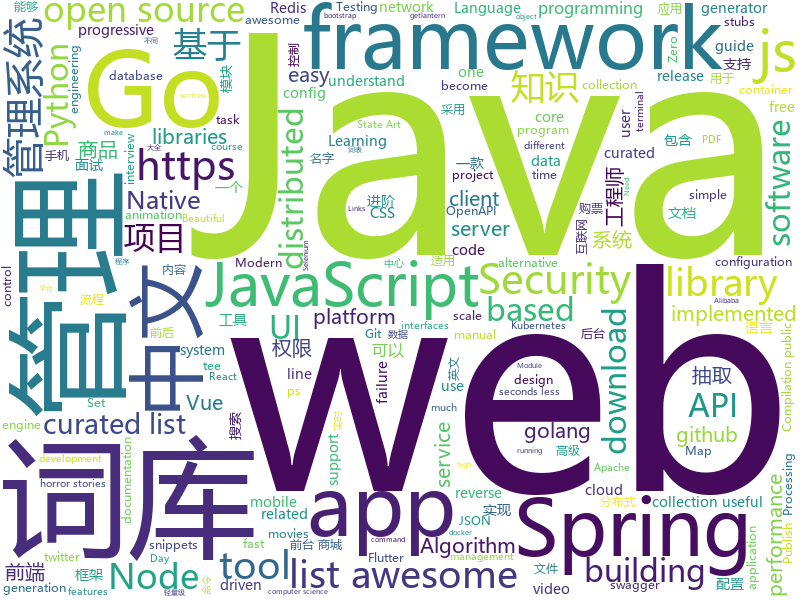

# 2019-01-23
See what the GitHub community is most excited about today.

## python
* [deep-learning-ocean](https://github.com/osforscience/deep-learning-ocean)(**401 stars today**): 📡All You Need to Know About Deep Learning - A kick-starter
* [funNLP](https://github.com/fighting41love/funNLP)(**240 stars today**): 中英文敏感词、语言检测、中外手机/电话归属地/运营商查询、名字推断性别、手机号抽取、身份证抽取、邮箱抽取、中日文人名库、中文缩写库、拆字词典、词汇情感值、停用词、反动词表、暴恐词表、繁简体转换、英文模拟中文发音、汪峰歌词生成器、职业名称词库、同义词库、反义词库、否定词库、汽车品牌词库、汽车零件词库、连续英文切割、各种中文词向量、公司名字大全、古诗词库、IT词库、财经词库、成语词库、地名词库、历史名人词库、诗词词库、医学词库、饮食词库、法律词库、汽车词库、动物词库、中文聊天语料、中文谣言数据、百度中文问答数据集、句子相似度匹配算法集合、bert资源、文本生成&摘要相关工具、cocoNLP信息抽取工具
* [py12306](https://github.com/pjialin/py12306)(**151 stars today**): 🚂12306 购票助手，支持分布式，多账号，多任务购票以及 Web 页面管理
* [12306](https://github.com/testerSunshine/12306)(**120 stars today**): 12306智能刷票，订票
* [PrivExchange](https://github.com/dirkjanm/PrivExchange)(**99 stars today**): Exchange your privileges for Domain Admin privs by abusing Exchange
* [system-design-primer](https://github.com/donnemartin/system-design-primer)(**92 stars today**): Learn how to design large-scale systems. Prep for the system design interview. Includes Anki flashcards.
* [LASER](https://github.com/facebookresearch/LASER)(**93 stars today**): Language-Agnostic SEntence Representations
* [howmanypeoplearearound](https://github.com/schollz/howmanypeoplearearound)(**89 stars today**): Count the number of people around you👨‍👨‍👦by monitoring wifi signals📡
* [Machine-Learning-with-Python](https://github.com/devAmoghS/Machine-Learning-with-Python)(**71 stars today**): Small scale machine learning projects to understand the core concepts
* [tldr](https://github.com/tldr-pages/tldr)(**77 stars today**): 📚Simplified and community-driven man pages
* [models](https://github.com/tensorflow/models)(**53 stars today**): Models and examples built with TensorFlow
* [flair](https://github.com/zalandoresearch/flair)(**68 stars today**): A very simple framework for state-of-the-art Natural Language Processing (NLP)
* [AMDVLK](https://github.com/GPUOpen-Drivers/AMDVLK)(**69 stars today**): AMD Open Source Driver For Vulkan
* [bert](https://github.com/google-research/bert)(**59 stars today**): TensorFlow code and pre-trained models for BERT
* [awesome-python](https://github.com/vinta/awesome-python)(**59 stars today**): A curated list of awesome Python frameworks, libraries, software and resources
* [jax](https://github.com/google/jax)(**64 stars today**): Composable transformations of Python+NumPy programs: differentiate, vectorize, JIT to GPU/TPU, and more
* [keras](https://github.com/keras-team/keras)(**50 stars today**): Deep Learning for humans
* [Python](https://github.com/TheAlgorithms/Python)(**51 stars today**): All Algorithms implemented in Python
* [YSL](https://github.com/rosuH/YSL)(**54 stars today**): 🏞Yellowstone Sound Library🎵
* [httpie](https://github.com/jakubroztocil/httpie)(**53 stars today**): As easy as httpie /aitch-tee-tee-pie/ 🥧 Modern command line HTTP client – user-friendly curl alternative with intuitive UI, JSON support, syntax highlighting, wget-like downloads, extensions, etc. https://twitter.com/clihttp
* [youtube-dl](https://github.com/rg3/youtube-dl)(**49 stars today**): Command-line program to download videos from YouTube.com and other video sites
* [awesome-python-applications](https://github.com/mahmoud/awesome-python-applications)(**43 stars today**): 💿Free software that works great, and also happens to be open-source Python.
* [Mask_RCNN](https://github.com/matterport/Mask_RCNN)(**37 stars today**): Mask R-CNN for object detection and instance segmentation on Keras and TensorFlow
* [docker-pretty-ps](https://github.com/politeauthority/docker-pretty-ps)(**41 stars today**): Tired of that awful super wide 'docker ps' output? Go vertical! Try docker-pretty-ps!
* [django](https://github.com/django/django)(**34 stars today**): The Web framework for perfectionists with deadlines.

## java
* [advanced-java](https://github.com/doocs/advanced-java)(**179 stars today**): 😮互联网 Java 工程师进阶知识完全扫盲
* [JavaGuide](https://github.com/Snailclimb/JavaGuide)(**134 stars today**): 【Java学习+面试指南】 一份涵盖大部分Java程序员所需要掌握的核心知识。
* [mall](https://github.com/macrozheng/mall)(**111 stars today**): mall项目是一套电商系统，包括前台商城系统及后台管理系统，基于SpringBoot+MyBatis实现。 前台商城系统包含首页门户、商品推荐、商品搜索、商品展示、购物车、订单流程、会员中心、客户服务、帮助中心等模块。 后台管理系统包含商品管理、订单管理、会员管理、促销管理、运营管理、内容管理、统计报表、财务管理、权限管理、设置等模块。
* [fescar](https://github.com/alibaba/fescar)(**104 stars today**): Fescar is an easy-to-use, high-performance, java based, open source distributed transaction solution.
* [arthas](https://github.com/alibaba/arthas)(**77 stars today**): Alibaba Java Diagnostic Tool Arthas/Alibaba Java诊断利器Arthas
* [nacos](https://github.com/alibaba/nacos)(**75 stars today**): an easy-to-use dynamic service discovery, configuration and service management platform for building cloud native applications.
* [XUI](https://github.com/xuexiangjys/XUI)(**70 stars today**): 💍一个简洁而优雅的Android原生UI框架，解放你的双手！
* [eladmin](https://github.com/elunez/eladmin)(**53 stars today**): 项目基于 Spring Boot 2.1.0 、 Spring boot Jpa、 Spring Security、redis、Vue的前后端分离的权限管理系统，项目采用分模块开发方式， 权限控制采用 RBAC（Role-Based Access Control，基于角色的访问控制），前端菜单支持动态路由
* [tutorials](https://github.com/eugenp/tutorials)(**41 stars today**): The "REST With Spring" Course:
* [spring-boot](https://github.com/spring-projects/spring-boot)(**46 stars today**): Spring Boot
* [redisson](https://github.com/redisson/redisson)(**47 stars today**): Redisson - distributed Java objects and services (Set, Multimap, SortedSet, Map, List, Queue, Deque, Semaphore, Lock, AtomicLong, Map Reduce, Publish / Subscribe, Bloom filter, Spring Cache, Tomcat, Scheduler, JCache API, Hibernate) on top of Redis server. State of the Art Redis Java client
* [spring-framework](https://github.com/spring-projects/spring-framework)(**38 stars today**): Spring Framework
* [elasticsearch](https://github.com/elastic/elasticsearch)(**40 stars today**): Open Source, Distributed, RESTful Search Engine
* [java-design-patterns](https://github.com/iluwatar/java-design-patterns)(**39 stars today**): Design patterns implemented in Java
* [symphony](https://github.com/b3log/symphony)(**37 stars today**): 🎶一款用 Java 实现的现代化社区（论坛/BBS/社交网络/博客）平台。https://hacpai.com
* [netty](https://github.com/netty/netty)(**33 stars today**): Netty project - an event-driven asynchronous network application framework
* [Java](https://github.com/TheAlgorithms/Java)(**34 stars today**): All Algorithms implemented in Java
* [apollo](https://github.com/ctripcorp/apollo)(**35 stars today**): Apollo（阿波罗）是携程框架部门研发的分布式配置中心，能够集中化管理应用不同环境、不同集群的配置，配置修改后能够实时推送到应用端，并且具备规范的权限、流程治理等特性，适用于微服务配置管理场景。
* [Sentinel](https://github.com/alibaba/Sentinel)(**30 stars today**): A lightweight powerful flow control component enabling reliability and monitoring for microservices. (轻量级的流量控制、熔断降级 Java 库)
* [incubator-dubbo](https://github.com/apache/incubator-dubbo)(**23 stars today**): Apache Dubbo (incubating) is a high-performance, java based, open source RPC framework.
* [JCSprout](https://github.com/crossoverJie/JCSprout)(**27 stars today**): 👨‍🎓Java Core Sprout : basic, concurrent, algorithm
* [guava](https://github.com/google/guava)(**31 stars today**): Google core libraries for Java
* [dbeaver](https://github.com/dbeaver/dbeaver)(**28 stars today**): Free universal database tool and SQL client
* [kafka](https://github.com/apache/kafka)(**24 stars today**): Mirror of Apache Kafka
* [excel-boot](https://github.com/programmeres/excel-boot)(**25 stars today**): Easy-POI是一款Excel导入导出解决方案组成的轻量级开源组件。

## unknown
* [open-source-cs](https://github.com/ForrestKnight/open-source-cs)(**540 stars today**): Video discussing this curriculum:
* [kubernetes-failure-stories](https://github.com/hjacobs/kubernetes-failure-stories)(**466 stars today**): Compilation of public failure/horror stories related to Kubernetes
* [developer-roadmap](https://github.com/kamranahmedse/developer-roadmap)(**224 stars today**): Roadmap to becoming a web developer in 2019
* [CS-Notes](https://github.com/CyC2018/CS-Notes)(**101 stars today**): 📚面试必备基础知识
* [awesome](https://github.com/sindresorhus/awesome)(**96 stars today**): 😎Curated list of awesome lists
* [The-Economist](https://github.com/nailperry-zd/The-Economist)(**77 stars today**): The Economist 经济学人，持续更新
* [RaymarchingWorkshop](https://github.com/ajweeks/RaymarchingWorkshop)(**80 stars today**): Introduction to Raymarching
* [gitignore](https://github.com/github/gitignore)(**57 stars today**): A collection of useful .gitignore templates
* [100-Days-Of-ML-Code](https://github.com/Avik-Jain/100-Days-Of-ML-Code)(**64 stars today**): 100 Days of ML Coding
* [awesome-java-security](https://github.com/guardrailsio/awesome-java-security)(**62 stars today**): Awesome Java Security Resources🕶☕🔐
* [awesome-vue](https://github.com/vuejs/awesome-vue)(**57 stars today**): 🎉A curated list of awesome things related to Vue.js
* [coding-interview-university](https://github.com/jwasham/coding-interview-university)(**54 stars today**): A complete computer science study plan to become a software engineer.
* [the-book-of-secret-knowledge](https://github.com/trimstray/the-book-of-secret-knowledge)(**57 stars today**): A collection of awesome lists, manuals, blogs, hacks, one-liners, cli/web tools and more. Especially for System and Network Administrators, DevOps, Pentesters or Security Researchers.
* [free-programming-books](https://github.com/EbookFoundation/free-programming-books)(**50 stars today**): 📚Freely available programming books
* [request-for-implementation](https://github.com/dtolnay/request-for-implementation)(**56 stars today**): Crates that don't exist, but should
* [blog](https://github.com/yygmind/blog)(**53 stars today**): 我是木易杨，网易高级前端工程师，跟着我每周重点攻克一个前端面试重难点。接下来让我带你走进高级前端的世界，在进阶的路上，共勉！
* [RStudioConf2019Slides](https://github.com/kbroman/RStudioConf2019Slides)(**48 stars today**): Links to slides for rstudio::conf 2019
* [computer-science](https://github.com/ossu/computer-science)(**43 stars today**): 🎓Path to a free self-taught education in Computer Science!
* [technical-whitepapers](https://github.com/trimstray/technical-whitepapers)(**42 stars today**): Collection of IT whitepapers, presentations, pdfs; hacking, web app security, db, reverse engineering and more; EN/PL.
* [serverless-failure-stories](https://github.com/cristim/serverless-failure-stories)(**45 stars today**): Compilation of public failure/horror stories related to Serverless, inspired by hjacobs/kubernetes-failure-stories
* [portable-node-guide](https://github.com/ehmicky/portable-node-guide)(**44 stars today**): Practical guide on how to write portable/cross-platform Node.js code
* [Python-programming-exercises](https://github.com/zhiwehu/Python-programming-exercises)(**35 stars today**): 100+ Python challenging programming exercises
* [awesome-interview-questions](https://github.com/MaximAbramchuck/awesome-interview-questions)(**38 stars today**): A curated awesome list of lists of interview questions. Feel free to contribute!🎓
* [hosts](https://github.com/googlehosts/hosts)(**34 stars today**): 镜像：https://coding.net/u/scaffrey/p/hosts/git
* [EXposed](https://github.com/tiann/EXposed)(**34 stars today**): An easy way to use Xposed module to modify apps.

## javascript
* [react-spring](https://github.com/react-spring/react-spring)(**268 stars today**): ✌️A spring physics based React animation library
* [Musish](https://github.com/Musish/Musish)(**200 stars today**): Apple Music...ish
* [fx](https://github.com/antonmedv/fx)(**184 stars today**): Command-line tool and terminal JSON viewer🔥
* [typescript-eslint](https://github.com/typescript-eslint/typescript-eslint)(**184 stars today**): ✨Monorepo for all the tooling which enables ESLint to support TypeScript
* [shiny](https://github.com/rikschennink/shiny)(**168 stars today**): 🌟Shiny reflections for mobile websites
* [redom](https://github.com/redom/redom)(**133 stars today**): Tiny (2 KB) turboboosted JavaScript library for creating user interfaces.
* [30-seconds-of-code](https://github.com/30-seconds/30-seconds-of-code)(**122 stars today**): Curated collection of useful JavaScript snippets that you can understand in 30 seconds or less.
* [taiko-web](https://github.com/bui/taiko-web)(**115 stars today**): Taiko no Tatsujin simulator
* [vue](https://github.com/vuejs/vue)(**108 stars today**): 🖖Vue.js is a progressive, incrementally-adoptable JavaScript framework for building UI on the web.
* [nuclear](https://github.com/nukeop/nuclear)(**115 stars today**): Popcorn Time for music
* [react](https://github.com/facebook/react)(**95 stars today**): A declarative, efficient, and flexible JavaScript library for building user interfaces.
* [javascript-algorithms](https://github.com/trekhleb/javascript-algorithms)(**87 stars today**): 📝Algorithms and data structures implemented in JavaScript with explanations and links to further readings
* [awesome-mac](https://github.com/jaywcjlove/awesome-mac)(**90 stars today**):  Now we have become very big, Different from the original idea. Collect premium software in various categories.
* [anime](https://github.com/juliangarnier/anime)(**86 stars today**): JavaScript animation engine
* [nodebestpractices](https://github.com/i0natan/nodebestpractices)(**84 stars today**): The largest Node.js best practices list (January 2019)
* [carbon-now-cli](https://github.com/mixn/carbon-now-cli)(**74 stars today**): 🎨Beautiful images of your code — from right inside your terminal.
* [miaosha](https://github.com/qiurunze123/miaosha)(**68 stars today**): ⛹️🐘秒杀系统设计与实现.互联网工程师进阶与分析🙋🐓
* [cine-the-guide-movie](https://github.com/murillo94/cine-the-guide-movie)(**67 stars today**): A React Native app that interacts with the TMDb API showing the info about movies, series, actors and also for searching what you want in this context
* [release-it](https://github.com/webpro/release-it)(**70 stars today**): Automate the tedious tasks of software releases. Happily release and publish your Git repositories, npm packages, GitHub & GitLab releases, changelogs, and much more!
* [create-react-app](https://github.com/facebook/create-react-app)(**60 stars today**): Set up a modern web app by running one command.
* [sweetalert2](https://github.com/sweetalert2/sweetalert2)(**69 stars today**): A beautiful, responsive, highly customizable and accessible (WAI-ARIA) replacement for JavaScript's popup boxes. Zero dependencies.
* [CSS-Inspiration](https://github.com/chokcoco/CSS-Inspiration)(**63 stars today**): CSS Inspiration，在这里找到写 CSS 的灵感！
* [puppeteer](https://github.com/GoogleChrome/puppeteer)(**60 stars today**): Headless Chrome Node API
* [axios](https://github.com/axios/axios)(**57 stars today**): Promise based HTTP client for the browser and node.js
* [yapi](https://github.com/YMFE/yapi)(**56 stars today**): YApi 是一个可本地部署的、打通前后端及QA的、可视化的接口管理平台

## html
* [flutter-in-action](https://github.com/flutterchina/flutter-in-action)(**97 stars today**): 《Flutter实战》电子书
* [zju-icicles](https://github.com/QSCTech/zju-icicles)(**37 stars today**): 浙江大学课程攻略共享计划
* [Spoon-Knife](https://github.com/octocat/Spoon-Knife)(****): This repo is for demonstration purposes only.
* [styleguide](https://github.com/google/styleguide)(**21 stars today**): Style guides for Google-originated open-source projects
* [ionic](https://github.com/ionic-team/ionic)(**19 stars today**): Build amazing native and progressive web apps with open web technologies. One app running on everything🎉
* [hacker-news-pwas](https://github.com/tastejs/hacker-news-pwas)(**25 stars today**): HNPWA - Hacker News readers as Progressive Web Apps📱
* [JavaScript30](https://github.com/wesbos/JavaScript30)(**16 stars today**): 30 Day Vanilla JS Challenge
* [30-seconds-of-css](https://github.com/30-seconds/30-seconds-of-css)(**22 stars today**): A curated collection of useful CSS snippets you can understand in 30 seconds or less.
* [swagger-codegen](https://github.com/swagger-api/swagger-codegen)(**15 stars today**): swagger-codegen contains a template-driven engine to generate documentation, API clients and server stubs in different languages by parsing your OpenAPI / Swagger definition.
* [nginxconfig.io](https://github.com/valentinxxx/nginxconfig.io)(**14 stars today**): ⚙️NGiИX config generator generator on steroids💉
* [intro_automation](https://github.com/jomarnavarro/intro_automation)(**9 stars today**): Module 1 for Selenium Webdriver course focused on Selenium IDE
* [portainer](https://github.com/portainer/portainer)(**11 stars today**): Simple management UI for Docker
* [mdline](https://github.com/azu/mdline)(**11 stars today**): Markdown timeline format and toolkit.
* [fastText](https://github.com/facebookresearch/fastText)(**10 stars today**): Library for fast text representation and classification.
* [pytorch-doc-zh](https://github.com/apachecn/pytorch-doc-zh)(**7 stars today**): PyTorch 中文文档
* [owasp-mstg](https://github.com/OWASP/owasp-mstg)(**10 stars today**): The Mobile Security Testing Guide (MSTG) is a comprehensive manual for mobile app security testing and reverse engineering.
* [nodejs-ex](https://github.com/sclorg/nodejs-ex)(****): node.js example
* [heyui-admin](https://github.com/heyui/heyui-admin)(**9 stars today**): Build with HeyUI, Vue.js 2.0.
* [blog_os](https://github.com/phil-opp/blog_os)(**9 stars today**): Writing an OS in Rust
* [vscode](https://github.com/DankNeon/vscode)(**9 stars today**): A danker, more neon theme for VS Code
* [awesome-competitive-programming](https://github.com/lnishan/awesome-competitive-programming)(**8 stars today**): 💎A curated list of awesome Competitive Programming, Algorithm and Data Structure resources
* [openapi-generator](https://github.com/OpenAPITools/openapi-generator)(**7 stars today**): OpenAPI Generator allows generation of API client libraries (SDK generation), server stubs, documentation and configuration automatically given an OpenAPI Spec (v2, v3)
* [bootstrap-table](https://github.com/wenzhixin/bootstrap-table)(**6 stars today**): An extended Bootstrap table with radio, checkbox, sort, pagination, and other added features. (supports twitter bootstrap v2, v3 and v4)
* [primeng](https://github.com/primefaces/primeng)(**7 stars today**): UI Components for Angular
* [linux-command](https://github.com/jaywcjlove/linux-command)(**6 stars today**): Linux命令大全搜索工具，内容包含Linux命令手册、详解、学习、搜集。https://git.io/linux

## go
* [konfig](https://github.com/lalamove/konfig)(**143 stars today**): Composable, observable and performant config handling for Go for the distributed processing era
* [timeliner](https://github.com/mholt/timeliner)(**131 stars today**): All your digital life on a single timeline, stored locally
* [task](https://github.com/go-task/task)(**83 stars today**): A task runner / simpler Make alternative written in Go
* [go](https://github.com/golang/go)(**72 stars today**): The Go programming language
* [ascii-tv](https://github.com/martinraison/ascii-tv)(**75 stars today**): Stream ASCII movies over HTTP
* [dm](https://github.com/pingcap/dm)(**71 stars today**): Data Migration Platform
* [engineercms](https://github.com/3xxx/engineercms)(**63 stars today**): 工程师知识管理系统：基于golang go语言（beego框架）。每个行业都有自己的知识管理系统，EngineerCMS旨在为土木工程师们打造一款适用的基于web的知识管理系统。它既可以用于管理个人的项目资料，也可以用于管理项目团队资料；它既可以运行于个人电脑，也可以放到服务器上。支持onlyoffice实时文档协作，直接在线编辑dwg文件、office文档，预览PDF文件。手机端配套小程序，微信搜索“珠三角设代”或“青少儿书画”即可呼出小程序。
* [kubernetes](https://github.com/kubernetes/kubernetes)(**49 stars today**): Production-Grade Container Scheduling and Management
* [go-flutter-desktop-embedder](https://github.com/Drakirus/go-flutter-desktop-embedder)(**52 stars today**): A Go (golang) Custom Flutter Engine Embedder for desktop
* [libpod](https://github.com/containers/libpod)(**49 stars today**): libpod is a library used to create container pods.
* [tidb](https://github.com/pingcap/tidb)(**48 stars today**): TiDB is a distributed HTAP database compatible with the MySQL protocol
* [BaiduPCS-Go](https://github.com/iikira/BaiduPCS-Go)(**39 stars today**): 百度网盘客户端 - Go语言编写
* [awesome-go](https://github.com/avelino/awesome-go)(**37 stars today**): A curated list of awesome Go frameworks, libraries and software
* [gopsutil](https://github.com/shirou/gopsutil)(**38 stars today**): psutil for golang
* [traefik](https://github.com/containous/traefik)(**36 stars today**): The Cloud Native Edge Router
* [mkcert](https://github.com/FiloSottile/mkcert)(**39 stars today**): A simple zero-config tool to make locally trusted development certificates with any names you'd like.
* [lantern](https://github.com/getlantern/lantern)(**35 stars today**): 🔴蓝灯最新版本下载 https://github.com/getlantern/download🔴Lantern Latest Download https://github.com/getlantern/download🔴
* [frp](https://github.com/fatedier/frp)(**34 stars today**): A fast reverse proxy to help you expose a local server behind a NAT or firewall to the internet.
* [openedge](https://github.com/baidu/openedge)(**30 stars today**): Extend cloud computing, data and service seamlessly to edge devices.
* [act](https://github.com/nektos/act)(**32 stars today**): Run your GitHub Actions locally
* [gin](https://github.com/gin-gonic/gin)(**31 stars today**): Gin is a HTTP web framework written in Go (Golang). It features a Martini-like API with much better performance -- up to 40 times faster. If you need smashing performance, get yourself some Gin.
* [build-web-application-with-golang](https://github.com/astaxie/build-web-application-with-golang)(**27 stars today**): A golang ebook intro how to build a web with golang
* [tilt](https://github.com/windmilleng/tilt)(**30 stars today**): Local Kubernetes development with no stress
* [hugo](https://github.com/gohugoio/hugo)(**28 stars today**): The world’s fastest framework for building websites.
* [v2ray-core](https://github.com/v2ray/v2ray-core)(**27 stars today**): A platform for building proxies to bypass network restrictions.

## WordCloud

