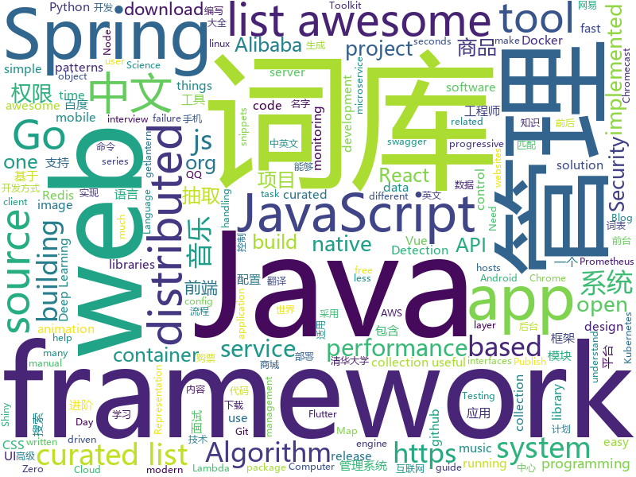

# 2019-01-24
See what the GitHub community is most excited about today.

## python
* [LASER](https://github.com/facebookresearch/LASER)(**366 stars today**): Language-Agnostic SEntence Representations
* [funNLP](https://github.com/fighting41love/funNLP)(**249 stars today**): 中英文敏感词、语言检测、中外手机/电话归属地/运营商查询、名字推断性别、手机号抽取、身份证抽取、邮箱抽取、中日文人名库、中文缩写库、拆字词典、词汇情感值、停用词、反动词表、暴恐词表、繁简体转换、英文模拟中文发音、汪峰歌词生成器、职业名称词库、同义词库、反义词库、否定词库、汽车品牌词库、汽车零件词库、连续英文切割、各种中文词向量、公司名字大全、古诗词库、IT词库、财经词库、成语词库、地名词库、历史名人词库、诗词词库、医学词库、饮食词库、法律词库、汽车词库、动物词库、中文聊天语料、中文谣言数据、百度中文问答数据集、句子相似度匹配算法集合、bert资源、文本生成&摘要相关工具、cocoNLP信息抽取工具、国内电话号码正则匹配、清华大学XLORE:中英文跨语言百科知识图谱、清华大学人工智能技术…
* [deep-learning-ocean](https://github.com/osforscience/deep-learning-ocean)(**230 stars today**): 📡All You Need to Know About Deep Learning - A kick-starter
* [hosts](https://github.com/StevenBlack/hosts)(**132 stars today**): Extending and consolidating hosts files from several well-curated sources like adaway.org, mvps.org, malwaredomainlist.com, someonewhocares.org, and potentially others. You can optionally invoke extensions to block additional sites by category.
* [py12306](https://github.com/pjialin/py12306)(**100 stars today**): 🚂12306 购票助手，支持分布式，多账号，多任务购票以及 Web 页面管理
* [12306](https://github.com/testerSunshine/12306)(**91 stars today**): 12306智能刷票，订票
* [howmanypeoplearearound](https://github.com/schollz/howmanypeoplearearound)(**101 stars today**): Count the number of people around you👨‍👨‍👦by monitoring wifi signals📡
* [datasets](https://github.com/tensorflow/datasets)(**89 stars today**): A collection of datasets ready to use with TensorFlow
* [TorchSeg](https://github.com/ycszen/TorchSeg)(**90 stars today**): Fast, modular reference implementation and easy training of Semantic Segmentation algorithms in PyTorch.
* [catt](https://github.com/skorokithakis/catt)(**90 stars today**): Cast All The Things allows you to send videos from many, many online sources to your Chromecast.
* [system-design-primer](https://github.com/donnemartin/system-design-primer)(**71 stars today**): Learn how to design large-scale systems. Prep for the system design interview. Includes Anki flashcards.
* [awesome-python](https://github.com/vinta/awesome-python)(**74 stars today**): A curated list of awesome Python frameworks, libraries, software and resources
* [statarb](https://github.com/upresearch/statarb)(**68 stars today**): 
* [music-dl](https://github.com/0xHJK/music-dl)(**75 stars today**): search and download music 从网易云音乐、QQ音乐、酷狗音乐、百度音乐、虾米音乐等搜索和下载歌曲
* [Python](https://github.com/TheAlgorithms/Python)(**66 stars today**): All Algorithms implemented in Python
* [PrivExchange](https://github.com/dirkjanm/PrivExchange)(**60 stars today**): Exchange your privileges for Domain Admin privs by abusing Exchange
* [models](https://github.com/tensorflow/models)(**48 stars today**): Models and examples built with TensorFlow
* [bert](https://github.com/google-research/bert)(**56 stars today**): TensorFlow code and pre-trained models for BERT
* [kalliope](https://github.com/kalliope-project/kalliope)(**61 stars today**): Kalliope is a framework that will help you to create your own personal assistant.
* [nsfw](https://github.com/rockyzhengwu/nsfw)(**51 stars today**): Suitable for Work (NSFW) classification
* [walle-web](https://github.com/meolu/walle-web)(**54 stars today**): walle - 瓦力 开源项目代码部署平台
* [tldr](https://github.com/tldr-pages/tldr)(**53 stars today**): 📚Simplified and community-driven man pages
* [ouroboros](https://github.com/pyouroboros/ouroboros)(**50 stars today**): Automatically update running docker containers with latest image
* [pyod](https://github.com/yzhao062/pyod)(**47 stars today**): A Python Toolkit for Scalable Outlier Detection (Anomaly Detection)
* [keras](https://github.com/keras-team/keras)(**37 stars today**): Deep Learning for humans

## java
* [advanced-java](https://github.com/doocs/advanced-java)(**220 stars today**): 😮互联网 Java 工程师进阶知识完全扫盲
* [JavaGuide](https://github.com/Snailclimb/JavaGuide)(**157 stars today**): 【Java学习+面试指南】 一份涵盖大部分Java程序员所需要掌握的核心知识。
* [fescar](https://github.com/alibaba/fescar)(**104 stars today**): Fescar is an easy-to-use, high-performance, java based, open source distributed transaction solution.
* [arthas](https://github.com/alibaba/arthas)(**92 stars today**): Alibaba Java Diagnostic Tool Arthas/Alibaba Java诊断利器Arthas
* [nacos](https://github.com/alibaba/nacos)(**82 stars today**): an easy-to-use dynamic service discovery, configuration and service management platform for building cloud native applications.
* [mall](https://github.com/macrozheng/mall)(**67 stars today**): mall项目是一套电商系统，包括前台商城系统及后台管理系统，基于SpringBoot+MyBatis实现。 前台商城系统包含首页门户、商品推荐、商品搜索、商品展示、购物车、订单流程、会员中心、客户服务、帮助中心等模块。 后台管理系统包含商品管理、订单管理、会员管理、促销管理、运营管理、内容管理、统计报表、财务管理、权限管理、设置等模块。
* [java-almanac](https://github.com/marchof/java-almanac)(**65 stars today**): Some Java Historiography
* [cim](https://github.com/crossoverJie/cim)(**60 stars today**): 📲cim(cross IM) 适用于开发者的即时通讯系统
* [spring-boot](https://github.com/spring-projects/spring-boot)(**52 stars today**): Spring Boot
* [spring-cloud-alibaba](https://github.com/spring-cloud-incubator/spring-cloud-alibaba)(**58 stars today**): Spring Cloud Alibaba provides a one-stop solution for application development for the distributed solutions of Alibaba middleware.
* [java-design-patterns](https://github.com/iluwatar/java-design-patterns)(**48 stars today**): Design patterns implemented in Java
* [tutorials](https://github.com/eugenp/tutorials)(**26 stars today**): The "REST With Spring" Course:
* [spring-framework](https://github.com/spring-projects/spring-framework)(**41 stars today**): Spring Framework
* [incubator-dubbo](https://github.com/apache/incubator-dubbo)(**38 stars today**): Apache Dubbo (incubating) is a high-performance, java based, open source RPC framework.
* [Java](https://github.com/TheAlgorithms/Java)(**38 stars today**): All Algorithms implemented in Java
* [elasticsearch](https://github.com/elastic/elasticsearch)(**35 stars today**): Open Source, Distributed, RESTful Search Engine
* [redisson](https://github.com/redisson/redisson)(**40 stars today**): Redisson - distributed Java objects and services (Set, Multimap, SortedSet, Map, List, Queue, Deque, Semaphore, Lock, AtomicLong, Map Reduce, Publish / Subscribe, Bloom filter, Spring Cache, Tomcat, Scheduler, JCache API, Hibernate) on top of Redis server. State of the Art Redis Java client
* [XUI](https://github.com/xuexiangjys/XUI)(**40 stars today**): 💍一个简洁而优雅的Android原生UI框架，解放你的双手！
* [Sentinel](https://github.com/alibaba/Sentinel)(**34 stars today**): A lightweight powerful flow control component enabling reliability and monitoring for microservices. (轻量级的流量控制、熔断降级 Java 库)
* [failsafe](https://github.com/jhalterman/failsafe)(**39 stars today**): Failure handling and resilience patterns for the JVM
* [apollo](https://github.com/ctripcorp/apollo)(**34 stars today**): Apollo（阿波罗）是携程框架部门研发的分布式配置中心，能够集中化管理应用不同环境、不同集群的配置，配置修改后能够实时推送到应用端，并且具备规范的权限、流程治理等特性，适用于微服务配置管理场景。
* [SpiderMan](https://github.com/simplepeng/SpiderMan)(**36 stars today**): 🔥崩溃日志手机端显示 ，测试妹妹的最爱，开发哥哥的小棉袄
* [eladmin](https://github.com/elunez/eladmin)(**33 stars today**): 项目基于 Spring Boot 2.1.0 、 Spring boot Jpa、 Spring Security、redis、Vue的前后端分离的权限管理系统，项目采用分模块开发方式， 权限控制采用 RBAC（Role-Based Access Control，基于角色的访问控制），前端菜单支持动态路由
* [JCSprout](https://github.com/crossoverJie/JCSprout)(**28 stars today**): 👨‍🎓Java Core Sprout : basic, concurrent, algorithm
* [rocketmq-spring](https://github.com/apache/rocketmq-spring)(**27 stars today**): Apache RocketMQ Spring Integration

## unknown
* [open-source-cs](https://github.com/ForrestKnight/open-source-cs)(**278 stars today**): Video discussing this curriculum:
* [developer-roadmap](https://github.com/kamranahmedse/developer-roadmap)(**207 stars today**): Roadmap to becoming a web developer in 2019
* [kubernetes-failure-stories](https://github.com/hjacobs/kubernetes-failure-stories)(**206 stars today**): Compilation of public failure/horror stories related to Kubernetes
* [CS-Notes](https://github.com/CyC2018/CS-Notes)(**123 stars today**): 📚面试必备基础知识
* [awesome](https://github.com/sindresorhus/awesome)(**104 stars today**): 😎Curated list of awesome lists
* [You-Dont-Know-JS](https://github.com/getify/You-Dont-Know-JS)(**90 stars today**): A book series on JavaScript. @YDKJS on twitter.
* [deep_learning_object_detection](https://github.com/hoya012/deep_learning_object_detection)(**83 stars today**): A paper list of object detection using deep learning.
* [100-Days-Of-ML-Code](https://github.com/Avik-Jain/100-Days-Of-ML-Code)(**81 stars today**): 100 Days of ML Coding
* [request-for-implementation](https://github.com/dtolnay/request-for-implementation)(**81 stars today**): Crates that don't exist, but should
* [gitignore](https://github.com/github/gitignore)(**54 stars today**): A collection of useful .gitignore templates
* [free-programming-books](https://github.com/EbookFoundation/free-programming-books)(**61 stars today**): 📚Freely available programming books
* [RaymarchingWorkshop](https://github.com/ajweeks/RaymarchingWorkshop)(**57 stars today**): Introduction to Raymarching
* [hosts](https://github.com/googlehosts/hosts)(**42 stars today**): 镜像：https://coding.net/u/scaffrey/p/hosts/git
* [coding-interview-university](https://github.com/jwasham/coding-interview-university)(**47 stars today**): A complete computer science study plan to become a software engineer.
* [awesome-interview-questions](https://github.com/MaximAbramchuck/awesome-interview-questions)(**49 stars today**): A curated awesome list of lists of interview questions. Feel free to contribute!🎓
* [gold-miner](https://github.com/xitu/gold-miner)(**50 stars today**): 🥇掘金翻译计划，可能是世界最大最好的英译中技术社区，最懂读者和译者的翻译平台：
* [awesome-vue](https://github.com/vuejs/awesome-vue)(**43 stars today**): 🎉A curated list of awesome things related to Vue.js
* [blog](https://github.com/yygmind/blog)(**43 stars today**): 我是木易杨，网易高级前端工程师，跟着我每周重点攻克一个前端面试重难点。接下来让我带你走进高级前端的世界，在进阶的路上，共勉！
* [The-Economist](https://github.com/nailperry-zd/The-Economist)(**42 stars today**): The Economist 经济学人，持续更新
* [the-book-of-secret-knowledge](https://github.com/trimstray/the-book-of-secret-knowledge)(**43 stars today**): A collection of awesome lists, manuals, blogs, hacks, one-liners, cli/web tools and more. Especially for System and Network Administrators, DevOps, Pentesters or Security Researchers.
* [Python-programming-exercises](https://github.com/zhiwehu/Python-programming-exercises)(**33 stars today**): 100+ Python challenging programming exercises
* [computer-science](https://github.com/ossu/computer-science)(**37 stars today**): 🎓Path to a free self-taught education in Computer Science!
* [awesome-for-beginners](https://github.com/MunGell/awesome-for-beginners)(**32 stars today**): A list of awesome beginners-friendly projects.
* [awesome-cpp](https://github.com/fffaraz/awesome-cpp)(**30 stars today**): A curated list of awesome C++ (or C) frameworks, libraries, resources, and shiny things. Inspired by awesome-... stuff.
* [android-architecture](https://github.com/googlesamples/android-architecture)(**27 stars today**): A collection of samples to discuss and showcase different architectural tools and patterns for Android apps.

## javascript
* [react-spring](https://github.com/react-spring/react-spring)(**339 stars today**): ✌️A spring physics based React animation library
* [fx_cast](https://github.com/hensm/fx_cast)(**245 stars today**): Implementation of the Chrome Sender API (Chromecast) within Firefox
* [30-seconds-of-code](https://github.com/30-seconds/30-seconds-of-code)(**206 stars today**): Curated collection of useful JavaScript snippets that you can understand in 30 seconds or less.
* [nuclear](https://github.com/nukeop/nuclear)(**172 stars today**): Popcorn Time for music
* [vue](https://github.com/vuejs/vue)(**127 stars today**): 🖖Vue.js is a progressive, incrementally-adoptable JavaScript framework for building UI on the web.
* [javascript-algorithms](https://github.com/trekhleb/javascript-algorithms)(**119 stars today**): 📝Algorithms and data structures implemented in JavaScript with explanations and links to further readings
* [fx](https://github.com/antonmedv/fx)(**117 stars today**): Command-line tool and terminal JSON viewer🔥
* [react](https://github.com/facebook/react)(**97 stars today**): A declarative, efficient, and flexible JavaScript library for building user interfaces.
* [Musish](https://github.com/Musish/Musish)(**98 stars today**): Apple Music...ish
* [shiny](https://github.com/rikschennink/shiny)(**98 stars today**): 🌟Shiny reflections for mobile websites
* [sweetalert2](https://github.com/sweetalert2/sweetalert2)(**92 stars today**): A beautiful, responsive, highly customizable and accessible (WAI-ARIA) replacement for JavaScript's popup boxes. Zero dependencies.
* [miaosha](https://github.com/qiurunze123/miaosha)(**85 stars today**): ⛹️🐘秒杀系统设计与实现.互联网工程师进阶与分析🙋🐓
* [typescript-eslint](https://github.com/typescript-eslint/typescript-eslint)(**74 stars today**): ✨Monorepo for all the tooling which enables ESLint to support TypeScript
* [release-it](https://github.com/webpro/release-it)(**73 stars today**): Automate the tedious tasks of software releases. Happily release and publish your Git repositories, npm packages, GitHub & GitLab releases, changelogs, and much more!
* [yapi](https://github.com/YMFE/yapi)(**69 stars today**): YApi 是一个可本地部署的、打通前后端及QA的、可视化的接口管理平台
* [redom](https://github.com/redom/redom)(**67 stars today**): Tiny (2 KB) turboboosted JavaScript library for creating user interfaces.
* [gatsby](https://github.com/gatsbyjs/gatsby)(**62 stars today**): Build blazing fast, modern apps and websites with React
* [taiko-web](https://github.com/bui/taiko-web)(**58 stars today**): Taiko no Tatsujin simulator
* [create-react-app](https://github.com/facebook/create-react-app)(**53 stars today**): Set up a modern web app by running one command.
* [react-native](https://github.com/facebook/react-native)(**59 stars today**): A framework for building native apps with React.
* [taro](https://github.com/NervJS/taro)(**58 stars today**): 多端统一开发框架，支持用 React 的开发方式编写一次代码，生成能运行在微信/百度/支付宝/字节跳动小程序、H5、React Native 等的应用。 https://taro.js.org/
* [puppeteer](https://github.com/GoogleChrome/puppeteer)(**58 stars today**): Headless Chrome Node API
* [nodebestpractices](https://github.com/i0natan/nodebestpractices)(**60 stars today**): The largest Node.js best practices list (January 2019)
* [anime](https://github.com/juliangarnier/anime)(**60 stars today**): JavaScript animation engine
* [CSS-Inspiration](https://github.com/chokcoco/CSS-Inspiration)(**55 stars today**): CSS Inspiration，在这里找到写 CSS 的灵感！

## html
* [flutter-in-action](https://github.com/flutterchina/flutter-in-action)(**58 stars today**): 《Flutter实战》电子书
* [ionic](https://github.com/ionic-team/ionic)(**33 stars today**): Build amazing native and progressive web apps with open web technologies. One app running on everything🎉
* [30-seconds-of-css](https://github.com/30-seconds/30-seconds-of-css)(**28 stars today**): A curated collection of useful CSS snippets you can understand in 30 seconds or less.
* [zju-icicles](https://github.com/QSCTech/zju-icicles)(**22 stars today**): 浙江大学课程攻略共享计划
* [Spoon-Knife](https://github.com/octocat/Spoon-Knife)(****): This repo is for demonstration purposes only.
* [JavaScript30](https://github.com/wesbos/JavaScript30)(**16 stars today**): 30 Day Vanilla JS Challenge
* [styleguide](https://github.com/google/styleguide)(**18 stars today**): Style guides for Google-originated open-source projects
* [pytorch-doc-zh](https://github.com/apachecn/pytorch-doc-zh)(**11 stars today**): PyTorch 中文文档
* [fastText](https://github.com/facebookresearch/fastText)(**14 stars today**): Library for fast text representation and classification.
* [portainer](https://github.com/portainer/portainer)(**14 stars today**): Simple management UI for Docker
* [Animatopy](https://github.com/sarthology/Animatopy)(**14 stars today**): 🎩Just-add-water simple CSS animations snippets
* [qiubaiying.github.io](https://github.com/qiubaiying/qiubaiying.github.io)(**7 stars today**): BY Blog ->
* [swagger-codegen](https://github.com/swagger-api/swagger-codegen)(**10 stars today**): swagger-codegen contains a template-driven engine to generate documentation, API clients and server stubs in different languages by parsing your OpenAPI / Swagger definition.
* [owasp-mstg](https://github.com/OWASP/owasp-mstg)(**10 stars today**): The Mobile Security Testing Guide (MSTG) is a comprehensive manual for mobile app security testing and reverse engineering.
* [solid](https://github.com/solid/solid)(**9 stars today**): Solid - Re-decentralizing the web (project directory)
* [Iosevka](https://github.com/be5invis/Iosevka)(**9 stars today**): Slender typeface for code, from code.
* [mdline](https://github.com/azu/mdline)(**9 stars today**): Markdown timeline format and toolkit.
* [now-github-starter](https://github.com/zeit/now-github-starter)(****): Starter project to demonstrate a project whose pull requests get automatically deployed
* [blog_os](https://github.com/phil-opp/blog_os)(**8 stars today**): Writing an OS in Rust
* [linux-command](https://github.com/jaywcjlove/linux-command)(**8 stars today**): Linux命令大全搜索工具，内容包含Linux命令手册、详解、学习、搜集。https://git.io/linux
* [turkey](https://github.com/yanfengliu/turkey)(**8 stars today**): 
* [elasticsearch-definitive-guide](https://github.com/elasticsearch-cn/elasticsearch-definitive-guide)(**7 stars today**): 欢迎加QQ群：109764489，贡献力量！
* [wysiwyg-editor](https://github.com/froala/wysiwyg-editor)(**7 stars today**): A beautifully designed WYSIWYG HTML Editor based on HTML5.
* [ionicons](https://github.com/ionic-team/ionicons)(**7 stars today**): The premium icon font for Ionic Framework and web apps everywhere
* [awesome-competitive-programming](https://github.com/lnishan/awesome-competitive-programming)(**7 stars today**): 💎A curated list of awesome Competitive Programming, Algorithm and Data Structure resources

## go
* [aws-lambda-container-image-converter](https://github.com/awslabs/aws-lambda-container-image-converter)(**384 stars today**): The AWS Lambda container image converter tool (img2lambda) repackages container images (such as Docker images) into AWS Lambda layers, and publishes them as new layer versions.
* [konfig](https://github.com/lalamove/konfig)(**78 stars today**): Composable, observable and performant config handling for Go for the distributed processing era
* [kubernetes](https://github.com/kubernetes/kubernetes)(**56 stars today**): Production-Grade Container Scheduling and Management
* [soar](https://github.com/XiaoMi/soar)(**56 stars today**): SQL Optimizer And Rewriter
* [go](https://github.com/golang/go)(**53 stars today**): The Go programming language
* [torsniff](https://github.com/fanpei91/torsniff)(**47 stars today**): torsniff - a sniffer fetching torrents from BitTorrent network
* [timeliner](https://github.com/mholt/timeliner)(**49 stars today**): All your digital life on a single timeline, stored locally
* [awesome-go](https://github.com/avelino/awesome-go)(**42 stars today**): A curated list of awesome Go frameworks, libraries and software
* [hugo](https://github.com/gohugoio/hugo)(**43 stars today**): The world’s fastest framework for building websites.
* [mkcert](https://github.com/FiloSottile/mkcert)(**41 stars today**): A simple zero-config tool to make locally trusted development certificates with any names you'd like.
* [go-flutter-desktop-embedder](https://github.com/Drakirus/go-flutter-desktop-embedder)(**40 stars today**): A Go (golang) Custom Flutter Engine Embedder for desktop
* [loki](https://github.com/grafana/loki)(**35 stars today**): Like Prometheus, but for logs.
* [lantern](https://github.com/getlantern/lantern)(**32 stars today**): 🔴蓝灯最新版本下载 https://github.com/getlantern/download🔴Lantern Latest Download https://github.com/getlantern/download🔴
* [istio](https://github.com/istio/istio)(**31 stars today**): Connect, secure, control, and observe services.
* [etcd](https://github.com/etcd-io/etcd)(**33 stars today**): Distributed reliable key-value store for the most critical data of a distributed system
* [BaiduPCS-Go](https://github.com/iikira/BaiduPCS-Go)(**33 stars today**): 百度网盘客户端 - Go语言编写
* [task](https://github.com/go-task/task)(**33 stars today**): A task runner / simpler Make alternative written in Go
* [chezmoi](https://github.com/twpayne/chezmoi)(**31 stars today**): Manage your dotfiles securely across multiple machines.
* [frp](https://github.com/fatedier/frp)(**30 stars today**): A fast reverse proxy to help you expose a local server behind a NAT or firewall to the internet.
* [gin](https://github.com/gin-gonic/gin)(**30 stars today**): Gin is a HTTP web framework written in Go (Golang). It features a Martini-like API with much better performance -- up to 40 times faster. If you need smashing performance, get yourself some Gin.
* [go-chassis](https://github.com/go-chassis/go-chassis)(**30 stars today**): a microservice framework for rapid development of micro services in Go
* [ascii-tv](https://github.com/martinraison/ascii-tv)(**31 stars today**): Stream ASCII movies over HTTP
* [please](https://github.com/thought-machine/please)(**31 stars today**): High-performance extensible build system for reproducible builds.
* [prometheus](https://github.com/prometheus/prometheus)(**29 stars today**): The Prometheus monitoring system and time series database.
* [helm](https://github.com/helm/helm)(**25 stars today**): The Kubernetes Package Manager

## WordCloud

