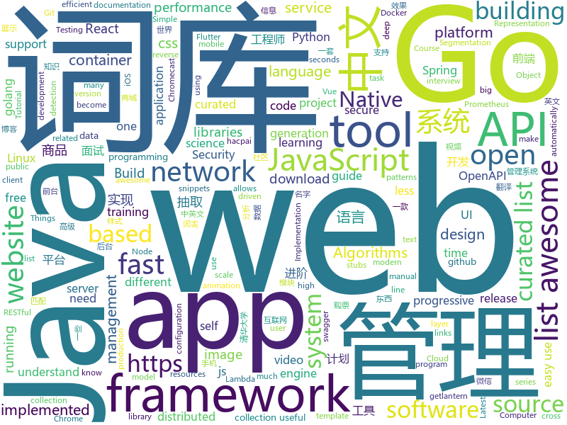

# 2019-01-25
See what the GitHub community is most excited about today.

## python
* [catt](https://github.com/skorokithakis/catt)(**373 stars today**): Cast All The Things allows you to send videos from many, many online sources to your Chromecast.
* [LASER](https://github.com/facebookresearch/LASER)(**331 stars today**): Language-Agnostic SEntence Representations
* [funNLP](https://github.com/fighting41love/funNLP)(**188 stars today**): 中英文敏感词、语言检测、中外手机/电话归属地/运营商查询、名字推断性别、手机号抽取、身份证抽取、邮箱抽取、中日文人名库、中文缩写库、拆字词典、词汇情感值、停用词、反动词表、暴恐词表、繁简体转换、英文模拟中文发音、汪峰歌词生成器、职业名称词库、同义词库、反义词库、否定词库、汽车品牌词库、汽车零件词库、连续英文切割、各种中文词向量、公司名字大全、古诗词库、IT词库、财经词库、成语词库、地名词库、历史名人词库、诗词词库、医学词库、饮食词库、法律词库、汽车词库、动物词库、中文聊天语料、中文谣言数据、百度中文问答数据集、句子相似度匹配算法集合、bert资源、文本生成&摘要相关工具、cocoNLP信息抽取工具、国内电话号码正则匹配、清华大学XLORE:中英文跨语言百科知识图谱、清华大学人工智能技术…
* [deep-learning-ocean](https://github.com/osforscience/deep-learning-ocean)(**152 stars today**): 📡All You Need to Know About Deep Learning - A kick-starter
* [TorchSeg](https://github.com/ycszen/TorchSeg)(**144 stars today**): Fast, modular reference implementation and easy training of Semantic Segmentation algorithms in PyTorch.
* [Airtest](https://github.com/AirtestProject/Airtest)(**121 stars today**): UI Test Automation Framework for Games and Apps
* [12306](https://github.com/testerSunshine/12306)(**87 stars today**): 12306智能刷票，订票
* [ExtremeNet](https://github.com/xingyizhou/ExtremeNet)(**90 stars today**): Bottom-up Object Detection by Grouping Extreme and Center Points
* [system-design-primer](https://github.com/donnemartin/system-design-primer)(**85 stars today**): Learn how to design large-scale systems. Prep for the system design interview. Includes Anki flashcards.
* [Machine-Learning-with-Python](https://github.com/devAmoghS/Machine-Learning-with-Python)(**86 stars today**): Small scale machine learning projects to understand the core concepts
* [natural-questions](https://github.com/google-research-datasets/natural-questions)(**77 stars today**): 
* [models](https://github.com/tensorflow/models)(**53 stars today**): Models and examples built with TensorFlow
* [howmanypeoplearearound](https://github.com/schollz/howmanypeoplearearound)(**73 stars today**): Count the number of people around you👨‍👨‍👦by monitoring wifi signals📡
* [ouroboros](https://github.com/pyouroboros/ouroboros)(**69 stars today**): Automatically update running docker containers with latest image
* [py12306](https://github.com/pjialin/py12306)(**64 stars today**): 🚂12306 购票助手，支持分布式，多账号，多任务购票以及 Web 页面管理
* [awesome-python](https://github.com/vinta/awesome-python)(**60 stars today**): A curated list of awesome Python frameworks, libraries, software and resources
* [nauta](https://github.com/IntelAI/nauta)(**61 stars today**): A multi-user, distributed computing environment for running DL model training experiments on Intel® Xeon® Scalable processor-based systems
* [statarb](https://github.com/upresearch/statarb)(**44 stars today**): 
* [youtube-dl](https://github.com/rg3/youtube-dl)(**46 stars today**): Command-line program to download videos from YouTube.com and other video sites
* [TensorFlow-Course](https://github.com/osforscience/TensorFlow-Course)(**48 stars today**): Simple and ready-to-use tutorials for TensorFlow
* [Python](https://github.com/TheAlgorithms/Python)(**45 stars today**): All Algorithms implemented in Python
* [bert](https://github.com/google-research/bert)(**40 stars today**): TensorFlow code and pre-trained models for BERT
* [nsfw](https://github.com/rockyzhengwu/nsfw)(**41 stars today**): Suitable for Work (NSFW) classification
* [cpython](https://github.com/python/cpython)(**35 stars today**): The Python programming language
* [public-apis](https://github.com/toddmotto/public-apis)(****): A collective list of free APIs for use in software and web development.

## java
* [advanced-java](https://github.com/doocs/advanced-java)(**171 stars today**): 😮互联网 Java 工程师进阶知识完全扫盲
* [JavaGuide](https://github.com/Snailclimb/JavaGuide)(**141 stars today**): 【Java学习+面试指南】 一份涵盖大部分Java程序员所需要掌握的核心知识。
* [miaosha](https://github.com/qiurunze123/miaosha)(**130 stars today**): ⛹️🐘秒杀系统设计与实现.互联网工程师进阶与分析🙋🐓
* [java-almanac](https://github.com/marchof/java-almanac)(**130 stars today**): Some Java Historiography
* [nacos](https://github.com/alibaba/nacos)(**84 stars today**): an easy-to-use dynamic service discovery, configuration and service management platform for building cloud native applications.
* [fescar](https://github.com/alibaba/fescar)(**73 stars today**): Fescar is an easy-to-use, high-performance, java based, open source distributed transaction solution.
* [Diooto](https://github.com/moyokoo/Diooto)(**76 stars today**): 微博,微信图库效果,微信视频拖放效果,适配状态栏 、屏幕旋转 、全屏 、长图、GIF、视频
* [wgcloud](https://github.com/tianshiyeben/wgcloud)(**65 stars today**): linux运维和性能分析
* [arthas](https://github.com/alibaba/arthas)(**66 stars today**): Alibaba Java Diagnostic Tool Arthas/Alibaba Java诊断利器Arthas
* [mall](https://github.com/macrozheng/mall)(**59 stars today**): mall项目是一套电商系统，包括前台商城系统及后台管理系统，基于SpringBoot+MyBatis实现。 前台商城系统包含首页门户、商品推荐、商品搜索、商品展示、购物车、订单流程、会员中心、客户服务、帮助中心等模块。 后台管理系统包含商品管理、订单管理、会员管理、促销管理、运营管理、内容管理、统计报表、财务管理、权限管理、设置等模块。
* [XToast](https://github.com/getActivity/XToast)(**66 stars today**): SuperToast
* [java-design-patterns](https://github.com/iluwatar/java-design-patterns)(**51 stars today**): Design patterns implemented in Java
* [tutorials](https://github.com/eugenp/tutorials)(**28 stars today**): The "REST With Spring" Course:
* [spring-boot](https://github.com/spring-projects/spring-boot)(**43 stars today**): Spring Boot
* [OpenCue](https://github.com/imageworks/OpenCue)(**47 stars today**): Render farm management software
* [presto](https://github.com/prestosql/presto)(**45 stars today**): Distributed SQL query engine for big data
* [cim](https://github.com/crossoverJie/cim)(**40 stars today**): 📲cim(cross IM) 适用于开发者的即时通讯系统
* [symphony](https://github.com/b3log/symphony)(**39 stars today**): 🎶一款用 Java 实现的现代化社区（论坛/BBS/社交网络/博客）平台。https://hacpai.com
* [elasticsearch](https://github.com/elastic/elasticsearch)(**38 stars today**): Open Source, Distributed, RESTful Search Engine
* [netty](https://github.com/netty/netty)(**35 stars today**): Netty project - an event-driven asynchronous network application framework
* [incubator-dubbo](https://github.com/apache/incubator-dubbo)(**34 stars today**): Apache Dubbo (incubating) is a high-performance, java based, open source RPC framework.
* [citypicker](https://github.com/crazyandcoder/citypicker)(**37 stars today**): citypicker城市选择器，详细的省市区地址信息，支持仿iOS滚轮实现，仿京东样式，一级或者三级列表展示方式。
* [interviews](https://github.com/kdn251/interviews)(**33 stars today**): Everything you need to know to get the job.
* [SpiderMan](https://github.com/simplepeng/SpiderMan)(**34 stars today**): 🔥崩溃日志手机端显示 ，测试妹妹的最爱，开发哥哥的小棉袄
* [Java](https://github.com/TheAlgorithms/Java)(**27 stars today**): All Algorithms implemented in Java

## unknown
* [unmaintainable-code](https://github.com/Droogans/unmaintainable-code)(**360 stars today**): A more maintainable, easier to share version of the infamous http://mindprod.com/jgloss/unmain.html
* [the-practical-linux-hardening-guide](https://github.com/trimstray/the-practical-linux-hardening-guide)(**217 stars today**): This guide details the planning and the tools involved in creating a secure Linux production systems.
* [developer-roadmap](https://github.com/kamranahmedse/developer-roadmap)(**201 stars today**): Roadmap to becoming a web developer in 2019
* [open-source-cs](https://github.com/ForrestKnight/open-source-cs)(**200 stars today**): Video discussing this curriculum:
* [CS-Notes](https://github.com/CyC2018/CS-Notes)(**109 stars today**): 📚面试必备基础知识
* [You-Dont-Know-JS](https://github.com/getify/You-Dont-Know-JS)(**77 stars today**): A book series on JavaScript. @YDKJS on twitter.
* [awesome](https://github.com/sindresorhus/awesome)(**76 stars today**): 😎Curated list of awesome lists
* [kubernetes-failure-stories](https://github.com/hjacobs/kubernetes-failure-stories)(**73 stars today**): Compilation of public failure/horror stories related to Kubernetes
* [free-programming-books](https://github.com/EbookFoundation/free-programming-books)(**62 stars today**): 📚Freely available programming books
* [quick-look-plugins](https://github.com/sindresorhus/quick-look-plugins)(**70 stars today**): List of useful Quick Look plugins for developers
* [academic_advisory](https://github.com/brohrer/academic_advisory)(**65 stars today**): Collected opinions and advice for academic programs focused on data science skills.
* [hosts](https://github.com/googlehosts/hosts)(**53 stars today**): 镜像：https://coding.net/u/scaffrey/p/hosts/git
* [deep_learning_object_detection](https://github.com/hoya012/deep_learning_object_detection)(**53 stars today**): A paper list of object detection using deep learning.
* [gitignore](https://github.com/github/gitignore)(**37 stars today**): A collection of useful .gitignore templates
* [coding-interview-university](https://github.com/jwasham/coding-interview-university)(**50 stars today**): A complete computer science study plan to become a software engineer.
* [blog](https://github.com/yygmind/blog)(**49 stars today**): 我是木易杨，网易高级前端工程师，跟着我每周重点攻克一个前端面试重难点。接下来让我带你走进高级前端的世界，在进阶的路上，共勉！
* [the-book-of-secret-knowledge](https://github.com/trimstray/the-book-of-secret-knowledge)(**49 stars today**): A collection of awesome lists, manuals, blogs, hacks, one-liners, cli/web tools and more. Especially for System and Network Administrators, DevOps, Pentesters or Security Researchers.
* [computer-science](https://github.com/ossu/computer-science)(**38 stars today**): 🎓Path to a free self-taught education in Computer Science!
* [gold-miner](https://github.com/xitu/gold-miner)(**37 stars today**): 🥇掘金翻译计划，可能是世界最大最好的英译中技术社区，最懂读者和译者的翻译平台：
* [awesome-interview-questions](https://github.com/MaximAbramchuck/awesome-interview-questions)(**40 stars today**): A curated awesome list of lists of interview questions. Feel free to contribute!🎓
* [awesome-vue](https://github.com/vuejs/awesome-vue)(**34 stars today**): 🎉A curated list of awesome things related to Vue.js
* [awesome-for-beginners](https://github.com/MunGell/awesome-for-beginners)(**34 stars today**): A list of awesome beginners-friendly projects.
* [android-architecture](https://github.com/googlesamples/android-architecture)(**30 stars today**): A collection of samples to discuss and showcase different architectural tools and patterns for Android apps.
* [awesome-public-datasets](https://github.com/awesomedata/awesome-public-datasets)(**31 stars today**): A topic-centric list of HQ open datasets in public domains. PR ☛☛☛
* [awesome-quantified-self](https://github.com/woop/awesome-quantified-self)(**26 stars today**): 📊Websites, Resources, Devices, Wearables, Applications, and Platforms for Self Tracking

## javascript
* [cloudquery](https://github.com/cloudfetch/cloudquery)(**386 stars today**): Turn any website to serverless API (support SPA!)
* [javascript-algorithms](https://github.com/trekhleb/javascript-algorithms)(**191 stars today**): 📝Algorithms and data structures implemented in JavaScript with explanations and links to further readings
* [nuclear](https://github.com/nukeop/nuclear)(**165 stars today**): Popcorn Time for music
* [react-spring](https://github.com/react-spring/react-spring)(**162 stars today**): ✌️A spring physics based React animation library
* [vue](https://github.com/vuejs/vue)(**139 stars today**): 🖖Vue.js is a progressive, incrementally-adoptable JavaScript framework for building UI on the web.
* [react](https://github.com/facebook/react)(**123 stars today**): A declarative, efficient, and flexible JavaScript library for building user interfaces.
* [30-seconds-of-code](https://github.com/30-seconds/30-seconds-of-code)(**118 stars today**): Curated collection of useful JavaScript snippets that you can understand in 30 seconds or less.
* [css_tricks](https://github.com/QiShaoXuan/css_tricks)(**109 stars today**): some css tricks,一些css常用样式
* [fx_cast](https://github.com/hensm/fx_cast)(**100 stars today**): Implementation of the Chrome Sender API (Chromecast) within Firefox
* [anime](https://github.com/juliangarnier/anime)(**76 stars today**): JavaScript animation engine
* [vue-router-prefetch](https://github.com/egoist/vue-router-prefetch)(**77 stars today**): Prefetch links that are only visible in viewport.
* [release-it](https://github.com/webpro/release-it)(**76 stars today**): Automate the tedious tasks of software releases. Happily release and publish your Git repositories, npm packages, GitHub & GitLab releases, changelogs, and much more!
* [create-react-app](https://github.com/facebook/create-react-app)(**62 stars today**): Set up a modern web app by running one command.
* [puppeteer](https://github.com/GoogleChrome/puppeteer)(**61 stars today**): Headless Chrome Node API
* [javascript](https://github.com/airbnb/javascript)(**58 stars today**): JavaScript Style Guide
* [run.rb](https://github.com/jasoncharnes/run.rb)(**56 stars today**): Run Ruby in the browser using WebAssembly
* [awesome-mac](https://github.com/jaywcjlove/awesome-mac)(**54 stars today**):  Now we have become very big, Different from the original idea. Collect premium software in various categories.
* [nodebestpractices](https://github.com/i0natan/nodebestpractices)(**55 stars today**): The largest Node.js best practices list (January 2019)
* [chameleon](https://github.com/didi/chameleon)(**56 stars today**): 真正专注于让一套代码运行多端的开发框架，提供标准的MVVM架构开发模式统一各类终端
* [material-ui](https://github.com/mui-org/material-ui)(**46 stars today**): React components that implement Google's Material Design.
* [gatsby](https://github.com/gatsbyjs/gatsby)(**49 stars today**): Build blazing fast, modern apps and websites with React
* [yarn](https://github.com/yarnpkg/yarn)(**53 stars today**): 📦🐈Fast, reliable, and secure dependency management.
* [typescript-eslint](https://github.com/typescript-eslint/typescript-eslint)(**51 stars today**): ✨Monorepo for all the tooling which enables ESLint to support TypeScript
* [next.js](https://github.com/zeit/next.js)(**45 stars today**): The React Framework
* [CSS-Inspiration](https://github.com/chokcoco/CSS-Inspiration)(**48 stars today**): CSS Inspiration，在这里找到写 CSS 的灵感！

## html
* [flutter-in-action](https://github.com/flutterchina/flutter-in-action)(**77 stars today**): 《Flutter实战》电子书
* [ionic](https://github.com/ionic-team/ionic)(**75 stars today**): Build amazing native and progressive web apps with open web technologies. One app running on everything🎉
* [EnterprisePBRShadingModel](https://github.com/DassaultSystemes-Technology/EnterprisePBRShadingModel)(**60 stars today**): 
* [zju-icicles](https://github.com/QSCTech/zju-icicles)(**37 stars today**): 浙江大学课程攻略共享计划
* [JavaScript30](https://github.com/wesbos/JavaScript30)(**19 stars today**): 30 Day Vanilla JS Challenge
* [styleguide](https://github.com/google/styleguide)(**21 stars today**): Style guides for Google-originated open-source projects
* [fastText](https://github.com/facebookresearch/fastText)(**20 stars today**): Library for fast text representation and classification.
* [30-seconds-of-css](https://github.com/30-seconds/30-seconds-of-css)(**18 stars today**): A curated collection of useful CSS snippets you can understand in 30 seconds or less.
* [Spoon-Knife](https://github.com/octocat/Spoon-Knife)(****): This repo is for demonstration purposes only.
* [capacitor](https://github.com/ionic-team/capacitor)(**15 stars today**): Build cross-platform Native Progressive Web Apps for iOS, Android, and the web⚡️
* [openapi-generator](https://github.com/OpenAPITools/openapi-generator)(**12 stars today**): OpenAPI Generator allows generation of API client libraries (SDK generation), server stubs, documentation and configuration automatically given an OpenAPI Spec (v2, v3)
* [swagger-codegen](https://github.com/swagger-api/swagger-codegen)(**9 stars today**): swagger-codegen contains a template-driven engine to generate documentation, API clients and server stubs in different languages by parsing your OpenAPI / Swagger definition.
* [portainer](https://github.com/portainer/portainer)(**12 stars today**): Simple management UI for Docker
* [javascript-tutorial-en](https://github.com/iliakan/javascript-tutorial-en)(**10 stars today**): Modern JavaScript Tutorial
* [aboutPython](https://github.com/kerbalwzy/aboutPython)(**11 stars today**): 关于工作中使用Python时的一些乱七八糟的东西，想要好东西就自己进来翻吧。
* [linuxtools_rst](https://github.com/me115/linuxtools_rst)(**10 stars today**): Linux工具快速教程
* [owasp-mstg](https://github.com/OWASP/owasp-mstg)(**8 stars today**): The Mobile Security Testing Guide (MSTG) is a comprehensive manual for mobile app security testing and reverse engineering.
* [linklight](https://github.com/network-automation/linklight)(**8 stars today**): Training Course for Ansible Network Automation
* [500LineorLess_CN](https://github.com/HT524/500LineorLess_CN)(**7 stars today**): 500 line or less 中文翻译计划。
* [Adminator-admin-dashboard](https://github.com/puikinsh/Adminator-admin-dashboard)(**6 stars today**): Adminator is a easy to use and well design admin dashboard template for web apps, websites, services and more
* [frida-all-in-one](https://github.com/hookmaster/frida-all-in-one)(**7 stars today**): 《FRIDA操作手册》by @hluwa @r0ysue
* [pytorch-doc-zh](https://github.com/apachecn/pytorch-doc-zh)(**6 stars today**): PyTorch 中文文档
* [Iosevka](https://github.com/be5invis/Iosevka)(**7 stars today**): Slender typeface for code, from code.
* [wysiwyg-editor](https://github.com/froala/wysiwyg-editor)(**7 stars today**): A beautifully designed WYSIWYG HTML Editor based on HTML5.
* [awesome-webpack](https://github.com/webpack-contrib/awesome-webpack)(**6 stars today**): A curated list of awesome Webpack resources, libraries and tools

## go
* [aws-lambda-container-image-converter](https://github.com/awslabs/aws-lambda-container-image-converter)(**230 stars today**): The AWS Lambda container image converter tool (img2lambda) repackages container images (such as Docker images) into AWS Lambda layers, and publishes them as new layer versions.
* [gse](https://github.com/go-ego/gse)(**63 stars today**): Go efficient text segmentation; support english, chinese, japanese and other. Go 语言高性能分词
* [torsniff](https://github.com/fanpei91/torsniff)(**61 stars today**): torsniff - a sniffer that sniffs torrents from BitTorrent network
* [BaiduPCS-Go](https://github.com/iikira/BaiduPCS-Go)(**55 stars today**): 百度网盘客户端 - Go语言编写
* [kubernetes](https://github.com/kubernetes/kubernetes)(**43 stars today**): Production-Grade Container Scheduling and Management
* [HashStablePack](https://github.com/CovenantSQL/HashStablePack)(**52 stars today**): Code generation tool for QUICK struct content comparison
* [gitea](https://github.com/go-gitea/gitea)(**51 stars today**): Git with a cup of tea, painless self-hosted git service
* [nirvana](https://github.com/caicloud/nirvana)(**49 stars today**): Golang Restful API Framework for Productivity
* [frp](https://github.com/fatedier/frp)(**41 stars today**): A fast reverse proxy to help you expose a local server behind a NAT or firewall to the internet.
* [mkcert](https://github.com/FiloSottile/mkcert)(**45 stars today**): A simple zero-config tool to make locally trusted development certificates with any names you'd like.
* [go](https://github.com/golang/go)(**38 stars today**): The Go programming language
* [lantern](https://github.com/getlantern/lantern)(**38 stars today**): 🔴蓝灯最新版本下载 https://github.com/getlantern/download🔴Lantern Latest Download https://github.com/getlantern/download🔴
* [tengo](https://github.com/d5/tengo)(**41 stars today**): A fast script language for Go
* [loki](https://github.com/grafana/loki)(**38 stars today**): Like Prometheus, but for logs.
* [awesome-go](https://github.com/avelino/awesome-go)(**36 stars today**): A curated list of awesome Go frameworks, libraries and software
* [istio](https://github.com/istio/istio)(**36 stars today**): Connect, secure, control, and observe services.
* [hugo](https://github.com/gohugoio/hugo)(**37 stars today**): The world’s fastest framework for building websites.
* [go-flutter-desktop-embedder](https://github.com/Drakirus/go-flutter-desktop-embedder)(**36 stars today**): A Go (golang) Custom Flutter Engine Embedder for desktop
* [gin](https://github.com/gin-gonic/gin)(**33 stars today**): Gin is a HTTP web framework written in Go (Golang). It features a Martini-like API with much better performance -- up to 40 times faster. If you need smashing performance, get yourself some Gin.
* [pipe](https://github.com/b3log/pipe)(**34 stars today**): 🎷一款小而美的 Go 博客平台。https://hacpai.com/tag/pipe
* [build-web-application-with-golang](https://github.com/astaxie/build-web-application-with-golang)(**28 stars today**): A golang ebook intro how to build a web with golang
* [v2ray-core](https://github.com/v2ray/v2ray-core)(**29 stars today**): A platform for building proxies to bypass network restrictions.
* [traefik](https://github.com/containous/traefik)(**29 stars today**): The Cloud Native Edge Router
* [task](https://github.com/go-task/task)(**26 stars today**): A task runner / simpler Make alternative written in Go
* [prometheus](https://github.com/prometheus/prometheus)(**25 stars today**): The Prometheus monitoring system and time series database.

## WordCloud

