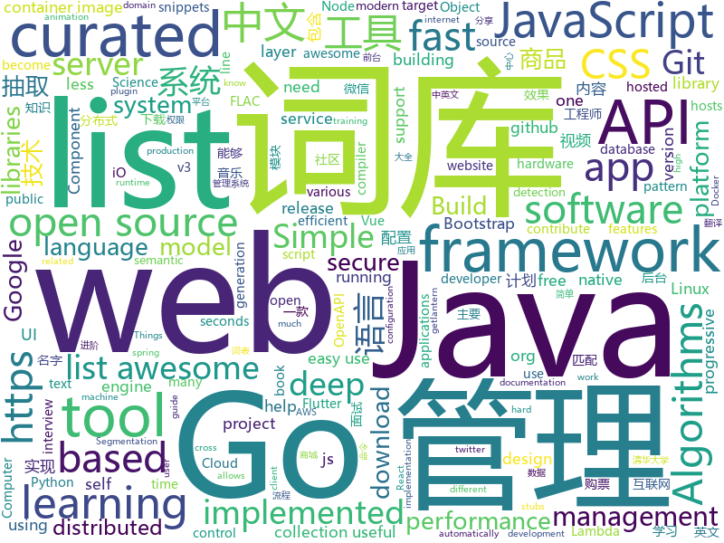

# 2019-01-26
See what the GitHub community is most excited about today.

## python
* [funNLP](https://github.com/fighting41love/funNLP)(**216 stars today**): 中英文敏感词、语言检测、中外手机/电话归属地/运营商查询、名字推断性别、手机号抽取、身份证抽取、邮箱抽取、中日文人名库、中文缩写库、拆字词典、词汇情感值、停用词、反动词表、暴恐词表、繁简体转换、英文模拟中文发音、汪峰歌词生成器、职业名称词库、同义词库、反义词库、否定词库、汽车品牌词库、汽车零件词库、连续英文切割、各种中文词向量、公司名字大全、古诗词库、IT词库、财经词库、成语词库、地名词库、历史名人词库、诗词词库、医学词库、饮食词库、法律词库、汽车词库、动物词库、中文聊天语料、中文谣言数据、百度中文问答数据集、句子相似度匹配算法集合、bert资源、文本生成&摘要相关工具、cocoNLP信息抽取工具、国内电话号码正则匹配、清华大学XLORE:中英文跨语言百科知识图谱、清华大学人工智能技术…
* [LASER](https://github.com/facebookresearch/LASER)(**193 stars today**): Language-Agnostic SEntence Representations
* [catt](https://github.com/skorokithakis/catt)(**132 stars today**): Cast All The Things allows you to send videos from many, many online sources to your Chromecast.
* [NeteaseCloudMusicFlac](https://github.com/YongHaoWu/NeteaseCloudMusicFlac)(**119 stars today**): 根据网易云音乐的歌单, 下载flac无损音乐到本地. Download the FLAC music from Internet according to your NeteaseCloudMusic playlist.
* [hosts](https://github.com/StevenBlack/hosts)(**106 stars today**): Extending and consolidating hosts files from several well-curated sources like adaway.org, mvps.org, malwaredomainlist.com, someonewhocares.org, and potentially others. You can optionally invoke extensions to block additional sites by category.
* [deep-learning-ocean](https://github.com/osforscience/deep-learning-ocean)(**99 stars today**): 📡All You Need to Know About Deep Learning - A kick-starter
* [DeepCreamPy](https://github.com/deeppomf/DeepCreamPy)(**80 stars today**): Decensoring Hentai with Deep Neural Networks
* [models](https://github.com/tensorflow/models)(**63 stars today**): Models and examples built with TensorFlow
* [pysc2](https://github.com/deepmind/pysc2)(**76 stars today**): StarCraft II Learning Environment
* [nsfw](https://github.com/rockyzhengwu/nsfw)(**67 stars today**): Suitable for Work (NSFW) classification
* [natural-questions](https://github.com/google-research-datasets/natural-questions)(**73 stars today**): 
* [system-design-primer](https://github.com/donnemartin/system-design-primer)(**68 stars today**): Learn how to design large-scale systems. Prep for the system design interview. Includes Anki flashcards.
* [ExtremeNet](https://github.com/xingyizhou/ExtremeNet)(**69 stars today**): Bottom-up Object Detection by Grouping Extreme and Center Points
* [py12306](https://github.com/pjialin/py12306)(**65 stars today**): 🚂12306 购票助手，支持分布式，多账号，多任务购票以及 Web 页面管理
* [12306](https://github.com/testerSunshine/12306)(**50 stars today**): 12306智能刷票，订票
* [awesome-python](https://github.com/vinta/awesome-python)(**54 stars today**): A curated list of awesome Python frameworks, libraries, software and resources
* [Airtest](https://github.com/AirtestProject/Airtest)(**55 stars today**): UI Test Automation Framework for Games and Apps
* [TorchSeg](https://github.com/ycszen/TorchSeg)(**55 stars today**): Fast, modular reference implementation and easy training of Semantic Segmentation algorithms in PyTorch.
* [TensorFlow-Course](https://github.com/osforscience/TensorFlow-Course)(**47 stars today**): Simple and ready-to-use tutorials for TensorFlow
* [nauta](https://github.com/IntelAI/nauta)(**51 stars today**): A multi-user, distributed computing environment for running DL model training experiments on Intel® Xeon® Scalable processor-based systems
* [neo-ai-dlr](https://github.com/neo-ai/neo-ai-dlr)(**51 stars today**): Neo AI is a compiler and runtime for machine learning models. The compiler optimizes machine learning models for various target hardware. The runtime executes the model on the target hardware.
* [spinningup](https://github.com/openai/spinningup)(**49 stars today**): An educational resource to help anyone learn deep reinforcement learning.
* [Python](https://github.com/TheAlgorithms/Python)(**42 stars today**): All Algorithms implemented in Python
* [PrivExchange](https://github.com/dirkjanm/PrivExchange)(**40 stars today**): Exchange your privileges for Domain Admin privs by abusing Exchange
* [public-apis](https://github.com/toddmotto/public-apis)(****): A collective list of free APIs for use in software and web development.

## java
* [fescar](https://github.com/alibaba/fescar)(**286 stars today**): Fescar is an easy-to-use, high-performance, java based, open source distributed transaction solution.
* [advanced-java](https://github.com/doocs/advanced-java)(**138 stars today**): 😮互联网 Java 工程师进阶知识完全扫盲
* [JavaGuide](https://github.com/Snailclimb/JavaGuide)(**117 stars today**): 【Java学习+面试指南】 一份涵盖大部分Java程序员所需要掌握的核心知识。
* [miaosha](https://github.com/qiurunze123/miaosha)(**83 stars today**): ⛹️🐘秒杀系统设计与实现.互联网工程师进阶与分析🙋🐓
* [OpenCue](https://github.com/imageworks/OpenCue)(**82 stars today**): Render farm management software
* [nacos](https://github.com/alibaba/nacos)(**72 stars today**): an easy-to-use dynamic service discovery, configuration and service management platform for building cloud native applications.
* [Diooto](https://github.com/moyokoo/Diooto)(**56 stars today**): 微博,微信图库效果,微信视频拖放效果,适配状态栏 、屏幕旋转 、全屏 、长图、GIF、视频
* [mall](https://github.com/macrozheng/mall)(**47 stars today**): mall项目是一套电商系统，包括前台商城系统及后台管理系统，基于SpringBoot+MyBatis实现。 前台商城系统包含首页门户、商品推荐、商品搜索、商品展示、购物车、订单流程、会员中心、客户服务、帮助中心等模块。 后台管理系统包含商品管理、订单管理、会员管理、促销管理、运营管理、内容管理、统计报表、财务管理、权限管理、设置等模块。
* [java-almanac](https://github.com/marchof/java-almanac)(**56 stars today**): Some Java Historiography
* [arthas](https://github.com/alibaba/arthas)(**49 stars today**): Alibaba Java Diagnostic Tool Arthas/Alibaba Java诊断利器Arthas
* [spring-boot](https://github.com/spring-projects/spring-boot)(**44 stars today**): Spring Boot
* [jib](https://github.com/GoogleContainerTools/jib)(**47 stars today**): ⛵️Build container images for your Java applications.
* [symphony](https://github.com/b3log/symphony)(**42 stars today**): 🎶一款用 Java 实现的现代化社区（论坛/BBS/社交网络/博客）平台。https://hacpai.com
* [incubator-dubbo](https://github.com/apache/incubator-dubbo)(**32 stars today**): Apache Dubbo (incubating) is a high-performance, java based, open source RPC framework.
* [incubator-shardingsphere](https://github.com/apache/incubator-shardingsphere)(**37 stars today**): Distributed database middleware
* [spring-framework](https://github.com/spring-projects/spring-framework)(**30 stars today**): Spring Framework
* [BasePopup](https://github.com/razerdp/BasePopup)(**37 stars today**): 亲，还在为PopupWindow烦恼吗？不如试试BasePopup，你会爱上他的~
* [apollo](https://github.com/ctripcorp/apollo)(**31 stars today**): Apollo（阿波罗）是携程框架部门研发的分布式配置中心，能够集中化管理应用不同环境、不同集群的配置，配置修改后能够实时推送到应用端，并且具备规范的权限、流程治理等特性，适用于微服务配置管理场景。
* [java-design-patterns](https://github.com/iluwatar/java-design-patterns)(**32 stars today**): Design patterns implemented in Java
* [tutorials](https://github.com/eugenp/tutorials)(**22 stars today**): The "REST With Spring" Course:
* [Java](https://github.com/TheAlgorithms/Java)(**30 stars today**): All Algorithms implemented in Java
* [interviews](https://github.com/kdn251/interviews)(**27 stars today**): Everything you need to know to get the job.
* [guava](https://github.com/google/guava)(**32 stars today**): Google core libraries for Java
* [Sentinel](https://github.com/alibaba/Sentinel)(**30 stars today**): A lightweight powerful flow control component enabling reliability and monitoring for microservices. (轻量级的流量控制、熔断降级 Java 库)
* [tink](https://github.com/google/tink)(**31 stars today**): Tink is a multi-language, cross-platform, open source library that provides cryptographic APIs that are secure, easy to use correctly, and hard(er) to misuse.

## unknown
* [the-practical-linux-hardening-guide](https://github.com/trimstray/the-practical-linux-hardening-guide)(**3,107 stars today**): ⚡️This guide details the planning and the tools involved in creating a secure Linux production systems - work in progress.
* [CS-Notes](https://github.com/CyC2018/CS-Notes)(**209 stars today**): 📚面试必备基础知识
* [unmaintainable-code](https://github.com/Droogans/unmaintainable-code)(**166 stars today**): A more maintainable, easier to share version of the infamous http://mindprod.com/jgloss/unmain.html
* [open-source-cs](https://github.com/ForrestKnight/open-source-cs)(**151 stars today**): Video discussing this curriculum:
* [developer-roadmap](https://github.com/kamranahmedse/developer-roadmap)(**145 stars today**): Roadmap to becoming a web developer in 2019
* [the-book-of-secret-knowledge](https://github.com/trimstray/the-book-of-secret-knowledge)(**89 stars today**): 🔥A collection of awesome lists, manuals, blogs, hacks, one-liners, cli/web tools and more. Especially for System and Network Administrators, DevOps, Pentesters or Security Researchers.
* [awesome](https://github.com/sindresorhus/awesome)(**76 stars today**): 😎Curated list of awesome lists
* [gitignore](https://github.com/github/gitignore)(**60 stars today**): A collection of useful .gitignore templates
* [You-Dont-Know-JS](https://github.com/getify/You-Dont-Know-JS)(**68 stars today**): A book series on JavaScript. @YDKJS on twitter.
* [quick-look-plugins](https://github.com/sindresorhus/quick-look-plugins)(**75 stars today**): List of useful Quick Look plugins for developers
* [free-programming-books](https://github.com/EbookFoundation/free-programming-books)(**65 stars today**): 📚Freely available programming books
* [kubernetes-failure-stories](https://github.com/hjacobs/kubernetes-failure-stories)(**50 stars today**): Compilation of public failure/horror stories related to Kubernetes
* [project-based-learning](https://github.com/tuvtran/project-based-learning)(**41 stars today**): Curated list of project-based tutorials
* [coding-interview-university](https://github.com/jwasham/coding-interview-university)(**32 stars today**): A complete computer science study plan to become a software engineer.
* [awesome-vue](https://github.com/vuejs/awesome-vue)(**36 stars today**): 🎉A curated list of awesome things related to Vue.js
* [algorithms](https://github.com/jeffgerickson/algorithms)(**34 stars today**): Bug-tracking for Jeff's algorithms book, notes, etc.
* [gold-miner](https://github.com/xitu/gold-miner)(**33 stars today**): 🥇掘金翻译计划，可能是世界最大最好的英译中技术社区，最懂读者和译者的翻译平台：
* [hosts](https://github.com/googlehosts/hosts)(**25 stars today**): 镜像：https://coding.net/u/scaffrey/p/hosts/git
* [awesome-interview-questions](https://github.com/MaximAbramchuck/awesome-interview-questions)(**32 stars today**): A curated awesome list of lists of interview questions. Feel free to contribute!🎓
* [weekly](https://github.com/ruanyf/weekly)(**30 stars today**): 技术分享周刊，每周五发布
* [computer-science](https://github.com/ossu/computer-science)(**29 stars today**): 🎓Path to a free self-taught education in Computer Science!
* [kubernetes-the-hard-way](https://github.com/kelseyhightower/kubernetes-the-hard-way)(**28 stars today**): Bootstrap Kubernetes the hard way on Google Cloud Platform. No scripts.
* [deep_learning_object_detection](https://github.com/hoya012/deep_learning_object_detection)(**26 stars today**): A paper list of object detection using deep learning.
* [awesome-public-datasets](https://github.com/awesomedata/awesome-public-datasets)(**25 stars today**): A topic-centric list of HQ open datasets in public domains. PR ☛☛☛
* [first-contributions](https://github.com/firstcontributions/first-contributions)(**9 stars today**): 🚀✨Help beginners to contribute to open source projects

## javascript
* [cloudquery](https://github.com/cloudfetch/cloudquery)(**659 stars today**): Turn any website to serverless API (support SPA!)
* [css_tricks](https://github.com/QiShaoXuan/css_tricks)(**216 stars today**): some css tricks,一些css常用样式
* [zaobao](https://github.com/wubaiqing/zaobao)(**174 stars today**): 每日时报，会以前端技术体系为主要分享课题。内容会以：文章、工具、新闻、视频几大板块作为主要分类。
* [hotkey](https://github.com/github/hotkey)(**162 stars today**): Global DOM element activation
* [vue](https://github.com/vuejs/vue)(**148 stars today**): 🖖Vue.js is a progressive, incrementally-adoptable JavaScript framework for building UI on the web.
* [javascript-algorithms](https://github.com/trekhleb/javascript-algorithms)(**137 stars today**): 📝Algorithms and data structures implemented in JavaScript with explanations and links to further readings
* [nuclear](https://github.com/nukeop/nuclear)(**130 stars today**): Popcorn Time for music
* [react](https://github.com/facebook/react)(**105 stars today**): A declarative, efficient, and flexible JavaScript library for building user interfaces.
* [30-seconds-of-code](https://github.com/30-seconds/30-seconds-of-code)(**100 stars today**): Curated collection of useful JavaScript snippets that you can understand in 30 seconds or less.
* [graphiql-explorer](https://github.com/OneGraph/graphiql-explorer)(**95 stars today**): Explorer plugin for GraphiQL
* [fx](https://github.com/antonmedv/fx)(**89 stars today**): Command-line tool and terminal JSON viewer🔥
* [create-react-app](https://github.com/facebook/create-react-app)(**75 stars today**): Set up a modern web app by running one command.
* [ice](https://github.com/alibaba/ice)(**69 stars today**): 🚀飞冰 - 让前端开发简单而友好
* [anime](https://github.com/juliangarnier/anime)(**69 stars today**): JavaScript animation engine
* [awesome-mac](https://github.com/jaywcjlove/awesome-mac)(**67 stars today**):  Now we have become very big, Different from the original idea. Collect premium software in various categories.
* [release-it](https://github.com/webpro/release-it)(**69 stars today**): Automate the tedious tasks of software releases. Happily release and publish your Git repositories, npm packages, GitHub & GitLab releases, changelogs, and much more!
* [nodebestpractices](https://github.com/i0natan/nodebestpractices)(**67 stars today**): The largest Node.js best practices list (January 2019)
* [react-spring](https://github.com/react-spring/react-spring)(**68 stars today**): ✌️A spring physics based React animation library
* [gatsby](https://github.com/gatsbyjs/gatsby)(**61 stars today**): Build blazing fast, modern apps and websites with React
* [run.rb](https://github.com/jasoncharnes/run.rb)(**65 stars today**): Run Ruby in the browser using WebAssembly
* [puppeteer](https://github.com/GoogleChrome/puppeteer)(**61 stars today**): Headless Chrome Node API
* [raffle](https://github.com/75team/raffle)(**58 stars today**): 奇舞团历年年会现场抽奖程序
* [next.js](https://github.com/zeit/next.js)(**55 stars today**): The React Framework
* [matter](https://github.com/finnhvman/matter)(**57 stars today**): Material Components in Pure CSS
* [yarn](https://github.com/yarnpkg/yarn)(**57 stars today**): 📦🐈Fast, reliable, and secure dependency management.

## html
* [flutter-in-action](https://github.com/flutterchina/flutter-in-action)(**66 stars today**): 《Flutter实战》电子书
* [ionic](https://github.com/ionic-team/ionic)(**54 stars today**): Build amazing native and progressive web apps with open web technologies. One app running on everything🎉
* [EnterprisePBRShadingModel](https://github.com/DassaultSystemes-Technology/EnterprisePBRShadingModel)(**32 stars today**): 
* [zju-icicles](https://github.com/QSCTech/zju-icicles)(**25 stars today**): 浙江大学课程攻略共享计划
* [awsm.css](https://github.com/igoradamenko/awsm.css)(**23 stars today**): Simple CSS library for semantic HTML markup
* [Spoon-Knife](https://github.com/octocat/Spoon-Knife)(****): This repo is for demonstration purposes only.
* [linux-command](https://github.com/jaywcjlove/linux-command)(**15 stars today**): Linux命令大全搜索工具，内容包含Linux命令手册、详解、学习、搜集。https://git.io/linux
* [fastText](https://github.com/facebookresearch/fastText)(**12 stars today**): Library for fast text representation and classification.
* [30-seconds-of-css](https://github.com/30-seconds/30-seconds-of-css)(**14 stars today**): A curated collection of useful CSS snippets you can understand in 30 seconds or less.
* [styleguide](https://github.com/google/styleguide)(**11 stars today**): Style guides for Google-originated open-source projects
* [python](https://github.com/Show-Me-the-Code/python)(**12 stars today**): Show Me the Code Python version.
* [JavaScript30](https://github.com/wesbos/JavaScript30)(**5 stars today**): 30 Day Vanilla JS Challenge
* [swagger-codegen](https://github.com/swagger-api/swagger-codegen)(**10 stars today**): swagger-codegen contains a template-driven engine to generate documentation, API clients and server stubs in different languages by parsing your OpenAPI / Swagger definition.
* [bootstrap-table](https://github.com/wenzhixin/bootstrap-table)(**10 stars today**): An extended Bootstrap table with radio, checkbox, sort, pagination, and other added features. (supports twitter bootstrap v2, v3 and v4)
* [ecma262](https://github.com/tc39/ecma262)(**11 stars today**): Status, process, and documents for ECMA262
* [portainer](https://github.com/portainer/portainer)(**10 stars today**): Simple management UI for Docker
* [Mozart](https://github.com/adamjgrant/Mozart)(**10 stars today**): A simple JavaScript pattern for slim, organized AJAX applications
* [openapi-generator](https://github.com/OpenAPITools/openapi-generator)(**7 stars today**): OpenAPI Generator allows generation of API client libraries (SDK generation), server stubs, documentation and configuration automatically given an OpenAPI Spec (v2, v3)
* [build-your-own-mint](https://github.com/yyx990803/build-your-own-mint)(**9 stars today**): Build your own personal finance analytics using Plaid, Google Sheets and CircleCI.
* [capacitor](https://github.com/ionic-team/capacitor)(**8 stars today**): Build cross-platform Native Progressive Web Apps for iOS, Android, and the web⚡️
* [now-github-starter](https://github.com/zeit/now-github-starter)(****): Starter project to demonstrate a project whose pull requests get automatically deployed
* [500LineorLess_CN](https://github.com/HT524/500LineorLess_CN)(**6 stars today**): 500 line or less 中文翻译计划。
* [primeng](https://github.com/primefaces/primeng)(**5 stars today**): UI Components for Angular
* [frida-all-in-one](https://github.com/hookmaster/frida-all-in-one)(**7 stars today**): 《FRIDA操作手册》by @hluwa @r0ysue
* [rstudio-conf](https://github.com/rstudio/rstudio-conf)(**7 stars today**): Materials for rstudio::conf

## go
* [aws-lambda-container-image-converter](https://github.com/awslabs/aws-lambda-container-image-converter)(**88 stars today**): The AWS Lambda container image converter tool (img2lambda) repackages container images (such as Docker images) into AWS Lambda layers, and publishes them as new layer versions.
* [BaiduPCS-Go](https://github.com/iikira/BaiduPCS-Go)(**62 stars today**): 百度网盘客户端 - Go语言编写
* [kubernetes](https://github.com/kubernetes/kubernetes)(**51 stars today**): Production-Grade Container Scheduling and Management
* [iv](https://github.com/ktye/iv)(**59 stars today**): APL interpreter and stream processor
* [loki](https://github.com/grafana/loki)(**57 stars today**): Like Prometheus, but for logs.
* [gitea](https://github.com/go-gitea/gitea)(**53 stars today**): Git with a cup of tea, painless self-hosted git service
* [dive](https://github.com/wagoodman/dive)(**54 stars today**): A tool for exploring each layer in a docker image
* [nirvana](https://github.com/caicloud/nirvana)(**52 stars today**): Golang Restful API Framework for Productivity
* [go](https://github.com/golang/go)(**49 stars today**): The Go programming language
* [go-flutter-desktop-embedder](https://github.com/Drakirus/go-flutter-desktop-embedder)(**54 stars today**): A Go (golang) Custom Flutter Engine Embedder for desktop
* [torsniff](https://github.com/fanpei91/torsniff)(**51 stars today**): torsniff - a sniffer that sniffs torrents from BitTorrent network
* [tengo](https://github.com/d5/tengo)(**52 stars today**): A fast script language for Go
* [mkcert](https://github.com/FiloSottile/mkcert)(**48 stars today**): A simple zero-config tool to make locally trusted development certificates with any names you'd like.
* [awesome-go](https://github.com/avelino/awesome-go)(**45 stars today**): A curated list of awesome Go frameworks, libraries and software
* [sourcegraph](https://github.com/sourcegraph/sourcegraph)(**42 stars today**): Code search and intelligence, self-hosted and scalable
* [coredns](https://github.com/coredns/coredns)(**39 stars today**): CoreDNS is a DNS server that chains plugins
* [gin](https://github.com/gin-gonic/gin)(**35 stars today**): Gin is a HTTP web framework written in Go (Golang). It features a Martini-like API with much better performance -- up to 40 times faster. If you need smashing performance, get yourself some Gin.
* [frp](https://github.com/fatedier/frp)(**36 stars today**): A fast reverse proxy to help you expose a local server behind a NAT or firewall to the internet.
* [syncd](https://github.com/dreamans/syncd)(**33 stars today**): syncd是一款开源的代码部署工具，它具有简单、高效、易用等特点，可以提高团队的工作效率.
* [lantern](https://github.com/getlantern/lantern)(**34 stars today**): 🔴蓝灯最新版本下载 https://github.com/getlantern/download🔴Lantern Latest Download https://github.com/getlantern/download🔴
* [gse](https://github.com/go-ego/gse)(**34 stars today**): Go efficient text segmentation; support english, chinese, japanese and other. Go 语言高性能分词
* [godbg](https://github.com/tylerwince/godbg)(**33 stars today**): Go implementation of the Rust `dbg` macro
* [badger](https://github.com/dgraph-io/badger)(**32 stars today**): Fast key-value DB in Go.
* [tidb](https://github.com/pingcap/tidb)(**28 stars today**): TiDB is a distributed HTAP database compatible with the MySQL protocol
* [istio](https://github.com/istio/istio)(**26 stars today**): Connect, secure, control, and observe services.

## WordCloud

