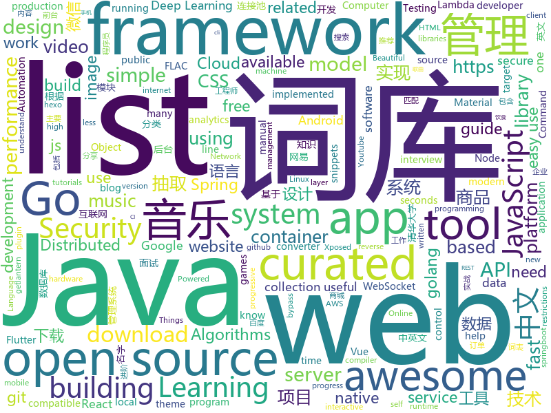

# 2019-01-27
See what the GitHub community is most excited about today.

## python
* [funNLP](https://github.com/fighting41love/funNLP)(**103 stars today**): 中英文敏感词、语言检测、中外手机/电话归属地/运营商查询、名字推断性别、手机号抽取、身份证抽取、邮箱抽取、中日文人名库、中文缩写库、拆字词典、词汇情感值、停用词、反动词表、暴恐词表、繁简体转换、英文模拟中文发音、汪峰歌词生成器、职业名称词库、同义词库、反义词库、否定词库、汽车品牌词库、汽车零件词库、连续英文切割、各种中文词向量、公司名字大全、古诗词库、IT词库、财经词库、成语词库、地名词库、历史名人词库、诗词词库、医学词库、饮食词库、法律词库、汽车词库、动物词库、中文聊天语料、中文谣言数据、百度中文问答数据集、句子相似度匹配算法集合、bert资源、文本生成&摘要相关工具、cocoNLP信息抽取工具、国内电话号码正则匹配、清华大学XLORE:中英文跨语言百科知识图谱、清华大学人工智能技术…
* [deep-learning-ocean](https://github.com/osforscience/deep-learning-ocean)(**72 stars today**): 📡All You Need to Know About Deep Learning - A kick-starter
* [models](https://github.com/tensorflow/models)(**42 stars today**): Models and examples built with TensorFlow
* [awesome-python](https://github.com/vinta/awesome-python)(**46 stars today**): A curated list of awesome Python frameworks, libraries, software and resources
* [nsfw](https://github.com/rockyzhengwu/nsfw)(**38 stars today**): Suitable for Work (NSFW) classification
* [youtube-dl](https://github.com/rg3/youtube-dl)(**42 stars today**): Command-line program to download videos from YouTube.com and other video sites
* [system-design-primer](https://github.com/donnemartin/system-design-primer)(**38 stars today**): Learn how to design large-scale systems. Prep for the system design interview. Includes Anki flashcards.
* [LASER](https://github.com/facebookresearch/LASER)(**38 stars today**): Language-Agnostic SEntence Representations
* [12306](https://github.com/testerSunshine/12306)(**35 stars today**): 12306智能刷票，订票
* [ExtremeNet](https://github.com/xingyizhou/ExtremeNet)(**35 stars today**): Bottom-up Object Detection by Grouping Extreme and Center Points
* [NeteaseCloudMusicFlac](https://github.com/YongHaoWu/NeteaseCloudMusicFlac)(**36 stars today**): 根据网易云音乐的歌单, 下载flac无损音乐到本地. Download the FLAC music from Internet according to your NeteaseCloudMusic playlist.
* [many-to-many-dijkstra](https://github.com/facebookresearch/many-to-many-dijkstra)(**36 stars today**): A predictive model developed to identify medium-voltage electrical distribution grid infrastructure using publicly available data sources.
* [home-assistant](https://github.com/home-assistant/home-assistant)(**27 stars today**): 🏡Open source home automation that puts local control and privacy first
* [Airtest](https://github.com/AirtestProject/Airtest)(**30 stars today**): UI Test Automation Framework for Games and Apps
* [Python](https://github.com/TheAlgorithms/Python)(**27 stars today**): All Algorithms implemented in Python
* [pysc2](https://github.com/deepmind/pysc2)(**28 stars today**): StarCraft II Learning Environment
* [TensorFlow-Course](https://github.com/osforscience/TensorFlow-Course)(**24 stars today**): Simple and ready-to-use tutorials for TensorFlow
* [keras](https://github.com/keras-team/keras)(**19 stars today**): Deep Learning for humans
* [shadowsocks](https://github.com/shadowsocks/shadowsocks)(**23 stars today**): 
* [music-dl](https://github.com/0xHJK/music-dl)(**24 stars today**): search and download music 从网易云音乐、QQ音乐、酷狗音乐、百度音乐、虾米音乐等搜索和下载歌曲
* [django](https://github.com/django/django)(**19 stars today**): The Web framework for perfectionists with deadlines.
* [Kashgari](https://github.com/BrikerMan/Kashgari)(**24 stars today**): Simple and powerful NLP framework, build your own state-of-art model in 5 minutes.
* [neo-ai-dlr](https://github.com/neo-ai/neo-ai-dlr)(**25 stars today**): Neo AI is a compiler and runtime for machine learning models. The compiler optimizes machine learning models for various target hardware. The runtime executes the model on the target hardware.
* [catt](https://github.com/skorokithakis/catt)(**26 stars today**): Cast All The Things allows you to send videos from many, many online sources to your Chromecast.
* [public-apis](https://github.com/toddmotto/public-apis)(****): A collective list of free APIs for use in software and web development.

## java
* [fescar](https://github.com/alibaba/fescar)(**68 stars today**): Fescar is an easy-to-use, high-performance, java based, open source distributed transaction solution.
* [JavaGuide](https://github.com/Snailclimb/JavaGuide)(**57 stars today**): 【Java学习+面试指南】 一份涵盖大部分Java程序员所需要掌握的核心知识。
* [nacos](https://github.com/alibaba/nacos)(**49 stars today**): an easy-to-use dynamic service discovery, configuration and service management platform for building cloud native applications.
* [advanced-java](https://github.com/doocs/advanced-java)(**46 stars today**): 😮互联网 Java 工程师进阶知识完全扫盲
* [spring-boot](https://github.com/spring-projects/spring-boot)(**38 stars today**): Spring Boot
* [miaosha](https://github.com/qiurunze123/miaosha)(**33 stars today**): ⛹️🐘秒杀系统设计与实现.互联网工程师进阶与分析🙋🐓
* [OpenCue](https://github.com/imageworks/OpenCue)(**29 stars today**): Render farm management software
* [EdXposed](https://github.com/solohsu/EdXposed)(**29 stars today**): Elder driver Xposed Framework
* [mall](https://github.com/macrozheng/mall)(**23 stars today**): mall项目是一套电商系统，包括前台商城系统及后台管理系统，基于SpringBoot+MyBatis实现。 前台商城系统包含首页门户、商品推荐、商品搜索、商品展示、购物车、订单流程、会员中心、客户服务、帮助中心等模块。 后台管理系统包含商品管理、订单管理、会员管理、促销管理、运营管理、内容管理、统计报表、财务管理、权限管理、设置等模块。
* [spring-framework](https://github.com/spring-projects/spring-framework)(**20 stars today**): Spring Framework
* [symphony](https://github.com/b3log/symphony)(**24 stars today**): 🎶一款用 Java 实现的现代化社区（论坛/BBS/社交网络/博客）平台。https://hacpai.com
* [tutorials](https://github.com/eugenp/tutorials)(**17 stars today**): The "REST With Spring" Course:
* [elasticsearch](https://github.com/elastic/elasticsearch)(**21 stars today**): Open Source, Distributed, RESTful Search Engine
* [interviews](https://github.com/kdn251/interviews)(**16 stars today**): Everything you need to know to get the job.
* [Unblock163MusicClient-Xposed](https://github.com/bin456789/Unblock163MusicClient-Xposed)(**16 stars today**): Unblock 163 Cloud Music Android client through Xposed.
* [incubator-dubbo](https://github.com/apache/incubator-dubbo)(**12 stars today**): Apache Dubbo (incubating) is a high-performance, java based, open source RPC framework.
* [FlyTour](https://github.com/geduo83/FlyTour)(**15 stars today**): Android MVP+组件化实战项目框架
* [NewPipe](https://github.com/TeamNewPipe/NewPipe)(**15 stars today**): A lightweight Youtube frontend for Android.
* [dynamic-datasource-starter](https://github.com/jbkzty/dynamic-datasource-starter)(**15 stars today**): springboot 动态切换数据的基本思想与实现方法
* [WxJava](https://github.com/Wechat-Group/WxJava)(**12 stars today**): WxJava （微信开发 Java SDK），支持包括微信支付、开放平台、小程序、企业微信/企业号和公众号等的后端开发
* [druid](https://github.com/alibaba/druid)(**12 stars today**): 阿里巴巴数据库事业部出品，为监控而生的数据库连接池。阿里云Data Lake Analytics(https://www.aliyun.com/product/datalakeanalytics )、DRDS、TDDL 连接池powered by Druid
* [accumulo](https://github.com/apache/accumulo)(**13 stars today**): Apache Accumulo
* [arthas](https://github.com/alibaba/arthas)(**11 stars today**): Alibaba Java Diagnostic Tool Arthas/Alibaba Java诊断利器Arthas
* [tink](https://github.com/google/tink)(**11 stars today**): Tink is a multi-language, cross-platform, open source library that provides cryptographic APIs that are secure, easy to use correctly, and hard(er) to misuse.
* [deeplearning4j](https://github.com/deeplearning4j/deeplearning4j)(**12 stars today**): Deeplearning4j, ND4J, DataVec and more - deep learning & linear algebra for Java/Scala with GPUs + Spark - From Skymind

## unknown
* [the-practical-linux-hardening-guide](https://github.com/trimstray/the-practical-linux-hardening-guide)(**669 stars today**): 🔥This guide details the planning and the tools involved in creating a secure Linux production systems - work in progress.
* [open-source-cs](https://github.com/ForrestKnight/open-source-cs)(**167 stars today**): Video discussing this curriculum:
* [queueing_theory](https://github.com/joelparkerhenderson/queueing_theory)(**132 stars today**): Queueing theory: an introduction for software development
* [CS-Notes](https://github.com/CyC2018/CS-Notes)(**101 stars today**): 📚技术面试必备基础知识
* [developer-roadmap](https://github.com/kamranahmedse/developer-roadmap)(**91 stars today**): Roadmap to becoming a web developer in 2019
* [instantnews](https://github.com/omairqazi/instantnews)(**97 stars today**): Get live news instantly📰
* [deep-learning-drizzle](https://github.com/kmario23/deep-learning-drizzle)(**92 stars today**): Drench yourself in Deep Learning & Reinforcement Learning by learning from these exciting lectures!!
* [snark-barker](https://github.com/schlae/snark-barker)(**85 stars today**): A 100% compatible replica of the famed SB 1.0 sound card
* [linux-hardening-checklist](https://github.com/trimstray/linux-hardening-checklist)(**58 stars today**): 🚀This simple checklist is to help you deploying the most important areas of the GNU/Linux production systems - work in progress.
* [quick-look-plugins](https://github.com/sindresorhus/quick-look-plugins)(**55 stars today**): List of useful Quick Look plugins for developers
* [programmer-job-blacklist](https://github.com/shengxinjing/programmer-job-blacklist)(**48 stars today**): 🙈程序员找工作黑名单，换工作和当技术合伙人需谨慎啊
* [awesome](https://github.com/sindresorhus/awesome)(**47 stars today**): 😎Curated list of awesome lists
* [the-book-of-secret-knowledge](https://github.com/trimstray/the-book-of-secret-knowledge)(**48 stars today**): ⚡️A collection of awesome lists, manuals, blogs, hacks, one-liners, cli/web tools and more. Especially for System and Network Administrators, DevOps, Pentesters or Security Researchers.
* [gitignore](https://github.com/github/gitignore)(**33 stars today**): A collection of useful .gitignore templates
* [computer-science](https://github.com/ossu/computer-science)(**43 stars today**): 🎓Path to a free self-taught education in Computer Science!
* [unmaintainable-code](https://github.com/Droogans/unmaintainable-code)(**43 stars today**): A more maintainable, easier to share version of the infamous http://mindprod.com/jgloss/unmain.html
* [You-Dont-Know-JS](https://github.com/getify/You-Dont-Know-JS)(**38 stars today**): A book series on JavaScript. @YDKJS on twitter.
* [free-programming-books](https://github.com/EbookFoundation/free-programming-books)(**39 stars today**): 📚Freely available programming books
* [GitHubDaily](https://github.com/GitHubDaily/GitHubDaily)(**39 stars today**): GitHubDaily 分享内容定期整理与分类。欢迎推荐、自荐项目，让更多人知道你的项目。
* [kubernetes-failure-stories](https://github.com/hjacobs/kubernetes-failure-stories)(**33 stars today**): Compilation of public failure/horror stories related to Kubernetes
* [project-based-learning](https://github.com/tuvtran/project-based-learning)(**30 stars today**): Curated list of project-based tutorials
* [awesome-vue](https://github.com/vuejs/awesome-vue)(**29 stars today**): 🎉A curated list of awesome things related to Vue.js
* [notes](https://github.com/hiromis/notes)(**26 stars today**): 
* [awesome-interview-questions](https://github.com/MaximAbramchuck/awesome-interview-questions)(**25 stars today**): A curated awesome list of lists of interview questions. Feel free to contribute!🎓
* [trackerslist](https://github.com/ngosang/trackerslist)(**23 stars today**): An updated list of public BitTorrent trackers

## javascript
* [hotkey](https://github.com/github/hotkey)(**223 stars today**): Global DOM element activation
* [cloudquery](https://github.com/cloudfetch/cloudquery)(**190 stars today**): Turn any website to serverless API (support SPA!)
* [css_tricks](https://github.com/QiShaoXuan/css_tricks)(**148 stars today**): Some CSS tricks,一些 CSS 常用样式
* [script-8.github.io](https://github.com/script-8/script-8.github.io)(**146 stars today**): A fantasy computer for making, sharing, and playing tiny retro-looking games.
* [zaobao](https://github.com/wubaiqing/zaobao)(**89 stars today**): 每日时报，以前端技术体系为主要分享课题。根据：文章、工具、新闻、视频几大板块作为主要分类。
* [react-fiber-implement](https://github.com/tranbathanhtung/react-fiber-implement)(**87 stars today**): re-implement react fiber
* [nuclear](https://github.com/nukeop/nuclear)(**79 stars today**): Popcorn Time for music
* [vue](https://github.com/vuejs/vue)(**77 stars today**): 🖖Vue.js is a progressive, incrementally-adoptable JavaScript framework for building UI on the web.
* [fx](https://github.com/antonmedv/fx)(**75 stars today**): Command-line tool and terminal JSON viewer🔥
* [react](https://github.com/facebook/react)(**64 stars today**): A declarative, efficient, and flexible JavaScript library for building user interfaces.
* [javascript-algorithms](https://github.com/trekhleb/javascript-algorithms)(**59 stars today**): 📝Algorithms and data structures implemented in JavaScript with explanations and links to further readings
* [create-react-app](https://github.com/facebook/create-react-app)(**47 stars today**): Set up a modern web app by running one command.
* [30-seconds-of-code](https://github.com/30-seconds/30-seconds-of-code)(**53 stars today**): Curated collection of useful JavaScript snippets that you can understand in 30 seconds or less.
* [lighthouse-ci](https://github.com/ebidel/lighthouse-ci)(**51 stars today**): Run Lighthouse in CI using Docker
* [learnGitBranching](https://github.com/pcottle/learnGitBranching)(**47 stars today**): An interactive git visualization to challenge and educate!
* [clean-code-javascript](https://github.com/ryanmcdermott/clean-code-javascript)(**45 stars today**): 🛁Clean Code concepts adapted for JavaScript
* [forge-react-app](https://github.com/ioanungurean/forge-react-app)(**43 stars today**): Start building scalable React apps using TypeScript or ECMAScript
* [anime](https://github.com/juliangarnier/anime)(**41 stars today**): JavaScript animation engine
* [next.js](https://github.com/zeit/next.js)(**38 stars today**): The React Framework
* [gatsby](https://github.com/gatsbyjs/gatsby)(**38 stars today**): Build blazing fast, modern apps and websites with React
* [nodebestpractices](https://github.com/i0natan/nodebestpractices)(**38 stars today**): The largest Node.js best practices list (January 2019)
* [hiring-without-whiteboards](https://github.com/poteto/hiring-without-whiteboards)(**37 stars today**): ⭐️Companies that don't have a broken hiring process
* [axios](https://github.com/axios/axios)(**37 stars today**): Promise based HTTP client for the browser and node.js
* [graphiql-explorer](https://github.com/OneGraph/graphiql-explorer)(**37 stars today**): Explorer plugin for GraphiQL
* [algorithm-visualizer](https://github.com/algorithm-visualizer/algorithm-visualizer)(**33 stars today**): 🎆Interactive Online Platform that Visualizes Algorithms from Code

## html
* [subspace](https://github.com/subspacecloud/subspace)(**65 stars today**): A simple WireGuard VPN server GUI
* [ionic](https://github.com/ionic-team/ionic)(**24 stars today**): Build amazing native and progressive web apps with open web technologies. One app running on everything🎉
* [zju-icicles](https://github.com/QSCTech/zju-icicles)(**19 stars today**): 浙江大学课程攻略共享计划
* [flutter-in-action](https://github.com/flutterchina/flutter-in-action)(**18 stars today**): 《Flutter实战》电子书
* [JavaScript30](https://github.com/wesbos/JavaScript30)(**11 stars today**): 30 Day Vanilla JS Challenge
* [styleguide](https://github.com/google/styleguide)(**13 stars today**): Style guides for Google-originated open-source projects
* [Spoon-Knife](https://github.com/octocat/Spoon-Knife)(****): This repo is for demonstration purposes only.
* [EnterprisePBRShadingModel](https://github.com/DassaultSystemes-Technology/EnterprisePBRShadingModel)(**13 stars today**): 
* [hexo-theme-matery](https://github.com/blinkfox/hexo-theme-matery)(**11 stars today**): A beautiful hexo blog theme with material design and responsive design.一个基于材料设计和响应式设计而成的全面、美观的Hexo主题。
* [build-your-own-mint](https://github.com/yyx990803/build-your-own-mint)(**10 stars today**): Build your own personal finance analytics using Plaid, Google Sheets and CircleCI.
* [fonts](https://github.com/google/fonts)(**10 stars today**): Font files available from Google Fonts
* [security_whitepapers](https://github.com/bl4de/security_whitepapers)(**9 stars today**): Collection of misc IT Security related whitepapers, presentations, slides - hacking, bug bounty, web application security, XSS, CSRF, SQLi
* [FPGA](https://github.com/lastweek/FPGA)(**8 stars today**): Recipe for FPGA cooking
* [30-seconds-of-css](https://github.com/30-seconds/30-seconds-of-css)(**7 stars today**): A curated collection of useful CSS snippets you can understand in 30 seconds or less.
* [EIPs](https://github.com/ethereum/EIPs)(**6 stars today**): The Ethereum Improvement Proposal repository
* [Winds](https://github.com/GetStream/Winds)(**6 stars today**): A Beautiful Open Source RSS & Podcast App Powered by Getstream.io
* [GTFOBins.github.io](https://github.com/GTFOBins/GTFOBins.github.io)(**6 stars today**): Curated list of Unix binaries that can be exploited to bypass system security restrictions
* [turndown](https://github.com/domchristie/turndown)(**6 stars today**): 🛏An HTML to Markdown converter written in JavaScript
* [awsm.css](https://github.com/igoradamenko/awsm.css)(**6 stars today**): Simple CSS library for semantic HTML markup
* [mkdocs-material](https://github.com/squidfunk/mkdocs-material)(**5 stars today**): A Material Design theme for MkDocs
* [fastText](https://github.com/facebookresearch/fastText)(**5 stars today**): Library for fast text representation and classification.
* [blog_os](https://github.com/phil-opp/blog_os)(**5 stars today**): Writing an OS in Rust
* [owasp-mstg](https://github.com/OWASP/owasp-mstg)(**5 stars today**): The Mobile Security Testing Guide (MSTG) is a comprehensive manual for mobile app security testing and reverse engineering.
* [Mozart](https://github.com/adamjgrant/Mozart)(**5 stars today**): A simple JavaScript pattern for slim, organized AJAX applications
* [homeassistant-config](https://github.com/eifinger/homeassistant-config)(**5 stars today**): My Homeassistant configuration

## go
* [websocketd](https://github.com/joewalnes/websocketd)(**786 stars today**): Turn any program that uses STDIN/STDOUT into a WebSocket server. Like inetd, but for WebSockets.
* [badger](https://github.com/dgraph-io/badger)(**57 stars today**): Fast key-value DB in Go.
* [go](https://github.com/golang/go)(**46 stars today**): The Go programming language
* [kubernetes](https://github.com/kubernetes/kubernetes)(**31 stars today**): Production-Grade Container Scheduling and Management
* [loki](https://github.com/grafana/loki)(**34 stars today**): Like Prometheus, but for logs.
* [BaiduPCS-Go](https://github.com/iikira/BaiduPCS-Go)(**31 stars today**): 百度网盘客户端 - Go语言编写
* [hugo](https://github.com/gohugoio/hugo)(**30 stars today**): The world’s fastest framework for building websites.
* [awesome-go](https://github.com/avelino/awesome-go)(**29 stars today**): A curated list of awesome Go frameworks, libraries and software
* [dgraph](https://github.com/dgraph-io/dgraph)(**29 stars today**): Fast, Distributed Graph DB
* [gin](https://github.com/gin-gonic/gin)(**27 stars today**): Gin is a HTTP web framework written in Go (Golang). It features a Martini-like API with much better performance -- up to 40 times faster. If you need smashing performance, get yourself some Gin.
* [aws-lambda-container-image-converter](https://github.com/awslabs/aws-lambda-container-image-converter)(**27 stars today**): The AWS Lambda container image converter tool (img2lambda) repackages container images (such as Docker images) into AWS Lambda layers, and publishes them as new layer versions.
* [gitea](https://github.com/go-gitea/gitea)(**24 stars today**): Git with a cup of tea, painless self-hosted git service
* [frp](https://github.com/fatedier/frp)(**21 stars today**): A fast reverse proxy to help you expose a local server behind a NAT or firewall to the internet.
* [go-flutter-desktop-embedder](https://github.com/Drakirus/go-flutter-desktop-embedder)(**22 stars today**): A Go (golang) Custom Flutter Engine Embedder for desktop
* [iv](https://github.com/ktye/iv)(**21 stars today**): APL interpreter and stream processor
* [demoinfocs-golang](https://github.com/markus-wa/demoinfocs-golang)(**21 stars today**): High performance CS:GO demo parser for Go
* [minio](https://github.com/minio/minio)(**20 stars today**): Minio is an open source object storage server compatible with Amazon S3 APIs
* [lantern](https://github.com/getlantern/lantern)(**17 stars today**): 🔴蓝灯最新版本下载 https://github.com/getlantern/download🔴Lantern Latest Download https://github.com/getlantern/download🔴
* [build-web-application-with-golang](https://github.com/astaxie/build-web-application-with-golang)(**16 stars today**): A golang ebook intro how to build a web with golang
* [mkcert](https://github.com/FiloSottile/mkcert)(**19 stars today**): A simple zero-config tool to make locally trusted development certificates with any names you'd like.
* [libpod](https://github.com/containers/libpod)(**18 stars today**): libpod is a library used to create container pods.
* [coredns](https://github.com/coredns/coredns)(**17 stars today**): CoreDNS is a DNS server that chains plugins
* [traefik](https://github.com/containous/traefik)(**16 stars today**): The Cloud Native Edge Router
* [v2ray-core](https://github.com/v2ray/v2ray-core)(**16 stars today**): A platform for building proxies to bypass network restrictions.
* [istio](https://github.com/istio/istio)(**15 stars today**): Connect, secure, control, and observe services.

## WordCloud

