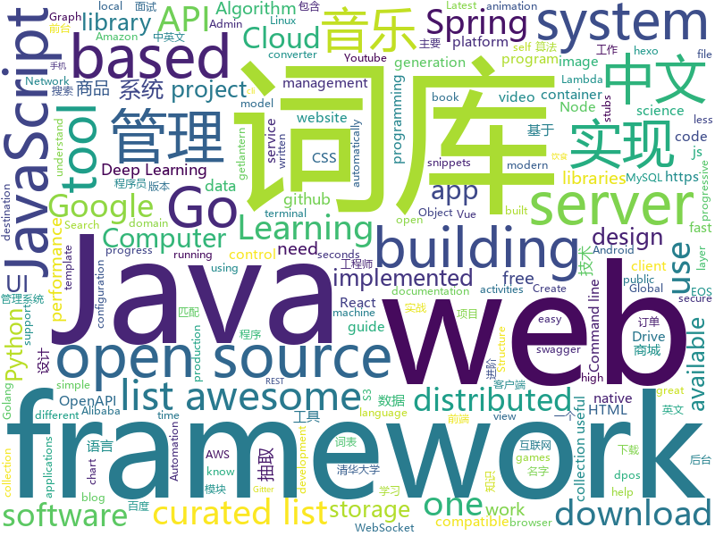

# 2019-01-28
See what the GitHub community is most excited about today.

## python
* [CopyTranslator](https://github.com/elliottzheng/CopyTranslator)(**109 stars today**): Foreign language reading and translation assistant based on copy and translate.(Latest: v0.0.7-Kylin-RC1)
* [funNLP](https://github.com/fighting41love/funNLP)(**108 stars today**): 中英文敏感词、语言检测、中外手机/电话归属地/运营商查询、名字推断性别、手机号抽取、身份证抽取、邮箱抽取、中日文人名库、中文缩写库、拆字词典、词汇情感值、停用词、反动词表、暴恐词表、繁简体转换、英文模拟中文发音、汪峰歌词生成器、职业名称词库、同义词库、反义词库、否定词库、汽车品牌词库、汽车零件词库、连续英文切割、各种中文词向量、公司名字大全、古诗词库、IT词库、财经词库、成语词库、地名词库、历史名人词库、诗词词库、医学词库、饮食词库、法律词库、汽车词库、动物词库、中文聊天语料、中文谣言数据、百度中文问答数据集、句子相似度匹配算法集合、bert资源、文本生成&摘要相关工具、cocoNLP信息抽取工具、国内电话号码正则匹配、清华大学XLORE:中英文跨语言百科知识图谱、清华大学人工智能技术…
* [awesome-python](https://github.com/vinta/awesome-python)(**65 stars today**): A curated list of awesome Python frameworks, libraries, software and resources
* [system-design-primer](https://github.com/donnemartin/system-design-primer)(**60 stars today**): Learn how to design large-scale systems. Prep for the system design interview. Includes Anki flashcards.
* [youtube-dl](https://github.com/rg3/youtube-dl)(**43 stars today**): Command-line program to download videos from YouTube.com and other video sites
* [keras](https://github.com/keras-team/keras)(**36 stars today**): Deep Learning for humans
* [Python](https://github.com/TheAlgorithms/Python)(**39 stars today**): All Algorithms implemented in Python
* [models](https://github.com/tensorflow/models)(**32 stars today**): Models and examples built with TensorFlow
* [many-to-many-dijkstra](https://github.com/facebookresearch/many-to-many-dijkstra)(**39 stars today**): A predictive model developed to identify medium-voltage electrical distribution grid infrastructure using publicly available data sources.
* [deep-learning-ocean](https://github.com/osforscience/deep-learning-ocean)(**36 stars today**): 📡All You Need to Know About Deep Learning - A kick-starter
* [telegrad](https://github.com/eyalzk/telegrad)(**36 stars today**): A Telegram bot to monitor and control deep learning experiments
* [geoopt](https://github.com/ferrine/geoopt)(**38 stars today**): Riemannian Adaptive Optimization Methods with pytorch optim
* [LASER](https://github.com/facebookresearch/LASER)(**36 stars today**): Language-Agnostic SEntence Representations
* [awesome-python-applications](https://github.com/mahmoud/awesome-python-applications)(**33 stars today**): 💿Free software that works great, and also happens to be open-source Python.
* [nsfw](https://github.com/rockyzhengwu/nsfw)(**30 stars today**): Suitable for Work (NSFW) classification
* [scikit-learn](https://github.com/scikit-learn/scikit-learn)(**29 stars today**): scikit-learn: machine learning in Python
* [music-dl](https://github.com/0xHJK/music-dl)(**27 stars today**): search and download music 从网易云音乐、QQ音乐、酷狗音乐、百度音乐、虾米音乐等搜索和下载歌曲
* [ExtremeNet](https://github.com/xingyizhou/ExtremeNet)(**27 stars today**): Bottom-up Object Detection by Grouping Extreme and Center Points
* [flask](https://github.com/pallets/flask)(**24 stars today**): The Python micro framework for building web applications.
* [public-apis](https://github.com/toddmotto/public-apis)(**26 stars today**): A collective list of free APIs for use in software and web development.
* [django](https://github.com/django/django)(**22 stars today**): The Web framework for perfectionists with deadlines.
* [Airtest](https://github.com/AirtestProject/Airtest)(**25 stars today**): UI Test Automation Framework for Games and Apps
* [PrivExchange](https://github.com/dirkjanm/PrivExchange)(**23 stars today**): Exchange your privileges for Domain Admin privs by abusing Exchange
* [home-assistant](https://github.com/home-assistant/home-assistant)(**21 stars today**): 🏡Open source home automation that puts local control and privacy first
* [TensorFlow-Course](https://github.com/osforscience/TensorFlow-Course)(**20 stars today**): Simple and ready-to-use tutorials for TensorFlow

## java
* [fescar](https://github.com/alibaba/fescar)(**77 stars today**): Fescar is an easy-to-use, high-performance, java based, open source distributed transaction solution.
* [JavaGuide](https://github.com/Snailclimb/JavaGuide)(**52 stars today**): 【Java学习+面试指南】 一份涵盖大部分Java程序员所需要掌握的核心知识。
* [advanced-java](https://github.com/doocs/advanced-java)(**47 stars today**): 😮互联网 Java 工程师进阶知识完全扫盲
* [nacos](https://github.com/alibaba/nacos)(**38 stars today**): an easy-to-use dynamic service discovery, configuration and service management platform for building cloud native applications.
* [spring-boot](https://github.com/spring-projects/spring-boot)(**22 stars today**): Spring Boot
* [interviews](https://github.com/kdn251/interviews)(**25 stars today**): Everything you need to know to get the job.
* [mall](https://github.com/macrozheng/mall)(**23 stars today**): mall项目是一套电商系统，包括前台商城系统及后台管理系统，基于SpringBoot+MyBatis实现。 前台商城系统包含首页门户、商品推荐、商品搜索、商品展示、购物车、订单流程、会员中心、客户服务、帮助中心等模块。 后台管理系统包含商品管理、订单管理、会员管理、促销管理、运营管理、内容管理、统计报表、财务管理、权限管理、设置等模块。
* [OpenCue](https://github.com/imageworks/OpenCue)(**24 stars today**): Render farm management software
* [EdXposed](https://github.com/solohsu/EdXposed)(**25 stars today**): Elder driver Xposed Framework
* [Java](https://github.com/TheAlgorithms/Java)(**20 stars today**): All Algorithms implemented in Java
* [guava](https://github.com/google/guava)(**19 stars today**): Google core libraries for Java
* [symphony](https://github.com/b3log/symphony)(**19 stars today**): 🎶一款用 Java 实现的现代化社区（论坛/BBS/社交网络/博客）平台。https://hacpai.com
* [FlyTour](https://github.com/geduo83/FlyTour)(**18 stars today**): Android MVP+组件化实战项目框架
* [miaosha](https://github.com/qiurunze123/miaosha)(**18 stars today**): ⛹️🐘秒杀系统设计与实现.互联网工程师进阶与分析🙋🐓
* [elasticsearch](https://github.com/elastic/elasticsearch)(**16 stars today**): Open Source, Distributed, RESTful Search Engine
* [incubator-dubbo](https://github.com/apache/incubator-dubbo)(**14 stars today**): Apache Dubbo (incubating) is a high-performance, java based, open source RPC framework.
* [arthas](https://github.com/alibaba/arthas)(**16 stars today**): Alibaba Java Diagnostic Tool Arthas/Alibaba Java诊断利器Arthas
* [tutorials](https://github.com/eugenp/tutorials)(**8 stars today**): The "REST With Spring" Course:
* [spring-framework](https://github.com/spring-projects/spring-framework)(**13 stars today**): Spring Framework
* [dynamic-datasource-starter](https://github.com/jbkzty/dynamic-datasource-starter)(**15 stars today**): springboot 动态切换数据的基本思想与实现方法
* [RxJava](https://github.com/ReactiveX/RxJava)(**13 stars today**): RxJava – Reactive Extensions for the JVM – a library for composing asynchronous and event-based programs using observable sequences for the Java VM.
* [accumulo](https://github.com/apache/accumulo)(**13 stars today**): Apache Accumulo
* [litemall](https://github.com/linlinjava/litemall)(**10 stars today**): 又一个小商城。litemall = Spring Boot后端 + Vue管理员前端 + 微信小程序用户前端
* [NewPipe](https://github.com/TeamNewPipe/NewPipe)(**12 stars today**): A lightweight Youtube frontend for Android.
* [MPAndroidChart](https://github.com/PhilJay/MPAndroidChart)(**11 stars today**): A powerful🚀Android chart view / graph view library, supporting line- bar- pie- radar- bubble- and candlestick charts as well as scaling, dragging and animations.

## unknown
* [the-practical-linux-hardening-guide](https://github.com/trimstray/the-practical-linux-hardening-guide)(**400 stars today**): 🔥This guide details the planning and the tools involved in creating a secure Linux production systems - work in progress.
* [open-source-cs](https://github.com/ForrestKnight/open-source-cs)(**321 stars today**): Video discussing this curriculum:
* [developer-roadmap](https://github.com/kamranahmedse/developer-roadmap)(**195 stars today**): Roadmap to becoming a web developer in 2019
* [awesome-mobile-web-development](https://github.com/myshov/awesome-mobile-web-development)(**184 stars today**): All that you need to create a great mobile web experience
* [ml-feynman-experience](https://github.com/leandromineti/ml-feynman-experience)(**135 stars today**): A collection of statistical models implemented with Python on Google Colab
* [HyperDL-Tutorial](https://github.com/zeusees/HyperDL-Tutorial)(**106 stars today**): 深度学习教程整理 | 干货
* [CS-Notes](https://github.com/CyC2018/CS-Notes)(**102 stars today**): 📚技术面试必备基础知识
* [deep-learning-drizzle](https://github.com/kmario23/deep-learning-drizzle)(**96 stars today**): Drench yourself in Deep Learning, Reinforcement Learning, Machine Learning, Computer Vision, and NLP by learning from these exciting lectures!!
* [queueing_theory](https://github.com/joelparkerhenderson/queueing_theory)(**85 stars today**): Queueing theory: an introduction for software development
* [computer-science](https://github.com/ossu/computer-science)(**64 stars today**): 🎓Path to a free self-taught education in Computer Science!
* [gitignore](https://github.com/github/gitignore)(**47 stars today**): A collection of useful .gitignore templates
* [You-Dont-Know-JS](https://github.com/getify/You-Dont-Know-JS)(**55 stars today**): A book series on JavaScript. @YDKJS on twitter.
* [awesome](https://github.com/sindresorhus/awesome)(**57 stars today**): 😎Curated list of awesome lists
* [the-book-of-secret-knowledge](https://github.com/trimstray/the-book-of-secret-knowledge)(**50 stars today**): ⚡️A collection of awesome lists, manuals, blogs, hacks, one-liners, cli/web tools and more. Especially for System and Network Administrators, DevOps, Pentesters or Security Researchers.
* [programmer-job-blacklist](https://github.com/shengxinjing/programmer-job-blacklist)(**50 stars today**): 🙈程序员找工作黑名单，换工作和当技术合伙人需谨慎啊
* [snark-barker](https://github.com/schlae/snark-barker)(**50 stars today**): A 100% compatible replica of the famed SB 1.0 sound card
* [kubernetes-failure-stories](https://github.com/hjacobs/kubernetes-failure-stories)(**49 stars today**): Compilation of public failure/horror stories related to Kubernetes
* [free-programming-books](https://github.com/EbookFoundation/free-programming-books)(**41 stars today**): 📚Freely available programming books
* [linux-hardening-checklist](https://github.com/trimstray/linux-hardening-checklist)(**40 stars today**): 🚀This simple checklist is to help you deploying the most important areas of the GNU/Linux production systems - work in progress.
* [project-based-learning](https://github.com/tuvtran/project-based-learning)(**36 stars today**): Curated list of project-based tutorials
* [quick-look-plugins](https://github.com/sindresorhus/quick-look-plugins)(**37 stars today**): List of useful Quick Look plugins for developers
* [coding-interview-university](https://github.com/jwasham/coding-interview-university)(**28 stars today**): A complete computer science study plan to become a software engineer.
* [MathsDL-spring19](https://github.com/joanbruna/MathsDL-spring19)(**27 stars today**): Mathematics of Deep Learning, Courant Insititute, Spring 19
* [awesome-public-datasets](https://github.com/awesomedata/awesome-public-datasets)(**26 stars today**): A topic-centric list of HQ open datasets in public domains. PR ☛☛☛
* [awesome-for-beginners](https://github.com/MunGell/awesome-for-beginners)(**26 stars today**): A list of awesome beginners-friendly projects.

## javascript
* [hotkey](https://github.com/github/hotkey)(**134 stars today**): Global DOM element activation
* [cloudquery](https://github.com/cloudfetch/cloudquery)(**119 stars today**): Turn any website to serverless API (support SPA!)
* [fx](https://github.com/antonmedv/fx)(**116 stars today**): Command-line tool and terminal JSON viewer🔥
* [react-fiber-implement](https://github.com/tranbathanhtung/react-fiber-implement)(**118 stars today**): re-implement react fiber
* [script-8.github.io](https://github.com/script-8/script-8.github.io)(**80 stars today**): A fantasy computer for making, sharing, and playing tiny retro-looking games.
* [vue](https://github.com/vuejs/vue)(**73 stars today**): 🖖Vue.js is a progressive, incrementally-adoptable JavaScript framework for building UI on the web.
* [react](https://github.com/facebook/react)(**65 stars today**): A declarative, efficient, and flexible JavaScript library for building user interfaces.
* [ink](https://github.com/vadimdemedes/ink)(**74 stars today**): 🌈React for interactive command-line apps
* [nuclear](https://github.com/nukeop/nuclear)(**63 stars today**): Popcorn Time for music
* [30-seconds-of-code](https://github.com/30-seconds/30-seconds-of-code)(**45 stars today**): Curated collection of useful JavaScript snippets that you can understand in 30 seconds or less.
* [javascript-algorithms](https://github.com/trekhleb/javascript-algorithms)(**45 stars today**): 📝Algorithms and data structures implemented in JavaScript with explanations and links to further readings
* [css_tricks](https://github.com/QiShaoXuan/css_tricks)(**49 stars today**): Some CSS tricks,一些 CSS 常用样式
* [create-react-app](https://github.com/facebook/create-react-app)(**41 stars today**): Set up a modern web app by running one command.
* [edex-ui](https://github.com/GitSquared/edex-ui)(**42 stars today**): A cross-platform, customizable science fiction terminal emulator with advanced monitoring & touchscreen support.
* [Gitter](https://github.com/huangjianke/Gitter)(**41 stars today**): Gitter for GitHub - 可能是目前颜值最高的GitHub小程序客户端
* [immer](https://github.com/mweststrate/immer)(**41 stars today**): Create the next immutable state by mutating the current one
* [zaobao](https://github.com/wubaiqing/zaobao)(**40 stars today**): 每日时报，以前端技术体系为主要分享课题。根据：文章、工具、新闻、视频几大板块作为主要分类。
* [next.js](https://github.com/zeit/next.js)(**36 stars today**): The React Framework
* [axios](https://github.com/axios/axios)(**37 stars today**): Promise based HTTP client for the browser and node.js
* [nodebestpractices](https://github.com/i0natan/nodebestpractices)(**37 stars today**): The largest Node.js best practices list (January 2019)
* [anime](https://github.com/juliangarnier/anime)(**38 stars today**): JavaScript animation engine
* [javascript](https://github.com/airbnb/javascript)(**35 stars today**): JavaScript Style Guide
* [gatsby](https://github.com/gatsbyjs/gatsby)(**31 stars today**): Build blazing fast, modern apps and websites with React
* [d3](https://github.com/d3/d3)(**31 stars today**): Bring data to life with SVG, Canvas and HTML.📊📈🎉
* [clean-code-javascript](https://github.com/ryanmcdermott/clean-code-javascript)(**32 stars today**): 🛁Clean Code concepts adapted for JavaScript

## html
* [flexsearch](https://github.com/nextapps-de/flexsearch)(**52 stars today**): Next-Generation full text search library for Browser and Node.js
* [ionic](https://github.com/ionic-team/ionic)(**25 stars today**): Build amazing native and progressive web apps with open web technologies. One app running on everything🎉
* [sleek-dashboard](https://github.com/tafcoder/sleek-dashboard)(**27 stars today**): Sleek Dashboard - Free Bootstrap 4 Admin Template and UI Kit
* [subspace](https://github.com/subspacecloud/subspace)(**23 stars today**): A simple WireGuard VPN server GUI
* [flutter-in-action](https://github.com/flutterchina/flutter-in-action)(**14 stars today**): 《Flutter实战》电子书
* [Spoon-Knife](https://github.com/octocat/Spoon-Knife)(****): This repo is for demonstration purposes only.
* [30-seconds-of-css](https://github.com/30-seconds/30-seconds-of-css)(**11 stars today**): A curated collection of useful CSS snippets you can understand in 30 seconds or less.
* [awesome-competitive-programming](https://github.com/lnishan/awesome-competitive-programming)(**10 stars today**): 💎A curated list of awesome Competitive Programming, Algorithm and Data Structure resources
* [zju-icicles](https://github.com/QSCTech/zju-icicles)(**9 stars today**): 浙江大学课程攻略共享计划
* [now-github-starter](https://github.com/zeit/now-github-starter)(****): Starter project to demonstrate a project whose pull requests get automatically deployed
* [wordsandbuttons](https://github.com/akalenuk/wordsandbuttons)(**8 stars today**): Exploring writing and interactivity
* [JavaScript30](https://github.com/wesbos/JavaScript30)(**5 stars today**): 30 Day Vanilla JS Challenge
* [styleguide](https://github.com/google/styleguide)(**6 stars today**): Style guides for Google-originated open-source projects
* [fonts](https://github.com/google/fonts)(**7 stars today**): Font files available from Google Fonts
* [portainer](https://github.com/portainer/portainer)(**7 stars today**): Simple management UI for Docker
* [hexo-theme-matery](https://github.com/blinkfox/hexo-theme-matery)(**6 stars today**): A beautiful hexo blog theme with material design and responsive design.一个基于材料设计和响应式设计而成的全面、美观的Hexo主题。
* [wysiwyg-editor](https://github.com/froala/wysiwyg-editor)(**6 stars today**): A beautifully designed WYSIWYG HTML Editor based on HTML5.
* [openapi-generator](https://github.com/OpenAPITools/openapi-generator)(**5 stars today**): OpenAPI Generator allows generation of API client libraries (SDK generation), server stubs, documentation and configuration automatically given an OpenAPI Spec (v2, v3)
* [swagger-codegen](https://github.com/swagger-api/swagger-codegen)(**5 stars today**): swagger-codegen contains a template-driven engine to generate documentation, API clients and server stubs in different languages by parsing your OpenAPI / Swagger definition.
* [Iosevka](https://github.com/be5invis/Iosevka)(**5 stars today**): Slender typeface for code, from code.
* [turndown](https://github.com/domchristie/turndown)(**5 stars today**): 🛏An HTML to Markdown converter written in JavaScript
* [privacytools.io](https://github.com/privacytoolsIO/privacytools.io)(**5 stars today**): 🛡️encryption against global mass surveillance
* [Keka](https://github.com/aonez/Keka)(**5 stars today**): The macOS file archiver
* [first-pr](https://github.com/github-book/first-pr)(****): 
* [travel-guide](https://github.com/zero-to-mastery/travel-guide)(****): "A travel guide to suggest activities you can do once you arrive to a certain destination. Or you can just browse destinations and check out the different available activities."

## go
* [websocketd](https://github.com/joewalnes/websocketd)(**442 stars today**): Turn any program that uses STDIN/STDOUT into a WebSocket server. Like inetd, but for WebSockets.
* [go](https://github.com/golang/go)(**43 stars today**): The Go programming language
* [kubernetes](https://github.com/kubernetes/kubernetes)(**33 stars today**): Production-Grade Container Scheduling and Management
* [loki](https://github.com/grafana/loki)(**31 stars today**): Like Prometheus, but for logs.
* [frp](https://github.com/fatedier/frp)(**29 stars today**): A fast reverse proxy to help you expose a local server behind a NAT or firewall to the internet.
* [aws-lambda-container-image-converter](https://github.com/awslabs/aws-lambda-container-image-converter)(**31 stars today**): The AWS Lambda container image converter tool (img2lambda) repackages container images (such as Docker images) into AWS Lambda layers, and publishes them as new layer versions.
* [BaiduPCS-Go](https://github.com/iikira/BaiduPCS-Go)(**24 stars today**): 百度网盘客户端 - Go语言编写
* [traefik](https://github.com/containous/traefik)(**24 stars today**): The Cloud Native Edge Router
* [awesome-go](https://github.com/avelino/awesome-go)(**24 stars today**): A curated list of awesome Go frameworks, libraries and software
* [badger](https://github.com/dgraph-io/badger)(**24 stars today**): Fast key-value DB in Go.
* [istio](https://github.com/istio/istio)(**21 stars today**): Connect, secure, control, and observe services.
* [minio](https://github.com/minio/minio)(**19 stars today**): Minio is an open source object storage server compatible with Amazon S3 APIs
* [dgraph](https://github.com/dgraph-io/dgraph)(**19 stars today**): Fast, Distributed Graph DB
* [hugo](https://github.com/gohugoio/hugo)(**18 stars today**): The world’s fastest framework for building websites.
* [rclone](https://github.com/ncw/rclone)(**18 stars today**): "rsync for cloud storage" - Google Drive, Amazon Drive, S3, Dropbox, Backblaze B2, One Drive, Swift, Hubic, Cloudfiles, Google Cloud Storage, Yandex Files
* [chisel](https://github.com/jpillora/chisel)(**18 stars today**): A fast TCP tunnel over HTTP
* [kingbus](https://github.com/flike/kingbus)(**18 stars today**): A distributed MySQL binlog storage system built on Raft
* [lantern](https://github.com/getlantern/lantern)(**15 stars today**): 🔴蓝灯最新版本下载 https://github.com/getlantern/download🔴Lantern Latest Download https://github.com/getlantern/download🔴
* [v2ray-core](https://github.com/v2ray/v2ray-core)(**15 stars today**): A platform for building proxies to bypass network restrictions.
* [golang-Eos-dpos-Ethereum](https://github.com/yinchengtsinghua/golang-Eos-dpos-Ethereum)(**15 stars today**): 基于以太坊实现EOS的dpos共识算法，实现go版本EOS的dpos公链
* [build-web-application-with-golang](https://github.com/astaxie/build-web-application-with-golang)(**13 stars today**): A golang ebook intro how to build a web with golang
* [gitea](https://github.com/go-gitea/gitea)(**15 stars today**): Git with a cup of tea, painless self-hosted git service
* [gin](https://github.com/gin-gonic/gin)(**15 stars today**): Gin is a HTTP web framework written in Go (Golang). It features a Martini-like API with much better performance -- up to 40 times faster. If you need smashing performance, get yourself some Gin.
* [coredns](https://github.com/coredns/coredns)(**14 stars today**): CoreDNS is a DNS server that chains plugins
* [tidb](https://github.com/pingcap/tidb)(**12 stars today**): TiDB is a distributed HTAP database compatible with the MySQL protocol

## WordCloud

