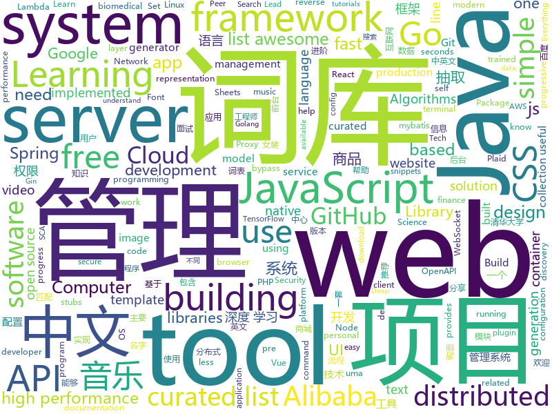

# 2019-01-29
See what the GitHub community is most excited about today.

## python
* [funNLP](https://github.com/fighting41love/funNLP)(**315 stars today**): 中英文敏感词、语言检测、中外手机/电话归属地/运营商查询、名字推断性别、手机号抽取、身份证抽取、邮箱抽取、中日文人名库、中文缩写库、拆字词典、词汇情感值、停用词、反动词表、暴恐词表、繁简体转换、英文模拟中文发音、汪峰歌词生成器、职业名称词库、同义词库、反义词库、否定词库、汽车品牌词库、汽车零件词库、连续英文切割、各种中文词向量、公司名字大全、古诗词库、IT词库、财经词库、成语词库、地名词库、历史名人词库、诗词词库、医学词库、饮食词库、法律词库、汽车词库、动物词库、中文聊天语料、中文谣言数据、百度中文问答数据集、句子相似度匹配算法集合、bert资源、文本生成&摘要相关工具、cocoNLP信息抽取工具、国内电话号码正则匹配、清华大学XLORE:中英文跨语言百科知识图谱、清华大学人工智能技术…
* [yodaos](https://github.com/yodaos-project/yodaos)(**162 stars today**): AI OS for Web Community
* [rtv](https://github.com/michael-lazar/rtv)(**137 stars today**): Browse Reddit from your terminal
* [awesome-python](https://github.com/vinta/awesome-python)(**69 stars today**): A curated list of awesome Python frameworks, libraries, software and resources
* [HelloGitHub](https://github.com/521xueweihan/HelloGitHub)(**73 stars today**): 分享 GitHub 上有趣、入门级的开源项目，帮你找到编程的乐趣。欢迎推荐、自荐项目，让更多人知道你的项目⭐️
* [click-web](https://github.com/fredrik-corneliusson/click-web)(**73 stars today**): Serve click scripts over the web
* [LASER](https://github.com/facebookresearch/LASER)(**69 stars today**): Language-Agnostic SEntence Representations
* [CopyTranslator](https://github.com/elliottzheng/CopyTranslator)(**66 stars today**): Foreign language reading and translation assistant based on copy and translate.(Latest: v0.0.7-Kylin-RC1)
* [models](https://github.com/tensorflow/models)(**49 stars today**): Models and examples built with TensorFlow
* [12306](https://github.com/testerSunshine/12306)(**56 stars today**): 12306智能刷票，订票
* [system-design-primer](https://github.com/donnemartin/system-design-primer)(**59 stars today**): Learn how to design large-scale systems. Prep for the system design interview. Includes Anki flashcards.
* [ExtremeNet](https://github.com/xingyizhou/ExtremeNet)(**57 stars today**): Bottom-up Object Detection by Grouping Extreme and Center Points
* [youtube-dl](https://github.com/rg3/youtube-dl)(**55 stars today**): Command-line program to download videos from YouTube.com and other video sites
* [music-dl](https://github.com/0xHJK/music-dl)(**54 stars today**): search and download music 从网易云音乐、QQ音乐、酷狗音乐、百度音乐、虾米音乐等搜索和下载歌曲
* [TensorFlow-Course](https://github.com/osforscience/TensorFlow-Course)(**54 stars today**): Simple and ready-to-use tutorials for TensorFlow
* [py12306](https://github.com/pjialin/py12306)(**48 stars today**): 🚂12306 购票助手，支持分布式，多账号，多任务购票以及 Web 页面管理
* [deep-learning-ocean](https://github.com/osforscience/deep-learning-ocean)(**51 stars today**): 📡All You Need to Know About Deep Learning - A kick-starter
* [biobert](https://github.com/dmis-lab/biobert)(**46 stars today**): BioBERT: pre-trained biomedical language representation model for biomedical text mining
* [Python](https://github.com/TheAlgorithms/Python)(**44 stars today**): All Algorithms implemented in Python
* [public-apis](https://github.com/toddmotto/public-apis)(**45 stars today**): A collective list of free APIs for use in software and web development.
* [face.evoLVe.PyTorch](https://github.com/ZhaoJ9014/face.evoLVe.PyTorch)(**47 stars today**): 🔥🔥High-Performance Face Recognition Library on PyTorch🔥🔥
* [d2l-zh](https://github.com/d2l-ai/d2l-zh)(**42 stars today**): 《动手学深度学习》，英文版即伯克利深度学习（STAT 157，2019春）教材。面向中文读者、能运行、可讨论。
* [bert](https://github.com/google-research/bert)(**42 stars today**): TensorFlow code and pre-trained models for BERT
* [keras](https://github.com/keras-team/keras)(**40 stars today**): Deep Learning for humans
* [cyberdisc-bot](https://github.com/CyberDiscovery/cyberdisc-bot)(**44 stars today**): The bot for the Cyber Discovery Community Discord Server!

## java
* [flink](https://github.com/apache/flink)(**491 stars today**): Apache Flink
* [JavaGuide](https://github.com/Snailclimb/JavaGuide)(**120 stars today**): 【Java学习+面试指南】 一份涵盖大部分Java程序员所需要掌握的核心知识。
* [advanced-java](https://github.com/doocs/advanced-java)(**104 stars today**): 😮互联网 Java 工程师进阶知识完全扫盲
* [fescar](https://github.com/alibaba/fescar)(**92 stars today**): Fescar is an easy-to-use, high-performance, java based, open source distributed transaction solution.
* [nacos](https://github.com/alibaba/nacos)(**68 stars today**): an easy-to-use dynamic service discovery, configuration and service management platform for building cloud native applications.
* [hope-plus](https://github.com/java-aodeng/hope-plus)(**57 stars today**): Hope-plus是一款nice的权限管理系统。基于Springboot2开发，整合使用mybatis+shiro+redis+thymeleaf+maven等实用技术。🏷
* [miaosha](https://github.com/qiurunze123/miaosha)(**53 stars today**): ⛹️🐘秒杀系统设计与实现.互联网工程师进阶与分析🙋🐓
* [spring-boot](https://github.com/spring-projects/spring-boot)(**41 stars today**): Spring Boot
* [mall](https://github.com/macrozheng/mall)(**40 stars today**): mall项目是一套电商系统，包括前台商城系统及后台管理系统，基于SpringBoot+MyBatis实现。 前台商城系统包含首页门户、商品推荐、商品搜索、商品展示、购物车、订单流程、会员中心、客户服务、帮助中心等模块。 后台管理系统包含商品管理、订单管理、会员管理、促销管理、运营管理、内容管理、统计报表、财务管理、权限管理、设置等模块。
* [arthas](https://github.com/alibaba/arthas)(**44 stars today**): Alibaba Java Diagnostic Tool Arthas/Alibaba Java诊断利器Arthas
* [tutorials](https://github.com/eugenp/tutorials)(**18 stars today**): The "REST With Spring" Course:
* [interviews](https://github.com/kdn251/interviews)(**36 stars today**): Everything you need to know to get the job.
* [sca-best-practice](https://github.com/alibaba/sca-best-practice)(**39 stars today**): 本项目是 SCA(Spring Cloud Alibaba) 的最佳实践项目，致力于帮助用户更加快速、正确的使用SCA。
* [spring-cloud-alibaba](https://github.com/spring-cloud-incubator/spring-cloud-alibaba)(**33 stars today**): Spring Cloud Alibaba provides a one-stop solution for application development for the distributed solutions of Alibaba middleware.
* [hutool](https://github.com/looly/hutool)(**34 stars today**): A set of tools that keep Java sweet.
* [elasticsearch](https://github.com/elastic/elasticsearch)(**31 stars today**): Open Source, Distributed, RESTful Search Engine
* [guava](https://github.com/google/guava)(**29 stars today**): Google core libraries for Java
* [spring-framework](https://github.com/spring-projects/spring-framework)(**25 stars today**): Spring Framework
* [Java](https://github.com/TheAlgorithms/Java)(**28 stars today**): All Algorithms implemented in Java
* [incubator-dubbo](https://github.com/apache/incubator-dubbo)(**23 stars today**): Apache Dubbo (incubating) is a high-performance, java based, open source RPC framework.
* [apollo](https://github.com/ctripcorp/apollo)(**24 stars today**): Apollo（阿波罗）是携程框架部门研发的分布式配置中心，能够集中化管理应用不同环境、不同集群的配置，配置修改后能够实时推送到应用端，并且具备规范的权限、流程治理等特性，适用于微服务配置管理场景。
* [OpenCue](https://github.com/imageworks/OpenCue)(**25 stars today**): Render farm management software
* [XUI](https://github.com/xuexiangjys/XUI)(**24 stars today**): 💍一个简洁而优雅的Android原生UI框架，解放你的双手！
* [thisisfine-plugin](https://github.com/llbit/thisisfine-plugin)(**25 stars today**): This Is Fine meme plugin for Jenkins.
* [BasePopup](https://github.com/razerdp/BasePopup)(**23 stars today**): 亲，还在为PopupWindow烦恼吗？不如试试BasePopup，你会爱上他的~

## unknown
* [the-practical-linux-hardening-guide](https://github.com/trimstray/the-practical-linux-hardening-guide)(**621 stars today**): 🔥This guide details the planning and the tools involved in creating a secure Linux production systems - work in progress.
* [open-source-cs](https://github.com/ForrestKnight/open-source-cs)(**343 stars today**): Video discussing this curriculum:
* [awesome-mobile-web-development](https://github.com/myshov/awesome-mobile-web-development)(**246 stars today**): All that you need to create a great mobile web experience
* [developer-roadmap](https://github.com/kamranahmedse/developer-roadmap)(**227 stars today**): Roadmap to becoming a web developer in 2019
* [HyperDL-Tutorial](https://github.com/zeusees/HyperDL-Tutorial)(**170 stars today**): 深度学习教程整理 | 干货
* [CS-Notes](https://github.com/CyC2018/CS-Notes)(**125 stars today**): 📚技术面试必备基础知识
* [the-book-of-secret-knowledge](https://github.com/trimstray/the-book-of-secret-knowledge)(**94 stars today**): ⚡️A collection of awesome lists, manuals, blogs, hacks, one-liners, cli/web tools and more. Especially for System and Network Administrators, DevOps, Pentesters or Security Researchers.
* [Girl-Dress-](https://github.com/greenaway07/Girl-Dress-)(**93 stars today**): 看到女装的项目的issue建议妹子建一个男装的项目，但是考虑到github的女性用户 数量貌似并不能达到女装的效果2333总之先建一个。
* [awesome](https://github.com/sindresorhus/awesome)(**82 stars today**): 😎Curated list of awesome lists
* [You-Dont-Know-JS](https://github.com/getify/You-Dont-Know-JS)(**68 stars today**): A book series on JavaScript. @YDKJS on twitter.
* [computer-science](https://github.com/ossu/computer-science)(**68 stars today**): 🎓Path to a free self-taught education in Computer Science!
* [gitignore](https://github.com/github/gitignore)(**47 stars today**): A collection of useful .gitignore templates
* [kubernetes-failure-stories](https://github.com/hjacobs/kubernetes-failure-stories)(**64 stars today**): Compilation of public failure/horror stories related to Kubernetes
* [quick-look-plugins](https://github.com/sindresorhus/quick-look-plugins)(**65 stars today**): List of useful Quick Look plugins for developers
* [techlead](https://github.com/phodal/techlead)(**57 stars today**): 迈向 Tech Lead 之路。Tech Lead Learn Guide
* [deep-learning-drizzle](https://github.com/kmario23/deep-learning-drizzle)(**54 stars today**): Drench yourself in Deep Learning, Reinforcement Learning, Machine Learning, Computer Vision, and NLP by learning from these exciting lectures!!
* [coding-interview-university](https://github.com/jwasham/coding-interview-university)(**45 stars today**): A complete computer science study plan to become a software engineer.
* [free-programming-books](https://github.com/EbookFoundation/free-programming-books)(**45 stars today**): 📚Freely available programming books
* [queueing_theory](https://github.com/joelparkerhenderson/queueing_theory)(**48 stars today**): Queueing theory: an introduction for software development
* [events](https://github.com/vuejs/events)(**49 stars today**): 
* [linux-hardening-checklist](https://github.com/trimstray/linux-hardening-checklist)(**46 stars today**): 🚀This simple checklist is to help you deploying the most important areas of the GNU/Linux production systems - work in progress.
* [FlutterExamples](https://github.com/TakeoffAndroid/FlutterExamples)(**46 stars today**): An ultimate cheatbook of curated designs
* [awesome-vue](https://github.com/vuejs/awesome-vue)(**37 stars today**): 🎉A curated list of awesome things related to Vue.js
* [hosts](https://github.com/googlehosts/hosts)(**35 stars today**): 镜像：https://coding.net/u/scaffrey/p/hosts/git
* [project-based-learning](https://github.com/tuvtran/project-based-learning)(**36 stars today**): Curated list of project-based tutorials

## javascript
* [ink](https://github.com/vadimdemedes/ink)(**682 stars today**): 🌈React for interactive command-line apps
* [x-spreadsheet](https://github.com/myliang/x-spreadsheet)(**668 stars today**): a javascript spreadsheet for web
* [mintable](https://github.com/kevinschaich/mintable)(**288 stars today**): Roll-your own Mint clone for managing personal finances using the Google Sheets and Plaid APIs.
* [brumadinho_location](https://github.com/dieegom/brumadinho_location)(**260 stars today**): Criamos uma primeira versão de uma ferramenta para colocar latitude e longitude dos desaparecidos e, com base no fluxo de rejeitos, estimar a possível localização da pessoa.
* [hotkey](https://github.com/github/hotkey)(**254 stars today**): Global DOM element activation
* [fx](https://github.com/antonmedv/fx)(**211 stars today**): Command-line tool and terminal JSON viewer🔥
* [react-fiber-implement](https://github.com/tranbathanhtung/react-fiber-implement)(**155 stars today**): re-implement react fiber
* [xhgui-branch](https://github.com/laynefyc/xhgui-branch)(**130 stars today**): PHP非侵入式监控平台- 优化性能，定位Bug的神器，别再让你的PHP程序裸奔。---提交问题请带上操作系统和PHP版本等信息
* [cloudquery](https://github.com/cloudfetch/cloudquery)(**127 stars today**): Turn any website to serverless API (support SPA!)
* [vue](https://github.com/vuejs/vue)(**118 stars today**): 🖖Vue.js is a progressive, incrementally-adoptable JavaScript framework for building UI on the web.
* [matter](https://github.com/finnhvman/matter)(**115 stars today**): Material Components in Pure CSS
* [run.rb](https://github.com/jasoncharnes/run.rb)(**113 stars today**): Run Ruby in the browser using WebAssembly
* [react](https://github.com/facebook/react)(**101 stars today**): A declarative, efficient, and flexible JavaScript library for building user interfaces.
* [chameleon](https://github.com/didi/chameleon)(**104 stars today**): 真正专注于让一套代码运行多端的开发框架，提供标准的MVVM架构开发模式统一各类终端
* [javascript-algorithms](https://github.com/trekhleb/javascript-algorithms)(**93 stars today**): 📝Algorithms and data structures implemented in JavaScript with explanations and links to further readings
* [nuclear](https://github.com/nukeop/nuclear)(**93 stars today**): Desktop music player for streaming from free sources
* [zaobao](https://github.com/wubaiqing/zaobao)(**93 stars today**): 每日时报，以前端技术体系为主要分享课题。根据：文章、工具、新闻、视频几大板块作为主要分类。
* [30-seconds-of-code](https://github.com/30-seconds/30-seconds-of-code)(**85 stars today**): Curated collection of useful JavaScript snippets that you can understand in 30 seconds or less.
* [create-react-app](https://github.com/facebook/create-react-app)(**61 stars today**): Set up a modern web app by running one command.
* [nodebestpractices](https://github.com/i0natan/nodebestpractices)(**69 stars today**): The largest Node.js best practices list (January 2019)
* [gatsby](https://github.com/gatsbyjs/gatsby)(**66 stars today**): Build blazing fast, modern apps and websites with React
* [Gitter](https://github.com/huangjianke/Gitter)(**69 stars today**): Gitter for GitHub - 可能是目前颜值最高的GitHub小程序客户端
* [anime](https://github.com/juliangarnier/anime)(**65 stars today**): JavaScript animation engine
* [css_tricks](https://github.com/QiShaoXuan/css_tricks)(**62 stars today**): Some CSS tricks,一些 CSS 常用样式
* [script-8.github.io](https://github.com/script-8/script-8.github.io)(**64 stars today**): A fantasy computer for making, sharing, and playing tiny retro-looking games.

## html
* [flexsearch](https://github.com/nextapps-de/flexsearch)(**82 stars today**): Next-Generation full text search library for Browser and Node.js
* [build-your-own-mint](https://github.com/yyx990803/build-your-own-mint)(**51 stars today**): Build your own personal finance analytics using Plaid, Google Sheets and CircleCI.
* [patchwork](https://github.com/jlord/patchwork)(**5 stars today**): All the Git-it Workshop completers!
* [sleek-dashboard](https://github.com/tafcoder/sleek-dashboard)(**36 stars today**): Sleek Dashboard - Free Bootstrap 4 Admin Template and UI Kit
* [blog_os](https://github.com/phil-opp/blog_os)(**36 stars today**): Writing an OS in Rust
* [terminal.css](https://github.com/Gioni06/terminal.css)(**37 stars today**): Modern and minimalistic CSS framework for terminal enthusiasts
* [manuals](https://github.com/skr-shop/manuals)(**31 stars today**): Do design No code📖
* [ionic](https://github.com/ionic-team/ionic)(**31 stars today**): Build amazing native and progressive web apps with open web technologies. One app running on everything🎉
* [Google-UX-Playbook-for-Retail-translate](https://github.com/Wcc723/Google-UX-Playbook-for-Retail-translate)(**29 stars today**): Google UX Playbook for Retail 中文化版本
* [flutter-in-action](https://github.com/flutterchina/flutter-in-action)(**26 stars today**): 《Flutter实战》电子书
* [JavaScript30](https://github.com/wesbos/JavaScript30)(**13 stars today**): 30 Day Vanilla JS Challenge
* [30-seconds-of-css](https://github.com/30-seconds/30-seconds-of-css)(**21 stars today**): A curated collection of useful CSS snippets you can understand in 30 seconds or less.
* [fonts](https://github.com/google/fonts)(**20 stars today**): Font files available from Google Fonts
* [nginxconfig.io](https://github.com/valentinxxx/nginxconfig.io)(**20 stars today**): ⚙️NGiИX config generator generator on steroids💉
* [zju-icicles](https://github.com/QSCTech/zju-icicles)(**18 stars today**): 浙江大学课程攻略共享计划
* [portainer](https://github.com/portainer/portainer)(**16 stars today**): Simple management UI for Docker
* [swagger-codegen](https://github.com/swagger-api/swagger-codegen)(**15 stars today**): swagger-codegen contains a template-driven engine to generate documentation, API clients and server stubs in different languages by parsing your OpenAPI / Swagger definition.
* [fastText](https://github.com/facebookresearch/fastText)(**15 stars today**): Library for fast text representation and classification.
* [subspace](https://github.com/subspacecloud/subspace)(**16 stars today**): A simple WireGuard VPN server GUI
* [Spoon-Knife](https://github.com/octocat/Spoon-Knife)(****): This repo is for demonstration purposes only.
* [GTFOBins.github.io](https://github.com/GTFOBins/GTFOBins.github.io)(**14 stars today**): Curated list of Unix binaries that can be exploited to bypass system security restrictions
* [ForeManWang.github.io](https://github.com/ForeManWang/ForeManWang.github.io)(**12 stars today**): wqp的个人博客，欢迎访问
* [wordsandbuttons](https://github.com/akalenuk/wordsandbuttons)(**11 stars today**): Exploring writing and interactivity
* [openapi-generator](https://github.com/OpenAPITools/openapi-generator)(**6 stars today**): OpenAPI Generator allows generation of API client libraries (SDK generation), server stubs, documentation and configuration automatically given an OpenAPI Spec (v2, v3)
* [bulma-templates](https://github.com/dansup/bulma-templates)(**8 stars today**): free flexbox templates built with the bulma css framework

## go
* [websocketd](https://github.com/joewalnes/websocketd)(**522 stars today**): Turn any program that uses STDIN/STDOUT into a WebSocket server. Like inetd, but for WebSockets.
* [build-web-application-with-golang](https://github.com/astaxie/build-web-application-with-golang)(**74 stars today**): A golang ebook intro how to build a web with golang
* [aws-lambda-container-image-converter](https://github.com/awslabs/aws-lambda-container-image-converter)(**61 stars today**): The AWS Lambda container image converter tool (img2lambda) repackages container images (such as Docker images) into AWS Lambda layers, and publishes them as new layer versions.
* [kubernetes](https://github.com/kubernetes/kubernetes)(**50 stars today**): Production-Grade Container Scheduling and Management
* [loki](https://github.com/grafana/loki)(**46 stars today**): Like Prometheus, but for logs.
* [frp](https://github.com/fatedier/frp)(**46 stars today**): A fast reverse proxy to help you expose a local server behind a NAT or firewall to the internet.
* [go](https://github.com/golang/go)(**46 stars today**): The Go programming language
* [chisel](https://github.com/jpillora/chisel)(**48 stars today**): A fast TCP tunnel over HTTP
* [mkcert](https://github.com/FiloSottile/mkcert)(**44 stars today**): A simple zero-config tool to make locally trusted development certificates with any names you'd like.
* [kingbus](https://github.com/flike/kingbus)(**41 stars today**): A distributed MySQL binlog storage system built on Raft
* [awesome-go](https://github.com/avelino/awesome-go)(**39 stars today**): A curated list of awesome Go frameworks, libraries and software
* [Modlishka](https://github.com/drk1wi/Modlishka)(**35 stars today**): Modlishka. Reverse Proxy. Phishing NG.
* [v2ray-core](https://github.com/v2ray/v2ray-core)(**37 stars today**): A platform for building proxies to bypass network restrictions.
* [ring](https://github.com/TheTannerRyan/ring)(**37 stars today**): Package ring provides a high performance and thread safe Go implementation of a bloom filter.
* [traefik](https://github.com/containous/traefik)(**35 stars today**): The Cloud Native Edge Router
* [etcd](https://github.com/etcd-io/etcd)(**32 stars today**): Distributed reliable key-value store for the most critical data of a distributed system
* [hugo](https://github.com/gohugoio/hugo)(**33 stars today**): The world’s fastest framework for building websites.
* [gin](https://github.com/gin-gonic/gin)(**28 stars today**): Gin is a HTTP web framework written in Go (Golang). It features a Martini-like API with much better performance -- up to 40 times faster. If you need smashing performance, get yourself some Gin.
* [gitea](https://github.com/go-gitea/gitea)(**29 stars today**): Git with a cup of tea, painless self-hosted git service
* [helm](https://github.com/helm/helm)(**25 stars today**): The Kubernetes Package Manager
* [terraform](https://github.com/hashicorp/terraform)(**25 stars today**): Terraform is a tool for building, changing, and combining infrastructure safely and efficiently.
* [BaiduPCS-Go](https://github.com/iikira/BaiduPCS-Go)(**25 stars today**): 百度网盘客户端 - Go语言编写
* [coredns](https://github.com/coredns/coredns)(**25 stars today**): CoreDNS is a DNS server that chains plugins
* [istio](https://github.com/istio/istio)(**24 stars today**): Connect, secure, control, and observe services.
* [p2p-messenger](https://github.com/easmith/p2p-messenger)(**25 stars today**): Peer To Peer Messenger

## WordCloud

