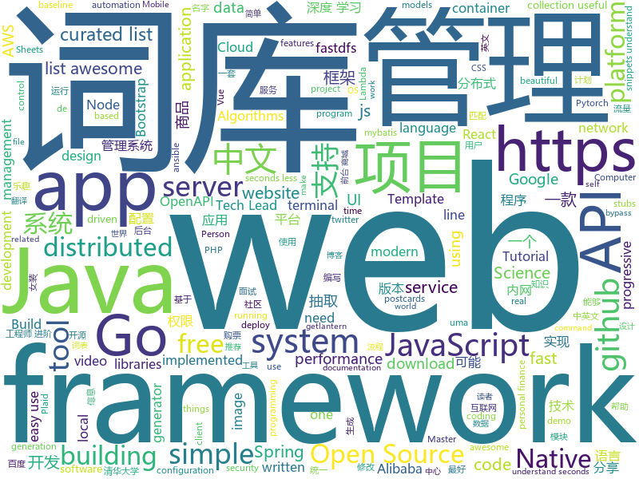

# 2019-01-30
See what the GitHub community is most excited about today.

## python
* [apprise](https://github.com/caronc/apprise)(**736 stars today**): Apprise - Push Notifications that work with just about every platform!
* [brumadinho_location](https://github.com/dieegom/brumadinho_location)(**348 stars today**): Criamos uma primeira versão de uma ferramenta para colocar latitude e longitude dos desaparecidos e, com base no fluxo de rejeitos, estimar a possível localização da pessoa.
* [yodaos](https://github.com/yodaos-project/yodaos)(**234 stars today**): AI OS for Web Community
* [funNLP](https://github.com/fighting41love/funNLP)(**131 stars today**): 中英文敏感词、语言检测、中外手机/电话归属地/运营商查询、名字推断性别、手机号抽取、身份证抽取、邮箱抽取、中日文人名库、中文缩写库、拆字词典、词汇情感值、停用词、反动词表、暴恐词表、繁简体转换、英文模拟中文发音、汪峰歌词生成器、职业名称词库、同义词库、反义词库、否定词库、汽车品牌词库、汽车零件词库、连续英文切割、各种中文词向量、公司名字大全、古诗词库、IT词库、财经词库、成语词库、地名词库、历史名人词库、诗词词库、医学词库、饮食词库、法律词库、汽车词库、动物词库、中文聊天语料、中文谣言数据、百度中文问答数据集、句子相似度匹配算法集合、bert资源、文本生成&摘要相关工具、cocoNLP信息抽取工具、国内电话号码正则匹配、清华大学XLORE:中英文跨语言百科知识图谱、清华大学人工智能技术…
* [rtv](https://github.com/michael-lazar/rtv)(**94 stars today**): Browse Reddit from your terminal
* [d2l-zh](https://github.com/d2l-ai/d2l-zh)(**86 stars today**): 《动手学深度学习》，英文版即伯克利深度学习（STAT 157，2019春）教材。面向中文读者、能运行、可讨论。
* [py12306](https://github.com/pjialin/py12306)(**77 stars today**): 🚂12306 购票助手，支持分布式，多账号，多任务购票以及 Web 页面管理
* [obstacle-tower-env](https://github.com/Unity-Technologies/obstacle-tower-env)(**77 stars today**): Obstacle Tower Environment
* [system-design-primer](https://github.com/donnemartin/system-design-primer)(**73 stars today**): Learn how to design large-scale systems. Prep for the system design interview. Includes Anki flashcards.
* [awesome-python](https://github.com/vinta/awesome-python)(**66 stars today**): A curated list of awesome Python frameworks, libraries, software and resources
* [12306](https://github.com/testerSunshine/12306)(**61 stars today**): 12306智能刷票，订票
* [models](https://github.com/tensorflow/models)(**41 stars today**): Models and examples built with TensorFlow
* [Exchange2domain](https://github.com/Ridter/Exchange2domain)(**58 stars today**): CVE-2018-8581
* [public-apis](https://github.com/toddmotto/public-apis)(**58 stars today**): A collective list of free APIs for use in software and web development.
* [Person_reID_baseline_pytorch](https://github.com/layumi/Person_reID_baseline_pytorch)(**51 stars today**): Pytorch implement of Person re-identification baseline. Tutorial👉https://github.com/layumi/Person_reID_baseline_pytorch/tree/master/tutorial
* [youtube-dl](https://github.com/rg3/youtube-dl)(**48 stars today**): Command-line program to download videos from YouTube.com and other video sites
* [Python](https://github.com/TheAlgorithms/Python)(**44 stars today**): All Algorithms implemented in Python
* [PrivExchange](https://github.com/dirkjanm/PrivExchange)(**44 stars today**): Exchange your privileges for Domain Admin privs by abusing Exchange
* [HelloGitHub](https://github.com/521xueweihan/HelloGitHub)(**47 stars today**): 分享 GitHub 上有趣、入门级的开源项目，帮你找到编程的乐趣。欢迎推荐、自荐项目，让更多人知道你的项目⭐️
* [keras](https://github.com/keras-team/keras)(**38 stars today**): Deep Learning for humans
* [bert](https://github.com/google-research/bert)(**40 stars today**): TensorFlow code and pre-trained models for BERT
* [django](https://github.com/django/django)(**31 stars today**): The Web framework for perfectionists with deadlines.
* [LASER](https://github.com/facebookresearch/LASER)(**41 stars today**): Language-Agnostic SEntence Representations
* [ansible](https://github.com/ansible/ansible)(**33 stars today**): Ansible is a radically simple IT automation platform that makes your applications and systems easier to deploy. Avoid writing scripts or custom code to deploy and update your applications — automate in a language that approaches plain English, using SSH, with no agents to install on remote systems. https://docs.ansible.com/ansible/
* [home-assistant](https://github.com/home-assistant/home-assistant)(**35 stars today**): 🏡Open source home automation that puts local control and privacy first

## java
* [giffun](https://github.com/guolindev/giffun)(**770 stars today**): 一款开源的GIF在线分享App，乐趣就要和世界分享。
* [flink](https://github.com/apache/flink)(**302 stars today**): Apache Flink
* [symphony](https://github.com/b3log/symphony)(**273 stars today**): 🎶一款用 Java 实现的现代化社区（论坛/BBS/社交网络/博客）平台。https://hacpai.com
* [JavaGuide](https://github.com/Snailclimb/JavaGuide)(**121 stars today**): 【Java学习+面试指南】 一份涵盖大部分Java程序员所需要掌握的核心知识。
* [fescar](https://github.com/alibaba/fescar)(**106 stars today**): Fescar is an easy-to-use, high-performance, java based, open source distributed transaction solution.
* [advanced-java](https://github.com/doocs/advanced-java)(**91 stars today**): 😮互联网 Java 工程师进阶知识完全扫盲
* [nacos](https://github.com/alibaba/nacos)(**62 stars today**): an easy-to-use dynamic service discovery, configuration and service management platform for building cloud native applications.
* [spring-boot](https://github.com/spring-projects/spring-boot)(**49 stars today**): Spring Boot
* [mall](https://github.com/macrozheng/mall)(**46 stars today**): mall项目是一套电商系统，包括前台商城系统及后台管理系统，基于SpringBoot+MyBatis实现。 前台商城系统包含首页门户、商品推荐、商品搜索、商品展示、购物车、订单流程、会员中心、客户服务、帮助中心等模块。 后台管理系统包含商品管理、订单管理、会员管理、促销管理、运营管理、内容管理、统计报表、财务管理、权限管理、设置等模块。
* [tutorials](https://github.com/eugenp/tutorials)(**28 stars today**): The "REST With Spring" Course:
* [elasticsearch](https://github.com/elastic/elasticsearch)(**44 stars today**): Open Source, Distributed, RESTful Search Engine
* [santa-tracker-android](https://github.com/google/santa-tracker-android)(**47 stars today**): Ho Ho Ho
* [halo](https://github.com/ruibaby/halo)(**42 stars today**): Halo可能是最好的Java博客系统😉
* [miaosha](https://github.com/qiurunze123/miaosha)(**41 stars today**): ⛹️🐘秒杀系统设计与实现.互联网工程师进阶与分析🙋🐓
* [XUI](https://github.com/xuexiangjys/XUI)(**42 stars today**): 💍一个简洁而优雅的Android原生UI框架，解放你的双手！
* [arthas](https://github.com/alibaba/arthas)(**38 stars today**): Alibaba Java Diagnostic Tool Arthas/Alibaba Java诊断利器Arthas
* [apollo](https://github.com/ctripcorp/apollo)(**34 stars today**): Apollo（阿波罗）是携程框架部门研发的分布式配置中心，能够集中化管理应用不同环境、不同集群的配置，配置修改后能够实时推送到应用端，并且具备规范的权限、流程治理等特性，适用于微服务配置管理场景。
* [thisisfine-plugin](https://github.com/llbit/thisisfine-plugin)(**38 stars today**): This Is Fine meme plugin for Jenkins.
* [hope-plus](https://github.com/java-aodeng/hope-plus)(**33 stars today**): Hope-plus是一款nice的权限管理系统。基于Springboot2开发，整合使用mybatis+shiro+redis+thymeleaf+maven等实用技术。🏷
* [Java](https://github.com/TheAlgorithms/Java)(**32 stars today**): All Algorithms implemented in Java
* [interviews](https://github.com/kdn251/interviews)(**32 stars today**): Everything you need to know to get the job.
* [spring-framework](https://github.com/spring-projects/spring-framework)(**27 stars today**): Spring Framework
* [sca-best-practice](https://github.com/alibaba/sca-best-practice)(**32 stars today**): 本项目是 SCA(Spring Cloud Alibaba) 的最佳实践项目，致力于帮助用户更加快速、正确的使用SCA。
* [JCSprout](https://github.com/crossoverJie/JCSprout)(**30 stars today**): 👨‍🎓Java Core Sprout : basic, concurrent, algorithm
* [netty](https://github.com/netty/netty)(**25 stars today**): Netty project - an event-driven asynchronous network application framework

## unknown
* [the-practical-linux-hardening-guide](https://github.com/trimstray/the-practical-linux-hardening-guide)(**533 stars today**): 🔥This guide details the planning and the tools involved in creating a secure Linux production systems - work in progress.
* [techlead](https://github.com/phodal/techlead)(**393 stars today**): Path to Tech Lead: How to be a tech lead ? 迈向 Tech Lead 之路
* [open-source-cs](https://github.com/ForrestKnight/open-source-cs)(**250 stars today**): Video discussing this curriculum:
* [developer-roadmap](https://github.com/kamranahmedse/developer-roadmap)(**164 stars today**): Roadmap to becoming a web developer in 2019
* [awesome-mobile-web-development](https://github.com/myshov/awesome-mobile-web-development)(**149 stars today**): All that you need to create a great mobile web experience
* [CS-Notes](https://github.com/CyC2018/CS-Notes)(**124 stars today**): 📚技术面试必备基础知识
* [Girl-Dress-](https://github.com/greenaway07/Girl-Dress-)(**91 stars today**): 看到女装的项目的issue建议妹子建一个男装的项目，但是考虑到github的女性用户 数量貌似并不能达到女装的效果2333总之先建一个。
* [kubernetes-failure-stories](https://github.com/hjacobs/kubernetes-failure-stories)(**88 stars today**): Compilation of public failure/horror stories related to Kubernetes
* [gitignore](https://github.com/github/gitignore)(**56 stars today**): A collection of useful .gitignore templates
* [nginx-quick-reference](https://github.com/trimstray/nginx-quick-reference)(**79 stars today**): This notes describes how to improve Nginx performance, security and other important things.
* [awesome](https://github.com/sindresorhus/awesome)(**76 stars today**): 😎Curated list of awesome lists
* [You-Dont-Know-JS](https://github.com/getify/You-Dont-Know-JS)(**67 stars today**): A book series on JavaScript. @YDKJS on twitter.
* [computer-science](https://github.com/ossu/computer-science)(**67 stars today**): 🎓Path to a free self-taught education in Computer Science!
* [the-book-of-secret-knowledge](https://github.com/trimstray/the-book-of-secret-knowledge)(**70 stars today**): ⚡️A collection of awesome lists, manuals, blogs, hacks, one-liners, cli/web tools and more. Especially for System and Network Administrators, DevOps, Pentesters or Security Researchers.
* [free-programming-books](https://github.com/EbookFoundation/free-programming-books)(**58 stars today**): 📚Freely available programming books
* [coding-interview-university](https://github.com/jwasham/coding-interview-university)(**56 stars today**): A complete computer science study plan to become a software engineer.
* [HyperDL-Tutorial](https://github.com/zeusees/HyperDL-Tutorial)(**56 stars today**): 深度学习教程整理 | 干货
* [project-based-learning](https://github.com/tuvtran/project-based-learning)(**46 stars today**): Curated list of project-based tutorials
* [awesome-vue](https://github.com/vuejs/awesome-vue)(**40 stars today**): 🎉A curated list of awesome things related to Vue.js
* [go](https://github.com/datasciencemasters/go)(**39 stars today**): The Open Source Data Science Masters
* [gold-miner](https://github.com/xitu/gold-miner)(**40 stars today**): 🥇掘金翻译计划，可能是世界最大最好的英译中技术社区，最懂读者和译者的翻译平台：
* [blog](https://github.com/sorrycc/blog)(**37 stars today**): 💡
* [hosts](https://github.com/googlehosts/hosts)(**29 stars today**): 镜像：https://coding.net/u/scaffrey/p/hosts/git
* [Threat-Hunting](https://github.com/sapphirex00/Threat-Hunting)(**32 stars today**): Personal compilation of APT malware from whitepaper releases, documents and own research
* [awesome-datascience](https://github.com/bulutyazilim/awesome-datascience)(**29 stars today**): 📝An awesome Data Science repository to learn and apply for real world problems.

## javascript
* [x-spreadsheet](https://github.com/myliang/x-spreadsheet)(**1,105 stars today**): a javascript spreadsheet for web
* [ink](https://github.com/vadimdemedes/ink)(**545 stars today**): 🌈React for interactive command-line apps
* [chameleon](https://github.com/didi/chameleon)(**470 stars today**): 真正专注于让一套代码运行多端的开发框架，提供标准的MVVM架构开发模式统一各类终端
* [hotkey](https://github.com/github/hotkey)(**196 stars today**): Global DOM element activation
* [vue](https://github.com/vuejs/vue)(**134 stars today**): 🖖Vue.js is a progressive, incrementally-adoptable JavaScript framework for building UI on the web.
* [import-http](https://github.com/egoist/import-http)(**136 stars today**): Import modules from URL instead of local node_modules
* [fx](https://github.com/antonmedv/fx)(**120 stars today**): Command-line tool and terminal JSON viewer🔥
* [react](https://github.com/facebook/react)(**98 stars today**): A declarative, efficient, and flexible JavaScript library for building user interfaces.
* [Gitter](https://github.com/huangjianke/Gitter)(**102 stars today**): Gitter for GitHub - 可能是目前颜值最高的GitHub小程序客户端
* [javascript-algorithms](https://github.com/trekhleb/javascript-algorithms)(**96 stars today**): 📝Algorithms and data structures implemented in JavaScript with explanations and links to further readings
* [mintable](https://github.com/kevinschaich/mintable)(**102 stars today**): Roll-your own Mint clone for managing personal finances using the Google Sheets and Plaid APIs.
* [cloudquery](https://github.com/cloudfetch/cloudquery)(**92 stars today**): Turn any website to serverless API (support SPA!)
* [taro](https://github.com/NervJS/taro)(**87 stars today**): 多端统一开发框架，支持用 React 的开发方式编写一次代码，生成能运行在微信/百度/支付宝/字节跳动小程序、H5、React Native 等的应用。 https://taro.js.org/
* [30-seconds-of-code](https://github.com/30-seconds/30-seconds-of-code)(**83 stars today**): Curated collection of useful JavaScript snippets that you can understand in 30 seconds or less.
* [nuclear](https://github.com/nukeop/nuclear)(**79 stars today**): Desktop music player for streaming from free sources
* [nodebestpractices](https://github.com/i0natan/nodebestpractices)(**74 stars today**): The largest Node.js best practices list (January 2019)
* [ledger-live-mobile](https://github.com/LedgerHQ/ledger-live-mobile)(**77 stars today**): Ledger Live (Mobile)
* [create-react-app](https://github.com/facebook/create-react-app)(**61 stars today**): Set up a modern web app by running one command.
* [clean-code-javascript](https://github.com/ryanmcdermott/clean-code-javascript)(**73 stars today**): 🛁Clean Code concepts adapted for JavaScript
* [xhgui-branch](https://github.com/laynefyc/xhgui-branch)(**73 stars today**): PHP非侵入式监控平台- 优化性能，定位Bug的神器，别再让你的PHP程序裸奔。---提交问题请带上操作系统和PHP版本等信息
* [aws-appsync-chat](https://github.com/aws-samples/aws-appsync-chat)(**68 stars today**): Real-Time Offline Ready Chat App written with GraphQL, AWS AppSync, & AWS Amplify
* [matter](https://github.com/finnhvman/matter)(**64 stars today**): Material Components in Pure CSS
* [gatsby](https://github.com/gatsbyjs/gatsby)(**57 stars today**): Build blazing fast, modern apps and websites with React
* [anime](https://github.com/juliangarnier/anime)(**56 stars today**): JavaScript animation engine
* [puppeteer](https://github.com/GoogleChrome/puppeteer)(**53 stars today**): Headless Chrome Node API

## html
* [terminal.css](https://github.com/Gioni06/terminal.css)(**46 stars today**): Modern and minimalistic CSS framework for terminal enthusiasts
* [ionic](https://github.com/ionic-team/ionic)(**26 stars today**): Build amazing native and progressive web apps with open web technologies. One app running on everything🎉
* [manuals](https://github.com/skr-shop/manuals)(**26 stars today**): Do design No code📖
* [sleek-dashboard](https://github.com/tafcoder/sleek-dashboard)(**27 stars today**): Sleek Dashboard - Free Bootstrap 4 Admin Template and UI Kit
* [flutter-in-action](https://github.com/flutterchina/flutter-in-action)(**24 stars today**): 《Flutter实战》电子书
* [JavaScript30](https://github.com/wesbos/JavaScript30)(**12 stars today**): 30 Day Vanilla JS Challenge
* [blog_os](https://github.com/phil-opp/blog_os)(**21 stars today**): Writing an OS in Rust
* [zju-icicles](https://github.com/QSCTech/zju-icicles)(**17 stars today**): 浙江大学课程攻略共享计划
* [Spoon-Knife](https://github.com/octocat/Spoon-Knife)(****): This repo is for demonstration purposes only.
* [portainer](https://github.com/portainer/portainer)(**14 stars today**): Simple management UI for Docker
* [30-seconds-of-css](https://github.com/30-seconds/30-seconds-of-css)(**13 stars today**): A curated collection of useful CSS snippets you can understand in 30 seconds or less.
* [build-your-own-mint](https://github.com/yyx990803/build-your-own-mint)(**13 stars today**): Build your own personal finance analytics using Plaid, Google Sheets and CircleCI.
* [Google-UX-Playbook-for-Retail-translate](https://github.com/Wcc723/Google-UX-Playbook-for-Retail-translate)(**13 stars today**): Google UX Playbook for Retail 中文化版本
* [subspace](https://github.com/subspacecloud/subspace)(**13 stars today**): A simple WireGuard VPN server GUI
* [fonts](https://github.com/google/fonts)(**10 stars today**): Font files available from Google Fonts
* [fastText](https://github.com/facebookresearch/fastText)(**12 stars today**): Library for fast text representation and classification.
* [beautiful-jekyll](https://github.com/daattali/beautiful-jekyll)(**5 stars today**): ✨Build a beautiful and simple website in literally minutes. Demo at http://deanattali.com/beautiful-jekyll
* [swagger-codegen](https://github.com/swagger-api/swagger-codegen)(**9 stars today**): swagger-codegen contains a template-driven engine to generate documentation, API clients and server stubs in different languages by parsing your OpenAPI / Swagger definition.
* [capacitor](https://github.com/ionic-team/capacitor)(**10 stars today**): Build cross-platform Native Progressive Web Apps for iOS, Android, and the web⚡️
* [openapi-generator](https://github.com/OpenAPITools/openapi-generator)(**9 stars today**): OpenAPI Generator allows generation of API client libraries (SDK generation), server stubs, documentation and configuration automatically given an OpenAPI Spec (v2, v3)
* [bootstrap-table](https://github.com/wenzhixin/bootstrap-table)(**7 stars today**): An extended Bootstrap table with radio, checkbox, sort, pagination, and other added features. (supports twitter bootstrap v2, v3 and v4)
* [javascript-tutorial-en](https://github.com/iliakan/javascript-tutorial-en)(**7 stars today**): Modern JavaScript Tutorial
* [nginxconfig.io](https://github.com/valentinxxx/nginxconfig.io)(**9 stars today**): ⚙️NGiИX config generator generator on steroids💉
* [html-email-templates](https://github.com/designmodo/html-email-templates)(**8 stars today**): Free HTML Email Templates created using the Postcards - https://designmodo.com/postcards/
* [EIPs](https://github.com/ethereum/EIPs)(**9 stars today**): The Ethereum Improvement Proposal repository

## go
* [websocketd](https://github.com/joewalnes/websocketd)(**316 stars today**): Turn any program that uses STDIN/STDOUT into a WebSocket server. Like inetd, but for WebSockets.
* [aresdb](https://github.com/uber/aresdb)(**150 stars today**): 
* [demoit](https://github.com/dgageot/demoit)(**125 stars today**): Live coding demos without Context Switching
* [go-tagexpr](https://github.com/bytedance/go-tagexpr)(**117 stars today**): An interesting go struct tag expression syntax for field validation, etc.
* [go-fastdfs](https://github.com/sjqzhang/go-fastdfs)(**69 stars today**): A simple fast, easy use distributed file system written by golang(similar fastdfs).一个简单的分布式文件存储服务（类fastdfs,称go-fastdfs），高性能，高可靠，运维方面省力省心，极其简单的设计让扩展随心所欲
* [go](https://github.com/golang/go)(**59 stars today**): The Go programming language
* [kubernetes](https://github.com/kubernetes/kubernetes)(**53 stars today**): Production-Grade Container Scheduling and Management
* [BaiduPCS-Go](https://github.com/iikira/BaiduPCS-Go)(**43 stars today**): 百度网盘客户端 - Go语言编写
* [loki](https://github.com/grafana/loki)(**43 stars today**): Like Prometheus, but for logs.
* [awesome-go](https://github.com/avelino/awesome-go)(**37 stars today**): A curated list of awesome Go frameworks, libraries and software
* [learn-go-with-tests](https://github.com/quii/learn-go-with-tests)(**40 stars today**): Learn Go with test-driven development
* [easyProxy](https://github.com/cnlh/easyProxy)(**38 stars today**): 一款轻量级、功能强大的内网穿透代理服务器。支持tcp、udp流量转发，支持内网http代理、内网socks5代理，同时支持snappy压缩（节省带宽和流量）、站点保护、加密传输、多路复用、header修改等。支持web图形化管理。
* [frp](https://github.com/fatedier/frp)(**37 stars today**): A fast reverse proxy to help you expose a local server behind a NAT or firewall to the internet.
* [traefik](https://github.com/containous/traefik)(**36 stars today**): The Cloud Native Edge Router
* [gin](https://github.com/gin-gonic/gin)(**34 stars today**): Gin is a HTTP web framework written in Go (Golang). It features a Martini-like API with much better performance -- up to 40 times faster. If you need smashing performance, get yourself some Gin.
* [v2ray-core](https://github.com/v2ray/v2ray-core)(**33 stars today**): A platform for building proxies to bypass network restrictions.
* [aws-lambda-container-image-converter](https://github.com/awslabs/aws-lambda-container-image-converter)(**34 stars today**): The AWS Lambda container image converter tool (img2lambda) repackages container images (such as Docker images) into AWS Lambda layers, and publishes them as new layer versions.
* [hugo](https://github.com/gohugoio/hugo)(**34 stars today**): The world’s fastest framework for building websites.
* [evilginx2](https://github.com/kgretzky/evilginx2)(**32 stars today**): Standalone man-in-the-middle attack framework used for phishing login credentials along with session cookies, allowing for the bypass of 2-factor authentication
* [minio](https://github.com/minio/minio)(**30 stars today**): Minio is an open source object storage server compatible with Amazon S3 APIs
* [lantern](https://github.com/getlantern/lantern)(**30 stars today**): 🔴蓝灯最新版本下载 https://github.com/getlantern/download🔴Lantern Latest Download https://github.com/getlantern/download🔴
* [istio](https://github.com/istio/istio)(**27 stars today**): Connect, secure, control, and observe services.
* [mkcert](https://github.com/FiloSottile/mkcert)(**30 stars today**): A simple zero-config tool to make locally trusted development certificates with any names you'd like.
* [etcd](https://github.com/etcd-io/etcd)(**26 stars today**): Distributed reliable key-value store for the most critical data of a distributed system
* [gitea](https://github.com/go-gitea/gitea)(**25 stars today**): Git with a cup of tea, painless self-hosted git service

## WordCloud

