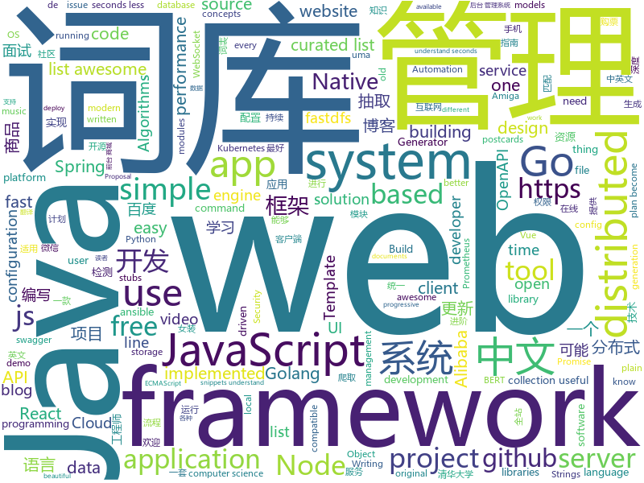

# 2019-01-31
See what the GitHub community is most excited about today.

## python
* [apprise](https://github.com/caronc/apprise)(**410 stars today**): Apprise - Push Notifications that work with just about every platform!
* [simpledet](https://github.com/TuSimple/simpledet)(**269 stars today**): A Simple and Versatile Framework for Object Detection and Instance Recognition
* [system-design-primer](https://github.com/donnemartin/system-design-primer)(**226 stars today**): Learn how to design large-scale systems. Prep for the system design interview. Includes Anki flashcards.
* [brumadinho_location](https://github.com/sosbrumadinho/brumadinho_location)(**147 stars today**): Criamos uma primeira versão de uma ferramenta para colocar latitude e longitude dos desaparecidos e, com base no fluxo de rejeitos, estimar a possível localização da pessoa.
* [big-list-of-naughty-strings](https://github.com/minimaxir/big-list-of-naughty-strings)(**148 stars today**): The Big List of Naughty Strings is a list of strings which have a high probability of causing issues when used as user-input data.
* [yodaos](https://github.com/yodaos-project/yodaos)(**99 stars today**): AI OS for Web Community
* [funNLP](https://github.com/fighting41love/funNLP)(**75 stars today**): 中英文敏感词、语言检测、中外手机/电话归属地/运营商查询、名字推断性别、手机号抽取、身份证抽取、邮箱抽取、中日文人名库、中文缩写库、拆字词典、词汇情感值、停用词、反动词表、暴恐词表、繁简体转换、英文模拟中文发音、汪峰歌词生成器、职业名称词库、同义词库、反义词库、否定词库、汽车品牌词库、汽车零件词库、连续英文切割、各种中文词向量、公司名字大全、古诗词库、IT词库、财经词库、成语词库、地名词库、历史名人词库、诗词词库、医学词库、饮食词库、法律词库、汽车词库、动物词库、中文聊天语料、中文谣言数据、百度中文问答数据集、句子相似度匹配算法集合、bert资源、文本生成&摘要相关工具、cocoNLP信息抽取工具、国内电话号码正则匹配、清华大学XLORE:中英文跨语言百科知识图谱、清华大学人工智能技术…
* [public-apis](https://github.com/toddmotto/public-apis)(**72 stars today**): A collective list of free APIs for use in software and web development.
* [models](https://github.com/tensorflow/models)(**55 stars today**): Models and examples built with TensorFlow
* [awesome-python](https://github.com/vinta/awesome-python)(**56 stars today**): A curated list of awesome Python frameworks, libraries, software and resources
* [Python](https://github.com/TheAlgorithms/Python)(**49 stars today**): All Algorithms implemented in Python
* [faceswap](https://github.com/deepfakes/faceswap)(**47 stars today**): Non official project based on original /r/Deepfakes thread. Many thanks to him!
* [d2l-zh](https://github.com/d2l-ai/d2l-zh)(**49 stars today**): 《动手学深度学习》，英文版即伯克利深度学习（STAT 157，2019春）教材。面向中文读者、能运行、可讨论。
* [bert](https://github.com/google-research/bert)(**43 stars today**): TensorFlow code and pre-trained models for BERT
* [py12306](https://github.com/pjialin/py12306)(**44 stars today**): 🚂12306 购票助手，支持分布式，多账号，多任务购票以及 Web 页面管理
* [keras](https://github.com/keras-team/keras)(**40 stars today**): Deep Learning for humans
* [manim](https://github.com/3b1b/manim)(**47 stars today**): Animation engine for explanatory math videos
* [12306](https://github.com/testerSunshine/12306)(**37 stars today**): 12306智能刷票，订票
* [youtube-dl](https://github.com/rg3/youtube-dl)(**40 stars today**): Command-line program to download videos from YouTube.com and other video sites
* [cpython](https://github.com/python/cpython)(**28 stars today**): The Python programming language
* [CopyTranslator](https://github.com/elliottzheng/CopyTranslator)(**34 stars today**): Foreign language reading and translation assistant based on copy and translate.(Latest: v0.0.7-Kylin-RC1)
* [ansible](https://github.com/ansible/ansible)(**26 stars today**): Ansible is a radically simple IT automation platform that makes your applications and systems easier to deploy. Avoid writing scripts or custom code to deploy and update your applications — automate in a language that approaches plain English, using SSH, with no agents to install on remote systems. https://docs.ansible.com/ansible/
* [zi5book](https://github.com/guapier/zi5book)(**33 stars today**): book.zi5.me全站kindle电子书籍爬取，按照作者书籍名分类，每本书有mobi和equb两种格式，采用分布式进行全站爬取
* [TensorFlow-Course](https://github.com/osforscience/TensorFlow-Course)(**30 stars today**): Simple and ready-to-use tutorials for TensorFlow
* [Airtest](https://github.com/AirtestProject/Airtest)(**30 stars today**): UI Automation Framework for Games and Apps

## java
* [giffun](https://github.com/guolindev/giffun)(**311 stars today**): 一款开源的GIF在线分享App，乐趣就要和世界分享。
* [flink](https://github.com/apache/flink)(**235 stars today**): Apache Flink
* [symphony](https://github.com/b3log/symphony)(**172 stars today**): 🎶一款用 Java 实现的现代化社区（论坛/BBS/社交网络/博客）平台。https://hacpai.com
* [santa-tracker-android](https://github.com/google/santa-tracker-android)(**137 stars today**): Ho Ho Ho
* [JavaGuide](https://github.com/Snailclimb/JavaGuide)(**116 stars today**): 【Java学习+面试指南】 一份涵盖大部分Java程序员所需要掌握的核心知识。
* [nacos](https://github.com/alibaba/nacos)(**86 stars today**): an easy-to-use dynamic service discovery, configuration and service management platform for building cloud native applications.
* [fescar](https://github.com/alibaba/fescar)(**77 stars today**): Fescar is an easy-to-use, high-performance, java based, open source distributed transaction solution.
* [advanced-java](https://github.com/doocs/advanced-java)(**69 stars today**): 😮互联网 Java 工程师进阶知识完全扫盲
* [java-design-patterns](https://github.com/iluwatar/java-design-patterns)(**63 stars today**): Design patterns implemented in Java
* [AndroidUtilCode](https://github.com/Blankj/AndroidUtilCode)(**57 stars today**): 🔥Android developers should collect the following utils(updating).
* [spring-boot](https://github.com/spring-projects/spring-boot)(**45 stars today**): Spring Boot
* [miaosha](https://github.com/qiurunze123/miaosha)(**50 stars today**): ⛹️🐘秒杀系统设计与实现.互联网工程师进阶与分析🙋🐓
* [tutorials](https://github.com/eugenp/tutorials)(**32 stars today**): The "REST With Spring" Course:
* [arthas](https://github.com/alibaba/arthas)(**43 stars today**): Alibaba Java Diagnostic Tool Arthas/Alibaba Java诊断利器Arthas
* [elasticsearch](https://github.com/elastic/elasticsearch)(**34 stars today**): Open Source, Distributed, RESTful Search Engine
* [interviews](https://github.com/kdn251/interviews)(**37 stars today**): Everything you need to know to get the job.
* [spring-framework](https://github.com/spring-projects/spring-framework)(**34 stars today**): Spring Framework
* [mall](https://github.com/macrozheng/mall)(**33 stars today**): mall项目是一套电商系统，包括前台商城系统及后台管理系统，基于SpringBoot+MyBatis实现。 前台商城系统包含首页门户、商品推荐、商品搜索、商品展示、购物车、订单流程、会员中心、客户服务、帮助中心等模块。 后台管理系统包含商品管理、订单管理、会员管理、促销管理、运营管理、内容管理、统计报表、财务管理、权限管理、设置等模块。
* [apollo](https://github.com/ctripcorp/apollo)(**31 stars today**): Apollo（阿波罗）是携程框架部门研发的分布式配置中心，能够集中化管理应用不同环境、不同集群的配置，配置修改后能够实时推送到应用端，并且具备规范的权限、流程治理等特性，适用于微服务配置管理场景。
* [Java](https://github.com/TheAlgorithms/Java)(**31 stars today**): All Algorithms implemented in Java
* [netty](https://github.com/netty/netty)(**29 stars today**): Netty project - an event-driven asynchronous network application framework
* [SpiderMan](https://github.com/simplepeng/SpiderMan)(**30 stars today**): 🔥🔥🔥崩溃日志手机端显示 ，测试妹妹的最爱，开发哥哥的小棉袄
* [spring-cloud-alibaba](https://github.com/spring-cloud-incubator/spring-cloud-alibaba)(**25 stars today**): Spring Cloud Alibaba provides a one-stop solution for application development for the distributed solutions of Alibaba middleware.
* [cim](https://github.com/crossoverJie/cim)(**24 stars today**): 📲cim(cross IM) 适用于开发者的即时通讯系统
* [halo](https://github.com/ruibaby/halo)(**25 stars today**): Halo可能是最好的Java博客系统😉

## unknown
* [awesome-podcasts](https://github.com/rShetty/awesome-podcasts)(**1,060 stars today**): Collection of awesome podcasts
* [interview](https://github.com/aylei/interview)(**517 stars today**): 写在19年初的后端社招面试经历🤑
* [open-source-cs](https://github.com/ForrestKnight/open-source-cs)(**365 stars today**): Video discussing this curriculum:
* [the-practical-linux-hardening-guide](https://github.com/trimstray/the-practical-linux-hardening-guide)(**312 stars today**): 🔥This guide details the planning and the tools involved in creating a secure Linux production systems - work in progress.
* [Intranet_Penetration_Tips](https://github.com/Ridter/Intranet_Penetration_Tips)(**207 stars today**): 2018年初整理的一些内网渗透TIPS，后面更新的慢，所以公开出来希望跟小伙伴们一起更新维护~
* [developer-roadmap](https://github.com/kamranahmedse/developer-roadmap)(**189 stars today**): Roadmap to becoming a web developer in 2019
* [kubernetes-failure-stories](https://github.com/hjacobs/kubernetes-failure-stories)(**112 stars today**): Compilation of public failure/horror stories related to Kubernetes
* [CS-Notes](https://github.com/CyC2018/CS-Notes)(**96 stars today**): 📚技术面试必备基础知识
* [computer-science](https://github.com/ossu/computer-science)(**81 stars today**): 🎓Path to a free self-taught education in Computer Science!
* [awesome](https://github.com/sindresorhus/awesome)(**82 stars today**): 😎Curated list of awesome lists
* [Girl-Dress-](https://github.com/greenaway07/Girl-Dress-)(**82 stars today**): 看到女装的项目的issue建议妹子建一个男装的项目，但是考虑到github的女性用户 数量貌似并不能达到女装的效果2333总之先建一个。
* [gitignore](https://github.com/github/gitignore)(**63 stars today**): A collection of useful .gitignore templates
* [Threat-Hunting](https://github.com/sapphirex00/Threat-Hunting)(**67 stars today**): Personal compilation of APT malware from whitepaper releases, documents and own research
* [coding-interview-university](https://github.com/jwasham/coding-interview-university)(**60 stars today**): A complete computer science study plan to become a software engineer.
* [the-book-of-secret-knowledge](https://github.com/trimstray/the-book-of-secret-knowledge)(**62 stars today**): ⚡️A collection of awesome lists, manuals, blogs, hacks, one-liners, cli/web tools and more. Especially for System and Network Administrators, DevOps, Pentesters or Security Researchers.
* [free-programming-books](https://github.com/EbookFoundation/free-programming-books)(**56 stars today**): 📚Freely available programming books
* [proposals](https://github.com/tc39/proposals)(**60 stars today**): Tracking ECMAScript Proposals
* [project-based-learning](https://github.com/tuvtran/project-based-learning)(**52 stars today**): Curated list of project-based tutorials
* [awesome-mobile-web-development](https://github.com/myshov/awesome-mobile-web-development)(**55 stars today**): All that you need to create a great mobile web experience
* [nginx-quick-reference](https://github.com/trimstray/nginx-quick-reference)(**52 stars today**): This notes describes how to improve Nginx performance, security and other important things.
* [awesome-vue](https://github.com/vuejs/awesome-vue)(**42 stars today**): 🎉A curated list of awesome things related to Vue.js
* [learning-plan](https://github.com/amitness/learning-plan)(**40 stars today**): Learning plan to become 1% better everyday
* [awesome-java-cn](https://github.com/jobbole/awesome-java-cn)(**38 stars today**): Java资源大全中文版，包括开发库、开发工具、网站、博客、微信、微博等，由伯乐在线持续更新。
* [refactoring-guide-in-turkish](https://github.com/alirizaadiyahsi/refactoring-guide-in-turkish)(**33 stars today**): Türkçe refactoring kılavuzu
* [gold-miner](https://github.com/xitu/gold-miner)(**30 stars today**): 🥇掘金翻译计划，可能是世界最大最好的英译中技术社区，最懂读者和译者的翻译平台：

## javascript
* [x-spreadsheet](https://github.com/myliang/x-spreadsheet)(**633 stars today**): a javascript spreadsheet for web
* [chameleon](https://github.com/didi/chameleon)(**401 stars today**): 真正专注于让一套代码运行多端的开发框架，提供标准的MVVM架构开发模式统一各类终端
* [import-http](https://github.com/egoist/import-http)(**303 stars today**): Import modules from URL instead of local node_modules
* [ink](https://github.com/vadimdemedes/ink)(**188 stars today**): 🌈React for interactive command-line apps
* [BassoonTracker](https://github.com/steffest/BassoonTracker)(**156 stars today**): Webbased old-school Amiga music tracker in plain old javascript - Plays and edits Amiga Mod files and FastTracker XM files
* [react](https://github.com/facebook/react)(**136 stars today**): A declarative, efficient, and flexible JavaScript library for building user interfaces.
* [vue](https://github.com/vuejs/vue)(**130 stars today**): 🖖Vue.js is a progressive, incrementally-adoptable JavaScript framework for building UI on the web.
* [hotkey](https://github.com/github/hotkey)(**118 stars today**): Global DOM element activation
* [fx](https://github.com/antonmedv/fx)(**109 stars today**): Command-line tool and terminal JSON viewer🔥
* [30-seconds-of-code](https://github.com/30-seconds/30-seconds-of-code)(**94 stars today**): Curated collection of useful JavaScript snippets that you can understand in 30 seconds or less.
* [nuclear](https://github.com/nukeop/nuclear)(**89 stars today**): Desktop music player for streaming from free sources
* [33-js-concepts](https://github.com/stephentian/33-js-concepts)(**80 stars today**): 📜每个 JavaScript 工程师都应懂的33个概念 @leonardomso
* [Gitter](https://github.com/huangjianke/Gitter)(**86 stars today**): Gitter for GitHub - 可能是目前颜值最高的GitHub小程序客户端
* [33-js-concepts](https://github.com/leonardomso/33-js-concepts)(**69 stars today**): 📜33 concepts every JavaScript developer should know.
* [create-react-app](https://github.com/facebook/create-react-app)(**64 stars today**): Set up a modern web app by running one command.
* [axios](https://github.com/axios/axios)(**70 stars today**): Promise based HTTP client for the browser and node.js
* [javascript](https://github.com/airbnb/javascript)(**66 stars today**): JavaScript Style Guide
* [puppeteer](https://github.com/GoogleChrome/puppeteer)(**65 stars today**): Headless Chrome Node API
* [graphqless](https://github.com/tylerbuchea/graphqless)(**67 stars today**): REST and GraphQL really aren't that different.
* [nodebestpractices](https://github.com/i0natan/nodebestpractices)(**61 stars today**): The largest Node.js best practices list (January 2019)
* [httpie](https://github.com/lukeed/httpie)(**64 stars today**): A Node.js HTTP client as easy as pie! 🥧
* [clean-code-javascript](https://github.com/ryanmcdermott/clean-code-javascript)(**58 stars today**): 🛁Clean Code concepts adapted for JavaScript
* [gatsby](https://github.com/gatsbyjs/gatsby)(**54 stars today**): Build blazing fast, modern apps and websites with React
* [javascript-algorithms](https://github.com/trekhleb/javascript-algorithms)(**56 stars today**): 📝Algorithms and data structures implemented in JavaScript with explanations and links to further readings
* [taro](https://github.com/NervJS/taro)(**57 stars today**): 多端统一开发框架，支持用 React 的开发方式编写一次代码，生成能运行在微信/百度/支付宝/字节跳动小程序、H5、React Native 等的应用。 https://taro.js.org/

## html
* [nginxconfig.io](https://github.com/valentinxxx/nginxconfig.io)(**39 stars today**): ⚙️NGiИX config generator on steroids💉
* [sleek-dashboard](https://github.com/tafcoder/sleek-dashboard)(**37 stars today**): Sleek Dashboard - Free Bootstrap 4 Admin Template and UI Kit
* [github](https://github.com/phodal/github)(**24 stars today**): GitHub 漫游指南- a Chinese ebook on how to build a good project on Github. Explore the users' behavior. Find some thing interest.
* [ionic](https://github.com/ionic-team/ionic)(**20 stars today**): Build amazing native and progressive web apps with open web technologies. One app running on everything🎉
* [proposal-promise-allSettled](https://github.com/tc39/proposal-promise-allSettled)(**22 stars today**): ECMAScript Proposal, specs, and reference implementation for Promise.allSettled
* [flutter-in-action](https://github.com/flutterchina/flutter-in-action)(**20 stars today**): 《Flutter实战》电子书
* [JavaScript30](https://github.com/wesbos/JavaScript30)(**14 stars today**): 30 Day Vanilla JS Challenge
* [terminal.css](https://github.com/Gioni06/terminal.css)(**19 stars today**): Modern and minimalistic CSS framework for terminal enthusiasts
* [Spoon-Knife](https://github.com/octocat/Spoon-Knife)(****): This repo is for demonstration purposes only.
* [manuals](https://github.com/skr-shop/manuals)(**16 stars today**): Do design No code📖
* [ecma262](https://github.com/tc39/ecma262)(**17 stars today**): Status, process, and documents for ECMA262
* [zju-icicles](https://github.com/QSCTech/zju-icicles)(**16 stars today**): 浙江大学课程攻略共享计划
* [openapi-generator](https://github.com/OpenAPITools/openapi-generator)(**12 stars today**): OpenAPI Generator allows generation of API client libraries (SDK generation), server stubs, documentation and configuration automatically given an OpenAPI Spec (v2, v3)
* [fastText](https://github.com/facebookresearch/fastText)(**12 stars today**): Library for fast text representation and classification.
* [30-seconds-of-css](https://github.com/30-seconds/30-seconds-of-css)(**12 stars today**): A curated collection of useful CSS snippets you can understand in 30 seconds or less.
* [swagger-codegen](https://github.com/swagger-api/swagger-codegen)(**10 stars today**): swagger-codegen contains a template-driven engine to generate documentation, API clients and server stubs in different languages by parsing your OpenAPI / Swagger definition.
* [blog_os](https://github.com/phil-opp/blog_os)(**11 stars today**): Writing an OS in Rust
* [portainer](https://github.com/portainer/portainer)(**11 stars today**): Simple management UI for Docker
* [liweimin1996.github.io](https://github.com/liweimin1996/liweimin1996.github.io)(**10 stars today**): Min's blog 欢迎访问我的博客主页！(Welcome to my blog website !)https://liweimin1996.github.io/ 百度云资源持续更新中，欢迎点赞star
* [solid](https://github.com/solid/solid)(**9 stars today**): Solid - Re-decentralizing the web (project directory)
* [html-email-templates](https://github.com/designmodo/html-email-templates)(**8 stars today**): Free HTML Email Templates created using the Postcards - https://designmodo.com/postcards/
* [beautiful-jekyll](https://github.com/daattali/beautiful-jekyll)(**5 stars today**): ✨Build a beautiful and simple website in literally minutes. Demo at http://deanattali.com/beautiful-jekyll
* [polymer](https://github.com/Polymer/polymer)(**8 stars today**): Our original Web Component library.
* [fonts](https://github.com/google/fonts)(**8 stars today**): Font files available from Google Fonts
* [EIPs](https://github.com/ethereum/EIPs)(**5 stars today**): The Ethereum Improvement Proposal repository

## go
* [aresdb](https://github.com/uber/aresdb)(**468 stars today**): A GPU-powered real-time analytics storage and query engine.
* [websocketd](https://github.com/joewalnes/websocketd)(**241 stars today**): Turn any program that uses STDIN/STDOUT into a WebSocket server. Like inetd, but for WebSockets.
* [kunpeng](https://github.com/opensec-cn/kunpeng)(**122 stars today**): kunpeng是一个Golang编写的开源POC检测框架，以动态链接库的形式提供各种语言调用，通过此项目可快速对目标进行安全漏洞检测，比攻击者快一步发现风险漏洞。
* [go-tagexpr](https://github.com/bytedance/go-tagexpr)(**84 stars today**): An interesting go struct tag expression syntax for field validation, etc.
* [go](https://github.com/golang/go)(**60 stars today**): The Go programming language
* [faker](https://github.com/bxcodec/faker)(**58 stars today**): Go (Golang) Fake Data Generator for Struct
* [kubernetes](https://github.com/kubernetes/kubernetes)(**43 stars today**): Production-Grade Container Scheduling and Management
* [loki](https://github.com/grafana/loki)(**41 stars today**): Like Prometheus, but for logs.
* [awesome-go](https://github.com/avelino/awesome-go)(**40 stars today**): A curated list of awesome Go frameworks, libraries and software
* [learn-go-with-tests](https://github.com/quii/learn-go-with-tests)(**40 stars today**): Learn Go with test-driven development
* [demoit](https://github.com/dgageot/demoit)(**39 stars today**): Live coding demos without Context Switching
* [kustomize](https://github.com/kubernetes-sigs/kustomize)(**38 stars today**): Customization of kubernetes YAML configurations
* [BaiduPCS-Go](https://github.com/iikira/BaiduPCS-Go)(**36 stars today**): 百度网盘客户端 - Go语言编写
* [hugo](https://github.com/gohugoio/hugo)(**32 stars today**): The world’s fastest framework for building websites.
* [etcd](https://github.com/etcd-io/etcd)(**32 stars today**): Distributed reliable key-value store for the most critical data of a distributed system
* [traefik](https://github.com/containous/traefik)(**32 stars today**): The Cloud Native Edge Router
* [prometheus](https://github.com/prometheus/prometheus)(**30 stars today**): The Prometheus monitoring system and time series database.
* [tidb](https://github.com/pingcap/tidb)(**29 stars today**): TiDB is a distributed HTAP database compatible with the MySQL protocol
* [gitea](https://github.com/go-gitea/gitea)(**29 stars today**): Git with a cup of tea, painless self-hosted git service
* [frp](https://github.com/fatedier/frp)(**28 stars today**): A fast reverse proxy to help you expose a local server behind a NAT or firewall to the internet.
* [minio](https://github.com/minio/minio)(**27 stars today**): Minio is an open source object storage server compatible with Amazon S3 APIs
* [mkcert](https://github.com/FiloSottile/mkcert)(**29 stars today**): A simple zero-config tool to make locally trusted development certificates with any names you'd like.
* [gin](https://github.com/gin-gonic/gin)(**27 stars today**): Gin is a HTTP web framework written in Go (Golang). It features a Martini-like API with much better performance -- up to 40 times faster. If you need smashing performance, get yourself some Gin.
* [go-fastdfs](https://github.com/sjqzhang/go-fastdfs)(**27 stars today**): A simple fast, easy use distributed file system written by golang(similar fastdfs).一个简单的分布式文件存储服务（类fastdfs,称go-fastdfs），高性能，高可靠，运维方面省力省心，极其简单的设计让扩展随心所欲
* [istio](https://github.com/istio/istio)(**20 stars today**): Connect, secure, control, and observe services.

## WordCloud

