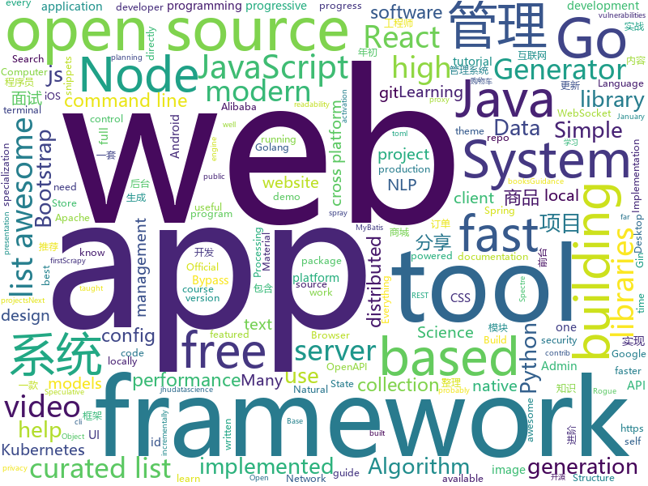

# 2019-02-03
See what the GitHub community is most excited about today.

## python
* [stanfordnlp](https://github.com/stanfordnlp/stanfordnlp)(**115 stars today**): Official Stanford NLP Python Library for Many Human Languages
* [ASCII-generator](https://github.com/vietnguyen91/ASCII-generator)(**87 stars today**): ASCII generator (image to text, image to image, video to video)
* [system-design-primer](https://github.com/donnemartin/system-design-primer)(**77 stars today**): Learn how to design large-scale systems. Prep for the system design interview. Includes Anki flashcards.
* [apprise](https://github.com/caronc/apprise)(**72 stars today**): Apprise - Push Notifications that work with just about every platform!
* [nlp-tutorial](https://github.com/graykode/nlp-tutorial)(**62 stars today**): Natural Language Processing Tutorial for Deep Learning Researchers
* [pylane](https://github.com/NtesEyes/pylane)(**57 stars today**): An python vm injector with debug tools, based on gdb.
* [models](https://github.com/tensorflow/models)(**39 stars today**): Models and examples built with TensorFlow
* [awesome-python](https://github.com/vinta/awesome-python)(**35 stars today**): A curated list of awesome Python frameworks, libraries, software and resources
* [NLP-progress](https://github.com/sebastianruder/NLP-progress)(**39 stars today**): Repository to track the progress in Natural Language Processing (NLP), including the datasets and the current state-of-the-art for the most common NLP tasks.
* [public-apis](https://github.com/toddmotto/public-apis)(**37 stars today**): A collective list of free APIs for use in software and web development.
* [Python](https://github.com/TheAlgorithms/Python)(**34 stars today**): All Algorithms implemented in Python
* [faceswap](https://github.com/deepfakes/faceswap)(**36 stars today**): Non official project based on original /r/Deepfakes thread. Many thanks to him!
* [QuickDraw](https://github.com/vietnguyen91/QuickDraw)(**38 stars today**): Implementation of Quickdraw - an online game developed by Google
* [youtube-dl](https://github.com/rg3/youtube-dl)(**35 stars today**): Command-line program to download videos from YouTube.com and other video sites
* [tfjs-object-detection-training](https://github.com/bourdakos1/tfjs-object-detection-training)(**31 stars today**): 🐝
* [spacy-stanfordnlp](https://github.com/explosion/spacy-stanfordnlp)(**32 stars today**): 💥Use the latest StanfordNLP research models directly in spaCy
* [Kiwi](https://github.com/kiwitcms/Kiwi)(**31 stars today**): Open source full-featured test case management system
* [keras](https://github.com/keras-team/keras)(**24 stars today**): Deep Learning for humans
* [simpledet](https://github.com/TuSimple/simpledet)(**29 stars today**): A Simple and Versatile Framework for Object Detection and Instance Recognition
* [home-assistant](https://github.com/home-assistant/home-assistant)(**24 stars today**): 🏡Open source home automation that puts local control and privacy first
* [scrapy](https://github.com/scrapy/scrapy)(**25 stars today**): Scrapy, a fast high-level web crawling & scraping framework for Python.
* [bert](https://github.com/google-research/bert)(**25 stars today**): TensorFlow code and pre-trained models for BERT
* [python-systemd-tutorial](https://github.com/torfsen/python-systemd-tutorial)(**26 stars today**): A tutorial for writing a systemd service in Python
* [lutris](https://github.com/lutris/lutris)(**24 stars today**): Lutris client - Open Source gaming platform for GNU/Linux
* [django](https://github.com/django/django)(**18 stars today**): The Web framework for perfectionists with deadlines.

## java
* [DoraemonKit](https://github.com/didi/DoraemonKit)(**133 stars today**): A full-featured APP ( iOS & Android ) development assistant. You deserve it.
* [advanced-java](https://github.com/doocs/advanced-java)(**122 stars today**): 😮互联网 Java 工程师进阶知识完全扫盲
* [JavaGuide](https://github.com/Snailclimb/JavaGuide)(**76 stars today**): 【Java学习+面试指南】 一份涵盖大部分Java程序员所需要掌握的核心知识。
* [symphony](https://github.com/b3log/symphony)(**47 stars today**): 🎶一款用 Java 实现的现代化社区（论坛/BBS/社交网络/博客）平台。https://hacpai.com
* [giffun](https://github.com/guolindev/giffun)(**46 stars today**): 一款开源的GIF在线分享App，乐趣就要和世界分享。
* [Gaps](https://github.com/JasonHHouse/Gaps)(**46 stars today**): Find the missing movies in your Plex Server
* [miaosha](https://github.com/qiurunze123/miaosha)(**40 stars today**): ⛹️🐘秒杀系统设计与实现.互联网工程师进阶与分析🙋🐓
* [mall](https://github.com/macrozheng/mall)(**32 stars today**): mall项目是一套电商系统，包括前台商城系统及后台管理系统，基于SpringBoot+MyBatis实现。 前台商城系统包含首页门户、商品推荐、商品搜索、商品展示、购物车、订单流程、会员中心、客户服务、帮助中心等模块。 后台管理系统包含商品管理、订单管理、会员管理、促销管理、运营管理、内容管理、统计报表、财务管理、权限管理、设置等模块。
* [flink](https://github.com/apache/flink)(**33 stars today**): Apache Flink
* [spring-boot](https://github.com/spring-projects/spring-boot)(**28 stars today**): Spring Boot
* [java-design-patterns](https://github.com/iluwatar/java-design-patterns)(**27 stars today**): Design patterns implemented in Java
* [tinyid](https://github.com/didi/tinyid)(**29 stars today**): ID Generator id生成器 分布式id生成系统，简单易用、高性能、高可用的id生成系统
* [elasticsearch](https://github.com/elastic/elasticsearch)(**23 stars today**): Open Source, Distributed, RESTful Search Engine
* [fescar](https://github.com/alibaba/fescar)(**25 stars today**): Fescar is an easy-to-use, high-performance, java based, open source distributed transaction solution.
* [dagger-reflect](https://github.com/JakeWharton/dagger-reflect)(**26 stars today**): A reflection-based implementation of the Dagger dependency injection library.
* [interviews](https://github.com/kdn251/interviews)(**24 stars today**): Everything you need to know to get the job.
* [arthas](https://github.com/alibaba/arthas)(**22 stars today**): Alibaba Java Diagnostic Tool Arthas/Alibaba Java诊断利器Arthas
* [tutorials](https://github.com/eugenp/tutorials)(**13 stars today**): The "REST With Spring" Course:
* [spring-framework](https://github.com/spring-projects/spring-framework)(**18 stars today**): Spring Framework
* [Leetcode-1-300](https://github.com/Cspiration/Leetcode-1-300)(**17 stars today**): Leetcode 答案
* [Java](https://github.com/TheAlgorithms/Java)(**14 stars today**): All Algorithms implemented in Java
* [Magisk](https://github.com/topjohnwu/Magisk)(**16 stars today**): A Magic Mask to Alter Android System Systemless-ly
* [DDMQ](https://github.com/didi/DDMQ)(**14 stars today**): DDMQ is a distributed messaging product with low latency, high throughput and high availability.
* [guava](https://github.com/google/guava)(**13 stars today**): Google core libraries for Java
* [FlyTour](https://github.com/geduo83/FlyTour)(**15 stars today**): Android MVP+组件化实战项目框架

## unknown
* [open-source-cs](https://github.com/ForrestKnight/open-source-cs)(**213 stars today**): Video discussing this curriculum:
* [awesome-podcasts](https://github.com/rShetty/awesome-podcasts)(**222 stars today**): Collection of awesome podcasts
* [Intranet_Penetration_Tips](https://github.com/Ridter/Intranet_Penetration_Tips)(**188 stars today**): 2018年初整理的一些内网渗透TIPS，后面更新的慢，所以公开出来希望跟小伙伴们一起更新维护~
* [computer-science](https://github.com/ossu/computer-science)(**137 stars today**): 🎓Path to a free self-taught education in Computer Science!
* [developer-roadmap](https://github.com/kamranahmedse/developer-roadmap)(**101 stars today**): Roadmap to becoming a web developer in 2019
* [interview](https://github.com/aylei/interview)(**102 stars today**): 写在19年初的后端社招面试经历🤑
* [chinese-programmer-wrong-pronunciation](https://github.com/shimohq/chinese-programmer-wrong-pronunciation)(**97 stars today**): 中国程序员容易发音错误的单词
* [GitHubDaily](https://github.com/GitHubDaily/GitHubDaily)(**96 stars today**): GitHubDaily 分享内容定期整理与分类。欢迎推荐、自荐项目，让更多人知道你的项目。
* [the-practical-linux-hardening-guide](https://github.com/trimstray/the-practical-linux-hardening-guide)(**88 stars today**): 🔥This guide details the planning and the tools involved in creating a secure Linux production systems - work in progress.
* [kubernetes-failure-stories](https://github.com/hjacobs/kubernetes-failure-stories)(**57 stars today**): Compilation of public failure/horror stories related to Kubernetes
* [awesome](https://github.com/sindresorhus/awesome)(**50 stars today**): 😎Curated list of awesome lists
* [CV-arXiv-Daily](https://github.com/zhengzhugithub/CV-arXiv-Daily)(**48 stars today**): 分享计算机视觉每天的arXiv文章
* [Xiaomi_Kernel_OpenSource](https://github.com/MiCode/Xiaomi_Kernel_OpenSource)(**42 stars today**): Xiaomi Mobile Phone Kernel OpenSource
* [Consolas](https://github.com/PiotrGrochowski/Consolas)(**46 stars today**): The Consolas font since I became a designer of it starting at version 8.0. It's of course open source.
* [coding-interview-university](https://github.com/jwasham/coding-interview-university)(**39 stars today**): A complete computer science study plan to become a software engineer.
* [CS-Notes](https://github.com/CyC2018/CS-Notes)(**38 stars today**): 📚技术面试必备基础知识
* [gitignore](https://github.com/github/gitignore)(**34 stars today**): A collection of useful .gitignore templates
* [git-flight-rules](https://github.com/k88hudson/git-flight-rules)(**43 stars today**): Flight rules for git
* [free-programming-books](https://github.com/EbookFoundation/free-programming-books)(**33 stars today**): 📚Freely available programming books
* [Hardware-and-Firmware-Security-Guidance](https://github.com/nsacyber/Hardware-and-Firmware-Security-Guidance)(**34 stars today**): Guidance for the Spectre, Meltdown, Speculative Store Bypass, Rogue System Register Read, Lazy FP State Restore, Bounds Check Bypass Store, TLBleed, and L1TF/Foreshadow vulnerabilities as well as general hardware and firmware security guidance. #nsacyber
* [amazing-machine-learning-opensource-2019](https://github.com/Mybridge/amazing-machine-learning-opensource-2019)(**35 stars today**): Amazing Machine Learning Open Source Tools and Projects for the Past Year (v.2019)
* [gitnote](https://github.com/zhaopengme/gitnote)(**32 stars today**): 
* [awesome-go-China](https://github.com/hyper0x/awesome-go-China)(**29 stars today**): A curated list of awesome Go frameworks, libraries and software written by Ethnic Chinese.
* [the-book-of-secret-knowledge](https://github.com/trimstray/the-book-of-secret-knowledge)(**28 stars today**): ⚡️A collection of awesome lists, manuals, blogs, hacks, one-liners, cli/web tools and more. Especially for System and Network Administrators, DevOps, Pentesters or Security Researchers.
* [first-contributions](https://github.com/firstcontributions/first-contributions)(**14 stars today**): 🚀✨Help beginners to contribute to open source projects

## javascript
* [flexsearch](https://github.com/nextapps-de/flexsearch)(**509 stars today**): Next-Generation full text search library for Browser and Node.js
* [learn-react-app](https://github.com/tyroprogrammer/learn-react-app)(**346 stars today**): Application that will help you learn React fundamentals. Install this application locally - there's tutorial, code snippets and exercises. The main objective of this project is to help you get off the ground with React!
* [realworld](https://github.com/gothinkster/realworld)(**181 stars today**): "The mother of all demo apps" — Exemplary fullstack Medium.com clone powered by React, Angular, Node, Django, and many more🏅
* [x-spreadsheet](https://github.com/myliang/x-spreadsheet)(**108 stars today**): a javascript spreadsheet for web
* [nodeppt](https://github.com/ksky521/nodeppt)(**99 stars today**): This is probably the best web presentation tool so far!
* [nuclear](https://github.com/nukeop/nuclear)(**72 stars today**): Desktop music player for streaming from free sources
* [javascript-algorithms](https://github.com/trekhleb/javascript-algorithms)(**71 stars today**): 📝Algorithms and data structures implemented in JavaScript with explanations and links to further readings
* [vue](https://github.com/vuejs/vue)(**65 stars today**): 🖖Vue.js is a progressive, incrementally-adoptable JavaScript framework for building UI on the web.
* [react](https://github.com/facebook/react)(**62 stars today**): A declarative, efficient, and flexible JavaScript library for building user interfaces.
* [readability](https://github.com/mozilla/readability)(**70 stars today**): A standalone version of the readability lib
* [hotkey](https://github.com/github/hotkey)(**62 stars today**): Global DOM element activation
* [chameleon](https://github.com/didi/chameleon)(**58 stars today**): 真正专注于让一套代码运行多端的开发框架，提供标准的MVVM架构开发模式统一各类终端
* [33-js-concepts](https://github.com/leonardomso/33-js-concepts)(**56 stars today**): 📜33 concepts every JavaScript developer should know.
* [fx](https://github.com/antonmedv/fx)(**52 stars today**): Command-line tool and terminal JSON viewer🔥
* [create-react-app](https://github.com/facebook/create-react-app)(**48 stars today**): Set up a modern web app by running one command.
* [gatsby](https://github.com/gatsbyjs/gatsby)(**41 stars today**): Build blazing fast, modern apps and websites with React
* [nodebestpractices](https://github.com/i0natan/nodebestpractices)(**42 stars today**): The largest Node.js best practices list (January 2019)
* [react-native](https://github.com/facebook/react-native)(**40 stars today**): A framework for building native apps with React.
* [import-http](https://github.com/egoist/import-http)(**42 stars today**): Import modules from URL instead of local node_modules
* [javascript](https://github.com/airbnb/javascript)(**39 stars today**): JavaScript Style Guide
* [CSS-Inspiration](https://github.com/chokcoco/CSS-Inspiration)(**40 stars today**): CSS Inspiration，在这里找到写 CSS 的灵感！
* [axios](https://github.com/axios/axios)(**39 stars today**): Promise based HTTP client for the browser and node.js
* [animated-burgers](https://github.com/march08/animated-burgers)(**33 stars today**): Collection of animated burgers for React, also available as HTML+CSS
* [material-ui](https://github.com/mui-org/material-ui)(**22 stars today**): React components that implement Google's Material Design.
* [github-spray](https://github.com/Annihil/github-spray)(**28 stars today**): 👾Generate spray for your GitHub contrib graph ░▒▓█

## html
* [ionic](https://github.com/ionic-team/ionic)(**22 stars today**): Build amazing native and progressive web apps with open web technologies. One app running on everything🎉
* [Spoon-Knife](https://github.com/octocat/Spoon-Knife)(****): This repo is for demonstration purposes only.
* [JavaScript30](https://github.com/wesbos/JavaScript30)(**6 stars today**): 30 Day Vanilla JS Challenge
* [AdminLTE](https://github.com/almasaeed2010/AdminLTE)(**5 stars today**): AdminLTE - Free Premium Admin control Panel Theme Based On Bootstrap 3.x
* [fastText](https://github.com/facebookresearch/fastText)(**8 stars today**): Library for fast text representation and classification.
* [30-seconds-of-css](https://github.com/30-seconds/30-seconds-of-css)(**7 stars today**): A curated collection of useful CSS snippets you can understand in 30 seconds or less.
* [openapi-generator](https://github.com/OpenAPITools/openapi-generator)(**6 stars today**): OpenAPI Generator allows generation of API client libraries (SDK generation), server stubs, documentation and configuration automatically given an OpenAPI Spec (v2, v3)
* [portainer](https://github.com/portainer/portainer)(**7 stars today**): Simple management UI for Docker
* [startbootstrap-sb-admin-2](https://github.com/BlackrockDigital/startbootstrap-sb-admin-2)(**5 stars today**): A free, open source, Bootstrap admin theme created by Start Bootstrap
* [awesome-competitive-programming](https://github.com/lnishan/awesome-competitive-programming)(**5 stars today**): 💎A curated list of awesome Competitive Programming, Algorithm and Data Structure resources
* [nginxconfig.io](https://github.com/valentinxxx/nginxconfig.io)(**6 stars today**): ⚙️NGiИX config generator on steroids💉
* [javascript-tutorial-en](https://github.com/iliakan/javascript-tutorial-en)(**6 stars today**): Modern JavaScript Tutorial
* [capacitor](https://github.com/ionic-team/capacitor)(**6 stars today**): Build cross-platform Native Progressive Web Apps for iOS, Android, and the web⚡️
* [terminal.css](https://github.com/Gioni06/terminal.css)(**6 stars today**): Modern and minimalistic CSS framework for terminal enthusiasts
* [cloudpatron](https://github.com/cloudpatron/cloudpatron)(**6 stars today**): Cloud Patron - Open source Patreon alternative
* [patchwork](https://github.com/jlord/patchwork)(****): All the Git-it Workshop completers!
* [sleek-dashboard](https://github.com/tafcoder/sleek-dashboard)(**5 stars today**): Sleek Dashboard - Free Bootstrap 4 Admin Template and UI Kit
* [zenbot](https://github.com/DeviaVir/zenbot)(**5 stars today**): Zenbot is a command-line cryptocurrency trading bot using Node.js and MongoDB.
* [ecma262](https://github.com/tc39/ecma262)(**5 stars today**): Status, process, and documents for ECMA262
* [flutter-in-action](https://github.com/flutterchina/flutter-in-action)(**5 stars today**): 《Flutter实战》电子书
* [raspberry-pi-compute-module-base-board](https://github.com/magkopian/raspberry-pi-compute-module-base-board)(**5 stars today**): Base board for the Raspberry Pi Compute Module
* [website](https://github.com/kubernetes/website)(****): Kubernetes website and documentation repo:
* [gcp-hackathon-demos](https://github.com/ryanmats/gcp-hackathon-demos)(****): Demos for GCP hackathon tech talks
* [courses](https://github.com/bcaffo/courses)(****): Course materials for the Data Science Specialization: https://www.coursera.org/specialization/jhudatascience/1
* [game-of-life](https://github.com/wakaleo/game-of-life)(****): Demo application for the 'Jenkins: The Definitive Guide' book

## go
* [websocketd](https://github.com/joewalnes/websocketd)(**85 stars today**): Turn any program that uses STDIN/STDOUT into a WebSocket server. Like inetd, but for WebSockets.
* [cli](https://github.com/urfave/cli)(**59 stars today**): A simple, fast, and fun package for building command line apps in Go
* [aresdb](https://github.com/uber/aresdb)(**57 stars today**): A GPU-powered real-time analytics storage and query engine.
* [kubernetes](https://github.com/kubernetes/kubernetes)(**51 stars today**): Production-Grade Container Scheduling and Management
* [golangci-lint](https://github.com/golangci/golangci-lint)(**43 stars today**): Linters Runner for Go. 5x faster than gometalinter. Nice colored output. Can report only new issues. Fewer false-positives. Yaml/toml config.
* [go](https://github.com/golang/go)(**36 stars today**): The Go programming language
* [awesome-go](https://github.com/avelino/awesome-go)(**33 stars today**): A curated list of awesome Go frameworks, libraries and software
* [faker](https://github.com/bxcodec/faker)(**30 stars today**): Go (Golang) Fake Data Generator for Struct
* [gitea](https://github.com/go-gitea/gitea)(**30 stars today**): Git with a cup of tea, painless self-hosted git service
* [v2ray-core](https://github.com/v2ray/v2ray-core)(**27 stars today**): A platform for building proxies to bypass network restrictions.
* [hugo](https://github.com/gohugoio/hugo)(**23 stars today**): The world’s fastest framework for building websites.
* [gorse](https://github.com/zhenghaoz/gorse)(**25 stars today**): A High Performance Recommender System Package based on Collaborative Filtering for Go
* [spark-on-k8s-operator](https://github.com/GoogleCloudPlatform/spark-on-k8s-operator)(**25 stars today**): Kubernetes operator for managing the lifecycle of Apache Spark applications on Kubernetes.
* [cnd](https://github.com/cloudnativedevelopment/cnd)(**25 stars today**): Tool to develop directly in your dev Kubernetes cluster
* [docui](https://github.com/skanehira/docui)(**24 stars today**): TUI Tool for Docker
* [BaiduPCS-Go](https://github.com/iikira/BaiduPCS-Go)(**23 stars today**): 百度网盘客户端 - Go语言编写
* [frp](https://github.com/fatedier/frp)(**20 stars today**): A fast reverse proxy to help you expose a local server behind a NAT or firewall to the internet.
* [gin](https://github.com/gin-gonic/gin)(**18 stars today**): Gin is a HTTP web framework written in Go (Golang). It features a Martini-like API with much better performance -- up to 40 times faster. If you need smashing performance, get yourself some Gin.
* [fzf](https://github.com/junegunn/fzf)(**18 stars today**): 🌸A command-line fuzzy finder
* [mgmt](https://github.com/purpleidea/mgmt)(**17 stars today**): Next generation distributed, event-driven, parallel config management!
* [mkcert](https://github.com/FiloSottile/mkcert)(**17 stars today**): A simple zero-config tool to make locally trusted development certificates with any names you'd like.
* [syncthing](https://github.com/syncthing/syncthing)(**15 stars today**): Open Source Continuous File Synchronization
* [go-tagexpr](https://github.com/bytedance/go-tagexpr)(**15 stars today**): An interesting go struct tag expression syntax for field validation, etc.
* [caddy](https://github.com/mholt/caddy)(**14 stars today**): Fast, cross-platform HTTP/2 web server with automatic HTTPS
* [lorca](https://github.com/zserge/lorca)(**14 stars today**): Build cross-platform modern desktop apps in Go + HTML5

## WordCloud

