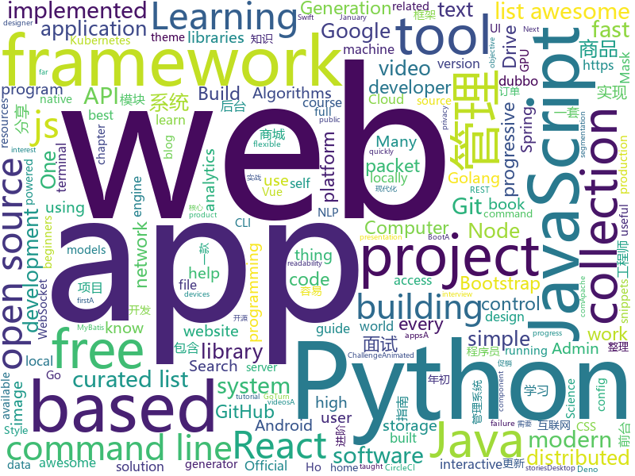

# 2019-02-04
See what the GitHub community is most excited about today.

## python
* [ASCII-generator](https://github.com/vietnguyen91/ASCII-generator)(**192 stars today**): ASCII generator (image to text, image to image, video to video)
* [stanfordnlp](https://github.com/stanfordnlp/stanfordnlp)(**71 stars today**): Official Stanford NLP Python Library for Many Human Languages
* [system-design-primer](https://github.com/donnemartin/system-design-primer)(**55 stars today**): Learn how to design large-scale systems. Prep for the system design interview. Includes Anki flashcards.
* [IPOsint](https://github.com/j3ssie/IPOsint)(**51 stars today**): Discovery IP Address of the target
* [manim](https://github.com/3b1b/manim)(**43 stars today**): Animation engine for explanatory math videos
* [awesome-python](https://github.com/vinta/awesome-python)(**36 stars today**): A curated list of awesome Python frameworks, libraries, software and resources
* [apprise](https://github.com/caronc/apprise)(**36 stars today**): Apprise - Push Notifications that work with just about every platform!
* [pwndb](https://github.com/davidtavarez/pwndb)(**33 stars today**): Search for leaked credentials
* [Python](https://github.com/TheAlgorithms/Python)(**28 stars today**): All Algorithms implemented in Python
* [home-assistant](https://github.com/home-assistant/home-assistant)(**26 stars today**): 🏡Open source home automation that puts local control and privacy first
* [public-apis](https://github.com/toddmotto/public-apis)(**28 stars today**): A collective list of free APIs for use in software and web development.
* [models](https://github.com/tensorflow/models)(**24 stars today**): Models and examples built with TensorFlow
* [django](https://github.com/django/django)(**23 stars today**): The Web framework for perfectionists with deadlines.
* [tfjs-object-detection-training](https://github.com/bourdakos1/tfjs-object-detection-training)(**25 stars today**): 🐝
* [awesome-python-applications](https://github.com/mahmoud/awesome-python-applications)(**26 stars today**): 💿Free software that works great, and also happens to be open-source Python.
* [youtube-dl](https://github.com/rg3/youtube-dl)(**24 stars today**): Command-line program to download videos from YouTube.com and other video sites
* [keras](https://github.com/keras-team/keras)(**21 stars today**): Deep Learning for humans
* [faceswap](https://github.com/deepfakes/faceswap)(**24 stars today**): Non official project based on original /r/Deepfakes thread. Many thanks to him!
* [Mask_RCNN](https://github.com/matterport/Mask_RCNN)(**22 stars today**): Mask R-CNN for object detection and instance segmentation on Keras and TensorFlow
* [jax](https://github.com/google/jax)(**22 stars today**): Composable transformations of Python+NumPy programs: differentiate, vectorize, JIT to GPU/TPU, and more
* [scikit-learn](https://github.com/scikit-learn/scikit-learn)(**18 stars today**): scikit-learn: machine learning in Python
* [face_recognition](https://github.com/ageitgey/face_recognition)(**20 stars today**): The world's simplest facial recognition api for Python and the command line
* [yodaos](https://github.com/yodaos-project/yodaos)(**21 stars today**): AI OS for Web Community
* [cpython](https://github.com/python/cpython)(**16 stars today**): The Python programming language
* [bert](https://github.com/google-research/bert)(**18 stars today**): TensorFlow code and pre-trained models for BERT

## java
* [advanced-java](https://github.com/doocs/advanced-java)(**63 stars today**): 😮互联网 Java 工程师进阶知识完全扫盲
* [DoraemonKit](https://github.com/didi/DoraemonKit)(**47 stars today**): A full-featured APP ( iOS & Android ) development assistant. You deserve it.
* [JavaGuide](https://github.com/Snailclimb/JavaGuide)(**40 stars today**): 【Java学习+面试指南】 一份涵盖大部分Java程序员所需要掌握的核心知识。
* [symphony](https://github.com/b3log/symphony)(**32 stars today**): 🎶一款用 Java 实现的现代化社区（论坛/BBS/社交网络/博客）平台。https://hacpai.com
* [flink](https://github.com/apache/flink)(**21 stars today**): Apache Flink
* [java-design-patterns](https://github.com/iluwatar/java-design-patterns)(**21 stars today**): Design patterns implemented in Java
* [giffun](https://github.com/guolindev/giffun)(**20 stars today**): 一款开源的GIF在线分享App，乐趣就要和世界分享。
* [tutorials](https://github.com/eugenp/tutorials)(**13 stars today**): The "REST With Spring" Course:
* [santa-tracker-android](https://github.com/google/santa-tracker-android)(**19 stars today**): Ho Ho Ho
* [spring-boot](https://github.com/spring-projects/spring-boot)(**13 stars today**): Spring Boot
* [ToDo-List-App](https://github.com/opencodeiiita/ToDo-List-App)(**17 stars today**): A very basic ToDo List Application for all the Android Enthusiasts !
* [Java](https://github.com/TheAlgorithms/Java)(**16 stars today**): All Algorithms implemented in Java
* [elasticsearch](https://github.com/elastic/elasticsearch)(**16 stars today**): Open Source, Distributed, RESTful Search Engine
* [interviews](https://github.com/kdn251/interviews)(**16 stars today**): Everything you need to know to get the job.
* [dagger-reflect](https://github.com/JakeWharton/dagger-reflect)(**17 stars today**): A reflection-based implementation of the Dagger dependency injection library.
* [miaosha](https://github.com/qiurunze123/miaosha)(**15 stars today**): ⛹️🐘秒杀系统设计与实现.互联网工程师进阶与分析🙋🐓
* [spring-framework](https://github.com/spring-projects/spring-framework)(**11 stars today**): Spring Framework
* [FlyTour](https://github.com/geduo83/FlyTour)(**15 stars today**): Android MVP+组件化实战项目框架
* [fescar](https://github.com/alibaba/fescar)(**14 stars today**): 🔥Fescar is an easy-to-use, high-performance, java based, open source distributed transaction solution.
* [mall](https://github.com/macrozheng/mall)(**13 stars today**): mall项目是一套电商系统，包括前台商城系统及后台管理系统，基于SpringBoot+MyBatis实现。 前台商城系统包含首页门户、商品推荐、商品搜索、商品展示、购物车、订单流程、会员中心、客户服务、帮助中心等模块。 后台管理系统包含商品管理、订单管理、会员管理、促销管理、运营管理、内容管理、统计报表、财务管理、权限管理、设置等模块。
* [dubbo-spring-boot-cli](https://github.com/coderqianlq/dubbo-spring-boot-cli)(**11 stars today**): 🔥dubbo-spring-boot-starter实践，使dubbo的使用变得及其简单快捷，容易上手。
* [EdXposed](https://github.com/ElderDrivers/EdXposed)(**12 stars today**): Elder driver Xposed Framework.
* [Magisk](https://github.com/topjohnwu/Magisk)(**11 stars today**): A Magic Mask to Alter Android System Systemless-ly
* [guava](https://github.com/google/guava)(**10 stars today**): Google core libraries for Java
* [DDMQ](https://github.com/didi/DDMQ)(**10 stars today**): DDMQ is a distributed messaging product with low latency, high throughput and high availability.

## unknown
* [deep-learning-drizzle](https://github.com/kmario23/deep-learning-drizzle)(**292 stars today**): Drench yourself in Deep Learning, Reinforcement Learning, Machine Learning, Computer Vision, and NLP by learning from these exciting lectures!!
* [awesome-podcasts](https://github.com/rShetty/awesome-podcasts)(**176 stars today**): Collection of awesome podcasts
* [open-source-cs](https://github.com/ForrestKnight/open-source-cs)(**148 stars today**): Video discussing this curriculum:
* [computer-science](https://github.com/ossu/computer-science)(**111 stars today**): 🎓Path to a free self-taught education in Computer Science!
* [Consolas](https://github.com/PiotrGrochowski/Consolas)(**109 stars today**): The Consolas font since I became a designer of it starting at version 8.0. It's of course open source.
* [developer-roadmap](https://github.com/kamranahmedse/developer-roadmap)(**99 stars today**): Roadmap to becoming a web developer in 2019
* [Intranet_Penetration_Tips](https://github.com/Ridter/Intranet_Penetration_Tips)(**72 stars today**): 2018年初整理的一些内网渗透TIPS，后面更新的慢，所以公开出来希望跟小伙伴们一起更新维护~
* [the-practical-linux-hardening-guide](https://github.com/trimstray/the-practical-linux-hardening-guide)(**66 stars today**): 🔥This guide details the planning and the tools involved in creating a secure Linux production systems - work in progress.
* [chinese-programmer-wrong-pronunciation](https://github.com/shimohq/chinese-programmer-wrong-pronunciation)(**64 stars today**): 中国程序员容易发音错误的单词
* [interview](https://github.com/aylei/interview)(**62 stars today**): 写在19年初的后端社招面试经历🤑
* [kubernetes-failure-stories](https://github.com/hjacobs/kubernetes-failure-stories)(**56 stars today**): Compilation of public failure/horror stories related to Kubernetes
* [awesome](https://github.com/sindresorhus/awesome)(**50 stars today**): 😎Curated list of awesome lists
* [gitignore](https://github.com/github/gitignore)(**41 stars today**): A collection of useful .gitignore templates
* [gitnote](https://github.com/zhaopengme/gitnote)(**48 stars today**): A modern note taking app based on GIT that does not require a local GIT environment.
* [every-programmer-should-know](https://github.com/mtdvio/every-programmer-should-know)(**43 stars today**): A collection of (mostly) technical things every software developer should know
* [free-programming-books](https://github.com/EbookFoundation/free-programming-books)(**40 stars today**): 📚Freely available programming books
* [CS-Notes](https://github.com/CyC2018/CS-Notes)(**38 stars today**): 📚技术面试必备基础知识
* [HyperDL-Tutorial](https://github.com/zeusees/HyperDL-Tutorial)(**33 stars today**): 深度学习教程整理 | 干货
* [coding-interview-university](https://github.com/jwasham/coding-interview-university)(**30 stars today**): A complete computer science study plan to become a software engineer.
* [awesome-blockchain](https://github.com/yjjnls/awesome-blockchain)(**33 stars today**): ⚡️Curated list of resources for the development and applications of block chain.
* [the-book-of-secret-knowledge](https://github.com/trimstray/the-book-of-secret-knowledge)(**29 stars today**): ⚡️A collection of awesome lists, manuals, blogs, hacks, one-liners, cli/web tools and more. Especially for System and Network Administrators, DevOps, Pentesters or Security Researchers.
* [CV-arXiv-Daily](https://github.com/zhengzhugithub/CV-arXiv-Daily)(**24 stars today**): 分享计算机视觉每天的arXiv文章
* [first-contributions](https://github.com/firstcontributions/first-contributions)(**11 stars today**): 🚀✨Help beginners to contribute to open source projects
* [awesome-vue](https://github.com/vuejs/awesome-vue)(**22 stars today**): 🎉A curated list of awesome things related to Vue.js
* [awesome-for-beginners](https://github.com/MunGell/awesome-for-beginners)(**20 stars today**): A list of awesome beginners-friendly projects.

## javascript
* [flexsearch](https://github.com/nextapps-de/flexsearch)(**386 stars today**): Next-Generation full text search library for Browser and Node.js
* [learn-react-app](https://github.com/tyroprogrammer/learn-react-app)(**203 stars today**): Application that will help you learn React fundamentals. Install this application locally - there's tutorial, code snippets and exercises. The main objective of this project is to help you get off the ground with React!
* [ink](https://github.com/vadimdemedes/ink)(**124 stars today**): 🌈React for interactive command-line apps
* [speedometer-pwa](https://github.com/justinribeiro/speedometer-pwa)(**111 stars today**): A tiny no-frills speedometer progressive web app based on Geolocation API, AmbientLightSensor API, and WakeLock API.
* [realworld](https://github.com/gothinkster/realworld)(**98 stars today**): "The mother of all demo apps" — Exemplary fullstack Medium.com clone powered by React, Angular, Node, Django, and many more🏅
* [nodeppt](https://github.com/ksky521/nodeppt)(**90 stars today**): This is probably the best web presentation tool so far!
* [x-spreadsheet](https://github.com/myliang/x-spreadsheet)(**81 stars today**): A web-based JavaScript（canvas） spreadsheet
* [react](https://github.com/facebook/react)(**69 stars today**): A declarative, efficient, and flexible JavaScript library for building user interfaces.
* [vue](https://github.com/vuejs/vue)(**69 stars today**): 🖖Vue.js is a progressive, incrementally-adoptable JavaScript framework for building UI on the web.
* [github-spray](https://github.com/Annihil/github-spray)(**65 stars today**): 👾Draw on your GitHub contribution graph ░▒▓█
* [react-insta-stories](https://github.com/mohitk05/react-insta-stories)(**60 stars today**): A React component for Instagram like stories
* [nuclear](https://github.com/nukeop/nuclear)(**53 stars today**): Desktop music player for streaming from free sources
* [create-react-app](https://github.com/facebook/create-react-app)(**48 stars today**): Set up a modern web app by running one command.
* [fx](https://github.com/antonmedv/fx)(**47 stars today**): Command-line tool and terminal JSON viewer🔥
* [mermaid](https://github.com/knsv/mermaid)(**43 stars today**): Generation of diagram and flowchart from text in a similar manner as markdown
* [react-native](https://github.com/facebook/react-native)(**36 stars today**): A framework for building native apps with React.
* [gatsby](https://github.com/gatsbyjs/gatsby)(**36 stars today**): Build blazing fast, modern apps and websites with React
* [readability](https://github.com/mozilla/readability)(**41 stars today**): A standalone version of the readability lib
* [overreacted.io](https://github.com/gaearon/overreacted.io)(**27 stars today**): Personal blog by Dan Abramov.
* [33-js-concepts](https://github.com/leonardomso/33-js-concepts)(**40 stars today**): 📜33 concepts every JavaScript developer should know.
* [javascript-algorithms](https://github.com/trekhleb/javascript-algorithms)(**37 stars today**): 📝Algorithms and data structures implemented in JavaScript with explanations and links to further readings
* [nodebestpractices](https://github.com/i0natan/nodebestpractices)(**37 stars today**): The largest Node.js best practices list (January 2019)
* [chameleon](https://github.com/didi/chameleon)(**34 stars today**): 真正专注于让一套代码运行多端的开发框架，提供标准的MVVM架构开发模式统一各类终端
* [javascript](https://github.com/airbnb/javascript)(**27 stars today**): JavaScript Style Guide
* [node](https://github.com/nodejs/node)(**29 stars today**): Node.js JavaScript runtime✨🐢🚀✨

## html
* [ionic](https://github.com/ionic-team/ionic)(**17 stars today**): Build amazing native and progressive web apps with open web technologies. One app running on everything🎉
* [JavaScript30](https://github.com/wesbos/JavaScript30)(**11 stars today**): 30 Day Vanilla JS Challenge
* [animated-deno-logo](https://github.com/denolib/animated-deno-logo)(**12 stars today**): Animated Deno Logo
* [build-your-own-mint](https://github.com/yyx990803/build-your-own-mint)(**10 stars today**): Build your own personal finance analytics using Plaid, Google Sheets and CircleCI.
* [Spoon-Knife](https://github.com/octocat/Spoon-Knife)(****): This repo is for demonstration purposes only.
* [zenbot](https://github.com/DeviaVir/zenbot)(**8 stars today**): Zenbot is a command-line cryptocurrency trading bot using Node.js and MongoDB.
* [AdminLTE](https://github.com/almasaeed2010/AdminLTE)(**7 stars today**): AdminLTE - Free Premium Admin control Panel Theme Based On Bootstrap 3.x
* [node_passport_login](https://github.com/bradtraversy/node_passport_login)(**7 stars today**): Node.js login, registration and access control using Express and Passport
* [fastText](https://github.com/facebookresearch/fastText)(**7 stars today**): Library for fast text representation and classification.
* [awesome-modern-cpp](https://github.com/rigtorp/awesome-modern-cpp)(**7 stars today**): A collection of resources on modern C++
* [solid](https://github.com/solid/solid)(**7 stars today**): Solid - Re-decentralizing the web (project directory)
* [javascript-tutorial-en](https://github.com/iliakan/javascript-tutorial-en)(**5 stars today**): Modern JavaScript Tutorial
* [fonts](https://github.com/google/fonts)(**6 stars today**): Font files available from Google Fonts
* [sleek-dashboard](https://github.com/tafcoder/sleek-dashboard)(**6 stars today**): Sleek Dashboard - Free Bootstrap 4 Admin Template and UI Kit
* [30-seconds-of-css](https://github.com/30-seconds/30-seconds-of-css)(**6 stars today**): A curated collection of useful CSS snippets you can understand in 30 seconds or less.
* [zju-icicles](https://github.com/QSCTech/zju-icicles)(**6 stars today**): 浙江大学课程攻略共享计划
* [expressjs.com](https://github.com/expressjs/expressjs.com)(**6 stars today**): 
* [startbootstrap-sb-admin-2](https://github.com/BlackrockDigital/startbootstrap-sb-admin-2)(**6 stars today**): A free, open source, Bootstrap admin theme created by Start Bootstrap
* [now-github-starter](https://github.com/zeit/now-github-starter)(****): Starter project to demonstrate a project whose pull requests get automatically deployed
* [atcoder-tools](https://github.com/kyuridenamida/atcoder-tools)(**5 stars today**): Convenient modules & tools for AtCoder users, written in Python 3.5
* [patchwork](https://github.com/jlord/patchwork)(****): All the Git-it Workshop completers!
* [github](https://github.com/phodal/github)(**5 stars today**): GitHub 漫游指南- a Chinese ebook on how to build a good project on Github. Explore the users' behavior. Find some thing interest.
* [interactive-examples](https://github.com/mdn/interactive-examples)(**5 stars today**): Home of the MDN live code editor interactive examples
* [terminal.css](https://github.com/Gioni06/terminal.css)(**5 stars today**): Modern and minimalistic CSS framework for terminal enthusiasts
* [game-of-life](https://github.com/wakaleo/game-of-life)(****): Demo application for the 'Jenkins: The Definitive Guide' book

## go
* [k9s](https://github.com/derailed/k9s)(**149 stars today**): 🐶Kubernetes CLI To Manage Your Clusters In Style!
* [aresdb](https://github.com/uber/aresdb)(**48 stars today**): A GPU-powered real-time analytics storage and query engine.
* [cli](https://github.com/urfave/cli)(**46 stars today**): A simple, fast, and fun package for building command line apps in Go
* [websocketd](https://github.com/joewalnes/websocketd)(**43 stars today**): Turn any program that uses STDIN/STDOUT into a WebSocket server. Like inetd, but for WebSockets.
* [docui](https://github.com/skanehira/docui)(**33 stars today**): TUI Tool for Docker
* [hugo](https://github.com/gohugoio/hugo)(**30 stars today**): The world’s fastest framework for building websites.
* [go](https://github.com/golang/go)(**30 stars today**): The Go programming language
* [syncthing](https://github.com/syncthing/syncthing)(**28 stars today**): Open Source Continuous File Synchronization
* [mgmt](https://github.com/purpleidea/mgmt)(**27 stars today**): Next generation distributed, event-driven, parallel config management!
* [mkcert](https://github.com/FiloSottile/mkcert)(**24 stars today**): A simple zero-config tool to make locally trusted development certificates with any names you'd like.
* [kubernetes](https://github.com/kubernetes/kubernetes)(**22 stars today**): Production-Grade Container Scheduling and Management
* [fathom](https://github.com/usefathom/fathom)(**23 stars today**): Fathom. Simple, trustworthy website analytics. Built with Golang & Preact.
* [oneweekend](https://github.com/hunterloftis/oneweekend)(**25 stars today**): Ray Tracing book series implemented in Golang, chapter-by-chapter
* [rclone](https://github.com/ncw/rclone)(**22 stars today**): "rsync for cloud storage" - Google Drive, Amazon Drive, S3, Dropbox, Backblaze B2, One Drive, Swift, Hubic, Cloudfiles, Google Cloud Storage, Yandex Files
* [tinygo](https://github.com/tinygo-org/tinygo)(**22 stars today**): Go compiler for small devices, based on LLVM.
* [gitea](https://github.com/go-gitea/gitea)(**21 stars today**): Git with a cup of tea, painless self-hosted git service
* [stenographer](https://github.com/google/stenographer)(**22 stars today**): Stenographer is a packet capture solution which aims to quickly spool all packets to disk, then provide simple, fast access to subsets of those packets. Discussion/announcements at stenographer@googlegroups.com
* [Modlishka](https://github.com/drk1wi/Modlishka)(**22 stars today**): Modlishka. Reverse Proxy. Phishing NG.
* [loki](https://github.com/grafana/loki)(**21 stars today**): Like Prometheus, but for logs.
* [awesome-go](https://github.com/avelino/awesome-go)(**19 stars today**): A curated list of awesome Go frameworks, libraries and software
* [faker](https://github.com/bxcodec/faker)(**20 stars today**): Go (Golang) Fake Data Generator for Struct
* [fzf](https://github.com/junegunn/fzf)(**18 stars today**): 🌸A command-line fuzzy finder
* [bettercap](https://github.com/bettercap/bettercap)(**17 stars today**): The Swiss Army knife for 802.11, BLE and Ethernet networks reconnaissance and MITM attacks.
* [v2ray-core](https://github.com/v2ray/v2ray-core)(**18 stars today**): A platform for building proxies to bypass network restrictions.
* [caddy](https://github.com/mholt/caddy)(**14 stars today**): Fast, cross-platform HTTP/2 web server with automatic HTTPS

## WordCloud

