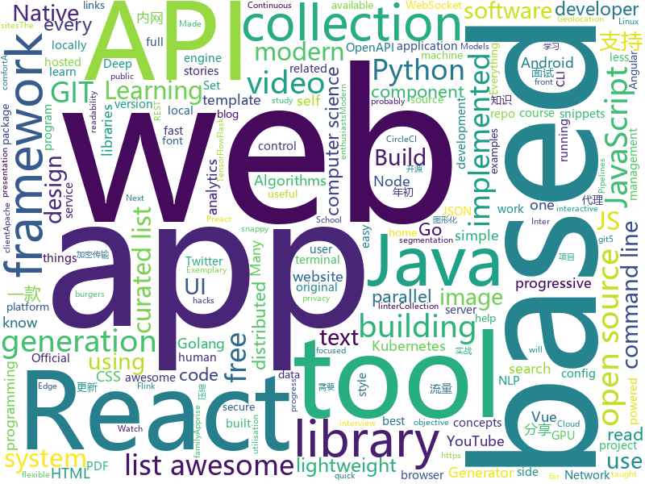

# 2019-02-05
See what the GitHub community is most excited about today.

## python
* [public-apis](https://github.com/toddmotto/public-apis)(**556 stars today**): A collective list of free APIs for use in software and web development.
* [python-cheatsheet](https://github.com/gto76/python-cheatsheet)(**345 stars today**): Comprehensive Python Cheatsheet
* [gita](https://github.com/nosarthur/gita)(**247 stars today**): Manage multiple git repos side by side for sanity
* [ASCII-generator](https://github.com/vietnguyen91/ASCII-generator)(**128 stars today**): ASCII generator (image to text, image to image, video to video)
* [stanfordnlp](https://github.com/stanfordnlp/stanfordnlp)(**77 stars today**): Official Stanford NLP Python Library for Many Human Languages
* [ArchiveBox](https://github.com/pirate/ArchiveBox)(**52 stars today**): 🗃The open source self-hosted web archive. Takes browser history/bookmarks/Pocket/Pinboard/etc., saves HTML, JS, PDFs, media, and more...
* [system-design-primer](https://github.com/donnemartin/system-design-primer)(**50 stars today**): Learn how to design large-scale systems. Prep for the system design interview. Includes Anki flashcards.
* [inter](https://github.com/rsms/inter)(**49 stars today**): The Inter font family
* [apprise](https://github.com/caronc/apprise)(**48 stars today**): Apprise - Push Notifications that work with just about every platform!
* [models](https://github.com/tensorflow/models)(**30 stars today**): Models and examples built with TensorFlow
* [gpu-sentry](https://github.com/jacenkow/gpu-sentry)(**42 stars today**): Flask-based package for monitoring utilisation of nVidia GPUs.
* [awesome-python](https://github.com/vinta/awesome-python)(**37 stars today**): A curated list of awesome Python frameworks, libraries, software and resources
* [Python](https://github.com/TheAlgorithms/Python)(**37 stars today**): All Algorithms implemented in Python
* [twint](https://github.com/twintproject/twint)(**35 stars today**): An advanced Twitter scraping & OSINT tool written in Python that doesn't use Twitter's API, allowing you to scrape a user's followers, following, Tweets and more while evading most API limitations.
* [manim](https://github.com/3b1b/manim)(**34 stars today**): Animation engine for explanatory math videos
* [tfjs-object-detection-training](https://github.com/bourdakos1/tfjs-object-detection-training)(**31 stars today**): 🐝
* [youtube-dl](https://github.com/rg3/youtube-dl)(**26 stars today**): Command-line program to download videos from YouTube.com and other video sites
* [django](https://github.com/django/django)(**23 stars today**): The Web framework for perfectionists with deadlines.
* [hanabi-learning-environment](https://github.com/deepmind/hanabi-learning-environment)(**32 stars today**): 
* [keras](https://github.com/keras-team/keras)(**27 stars today**): Deep Learning for humans
* [home-assistant](https://github.com/home-assistant/home-assistant)(**28 stars today**): 🏡Open source home automation that puts local control and privacy first
* [Mask_RCNN](https://github.com/matterport/Mask_RCNN)(**23 stars today**): Mask R-CNN for object detection and instance segmentation on Keras and TensorFlow
* [cpython](https://github.com/python/cpython)(**24 stars today**): The Python programming language
* [IPOsint](https://github.com/j3ssie/IPOsint)(**27 stars today**): Discovery IP Address of the target
* [faceswap](https://github.com/deepfakes/faceswap)(**24 stars today**): Non official project based on original /r/Deepfakes thread. Many thanks to him!

## java
* [Magisk](https://github.com/topjohnwu/Magisk)(**39 stars today**): A Magic Mask to Alter Android System Systemless-ly
* [santa-tracker-android](https://github.com/google/santa-tracker-android)(**32 stars today**): Ho Ho Ho
* [tutorials](https://github.com/eugenp/tutorials)(**13 stars today**): The "REST With Spring" Course:
* [JavaGuide](https://github.com/Snailclimb/JavaGuide)(**28 stars today**): 【Java学习+面试指南】 一份涵盖大部分Java程序员所需要掌握的核心知识。
* [SmartYouTubeTV](https://github.com/yuliskov/SmartYouTubeTV)(**27 stars today**): Watch YouTube videos on your TV and set-top-box with comfort
* [dagger-reflect](https://github.com/JakeWharton/dagger-reflect)(**26 stars today**): A reflection-based implementation of the Dagger dependency injection library.
* [advanced-java](https://github.com/doocs/advanced-java)(**24 stars today**): 😮互联网 Java 工程师进阶知识完全扫盲
* [byte-buddy](https://github.com/raphw/byte-buddy)(**23 stars today**): Runtime code generation for the Java virtual machine.
* [java-design-patterns](https://github.com/iluwatar/java-design-patterns)(**16 stars today**): Design patterns implemented in Java
* [Java](https://github.com/TheAlgorithms/Java)(**17 stars today**): All Algorithms implemented in Java
* [material-components-android](https://github.com/material-components/material-components-android)(**12 stars today**): Modular and customizable Material Design UI components for Android
* [spring-boot](https://github.com/spring-projects/spring-boot)(**11 stars today**): Spring Boot
* [FlyTour](https://github.com/geduo83/FlyTour)(**14 stars today**): Android MVP+组件化实战项目框架
* [parallel-collectors](https://github.com/pivovarit/parallel-collectors)(**14 stars today**): Parallel Collectors is a toolkit easining parallel collection processing in Java using Stream API.
* [symphony](https://github.com/b3log/symphony)(**13 stars today**): 🎶一款用 Java 实现的现代化社区（论坛/BBS/社交网络/博客）平台。https://hacpai.com
* [giffun](https://github.com/guolindev/giffun)(**13 stars today**): 一款开源的GIF在线分享App，乐趣就要和世界分享。
* [elasticsearch](https://github.com/elastic/elasticsearch)(**10 stars today**): Open Source, Distributed, RESTful Search Engine
* [dbeaver](https://github.com/dbeaver/dbeaver)(**11 stars today**): Free universal database tool and SQL client
* [flink](https://github.com/apache/flink)(**10 stars today**): Apache Flink
* [fescar](https://github.com/alibaba/fescar)(**11 stars today**): 🔥Fescar is an easy-to-use, high-performance, java based, open source distributed transaction solution.
* [interviews](https://github.com/kdn251/interviews)(**10 stars today**): Everything you need to know to get the job.
* [runelite](https://github.com/runelite/runelite)(**8 stars today**): Open source Old School RuneScape client
* [NewPipe](https://github.com/TeamNewPipe/NewPipe)(**9 stars today**): A lightweight Youtube frontend for Android.
* [moshi](https://github.com/square/moshi)(**10 stars today**): A modern JSON library for Kotlin and Java.
* [ToDo-List-App](https://github.com/opencodeiiita/ToDo-List-App)(**10 stars today**): A very basic ToDo List Application for all the Android Enthusiasts !

## unknown
* [deep-learning-drizzle](https://github.com/kmario23/deep-learning-drizzle)(**349 stars today**): Drench yourself in Deep Learning, Reinforcement Learning, Machine Learning, Computer Vision, and NLP by learning from these exciting lectures!!
* [awesome-podcasts](https://github.com/rShetty/awesome-podcasts)(**204 stars today**): Collection of awesome podcasts
* [open-source-cs](https://github.com/ForrestKnight/open-source-cs)(**154 stars today**): Video discussing this curriculum:
* [developer-roadmap](https://github.com/kamranahmedse/developer-roadmap)(**115 stars today**): Roadmap to becoming a web developer in 2019
* [computer-science](https://github.com/ossu/computer-science)(**110 stars today**): 🎓Path to a free self-taught education in Computer Science!
* [Consolas](https://github.com/PiotrGrochowski/Consolas)(**90 stars today**): The Consolas font since I became a designer of it starting at version 8.0. It's of course open source.
* [clean-code-typescript](https://github.com/labs42io/clean-code-typescript)(**79 stars today**): Clean Code concepts adapted for TypeScript
* [kubernetes-failure-stories](https://github.com/hjacobs/kubernetes-failure-stories)(**72 stars today**): Compilation of public failure/horror stories related to Kubernetes
* [the-practical-linux-hardening-guide](https://github.com/trimstray/the-practical-linux-hardening-guide)(**71 stars today**): 🔥This guide details the planning and the tools involved in creating a secure Linux production systems - work in progress.
* [gitignore](https://github.com/github/gitignore)(**44 stars today**): A collection of useful .gitignore templates
* [awesome](https://github.com/sindresorhus/awesome)(**57 stars today**): 😎Curated list of awesome lists
* [ambiente-react-native](https://github.com/Rocketseat/ambiente-react-native)(**41 stars today**): Ambiente de desenvolvimento React Native (o PDF foi migrado para cá, leia o README❤️)
* [every-programmer-should-know](https://github.com/mtdvio/every-programmer-should-know)(**40 stars today**): A collection of (mostly) technical things every software developer should know
* [free-programming-books](https://github.com/EbookFoundation/free-programming-books)(**38 stars today**): 📚Freely available programming books
* [Intranet_Penetration_Tips](https://github.com/Ridter/Intranet_Penetration_Tips)(**34 stars today**): 2018年初整理的一些内网渗透TIPS，后面更新的慢，所以公开出来希望跟小伙伴们一起更新维护~
* [0x4447-product-s3-email](https://github.com/0x4447/0x4447-product-s3-email)(**34 stars today**): 📫Host your own email service for free on AWS using a clever approach.
* [flutter_ide](https://github.com/Norbert515/flutter_ide)(**32 stars today**): 
* [coding-interview-university](https://github.com/jwasham/coding-interview-university)(**26 stars today**): A complete computer science study plan to become a software engineer.
* [build-your-own-x](https://github.com/danistefanovic/build-your-own-x)(**28 stars today**): 🤓Build your own (insert technology here)
* [awesome-vue](https://github.com/vuejs/awesome-vue)(**28 stars today**): 🎉A curated list of awesome things related to Vue.js
* [papers-we-love](https://github.com/papers-we-love/papers-we-love)(**28 stars today**): Papers from the computer science community to read and discuss.
* [the-book-of-secret-knowledge](https://github.com/trimstray/the-book-of-secret-knowledge)(**28 stars today**): ⚡️A collection of awesome lists, manuals, blogs, hacks, one-liners, cli/web tools and more. Especially for System and Network Administrators, DevOps, Pentesters or Security Researchers.
* [interview](https://github.com/aylei/interview)(**26 stars today**): 写在19年初的后端社招面试经历🤑
* [gitnote](https://github.com/zhaopengme/gitnote)(**25 stars today**): A modern note taking app based on GIT that does not require a local GIT environment.
* [CV-arXiv-Daily](https://github.com/zhengzhugithub/CV-arXiv-Daily)(**24 stars today**): 分享计算机视觉每天的arXiv文章

## javascript
* [flexsearch](https://github.com/nextapps-de/flexsearch)(**551 stars today**): Next-Generation full text search library for Browser and Node.js
* [learn-react-app](https://github.com/tyroprogrammer/learn-react-app)(**227 stars today**): Application that will help you learn React fundamentals. Install this application locally - there's tutorial, code snippets and exercises. The main objective of this project is to help you get off the ground with React!
* [react-insta-stories](https://github.com/mohitk05/react-insta-stories)(**141 stars today**): A React component for Instagram like stories
* [ink](https://github.com/vadimdemedes/ink)(**137 stars today**): 🌈React for interactive command-line apps
* [speedometer-pwa](https://github.com/justinribeiro/speedometer-pwa)(**135 stars today**): A tiny no-frills speedometer progressive web app based on Geolocation API, AmbientLightSensor API, and WakeLock API.
* [react](https://github.com/facebook/react)(**107 stars today**): A declarative, efficient, and flexible JavaScript library for building user interfaces.
* [realworld](https://github.com/gothinkster/realworld)(**110 stars today**): "The mother of all demo apps" — Exemplary fullstack Medium.com clone powered by React, Angular, Node, Django, and many more🏅
* [x-spreadsheet](https://github.com/myliang/x-spreadsheet)(**101 stars today**): A web-based JavaScript（canvas） spreadsheet
* [vue](https://github.com/vuejs/vue)(**93 stars today**): 🖖Vue.js is a progressive, incrementally-adoptable JavaScript framework for building UI on the web.
* [stylelint](https://github.com/stylelint/stylelint)(**86 stars today**): A mighty, modern style linter
* [vue-examples](https://github.com/peterlamar/vue-examples)(**79 stars today**): Collection of Vue examples for front end novices
* [33-js-concepts](https://github.com/leonardomso/33-js-concepts)(**76 stars today**): 📜33 concepts every JavaScript developer should know.
* [nuclear](https://github.com/nukeop/nuclear)(**69 stars today**): Desktop music player for streaming from free sources
* [github-spray](https://github.com/Annihil/github-spray)(**71 stars today**): 👾Draw on your GitHub contribution graph ░▒▓█
* [dtp-stat](https://github.com/tadata-ru/dtp-stat)(**63 stars today**): Карта ДТП
* [readability](https://github.com/mozilla/readability)(**63 stars today**): A standalone version of the readability lib
* [fx](https://github.com/antonmedv/fx)(**59 stars today**): Command-line tool and terminal JSON viewer🔥
* [animated-burgers](https://github.com/march08/animated-burgers)(**57 stars today**): Collection of animated burgers for React, also available as HTML+CSS
* [react-native](https://github.com/facebook/react-native)(**47 stars today**): A framework for building native apps with React.
* [create-react-app](https://github.com/facebook/create-react-app)(**43 stars today**): Set up a modern web app by running one command.
* [gatsby](https://github.com/gatsbyjs/gatsby)(**42 stars today**): Build blazing fast, modern apps and websites with React
* [nodeppt](https://github.com/ksky521/nodeppt)(**45 stars today**): This is probably the best web presentation tool so far!
* [mermaid](https://github.com/knsv/mermaid)(**42 stars today**): Generation of diagram and flowchart from text in a similar manner as markdown
* [javascript-algorithms](https://github.com/trekhleb/javascript-algorithms)(**39 stars today**): 📝Algorithms and data structures implemented in JavaScript with explanations and links to further readings
* [overreacted.io](https://github.com/gaearon/overreacted.io)(**36 stars today**): Personal blog by Dan Abramov.

## html
* [hello-css](https://github.com/Carpetsmoker/hello-css)(**27 stars today**): A CSS template focused on readability
* [Spoon-Knife](https://github.com/octocat/Spoon-Knife)(****): This repo is for demonstration purposes only.
* [ionic](https://github.com/ionic-team/ionic)(**19 stars today**): Build amazing native and progressive web apps with open web technologies. One app running on everything🎉
* [build-your-own-mint](https://github.com/yyx990803/build-your-own-mint)(**15 stars today**): Build your own personal finance analytics using Plaid, Google Sheets and CircleCI.
* [JavaScript30](https://github.com/wesbos/JavaScript30)(**9 stars today**): 30 Day Vanilla JS Challenge
* [terminal.css](https://github.com/Gioni06/terminal.css)(**13 stars today**): Modern and minimalistic CSS framework for terminal enthusiasts
* [javascript-tutorial-en](https://github.com/iliakan/javascript-tutorial-en)(**12 stars today**): Modern JavaScript Tutorial
* [patchwork](https://github.com/jlord/patchwork)(****): All the Git-it Workshop completers!
* [openapi-generator](https://github.com/OpenAPITools/openapi-generator)(**7 stars today**): OpenAPI Generator allows generation of API client libraries (SDK generation), server stubs, documentation and configuration automatically given an OpenAPI Spec (v2, v3)
* [sleek-dashboard](https://github.com/tafcoder/sleek-dashboard)(**8 stars today**): Sleek Dashboard - Free Bootstrap 4 Admin Template and UI Kit
* [ecma262](https://github.com/tc39/ecma262)(**8 stars today**): Status, process, and documents for ECMA262
* [portainer](https://github.com/portainer/portainer)(**7 stars today**): Simple management UI for Docker
* [blog_os](https://github.com/phil-opp/blog_os)(**7 stars today**): Writing an OS in Rust
* [animated-deno-logo](https://github.com/denolib/animated-deno-logo)(**7 stars today**): Animated Deno Logo
* [polymer](https://github.com/Polymer/polymer)(**6 stars today**): Our original Web Component library.
* [30-seconds-of-css](https://github.com/30-seconds/30-seconds-of-css)(**6 stars today**): A curated collection of useful CSS snippets you can understand in 30 seconds or less.
* [ImageOptim](https://github.com/ImageOptim/ImageOptim)(**6 stars today**): GUI image optimizer for Mac
* [wysiwyg-editor](https://github.com/froala/wysiwyg-editor)(**6 stars today**): A beautifully designed WYSIWYG HTML Editor based on HTML5.
* [bulksearch](https://github.com/nextapps-de/bulksearch)(**6 stars today**): Superfast, lightweight and read-write optimized full text search library.
* [electron-api-demos](https://github.com/electron/electron-api-demos)(**5 stars today**): Explore the Electron APIs
* [pipelines-dotnet-core](https://github.com/MicrosoftDocs/pipelines-dotnet-core)(****): Sample .NET core app for Azure Pipelines docs
* [awesome-angular](https://github.com/gdi2290/awesome-angular)(**5 stars today**): 📄A curated list of awesome Angular resources by @tipeio
* [js-the-right-way](https://github.com/braziljs/js-the-right-way)(**5 stars today**): An easy-to-read, quick reference for JS best practices, accepted coding standards, and links around the Web
* [zenbot](https://github.com/DeviaVir/zenbot)(**5 stars today**): Zenbot is a command-line cryptocurrency trading bot using Node.js and MongoDB.
* [ha-floorplan](https://github.com/pkozul/ha-floorplan)(**5 stars today**): Floorplan for Home Assistant

## go
* [k9s](https://github.com/derailed/k9s)(**243 stars today**): 🐶Kubernetes CLI To Manage Your Clusters In Style!
* [istio](https://github.com/istio/istio)(**131 stars today**): Connect, secure, control, and observe services.
* [aresdb](https://github.com/uber/aresdb)(**57 stars today**): A GPU-powered real-time analytics storage and query engine.
* [gitin](https://github.com/isacikgoz/gitin)(**57 stars today**): commit/branch/workdir explorer for git
* [k3s](https://github.com/ibuildthecloud/k3s)(**54 stars today**): 5 less then k8s. Lightweight Kubernetes.
* [websocketd](https://github.com/joewalnes/websocketd)(**48 stars today**): Turn any program that uses STDIN/STDOUT into a WebSocket server. Like inetd, but for WebSockets.
* [docui](https://github.com/skanehira/docui)(**46 stars today**): TUI Tool for Docker
* [mkcert](https://github.com/FiloSottile/mkcert)(**40 stars today**): A simple zero-config tool to make locally trusted development certificates with any names you'd like.
* [fathom](https://github.com/usefathom/fathom)(**39 stars today**): Fathom. Simple, trustworthy website analytics. Built with Golang & Preact.
* [go](https://github.com/golang/go)(**38 stars today**): The Go programming language
* [kubernetes](https://github.com/kubernetes/kubernetes)(**28 stars today**): Production-Grade Container Scheduling and Management
* [cli](https://github.com/urfave/cli)(**30 stars today**): A simple, fast, and fun package for building command line apps in Go
* [gitea](https://github.com/go-gitea/gitea)(**27 stars today**): Git with a cup of tea, painless self-hosted git service
* [hugo](https://github.com/gohugoio/hugo)(**28 stars today**): The world’s fastest framework for building websites.
* [faas](https://github.com/openfaas/faas)(**27 stars today**): OpenFaaS - Serverless Functions Made Simple
* [syncthing](https://github.com/syncthing/syncthing)(**25 stars today**): Open Source Continuous File Synchronization
* [oneweekend](https://github.com/hunterloftis/oneweekend)(**25 stars today**): Ray Tracing book series implemented in Golang, chapter-by-chapter
* [faker](https://github.com/bxcodec/faker)(**23 stars today**): Go (Golang) Fake Data Generator for Struct
* [mgmt](https://github.com/purpleidea/mgmt)(**20 stars today**): Next generation distributed, event-driven, parallel config management!
* [awesome-go](https://github.com/avelino/awesome-go)(**20 stars today**): A curated list of awesome Go frameworks, libraries and software
* [loki](https://github.com/grafana/loki)(**20 stars today**): Like Prometheus, but for logs.
* [tinygo](https://github.com/tinygo-org/tinygo)(**19 stars today**): Go compiler for small devices, based on LLVM.
* [nps](https://github.com/cnlh/nps)(**16 stars today**): 一款轻量级、功能强大的内网穿透代理服务器。支持tcp、udp流量转发，支持内网http代理、内网socks5代理，同时支持snappy压缩（节省带宽和流量）、站点保护、加密传输、多路复用、header修改等。支持web图形化管理。
* [traefik](https://github.com/containous/traefik)(**17 stars today**): The Cloud Native Edge Router
* [v2ray-core](https://github.com/v2ray/v2ray-core)(**17 stars today**): A platform for building proxies to bypass network restrictions.

## WordCloud

