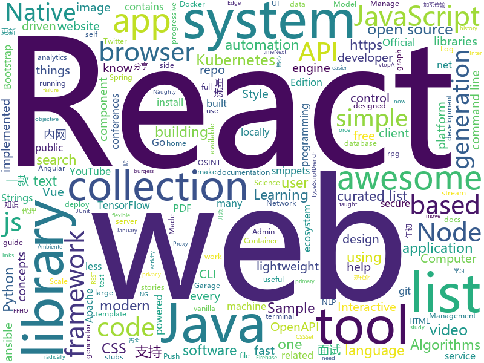

# 2019-02-06
See what the GitHub community is most excited about today.

## python
* [public-apis](https://github.com/toddmotto/public-apis)(**813 stars today**): A collective list of free APIs for use in software and web development.
* [python-cheatsheet](https://github.com/gto76/python-cheatsheet)(**637 stars today**): Comprehensive Python Cheatsheet
* [inter](https://github.com/rsms/inter)(**659 stars today**): The Inter font family
* [stylegan](https://github.com/NVlabs/stylegan)(**182 stars today**): StyleGAN - Official TensorFlow Implementation
* [ffhq-dataset](https://github.com/NVlabs/ffhq-dataset)(**149 stars today**): Flickr-Faces-HQ Dataset (FFHQ)
* [hanabi-learning-environment](https://github.com/deepmind/hanabi-learning-environment)(**113 stars today**): 
* [gita](https://github.com/nosarthur/gita)(**107 stars today**): Manage multiple git repos side by side for sanity
* [QuickDraw](https://github.com/vietnguyen91/QuickDraw)(**100 stars today**): Implementation of Quickdraw - an online game developed by Google
* [XLM](https://github.com/facebookresearch/XLM)(**79 stars today**): PyTorch original implementation of Cross-lingual Language Model Pretraining.
* [apprise](https://github.com/caronc/apprise)(**76 stars today**): Apprise - Push Notifications that work with just about every platform!
* [stanfordnlp](https://github.com/stanfordnlp/stanfordnlp)(**63 stars today**): Official Stanford NLP Python Library for Many Human Languages
* [system-design-primer](https://github.com/donnemartin/system-design-primer)(**47 stars today**): Learn how to design large-scale systems. Prep for the system design interview. Includes Anki flashcards.
* [big-list-of-naughty-strings](https://github.com/minimaxir/big-list-of-naughty-strings)(**47 stars today**): The Big List of Naughty Strings is a list of strings which have a high probability of causing issues when used as user-input data.
* [Photon](https://github.com/s0md3v/Photon)(**45 stars today**): Incredibly fast crawler designed for OSINT.
* [models](https://github.com/tensorflow/models)(**32 stars today**): Models and examples built with TensorFlow
* [ArchiveBox](https://github.com/pirate/ArchiveBox)(**40 stars today**): 🗃The open source self-hosted web archive. Takes browser history/bookmarks/Pocket/Pinboard/etc., saves HTML, JS, PDFs, media, and more...
* [youtube-dl](https://github.com/rg3/youtube-dl)(**38 stars today**): Command-line program to download videos from YouTube.com and other video sites
* [awesome-python](https://github.com/vinta/awesome-python)(**35 stars today**): A curated list of awesome Python frameworks, libraries, software and resources
* [AGENT](https://github.com/UltimateSoftware/AGENT)(**34 stars today**): AI Generation and Exploration in Test
* [ASCII-generator](https://github.com/vietnguyen91/ASCII-generator)(**36 stars today**): ASCII generator (image to text, image to image, video to video)
* [tfjs-object-detection-training](https://github.com/bourdakos1/tfjs-object-detection-training)(**31 stars today**): 🐝
* [tldr](https://github.com/tldr-pages/tldr)(**33 stars today**): 📚Simplified and community-driven man pages
* [twint](https://github.com/twintproject/twint)(**32 stars today**): An advanced Twitter scraping & OSINT tool written in Python that doesn't use Twitter's API, allowing you to scrape a user's followers, following, Tweets and more while evading most API limitations.
* [ansible](https://github.com/ansible/ansible)(**24 stars today**): Ansible is a radically simple IT automation platform that makes your applications and systems easier to deploy. Avoid writing scripts or custom code to deploy and update your applications — automate in a language that approaches plain English, using SSH, with no agents to install on remote systems. https://docs.ansible.com/ansible/
* [home-assistant](https://github.com/home-assistant/home-assistant)(**27 stars today**): 🏡Open source home automation that puts local control and privacy first

## java
* [tutorials](https://github.com/eugenp/tutorials)(**21 stars today**): The "REST With Spring" Course:
* [SmartYouTubeTV](https://github.com/yuliskov/SmartYouTubeTV)(**33 stars today**): Watch YouTube videos on your TV and set-top-box with comfort
* [java-design-patterns](https://github.com/iluwatar/java-design-patterns)(**25 stars today**): Design patterns implemented in Java
* [advanced-java](https://github.com/doocs/advanced-java)(**26 stars today**): 😮互联网 Java 工程师进阶知识完全扫盲
* [Magisk](https://github.com/topjohnwu/Magisk)(**26 stars today**): A Magic Mask to Alter Android System Systemless-ly
* [symphony](https://github.com/b3log/symphony)(**24 stars today**): 🎶一款用 Java 实现的现代化社区（论坛/BBS/社交网络/博客）平台。https://hacpai.com
* [JavaGuide](https://github.com/Snailclimb/JavaGuide)(**21 stars today**): 【Java学习+面试指南】 一份涵盖大部分Java程序员所需要掌握的核心知识。
* [spring-boot](https://github.com/spring-projects/spring-boot)(**17 stars today**): Spring Boot
* [byte-buddy](https://github.com/raphw/byte-buddy)(**20 stars today**): Runtime code generation for the Java virtual machine.
* [Java](https://github.com/TheAlgorithms/Java)(**18 stars today**): All Algorithms implemented in Java
* [elasticsearch](https://github.com/elastic/elasticsearch)(**16 stars today**): Open Source, Distributed, RESTful Search Engine
* [dbeaver](https://github.com/dbeaver/dbeaver)(**18 stars today**): Free universal database tool and SQL client
* [santa-tracker-android](https://github.com/google/santa-tracker-android)(**17 stars today**): Ho Ho Ho
* [resilience4j](https://github.com/resilience4j/resilience4j)(**17 stars today**): Resilience4j is a fault tolerance library designed for Java8 and functional programming
* [x7](https://github.com/x-ream/x7)(**16 stars today**): 
* [parallel-collectors](https://github.com/pivovarit/parallel-collectors)(**16 stars today**): Parallel Collectors is a toolkit easining parallel collection processing in Java using Stream API.
* [jenkins](https://github.com/jenkinsci/jenkins)(**11 stars today**): Jenkins automation server
* [interviews](https://github.com/kdn251/interviews)(**12 stars today**): Everything you need to know to get the job.
* [selenium](https://github.com/SeleniumHQ/selenium)(**12 stars today**): A browser automation framework and ecosystem.
* [testcontainers-java](https://github.com/testcontainers/testcontainers-java)(**13 stars today**): Testcontainers is a Java library that supports JUnit tests, providing lightweight, throwaway instances of common databases, Selenium web browsers, or anything else that can run in a Docker container.
* [flink](https://github.com/apache/flink)(**9 stars today**): Apache Flink
* [spring-framework](https://github.com/spring-projects/spring-framework)(**8 stars today**): Spring Framework
* [kafka](https://github.com/apache/kafka)(**11 stars today**): Mirror of Apache Kafka
* [giffun](https://github.com/guolindev/giffun)(**12 stars today**): 一款开源的GIF在线分享App，乐趣就要和世界分享。
* [algs4](https://github.com/kevin-wayne/algs4)(**11 stars today**): Algorithms, 4th edition textbook code and libraries

## unknown
* [clean-code-typescript](https://github.com/labs42io/clean-code-typescript)(**333 stars today**): Clean Code concepts adapted for TypeScript
* [deep-learning-drizzle](https://github.com/kmario23/deep-learning-drizzle)(**282 stars today**): Drench yourself in Deep Learning, Reinforcement Learning, Machine Learning, Computer Vision, and NLP by learning from these exciting lectures!!
* [awesome-podcasts](https://github.com/rShetty/awesome-podcasts)(**159 stars today**): Collection of awesome podcasts
* [open-source-cs](https://github.com/ForrestKnight/open-source-cs)(**128 stars today**): Video discussing this curriculum:
* [developer-roadmap](https://github.com/kamranahmedse/developer-roadmap)(**106 stars today**): Roadmap to becoming a web developer in 2019
* [computer-science](https://github.com/ossu/computer-science)(**68 stars today**): 🎓Path to a free self-taught education in Computer Science!
* [web-typography-glossary](https://github.com/fontplus/web-typography-glossary)(**62 stars today**): Webタイポグラフィの基礎知識と実践
* [awesome](https://github.com/sindresorhus/awesome)(**54 stars today**): 😎Curated list of awesome lists
* [first-contributions](https://github.com/firstcontributions/first-contributions)(**37 stars today**): 🚀✨Help beginners to contribute to open source projects
* [gitignore](https://github.com/github/gitignore)(**35 stars today**): A collection of useful .gitignore templates
* [coding-interview-university](https://github.com/jwasham/coding-interview-university)(**44 stars today**): A complete computer science study plan to become a software engineer.
* [the-practical-linux-hardening-guide](https://github.com/trimstray/the-practical-linux-hardening-guide)(**42 stars today**): 🔥This guide details the planning and the tools involved in creating a secure Linux production systems - work in progress.
* [free-programming-books](https://github.com/EbookFoundation/free-programming-books)(**36 stars today**): 📚Freely available programming books
* [Intranet_Penetration_Tips](https://github.com/Ridter/Intranet_Penetration_Tips)(**35 stars today**): 2018年初整理的一些内网渗透TIPS，后面更新的慢，所以公开出来希望跟小伙伴们一起更新维护~
* [ambiente-react-native](https://github.com/Rocketseat/ambiente-react-native)(**30 stars today**): Ambiente de desenvolvimento React Native (o PDF foi migrado para cá, leia o README❤️)
* [kubernetes-failure-stories](https://github.com/hjacobs/kubernetes-failure-stories)(**33 stars today**): Compilation of public failure/horror stories related to Kubernetes
* [interview](https://github.com/aylei/interview)(**31 stars today**): 写在19年初的后端社招面试经历🤑
* [CS-Notes](https://github.com/CyC2018/CS-Notes)(**30 stars today**): 📚技术面试必备基础知识
* [the-book-of-secret-knowledge](https://github.com/trimstray/the-book-of-secret-knowledge)(**23 stars today**): ⚡️A collection of awesome lists, manuals, blogs, hacks, one-liners, cli/web tools and more. Especially for System and Network Administrators, DevOps, Pentesters or Security Researchers.
* [awesome-react](https://github.com/enaqx/awesome-react)(**22 stars today**): A collection of awesome things regarding React ecosystem.
* [every-programmer-should-know](https://github.com/mtdvio/every-programmer-should-know)(**22 stars today**): A collection of (mostly) technical things every software developer should know
* [awesome-vue](https://github.com/vuejs/awesome-vue)(**20 stars today**): 🎉A curated list of awesome things related to Vue.js
* [build-your-own-x](https://github.com/danistefanovic/build-your-own-x)(**19 stars today**): 🤓Build your own (insert technology here)
* [hosts](https://github.com/googlehosts/hosts)(**17 stars today**): 镜像：https://coding.net/u/scaffrey/p/hosts/git
* [react-typescript-cheatsheet](https://github.com/sw-yx/react-typescript-cheatsheet)(**19 stars today**): a cheatsheet for react users using typescript with react for the first (or nth!) time

## javascript
* [flexsearch](https://github.com/nextapps-de/flexsearch)(**589 stars today**): Next-Generation full text search library for Browser and Node.js
* [learn-react-app](https://github.com/tyroprogrammer/learn-react-app)(**185 stars today**): Application that will help you learn React fundamentals. Install this application locally - there's tutorial, code snippets and exercises. The main objective of this project is to help you get off the ground with React!
* [react](https://github.com/facebook/react)(**107 stars today**): A declarative, efficient, and flexible JavaScript library for building user interfaces.
* [stylelint](https://github.com/stylelint/stylelint)(**106 stars today**): A mighty, modern style linter
* [vue](https://github.com/vuejs/vue)(**91 stars today**): 🖖Vue.js is a progressive, incrementally-adoptable JavaScript framework for building UI on the web.
* [33-js-concepts](https://github.com/leonardomso/33-js-concepts)(**87 stars today**): 📜33 concepts every JavaScript developer should know.
* [minisearch](https://github.com/lucaong/minisearch)(**85 stars today**): Tiny but powerful fulltext search engine for browser and Node
* [realworld](https://github.com/gothinkster/realworld)(**75 stars today**): "The mother of all demo apps" — Exemplary fullstack Medium.com clone powered by React, Angular, Node, Django, and many more🏅
* [x-spreadsheet](https://github.com/myliang/x-spreadsheet)(**74 stars today**): A web-based JavaScript（canvas） spreadsheet
* [axios](https://github.com/axios/axios)(**60 stars today**): Promise based HTTP client for the browser and node.js
* [ink](https://github.com/vadimdemedes/ink)(**62 stars today**): 🌈React for interactive command-line apps
* [react-rpg.com](https://github.com/ASteinheiser/react-rpg.com)(**62 stars today**): Turn-based, Dungeon-crawling, RPG made with React + Redux. Play it now on http://react-rpg.com
* [github-spray](https://github.com/Annihil/github-spray)(**53 stars today**): 👾Draw on your GitHub contribution graph ░▒▓█
* [autoComplete.js](https://github.com/TarekRaafat/autoComplete.js)(**52 stars today**): Simple autocomplete pure vanilla Javascript library.
* [react-insta-stories](https://github.com/mohitk05/react-insta-stories)(**51 stars today**): A React component for Instagram like stories
* [apexcharts.js](https://github.com/apexcharts/apexcharts.js)(**52 stars today**): 📊Interactive SVG Charts
* [javascript-algorithms](https://github.com/trekhleb/javascript-algorithms)(**45 stars today**): 📝Algorithms and data structures implemented in JavaScript with explanations and links to further readings
* [gatsby](https://github.com/gatsbyjs/gatsby)(**40 stars today**): Build blazing fast, modern apps and websites with React
* [animated-burgers](https://github.com/march08/animated-burgers)(**44 stars today**): Collection of animated burgers for React, also available as HTML+CSS
* [ASO-Google-Play](https://github.com/ayoubfletcher/ASO-Google-Play)(**39 stars today**): 
* [create-react-app](https://github.com/facebook/create-react-app)(**38 stars today**): Set up a modern web app by running one command.
* [puppeteer](https://github.com/GoogleChrome/puppeteer)(**38 stars today**): Headless Chrome Node API
* [nodebestpractices](https://github.com/i0natan/nodebestpractices)(**36 stars today**): The largest Node.js best practices list (January 2019)
* [react-native-magic-move](https://github.com/IjzerenHein/react-native-magic-move)(**37 stars today**): Create magical move transitions between scenes in react-native🐰🎩✨
* [storybook](https://github.com/storybooks/storybook)(**34 stars today**): Interactive UI component dev & test: React, React Native, Vue, Angular, Ember

## html
* [conferences](https://github.com/CSS-Tricks/conferences)(**16 stars today**): A public list of upcoming conferences https://conferences.css-tricks.com/
* [hello-css](https://github.com/Carpetsmoker/hello-css)(**23 stars today**): A CSS template focused on readability
* [spur-template](https://github.com/HackerThemes/spur-template)(**23 stars today**): A Bootstrap Admin Template
* [Spoon-Knife](https://github.com/octocat/Spoon-Knife)(****): This repo is for demonstration purposes only.
* [JavaScript30](https://github.com/wesbos/JavaScript30)(**11 stars today**): 30 Day Vanilla JS Challenge
* [ionic](https://github.com/ionic-team/ionic)(**15 stars today**): Build amazing native and progressive web apps with open web technologies. One app running on everything🎉
* [electron-api-demos](https://github.com/electron/electron-api-demos)(**14 stars today**): Explore the Electron APIs
* [swagger-codegen](https://github.com/swagger-api/swagger-codegen)(**13 stars today**): swagger-codegen contains a template-driven engine to generate documentation, API clients and server stubs in different languages by parsing your OpenAPI / Swagger definition.
* [fastText](https://github.com/facebookresearch/fastText)(**11 stars today**): Library for fast text representation and classification.
* [javascript-tutorial-en](https://github.com/iliakan/javascript-tutorial-en)(**9 stars today**): Modern JavaScript Tutorial
* [terminal.css](https://github.com/Gioni06/terminal.css)(**9 stars today**): Modern and minimalistic CSS framework for terminal enthusiasts
* [AdminLTE](https://github.com/almasaeed2010/AdminLTE)(**7 stars today**): AdminLTE - Free Premium Admin control Panel Theme Based On Bootstrap 3.x
* [blog_os](https://github.com/phil-opp/blog_os)(**8 stars today**): Writing an OS in Rust
* [bulksearch](https://github.com/nextapps-de/bulksearch)(**8 stars today**): Superfast, lightweight and read-write optimized full text search library.
* [openapi-generator](https://github.com/OpenAPITools/openapi-generator)(**5 stars today**): OpenAPI Generator allows generation of API client libraries (SDK generation), server stubs, documentation and configuration automatically given an OpenAPI Spec (v2, v3)
* [styleguide](https://github.com/google/styleguide)(**5 stars today**): Style guides for Google-originated open-source projects
* [pitstop](https://github.com/EdwinVW/pitstop)(**6 stars today**): This repo contains a sample application based on a Garage Management System for PitStop - a fictitious garage. The primary goal of this sample is to demonstrate several Web-Scale Architecture concepts like: Microservices, CQRS, Event Sourcing, Domain Driven Design (DDD), Eventual Consistency.
* [CLRS](https://github.com/walkccc/CLRS)(**6 stars today**): 📚Solutions to Introduction to Algorithms Third Edition
* [BFU-leaf](https://github.com/bljx/BFU-leaf)(**6 stars today**): 北京林业大学信息学院课程攻略
* [quickstart-js](https://github.com/firebase/quickstart-js)(**5 stars today**): Firebase Quickstart Samples for Web
* [30-seconds-of-css](https://github.com/30-seconds/30-seconds-of-css)(**5 stars today**): A curated collection of useful CSS snippets you can understand in 30 seconds or less.
* [pipelines-dotnet-core](https://github.com/MicrosoftDocs/pipelines-dotnet-core)(****): Sample .NET core app for Azure Pipelines docs
* [all-contributors](https://github.com/all-contributors/all-contributors)(**5 stars today**): ✨Recognize all contributors, not just the ones who push code✨
* [ha-floorplan](https://github.com/pkozul/ha-floorplan)(**5 stars today**): Floorplan for Home Assistant
* [3d-force-graph](https://github.com/vasturiano/3d-force-graph)(**5 stars today**): 3D force-directed graph component using ThreeJS/WebGL

## go
* [gitin](https://github.com/isacikgoz/gitin)(**471 stars today**): commit/branch/workdir explorer for git
* [k9s](https://github.com/derailed/k9s)(**153 stars today**): 🐶Kubernetes CLI To Manage Your Clusters In Style!
* [istio](https://github.com/istio/istio)(**120 stars today**): Connect, secure, control, and observe services.
* [gotop](https://github.com/cjbassi/gotop)(**84 stars today**): A terminal based graphical activity monitor inspired by gtop and vtop
* [kube-capacity](https://github.com/robscott/kube-capacity)(**70 stars today**): A simple CLI that provides an overview of the resource requests, limits, and utilization in a Kubernetes cluster
* [massivedl](https://github.com/dimkouv/massivedl)(**43 stars today**): Download a large list of files in parallel
* [kubernetes](https://github.com/kubernetes/kubernetes)(**37 stars today**): Production-Grade Container Scheduling and Management
* [aresdb](https://github.com/uber/aresdb)(**39 stars today**): A GPU-powered real-time analytics storage and query engine.
* [vault](https://github.com/hashicorp/vault)(**36 stars today**): A tool for secrets management, encryption as a service, and privileged access management
* [k3s](https://github.com/ibuildthecloud/k3s)(**34 stars today**): 5 less then k8s. Lightweight Kubernetes.
* [syncthing](https://github.com/syncthing/syncthing)(**33 stars today**): Open Source Continuous File Synchronization
* [go](https://github.com/golang/go)(**29 stars today**): The Go programming language
* [nps](https://github.com/cnlh/nps)(**27 stars today**): 一款轻量级、功能强大的内网穿透代理服务器。支持tcp、udp流量转发，支持内网http代理、内网socks5代理，同时支持snappy压缩（节省带宽和流量）、站点保护、加密传输、多路复用、header修改等。支持web图形化管理。
* [mkcert](https://github.com/FiloSottile/mkcert)(**27 stars today**): A simple zero-config tool to make locally trusted development certificates with any names you'd like.
* [dive](https://github.com/wagoodman/dive)(**28 stars today**): A tool for exploring each layer in a docker image
* [v2ray-core](https://github.com/v2ray/v2ray-core)(**24 stars today**): A platform for building proxies to bypass network restrictions.
* [awesome-go](https://github.com/avelino/awesome-go)(**23 stars today**): A curated list of awesome Go frameworks, libraries and software
* [helm](https://github.com/helm/helm)(**20 stars today**): The Kubernetes Package Manager
* [faas](https://github.com/openfaas/faas)(**22 stars today**): OpenFaaS - Serverless Functions Made Simple
* [hugo](https://github.com/gohugoio/hugo)(**21 stars today**): The world’s fastest framework for building websites.
* [traefik](https://github.com/containous/traefik)(**21 stars today**): The Cloud Native Edge Router
* [Modlishka](https://github.com/drk1wi/Modlishka)(**19 stars today**): Modlishka. Reverse Proxy. Phishing NG.
* [utern](https://github.com/knqyf263/utern)(**20 stars today**): Multi group and stream log tailing for AWS CloudWatch Logs.
* [fzf](https://github.com/junegunn/fzf)(**19 stars today**): 🌸A command-line fuzzy finder
* [fathom](https://github.com/usefathom/fathom)(**19 stars today**): Fathom. Simple, trustworthy website analytics. Built with Golang & Preact.

## WordCloud

