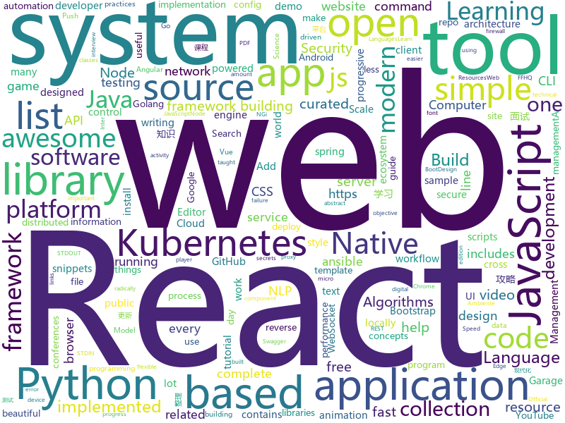

# 2019-02-07
See what the GitHub community is most excited about today.

## python
* [inter](https://github.com/rsms/inter)(**756 stars today**): The Inter font family
* [stylegan](https://github.com/NVlabs/stylegan)(**496 stars today**): StyleGAN - Official TensorFlow Implementation
* [public-apis](https://github.com/toddmotto/public-apis)(**466 stars today**): A collective list of free APIs for use in software and web development.
* [python-cheatsheet](https://github.com/gto76/python-cheatsheet)(**386 stars today**): Comprehensive Python Cheatsheet
* [XLM](https://github.com/facebookresearch/XLM)(**126 stars today**): PyTorch original implementation of Cross-lingual Language Model Pretraining.
* [ffhq-dataset](https://github.com/NVlabs/ffhq-dataset)(**105 stars today**): Flickr-Faces-HQ Dataset (FFHQ)
* [flowblade](https://github.com/jliljebl/flowblade)(**89 stars today**): Video Editor for Linux
* [QuickDraw](https://github.com/vietnguyen91/QuickDraw)(**85 stars today**): Implementation of Quickdraw - an online game developed by Google
* [modin](https://github.com/modin-project/modin)(**67 stars today**): Modin: Speed up your Pandas workflows by changing a single line of code
* [stanfordnlp](https://github.com/stanfordnlp/stanfordnlp)(**65 stars today**): Official Stanford NLP Python Library for Many Human Languages
* [system-design-primer](https://github.com/donnemartin/system-design-primer)(**60 stars today**): Learn how to design large-scale systems. Prep for the system design interview. Includes Anki flashcards.
* [armory](https://github.com/depthsecurity/armory)(**63 stars today**): Armory is a tool meant to take in a lot of external and discovery data from a lot of tools, add it to a database and correlate all of related information.
* [python-systemd-tutorial](https://github.com/torfsen/python-systemd-tutorial)(**57 stars today**): A tutorial for writing a systemd service in Python
* [hanabi-learning-environment](https://github.com/deepmind/hanabi-learning-environment)(**57 stars today**): 
* [apprise](https://github.com/caronc/apprise)(**47 stars today**): Apprise - Push Notifications that work with just about every platform!
* [models](https://github.com/tensorflow/models)(**32 stars today**): Models and examples built with TensorFlow
* [awesome-python](https://github.com/vinta/awesome-python)(**38 stars today**): A curated list of awesome Python frameworks, libraries, software and resources
* [keras](https://github.com/keras-team/keras)(**34 stars today**): Deep Learning for humans
* [youtube-dl](https://github.com/rg3/youtube-dl)(**36 stars today**): Command-line program to download videos from YouTube.com and other video sites
* [ray](https://github.com/ray-project/ray)(**34 stars today**): A system for parallel and distributed Python that unifies the ML ecosystem.
* [flair](https://github.com/zalandoresearch/flair)(**32 stars today**): A very simple framework for state-of-the-art Natural Language Processing (NLP)
* [ansible](https://github.com/ansible/ansible)(**25 stars today**): Ansible is a radically simple IT automation platform that makes your applications and systems easier to deploy. Avoid writing scripts or custom code to deploy and update your applications — automate in a language that approaches plain English, using SSH, with no agents to install on remote systems. https://docs.ansible.com/ansible/
* [face_recognition](https://github.com/ageitgey/face_recognition)(**29 stars today**): The world's simplest facial recognition api for Python and the command line
* [Python](https://github.com/TheAlgorithms/Python)(**28 stars today**): All Algorithms implemented in Python
* [flask](https://github.com/pallets/flask)(****): The Python micro framework for building web applications.

## java
* [h4cker](https://github.com/The-Art-of-Hacking/h4cker)(**290 stars today**): This repository is primarily maintained by Omar Santos and includes resources related to ethical hacking / penetration testing, digital forensics and incident response (DFIR), vulnerability research, exploit development, reverse engineering, and more.
* [nopen](https://github.com/JakeWharton/nopen)(**99 stars today**): An error-prone checker which requires that classes be final, abstract or annotated with @ Open.
* [tutorials](https://github.com/eugenp/tutorials)(**20 stars today**): The "REST With Spring" Course:
* [advanced-java](https://github.com/doocs/advanced-java)(**31 stars today**): 😮互联网 Java 工程师进阶知识完全扫盲
* [symphony](https://github.com/b3log/symphony)(**27 stars today**): 🎶一款用 Java 实现的现代化社区（论坛/BBS/社交网络/博客）平台。https://hacpai.com
* [Java](https://github.com/TheAlgorithms/Java)(**22 stars today**): All Algorithms implemented in Java
* [Magisk](https://github.com/topjohnwu/Magisk)(**25 stars today**): A Magic Mask to Alter Android System Systemless-ly
* [elasticsearch](https://github.com/elastic/elasticsearch)(**21 stars today**): Open Source, Distributed, RESTful Search Engine
* [spring-boot](https://github.com/spring-projects/spring-boot)(**16 stars today**): Spring Boot
* [java-design-patterns](https://github.com/iluwatar/java-design-patterns)(**21 stars today**): Design patterns implemented in Java
* [JavaGuide](https://github.com/Snailclimb/JavaGuide)(**20 stars today**): 【Java学习+面试指南】 一份涵盖大部分Java程序员所需要掌握的核心知识。
* [x7](https://github.com/x-ream/x7)(**21 stars today**): 
* [Game](https://github.com/Open-RSC/Game)(**19 stars today**): Open RSC game code
* [spring-framework](https://github.com/spring-projects/spring-framework)(**15 stars today**): Spring Framework
* [strimzi-kafka-operator](https://github.com/strimzi/strimzi-kafka-operator)(**17 stars today**): Apache Kafka running on Kubernetes and OpenShift
* [SmartYouTubeTV](https://github.com/yuliskov/SmartYouTubeTV)(**14 stars today**): Watch YouTube videos on your TV and set-top-box with comfort
* [dagger-reflect](https://github.com/JakeWharton/dagger-reflect)(**15 stars today**): A reflection-based implementation of the Dagger dependency injection library.
* [datashare](https://github.com/ICIJ/datashare)(**14 stars today**): Better analyze information, in all its forms
* [kboard](https://github.com/adgad/kboard)(**13 stars today**): Android keyboard for fast responses
* [santa-tracker-android](https://github.com/google/santa-tracker-android)(**13 stars today**): Ho Ho Ho
* [Signal-Android](https://github.com/signalapp/Signal-Android)(**12 stars today**): A private messenger for Android.
* [resilience4j](https://github.com/resilience4j/resilience4j)(**12 stars today**): Resilience4j is a fault tolerance library designed for Java8 and functional programming
* [selenium](https://github.com/SeleniumHQ/selenium)(**10 stars today**): A browser automation framework and ecosystem.
* [algs4](https://github.com/kevin-wayne/algs4)(**12 stars today**): Algorithms, 4th edition textbook code and libraries
* [RIBs](https://github.com/uber/RIBs)(**10 stars today**): Uber's cross-platform mobile architecture framework.

## unknown
* [deep-learning-drizzle](https://github.com/kmario23/deep-learning-drizzle)(**143 stars today**): Drench yourself in Deep Learning, Reinforcement Learning, Machine Learning, Computer Vision, and NLP by learning from these exciting lectures!!
* [developer-roadmap](https://github.com/kamranahmedse/developer-roadmap)(**136 stars today**): Roadmap to becoming a web developer in 2019
* [awesome-podcasts](https://github.com/rShetty/awesome-podcasts)(**133 stars today**): Collection of awesome podcasts
* [open-source-cs](https://github.com/ForrestKnight/open-source-cs)(**110 stars today**): Video discussing this curriculum:
* [awesome](https://github.com/sindresorhus/awesome)(**80 stars today**): 😎Curated list of awesome lists
* [awesome-dotnet-security](https://github.com/guardrailsio/awesome-dotnet-security)(**71 stars today**): Awesome .NET Security Resources
* [web-typography-glossary](https://github.com/fontplus/web-typography-glossary)(**63 stars today**): Webタイポグラフィの基礎知識と実践
* [gitignore](https://github.com/github/gitignore)(**42 stars today**): A collection of useful .gitignore templates
* [free-programming-books](https://github.com/EbookFoundation/free-programming-books)(**45 stars today**): 📚Freely available programming books
* [coding-interview-university](https://github.com/jwasham/coding-interview-university)(**40 stars today**): A complete computer science study plan to become a software engineer.
* [Intranet_Penetration_Tips](https://github.com/Ridter/Intranet_Penetration_Tips)(**49 stars today**): 2018年初整理的一些内网渗透TIPS，后面更新的慢，所以公开出来希望跟小伙伴们一起更新维护~
* [computer-science](https://github.com/ossu/computer-science)(**43 stars today**): 🎓Path to a free self-taught education in Computer Science!
* [CS-Notes](https://github.com/CyC2018/CS-Notes)(**39 stars today**): 📚技术面试必备基础知识
* [the-practical-linux-hardening-guide](https://github.com/trimstray/the-practical-linux-hardening-guide)(**41 stars today**): 🔥This guide details the planning and the tools involved in creating a secure Linux production systems - work in progress.
* [kubernetes-failure-stories](https://github.com/hjacobs/kubernetes-failure-stories)(**38 stars today**): Compilation of public failure/horror stories related to Kubernetes
* [first-contributions](https://github.com/firstcontributions/first-contributions)(**23 stars today**): 🚀✨Help beginners to contribute to open source projects
* [awesome-python-security](https://github.com/guardrailsio/awesome-python-security)(**31 stars today**): Awesome Python Security resources🕶🐍🔐
* [kubernetes-the-hard-way](https://github.com/kelseyhightower/kubernetes-the-hard-way)(**24 stars today**): Bootstrap Kubernetes the hard way on Google Cloud Platform. No scripts.
* [ambiente-react-native](https://github.com/Rocketseat/ambiente-react-native)(**21 stars today**): Ambiente de desenvolvimento React Native (o PDF foi migrado para cá, leia o README❤️)
* [build-your-own-x](https://github.com/danistefanovic/build-your-own-x)(**25 stars today**): 🤓Build your own (insert technology here)
* [awesome-haxe-gamedev](https://github.com/Dvergar/awesome-haxe-gamedev)(**24 stars today**): Resources for game development on haxe
* [HyperDL-Tutorial](https://github.com/zeusees/HyperDL-Tutorial)(**23 stars today**): 深度学习教程整理 | 干货
* [every-programmer-should-know](https://github.com/mtdvio/every-programmer-should-know)(**21 stars today**): A collection of (mostly) technical things every software developer should know
* [nginx-quick-reference](https://github.com/trimstray/nginx-quick-reference)(**21 stars today**): This notes describes how to improve Nginx performance, security and other important things.
* [the-book-of-secret-knowledge](https://github.com/trimstray/the-book-of-secret-knowledge)(**20 stars today**): ⚡️A collection of awesome lists, manuals, blogs, hacks, one-liners, cli/web tools and more. Especially for System and Network Administrators, DevOps, Pentesters or Security Researchers.

## javascript
* [github-history](https://github.com/pomber/github-history)(**921 stars today**): Browse the history of any file from GitHub with style
* [not-paid](https://github.com/kleampa/not-paid)(**728 stars today**): Client did not pay? Add opacity to the body tag and increase it every day until their site completely fades away
* [flexsearch](https://github.com/nextapps-de/flexsearch)(**271 stars today**): Next-Generation full text search library for Browser and Node.js
* [apexcharts.js](https://github.com/apexcharts/apexcharts.js)(**171 stars today**): 📊Interactive SVG Charts
* [react](https://github.com/facebook/react)(**138 stars today**): A declarative, efficient, and flexible JavaScript library for building user interfaces.
* [react-testing-library](https://github.com/kentcdodds/react-testing-library)(**118 stars today**): 🐐Simple and complete React DOM testing utilities that encourage good testing practices.
* [learn-react-app](https://github.com/tyroprogrammer/learn-react-app)(**114 stars today**): Application that will help you learn React fundamentals. Install this application locally - there's tutorial, code snippets and exercises. The main objective of this project is to help you get off the ground with React!
* [vue](https://github.com/vuejs/vue)(**91 stars today**): 🖖Vue.js is a progressive, incrementally-adoptable JavaScript framework for building UI on the web.
* [typeit](https://github.com/alexmacarthur/typeit)(**76 stars today**): The most versatile JavaScript animated typing utility on the planet.
* [anime](https://github.com/juliangarnier/anime)(**70 stars today**): JavaScript animation engine
* [create-react-app](https://github.com/facebook/create-react-app)(**55 stars today**): Set up a modern web app by running one command.
* [mercury-parser](https://github.com/postlight/mercury-parser)(**62 stars today**): 📜Extracting content from the chaos of the web.
* [realworld](https://github.com/gothinkster/realworld)(**52 stars today**): "The mother of all demo apps" — Exemplary fullstack Medium.com clone powered by React, Angular, Node, Django, and many more🏅
* [gatsby](https://github.com/gatsbyjs/gatsby)(**44 stars today**): Build blazing fast, modern apps and websites with React
* [next.js](https://github.com/zeit/next.js)(**47 stars today**): The React Framework
* [storybook](https://github.com/storybooks/storybook)(**47 stars today**): Interactive UI component dev & test: React, React Native, Vue, Angular, Ember
* [react-native](https://github.com/facebook/react-native)(**42 stars today**): A framework for building native apps with React.
* [react-spring](https://github.com/react-spring/react-spring)(**46 stars today**): ✌️A spring physics based React animation library
* [stylelint](https://github.com/stylelint/stylelint)(**46 stars today**): A mighty, modern style linter
* [axios](https://github.com/axios/axios)(**44 stars today**): Promise based HTTP client for the browser and node.js
* [clean-code-javascript](https://github.com/tureey/clean-code-javascript)(**46 stars today**): 🛁Clean Code concepts adapted for JavaScript
* [node](https://github.com/nodejs/node)(**39 stars today**): Node.js JavaScript runtime✨🐢🚀✨
* [nuclear](https://github.com/nukeop/nuclear)(**45 stars today**): Desktop music player for streaming from free sources
* [javascript-algorithms](https://github.com/trekhleb/javascript-algorithms)(**40 stars today**): 📝Algorithms and data structures implemented in JavaScript with explanations and links to further readings
* [puppeteer](https://github.com/GoogleChrome/puppeteer)(**41 stars today**): Headless Chrome Node API

## html
* [Spoon-Knife](https://github.com/octocat/Spoon-Knife)(****): This repo is for demonstration purposes only.
* [JavaScript30](https://github.com/wesbos/JavaScript30)(**15 stars today**): 30 Day Vanilla JS Challenge
* [nginxconfig.io](https://github.com/valentinxxx/nginxconfig.io)(**19 stars today**): ⚙️NGiИX config generator on steroids💉
* [ionic](https://github.com/ionic-team/ionic)(**12 stars today**): Build amazing native and progressive web apps with open web technologies. One app running on everything🎉
* [PoCBox](https://github.com/gh0stkey/PoCBox)(**15 stars today**): PoCBox - 漏洞测试验证辅助平台
* [AdminLTE](https://github.com/almasaeed2010/AdminLTE)(**12 stars today**): AdminLTE - Free Premium Admin control Panel Theme Based On Bootstrap 3.x
* [swagger-codegen](https://github.com/swagger-api/swagger-codegen)(**12 stars today**): swagger-codegen contains a template-driven engine to generate documentation, API clients and server stubs in different languages by parsing your OpenAPI / Swagger definition.
* [30-seconds-of-css](https://github.com/30-seconds/30-seconds-of-css)(**13 stars today**): A curated collection of useful CSS snippets you can understand in 30 seconds or less.
* [conferences](https://github.com/CSS-Tricks/conferences)(**9 stars today**): A public list of upcoming conferences https://conferences.css-tricks.com/
* [beautiful-jekyll](https://github.com/daattali/beautiful-jekyll)(**6 stars today**): ✨Build a beautiful and simple website in literally minutes. Demo at http://deanattali.com/beautiful-jekyll
* [all-contributors](https://github.com/all-contributors/all-contributors)(**11 stars today**): ✨Recognize all contributors, not just the ones who push code✨
* [fastText](https://github.com/facebookresearch/fastText)(**10 stars today**): Library for fast text representation and classification.
* [javascript-tutorial-en](https://github.com/iliakan/javascript-tutorial-en)(**9 stars today**): Modern JavaScript Tutorial
* [styleguide](https://github.com/google/styleguide)(**8 stars today**): Style guides for Google-originated open-source projects
* [wysiwyg-editor](https://github.com/froala/wysiwyg-editor)(**9 stars today**): A beautifully designed WYSIWYG HTML Editor based on HTML5.
* [pitstop](https://github.com/EdwinVW/pitstop)(**8 stars today**): This repo contains a sample application based on a Garage Management System for PitStop - a fictitious garage. The primary goal of this sample is to demonstrate several Web-Scale Architecture concepts like: Microservices, CQRS, Event Sourcing, Domain Driven Design (DDD), Eventual Consistency.
* [WebFundamentals](https://github.com/google/WebFundamentals)(**7 stars today**): Best practices for modern web development
* [twofactorauth](https://github.com/2factorauth/twofactorauth)(**7 stars today**): List of sites with two factor auth support which includes SMS, email, phone calls, hardware, and software.
* [ecma262](https://github.com/tc39/ecma262)(**7 stars today**): Status, process, and documents for ECMA262
* [blog_os](https://github.com/phil-opp/blog_os)(**7 stars today**): Writing an OS in Rust
* [zju-icicles](https://github.com/QSCTech/zju-icicles)(**7 stars today**): 浙江大学课程攻略共享计划
* [BFU-leaf](https://github.com/bljx/BFU-leaf)(**7 stars today**): 北京林业大学信息学院课程攻略
* [electron-api-demos](https://github.com/electron/electron-api-demos)(**6 stars today**): Explore the Electron APIs
* [github-markdown-css](https://github.com/sindresorhus/github-markdown-css)(**6 stars today**): The minimal amount of CSS to replicate the GitHub Markdown style
* [web-starter-kit](https://github.com/google/web-starter-kit)(**6 stars today**): Web Starter Kit - a workflow for multi-device websites

## go
* [gitin](https://github.com/isacikgoz/gitin)(**345 stars today**): commit/branch/workdir explorer for git
* [gotop](https://github.com/cjbassi/gotop)(**216 stars today**): A terminal based graphical activity monitor inspired by gtop and vtop
* [k9s](https://github.com/derailed/k9s)(**83 stars today**): 🐶Kubernetes CLI To Manage Your Clusters In Style!
* [syncthing](https://github.com/syncthing/syncthing)(**45 stars today**): Open Source Continuous File Synchronization
* [kubernetes](https://github.com/kubernetes/kubernetes)(**40 stars today**): Production-Grade Container Scheduling and Management
* [vault](https://github.com/hashicorp/vault)(**41 stars today**): A tool for secrets management, encryption as a service, and privileged access management
* [kube-capacity](https://github.com/robscott/kube-capacity)(**37 stars today**): A simple CLI that provides an overview of the resource requests, limits, and utilization in a Kubernetes cluster
* [hugo](https://github.com/gohugoio/hugo)(**31 stars today**): The world’s fastest framework for building websites.
* [v2ray-core](https://github.com/v2ray/v2ray-core)(**28 stars today**): A platform for building proxies to bypass network restrictions.
* [istio](https://github.com/istio/istio)(**29 stars today**): Connect, secure, control, and observe services.
* [go](https://github.com/golang/go)(**30 stars today**): The Go programming language
* [awesome-go](https://github.com/avelino/awesome-go)(**26 stars today**): A curated list of awesome Go frameworks, libraries and software
* [mkcert](https://github.com/FiloSottile/mkcert)(**28 stars today**): A simple zero-config tool to make locally trusted development certificates with any names you'd like.
* [aresdb](https://github.com/uber/aresdb)(**28 stars today**): A GPU-powered real-time analytics storage and query engine.
* [dive](https://github.com/wagoodman/dive)(**27 stars today**): A tool for exploring each layer in a docker image
* [virtualbox-go](https://github.com/uruddarraju/virtualbox-go)(**25 stars today**): Most complete golang library for virtualbox
* [fzf](https://github.com/junegunn/fzf)(**23 stars today**): 🌸A command-line fuzzy finder
* [k3s](https://github.com/ibuildthecloud/k3s)(**23 stars today**): 5 less then k8s. Lightweight Kubernetes.
* [frp](https://github.com/fatedier/frp)(**22 stars today**): A fast reverse proxy to help you expose a local server behind a NAT or firewall to the internet.
* [faas](https://github.com/openfaas/faas)(**21 stars today**): OpenFaaS - Serverless Functions Made Simple
* [mattermost-server](https://github.com/mattermost/mattermost-server)(**20 stars today**): Open source Slack-alternative in Golang and React - Mattermost
* [bettercap](https://github.com/bettercap/bettercap)(**20 stars today**): The Swiss Army knife for 802.11, BLE and Ethernet networks reconnaissance and MITM attacks.
* [roadrunner](https://github.com/spiral/roadrunner)(**20 stars today**): High-performance PHP application server, load-balancer and process manager written in Golang
* [traefik](https://github.com/containous/traefik)(**19 stars today**): The Cloud Native Edge Router
* [websocketd](https://github.com/joewalnes/websocketd)(**18 stars today**): Turn any program that uses STDIN/STDOUT into a WebSocket server. Like inetd, but for WebSockets.

## WordCloud

