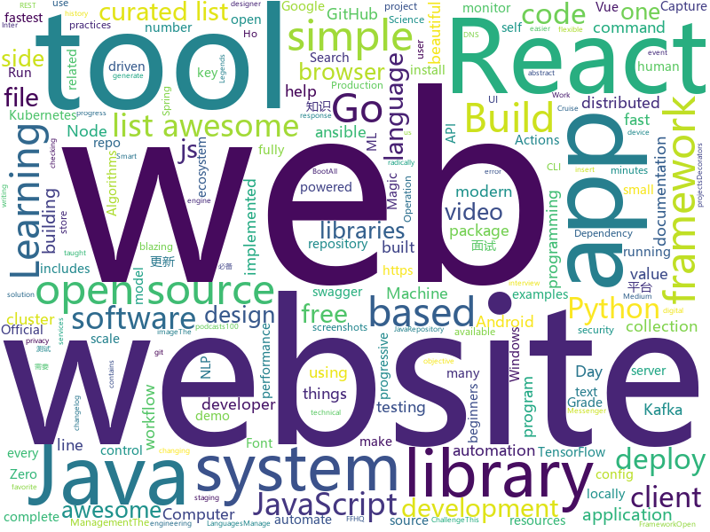

# 2019-02-09
See what the GitHub community is most excited about today.

## python
* [clusterfuzz](https://github.com/google/clusterfuzz)(**890 stars today**): All your bug are belong to us.
* [public-apis](https://github.com/toddmotto/public-apis)(**290 stars today**): A collective list of free APIs for use in software and web development.
* [python-cheatsheet](https://github.com/gto76/python-cheatsheet)(**172 stars today**): Comprehensive Python Cheatsheet
* [stylegan](https://github.com/NVlabs/stylegan)(**135 stars today**): StyleGAN - Official TensorFlow Implementation
* [inter](https://github.com/rsms/inter)(**83 stars today**): The Inter font family
* [Python](https://github.com/TheAlgorithms/Python)(**62 stars today**): All Algorithms implemented in Python
* [awesome-python](https://github.com/vinta/awesome-python)(**51 stars today**): A curated list of awesome Python frameworks, libraries, software and resources
* [system-design-primer](https://github.com/donnemartin/system-design-primer)(**46 stars today**): Learn how to design large-scale systems. Prep for the system design interview. Includes Anki flashcards.
* [modin](https://github.com/modin-project/modin)(**39 stars today**): Modin: Speed up your Pandas workflows by changing a single line of code
* [models](https://github.com/tensorflow/models)(**25 stars today**): Models and examples built with TensorFlow
* [youtube-dl](https://github.com/rg3/youtube-dl)(**33 stars today**): Command-line program to download videos from YouTube.com and other video sites
* [keras](https://github.com/keras-team/keras)(**28 stars today**): Deep Learning for humans
* [home-assistant](https://github.com/home-assistant/home-assistant)(**29 stars today**): 🏡Open source home automation that puts local control and privacy first
* [awesome-machine-learning](https://github.com/josephmisiti/awesome-machine-learning)(**28 stars today**): A curated list of awesome Machine Learning frameworks, libraries and software.
* [django](https://github.com/django/django)(**24 stars today**): The Web framework for perfectionists with deadlines.
* [XLM](https://github.com/facebookresearch/XLM)(**28 stars today**): PyTorch original implementation of Cross-lingual Language Model Pretraining.
* [bert](https://github.com/google-research/bert)(**25 stars today**): TensorFlow code and pre-trained models for BERT
* [ImageNet-Adversarial-Training](https://github.com/facebookresearch/ImageNet-Adversarial-Training)(**28 stars today**): Feature Denoising for Improving Adversarial Robustness
* [stanfordnlp](https://github.com/stanfordnlp/stanfordnlp)(**26 stars today**): Official Stanford NLP Python Library for Many Human Languages
* [gita](https://github.com/nosarthur/gita)(**25 stars today**): Manage multiple git repos side by side for sanity
* [leaguedirector](https://github.com/RiotGames/leaguedirector)(**25 stars today**): League Director is a tool for staging and recording videos from League of Legends replays
* [ffhq-dataset](https://github.com/NVlabs/ffhq-dataset)(**24 stars today**): Flickr-Faces-HQ Dataset (FFHQ)
* [ansible](https://github.com/ansible/ansible)(**12 stars today**): Ansible is a radically simple IT automation platform that makes your applications and systems easier to deploy. Avoid writing scripts or custom code to deploy and update your applications — automate in a language that approaches plain English, using SSH, with no agents to install on remote systems. https://docs.ansible.com/ansible/
* [ray](https://github.com/ray-project/ray)(**23 stars today**): A system for parallel and distributed Python that unifies the ML ecosystem.
* [flask](https://github.com/pallets/flask)(****): The Python micro framework for building web applications.

## java
* [h4cker](https://github.com/The-Art-of-Hacking/h4cker)(**182 stars today**): This repository is primarily maintained by Omar Santos and includes resources related to ethical hacking / penetration testing, digital forensics and incident response (DFIR), vulnerability research, exploit development, reverse engineering, and more.
* [messenger-app-android](https://github.com/mesibo/messenger-app-android)(**137 stars today**): Open Source Messenger App For Android - Real-time Messaging, Voice and Video Calls
* [tutorials](https://github.com/eugenp/tutorials)(**22 stars today**): The "REST With Spring" Course:
* [JavaGuide](https://github.com/Snailclimb/JavaGuide)(**30 stars today**): 【Java学习+面试指南】 一份涵盖大部分Java程序员所需要掌握的核心知识。
* [java-design-patterns](https://github.com/iluwatar/java-design-patterns)(**25 stars today**): Design patterns implemented in Java
* [spring-boot](https://github.com/spring-projects/spring-boot)(**19 stars today**): Spring Boot
* [Java](https://github.com/TheAlgorithms/Java)(**21 stars today**): All Algorithms implemented in Java
* [advanced-java](https://github.com/doocs/advanced-java)(**21 stars today**): 😮互联网 Java 工程师进阶知识完全扫盲
* [spring-framework](https://github.com/spring-projects/spring-framework)(**20 stars today**): Spring Framework
* [elasticsearch](https://github.com/elastic/elasticsearch)(**20 stars today**): Open Source, Distributed, RESTful Search Engine
* [guava](https://github.com/google/guava)(**18 stars today**): Google core libraries for Java
* [android-ConstraintLayoutExamples](https://github.com/googlesamples/android-ConstraintLayoutExamples)(**18 stars today**): Repository of examples that showcase the various features of ConstraintLayout
* [flink](https://github.com/apache/flink)(**15 stars today**): Apache Flink
* [Magisk](https://github.com/topjohnwu/Magisk)(**17 stars today**): A Magic Mask to Alter Android System Systemless-ly
* [symphony](https://github.com/b3log/symphony)(**15 stars today**): 🎶一款用 Java 实现的现代化社区（论坛/BBS/社交网络/博客）平台。https://hacpai.com
* [x7](https://github.com/x-ream/x7)(**15 stars today**): 
* [nopen](https://github.com/JakeWharton/nopen)(**15 stars today**): An error-prone checker which requires that classes be final, abstract or annotated with @ Open.
* [Telegram](https://github.com/DrKLO/Telegram)(**13 stars today**): Telegram for Android source
* [RxJava](https://github.com/ReactiveX/RxJava)(**14 stars today**): RxJava – Reactive Extensions for the JVM – a library for composing asynchronous and event-based programs using observable sequences for the Java VM.
* [santa-tracker-android](https://github.com/google/santa-tracker-android)(**14 stars today**): Ho Ho Ho
* [selenium](https://github.com/SeleniumHQ/selenium)(**13 stars today**): A browser automation framework and ecosystem.
* [dbeaver](https://github.com/dbeaver/dbeaver)(**13 stars today**): Free universal database tool and SQL client
* [fescar](https://github.com/alibaba/fescar)(**12 stars today**): 🔥Fescar is an easy-to-use, high-performance, java based, open source distributed transaction solution.
* [graal](https://github.com/oracle/graal)(**12 stars today**): GraalVM: Run Programs Faster Anywhere🚀
* [cruise-control](https://github.com/linkedin/cruise-control)(**11 stars today**): Cruise-control is the first of its kind to fully automate the dynamic workload rebalance and self-healing of a kafka cluster. It provides great value to Kafka users by simplifying the operation of Kafka clusters.

## unknown
* [nginx-quick-reference](https://github.com/trimstray/nginx-quick-reference)(**1,367 stars today**): ⚡️This notes describes how to improve Nginx performance, security and other important things.
* [developer-roadmap](https://github.com/kamranahmedse/developer-roadmap)(**152 stars today**): Roadmap to becoming a web developer in 2019
* [open-source-cs](https://github.com/ForrestKnight/open-source-cs)(**101 stars today**): Video discussing this curriculum:
* [awesome](https://github.com/sindresorhus/awesome)(**69 stars today**): 😎Curated list of awesome lists
* [design-patterns](https://github.com/saladpuk/design-patterns)(**58 stars today**): 
* [first-contributions](https://github.com/firstcontributions/first-contributions)(**26 stars today**): 🚀✨Help beginners to contribute to open source projects
* [gitignore](https://github.com/github/gitignore)(**36 stars today**): A collection of useful .gitignore templates
* [coding-interview-university](https://github.com/jwasham/coding-interview-university)(**41 stars today**): A complete computer science study plan to become a software engineer.
* [computer-science](https://github.com/ossu/computer-science)(**43 stars today**): 🎓Path to a free self-taught education in Computer Science!
* [free-programming-books](https://github.com/EbookFoundation/free-programming-books)(**39 stars today**): 📚Freely available programming books
* [awesome-podcasts](https://github.com/rShetty/awesome-podcasts)(**42 stars today**): Collection of awesome podcasts
* [100-Days-Of-ML-Code](https://github.com/Avik-Jain/100-Days-Of-ML-Code)(**36 stars today**): 100 Days of ML Coding
* [the-book-of-secret-knowledge](https://github.com/trimstray/the-book-of-secret-knowledge)(**35 stars today**): ⛔️A collection of awesome lists, manuals, blogs, hacks, one-liners, cli/web tools and more. Especially for System and Network Administrators, DevOps, Pentesters or Security Researchers.
* [CS-Notes](https://github.com/CyC2018/CS-Notes)(**29 stars today**): 📚技术面试必备基础知识
* [awesome-react-hooks](https://github.com/rehooks/awesome-react-hooks)(**33 stars today**): Awesome React Hooks
* [deep-learning-drizzle](https://github.com/kmario23/deep-learning-drizzle)(**32 stars today**): Drench yourself in Deep Learning, Reinforcement Learning, Machine Learning, Computer Vision, and NLP by learning from these exciting lectures!!
* [can-i-take-over-xyz](https://github.com/EdOverflow/can-i-take-over-xyz)(**29 stars today**): "Can I take over XYZ?" — a list of services and how to claim (sub)domains with dangling DNS records.
* [build-your-own-x](https://github.com/danistefanovic/build-your-own-x)(**28 stars today**): 🤓Build your own (insert technology here)
* [awesome-vue](https://github.com/vuejs/awesome-vue)(**27 stars today**): 🎉A curated list of awesome things related to Vue.js
* [awesome-for-beginners](https://github.com/MunGell/awesome-for-beginners)(**25 stars today**): A list of awesome beginners-friendly projects.
* [awesome-machine-learning-operations](https://github.com/EthicalML/awesome-machine-learning-operations)(**22 stars today**): A curated list of awesome open source libraries to deploy, monitor, version and scale your machine learning
* [every-programmer-should-know](https://github.com/mtdvio/every-programmer-should-know)(**20 stars today**): A collection of (mostly) technical things every software developer should know
* [awesome-nodejs](https://github.com/sindresorhus/awesome-nodejs)(**21 stars today**): ⚡️Delightful Node.js packages and resources
* [awesome-developer-streams](https://github.com/bnb/awesome-developer-streams)(**20 stars today**): 👩🏿‍💻👨🏾‍💻👩🏼‍💻👨🏽‍💻👩🏻‍💻 Awesome Developers, Streaming
* [Intranet_Penetration_Tips](https://github.com/Ridter/Intranet_Penetration_Tips)(**19 stars today**): 2018年初整理的一些内网渗透TIPS，后面更新的慢，所以公开出来希望跟小伙伴们一起更新维护~

## javascript
* [not-paid](https://github.com/kleampa/not-paid)(**1,068 stars today**): Client did not pay? Add opacity to the body tag and decrease it every day until their site completely fades away
* [git-history](https://github.com/pomber/git-history)(**823 stars today**): Quickly browse the history of any GitHub file
* [flexsearch](https://github.com/nextapps-de/flexsearch)(**222 stars today**): Next-Generation full text search library for Browser and Node.js
* [mercury-parser](https://github.com/postlight/mercury-parser)(**185 stars today**): 📜Extracting content from the chaos of the web.
* [apexcharts.js](https://github.com/apexcharts/apexcharts.js)(**109 stars today**): 📊Interactive SVG Charts
* [learn-react-app](https://github.com/tyroprogrammer/learn-react-app)(**103 stars today**): Application that will help you learn React fundamentals. Install this application locally - there's tutorial, code snippets and exercises. The main objective of this project is to help you get off the ground with React!
* [react](https://github.com/facebook/react)(**93 stars today**): A declarative, efficient, and flexible JavaScript library for building user interfaces.
* [react-testing-library](https://github.com/kentcdodds/react-testing-library)(**88 stars today**): 🐐Simple and complete React DOM testing utilities that encourage good testing practices.
* [uppy](https://github.com/transloadit/uppy)(**75 stars today**): The next open source file uploader for web browsers🐶
* [plugin-ruby](https://github.com/prettier/plugin-ruby)(**70 stars today**): A prettier plugin for the Ruby programming language
* [vue](https://github.com/vuejs/vue)(**67 stars today**): 🖖Vue.js is a progressive, incrementally-adoptable JavaScript framework for building UI on the web.
* [typeit](https://github.com/alexmacarthur/typeit)(**67 stars today**): The most versatile JavaScript animated typing utility on the planet.
* [capture-website-cli](https://github.com/sindresorhus/capture-website-cli)(**63 stars today**): Capture screenshots of websites from the command-line
* [x-spreadsheet](https://github.com/myliang/x-spreadsheet)(**57 stars today**): A web-based JavaScript（canvas） spreadsheet
* [ImmortalDB](https://github.com/gruns/ImmortalDB)(**56 stars today**): 🔩A relentless key-value store for the browser.
* [capture-website](https://github.com/sindresorhus/capture-website)(**56 stars today**): Capture screenshots of websites
* [ko.reactjs.org](https://github.com/reactjs/ko.reactjs.org)(**48 stars today**): (Work in progress) React documentation website in Korean
* [velocirender](https://github.com/bitovi/velocirender)(**53 stars today**): Accelerated server-side rendering.
* [my-cycling-routes](https://github.com/latviancoder/my-cycling-routes)(**53 stars today**): Cycling routes app built with React, styled-components, Leaflet and d3.
* [gatsby](https://github.com/gatsbyjs/gatsby)(**45 stars today**): Build blazing fast, modern apps and websites with React
* [rooks](https://github.com/imbhargav5/rooks)(**51 stars today**): Collection of React hooks ⚓ for everyone.
* [realworld](https://github.com/gothinkster/realworld)(**49 stars today**): "The mother of all demo apps" — Exemplary fullstack Medium.com clone powered by React, Angular, Node, Django, and many more🏅
* [create-react-app](https://github.com/facebook/create-react-app)(**39 stars today**): Set up a modern web app by running one command.
* [linaria](https://github.com/callstack/linaria)(**49 stars today**): Zero-runtime CSS in JS library
* [windows95](https://github.com/felixrieseberg/windows95)(**46 stars today**): 💩🚀Windows 95 in Electron. Runs on macOS, Linux, and Windows.

## html
* [nginxconfig.io](https://github.com/valentinxxx/nginxconfig.io)(**63 stars today**): ⚙️NGiИX config generator on steroids💉
* [JavaScript30](https://github.com/wesbos/JavaScript30)(**11 stars today**): 30 Day Vanilla JS Challenge
* [Spoon-Knife](https://github.com/octocat/Spoon-Knife)(****): This repo is for demonstration purposes only.
* [inception](https://github.com/proabiral/inception)(**12 stars today**): A highly configurable tool to check for whatever you like against any number of hosts.
* [ionic](https://github.com/ionic-team/ionic)(**13 stars today**): Build amazing native and progressive web apps with open web technologies. One app running on everything🎉
* [beautiful-jekyll](https://github.com/daattali/beautiful-jekyll)(**6 stars today**): ✨Build a beautiful and simple website in literally minutes. Demo at http://deanattali.com/beautiful-jekyll
* [core](https://github.com/stackblitz/core)(**11 stars today**): Online IDE powered by Visual Studio Code⚡️
* [PoCBox](https://github.com/gh0stkey/PoCBox)(**10 stars today**): PoCBox - 漏洞测试验证辅助平台
* [portainer](https://github.com/portainer/portainer)(**9 stars today**): Simple management UI for Docker
* [javascript-tutorial-en](https://github.com/iliakan/javascript-tutorial-en)(**7 stars today**): Modern JavaScript Tutorial
* [keep-a-changelog](https://github.com/olivierlacan/keep-a-changelog)(**6 stars today**): If you build software, keep a changelog.
* [fonts](https://github.com/google/fonts)(**7 stars today**): Font files available from Google Fonts
* [hugo-academic](https://github.com/gcushen/hugo-academic)(**6 stars today**): The website designer for Hugo. Build and deploy a beautiful website in minutes🚀
* [swagger-codegen](https://github.com/swagger-api/swagger-codegen)(**5 stars today**): swagger-codegen contains a template-driven engine to generate documentation, API clients and server stubs in different languages by parsing your OpenAPI / Swagger definition.
* [mxgraph](https://github.com/jgraph/mxgraph)(**6 stars today**): mxGraph is a fully client side JavaScript diagramming library
* [web-starter-kit](https://github.com/google/web-starter-kit)(**6 stars today**): Web Starter Kit - a workflow for multi-device websites
* [fastText](https://github.com/facebookresearch/fastText)(**5 stars today**): Library for fast text representation and classification.
* [WebFundamentals](https://github.com/google/WebFundamentals)(**6 stars today**): Best practices for modern web development
* [styleguide](https://github.com/google/styleguide)(**6 stars today**): Style guides for Google-originated open-source projects
* [proposal-decorators](https://github.com/tc39/proposal-decorators)(**6 stars today**): Decorators for ES6 classes
* [Home-Assistant-Config](https://github.com/JamesMcCarthy79/Home-Assistant-Config)(**6 stars today**): Home Assistant Configuration & Documentation for my Smart House.
* [mkdocs-material](https://github.com/squidfunk/mkdocs-material)(**5 stars today**): A Material Design theme for MkDocs
* [quickstart-js](https://github.com/firebase/quickstart-js)(**5 stars today**): Firebase Quickstart Samples for Web
* [all-contributors](https://github.com/all-contributors/all-contributors)(**5 stars today**): ✨Recognize all contributors, not just the ones who push code✨
* [ckeditor-dev](https://github.com/ckeditor/ckeditor-dev)(**5 stars today**): The development repository of CKEditor 4.

## go
* [docui](https://github.com/skanehira/docui)(**163 stars today**): TUI Tool for Docker
* [gitin](https://github.com/isacikgoz/gitin)(**103 stars today**): commit/branch/workdir explorer for git
* [gotop](https://github.com/cjbassi/gotop)(**74 stars today**): A terminal based graphical activity monitor inspired by gtop and vtop
* [fathom](https://github.com/usefathom/fathom)(**70 stars today**): Fathom. Simple, trustworthy website analytics. Built with Golang & Preact.
* [filetype](https://github.com/h2non/filetype)(**68 stars today**): Small, dependency-free and blazing fast package to infer file types checking the magic numbers signature in Go
* [learn-go-with-tests](https://github.com/quii/learn-go-with-tests)(**65 stars today**): Learn Go with test-driven development
* [tinygo](https://github.com/tinygo-org/tinygo)(**65 stars today**): Go compiler for small places. Microcontrollers, WebAssembly, and command-line tools. Based on LLVM.
* [rz-go](https://github.com/bloom42/rz-go)(**52 stars today**): ripzap - The fastest structured, leveled JSON logger for Go📖. Dependency free.
* [workflow-parser](https://github.com/actions/workflow-parser)(**50 stars today**): The parser for GitHub Actions Workflow files
* [k9s](https://github.com/derailed/k9s)(**44 stars today**): 🐶Kubernetes CLI To Manage Your Clusters In Style!
* [kubernetes](https://github.com/kubernetes/kubernetes)(**36 stars today**): Production-Grade Container Scheduling and Management
* [go](https://github.com/golang/go)(**35 stars today**): The Go programming language
* [pulumi](https://github.com/pulumi/pulumi)(**38 stars today**): Define cloud apps and infrastructure in your favorite language and deploy to any cloud
* [act](https://github.com/nektos/act)(**38 stars today**): Run your GitHub Actions locally
* [hugo](https://github.com/gohugoio/hugo)(**35 stars today**): The world’s fastest framework for building websites.
* [dive](https://github.com/wagoodman/dive)(**27 stars today**): A tool for exploring each layer in a docker image
* [go-elasticsearch](https://github.com/elastic/go-elasticsearch)(**25 stars today**): The official Go client for Elasticsearch
* [xerrors](https://github.com/golang/xerrors)(**25 stars today**): 
* [mkcert](https://github.com/FiloSottile/mkcert)(**24 stars today**): A simple zero-config tool to make locally trusted development certificates with any names you'd like.
* [buffalo](https://github.com/gobuffalo/buffalo)(**23 stars today**): Rapid Web Development w/ Go
* [kops](https://github.com/kubernetes/kops)(**21 stars today**): Kubernetes Operations (kops) - Production Grade K8s Installation, Upgrades, and Management
* [helm](https://github.com/helm/helm)(**18 stars today**): The Kubernetes Package Manager
* [rapid](https://github.com/flyingmutant/rapid)(**22 stars today**): Rapid is a Go library for property-based testing
* [syncthing](https://github.com/syncthing/syncthing)(**21 stars today**): Open Source Continuous File Synchronization
* [pudge](https://github.com/recoilme/pudge)(**21 stars today**): Fast and simple key/value store written using Go's standard library

## WordCloud

