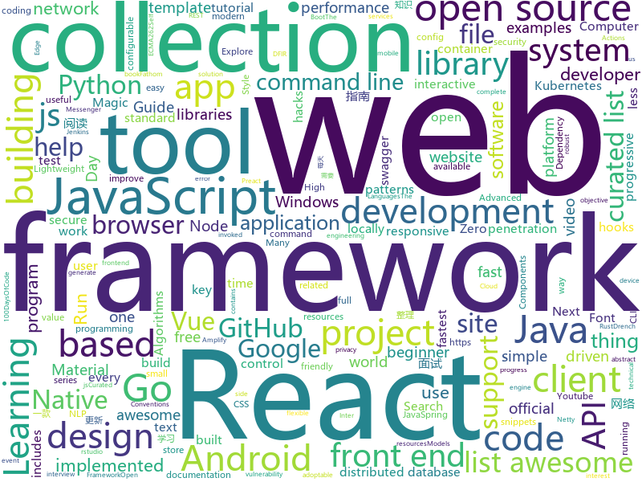

# 2019-02-10
See what the GitHub community is most excited about today.

## python
* [clusterfuzz](https://github.com/google/clusterfuzz)(**350 stars today**): All your bug are belong to us.
* [python-cheatsheet](https://github.com/gto76/python-cheatsheet)(**171 stars today**): Comprehensive Python Cheatsheet
* [public-apis](https://github.com/toddmotto/public-apis)(**173 stars today**): A collective list of free APIs for use in software and web development.
* [ImageNet-Adversarial-Training](https://github.com/facebookresearch/ImageNet-Adversarial-Training)(**83 stars today**): Feature Denoising for Improving Adversarial Robustness
* [stylegan](https://github.com/NVlabs/stylegan)(**68 stars today**): StyleGAN - Official TensorFlow Implementation
* [inter](https://github.com/rsms/inter)(**54 stars today**): The Inter font family
* [Python](https://github.com/TheAlgorithms/Python)(**45 stars today**): All Algorithms implemented in Python
* [ptr](https://github.com/facebookincubator/ptr)(**42 stars today**): Python Test Runner.
* [youtube-dl](https://github.com/rg3/youtube-dl)(**36 stars today**): Command-line program to download videos from YouTube.com and other video sites
* [system-design-primer](https://github.com/donnemartin/system-design-primer)(**35 stars today**): Learn how to design large-scale systems. Prep for the system design interview. Includes Anki flashcards.
* [awesome-python](https://github.com/vinta/awesome-python)(**38 stars today**): A curated list of awesome Python frameworks, libraries, software and resources
* [evidence-tools](https://github.com/dperezrada/evidence-tools)(**39 stars today**): 
* [models](https://github.com/tensorflow/models)(**29 stars today**): Models and examples built with TensorFlow
* [stanfordnlp](https://github.com/stanfordnlp/stanfordnlp)(**29 stars today**): Official Stanford NLP Python Library for Many Human Languages
* [django](https://github.com/django/django)(**24 stars today**): The Web framework for perfectionists with deadlines.
* [unipacker](https://github.com/unipacker/unipacker)(**22 stars today**): Automatic and platform-independent unpacker for Windows binaries
* [keras](https://github.com/keras-team/keras)(**19 stars today**): Deep Learning for humans
* [face_recognition](https://github.com/ageitgey/face_recognition)(**22 stars today**): The world's simplest facial recognition api for Python and the command line
* [go-explore](https://github.com/uber-research/go-explore)(**22 stars today**): Code for Go-Explore: a New Approach for Hard-Exploration Problems
* [ptf](https://github.com/trustedsec/ptf)(**20 stars today**): The Penetration Testers Framework (PTF) is a way for modular support for up-to-date tools.
* [tfjs-object-detection-training](https://github.com/bourdakos1/tfjs-object-detection-training)(**20 stars today**): 🐝
* [home-assistant](https://github.com/home-assistant/home-assistant)(**16 stars today**): 🏡Open source home automation that puts local control and privacy first
* [faceswap](https://github.com/deepfakes/faceswap)(**17 stars today**): Non official project based on original /r/Deepfakes thread. Many thanks to him!
* [python-patterns](https://github.com/faif/python-patterns)(**19 stars today**): A collection of design patterns/idioms in Python
* [altair](https://github.com/altair-viz/altair)(**19 stars today**): Declarative statistical visualization library for Python

## java
* [h4cker](https://github.com/The-Art-of-Hacking/h4cker)(**90 stars today**): This repository is primarily maintained by Omar Santos and includes resources related to ethical hacking / penetration testing, digital forensics and incident response (DFIR), vulnerability research, exploit development, reverse engineering, and more.
* [messenger-app-android](https://github.com/mesibo/messenger-app-android)(**52 stars today**): Open Source Messenger App For Android - Real-time Messaging, Voice and Video Calls
* [JavaGuide](https://github.com/Snailclimb/JavaGuide)(**36 stars today**): 【Java学习+面试指南】 一份涵盖大部分Java程序员所需要掌握的核心知识。
* [java-design-patterns](https://github.com/iluwatar/java-design-patterns)(**28 stars today**): Design patterns implemented in Java
* [spring-boot](https://github.com/spring-projects/spring-boot)(**23 stars today**): Spring Boot
* [tutorials](https://github.com/eugenp/tutorials)(**11 stars today**): The "REST With Spring" Course:
* [symphony](https://github.com/b3log/symphony)(**19 stars today**): 🎶一款用 Java 实现的现代化社区（论坛/BBS/社交网络/博客）平台。https://hacpai.com
* [advanced-java](https://github.com/doocs/advanced-java)(**18 stars today**): 😮互联网 Java 工程师进阶知识完全扫盲
* [Java](https://github.com/TheAlgorithms/Java)(**17 stars today**): All Algorithms implemented in Java
* [spring-framework](https://github.com/spring-projects/spring-framework)(**13 stars today**): Spring Framework
* [elasticsearch](https://github.com/elastic/elasticsearch)(**14 stars today**): Open Source, Distributed, RESTful Search Engine
* [checkstyle](https://github.com/checkstyle/checkstyle)(**15 stars today**): Checkstyle is a development tool to help programmers write Java code that adheres to a coding standard. By default it supports the Google Java Style Guide and Sun Code Conventions, but is highly configurable. It can be invoked with an ANT task and a command line program.
* [FastHub](https://github.com/k0shk0sh/FastHub)(**13 stars today**): FastHub the ultimate GitHub client for Android.
* [graal](https://github.com/oracle/graal)(**12 stars today**): GraalVM: Run Programs Faster Anywhere🚀
* [MyBookshelf](https://github.com/gedoor/MyBookshelf)(**11 stars today**): 阅读是一款可以自定义来源阅读网络内容的工具，为广大网络文学爱好者提供一种方便、快捷舒适的试读体验。
* [guava](https://github.com/google/guava)(**10 stars today**): Google core libraries for Java
* [dbeaver](https://github.com/dbeaver/dbeaver)(**10 stars today**): Free universal database tool and SQL client
* [Telegram](https://github.com/DrKLO/Telegram)(**8 stars today**): Telegram for Android source
* [Magisk](https://github.com/topjohnwu/Magisk)(**9 stars today**): A Magic Mask to Alter Android System Systemless-ly
* [algs4](https://github.com/kevin-wayne/algs4)(**9 stars today**): Algorithms, 4th edition textbook code and libraries
* [nopen](https://github.com/JakeWharton/nopen)(**10 stars today**): An error-prone checker which requires that classes be final, abstract or annotated with @ Open.
* [lottie-android](https://github.com/airbnb/lottie-android)(**9 stars today**): Render After Effects animations natively on Android and iOS, Web, and React Native
* [NewPipe](https://github.com/TeamNewPipe/NewPipe)(**8 stars today**): A lightweight Youtube frontend for Android.
* [netty](https://github.com/netty/netty)(**7 stars today**): Netty project - an event-driven asynchronous network application framework
* [fescar](https://github.com/alibaba/fescar)(**7 stars today**): 🔥Fescar is an easy-to-use, high-performance, java based, open source distributed transaction solution.

## unknown
* [nginx-quick-reference](https://github.com/trimstray/nginx-quick-reference)(**603 stars today**): ⚡️This notes describes how to improve Nginx performance, security and other important things; ssllabs A+ 100%.
* [developer-roadmap](https://github.com/kamranahmedse/developer-roadmap)(**109 stars today**): Roadmap to becoming a web developer in 2019
* [gitignore](https://github.com/github/gitignore)(**42 stars today**): A collection of useful .gitignore templates
* [CS-Notes](https://github.com/CyC2018/CS-Notes)(**40 stars today**): 📚技术面试必备基础知识
* [awesome-developer-streams](https://github.com/bnb/awesome-developer-streams)(**41 stars today**): 👩🏿‍💻👨🏾‍💻👩🏼‍💻👨🏽‍💻👩🏻‍💻 Awesome Developers, Streaming
* [awesome](https://github.com/sindresorhus/awesome)(**38 stars today**): 😎Curated list of awesome lists
* [HyperDL-Tutorial](https://github.com/zeusees/HyperDL-Tutorial)(**35 stars today**): 深度学习教程整理 | 干货
* [rust-guide](https://github.com/ANSSI-FR/rust-guide)(**36 stars today**): Recommendations for secure applications development with Rust
* [deep-learning-drizzle](https://github.com/kmario23/deep-learning-drizzle)(**32 stars today**): Drench yourself in Deep Learning, Reinforcement Learning, Machine Learning, Computer Vision, and NLP by learning from these exciting lectures!!
* [free-programming-books](https://github.com/EbookFoundation/free-programming-books)(**28 stars today**): 📚Freely available programming books
* [awesome-podcasts](https://github.com/rShetty/awesome-podcasts)(**28 stars today**): Collection of awesome podcasts
* [first-contributions](https://github.com/firstcontributions/first-contributions)(**11 stars today**): 🚀✨Help beginners to contribute to open source projects
* [awesome-vue](https://github.com/vuejs/awesome-vue)(**22 stars today**): 🎉A curated list of awesome things related to Vue.js
* [build-your-own-x](https://github.com/danistefanovic/build-your-own-x)(**23 stars today**): 🤓Build your own (insert technology here)
* [the-book-of-secret-knowledge](https://github.com/trimstray/the-book-of-secret-knowledge)(**22 stars today**): ⛔️A collection of awesome lists, manuals, blogs, hacks, one-liners, cli/web tools and more. Especially for System and Network Administrators, DevOps, Pentesters or Security Researchers.
* [coding-interview-university](https://github.com/jwasham/coding-interview-university)(**18 stars today**): A complete computer science study plan to become a software engineer.
* [CV-arXiv-Daily](https://github.com/zhengzhugithub/CV-arXiv-Daily)(**20 stars today**): 分享计算机视觉每天的arXiv文章
* [100-Days-Of-ML-Code](https://github.com/Avik-Jain/100-Days-Of-ML-Code)(**16 stars today**): 100 Days of ML Coding
* [100-days-of-code-frontend](https://github.com/nas5w/100-days-of-code-frontend)(**19 stars today**): Curriculum for learning front-end development during #100DaysOfCode.
* [every-programmer-should-know](https://github.com/mtdvio/every-programmer-should-know)(**17 stars today**): A collection of (mostly) technical things every software developer should know
* [hosts](https://github.com/googlehosts/hosts)(**13 stars today**): 镜像：https://coding.net/u/scaffrey/p/hosts/git
* [emacs-calc-tutorials](https://github.com/ahyatt/emacs-calc-tutorials)(**17 stars today**): A series of tutorials about emacs-calc
* [Intranet_Penetration_Tips](https://github.com/Ridter/Intranet_Penetration_Tips)(**16 stars today**): 2018年初整理的一些内网渗透TIPS，后面更新的慢，所以公开出来希望跟小伙伴们一起更新维护~
* [awesome-for-beginners](https://github.com/MunGell/awesome-for-beginners)(**14 stars today**): A list of awesome beginners-friendly projects.
* [kkcap](https://github.com/ji4ozhu/kkcap)(**16 stars today**): The Most Advanced Proxy Client,support to SOCKS5, Shadowsocks

## javascript
* [git-history](https://github.com/pomber/git-history)(**459 stars today**): Quickly browse the history of any GitHub file
* [not-paid](https://github.com/kleampa/not-paid)(**379 stars today**): Client did not pay? Add opacity to the body tag and decrease it every day until their site completely fades away
* [qoa](https://github.com/klaussinani/qoa)(**200 stars today**): 💬Minimal interactive command-line prompts
* [instant.page](https://github.com/instantpage/instant.page)(**190 stars today**): Make your site’s pages instant in 1 minute and improve your conversion rate by 1%
* [linaria](https://github.com/callstack/linaria)(**168 stars today**): Zero-runtime CSS in JS library
* [uppy](https://github.com/transloadit/uppy)(**137 stars today**): The next open source file uploader for web browsers🐶
* [react-native-hooks](https://github.com/react-native-community/react-native-hooks)(**126 stars today**): React Native APIs turned into React Hooks for use in functional React components
* [mercury-parser](https://github.com/postlight/mercury-parser)(**101 stars today**): 📜Extracting content from the chaos of the web.
* [flexsearch](https://github.com/nextapps-de/flexsearch)(**94 stars today**): Next-Generation full text search library for Browser and Node.js
* [windows95](https://github.com/felixrieseberg/windows95)(**94 stars today**): 💩🚀Windows 95 in Electron. Runs on macOS, Linux, and Windows.
* [react](https://github.com/facebook/react)(**81 stars today**): A declarative, efficient, and flexible JavaScript library for building user interfaces.
* [vue](https://github.com/vuejs/vue)(**66 stars today**): 🖖Vue.js is a progressive, incrementally-adoptable JavaScript framework for building UI on the web.
* [apexcharts.js](https://github.com/apexcharts/apexcharts.js)(**58 stars today**): 📊Interactive SVG Charts
* [html5-boilerplate](https://github.com/h5bp/html5-boilerplate)(**54 stars today**): A professional front-end template for building fast, robust, and adaptable web apps or sites.
* [typeit](https://github.com/alexmacarthur/typeit)(**57 stars today**): The most versatile JavaScript animated typing utility on the planet.
* [create-react-app](https://github.com/facebook/create-react-app)(**43 stars today**): Set up a modern web app by running one command.
* [quasar](https://github.com/quasarframework/quasar)(**45 stars today**): Quasar Framework - High performance, Material Design 2, full front end stack with Vue.js
* [x-spreadsheet](https://github.com/myliang/x-spreadsheet)(**44 stars today**): A web-based JavaScript（canvas） spreadsheet
* [learn-react-app](https://github.com/tyroprogrammer/learn-react-app)(**38 stars today**): Application that will help you learn React fundamentals. Install this application locally - there's tutorial, code snippets and exercises. The main objective of this project is to help you get off the ground with React!
* [ImmortalDB](https://github.com/gruns/ImmortalDB)(**39 stars today**): 🔩A relentless key-value store for the browser.
* [rooks](https://github.com/imbhargav5/rooks)(**38 stars today**): Collection of React hooks ⚓ for everyone.
* [ru.reactjs.org](https://github.com/reactjs/ru.reactjs.org)(**31 stars today**): (Work in progress) React documentation website in Russian
* [react-native](https://github.com/facebook/react-native)(**34 stars today**): A framework for building native apps with React.
* [axios](https://github.com/axios/axios)(**35 stars today**): Promise based HTTP client for the browser and node.js
* [30-seconds-of-code](https://github.com/30-seconds/30-seconds-of-code)(**34 stars today**): Curated collection of useful JavaScript snippets that you can understand in 30 seconds or less.

## html
* [nginxconfig.io](https://github.com/valentinxxx/nginxconfig.io)(**17 stars today**): ⚙️NGiИX config generator on steroids💉
* [INSEADAnalytics](https://github.com/InseadDataAnalytics/INSEADAnalytics)(****): 
* [Spoon-Knife](https://github.com/octocat/Spoon-Knife)(****): This repo is for demonstration purposes only.
* [JavaScript30](https://github.com/wesbos/JavaScript30)(**5 stars today**): 30 Day Vanilla JS Challenge
* [styleguide](https://github.com/google/styleguide)(**10 stars today**): Style guides for Google-originated open-source projects
* [wpt](https://github.com/web-platform-tests/wpt)(**10 stars today**): Test suites for Web platform specs — including WHATWG, W3C, and others
* [javascript-tutorial-en](https://github.com/iliakan/javascript-tutorial-en)(**8 stars today**): Modern JavaScript Tutorial
* [awesome-modern-cpp](https://github.com/rigtorp/awesome-modern-cpp)(**8 stars today**): A collection of resources on modern C++
* [material-design-lite](https://github.com/google/material-design-lite)(**7 stars today**): Material Design Components in HTML/CSS/JS
* [ionic](https://github.com/ionic-team/ionic)(**5 stars today**): Build amazing native and progressive web apps with open web technologies. One app running on everything🎉
* [fastText](https://github.com/facebookresearch/fastText)(**6 stars today**): Library for fast text representation and classification.
* [mxgraph](https://github.com/jgraph/mxgraph)(**6 stars today**): mxGraph is a fully client side JavaScript diagramming library
* [patchwork](https://github.com/jlord/patchwork)(****): All the Git-it Workshop completers!
* [foundation-sites](https://github.com/zurb/foundation-sites)(**6 stars today**): The most advanced responsive front-end framework in the world. Quickly create prototypes and production code for sites that work on any kind of device.
* [fonts](https://github.com/google/fonts)(**6 stars today**): Font files available from Google Fonts
* [core](https://github.com/stackblitz/core)(**6 stars today**): Online IDE powered by Visual Studio Code⚡️
* [rstudio-conf](https://github.com/rstudio/rstudio-conf)(**6 stars today**): Materials for rstudio::conf
* [github](https://github.com/phodal/github)(**5 stars today**): GitHub 漫游指南- a Chinese ebook on how to build a good project on Github. Explore the users' behavior. Find some thing interest.
* [swagger-codegen](https://github.com/swagger-api/swagger-codegen)(**5 stars today**): swagger-codegen contains a template-driven engine to generate documentation, API clients and server stubs in different languages by parsing your OpenAPI / Swagger definition.
* [ecma262](https://github.com/tc39/ecma262)(**5 stars today**): Status, process, and documents for ECMA262
* [speedtest](https://github.com/adolfintel/speedtest)(**5 stars today**): Self-hosted HTML5 Speedtest. Easy setup, examples, configurable, responsive and mobile friendly. Supports PHP, Node, and more.
* [vue-examples](https://github.com/peterlamar/vue-examples)(**5 stars today**): Collection of Vue examples for beginner front end developers
* [docs](https://github.com/aws-amplify/docs)(****): AWS Amplify Documentation
* [octopus](https://github.com/puikinsh/octopus)(****): Free Bootstrap admin dashboard template
* [game-of-life](https://github.com/wakaleo/game-of-life)(****): Demo application for the 'Jenkins: The Definitive Guide' book

## go
* [fathom](https://github.com/usefathom/fathom)(**184 stars today**): Fathom. Simple, trustworthy website analytics. Built with Golang & Preact.
* [gotop](https://github.com/cjbassi/gotop)(**144 stars today**): A terminal based graphical activity monitor inspired by gtop and vtop
* [docui](https://github.com/skanehira/docui)(**96 stars today**): TUI Tool for Docker
* [go-elasticsearch](https://github.com/elastic/go-elasticsearch)(**95 stars today**): The official Go client for Elasticsearch
* [gitin](https://github.com/isacikgoz/gitin)(**85 stars today**): commit/branch/workdir explorer for git
* [Gorsair](https://github.com/Ullaakut/Gorsair)(**49 stars today**): Gorsair hacks its way into remote docker containers that expose their APIs.
* [filetype](https://github.com/h2non/filetype)(**36 stars today**): Small, dependency-free and blazing fast package to infer file types checking the magic numbers signature in Go
* [learn-go-with-tests](https://github.com/quii/learn-go-with-tests)(**34 stars today**): Learn Go with test-driven development
* [go](https://github.com/golang/go)(**31 stars today**): The Go programming language
* [kubernetes](https://github.com/kubernetes/kubernetes)(**27 stars today**): Production-Grade Container Scheduling and Management
* [v2ray-core](https://github.com/v2ray/v2ray-core)(**27 stars today**): A platform for building proxies to bypass network restrictions.
* [awesome-go](https://github.com/avelino/awesome-go)(**25 stars today**): A curated list of awesome Go frameworks, libraries and software
* [tinygo](https://github.com/tinygo-org/tinygo)(**26 stars today**): Go compiler for small places. Microcontrollers, WebAssembly, and command-line tools. Based on LLVM.
* [k9s](https://github.com/derailed/k9s)(**25 stars today**): 🐶Kubernetes CLI To Manage Your Clusters In Style!
* [k3s](https://github.com/ibuildthecloud/k3s)(**22 stars today**): 5 less then k8s. Lightweight Kubernetes.
* [istio](https://github.com/istio/istio)(**20 stars today**): Connect, secure, control, and observe services.
* [rz-go](https://github.com/bloom42/rz-go)(**21 stars today**): ripzap - The fastest structured, leveled JSON logger for Go📖. Dependency free.
* [syncthing](https://github.com/syncthing/syncthing)(**19 stars today**): Open Source Continuous File Synchronization
* [traefik](https://github.com/containous/traefik)(**18 stars today**): The Cloud Native Edge Router
* [hugo](https://github.com/gohugoio/hugo)(**18 stars today**): The world’s fastest framework for building websites.
* [xerrors](https://github.com/golang/xerrors)(**18 stars today**): 
* [act](https://github.com/nektos/act)(**17 stars today**): Run your GitHub Actions locally
* [pudge](https://github.com/recoilme/pudge)(**17 stars today**): Fast and simple key/value store written using Go's standard library
* [mkcert](https://github.com/FiloSottile/mkcert)(**15 stars today**): A simple zero-config tool to make locally trusted development certificates with any names you'd like.
* [prometheus](https://github.com/prometheus/prometheus)(**13 stars today**): The Prometheus monitoring system and time series database.

## WordCloud

