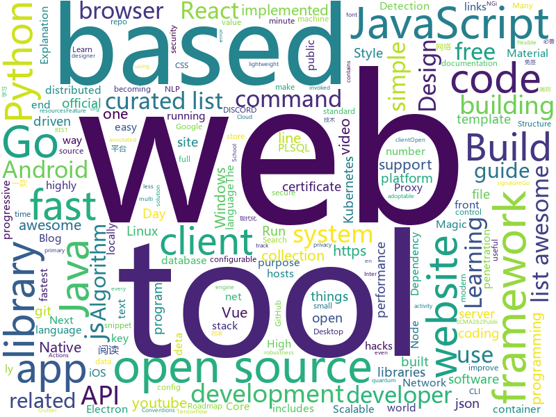

# 2019-02-11
See what the GitHub community is most excited about today.

## python
* [clusterfuzz](https://github.com/google/clusterfuzz)(**257 stars today**): All your bug are belong to us.
* [public-apis](https://github.com/toddmotto/public-apis)(**193 stars today**): A collective list of free APIs for use in software and web development.
* [python-cheatsheet](https://github.com/gto76/python-cheatsheet)(**175 stars today**): Comprehensive Python Cheatsheet
* [stylegan](https://github.com/NVlabs/stylegan)(**88 stars today**): StyleGAN - Official TensorFlow Implementation
* [alignedCelebFaces](https://github.com/carykh/alignedCelebFaces)(**61 stars today**): Better version of my face editing tool. Explanation video here: https://www.youtube.com/watch?v=NTlXEJjfsQU
* [system-design-primer](https://github.com/donnemartin/system-design-primer)(**61 stars today**): Learn how to design large-scale systems. Prep for the system design interview. Includes Anki flashcards.
* [Python](https://github.com/TheAlgorithms/Python)(**32 stars today**): All Algorithms implemented in Python
* [awesome-python](https://github.com/vinta/awesome-python)(**35 stars today**): A curated list of awesome Python frameworks, libraries, software and resources
* [ImageNet-Adversarial-Training](https://github.com/facebookresearch/ImageNet-Adversarial-Training)(**35 stars today**): Feature Denoising for Improving Adversarial Robustness
* [youtube-dl](https://github.com/rg3/youtube-dl)(**33 stars today**): Command-line program to download videos from YouTube.com and other video sites
* [models](https://github.com/tensorflow/models)(**21 stars today**): Models and examples built with TensorFlow
* [ptf](https://github.com/trustedsec/ptf)(**28 stars today**): The Penetration Testers Framework (PTF) is a way for modular support for up-to-date tools.
* [django](https://github.com/django/django)(**22 stars today**): The Web framework for perfectionists with deadlines.
* [pyod](https://github.com/yzhao062/pyod)(**27 stars today**): A Python Toolbox for Scalable Outlier Detection (Anomaly Detection)
* [faceswap](https://github.com/deepfakes/faceswap)(**21 stars today**): Non official project based on original /r/Deepfakes thread. Many thanks to him!
* [tldr](https://github.com/tldr-pages/tldr)(**24 stars today**): 📚Simplified and community-driven man pages
* [ModernRobotics](https://github.com/NxRLab/ModernRobotics)(**22 stars today**): Modern Robotics: Mechanics, Planning, and Control Code Library --- The primary purpose of the provided software is to be easy to read and educational, reinforcing the concepts in the book. The code is optimized neither for efficiency nor robustness.
* [home-assistant](https://github.com/home-assistant/home-assistant)(**21 stars today**): 🏡Open source home automation that puts local control and privacy first
* [keras](https://github.com/keras-team/keras)(**17 stars today**): Deep Learning for humans
* [face_recognition](https://github.com/ageitgey/face_recognition)(**20 stars today**): The world's simplest facial recognition api for Python and the command line
* [evidence-tools](https://github.com/dperezrada/evidence-tools)(**19 stars today**): 
* [cpython](https://github.com/python/cpython)(**15 stars today**): The Python programming language
* [inter](https://github.com/rsms/inter)(**20 stars today**): The Inter font family
* [stanfordnlp](https://github.com/stanfordnlp/stanfordnlp)(**20 stars today**): Official Stanford NLP Python Library for Many Human Languages
* [unipacker](https://github.com/unipacker/unipacker)(**18 stars today**): Automatic and platform-independent unpacker for Windows binaries

## java
* [h4cker](https://github.com/The-Art-of-Hacking/h4cker)(**91 stars today**): This repository is primarily maintained by Omar Santos and includes resources related to ethical hacking / penetration testing, digital forensics and incident response (DFIR), vulnerability research, exploit development, reverse engineering, and more.
* [advanced-java](https://github.com/doocs/advanced-java)(**36 stars today**): 😮互联网 Java 工程师进阶知识完全扫盲
* [java-design-patterns](https://github.com/iluwatar/java-design-patterns)(**27 stars today**): Design patterns implemented in Java
* [spring-boot](https://github.com/spring-projects/spring-boot)(**23 stars today**): Spring Boot
* [checkstyle](https://github.com/checkstyle/checkstyle)(**25 stars today**): Checkstyle is a development tool to help programmers write Java code that adheres to a coding standard. By default it supports the Google Java Style Guide and Sun Code Conventions, but is highly configurable. It can be invoked with an ANT task and a command line program.
* [tutorials](https://github.com/eugenp/tutorials)(**16 stars today**): The "REST With Spring" Course:
* [DETA_DataBase](https://github.com/yaoguangluo/DETA_DataBase)(**21 stars today**): 🔥Deta quantum-field json PLSQL database integrated in deta《VPCS架构》http server. size 30KB / Json量子碎片去死锁带binlog动态回滚的PLSQL数据库
* [Magisk](https://github.com/topjohnwu/Magisk)(**20 stars today**): A Magic Mask to Alter Android System Systemless-ly
* [symphony](https://github.com/b3log/symphony)(**19 stars today**): 🎶一款用 Java 实现的现代化社区（论坛/BBS/社交网络/博客）平台。https://hacpai.com
* [nopen](https://github.com/JakeWharton/nopen)(**20 stars today**): An error-prone checker which requires that classes be final, abstract or annotated with @ Open.
* [Java](https://github.com/TheAlgorithms/Java)(**14 stars today**): All Algorithms implemented in Java
* [graal](https://github.com/oracle/graal)(**14 stars today**): GraalVM: Run Programs Faster Anywhere🚀
* [messenger-app-android](https://github.com/mesibo/messenger-app-android)(**12 stars today**): Open Source Messenger App For Android - Real-time Messaging, Voice and Video Calls
* [lottie-android](https://github.com/airbnb/lottie-android)(**11 stars today**): Render After Effects animations natively on Android and iOS, Web, and React Native
* [spring-framework](https://github.com/spring-projects/spring-framework)(**9 stars today**): Spring Framework
* [runelite](https://github.com/runelite/runelite)(**5 stars today**): Open source Old School RuneScape client
* [elasticsearch](https://github.com/elastic/elasticsearch)(**8 stars today**): Open Source, Distributed, RESTful Search Engine
* [Vmq](https://github.com/szvone/Vmq)(**9 stars today**): V免签
* [fescar](https://github.com/alibaba/fescar)(**9 stars today**): 🔥Fescar is an easy-to-use, high-performance, java based, open source distributed transaction solution.
* [libgdx](https://github.com/libgdx/libgdx)(**10 stars today**): Desktop/Android/HTML5/iOS Java game development framework
* [bazel](https://github.com/bazelbuild/bazel)(**10 stars today**): a fast, scalable, multi-language and extensible build system
* [MyBookshelf](https://github.com/gedoor/MyBookshelf)(**9 stars today**): 阅读是一款可以自定义来源阅读网络内容的工具，为广大网络文学爱好者提供一种方便、快捷舒适的试读体验。
* [NewPipe](https://github.com/TeamNewPipe/NewPipe)(**9 stars today**): A lightweight Youtube frontend for Android.
* [SuperTextView](https://github.com/chenBingX/SuperTextView)(**8 stars today**): Welcome to use SuperTextView
* [guava](https://github.com/google/guava)(**8 stars today**): Google core libraries for Java

## unknown
* [nginx-quick-reference](https://github.com/trimstray/nginx-quick-reference)(**401 stars today**): ⚡️This notes describes how to improve Nginx performance, security and other important things; ssllabs A+ 100%.
* [developer-roadmap](https://github.com/kamranahmedse/developer-roadmap)(**127 stars today**): Roadmap to becoming a web developer in 2019
* [How-To-Secure-A-Linux-Server](https://github.com/imthenachoman/How-To-Secure-A-Linux-Server)(**109 stars today**): An evolving how-to guide for securing a Linux server.
* [deep-learning-drizzle](https://github.com/kmario23/deep-learning-drizzle)(**86 stars today**): Drench yourself in Deep Learning, Reinforcement Learning, Machine Learning, Computer Vision, and NLP by learning from these exciting lectures!!
* [AspNetCore-Developer-Roadmap](https://github.com/MoienTajik/AspNetCore-Developer-Roadmap)(**82 stars today**): Roadmap to becoming an ASP.NET Core developer in 2019
* [awesome](https://github.com/sindresorhus/awesome)(**51 stars today**): 😎Curated list of awesome lists
* [gitignore](https://github.com/github/gitignore)(**37 stars today**): A collection of useful .gitignore templates
* [rust-guide](https://github.com/ANSSI-FR/rust-guide)(**47 stars today**): Recommendations for secure applications development with Rust
* [CS-Notes](https://github.com/CyC2018/CS-Notes)(**32 stars today**): 📚技术面试必备基础知识
* [free-programming-books](https://github.com/EbookFoundation/free-programming-books)(**26 stars today**): 📚Freely available programming books
* [awesome-podcasts](https://github.com/rShetty/awesome-podcasts)(**27 stars today**): Collection of awesome podcasts
* [trackerslist](https://github.com/ngosang/trackerslist)(**26 stars today**): An updated list of public BitTorrent trackers
* [kubernetes-failure-stories](https://github.com/hjacobs/kubernetes-failure-stories)(**23 stars today**): Compilation of public failure/horror stories related to Kubernetes
* [build-your-own-x](https://github.com/danistefanovic/build-your-own-x)(**21 stars today**): 🤓Build your own (insert technology here)
* [awesome-vue](https://github.com/vuejs/awesome-vue)(**20 stars today**): 🎉A curated list of awesome things related to Vue.js
* [100-Days-Of-ML-Code](https://github.com/Avik-Jain/100-Days-Of-ML-Code)(**19 stars today**): 100 Days of ML Coding
* [CV-arXiv-Daily](https://github.com/zhengzhugithub/CV-arXiv-Daily)(**21 stars today**): 分享计算机视觉每天的arXiv文章
* [the-book-of-secret-knowledge](https://github.com/trimstray/the-book-of-secret-knowledge)(**20 stars today**): ⛔️A collection of awesome lists, manuals, blogs, hacks, one-liners, cli/web tools and more. Especially for System and Network Administrators, DevOps, Pentesters or Security Researchers.
* [hosts](https://github.com/googlehosts/hosts)(**16 stars today**): 镜像：https://coding.net/u/scaffrey/p/hosts/git
* [awesome-developer-streams](https://github.com/bnb/awesome-developer-streams)(**20 stars today**): 👩🏿‍💻👨🏾‍💻👩🏼‍💻👨🏽‍💻👩🏻‍💻 Awesome Developers, Streaming
* [kkcap](https://github.com/ji4ozhu/kkcap)(**20 stars today**): The Most Advanced Proxy Client,support to SOCKS5, Shadowsocks
* [HyperDL-Tutorial](https://github.com/zeusees/HyperDL-Tutorial)(**17 stars today**): 深度学习教程整理 | 干货
* [lemonade-stand](https://github.com/nayafia/lemonade-stand)(**18 stars today**): A handy guide to financial support for open source
* [impresionante-javascript](https://github.com/sergiodxa/impresionante-javascript)(**16 stars today**): Recopilación de links en español sobre JavaScript
* [awesome-react](https://github.com/enaqx/awesome-react)(**15 stars today**): A collection of awesome things regarding React ecosystem.

## javascript
* [git-history](https://github.com/pomber/git-history)(**583 stars today**): Quickly browse the history of any GitHub file
* [instant.page](https://github.com/instantpage/instant.page)(**458 stars today**): Make your site’s pages instant in 1 minute and improve your conversion rate by 1%
* [not-paid](https://github.com/kleampa/not-paid)(**239 stars today**): Client did not pay? Add opacity to the body tag and decrease it every day until their site completely fades away
* [qoa](https://github.com/klaussinani/qoa)(**223 stars today**): 💬Minimal interactive command-line prompts
* [react-native-hooks](https://github.com/react-native-community/react-native-hooks)(**169 stars today**): React Native APIs turned into React Hooks for use in functional React components
* [miniC-hosting](https://github.com/vasyop/miniC-hosting)(**150 stars today**): A simple stack-based virtual machine that runs C in the browser.
* [uppy](https://github.com/transloadit/uppy)(**129 stars today**): The next open source file uploader for web browsers🐶
* [flexsearch](https://github.com/nextapps-de/flexsearch)(**119 stars today**): Next-Generation full text search library for Browser and Node.js
* [windows95](https://github.com/felixrieseberg/windows95)(**112 stars today**): 💩🚀Windows 95 in Electron. Runs on macOS, Linux, and Windows.
* [javascript-algorithms](https://github.com/trekhleb/javascript-algorithms)(**100 stars today**): 📝Algorithms and data structures implemented in JavaScript with explanations and links to further readings
* [linaria](https://github.com/callstack/linaria)(**104 stars today**): Zero-runtime CSS in JS library
* [mercury-parser](https://github.com/postlight/mercury-parser)(**70 stars today**): 📜Extracting content from the chaos of the web.
* [vue](https://github.com/vuejs/vue)(**67 stars today**): 🖖Vue.js is a progressive, incrementally-adoptable JavaScript framework for building UI on the web.
* [react](https://github.com/facebook/react)(**61 stars today**): A declarative, efficient, and flexible JavaScript library for building user interfaces.
* [code-notes](https://github.com/lauthieb/code-notes)(**49 stars today**): A simple code snippet & gist manager for developers built with Electron & Vue.js🚀
* [create-react-app](https://github.com/facebook/create-react-app)(**42 stars today**): Set up a modern web app by running one command.
* [react-native](https://github.com/facebook/react-native)(**48 stars today**): A framework for building native apps with React.
* [gatsby](https://github.com/gatsbyjs/gatsby)(**40 stars today**): Build blazing fast, modern apps and websites with React
* [axios](https://github.com/axios/axios)(**39 stars today**): Promise based HTTP client for the browser and node.js
* [ImmortalDB](https://github.com/gruns/ImmortalDB)(**38 stars today**): 🔩A relentless key-value store for the browser.
* [x-spreadsheet](https://github.com/myliang/x-spreadsheet)(**39 stars today**): A web-based JavaScript（canvas） spreadsheet
* [typeit](https://github.com/alexmacarthur/typeit)(**38 stars today**): The most versatile JavaScript animated typing utility on the planet.
* [html5-boilerplate](https://github.com/h5bp/html5-boilerplate)(**37 stars today**): A professional front-end template for building fast, robust, and adaptable web apps or sites.
* [30-seconds-of-code](https://github.com/30-seconds/30-seconds-of-code)(**37 stars today**): Curated collection of useful JavaScript snippets that you can understand in 30 seconds or less.
* [quasar](https://github.com/quasarframework/quasar)(**34 stars today**): Quasar Framework - High performance, Material Design 2, full front end stack with Vue.js

## html
* [javascript-tutorial-en](https://github.com/iliakan/javascript-tutorial-en)(**27 stars today**): Modern JavaScript Tutorial
* [Spoon-Knife](https://github.com/octocat/Spoon-Knife)(****): This repo is for demonstration purposes only.
* [w3develops](https://github.com/w3develops/w3develops)(**15 stars today**): The w3develops.org open source codebase - Learn, build, and meetup with other developers on DISCORD https://discord.gg/ckQ52gA and YOUTUBE http://bit.ly/w3dyt
* [JavaScript30](https://github.com/wesbos/JavaScript30)(**5 stars today**): 30 Day Vanilla JS Challenge
* [PoCBox](https://github.com/gh0stkey/PoCBox)(**11 stars today**): PoCBox - 漏洞测试验证辅助平台
* [ionic](https://github.com/ionic-team/ionic)(**7 stars today**): Build amazing native and progressive web apps with open web technologies. One app running on everything🎉
* [simple-icons](https://github.com/simple-icons/simple-icons)(**10 stars today**): SVG icons for popular brands
* [wpt](https://github.com/web-platform-tests/wpt)(**9 stars today**): Test suites for Web platform specs — including WHATWG, W3C, and others
* [nginxconfig.io](https://github.com/valentinxxx/nginxconfig.io)(**8 stars today**): ⚙️NGiИX config generator on steroids💉
* [inception](https://github.com/proabiral/inception)(**8 stars today**): A highly configurable tool to check for whatever you like against any number of hosts.
* [styleguide](https://github.com/google/styleguide)(**8 stars today**): Style guides for Google-originated open-source projects
* [hugo-academic](https://github.com/gcushen/hugo-academic)(**7 stars today**): The website designer for Hugo. Build and deploy a beautiful website in minutes🚀
* [patchwork](https://github.com/jlord/patchwork)(****): All the Git-it Workshop completers!
* [awesome-competitive-programming](https://github.com/lnishan/awesome-competitive-programming)(**6 stars today**): 💎A curated list of awesome Competitive Programming, Algorithm and Data Structure resources
* [startbootstrap](https://github.com/BlackrockDigital/startbootstrap)(**7 stars today**): A library of free and open source Bootstrap themes and templates
* [all-contributors](https://github.com/all-contributors/all-contributors)(**7 stars today**): ✨Recognize all contributors, not just the ones who push code✨
* [fastText](https://github.com/facebookresearch/fastText)(**6 stars today**): Library for fast text representation and classification.
* [material-design-lite](https://github.com/google/material-design-lite)(**6 stars today**): Material Design Components in HTML/CSS/JS
* [core](https://github.com/stackblitz/core)(**5 stars today**): Online IDE powered by Visual Studio Code⚡️
* [mxgraph](https://github.com/jgraph/mxgraph)(**5 stars today**): mxGraph is a fully client side JavaScript diagramming library
* [swagger-codegen](https://github.com/swagger-api/swagger-codegen)(**5 stars today**): swagger-codegen contains a template-driven engine to generate documentation, API clients and server stubs in different languages by parsing your OpenAPI / Swagger definition.
* [ecma262](https://github.com/tc39/ecma262)(**5 stars today**): Status, process, and documents for ECMA262
* [Publii](https://github.com/GetPublii/Publii)(**5 stars today**): Publii is a desktop-based CMS for Windows, Mac and Linux that makes creating static websites fast and hassle-free, even for beginners.
* [website](https://github.com/kubernetes/website)(****): Kubernetes website and documentation repo:
* [qiubaiying.github.io](https://github.com/qiubaiying/qiubaiying.github.io)(****): BY Blog ->

## go
* [Gorsair](https://github.com/Ullaakut/Gorsair)(**193 stars today**): Gorsair hacks its way into remote docker containers that expose their APIs.
* [go-elasticsearch](https://github.com/elastic/go-elasticsearch)(**128 stars today**): The official Go client for Elasticsearch
* [fathom](https://github.com/usefathom/fathom)(**89 stars today**): Fathom. Simple, trustworthy website analytics. Built with Golang & Preact.
* [gotop](https://github.com/cjbassi/gotop)(**83 stars today**): A terminal based graphical activity monitor inspired by gtop and vtop
* [docui](https://github.com/skanehira/docui)(**76 stars today**): TUI Tool for Docker
* [gitin](https://github.com/isacikgoz/gitin)(**61 stars today**): commit/branch/workdir explorer for git
* [k9s](https://github.com/derailed/k9s)(**35 stars today**): 🐶Kubernetes CLI To Manage Your Clusters In Style!
* [filetype](https://github.com/h2non/filetype)(**32 stars today**): Small, dependency-free and fast Go package to infer file types based on its magic numbers signature
* [tinygo](https://github.com/tinygo-org/tinygo)(**31 stars today**): Go compiler for small places. Microcontrollers, WebAssembly, and command-line tools. Based on LLVM.
* [kubernetes](https://github.com/kubernetes/kubernetes)(**29 stars today**): Production-Grade Container Scheduling and Management
* [pomerium](https://github.com/pomerium/pomerium)(**30 stars today**): Pomerium is an identity-aware access proxy.
* [awesome-go](https://github.com/avelino/awesome-go)(**26 stars today**): A curated list of awesome Go frameworks, libraries and software
* [hugo](https://github.com/gohugoio/hugo)(**23 stars today**): The world’s fastest framework for building websites.
* [learn-go-with-tests](https://github.com/quii/learn-go-with-tests)(**23 stars today**): Learn Go with test-driven development
* [certificates](https://github.com/smallstep/certificates)(**24 stars today**): An online certificate authority and related tools for secure automated certificate management, so you can use TLS everywhere.
* [fin](https://github.com/jonatasbaldin/fin)(**24 stars today**): Fin is an open source backend API to track personal finances, made with Go💸
* [pudge](https://github.com/recoilme/pudge)(**23 stars today**): Fast and simple key/value store written using Go's standard library
* [rz-go](https://github.com/bloom42/rz-go)(**22 stars today**): ripzap - The fastest structured, leveled JSON logger for Go📖. Dependency free.
* [mkcert](https://github.com/FiloSottile/mkcert)(**22 stars today**): A simple zero-config tool to make locally trusted development certificates with any names you'd like.
* [v2ray-core](https://github.com/v2ray/v2ray-core)(**21 stars today**): A platform for building proxies to bypass network restrictions.
* [prometheus](https://github.com/prometheus/prometheus)(**20 stars today**): The Prometheus monitoring system and time series database.
* [syncthing](https://github.com/syncthing/syncthing)(**18 stars today**): Open Source Continuous File Synchronization
* [go](https://github.com/golang/go)(**19 stars today**): The Go programming language
* [traefik](https://github.com/containous/traefik)(**18 stars today**): The Cloud Native Edge Router
* [act](https://github.com/nektos/act)(**18 stars today**): Run your GitHub Actions locally

## WordCloud

