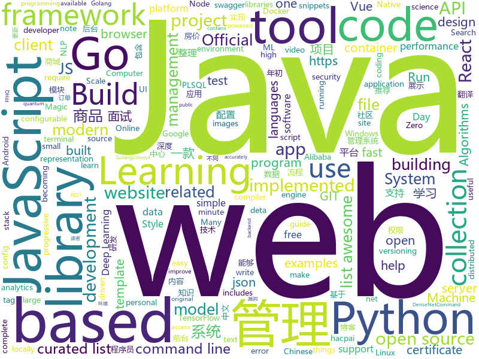

# 2019-02-12
See what the GitHub community is most excited about today.

## python
* [clusterfuzz](https://github.com/google/clusterfuzz)(**419 stars today**): All your bug are belong to us.
* [public-apis](https://github.com/toddmotto/public-apis)(**375 stars today**): A collective list of free APIs for use in software and web development.
* [python-cheatsheet](https://github.com/gto76/python-cheatsheet)(**255 stars today**): Comprehensive Python Cheatsheet
* [stylegan](https://github.com/NVlabs/stylegan)(**210 stars today**): StyleGAN - Official TensorFlow Implementation
* [dvc](https://github.com/iterative/dvc)(**149 stars today**): ⚡️Data & models versioning for ML projects, make them shareable and reproducible
* [system-design-primer](https://github.com/donnemartin/system-design-primer)(**129 stars today**): Learn how to design large-scale systems. Prep for the system design interview. Includes Anki flashcards.
* [ASRT_SpeechRecognition](https://github.com/nl8590687/ASRT_SpeechRecognition)(**118 stars today**): A Deep-Learning-Based Chinese Speech Recognition System 基于深度学习的中文语音识别系统
* [ludwig](https://github.com/uber/ludwig)(**109 stars today**): Ludwig is a toolbox built on top of TensorFlow that allows to train and test deep learning models without the need to write code.
* [datashader](https://github.com/pyviz/datashader)(**101 stars today**): Turns even the largest data into images, accurately.
* [mlcourse.ai](https://github.com/Yorko/mlcourse.ai)(**59 stars today**): Open Machine Learning Course
* [spektral](https://github.com/danielegrattarola/spektral)(**79 stars today**): A Python framework for relational representation learning in Keras.
* [stanfordnlp](https://github.com/stanfordnlp/stanfordnlp)(**64 stars today**): Official Stanford NLP Python Library for Many Human Languages
* [lianjia-beike-spider](https://github.com/jumper2014/lianjia-beike-spider)(**64 stars today**): 链家网和贝壳网房价爬虫，采集北京上海广州深圳等21个中国主要城市的房价数据（小区，二手房，出租房，新房），稳定可靠快速！支持csv,MySQL, MongoDB,Excel, json存储，支持Python2和3，图表展示数据，注释丰富🚁，点星支持
* [models](https://github.com/tensorflow/models)(**41 stars today**): Models and examples built with TensorFlow
* [Python](https://github.com/TheAlgorithms/Python)(**47 stars today**): All Algorithms implemented in Python
* [awesome-python](https://github.com/vinta/awesome-python)(**50 stars today**): A curated list of awesome Python frameworks, libraries, software and resources
* [inter](https://github.com/rsms/inter)(**50 stars today**): The Inter font family
* [faceswap](https://github.com/deepfakes/faceswap)(**39 stars today**): Non official project based on original /r/Deepfakes thread. Many thanks to him!
* [bert-embedding](https://github.com/imgarylai/bert-embedding)(**42 stars today**): 🔡Token level embeddings from BERT model on mxnet and gluonnlp
* [keras](https://github.com/keras-team/keras)(**36 stars today**): Deep Learning for humans
* [sdr-densenet-pytorch](https://github.com/noahfl/sdr-densenet-pytorch)(**40 stars today**): Stochastic Delta Rule implemented in Pytorch on DenseNet
* [youtube-dl](https://github.com/rg3/youtube-dl)(**38 stars today**): Command-line program to download videos from YouTube.com and other video sites
* [PythonEXE](https://github.com/jabbalaci/PythonEXE)(**37 stars today**): How to create an executable file from a Python script?
* [ffhq-dataset](https://github.com/NVlabs/ffhq-dataset)(**35 stars today**): Flickr-Faces-HQ Dataset (FFHQ)
* [pyrs](https://github.com/konchunas/pyrs)(**35 stars today**): Python to Rust transpiler

## java
* [advanced-java](https://github.com/doocs/advanced-java)(**130 stars today**): 😮互联网 Java 工程师进阶知识完全扫盲
* [h4cker](https://github.com/The-Art-of-Hacking/h4cker)(**129 stars today**): This repository is primarily maintained by Omar Santos and includes resources related to ethical hacking / penetration testing, digital forensics and incident response (DFIR), vulnerability research, exploit development, reverse engineering, and more.
* [JavaGuide](https://github.com/Snailclimb/JavaGuide)(**97 stars today**): 【Java学习+面试指南】 一份涵盖大部分Java程序员所需要掌握的核心知识。
* [java-design-patterns](https://github.com/iluwatar/java-design-patterns)(**61 stars today**): Design patterns implemented in Java
* [fescar](https://github.com/alibaba/fescar)(**51 stars today**): 🔥Fescar is an easy-to-use, high-performance, java based, open source distributed transaction solution.
* [DoraemonKit](https://github.com/didi/DoraemonKit)(**56 stars today**): 一款功能齐全的客户端（iOS、Android）研发助手，你值得拥有。
* [symphony](https://github.com/b3log/symphony)(**55 stars today**): 🎶一款用 Java 实现的现代化社区（论坛/BBS/社交网络/博客）平台。https://hacpai.com
* [spring-boot](https://github.com/spring-projects/spring-boot)(**42 stars today**): Spring Boot
* [SuperTextView](https://github.com/chenBingX/SuperTextView)(**48 stars today**): Welcome to use SuperTextView
* [mall](https://github.com/macrozheng/mall)(**38 stars today**): mall项目是一套电商系统，包括前台商城系统及后台管理系统，基于SpringBoot+MyBatis实现。 前台商城系统包含首页门户、商品推荐、商品搜索、商品展示、购物车、订单流程、会员中心、客户服务、帮助中心等模块。 后台管理系统包含商品管理、订单管理、会员管理、促销管理、运营管理、内容管理、统计报表、财务管理、权限管理、设置等模块。
* [DETA_DataBase](https://github.com/yaoguangluo/DETA_DataBase)(**44 stars today**): 🔥Deta quantum-field json PLSQL database integrated in deta《VPCS架构》http server. size 30KB / Json量子碎片去死锁带binlog动态回滚的PLSQL数据库
* [flink](https://github.com/apache/flink)(**34 stars today**): Apache Flink
* [tutorials](https://github.com/eugenp/tutorials)(**20 stars today**): The "REST With Spring" Course:
* [Java](https://github.com/TheAlgorithms/Java)(**29 stars today**): All Algorithms implemented in Java
* [elasticsearch](https://github.com/elastic/elasticsearch)(**25 stars today**): Open Source, Distributed, RESTful Search Engine
* [spring-framework](https://github.com/spring-projects/spring-framework)(**19 stars today**): Spring Framework
* [nopen](https://github.com/JakeWharton/nopen)(**28 stars today**): An error-prone checker which requires that classes be final, abstract or annotated with @ Open.
* [Magisk](https://github.com/topjohnwu/Magisk)(**25 stars today**): A Magic Mask to Alter Android System Systemless-ly
* [apollo](https://github.com/ctripcorp/apollo)(**22 stars today**): Apollo（阿波罗）是携程框架部门研发的分布式配置中心，能够集中化管理应用不同环境、不同集群的配置，配置修改后能够实时推送到应用端，并且具备规范的权限、流程治理等特性，适用于微服务配置管理场景。
* [checkstyle](https://github.com/checkstyle/checkstyle)(**21 stars today**): Checkstyle is a development tool to help programmers write Java code that adheres to a coding standard. By default it supports the Google Java Style Guide and Sun Code Conventions, but is highly configurable. It can be invoked with an ANT task and a command line program.
* [arthas](https://github.com/alibaba/arthas)(**19 stars today**): Alibaba Java Diagnostic Tool Arthas/Alibaba Java诊断利器Arthas
* [graal](https://github.com/oracle/graal)(**20 stars today**): GraalVM: Run Programs Faster Anywhere🚀
* [solo](https://github.com/b3log/solo)(**20 stars today**): 🎸一款小而美的博客系统，专为程序员设计。https://hacpai.com/tag/solo
* [incubator-dubbo](https://github.com/apache/incubator-dubbo)(**13 stars today**): Apache Dubbo (incubating) is a high-performance, java based, open source RPC framework.
* [jib](https://github.com/GoogleContainerTools/jib)(**20 stars today**): ⛵️Build container images for your Java applications.

## unknown
* [deep-learning-drizzle](https://github.com/kmario23/deep-learning-drizzle)(**633 stars today**): Drench yourself in Deep Learning, Reinforcement Learning, Machine Learning, Computer Vision, and NLP by learning from these exciting lectures!!
* [nginx-quick-reference](https://github.com/trimstray/nginx-quick-reference)(**662 stars today**): ⚡️This notes describes how to improve Nginx performance, security and other important things; ssllabs A+ 100%.
* [How-To-Secure-A-Linux-Server](https://github.com/imthenachoman/How-To-Secure-A-Linux-Server)(**470 stars today**): An evolving how-to guide for securing a Linux server.
* [developer-roadmap](https://github.com/kamranahmedse/developer-roadmap)(**370 stars today**): Roadmap to becoming a web developer in 2019
* [nlp_chinese_corpus](https://github.com/brightmart/nlp_chinese_corpus)(**188 stars today**): 大规模中文自然语言处理语料 Large Scale Chinese Corpus for NLP
* [AspNetCore-Developer-Roadmap](https://github.com/MoienTajik/AspNetCore-Developer-Roadmap)(**194 stars today**): Roadmap to becoming an ASP.NET Core developer in 2019
* [CS-Notes](https://github.com/CyC2018/CS-Notes)(**92 stars today**): 📚技术面试必备基础知识
* [gitignore](https://github.com/github/gitignore)(**74 stars today**): A collection of useful .gitignore templates
* [awesome](https://github.com/sindresorhus/awesome)(**61 stars today**): 😎Curated list of awesome lists
* [free-programming-books](https://github.com/EbookFoundation/free-programming-books)(**53 stars today**): 📚Freely available programming books
* [coding-interview-university](https://github.com/jwasham/coding-interview-university)(**41 stars today**): A complete computer science study plan to become a software engineer.
* [awesome-podcasts](https://github.com/rShetty/awesome-podcasts)(**52 stars today**): Collection of awesome podcasts
* [100-Days-Of-ML-Code](https://github.com/Avik-Jain/100-Days-Of-ML-Code)(**46 stars today**): 100 Days of ML Coding
* [GitHubDaily](https://github.com/GitHubDaily/GitHubDaily)(**44 stars today**): GitHubDaily 分享内容定期整理与分类。欢迎推荐、自荐项目，让更多人知道你的项目。
* [interview](https://github.com/aylei/interview)(**47 stars today**): 写在19年初的后端社招面试经历🤑
* [awesome-vue](https://github.com/vuejs/awesome-vue)(**39 stars today**): 🎉A curated list of awesome things related to Vue.js
* [hosts](https://github.com/googlehosts/hosts)(**32 stars today**): 镜像：https://coding.net/u/scaffrey/p/hosts/git
* [Intranet_Penetration_Tips](https://github.com/Ridter/Intranet_Penetration_Tips)(**37 stars today**): 2018年初整理的一些内网渗透TIPS，后面更新的慢，所以公开出来希望跟小伙伴们一起更新维护~
* [gold-miner](https://github.com/xitu/gold-miner)(**36 stars today**): 🥇掘金翻译计划，可能是世界最大最好的英译中技术社区，最懂读者和译者的翻译平台：
* [HyperDL-Tutorial](https://github.com/zeusees/HyperDL-Tutorial)(**37 stars today**): 深度学习教程整理 | 干货
* [kubernetes-failure-stories](https://github.com/hjacobs/kubernetes-failure-stories)(**36 stars today**): Compilation of public failure/horror stories related to Kubernetes
* [semver](https://github.com/semver/semver)(**36 stars today**): Semantic Versioning Specification
* [build-your-own-x](https://github.com/danistefanovic/build-your-own-x)(**32 stars today**): 🤓Build your own (insert technology here)
* [gitnote](https://github.com/zhaopengme/gitnote)(**30 stars today**): A modern note taking app based on GIT that does not require a local GIT environment.
* [Pentest-and-Development-Tips](https://github.com/3gstudent/Pentest-and-Development-Tips)(**24 stars today**): A collection of pentest and development tips

## javascript
* [git-history](https://github.com/pomber/git-history)(**973 stars today**): Quickly browse the history of any GitHub file
* [instant.page](https://github.com/instantpage/instant.page)(**630 stars today**): Make your site’s pages instant in 1 minute and improve your conversion rate by 1%
* [not-paid](https://github.com/kleampa/not-paid)(**404 stars today**): Client did not pay? Add opacity to the body tag and decrease it every day until their site completely fades away
* [uppy](https://github.com/transloadit/uppy)(**322 stars today**): The next open source file uploader for web browsers🐶
* [windows95](https://github.com/felixrieseberg/windows95)(**273 stars today**): 💩🚀Windows 95 in Electron. Runs on macOS, Linux, and Windows.
* [qoa](https://github.com/klaussinani/qoa)(**264 stars today**): 💬Minimal interactive command-line prompts
* [mercury-parser](https://github.com/postlight/mercury-parser)(**229 stars today**): 📜Extracting content from the chaos of the web.
* [miniC-hosting](https://github.com/vasyop/miniC-hosting)(**220 stars today**): A simple stack-based virtual machine that runs C in the browser.
* [javascript-algorithms](https://github.com/trekhleb/javascript-algorithms)(**178 stars today**): 📝Algorithms and data structures implemented in JavaScript with explanations and links to further readings
* [flexsearch](https://github.com/nextapps-de/flexsearch)(**173 stars today**): Next-Generation full text search library for Browser and Node.js
* [react-native-hooks](https://github.com/react-native-community/react-native-hooks)(**120 stars today**): React Native APIs turned into React Hooks for use in functional React components
* [react](https://github.com/facebook/react)(**101 stars today**): A declarative, efficient, and flexible JavaScript library for building user interfaces.
* [next.js](https://github.com/zeit/next.js)(**106 stars today**): The React Framework
* [x-spreadsheet](https://github.com/myliang/x-spreadsheet)(**105 stars today**): A web-based JavaScript（canvas） spreadsheet
* [vue](https://github.com/vuejs/vue)(**100 stars today**): 🖖Vue.js is a progressive, incrementally-adoptable JavaScript framework for building UI on the web.
* [linaria](https://github.com/callstack/linaria)(**99 stars today**): Zero-runtime CSS in JS library
* [leon](https://github.com/leon-ai/leon)(**99 stars today**): 🧠 Leon is your open-source personal assistant.
* [edex-ui](https://github.com/GitSquared/edex-ui)(**78 stars today**): A cross-platform, customizable science fiction terminal emulator with advanced monitoring & touchscreen support.
* [30-seconds-of-code](https://github.com/30-seconds/30-seconds-of-code)(**70 stars today**): Curated collection of useful JavaScript snippets that you can understand in 30 seconds or less.
* [create-react-app](https://github.com/facebook/create-react-app)(**59 stars today**): Set up a modern web app by running one command.
* [typeit](https://github.com/alexmacarthur/typeit)(**62 stars today**): The most versatile JavaScript animated typing utility on the planet.
* [gatsby](https://github.com/gatsbyjs/gatsby)(**56 stars today**): Build blazing fast, modern apps and websites with React
* [zebu](https://github.com/modernserf/zebu)(**61 stars today**): A compiler for little languages in tagged template strings
* [javascript](https://github.com/airbnb/javascript)(**55 stars today**): JavaScript Style Guide
* [learn-react-app](https://github.com/tyroprogrammer/learn-react-app)(**57 stars today**): Application that will help you learn React fundamentals. Install this application locally - there's tutorial, code snippets and exercises. The main objective of this project is to help you get off the ground with React!

## html
* [Spoon-Knife](https://github.com/octocat/Spoon-Knife)(****): This repo is for demonstration purposes only.
* [javascript-tutorial-en](https://github.com/iliakan/javascript-tutorial-en)(**19 stars today**): Modern JavaScript Tutorial
* [JavaScript30](https://github.com/wesbos/JavaScript30)(**10 stars today**): 30 Day Vanilla JS Challenge
* [PoCBox](https://github.com/gh0stkey/PoCBox)(**15 stars today**): PoCBox - 漏洞测试验证辅助平台
* [ionic](https://github.com/ionic-team/ionic)(**14 stars today**): Build amazing native and progressive web apps with open web technologies. One app running on everything🎉
* [swagger-codegen](https://github.com/swagger-api/swagger-codegen)(**14 stars today**): swagger-codegen contains a template-driven engine to generate documentation, API clients and server stubs in different languages by parsing your OpenAPI / Swagger definition.
* [core](https://github.com/stackblitz/core)(**15 stars today**): Online IDE powered by Visual Studio Code⚡️
* [fastText](https://github.com/facebookresearch/fastText)(**12 stars today**): Library for fast text representation and classification.
* [wpt](https://github.com/web-platform-tests/wpt)(**11 stars today**): Test suites for Web platform specs — including WHATWG, W3C, and others
* [portainer](https://github.com/portainer/portainer)(**11 stars today**): Simple management UI for Docker
* [now-github-starter](https://github.com/zeit/now-github-starter)(****): Starter project to demonstrate a project whose pull requests get automatically deployed
* [blog_os](https://github.com/phil-opp/blog_os)(**11 stars today**): Writing an OS in Rust
* [AdminLTE](https://github.com/almasaeed2010/AdminLTE)(**7 stars today**): AdminLTE - Free Premium Admin control Panel Theme Based On Bootstrap 3.x
* [nginxconfig.io](https://github.com/valentinxxx/nginxconfig.io)(**10 stars today**): ⚙️NGiИX config generator on steroids💉
* [vue-examples](https://github.com/peterlamar/vue-examples)(**9 stars today**): Collection of Vue examples for beginner front end developers
* [fonts](https://github.com/google/fonts)(**8 stars today**): Font files available from Google Fonts
* [patchwork](https://github.com/jlord/patchwork)(****): All the Git-it Workshop completers!
* [BFU-leaf](https://github.com/bljx/BFU-leaf)(**8 stars today**): 北京林业大学信息学院课程攻略
* [speedtest](https://github.com/adolfintel/speedtest)(**7 stars today**): Self-hosted HTML5 Speedtest. Easy setup, examples, configurable, responsive and mobile friendly. Supports PHP, Node, and more.
* [mxgraph](https://github.com/jgraph/mxgraph)(**7 stars today**): mxGraph is a fully client side JavaScript diagramming library
* [hugo-academic](https://github.com/gcushen/hugo-academic)(**6 stars today**): The website designer for Hugo. Build and deploy a beautiful website in minutes🚀
* [simple-icons](https://github.com/simple-icons/simple-icons)(**6 stars today**): SVG icons for popular brands
* [polymer](https://github.com/Polymer/polymer)(**7 stars today**): Our original Web Component library.
* [all-contributors](https://github.com/all-contributors/all-contributors)(**7 stars today**): ✨Recognize all contributors, not just the ones who push code✨
* [DetectionLab](https://github.com/clong/DetectionLab)(**7 stars today**): Vagrant & Packer scripts to build a lab environment complete with security tooling and logging best practices

## go
* [Gorsair](https://github.com/Ullaakut/Gorsair)(**216 stars today**): Gorsair hacks its way into remote docker containers that expose their APIs.
* [go-elasticsearch](https://github.com/elastic/go-elasticsearch)(**150 stars today**): The official Go client for Elasticsearch
* [go-echarts](https://github.com/chenjiandongx/go-echarts)(**128 stars today**): 🎨The adorable charts library for Golang
* [gitin](https://github.com/isacikgoz/gitin)(**87 stars today**): commit/branch/workdir explorer for git
* [gotop](https://github.com/cjbassi/gotop)(**83 stars today**): A terminal based graphical activity monitor inspired by gtop and vtop
* [1m-go-websockets](https://github.com/eranyanay/1m-go-websockets)(**72 stars today**): 1M websockets in Go
* [kubernetes](https://github.com/kubernetes/kubernetes)(**55 stars today**): Production-Grade Container Scheduling and Management
* [pomerium](https://github.com/pomerium/pomerium)(**57 stars today**): Pomerium is an identity-aware access proxy.
* [docui](https://github.com/skanehira/docui)(**56 stars today**): TUI Tool for Docker
* [k9s](https://github.com/derailed/k9s)(**56 stars today**): 🐶Kubernetes CLI To Manage Your Clusters In Style!
* [go](https://github.com/golang/go)(**49 stars today**): The Go programming language
* [v2ray-core](https://github.com/v2ray/v2ray-core)(**45 stars today**): A platform for building proxies to bypass network restrictions.
* [certificates](https://github.com/smallstep/certificates)(**45 stars today**): An online certificate authority and related tools for secure automated certificate management, so you can use TLS everywhere.
* [fzf](https://github.com/junegunn/fzf)(**41 stars today**): 🌸A command-line fuzzy finder
* [hugo](https://github.com/gohugoio/hugo)(**40 stars today**): The world’s fastest framework for building websites.
* [tracerr](https://github.com/ztrue/tracerr)(**41 stars today**): Golang errors with stack trace and source fragments.
* [fin](https://github.com/jonatasbaldin/fin)(**40 stars today**): Fin is an open source backend API to track personal finances, made with Go💸
* [learn-go-with-tests](https://github.com/quii/learn-go-with-tests)(**38 stars today**): Learn Go with test-driven development
* [awesome-go](https://github.com/avelino/awesome-go)(**35 stars today**): A curated list of awesome Go frameworks, libraries and software
* [fathom](https://github.com/usefathom/fathom)(**38 stars today**): Fathom. Simple, trustworthy website analytics. Built with Golang & Preact.
* [aresdb](https://github.com/uber/aresdb)(**38 stars today**): A GPU-powered real-time analytics storage and query engine.
* [filetype](https://github.com/h2non/filetype)(**36 stars today**): Small, dependency-free and fast Go package to infer file types based on its magic numbers signature
* [tinygo](https://github.com/tinygo-org/tinygo)(**33 stars today**): Go compiler for small places. Microcontrollers, WebAssembly, and command-line tools. Based on LLVM.
* [mkcert](https://github.com/FiloSottile/mkcert)(**32 stars today**): A simple zero-config tool to make locally trusted development certificates with any names you'd like.
* [vault](https://github.com/hashicorp/vault)(**30 stars today**): A tool for secrets management, encryption as a service, and privileged access management

## WordCloud

