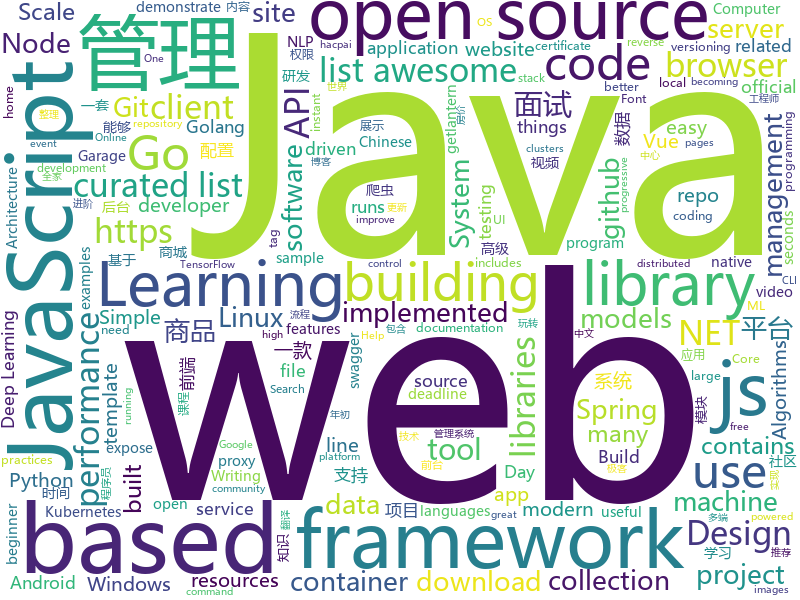

# 2019-02-13
See what the GitHub community is most excited about today.

## python
* [ludwig](https://github.com/uber/ludwig)(**832 stars today**): Ludwig is a toolbox built on top of TensorFlow that allows to train and test deep learning models without the need to write code.
* [public-apis](https://github.com/toddmotto/public-apis)(**277 stars today**): A collective list of free APIs for use in software and web development.
* [python-cheatsheet](https://github.com/gto76/python-cheatsheet)(**213 stars today**): Comprehensive Python Cheatsheet
* [clusterfuzz](https://github.com/google/clusterfuzz)(**212 stars today**): All your bug are belong to us.
* [stylegan](https://github.com/NVlabs/stylegan)(**194 stars today**): StyleGAN - Official TensorFlow Implementation
* [spektral](https://github.com/danielegrattarola/spektral)(**138 stars today**): Deep learning on graphs with Keras.
* [system-design-primer](https://github.com/donnemartin/system-design-primer)(**118 stars today**): Learn how to design large-scale systems. Prep for the system design interview. Includes Anki flashcards.
* [datashader](https://github.com/pyviz/datashader)(**102 stars today**): Turns even the largest data into images, accurately.
* [mlcourse.ai](https://github.com/Yorko/mlcourse.ai)(**62 stars today**): Open Machine Learning Course
* [ASRT_SpeechRecognition](https://github.com/nl8590687/ASRT_SpeechRecognition)(**70 stars today**): A Deep-Learning-Based Chinese Speech Recognition System 基于深度学习的中文语音识别系统
* [awesome-python](https://github.com/vinta/awesome-python)(**67 stars today**): A curated list of awesome Python frameworks, libraries, software and resources
* [compare-mt](https://github.com/neulab/compare-mt)(**69 stars today**): A script to compare machine translation results and extract salient features
* [lianjia-beike-spider](https://github.com/jumper2014/lianjia-beike-spider)(**59 stars today**): 链家网和贝壳网房价爬虫，采集北京上海广州深圳等21个中国主要城市的房价数据（小区，二手房，出租房，新房），稳定可靠快速！支持csv,MySQL, MongoDB,Excel, json存储，支持Python2和3，图表展示数据，注释丰富🚁，点星支持
* [django](https://github.com/django/django)(**47 stars today**): The Web framework for perfectionists with deadlines.
* [models](https://github.com/tensorflow/models)(**44 stars today**): Models and examples built with TensorFlow
* [EInk-Calendar](https://github.com/zli117/EInk-Calendar)(**50 stars today**): Smart calendar with EInk display and Raspberry Pi
* [bert](https://github.com/google-research/bert)(**45 stars today**): TensorFlow code and pre-trained models for BERT
* [home-assistant](https://github.com/home-assistant/home-assistant)(**41 stars today**): 🏡Open source home automation that puts local control and privacy first
* [dvc](https://github.com/iterative/dvc)(**46 stars today**): ⚡️Data & models versioning for ML projects, make them shareable and reproducible
* [weixin_crawler](https://github.com/wonderfulsuccess/weixin_crawler)(**45 stars today**): 高效微信公众号历史文章和阅读数据爬虫powered by scrapy
* [keras](https://github.com/keras-team/keras)(**40 stars today**): Deep Learning for humans
* [stanfordnlp](https://github.com/stanfordnlp/stanfordnlp)(**42 stars today**): Official Stanford NLP Python Library for Many Human Languages
* [Python](https://github.com/TheAlgorithms/Python)(**40 stars today**): All Algorithms implemented in Python
* [youtube-dl](https://github.com/rg3/youtube-dl)(**40 stars today**): Command-line program to download videos from YouTube.com and other video sites
* [tldr](https://github.com/tldr-pages/tldr)(**40 stars today**): 📚Simplified and community-driven man pages

## java
* [DoraemonKit](https://github.com/didi/DoraemonKit)(**346 stars today**): 一款功能齐全的客户端（iOS、Android）研发助手，你值得拥有。
* [advanced-java](https://github.com/doocs/advanced-java)(**166 stars today**): 😮互联网 Java 工程师进阶知识完全扫盲
* [JavaGuide](https://github.com/Snailclimb/JavaGuide)(**137 stars today**): 【Java学习+面试指南】 一份涵盖大部分Java程序员所需要掌握的核心知识。
* [geektime-spring-family](https://github.com/geektime-geekbang/geektime-spring-family)(**91 stars today**): 极客时间视频课程《玩转Spring全家桶》
* [symphony](https://github.com/b3log/symphony)(**91 stars today**): 🎶一款用 Java 实现的现代化社区（论坛/BBS/社交网络/博客）平台。https://hacpai.com
* [SuperTextView](https://github.com/chenBingX/SuperTextView)(**87 stars today**): Welcome to use SuperTextView
* [fescar](https://github.com/alibaba/fescar)(**66 stars today**): 🔥Fescar is an easy-to-use, high-performance, java based, open source distributed transaction solution.
* [mall](https://github.com/macrozheng/mall)(**54 stars today**): mall项目是一套电商系统，包括前台商城系统及后台管理系统，基于SpringBoot+MyBatis实现。 前台商城系统包含首页门户、商品推荐、商品搜索、商品展示、购物车、订单流程、会员中心、客户服务、帮助中心等模块。 后台管理系统包含商品管理、订单管理、会员管理、促销管理、运营管理、内容管理、统计报表、财务管理、权限管理、设置等模块。
* [tutorials](https://github.com/eugenp/tutorials)(**32 stars today**): The "REST With Spring" Course:
* [java-design-patterns](https://github.com/iluwatar/java-design-patterns)(**42 stars today**): Design patterns implemented in Java
* [jib](https://github.com/GoogleContainerTools/jib)(**45 stars today**): ⛵️Build container images for your Java applications.
* [spring-boot](https://github.com/spring-projects/spring-boot)(**33 stars today**): Spring Boot
* [elasticsearch](https://github.com/elastic/elasticsearch)(**33 stars today**): Open Source, Distributed, RESTful Search Engine
* [spring-framework](https://github.com/spring-projects/spring-framework)(**26 stars today**): Spring Framework
* [Java](https://github.com/TheAlgorithms/Java)(**34 stars today**): All Algorithms implemented in Java
* [h4cker](https://github.com/The-Art-of-Hacking/h4cker)(**37 stars today**): This repository is primarily maintained by Omar Santos and includes resources related to ethical hacking / penetration testing, digital forensics and incident response (DFIR), vulnerability research, exploit development, reverse engineering, and more.
* [flink](https://github.com/apache/flink)(**27 stars today**): Apache Flink
* [arthas](https://github.com/alibaba/arthas)(**29 stars today**): Alibaba Java Diagnostic Tool Arthas/Alibaba Java诊断利器Arthas
* [incubator-dubbo](https://github.com/apache/incubator-dubbo)(**24 stars today**): Apache Dubbo (incubating) is a high-performance, java based, open source RPC framework.
* [apollo](https://github.com/ctripcorp/apollo)(**23 stars today**): Apollo（阿波罗）是携程框架部门研发的分布式配置中心，能够集中化管理应用不同环境、不同集群的配置，配置修改后能够实时推送到应用端，并且具备规范的权限、流程治理等特性，适用于微服务配置管理场景。
* [nacos](https://github.com/alibaba/nacos)(**26 stars today**): an easy-to-use dynamic service discovery, configuration and service management platform for building cloud native applications.
* [guava](https://github.com/google/guava)(**26 stars today**): Google core libraries for Java
* [geektime-spring-family](https://github.com/digitalsonic/geektime-spring-family)(**25 stars today**): 极客时间视频课程《玩转Spring全家桶》
* [RxJava](https://github.com/ReactiveX/RxJava)(**22 stars today**): RxJava – Reactive Extensions for the JVM – a library for composing asynchronous and event-based programs using observable sequences for the Java VM.
* [zxing](https://github.com/zxing/zxing)(**22 stars today**): ZXing ("Zebra Crossing") barcode scanning library for Java, Android

## unknown
* [nginx-quick-reference](https://github.com/trimstray/nginx-quick-reference)(**614 stars today**): ⚡️This notes describes how to improve Nginx performance, security and other important things; ssllabs A+ 100%.
* [deep-learning-drizzle](https://github.com/kmario23/deep-learning-drizzle)(**438 stars today**): Drench yourself in Deep Learning, Reinforcement Learning, Machine Learning, Computer Vision, and NLP by learning from these exciting lectures!!
* [How-To-Secure-A-Linux-Server](https://github.com/imthenachoman/How-To-Secure-A-Linux-Server)(**406 stars today**): An evolving how-to guide for securing a Linux server.
* [nlp_chinese_corpus](https://github.com/brightmart/nlp_chinese_corpus)(**246 stars today**): 大规模中文自然语言处理语料 Large Scale Chinese Corpus for NLP
* [developer-roadmap](https://github.com/kamranahmedse/developer-roadmap)(**206 stars today**): Roadmap to becoming a web developer in 2019
* [awesome-javascript](https://github.com/sorrycc/awesome-javascript)(**149 stars today**): 🐢A collection of awesome browser-side JavaScript libraries, resources and shiny things.
* [CS-Notes](https://github.com/CyC2018/CS-Notes)(**107 stars today**): 📚技术面试必备基础知识
* [AspNetCore-Developer-Roadmap](https://github.com/MoienTajik/AspNetCore-Developer-Roadmap)(**89 stars today**): Roadmap to becoming an ASP.NET Core developer in 2019
* [blog](https://github.com/yygmind/blog)(**80 stars today**): 我是木易杨，网易高级前端工程师，跟着我每周重点攻克一个前端面试重难点。接下来让我带你走进高级前端的世界，在进阶的路上，共勉！
* [You-Dont-Know-JS](https://github.com/getify/You-Dont-Know-JS)(**66 stars today**): A book series on JavaScript. @YDKJS on twitter.
* [gitignore](https://github.com/github/gitignore)(**54 stars today**): A collection of useful .gitignore templates
* [gold-miner](https://github.com/xitu/gold-miner)(**64 stars today**): 🥇掘金翻译计划，可能是世界最大最好的英译中技术社区，最懂读者和译者的翻译平台：
* [awesome](https://github.com/sindresorhus/awesome)(**62 stars today**): 😎Curated list of awesome lists
* [free-programming-books](https://github.com/EbookFoundation/free-programming-books)(**52 stars today**): 📚Freely available programming books
* [trackerslist](https://github.com/ngosang/trackerslist)(**49 stars today**): An updated list of public BitTorrent trackers
* [awesome-cross-platform-nodejs](https://github.com/bcoe/awesome-cross-platform-nodejs)(**50 stars today**): 👬A curated list of awesome developer tools and libraries for writing and testing code that runs on Windows and Linux.
* [awesome-vue](https://github.com/vuejs/awesome-vue)(**45 stars today**): 🎉A curated list of awesome things related to Vue.js
* [coding-interview-university](https://github.com/jwasham/coding-interview-university)(**41 stars today**): A complete computer science study plan to become a software engineer.
* [100-Days-Of-ML-Code](https://github.com/Avik-Jain/100-Days-Of-ML-Code)(**36 stars today**): 100 Days of ML Coding
* [Intranet_Penetration_Tips](https://github.com/Ridter/Intranet_Penetration_Tips)(**38 stars today**): 2018年初整理的一些内网渗透TIPS，后面更新的慢，所以公开出来希望跟小伙伴们一起更新维护~
* [first-contributions](https://github.com/firstcontributions/first-contributions)(**16 stars today**): 🚀✨Help beginners to contribute to open source projects
* [GitHubDaily](https://github.com/GitHubDaily/GitHubDaily)(**39 stars today**): GitHubDaily 分享内容定期整理与分类。欢迎推荐、自荐项目，让更多人知道你的项目。
* [hosts](https://github.com/googlehosts/hosts)(**33 stars today**): 镜像：https://coding.net/u/scaffrey/p/hosts/git
* [interview](https://github.com/aylei/interview)(**36 stars today**): 写在19年初的后端社招面试经历🤑
* [semver](https://github.com/semver/semver)(**36 stars today**): Semantic Versioning Specification

## javascript
* [git-history](https://github.com/pomber/git-history)(**851 stars today**): Quickly browse the history of any GitHub file
* [instant.page](https://github.com/instantpage/instant.page)(**345 stars today**): Make your site’s pages instant in 1 minute and improve your conversion rate by 1%
* [windows95](https://github.com/felixrieseberg/windows95)(**302 stars today**): 💩🚀Windows 95 in Electron. Runs on macOS, Linux, and Windows.
* [not-paid](https://github.com/kleampa/not-paid)(**258 stars today**): Client did not pay? Add opacity to the body tag and decrease it every day until their site completely fades away
* [uppy](https://github.com/transloadit/uppy)(**229 stars today**): The next open source file uploader for web browsers🐶
* [qoa](https://github.com/klaussinani/qoa)(**226 stars today**): 💬Minimal interactive command-line prompts
* [threejs-ballooning](https://github.com/alexanderperrin/threejs-ballooning)(**202 stars today**): Buffer geometry merging, procedural terrains and shadow mapper research with Three.js
* [mercury-parser](https://github.com/postlight/mercury-parser)(**203 stars today**): 📜Extracting content from the chaos of the web.
* [javascript-algorithms](https://github.com/trekhleb/javascript-algorithms)(**167 stars today**): 📝Algorithms and data structures implemented in JavaScript with explanations and links to further readings
* [vue](https://github.com/vuejs/vue)(**116 stars today**): 🖖Vue.js is a progressive, incrementally-adoptable JavaScript framework for building UI on the web.
* [react](https://github.com/facebook/react)(**109 stars today**): A declarative, efficient, and flexible JavaScript library for building user interfaces.
* [30-seconds-of-code](https://github.com/30-seconds/30-seconds-of-code)(**102 stars today**): Curated collection of useful JavaScript snippets that you can understand in 30 seconds or less.
* [leon](https://github.com/leon-ai/leon)(**103 stars today**): 🧠 Leon is your open-source personal assistant.
* [zebu](https://github.com/modernserf/zebu)(**103 stars today**): A compiler for little languages in tagged template strings
* [flexsearch](https://github.com/nextapps-de/flexsearch)(**95 stars today**): Next-Generation full text search library for Browser and Node.js
* [chameleon](https://github.com/didi/chameleon)(**88 stars today**): 🦎一套代码运行多端，一端所见即多端所见
* [x-spreadsheet](https://github.com/myliang/x-spreadsheet)(**83 stars today**): A web-based JavaScript（canvas） spreadsheet
* [next.js](https://github.com/zeit/next.js)(**76 stars today**): The React Framework
* [puppeteer](https://github.com/GoogleChrome/puppeteer)(**68 stars today**): Headless Chrome Node API
* [nodebestpractices](https://github.com/i0natan/nodebestpractices)(**71 stars today**): The largest Node.js best practices list (January 2019)
* [javascript](https://github.com/airbnb/javascript)(**63 stars today**): JavaScript Style Guide
* [static-site-boilerplate](https://github.com/ericalli/static-site-boilerplate)(**68 stars today**): A better workflow for building modern static websites.
* [miniC-hosting](https://github.com/vasyop/miniC-hosting)(**67 stars today**): A simple stack-based virtual machine that runs C in the browser.
* [axios](https://github.com/axios/axios)(**63 stars today**): Promise based HTTP client for the browser and node.js
* [linaria](https://github.com/callstack/linaria)(**65 stars today**): Zero-runtime CSS in JS library

## html
* [evtjs](https://github.com/everitoken/evtjs)(**26 stars today**): API Bindings (SDK) for the everiToken blockchain.
* [AdminLTE](https://github.com/almasaeed2010/AdminLTE)(**19 stars today**): AdminLTE - Free Premium Admin control Panel Theme Based On Bootstrap 3.x
* [flutter-in-action](https://github.com/flutterchina/flutter-in-action)(**20 stars today**): 《Flutter实战》电子书
* [blog_os](https://github.com/phil-opp/blog_os)(**20 stars today**): Writing an OS in Rust
* [Spoon-Knife](https://github.com/octocat/Spoon-Knife)(****): This repo is for demonstration purposes only.
* [patchwork](https://github.com/jlord/patchwork)(****): All the Git-it Workshop completers!
* [javascript-tutorial-en](https://github.com/iliakan/javascript-tutorial-en)(**15 stars today**): Modern JavaScript Tutorial
* [nginxconfig.io](https://github.com/valentinxxx/nginxconfig.io)(**15 stars today**): ⚙️NGiИX config generator on steroids💉
* [ionic](https://github.com/ionic-team/ionic)(**13 stars today**): Build amazing native and progressive web apps with open web technologies. One app running on everything🎉
* [JavaScript30](https://github.com/wesbos/JavaScript30)(**6 stars today**): 30 Day Vanilla JS Challenge
* [keep-a-changelog](https://github.com/olivierlacan/keep-a-changelog)(**11 stars today**): If you build software, keep a changelog.
* [core](https://github.com/stackblitz/core)(**13 stars today**): Online IDE powered by Visual Studio Code⚡️
* [clear-linux-documentation](https://github.com/clearlinux/clear-linux-documentation)(**12 stars today**): This repository contains the documentation source files for Clear Linux OS for Intel Architecture.
* [all-contributors](https://github.com/all-contributors/all-contributors)(**9 stars today**): ✨Recognize all contributors, not just the ones who push code✨
* [portainer](https://github.com/portainer/portainer)(**10 stars today**): Simple management UI for Docker
* [WebFundamentals](https://github.com/google/WebFundamentals)(**8 stars today**): Best practices for modern web development
* [dotnet](https://github.com/Microsoft/dotnet)(**9 stars today**): This repo is the official home of .NET on GitHub. It's a great starting point to find many .NET OSS projects from Microsoft and the community, including many that are part of the .NET Foundation.
* [PoCBox](https://github.com/gh0stkey/PoCBox)(**9 stars today**): PoCBox - 漏洞测试验证辅助平台
* [swagger-codegen](https://github.com/swagger-api/swagger-codegen)(**8 stars today**): swagger-codegen contains a template-driven engine to generate documentation, API clients and server stubs in different languages by parsing your OpenAPI / Swagger definition.
* [vue-examples](https://github.com/peterlamar/vue-examples)(**9 stars today**): Collection of Vue examples for beginner front end developers
* [now-github-starter](https://github.com/zeit/now-github-starter)(****): Starter project to demonstrate a project whose pull requests get automatically deployed
* [pitstop](https://github.com/EdwinVW/pitstop)(**8 stars today**): This repo contains a sample application based on a Garage Management System for PitStop - a fictitious garage. The primary goal of this sample is to demonstrate several Web-Scale Architecture concepts like: Microservices, CQRS, Event Sourcing, Domain Driven Design (DDD), Eventual Consistency.
* [awesome-creative-coding](https://github.com/terkelg/awesome-creative-coding)(**8 stars today**): 🎨Creative Coding: Generative Art, Data visualization, Interaction Design, Resources.
* [fonts](https://github.com/google/fonts)(**8 stars today**): Font files available from Google Fonts
* [ai-deadlines](https://github.com/abhshkdz/ai-deadlines)(**7 stars today**): ⏰AI conference deadline countdowns

## go
* [1m-go-websockets](https://github.com/eranyanay/1m-go-websockets)(**219 stars today**): handling 1M websockets connections in Go
* [fathom](https://github.com/usefathom/fathom)(**140 stars today**): Fathom. Simple, trustworthy website analytics. Built with Golang & Preact.
* [chat](https://github.com/tinode/chat)(**133 stars today**): Instant messaging server; backend in Go; Android, web command line clients; chatbots
* [go-elasticsearch](https://github.com/elastic/go-elasticsearch)(**116 stars today**): The official Go client for Elasticsearch
* [go-echarts](https://github.com/chenjiandongx/go-echarts)(**111 stars today**): 🎨The adorable charts library for Golang
* [up](https://github.com/apex/up)(**105 stars today**): Deploy infinitely scalable serverless apps, apis, and sites in seconds to AWS.
* [gotop](https://github.com/cjbassi/gotop)(**94 stars today**): A terminal based graphical activity monitor inspired by gtop and vtop
* [Gorsair](https://github.com/Ullaakut/Gorsair)(**73 stars today**): Gorsair hacks its way into remote docker containers that expose their APIs.
* [v2ray-core](https://github.com/v2ray/v2ray-core)(**61 stars today**): A platform for building proxies to bypass network restrictions.
* [kuberhealthy](https://github.com/Comcast/kuberhealthy)(**61 stars today**): Easy synthetic testing for Kubernetes clusters. Works great with Prometheus.
* [tracerr](https://github.com/ztrue/tracerr)(**56 stars today**): Golang errors with stack trace and source fragments.
* [go](https://github.com/golang/go)(**45 stars today**): The Go programming language
* [hugo](https://github.com/gohugoio/hugo)(**47 stars today**): The world’s fastest framework for building websites.
* [runc](https://github.com/opencontainers/runc)(**45 stars today**): CLI tool for spawning and running containers according to the OCI specification
* [kubernetes](https://github.com/kubernetes/kubernetes)(**36 stars today**): Production-Grade Container Scheduling and Management
* [gitin](https://github.com/isacikgoz/gitin)(**45 stars today**): commit/branch/workdir explorer for git
* [awesome-go](https://github.com/avelino/awesome-go)(**38 stars today**): A curated list of awesome Go frameworks, libraries and software
* [gin](https://github.com/gin-gonic/gin)(**40 stars today**): Gin is a HTTP web framework written in Go (Golang). It features a Martini-like API with much better performance -- up to 40 times faster. If you need smashing performance, get yourself some Gin.
* [lantern](https://github.com/getlantern/lantern)(**37 stars today**): 🔴蓝灯最新版本下载 https://github.com/getlantern/download🔴Lantern Latest Download https://github.com/getlantern/download🔴
* [certificates](https://github.com/smallstep/certificates)(**36 stars today**): An online certificate authority and related tools for secure automated certificate management, so you can use TLS everywhere.
* [k9s](https://github.com/derailed/k9s)(**32 stars today**): 🐶Kubernetes CLI To Manage Your Clusters In Style!
* [gitea](https://github.com/go-gitea/gitea)(**34 stars today**): Git with a cup of tea, painless self-hosted git service
* [pipe](https://github.com/b3log/pipe)(**32 stars today**): 🎷一款小而美的博客平台，专为程序员设计。https://hacpai.com/tag/pipe
* [pomerium](https://github.com/pomerium/pomerium)(**31 stars today**): Pomerium is an identity-aware access proxy.
* [frp](https://github.com/fatedier/frp)(**29 stars today**): A fast reverse proxy to help you expose a local server behind a NAT or firewall to the internet.

## WordCloud

