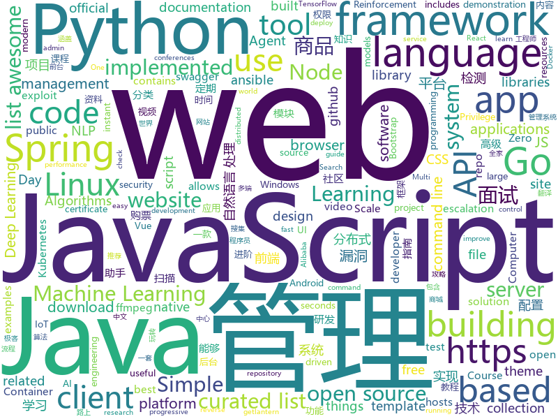

# 2019-02-14
See what the GitHub community is most excited about today.

## python
* [ludwig](https://github.com/uber/ludwig)(**761 stars today**): Ludwig is a toolbox built on top of TensorFlow that allows to train and test deep learning models without the need to write code.
* [stylegan](https://github.com/NVlabs/stylegan)(**295 stars today**): StyleGAN - Official TensorFlow Implementation
* [public-apis](https://github.com/toddmotto/public-apis)(**275 stars today**): A collective list of free APIs for use in software and web development.
* [clusterfuzz](https://github.com/google/clusterfuzz)(**208 stars today**): All your bug are belong to us.
* [python-cheatsheet](https://github.com/gto76/python-cheatsheet)(**151 stars today**): Comprehensive Python Cheatsheet
* [dirty_sock](https://github.com/initstring/dirty_sock)(**137 stars today**): Ubuntu Linux privilege escalation exploit (CVE-2019-7304)
* [system-design-primer](https://github.com/donnemartin/system-design-primer)(**93 stars today**): Learn how to design large-scale systems. Prep for the system design interview. Includes Anki flashcards.
* [Python](https://github.com/TheAlgorithms/Python)(**80 stars today**): All Algorithms implemented in Python
* [awesome-python](https://github.com/vinta/awesome-python)(**65 stars today**): A curated list of awesome Python frameworks, libraries, software and resources
* [face_recognition](https://github.com/ageitgey/face_recognition)(**61 stars today**): The world's simplest facial recognition api for Python and the command line
* [models](https://github.com/tensorflow/models)(**47 stars today**): Models and examples built with TensorFlow
* [bert](https://github.com/google-research/bert)(**49 stars today**): TensorFlow code and pre-trained models for BERT
* [mlcourse.ai](https://github.com/Yorko/mlcourse.ai)(**34 stars today**): Open Machine Learning Course
* [py12306](https://github.com/pjialin/py12306)(**44 stars today**): 🚂12306 购票助手，支持分布式，多账号，多任务购票以及 Web 页面管理
* [flair](https://github.com/zalandoresearch/flair)(**43 stars today**): A very simple framework for state-of-the-art Natural Language Processing (NLP)
* [uptux](https://github.com/initstring/uptux)(**45 stars today**): Privilege escalation checks for Linux systemd.
* [ansible](https://github.com/ansible/ansible)(**35 stars today**): Ansible is a radically simple IT automation platform that makes your applications and systems easier to deploy. Avoid writing scripts or custom code to deploy and update your applications — automate in a language that approaches plain English, using SSH, with no agents to install on remote systems. https://docs.ansible.com/ansible/
* [youtube-dl](https://github.com/rg3/youtube-dl)(**38 stars today**): Command-line program to download videos from YouTube.com and other video sites
* [smac](https://github.com/oxwhirl/smac)(**39 stars today**): SMAC: The StarCraft Multi-Agent Challenge
* [Algorithm_Interview_Notes-Chinese](https://github.com/imhuay/Algorithm_Interview_Notes-Chinese)(**35 stars today**): 2018/2019/校招/春招/秋招/算法/机器学习(Machine Learning)/深度学习(Deep Learning)/自然语言处理(NLP)/C/C++/Python/面试笔记
* [faceswap](https://github.com/deepfakes/faceswap)(**35 stars today**): Non official project based on original /r/Deepfakes thread. Many thanks to him!
* [keras](https://github.com/keras-team/keras)(**30 stars today**): Deep Learning for humans
* [PythonEXE](https://github.com/jabbalaci/PythonEXE)(**36 stars today**): How to create an executable file from a Python script?
* [pymarl](https://github.com/oxwhirl/pymarl)(**34 stars today**): Beta code release for Python Multi-Agent Reinforcement Learning framework
* [scikit-learn](https://github.com/scikit-learn/scikit-learn)(**28 stars today**): scikit-learn: machine learning in Python

## java
* [DoraemonKit](https://github.com/didi/DoraemonKit)(**595 stars today**): 简称 "DoKit" 。一款功能齐全的客户端（ iOS 、Android ）研发助手，你值得拥有。
* [JavaGuide](https://github.com/Snailclimb/JavaGuide)(**266 stars today**): 【Java学习+面试指南】 一份涵盖大部分Java程序员所需要掌握的核心知识。
* [advanced-java](https://github.com/doocs/advanced-java)(**200 stars today**): 😮互联网 Java 工程师进阶知识完全扫盲
* [jib](https://github.com/GoogleContainerTools/jib)(**159 stars today**): ⛵️Build container images for your Java applications.
* [symphony](https://github.com/b3log/symphony)(**124 stars today**): 🎶一款用 Java 实现的现代化社区（论坛/BBS/社交网络/博客）平台。https://hacpai.com
* [mall](https://github.com/macrozheng/mall)(**101 stars today**): mall项目是一套电商系统，包括前台商城系统及后台管理系统，基于SpringBoot+MyBatis实现。 前台商城系统包含首页门户、商品推荐、商品搜索、商品展示、购物车、订单流程、会员中心、客户服务、帮助中心等模块。 后台管理系统包含商品管理、订单管理、会员管理、促销管理、运营管理、内容管理、统计报表、财务管理、权限管理、设置等模块。
* [geektime-spring-family](https://github.com/geektime-geekbang/geektime-spring-family)(**79 stars today**): 极客时间视频课程《玩转Spring全家桶》
* [fescar](https://github.com/alibaba/fescar)(**80 stars today**): 🔥Fescar is an easy-to-use, high-performance, java based, open source distributed transaction solution.
* [tutorials](https://github.com/eugenp/tutorials)(**46 stars today**): The "REST With Spring" Course:
* [spring-boot](https://github.com/spring-projects/spring-boot)(**56 stars today**): Spring Boot
* [java-design-patterns](https://github.com/iluwatar/java-design-patterns)(**50 stars today**): Design patterns implemented in Java
* [SuperTextView](https://github.com/chenBingX/SuperTextView)(**56 stars today**): Welcome to use SuperTextView
* [flink](https://github.com/apache/flink)(**44 stars today**): Apache Flink
* [spring-framework](https://github.com/spring-projects/spring-framework)(**30 stars today**): Spring Framework
* [nacos](https://github.com/alibaba/nacos)(**38 stars today**): an easy-to-use dynamic service discovery, configuration and service management platform for building cloud native applications.
* [arthas](https://github.com/alibaba/arthas)(**34 stars today**): Alibaba Java Diagnostic Tool Arthas/Alibaba Java诊断利器Arthas
* [spring-boot-examples](https://github.com/ityouknow/spring-boot-examples)(**30 stars today**): about learning Spring Boot via examples. Spring Boot 教程、技术栈示例代码，快速简单上手教程。
* [Java](https://github.com/TheAlgorithms/Java)(**34 stars today**): All Algorithms implemented in Java
* [Sentinel](https://github.com/alibaba/Sentinel)(**32 stars today**): A lightweight powerful flow control component enabling reliability and monitoring for microservices. (轻量级的流量控制、熔断降级 Java 库)
* [h4cker](https://github.com/The-Art-of-Hacking/h4cker)(**32 stars today**): This repository is primarily maintained by Omar Santos and includes resources related to ethical hacking / penetration testing, digital forensics and incident response (DFIR), vulnerability research, exploit development, reverse engineering, and more.
* [apollo](https://github.com/ctripcorp/apollo)(**26 stars today**): Apollo（阿波罗）是携程框架部门研发的分布式配置中心，能够集中化管理应用不同环境、不同集群的配置，配置修改后能够实时推送到应用端，并且具备规范的权限、流程治理等特性，适用于微服务配置管理场景。
* [elasticsearch](https://github.com/elastic/elasticsearch)(**27 stars today**): Open Source, Distributed, RESTful Search Engine
* [Mi365Locker](https://github.com/rani-i/Mi365Locker)(**26 stars today**): Xiaomi Mi365 Scooter locker
* [geektime-spring-family](https://github.com/digitalsonic/geektime-spring-family)(**24 stars today**): 极客时间视频课程《玩转Spring全家桶》
* [HanLP](https://github.com/hankcs/HanLP)(**25 stars today**): 自然语言处理 中文分词 词性标注 命名实体识别 依存句法分析 新词发现 关键词短语提取 自动摘要 文本分类聚类 拼音简繁

## unknown
* [nginx-quick-reference](https://github.com/trimstray/nginx-quick-reference)(**512 stars today**): ⚡️This notes describes how to improve Nginx performance, security and other important things; ssllabs A+ 100%.
* [How-To-Secure-A-Linux-Server](https://github.com/imthenachoman/How-To-Secure-A-Linux-Server)(**303 stars today**): An evolving how-to guide for securing a Linux server.
* [deep-learning-drizzle](https://github.com/kmario23/deep-learning-drizzle)(**267 stars today**): Drench yourself in Deep Learning, Reinforcement Learning, Machine Learning, Computer Vision, and NLP by learning from these exciting lectures!!
* [nlp_chinese_corpus](https://github.com/brightmart/nlp_chinese_corpus)(**218 stars today**): 大规模中文自然语言处理语料 Large Scale Chinese Corpus for NLP
* [developer-roadmap](https://github.com/kamranahmedse/developer-roadmap)(**185 stars today**): Roadmap to becoming a web developer in 2019
* [be-a-professional-programmer](https://github.com/stanzhai/be-a-professional-programmer)(**181 stars today**): 成为专业程序员路上用到的各种优秀资料、神器及框架
* [CS-Notes](https://github.com/CyC2018/CS-Notes)(**121 stars today**): 😋技术面试必备基础知识
* [awesome](https://github.com/sindresorhus/awesome)(**75 stars today**): 😎Curated list of awesome lists
* [IoTSecurity101](https://github.com/V33RU/IoTSecurity101)(**74 stars today**): From IoT Pentesting to IoT Security
* [gitignore](https://github.com/github/gitignore)(**48 stars today**): A collection of useful .gitignore templates
* [awesome-javascript](https://github.com/sorrycc/awesome-javascript)(**69 stars today**): 🐢A collection of awesome browser-side JavaScript libraries, resources and shiny things.
* [You-Dont-Know-JS](https://github.com/getify/You-Dont-Know-JS)(**54 stars today**): A book series on JavaScript. @YDKJS on twitter.
* [blog](https://github.com/yygmind/blog)(**63 stars today**): 我是木易杨，网易高级前端工程师，跟着我每周重点攻克一个前端面试重难点。接下来让我带你走进高级前端的世界，在进阶的路上，共勉！
* [AI-Job-Notes](https://github.com/amusi/AI-Job-Notes)(**58 stars today**): AI算法岗求职攻略（涵盖准备攻略、刷题指南、内推和AI公司清单等资料）
* [hosts](https://github.com/googlehosts/hosts)(**41 stars today**): 镜像：https://coding.net/u/scaffrey/p/hosts/git
* [GitHubDaily](https://github.com/GitHubDaily/GitHubDaily)(**50 stars today**): GitHubDaily 分享内容定期整理与分类。欢迎推荐、自荐项目，让更多人知道你的项目。
* [coding-interview-university](https://github.com/jwasham/coding-interview-university)(**46 stars today**): A complete computer science study plan to become a software engineer.
* [trackerslist](https://github.com/ngosang/trackerslist)(**44 stars today**): An updated list of public BitTorrent trackers
* [free-programming-books](https://github.com/EbookFoundation/free-programming-books)(**43 stars today**): 📚Freely available programming books
* [gold-miner](https://github.com/xitu/gold-miner)(**44 stars today**): 🥇掘金翻译计划，可能是世界最大最好的英译中技术社区，最懂读者和译者的翻译平台：
* [DevOpsGirls](https://github.com/huihoo/DevOpsGirls)(**37 stars today**): Python程序媛
* [eng-handbook](https://github.com/raylene/eng-handbook)(**38 stars today**): A developer's guide to management: an open-sourced handbook for leading software engineering teams.
* [awesome-vue](https://github.com/vuejs/awesome-vue)(**35 stars today**): 🎉A curated list of awesome things related to Vue.js
* [volt](https://github.com/voltapp/volt)(**38 stars today**): 
* [100-Days-Of-ML-Code](https://github.com/Avik-Jain/100-Days-Of-ML-Code)(**30 stars today**): 100 Days of ML Coding

## javascript
* [git-history](https://github.com/pomber/git-history)(**656 stars today**): Quickly browse the history of any GitHub file
* [not-paid](https://github.com/kleampa/not-paid)(**221 stars today**): Client did not pay? Add opacity to the body tag and decrease it every day until their site completely fades away
* [instant.page](https://github.com/instantpage/instant.page)(**201 stars today**): Make your site’s pages instant in 1 minute and improve your conversion rate by 1%
* [windows95](https://github.com/felixrieseberg/windows95)(**159 stars today**): 💩🚀Windows 95 in Electron. Runs on macOS, Linux, and Windows.
* [uppy](https://github.com/transloadit/uppy)(**160 stars today**): The next open source file uploader for web browsers🐶
* [vue](https://github.com/vuejs/vue)(**116 stars today**): 🖖Vue.js is a progressive, incrementally-adoptable JavaScript framework for building UI on the web.
* [javascript-algorithms](https://github.com/trekhleb/javascript-algorithms)(**119 stars today**): 📝Algorithms and data structures implemented in JavaScript with explanations and links to further readings
* [chameleon](https://github.com/didi/chameleon)(**114 stars today**): 🦎一套代码运行多端，一端所见即多端所见
* [bootstrap](https://github.com/twbs/bootstrap)(**99 stars today**): The most popular HTML, CSS, and JavaScript framework for developing responsive, mobile first projects on the web.
* [qoa](https://github.com/klaussinani/qoa)(**110 stars today**): 💬Minimal interactive command-line prompts
* [react](https://github.com/facebook/react)(**100 stars today**): A declarative, efficient, and flexible JavaScript library for building user interfaces.
* [threejs-ballooning](https://github.com/alexanderperrin/threejs-ballooning)(**102 stars today**): Buffer geometry merging, procedural terrains and shadow mapper research with Three.js
* [30-seconds-of-code](https://github.com/30-seconds/30-seconds-of-code)(**95 stars today**): Curated collection of useful JavaScript snippets that you can understand in 30 seconds or less.
* [mercury-parser](https://github.com/postlight/mercury-parser)(**96 stars today**): 📜Extracting content from the chaos of the web.
* [nodebestpractices](https://github.com/i0natan/nodebestpractices)(**93 stars today**): The largest Node.js best practices list (January 2019)
* [linaria](https://github.com/callstack/linaria)(**79 stars today**): Zero-runtime CSS in JS library
* [create-react-app](https://github.com/facebook/create-react-app)(**64 stars today**): Set up a modern web app by running one command.
* [next.js](https://github.com/zeit/next.js)(**72 stars today**): The React Framework
* [flexsearch](https://github.com/nextapps-de/flexsearch)(**74 stars today**): Next-Generation full text search library for Browser and Node.js
* [anime](https://github.com/juliangarnier/anime)(**72 stars today**): JavaScript animation engine
* [puppeteer](https://github.com/GoogleChrome/puppeteer)(**65 stars today**): Headless Chrome Node API
* [axios](https://github.com/axios/axios)(**65 stars today**): Promise based HTTP client for the browser and node.js
* [zebu](https://github.com/modernserf/zebu)(**66 stars today**): A compiler for little languages in tagged template strings
* [react-native](https://github.com/facebook/react-native)(**54 stars today**): A framework for building native apps with React.
* [x-spreadsheet](https://github.com/myliang/x-spreadsheet)(**54 stars today**): A web-based JavaScript（canvas） spreadsheet

## html
* [relaks-wordpress-example](https://github.com/trambarhq/relaks-wordpress-example)(**61 stars today**): Building a zero-latency WordPress front-end
* [SecurityWorker](https://github.com/qiaozi-tech/SecurityWorker)(**46 stars today**): The best javascript code protection solution ever.
* [security-txt](https://github.com/securitytxt/security-txt)(**33 stars today**): A proposed standard that allows websites to define security policies.
* [convolve](https://github.com/mikepound/convolve)(**32 stars today**): Simple demonstration of separable convolutions
* [WDScanner](https://github.com/TideSec/WDScanner)(**20 stars today**): WDScanner平台目前实现了如下功能：分布式web漏洞扫描、客户管理、漏洞定期扫描、网站爬虫、暗链检测、坏链检测、网站指纹搜集、专项漏洞检测、代理搜集及部署、密码定向破解、社工库查询等功能。
* [Spoon-Knife](https://github.com/octocat/Spoon-Knife)(****): This repo is for demonstration purposes only.
* [flutter-in-action](https://github.com/flutterchina/flutter-in-action)(**18 stars today**): 《Flutter实战》电子书
* [qiubaiying.github.io](https://github.com/qiubaiying/qiubaiying.github.io)(**8 stars today**): BY Blog ->
* [JavaScript30](https://github.com/wesbos/JavaScript30)(**12 stars today**): 30 Day Vanilla JS Challenge
* [javascript-tutorial-en](https://github.com/iliakan/javascript-tutorial-en)(**14 stars today**): Modern JavaScript Tutorial
* [AdminLTE](https://github.com/almasaeed2010/AdminLTE)(**13 stars today**): AdminLTE - Free Premium Admin control Panel Theme Based On Bootstrap 3.x
* [evtjs](https://github.com/everitoken/evtjs)(**15 stars today**): API Bindings (SDK) for the everiToken blockchain.
* [startbootstrap-sb-admin-2](https://github.com/BlackrockDigital/startbootstrap-sb-admin-2)(**14 stars today**): A free, open source, Bootstrap admin theme created by Start Bootstrap
* [conferences](https://github.com/CSS-Tricks/conferences)(**12 stars today**): A public list of upcoming conferences https://conferences.css-tricks.com/
* [nginxconfig.io](https://github.com/valentinxxx/nginxconfig.io)(**13 stars today**): ⚙️NGiИX config generator on steroids💉
* [ionic](https://github.com/ionic-team/ionic)(**10 stars today**): Build amazing native and progressive web apps with open web technologies. One app running on everything🎉
* [PoCBox](https://github.com/gh0stkey/PoCBox)(**10 stars today**): PoCBox - 漏洞测试验证辅助平台
* [swagger-codegen](https://github.com/swagger-api/swagger-codegen)(**8 stars today**): swagger-codegen contains a template-driven engine to generate documentation, API clients and server stubs in different languages by parsing your OpenAPI / Swagger definition.
* [website](https://github.com/kubernetes/website)(**6 stars today**): Kubernetes website and documentation repo:
* [computer-museum-dnbwg](https://github.com/pengan1987/computer-museum-dnbwg)(**9 stars today**): 电脑博物馆 - DNBWG.com
* [inception](https://github.com/proabiral/inception)(**8 stars today**): A highly configurable tool to check for whatever you like against any number of hosts.
* [clear-linux-documentation](https://github.com/clearlinux/clear-linux-documentation)(**6 stars today**): This repository contains the documentation source files for Clear Linux OS for Intel Architecture.
* [mkdocs-material](https://github.com/squidfunk/mkdocs-material)(**8 stars today**): A Material Design theme for MkDocs
* [portainer](https://github.com/portainer/portainer)(**8 stars today**): Simple management UI for Docker
* [node-fluent-ffmpeg](https://github.com/fluent-ffmpeg/node-fluent-ffmpeg)(**8 stars today**): A fluent API to FFMPEG (http://www.ffmpeg.org)

## go
* [1m-go-websockets](https://github.com/eranyanay/1m-go-websockets)(**370 stars today**): handling 1M websockets connections in Go
* [lorca](https://github.com/zserge/lorca)(**352 stars today**): Build cross-platform modern desktop apps in Go + HTML5
* [csvq](https://github.com/mithrandie/csvq)(**165 stars today**): SQL-like query language for csv
* [fathom](https://github.com/usefathom/fathom)(**83 stars today**): Fathom. Simple, trustworthy website analytics. Built with Golang & Preact.
* [v2ray-core](https://github.com/v2ray/v2ray-core)(**76 stars today**): A platform for building proxies to bypass network restrictions.
* [chat](https://github.com/tinode/chat)(**79 stars today**): Instant messaging server; backend in Go; Android, web command line clients; chatbots
* [up](https://github.com/apex/up)(**82 stars today**): Deploy infinitely scalable serverless apps, apis, and sites in seconds to AWS.
* [kubernetes](https://github.com/kubernetes/kubernetes)(**66 stars today**): Production-Grade Container Scheduling and Management
* [go](https://github.com/golang/go)(**65 stars today**): The Go programming language
* [certificates](https://github.com/smallstep/certificates)(**68 stars today**): 🛡️An online certificate authority and related tools for secure automated certificate management, so you can use TLS everywhere.
* [docui](https://github.com/skanehira/docui)(**57 stars today**): TUI Client for Docker
* [go-echarts](https://github.com/chenjiandongx/go-echarts)(**52 stars today**): 🎨The adorable charts library for Golang
* [gotop](https://github.com/cjbassi/gotop)(**46 stars today**): A terminal based graphical activity monitor inspired by gtop and vtop
* [frp](https://github.com/fatedier/frp)(**42 stars today**): A fast reverse proxy to help you expose a local server behind a NAT or firewall to the internet.
* [lantern](https://github.com/getlantern/lantern)(**41 stars today**): 🔴蓝灯最新版本下载 https://github.com/getlantern/download🔴Lantern Latest Download https://github.com/getlantern/download🔴
* [fzf](https://github.com/junegunn/fzf)(**40 stars today**): 🌸A command-line fuzzy finder
* [dive](https://github.com/wagoodman/dive)(**37 stars today**): A tool for exploring each layer in a docker image
* [gitin](https://github.com/isacikgoz/gitin)(**37 stars today**): commit/branch/workdir explorer for git
* [kuberhealthy](https://github.com/Comcast/kuberhealthy)(**36 stars today**): Easy synthetic testing for Kubernetes clusters. Works great with Prometheus.
* [hugo](https://github.com/gohugoio/hugo)(**35 stars today**): The world’s fastest framework for building websites.
* [awesome-go](https://github.com/avelino/awesome-go)(**33 stars today**): A curated list of awesome Go frameworks, libraries and software
* [go-elasticsearch](https://github.com/elastic/go-elasticsearch)(**33 stars today**): The official Go client for Elasticsearch
* [learn-go-with-tests](https://github.com/quii/learn-go-with-tests)(**32 stars today**): Learn Go with test-driven development
* [tengo](https://github.com/d5/tengo)(**31 stars today**): A fast script language for Go
* [tracerr](https://github.com/ztrue/tracerr)(**32 stars today**): Golang errors with stack trace and source fragments.

## WordCloud

