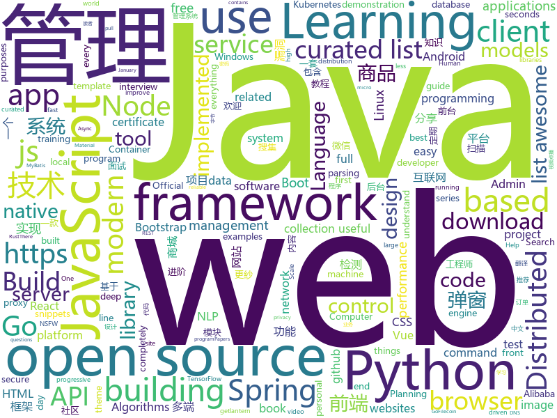

# 2019-02-16
See what the GitHub community is most excited about today.

## python
* [gpt-2](https://github.com/openai/gpt-2)(**1,152 stars today**): Code for the paper "Language Models are Unsupervised Multitask Learners"
* [stylegan](https://github.com/NVlabs/stylegan)(**345 stars today**): StyleGAN - Official TensorFlow Implementation
* [ludwig](https://github.com/uber/ludwig)(**247 stars today**): Ludwig is a toolbox built on top of TensorFlow that allows to train and test deep learning models without the need to write code.
* [public-apis](https://github.com/toddmotto/public-apis)(**138 stars today**): A collective list of free APIs for use in software and web development.
* [neural-pipeline](https://github.com/toodef/neural-pipeline)(**130 stars today**): Neural networks training pipeline based on PyTorch
* [rasa_core](https://github.com/RasaHQ/rasa_core)(**122 stars today**): 🤖Open source chatbot framework with machine learning-based dialogue management - Build contextual AI assistants
* [system-design-primer](https://github.com/donnemartin/system-design-primer)(**91 stars today**): Learn how to design large-scale systems. Prep for the system design interview. Includes Anki flashcards.
* [clusterfuzz](https://github.com/google/clusterfuzz)(**65 stars today**): All your bug are belong to us.
* [models](https://github.com/tensorflow/models)(**51 stars today**): Models and examples built with TensorFlow
* [awesome-python](https://github.com/vinta/awesome-python)(**52 stars today**): A curated list of awesome Python frameworks, libraries, software and resources
* [bert](https://github.com/google-research/bert)(**43 stars today**): TensorFlow code and pre-trained models for BERT
* [youtube-dl](https://github.com/rg3/youtube-dl)(**42 stars today**): Command-line program to download videos from YouTube.com and other video sites
* [python-cheatsheet](https://github.com/gto76/python-cheatsheet)(**39 stars today**): Comprehensive Python Cheatsheet
* [dirty_sock](https://github.com/initstring/dirty_sock)(**40 stars today**): Ubuntu Linux privilege escalation exploit (CVE-2019-7304)
* [Python](https://github.com/TheAlgorithms/Python)(**38 stars today**): All Algorithms implemented in Python
* [face_recognition](https://github.com/ageitgey/face_recognition)(**39 stars today**): The world's simplest facial recognition api for Python and the command line
* [keras](https://github.com/keras-team/keras)(**34 stars today**): Deep Learning for humans
* [jax](https://github.com/google/jax)(**38 stars today**): Composable transformations of Python+NumPy programs: differentiate, vectorize, JIT to GPU/TPU, and more
* [home-assistant](https://github.com/home-assistant/home-assistant)(**33 stars today**): 🏡Open source home automation that puts local control and privacy first
* [flask](https://github.com/pallets/flask)(**36 stars today**): The Python micro framework for building web applications.
* [databases](https://github.com/encode/databases)(**37 stars today**): Async database support for Python.🗄
* [gluon-cv](https://github.com/dmlc/gluon-cv)(**32 stars today**): Gluon CV Toolkit
* [planet](https://github.com/google-research/planet)(**33 stars today**): Deep Planning Network: Control from pixels by latent planning with learned dynamics
* [cpython](https://github.com/python/cpython)(**24 stars today**): The Python programming language
* [stanfordnlp](https://github.com/stanfordnlp/stanfordnlp)(**34 stars today**): Official Stanford NLP Python Library for Many Human Languages

## java
* [DoraemonKit](https://github.com/didi/DoraemonKit)(**448 stars today**): 简称 "DoKit" 。一款功能齐全的客户端（ iOS 、Android ）研发助手，你值得拥有。
* [JavaGuide](https://github.com/Snailclimb/JavaGuide)(**264 stars today**): 【Java学习+面试指南】 一份涵盖大部分Java程序员所需要掌握的核心知识。
* [advanced-java](https://github.com/doocs/advanced-java)(**233 stars today**): 😮互联网 Java 工程师进阶知识完全扫盲
* [fescar](https://github.com/alibaba/fescar)(**102 stars today**): 🔥Fescar is an easy-to-use, high-performance, java based, open source distributed transaction solution.
* [mall](https://github.com/macrozheng/mall)(**99 stars today**): mall项目是一套电商系统，包括前台商城系统及后台管理系统，基于SpringBoot+MyBatis实现。 前台商城系统包含首页门户、商品推荐、商品搜索、商品展示、购物车、订单流程、会员中心、客户服务、帮助中心等模块。 后台管理系统包含商品管理、订单管理、会员管理、促销管理、运营管理、内容管理、统计报表、财务管理、权限管理、设置等模块。
* [spring-boot-examples](https://github.com/ityouknow/spring-boot-examples)(**81 stars today**): about learning Spring Boot via examples. Spring Boot 教程、技术栈示例代码，快速简单上手教程。
* [arthas](https://github.com/alibaba/arthas)(**76 stars today**): Alibaba Java Diagnostic Tool Arthas/Alibaba Java诊断利器Arthas
* [MyPerf4J](https://github.com/LinShunKang/MyPerf4J)(**76 stars today**): High performance Java APM. Powered by ASM.
* [jib](https://github.com/GoogleContainerTools/jib)(**78 stars today**): ⛵️Build container images for your Java applications.
* [spring-boot](https://github.com/spring-projects/spring-boot)(**55 stars today**): Spring Boot
* [java-design-patterns](https://github.com/iluwatar/java-design-patterns)(**58 stars today**): Design patterns implemented in Java
* [litemall](https://github.com/linlinjava/litemall)(**55 stars today**): 又一个小商城。litemall = Spring Boot后端 + Vue管理员前端 + 微信小程序用户前端
* [tutorials](https://github.com/eugenp/tutorials)(**34 stars today**): The "REST With Spring" Course:
* [miaosha](https://github.com/qiurunze123/miaosha)(**44 stars today**): ⛹️🐘秒杀系统设计与实现.互联网工程师进阶与分析🙋🐓
* [PushLibrary](https://github.com/YoloHuang/PushLibrary)(**45 stars today**): 一个集合所有主流厂商的推送框架
* [Java](https://github.com/TheAlgorithms/Java)(**39 stars today**): All Algorithms implemented in Java
* [elasticsearch](https://github.com/elastic/elasticsearch)(**35 stars today**): Open Source, Distributed, RESTful Search Engine
* [symphony](https://github.com/b3log/symphony)(**39 stars today**): 🎶一款用 Java 实现的现代化社区（论坛/BBS/社交网络/博客）平台。https://hacpai.com
* [spring-framework](https://github.com/spring-projects/spring-framework)(**31 stars today**): Spring Framework
* [flink](https://github.com/apache/flink)(**30 stars today**): Apache Flink
* [geektime-spring-family](https://github.com/geektime-geekbang/geektime-spring-family)(**35 stars today**): 极客时间视频课程《玩转Spring全家桶》
* [PopLayer](https://github.com/MrCodeSniper/PopLayer)(**37 stars today**): 一个通用的Android端弹窗管理框架,内部维护弹窗优先级队列 具备弹窗管理扩展功能 整合Dialog,PoupoWindow,悬浮Widget,透明Webview,Toast,SnackBar,无需再为繁琐的业务弹窗逻辑所困扰
* [okhttp](https://github.com/square/okhttp)(**32 stars today**): An HTTP+HTTP/2 client for Android and Java applications.
* [nacos](https://github.com/alibaba/nacos)(**32 stars today**): an easy-to-use dynamic service discovery, configuration and service management platform for building cloud native applications.
* [incubator-dubbo](https://github.com/apache/incubator-dubbo)(**27 stars today**): Apache Dubbo (incubating) is a high-performance, java based, open source RPC framework.

## unknown
* [nsfw_data_source_urls](https://github.com/EBazarov/nsfw_data_source_urls)(**349 stars today**): Collection of NSFW images URLs for the purposes of training an NSFW Image Classifier
* [Awesome-Design-Tools](https://github.com/LisaDziuba/Awesome-Design-Tools)(**267 stars today**): The best design tools for everything.
* [nlp_chinese_corpus](https://github.com/brightmart/nlp_chinese_corpus)(**253 stars today**): 大规模中文自然语言处理语料 Large Scale Chinese Corpus for NLP
* [nginx-quick-reference](https://github.com/trimstray/nginx-quick-reference)(**247 stars today**): ⚡️This notes describes how to improve Nginx performance, security and other important things; ssllabs A+ 100%.
* [developer-roadmap](https://github.com/kamranahmedse/developer-roadmap)(**231 stars today**): Roadmap to becoming a web developer in 2019
* [How-To-Secure-A-Linux-Server](https://github.com/imthenachoman/How-To-Secure-A-Linux-Server)(**186 stars today**): An evolving how-to guide for securing a Linux server.
* [CS-Notes](https://github.com/CyC2018/CS-Notes)(**153 stars today**): 😋技术面试必备基础知识
* [snell](https://github.com/surge-networks/snell)(**138 stars today**): An encrypted proxy service program
* [pwc](https://github.com/zziz/pwc)(**88 stars today**): Papers with code. Sorted by stars. Updated weekly.
* [awesome-ida-x64-olly-plugin](https://github.com/fr0gger/awesome-ida-x64-olly-plugin)(**85 stars today**): A curated list of IDA x64DBG and OllyDBG plugins.
* [deep-learning-drizzle](https://github.com/kmario23/deep-learning-drizzle)(**83 stars today**): Drench yourself in Deep Learning, Reinforcement Learning, Machine Learning, Computer Vision, and NLP by learning from these exciting lectures!!
* [awesome](https://github.com/sindresorhus/awesome)(**80 stars today**): 😎Curated list of awesome lists
* [You-Dont-Know-JS](https://github.com/getify/You-Dont-Know-JS)(**60 stars today**): A book series on JavaScript. @YDKJS on twitter.
* [gitignore](https://github.com/github/gitignore)(**49 stars today**): A collection of useful .gitignore templates
* [free-programming-books](https://github.com/EbookFoundation/free-programming-books)(**54 stars today**): 📚Freely available programming books
* [coding-interview-university](https://github.com/jwasham/coding-interview-university)(**48 stars today**): A complete computer science study plan to become a software engineer.
* [hosts](https://github.com/googlehosts/hosts)(**36 stars today**): 镜像：https://coding.net/u/scaffrey/p/hosts/git
* [chromium](https://github.com/jjqqkk/chromium)(**38 stars today**): Chromium browser with SSL VPN. Use this browser to unblock websites.
* [GitHubDaily](https://github.com/GitHubDaily/GitHubDaily)(**39 stars today**): GitHubDaily 分享内容定期整理与分类。欢迎推荐、自荐项目，让更多人知道你的项目。
* [awesome-vue](https://github.com/vuejs/awesome-vue)(**36 stars today**): 🎉A curated list of awesome things related to Vue.js
* [first-contributions](https://github.com/firstcontributions/first-contributions)(**23 stars today**): 🚀✨Help beginners to contribute to open source projects
* [engineering-code-of-conduct](https://github.com/digitalocean/engineering-code-of-conduct)(**34 stars today**): Code of Conduct for DigitalOcean's Engineering Team
* [awesome-spring-boot](https://github.com/ityouknow/awesome-spring-boot)(**31 stars today**): Spring Boot Resources
* [gold-miner](https://github.com/xitu/gold-miner)(**30 stars today**): 🥇掘金翻译计划，可能是世界最大最好的英译中技术社区，最懂读者和译者的翻译平台：
* [weekly](https://github.com/ruanyf/weekly)(**29 stars today**): 技术分享周刊，每周五发布

## javascript
* [leon](https://github.com/leon-ai/leon)(**564 stars today**): 🧠 Leon is your open-source personal assistant.
* [git-history](https://github.com/pomber/git-history)(**289 stars today**): Quickly browse the history of any GitHub file
* [Motrix](https://github.com/agalwood/Motrix)(**235 stars today**): A full-featured download manager.
* [chameleon](https://github.com/didi/chameleon)(**215 stars today**): 🦎一套代码运行多端，一端所见即多端所见
* [uppy](https://github.com/transloadit/uppy)(**169 stars today**): The next open source file uploader for web browsers🐶
* [instant.page](https://github.com/instantpage/instant.page)(**147 stars today**): Make your site’s pages instant in 1 minute and improve your conversion rate by 1%
* [not-paid](https://github.com/kleampa/not-paid)(**142 stars today**): Client did not pay? Add opacity to the body tag and decrease it every day until their site completely fades away
* [vue](https://github.com/vuejs/vue)(**115 stars today**): 🖖Vue.js is a progressive, incrementally-adoptable JavaScript framework for building UI on the web.
* [trilium](https://github.com/zadam/trilium)(**107 stars today**): Build your personal knowledge base with Trilium Notes
* [react](https://github.com/facebook/react)(**92 stars today**): A declarative, efficient, and flexible JavaScript library for building user interfaces.
* [30-seconds-of-code](https://github.com/30-seconds/30-seconds-of-code)(**96 stars today**): Curated collection of useful JavaScript snippets that you can understand in 30 seconds or less.
* [qoa](https://github.com/klaussinani/qoa)(**92 stars today**): 💬Minimal interactive command-line prompts
* [flexsearch](https://github.com/nextapps-de/flexsearch)(**78 stars today**): Next-Generation full text search library for Browser and Node.js
* [33-js-concepts](https://github.com/leonardomso/33-js-concepts)(**68 stars today**): 📜33 concepts every JavaScript developer should know.
* [bootstrap](https://github.com/twbs/bootstrap)(**59 stars today**): The most popular HTML, CSS, and JavaScript framework for developing responsive, mobile first projects on the web.
* [javascript-algorithms](https://github.com/trekhleb/javascript-algorithms)(**64 stars today**): 📝Algorithms and data structures implemented in JavaScript with explanations and links to further readings
* [axios](https://github.com/axios/axios)(**64 stars today**): Promise based HTTP client for the browser and node.js
* [puppeteer](https://github.com/GoogleChrome/puppeteer)(**62 stars today**): Headless Chrome Node API
* [create-react-app](https://github.com/facebook/create-react-app)(**57 stars today**): Set up a modern web app by running one command.
* [taro](https://github.com/NervJS/taro)(**59 stars today**): 多端统一开发框架，支持用 React 的开发方式编写一次代码，生成能运行在微信/百度/支付宝/字节跳动小程序、H5、React Native 等的应用。 https://taro.js.org/
* [Sarasa-Gothic](https://github.com/be5invis/Sarasa-Gothic)(**61 stars today**): Sarasa Gothic / 更纱黑体 / 更紗黑體 / 更紗ゴシック
* [mercury-parser](https://github.com/postlight/mercury-parser)(**56 stars today**): 📜Extracting content from the chaos of the web.
* [gatsby](https://github.com/gatsbyjs/gatsby)(**51 stars today**): Build blazing fast, modern apps and websites with React
* [windows95](https://github.com/felixrieseberg/windows95)(**55 stars today**): 💩🚀Windows 95 in Electron. Runs on macOS, Linux, and Windows.
* [nodebestpractices](https://github.com/i0natan/nodebestpractices)(**48 stars today**): The largest Node.js best practices list (January 2019)

## html
* [WDScanner](https://github.com/TideSec/WDScanner)(**35 stars today**): WDScanner平台目前实现了如下功能：分布式web漏洞扫描、客户管理、漏洞定期扫描、网站爬虫、暗链检测、坏链检测、网站指纹搜集、专项漏洞检测、代理搜集及部署、密码定向破解、社工库查询等功能。
* [markdown-mark](https://github.com/dcurtis/markdown-mark)(**38 stars today**): Use this mark to identify Markdown.
* [flutter-in-action](https://github.com/flutterchina/flutter-in-action)(**25 stars today**): 《Flutter实战》电子书
* [frontendDaily](https://github.com/kujian/frontendDaily)(**23 stars today**): 前端开发技术日报，每日分享互联网最精彩的前端技术、前端资讯、后端编程、设计和资源等，欢迎关注Watch
* [styleguide](https://github.com/google/styleguide)(**18 stars today**): Style guides for Google-originated open-source projects
* [Front-end-Developer-Interview-Questions](https://github.com/h5bp/Front-end-Developer-Interview-Questions)(**23 stars today**): A list of helpful front-end related questions you can use to interview potential candidates, test yourself or completely ignore.
* [AdminLTE](https://github.com/almasaeed2010/AdminLTE)(**17 stars today**): AdminLTE - Free Premium Admin control Panel Theme Based On Bootstrap 3.x
* [Spoon-Knife](https://github.com/octocat/Spoon-Knife)(****): This repo is for demonstration purposes only.
* [convolve](https://github.com/mikepound/convolve)(**15 stars today**): Simple demonstration of separable convolutions
* [ionic](https://github.com/ionic-team/ionic)(**14 stars today**): Build amazing native and progressive web apps with open web technologies. One app running on everything🎉
* [JavaScript30](https://github.com/wesbos/JavaScript30)(**5 stars today**): 30 Day Vanilla JS Challenge
* [dataviz](https://github.com/clauswilke/dataviz)(**13 stars today**): A book covering the fundamentals of data visualization.
* [startbootstrap-sb-admin-2](https://github.com/BlackrockDigital/startbootstrap-sb-admin-2)(**13 stars today**): A free, open source, Bootstrap admin theme created by Start Bootstrap
* [swagger-codegen](https://github.com/swagger-api/swagger-codegen)(**10 stars today**): swagger-codegen contains a template-driven engine to generate documentation, API clients and server stubs in different languages by parsing your OpenAPI / Swagger definition.
* [requests-html](https://github.com/kennethreitz/requests-html)(**11 stars today**): Pythonic HTML Parsing for Humans™
* [30-seconds-of-css](https://github.com/30-seconds/30-seconds-of-css)(**11 stars today**): A curated collection of useful CSS snippets you can understand in 30 seconds or less.
* [javascript-tutorial-en](https://github.com/iliakan/javascript-tutorial-en)(**9 stars today**): Modern JavaScript Tutorial
* [pytorch-doc-zh](https://github.com/apachecn/pytorch-doc-zh)(**9 stars today**): PyTorch 中文文档
* [now-github-starter](https://github.com/zeit/now-github-starter)(****): Starter project to demonstrate a project whose pull requests get automatically deployed
* [relaks-wordpress-example](https://github.com/trambarhq/relaks-wordpress-example)(**10 stars today**): Building a zero-latency WordPress front-end
* [videoproject](https://github.com/geeeeeeeek/videoproject)(**10 stars today**): 基于django的视频点播网站
* [gentelella](https://github.com/ColorlibHQ/gentelella)(**9 stars today**): Free Bootstrap 3 Admin Template
* [blog_os](https://github.com/phil-opp/blog_os)(**8 stars today**): Writing an OS in Rust
* [build-apis-2](https://github.com/apisyouwonthate/build-apis-2)(**9 stars today**): There has been a lot of change in API-land since the first book, so lets stop building APIs like it's 2013.
* [material-design-lite](https://github.com/google/material-design-lite)(****): Material Design Components in HTML/CSS/JS

## go
* [1m-go-websockets](https://github.com/eranyanay/1m-go-websockets)(**504 stars today**): handling 1M websockets connections in Go
* [go-filecoin](https://github.com/filecoin-project/go-filecoin)(**320 stars today**): Filecoin Full Node Implementation in Go
* [talos](https://github.com/autonomy/talos)(**143 stars today**): A modern Linux distribution for Kubernetes.
* [gotop](https://github.com/cjbassi/gotop)(**127 stars today**): A terminal based graphical activity monitor inspired by gtop and vtop
* [frp](https://github.com/fatedier/frp)(**109 stars today**): A fast reverse proxy to help you expose a local server behind a NAT or firewall to the internet.
* [lorca](https://github.com/zserge/lorca)(**105 stars today**): Build cross-platform modern desktop apps in Go + HTML5
* [AdGuardHome](https://github.com/AdguardTeam/AdGuardHome)(**60 stars today**): Network-wide ads & trackers blocking DNS server
* [kubernetes](https://github.com/kubernetes/kubernetes)(**49 stars today**): Production-Grade Container Scheduling and Management
* [go](https://github.com/golang/go)(**52 stars today**): The Go programming language
* [lantern](https://github.com/getlantern/lantern)(**52 stars today**): 🔴蓝灯最新版本下载 https://github.com/getlantern/download🔴Lantern Latest Download https://github.com/getlantern/download🔴
* [awesome-go](https://github.com/avelino/awesome-go)(**51 stars today**): A curated list of awesome Go frameworks, libraries and software
* [go-elasticsearch](https://github.com/elastic/go-elasticsearch)(**51 stars today**): The official Go client for Elasticsearch
* [v2ray-core](https://github.com/v2ray/v2ray-core)(**48 stars today**): A platform for building proxies to bypass network restrictions.
* [skaffold](https://github.com/GoogleContainerTools/skaffold)(**43 stars today**): Easy and Repeatable Kubernetes Development
* [learn-go-with-tests](https://github.com/quii/learn-go-with-tests)(**38 stars today**): Learn Go with test-driven development
* [go-chart](https://github.com/wcharczuk/go-chart)(**39 stars today**): go chart is a basic charting library in native golang.
* [wego](https://github.com/schachmat/wego)(**37 stars today**): weather app for the terminal
* [certify](https://github.com/johanbrandhorst/certify)(**35 stars today**): Automatic client and server certificate distribution and maintenance
* [prometheus](https://github.com/prometheus/prometheus)(**33 stars today**): The Prometheus monitoring system and time series database.
* [etcd](https://github.com/etcd-io/etcd)(**30 stars today**): Distributed reliable key-value store for the most critical data of a distributed system
* [dgraph](https://github.com/dgraph-io/dgraph)(**33 stars today**): Fast, Distributed Graph DB
* [vault](https://github.com/hashicorp/vault)(**30 stars today**): A tool for secrets management, encryption as a service, and privileged access management
* [istio](https://github.com/istio/istio)(**27 stars today**): Connect, secure, control, and observe services.
* [hugo](https://github.com/gohugoio/hugo)(**29 stars today**): The world’s fastest framework for building websites.
* [certificates](https://github.com/smallstep/certificates)(**28 stars today**): 🛡️An online certificate authority and related tools for secure automated certificate management, so you can use TLS everywhere.

## WordCloud

