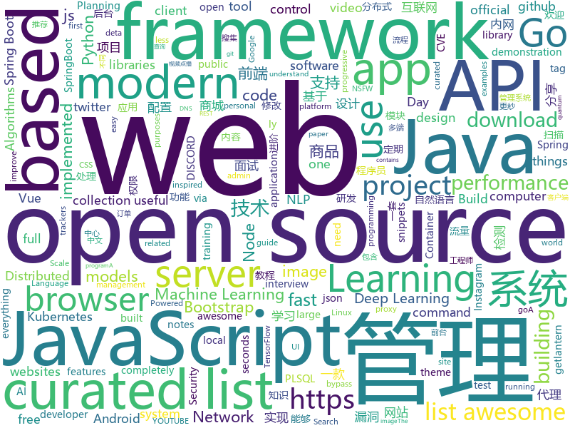

# 2019-02-17
See what the GitHub community is most excited about today.

## python
* [gpt-2](https://github.com/openai/gpt-2)(**492 stars today**): Code for the paper "Language Models are Unsupervised Multitask Learners"
* [stylegan](https://github.com/NVlabs/stylegan)(**284 stars today**): StyleGAN - Official TensorFlow Implementation
* [ludwig](https://github.com/uber/ludwig)(**173 stars today**): Ludwig is a toolbox built on top of TensorFlow that allows to train and test deep learning models without the need to write code.
* [planet](https://github.com/google-research/planet)(**138 stars today**): Deep Planning Network: Control from pixels by latent planning with learned dynamics
* [rasa_core](https://github.com/RasaHQ/rasa_core)(**122 stars today**): 🤖Open source chatbot framework with machine learning-based dialogue management - Build contextual AI assistants
* [public-apis](https://github.com/toddmotto/public-apis)(**111 stars today**): A collective list of free APIs for use in software and web development.
* [PayloadsAllTheThings](https://github.com/swisskyrepo/PayloadsAllTheThings)(**55 stars today**): A list of useful payloads and bypass for Web Application Security and Pentest/CTF
* [neural-pipeline](https://github.com/toodef/neural-pipeline)(**48 stars today**): Neural networks training pipeline based on PyTorch
* [system-design-primer](https://github.com/donnemartin/system-design-primer)(**45 stars today**): Learn how to design large-scale systems. Prep for the system design interview. Includes Anki flashcards.
* [models](https://github.com/tensorflow/models)(**39 stars today**): Models and examples built with TensorFlow
* [magic-wormhole](https://github.com/warner/magic-wormhole)(**45 stars today**): get things from one computer to another, safely
* [clusterfuzz](https://github.com/google/clusterfuzz)(**38 stars today**): All your bug are belong to us.
* [youtube-dl](https://github.com/rg3/youtube-dl)(**35 stars today**): Command-line program to download videos from YouTube.com and other video sites
* [Python](https://github.com/TheAlgorithms/Python)(**25 stars today**): All Algorithms implemented in Python
* [python-cheatsheet](https://github.com/gto76/python-cheatsheet)(**30 stars today**): Comprehensive Python Cheatsheet
* [awesome-python](https://github.com/vinta/awesome-python)(**28 stars today**): A curated list of awesome Python frameworks, libraries, software and resources
* [keras](https://github.com/keras-team/keras)(**26 stars today**): Deep Learning for humans
* [faceswap](https://github.com/deepfakes/faceswap)(**25 stars today**): Non official project based on original /r/Deepfakes thread. Many thanks to him!
* [Algorithm_Interview_Notes-Chinese](https://github.com/imhuay/Algorithm_Interview_Notes-Chinese)(**24 stars today**): 2018/2019/校招/春招/秋招/算法/机器学习(Machine Learning)/深度学习(Deep Learning)/自然语言处理(NLP)/C/C++/Python/面试笔记
* [home-assistant](https://github.com/home-assistant/home-assistant)(**24 stars today**): 🏡Open source home automation that puts local control and privacy first
* [InstaPy](https://github.com/timgrossmann/InstaPy)(**22 stars today**): 📷Instagram Bot - Tool for automated Instagram interactions
* [mlcourse.ai](https://github.com/Yorko/mlcourse.ai)(**15 stars today**): Open Machine Learning Course
* [dirty_sock](https://github.com/initstring/dirty_sock)(**23 stars today**): Linux privilege escalation exploit via snapd (CVE-2019-7304)
* [face_recognition](https://github.com/ageitgey/face_recognition)(**21 stars today**): The world's simplest facial recognition api for Python and the command line
* [bert](https://github.com/google-research/bert)(**21 stars today**): TensorFlow code and pre-trained models for BERT

## java
* [DoraemonKit](https://github.com/didi/DoraemonKit)(**112 stars today**): 简称 "DoKit" 。一款功能齐全的客户端（ iOS 、Android ）研发助手，你值得拥有。
* [JavaGuide](https://github.com/Snailclimb/JavaGuide)(**92 stars today**): 【Java学习+面试指南】 一份涵盖大部分Java程序员所需要掌握的核心知识。
* [advanced-java](https://github.com/doocs/advanced-java)(**76 stars today**): 😮互联网 Java 工程师进阶知识完全扫盲
* [mall](https://github.com/macrozheng/mall)(**65 stars today**): mall项目是一套电商系统，包括前台商城系统及后台管理系统，基于SpringBoot+MyBatis实现。 前台商城系统包含首页门户、商品推荐、商品搜索、商品展示、购物车、订单流程、会员中心、客户服务、帮助中心等模块。 后台管理系统包含商品管理、订单管理、会员管理、促销管理、运营管理、内容管理、统计报表、财务管理、权限管理、设置等模块。
* [DETA_DataBase](https://github.com/yaoguangluo/DETA_DataBase)(**44 stars today**): 🚀Deta quantum-field json PLSQL database integrated in deta《VPCS架构》http server. size 30KB / Json量子碎片去死锁带binlog动态回滚的PLSQL数据库，启动50毫秒，100,000 QPS
* [spring-boot](https://github.com/spring-projects/spring-boot)(**35 stars today**): Spring Boot
* [fescar](https://github.com/alibaba/fescar)(**33 stars today**): 🔥Fescar is an easy-to-use, high-performance, java based, open source distributed transaction solution.
* [jib](https://github.com/GoogleContainerTools/jib)(**34 stars today**): ⛵️Build container images for your Java applications.
* [miaosha](https://github.com/qiurunze123/miaosha)(**31 stars today**): ⛹️🐘秒杀系统设计与实现.互联网工程师进阶与分析🙋🐓
* [geektime-spring-family](https://github.com/geektime-geekbang/geektime-spring-family)(**27 stars today**): 极客时间视频课程《玩转Spring全家桶》
* [Java](https://github.com/TheAlgorithms/Java)(**27 stars today**): All Algorithms implemented in Java
* [spring-framework](https://github.com/spring-projects/spring-framework)(**20 stars today**): Spring Framework
* [litemall](https://github.com/linlinjava/litemall)(**22 stars today**): 又一个小商城。litemall = Spring Boot后端 + Vue管理员前端 + 微信小程序用户前端
* [V2EX](https://github.com/MrDenua/V2EX)(**24 stars today**): V2EX 第三方 Android 客户端
* [tutorials](https://github.com/eugenp/tutorials)(**20 stars today**): The "REST With Spring" Course:
* [spring-boot-examples](https://github.com/ityouknow/spring-boot-examples)(**21 stars today**): about learning Spring Boot via examples. Spring Boot 教程、技术栈示例代码，快速简单上手教程。
* [x7](https://github.com/x-ream/x7)(**23 stars today**): 
* [elasticsearch](https://github.com/elastic/elasticsearch)(**15 stars today**): Open Source, Distributed, RESTful Search Engine
* [MyPerf4J](https://github.com/LinShunKang/MyPerf4J)(**17 stars today**): High performance Java APM. Powered by ASM.
* [guava](https://github.com/google/guava)(**16 stars today**): Google core libraries for Java
* [solo](https://github.com/b3log/solo)(**15 stars today**): 🎸一款小而美的博客系统，专为程序员设计。https://hacpai.com/tag/solo
* [Magisk](https://github.com/topjohnwu/Magisk)(**15 stars today**): A Magic Mask to Alter Android System Systemless-ly
* [OnlineExecutor](https://github.com/TangBean/OnlineExecutor)(**15 stars today**): 基于 SpringBoot 的在线 Java IDE
* [java-design-patterns](https://github.com/iluwatar/java-design-patterns)(**14 stars today**): Design patterns implemented in Java
* [apollo](https://github.com/ctripcorp/apollo)(**13 stars today**): Apollo（阿波罗）是携程框架部门研发的分布式配置中心，能够集中化管理应用不同环境、不同集群的配置，配置修改后能够实时推送到应用端，并且具备规范的权限、流程治理等特性，适用于微服务配置管理场景。

## unknown
* [How-To-Secure-A-Linux-Server](https://github.com/imthenachoman/How-To-Secure-A-Linux-Server)(**1,105 stars today**): An evolving how-to guide for securing a Linux server.
* [Awesome-Design-Tools](https://github.com/LisaDziuba/Awesome-Design-Tools)(**245 stars today**): The best design tools for everything.
* [nsfw_data_source_urls](https://github.com/EBazarov/nsfw_data_source_urls)(**160 stars today**): Collection of NSFW images URLs for the purposes of training an NSFW Image Classifier
* [nginx-quick-reference](https://github.com/trimstray/nginx-quick-reference)(**150 stars today**): ⚡️This notes describes how to improve Nginx performance, security and other important things; ssllabs A+ 100%.
* [developer-roadmap](https://github.com/kamranahmedse/developer-roadmap)(**111 stars today**): Roadmap to becoming a web developer in 2019
* [CS-Notes](https://github.com/CyC2018/CS-Notes)(**95 stars today**): 😋技术面试必备基础知识
* [deep-learning-drizzle](https://github.com/kmario23/deep-learning-drizzle)(**82 stars today**): Drench yourself in Deep Learning, Reinforcement Learning, Machine Learning, Computer Vision, and NLP by learning from these exciting lectures!!
* [nlp_chinese_corpus](https://github.com/brightmart/nlp_chinese_corpus)(**59 stars today**): 大规模中文自然语言处理语料 Large Scale Chinese Corpus for NLP
* [weekly](https://github.com/ruanyf/weekly)(**55 stars today**): 技术分享周刊，每周五发布
* [awesome](https://github.com/sindresorhus/awesome)(**51 stars today**): 😎Curated list of awesome lists
* [snell](https://github.com/surge-networks/snell)(**52 stars today**): An encrypted proxy service program
* [gitignore](https://github.com/github/gitignore)(**36 stars today**): A collection of useful .gitignore templates
* [awesome-image-classification](https://github.com/weiaicunzai/awesome-image-classification)(**44 stars today**): A curated list of deep learning image classification papers and codes
* [You-Dont-Know-JS](https://github.com/getify/You-Dont-Know-JS)(**42 stars today**): A book series on JavaScript. @YDKJS on twitter.
* [awesome-ida-x64-olly-plugin](https://github.com/fr0gger/awesome-ida-x64-olly-plugin)(**41 stars today**): A curated list of IDA x64DBG and OllyDBG plugins.
* [coding-interview-university](https://github.com/jwasham/coding-interview-university)(**26 stars today**): A complete computer science study plan to become a software engineer.
* [trackerslist](https://github.com/ngosang/trackerslist)(**25 stars today**): An updated list of public BitTorrent trackers
* [hosts](https://github.com/googlehosts/hosts)(**21 stars today**): 镜像：https://coding.net/u/scaffrey/p/hosts/git
* [awesome-vue](https://github.com/vuejs/awesome-vue)(**23 stars today**): 🎉A curated list of awesome things related to Vue.js
* [free-programming-books](https://github.com/EbookFoundation/free-programming-books)(**22 stars today**): 📚Freely available programming books
* [awesome-public-datasets](https://github.com/awesomedata/awesome-public-datasets)(**24 stars today**): A topic-centric list of HQ open datasets in public domains. PR ☛☛☛
* [awesome-for-beginners](https://github.com/MunGell/awesome-for-beginners)(**23 stars today**): A list of awesome beginners-friendly projects.
* [awesome-sysadmin](https://github.com/kahun/awesome-sysadmin)(**23 stars today**): A curated list of amazingly awesome open source sysadmin resources inspired by Awesome PHP.
* [GitHubDaily](https://github.com/GitHubDaily/GitHubDaily)(**21 stars today**): GitHubDaily 分享内容定期整理与分类。欢迎推荐、自荐项目，让更多人知道你的项目。
* [chromium](https://github.com/jjqqkk/chromium)(**18 stars today**): Chromium browser with SSL VPN. Use this browser to unblock websites.

## javascript
* [leon](https://github.com/leon-ai/leon)(**672 stars today**): 🧠 Leon is your open-source personal assistant.
* [git-history](https://github.com/pomber/git-history)(**159 stars today**): Quickly browse the history of any GitHub file
* [uppy](https://github.com/transloadit/uppy)(**126 stars today**): The next open source file uploader for web browsers🐶
* [Motrix](https://github.com/agalwood/Motrix)(**110 stars today**): A full-featured download manager.
* [vue](https://github.com/vuejs/vue)(**83 stars today**): 🖖Vue.js is a progressive, incrementally-adoptable JavaScript framework for building UI on the web.
* [chameleon](https://github.com/didi/chameleon)(**73 stars today**): 🦎一套代码运行多端，一端所见即多端所见
* [react](https://github.com/facebook/react)(**63 stars today**): A declarative, efficient, and flexible JavaScript library for building user interfaces.
* [30-seconds-of-code](https://github.com/30-seconds/30-seconds-of-code)(**67 stars today**): Curated collection of useful JavaScript snippets that you can understand in 30 seconds or less.
* [instant.page](https://github.com/instantpage/instant.page)(**66 stars today**): Make your site’s pages instant in 1 minute and improve your conversion rate by 1%
* [split](https://github.com/nathancahill/split)(**53 stars today**): Unopinionated utilities for resizeable split views
* [trilium](https://github.com/zadam/trilium)(**52 stars today**): Build your personal knowledge base with Trilium Notes
* [oldtweets.today](https://github.com/shalvah/oldtweets.today)(**46 stars today**): "On This Day" for Twitter #TwitterThrowback
* [bootstrap](https://github.com/twbs/bootstrap)(**41 stars today**): The most popular HTML, CSS, and JavaScript framework for developing responsive, mobile first projects on the web.
* [create-react-app](https://github.com/facebook/create-react-app)(**34 stars today**): Set up a modern web app by running one command.
* [javascript-algorithms](https://github.com/trekhleb/javascript-algorithms)(**36 stars today**): 📝Algorithms and data structures implemented in JavaScript with explanations and links to further readings
* [axios](https://github.com/axios/axios)(**38 stars today**): Promise based HTTP client for the browser and node.js
* [gatsby](https://github.com/gatsbyjs/gatsby)(**34 stars today**): Build blazing fast, modern apps and websites with React
* [not-paid](https://github.com/kleampa/not-paid)(**38 stars today**): Client did not pay? Add opacity to the body tag and decrease it every day until their site completely fades away
* [Sarasa-Gothic](https://github.com/be5invis/Sarasa-Gothic)(**36 stars today**): Sarasa Gothic / 更纱黑体 / 更紗黑體 / 更紗ゴシック
* [Attacking-Edge-Through-the-JavaScript-Compiler](https://github.com/bkth/Attacking-Edge-Through-the-JavaScript-Compiler)(**33 stars today**): Attacking-Edge-Through-the-JavaScript-Compiler
* [puppeteer](https://github.com/GoogleChrome/puppeteer)(**33 stars today**): Headless Chrome Node API
* [mercury-parser](https://github.com/postlight/mercury-parser)(**34 stars today**): 📜Extracting content from the chaos of the web.
* [styled-react-boilerplate](https://github.com/xxczaki/styled-react-boilerplate)(**34 stars today**): Minimal & Modern boilerplate for building apps with React & styled-components
* [javascript](https://github.com/airbnb/javascript)(**32 stars today**): JavaScript Style Guide
* [flexsearch](https://github.com/nextapps-de/flexsearch)(**33 stars today**): Next-Generation full text search library for Browser and Node.js

## html
* [frontendDaily](https://github.com/kujian/frontendDaily)(**38 stars today**): 前端开发技术日报，每日分享互联网最精彩的前端技术、前端资讯、后端编程、设计和资源等，欢迎关注Watch
* [flutter-in-action](https://github.com/flutterchina/flutter-in-action)(**20 stars today**): 《Flutter实战》电子书
* [evtjs](https://github.com/everitoken/evtjs)(**20 stars today**): API Bindings (SDK) for the everiToken blockchain.
* [JavaScript30](https://github.com/wesbos/JavaScript30)(**10 stars today**): 30 Day Vanilla JS Challenge
* [styleguide](https://github.com/google/styleguide)(**15 stars today**): Style guides for Google-originated open-source projects
* [ionic](https://github.com/ionic-team/ionic)(**15 stars today**): Build amazing native and progressive web apps with open web technologies. One app running on everything🎉
* [AdminLTE](https://github.com/almasaeed2010/AdminLTE)(**13 stars today**): AdminLTE - Free Premium Admin control Panel Theme Based On Bootstrap 3.x
* [WDScanner](https://github.com/TideSec/WDScanner)(**13 stars today**): WDScanner平台目前实现了如下功能：分布式web漏洞扫描、客户管理、漏洞定期扫描、网站爬虫、暗链检测、坏链检测、网站指纹搜集、专项漏洞检测、代理搜集及部署、密码定向破解、社工库查询等功能。
* [Spoon-Knife](https://github.com/octocat/Spoon-Knife)(****): This repo is for demonstration purposes only.
* [30-seconds-of-css](https://github.com/30-seconds/30-seconds-of-css)(**13 stars today**): A curated collection of useful CSS snippets you can understand in 30 seconds or less.
* [startbootstrap-sb-admin-2](https://github.com/BlackrockDigital/startbootstrap-sb-admin-2)(**10 stars today**): A free, open source, Bootstrap admin theme created by Start Bootstrap
* [Front-end-Developer-Interview-Questions](https://github.com/h5bp/Front-end-Developer-Interview-Questions)(**12 stars today**): A list of helpful front-end related questions you can use to interview potential candidates, test yourself or completely ignore.
* [markdown-mark](https://github.com/dcurtis/markdown-mark)(**12 stars today**): Use this mark to identify Markdown.
* [w3develops](https://github.com/w3develops/w3develops)(**11 stars today**): The w3develops.org open source codebase - Learn, build, and meetup with other developers on DISCORD https://discord.gg/ckQ52gA and YOUTUBE http://bit.ly/w3dyt
* [swagger-codegen](https://github.com/swagger-api/swagger-codegen)(**9 stars today**): swagger-codegen contains a template-driven engine to generate documentation, API clients and server stubs in different languages by parsing your OpenAPI / Swagger definition.
* [core](https://github.com/stackblitz/core)(**8 stars today**): Online IDE powered by Visual Studio Code⚡️
* [javascript-tutorial-en](https://github.com/iliakan/javascript-tutorial-en)(**7 stars today**): Modern JavaScript Tutorial
* [convolve](https://github.com/mikepound/convolve)(**7 stars today**): Simple demonstration of separable convolutions
* [portainer](https://github.com/portainer/portainer)(**7 stars today**): Simple management UI for Docker
* [ecma262](https://github.com/tc39/ecma262)(**6 stars today**): Status, process, and documents for ECMA262
* [now-github-starter](https://github.com/zeit/now-github-starter)(****): Starter project to demonstrate a project whose pull requests get automatically deployed
* [flink-doc-zh](https://github.com/apachecn/flink-doc-zh)(**6 stars today**): Apache Flink 中文文档
* [videoproject](https://github.com/geeeeeeeek/videoproject)(**6 stars today**): 基于django的视频点播网站
* [ai-deadlines](https://github.com/abhshkdz/ai-deadlines)(**5 stars today**): ⏰AI conference deadline countdowns
* [bootstrap-table](https://github.com/wenzhixin/bootstrap-table)(**5 stars today**): An extended Bootstrap table with radio, checkbox, sort, pagination, and other added features. (supports twitter bootstrap v2, v3 and v4)

## go
* [talos](https://github.com/autonomy/talos)(**276 stars today**): A modern Linux distribution for Kubernetes.
* [dgraph](https://github.com/dgraph-io/dgraph)(**250 stars today**): Fast, Distributed Graph DB
* [1m-go-websockets](https://github.com/eranyanay/1m-go-websockets)(**183 stars today**): handling 1M websockets connections in Go
* [cortex](https://github.com/cortexlabs/cortex)(**135 stars today**): Machine learning infrastructure for developers
* [CVE-2019-5736-PoC](https://github.com/Frichetten/CVE-2019-5736-PoC)(**54 stars today**): PoC for CVE-2019-5736
* [go-filecoin](https://github.com/filecoin-project/go-filecoin)(**55 stars today**): Filecoin Full Node Implementation in Go
* [frp](https://github.com/fatedier/frp)(**47 stars today**): A fast reverse proxy to help you expose a local server behind a NAT or firewall to the internet.
* [go](https://github.com/golang/go)(**45 stars today**): The Go programming language
* [kubernetes](https://github.com/kubernetes/kubernetes)(**38 stars today**): Production-Grade Container Scheduling and Management
* [gotop](https://github.com/cjbassi/gotop)(**41 stars today**): A terminal based graphical activity monitor inspired by gtop and vtop
* [lorca](https://github.com/zserge/lorca)(**39 stars today**): Build cross-platform modern desktop apps in Go + HTML5
* [chashell](https://github.com/sysdream/chashell)(**34 stars today**): 
* [awesome-go](https://github.com/avelino/awesome-go)(**33 stars today**): A curated list of awesome Go frameworks, libraries and software
* [apitest](https://github.com/steinfletcher/apitest)(**32 stars today**): Simple behavioral api testing in go
* [v2ray-core](https://github.com/v2ray/v2ray-core)(**28 stars today**): A platform for building proxies to bypass network restrictions.
* [hugo](https://github.com/gohugoio/hugo)(**29 stars today**): The world’s fastest framework for building websites.
* [AdGuardHome](https://github.com/AdguardTeam/AdGuardHome)(**28 stars today**): Network-wide ads & trackers blocking DNS server
* [lantern](https://github.com/getlantern/lantern)(**25 stars today**): 🔴蓝灯最新版本下载 https://github.com/getlantern/download🔴Lantern Latest Download https://github.com/getlantern/download🔴
* [nps](https://github.com/cnlh/nps)(**24 stars today**): 一款轻量级、功能强大的内网穿透代理服务器。支持tcp、udp流量转发，支持内网http代理、内网socks5代理，同时支持snappy压缩（节省带宽和流量）、站点保护、加密传输、多路复用、header修改等。支持web图形化管理。
* [skaffold](https://github.com/GoogleContainerTools/skaffold)(**22 stars today**): Easy and Repeatable Kubernetes Development
* [minikube](https://github.com/kubernetes/minikube)(**19 stars today**): Run Kubernetes locally
* [gin](https://github.com/gin-gonic/gin)(**18 stars today**): Gin is a HTTP web framework written in Go (Golang). It features a Martini-like API with much better performance -- up to 40 times faster. If you need smashing performance, get yourself some Gin.
* [annie](https://github.com/iawia002/annie)(**19 stars today**): 👾Fast, simple and clean video downloader
* [dive](https://github.com/wagoodman/dive)(**19 stars today**): A tool for exploring each layer in a docker image
* [go-elasticsearch](https://github.com/elastic/go-elasticsearch)(**18 stars today**): The official Go client for Elasticsearch

## WordCloud

