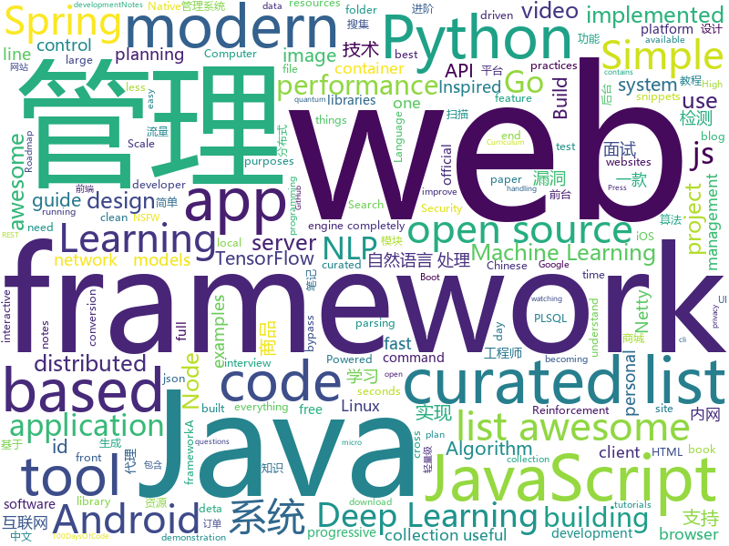

# 2019-02-18
See what the GitHub community is most excited about today.

## python
* [faceswap](https://github.com/deepfakes/faceswap)(**687 stars today**): Non official project based on original /r/Deepfakes thread. Many thanks to him!
* [PayloadsAllTheThings](https://github.com/swisskyrepo/PayloadsAllTheThings)(**346 stars today**): A list of useful payloads and bypass for Web Application Security and Pentest/CTF
* [gpt-2](https://github.com/openai/gpt-2)(**310 stars today**): Code for the paper "Language Models are Unsupervised Multitask Learners"
* [awesome-algorithm](https://github.com/apachecn/awesome-algorithm)(**251 stars today**): LeetCode, HackRank, 剑指offer, classic algorithm implementation
* [awesome-python](https://github.com/vinta/awesome-python)(**199 stars today**): A curated list of awesome Python frameworks, libraries, software and resources
* [stylegan](https://github.com/NVlabs/stylegan)(**170 stars today**): StyleGAN - Official TensorFlow Implementation
* [Tensorflow-Cookbook](https://github.com/taki0112/Tensorflow-Cookbook)(**171 stars today**): Simple Tensorflow Cookbook for easy-to-use
* [ludwig](https://github.com/uber/ludwig)(**111 stars today**): Ludwig is a toolbox built on top of TensorFlow that allows to train and test deep learning models without the need to write code.
* [planet](https://github.com/google-research/planet)(**90 stars today**): Deep Planning Network: Control from pixels by latent planning with learned dynamics
* [public-apis](https://github.com/toddmotto/public-apis)(**72 stars today**): A collective list of free APIs for use in software and web development.
* [Repo-2017](https://github.com/RubensZimbres/Repo-2017)(**59 stars today**): Python codes in Machine Learning, NLP, Deep Learning and Reinforcement Learning with Keras and Theano
* [system-design-primer](https://github.com/donnemartin/system-design-primer)(**62 stars today**): Learn how to design large-scale systems. Prep for the system design interview. Includes Anki flashcards.
* [TensorFlow-Course](https://github.com/machinelearningmindset/TensorFlow-Course)(**50 stars today**): Simple and ready-to-use tutorials for TensorFlow
* [youtube-dl](https://github.com/rg3/youtube-dl)(**51 stars today**): Command-line program to download videos from YouTube.com and other video sites
* [python-cheatsheet](https://github.com/gto76/python-cheatsheet)(**50 stars today**): Comprehensive Python Cheatsheet
* [models](https://github.com/tensorflow/models)(**34 stars today**): Models and examples built with TensorFlow
* [home-assistant](https://github.com/home-assistant/home-assistant)(**31 stars today**): 🏡Open source home automation that puts local control and privacy first
* [Python](https://github.com/TheAlgorithms/Python)(**28 stars today**): All Algorithms implemented in Python
* [bert](https://github.com/google-research/bert)(**28 stars today**): TensorFlow code and pre-trained models for BERT
* [clusterfuzz](https://github.com/google/clusterfuzz)(**28 stars today**): All your bug are belong to us.
* [Algorithm_Interview_Notes-Chinese](https://github.com/imhuay/Algorithm_Interview_Notes-Chinese)(**26 stars today**): 2018/2019/校招/春招/秋招/算法/机器学习(Machine Learning)/深度学习(Deep Learning)/自然语言处理(NLP)/C/C++/Python/面试笔记
* [flask](https://github.com/pallets/flask)(**27 stars today**): The Python micro framework for building web applications.
* [keras](https://github.com/keras-team/keras)(**22 stars today**): Deep Learning for humans
* [django](https://github.com/django/django)(**24 stars today**): The Web framework for perfectionists with deadlines.
* [black](https://github.com/ambv/black)(**25 stars today**): The uncompromising Python code formatter

## java
* [JavaGuide](https://github.com/Snailclimb/JavaGuide)(**74 stars today**): 【Java学习+面试指南】 一份涵盖大部分Java程序员所需要掌握的核心知识。
* [advanced-java](https://github.com/doocs/advanced-java)(**78 stars today**): 😮互联网 Java 工程师进阶知识完全扫盲
* [DoraemonKit](https://github.com/didi/DoraemonKit)(**59 stars today**): 简称 "DoKit" 。一款功能齐全的客户端（ iOS 、Android ）研发助手，你值得拥有。
* [mall](https://github.com/macrozheng/mall)(**46 stars today**): mall项目是一套电商系统，包括前台商城系统及后台管理系统，基于SpringBoot+MyBatis实现。 前台商城系统包含首页门户、商品推荐、商品搜索、商品展示、购物车、订单流程、会员中心、客户服务、帮助中心等模块。 后台管理系统包含商品管理、订单管理、会员管理、促销管理、运营管理、内容管理、统计报表、财务管理、权限管理、设置等模块。
* [jib](https://github.com/GoogleContainerTools/jib)(**45 stars today**): ⛵️Build container images for your Java applications.
* [geektime-spring-family](https://github.com/geektime-geekbang/geektime-spring-family)(**29 stars today**): 极客时间视频课程《玩转Spring全家桶》
* [spring-boot](https://github.com/spring-projects/spring-boot)(**27 stars today**): Spring Boot
* [tutorials](https://github.com/eugenp/tutorials)(**14 stars today**): The "REST With Spring" Course:
* [spring-framework](https://github.com/spring-projects/spring-framework)(**22 stars today**): Spring Framework
* [Java](https://github.com/TheAlgorithms/Java)(**23 stars today**): All Algorithms implemented in Java
* [DETA_DataBase](https://github.com/yaoguangluo/DETA_DataBase)(**27 stars today**): 🚀Deta quantum-field json PLSQL database integrated in deta《VPCS架构》http server. size 30KB / Json量子碎片去死锁带binlog动态回滚的PLSQL数据库，启动50毫秒，100,000 QPS
* [fescar](https://github.com/alibaba/fescar)(**23 stars today**): 🔥Fescar is an easy-to-use, high-performance, java based, open source distributed transaction solution.
* [AndroidMore](https://github.com/QzwJuHao/AndroidMore)(**25 stars today**): Android高级工程师成长之路：手写算法，数据结构 和 Android源码笔记
* [miaosha](https://github.com/qiurunze123/miaosha)(**22 stars today**): ⛹️🐘秒杀系统设计与实现.互联网工程师进阶与分析🙋🐓
* [netty](https://github.com/netty/netty)(**16 stars today**): Netty project - an event-driven asynchronous network application framework
* [redant](https://github.com/all4you/redant)(**18 stars today**): A lightweight distributed web container based on Netty 一个基于Netty的轻量级Web容器
* [MyPerf4J](https://github.com/LinShunKang/MyPerf4J)(**19 stars today**): High performance Java APM. Powered by ASM.
* [java-design-patterns](https://github.com/iluwatar/java-design-patterns)(**16 stars today**): Design patterns implemented in Java
* [spring-boot-examples](https://github.com/ityouknow/spring-boot-examples)(**15 stars today**): about learning Spring Boot via examples. Spring Boot 教程、技术栈示例代码，快速简单上手教程。
* [tinyid](https://github.com/didi/tinyid)(**18 stars today**): ID Generator id生成器 分布式id生成系统，简单易用、高性能、高可用的id生成系统
* [elasticsearch](https://github.com/elastic/elasticsearch)(**16 stars today**): Open Source, Distributed, RESTful Search Engine
* [symphony](https://github.com/b3log/symphony)(**12 stars today**): 🎶一款用 Java 实现的现代化社区（论坛/BBS/社交网络/博客）平台。https://hacpai.com
* [Magisk](https://github.com/topjohnwu/Magisk)(**12 stars today**): A Magic Mask to Alter Android System Systemless-ly
* [messenger-app-android](https://github.com/mesibo/messenger-app-android)(**12 stars today**): Open Source Messenger App For Android - Real-time Messaging, Voice and Video Calls
* [arthas](https://github.com/alibaba/arthas)(**11 stars today**): Alibaba Java Diagnostic Tool Arthas/Alibaba Java诊断利器Arthas

## unknown
* [How-To-Secure-A-Linux-Server](https://github.com/imthenachoman/How-To-Secure-A-Linux-Server)(**705 stars today**): An evolving how-to guide for securing a Linux server.
* [the-book-of-secret-knowledge](https://github.com/trimstray/the-book-of-secret-knowledge)(**664 stars today**): ⭐️A collection of awesome lists, manuals, blogs, hacks, one-liners, cli/web tools and more.
* [awesome-startup-credits](https://github.com/dakshshah96/awesome-startup-credits)(**514 stars today**): ✨A collection of awesome companies offering free/discounted plans for eligible startups
* [Awesome-Design-Tools](https://github.com/LisaDziuba/Awesome-Design-Tools)(**268 stars today**): The best design tools for everything.
* [100-days-of-code-frontend](https://github.com/nas5w/100-days-of-code-frontend)(**235 stars today**): Curriculum for learning front-end development during #100DaysOfCode.
* [developer-roadmap](https://github.com/kamranahmedse/developer-roadmap)(**176 stars today**): Roadmap to becoming a web developer in 2019
* [nginx-quick-reference](https://github.com/trimstray/nginx-quick-reference)(**120 stars today**): ⚡️This notes describes how to improve Nginx performance, security and other important things; ssllabs A+ 100%.
* [awesome](https://github.com/sindresorhus/awesome)(**100 stars today**): 😎Curated list of awesome lists
* [nsfw_data_source_urls](https://github.com/EBazarov/nsfw_data_source_urls)(**66 stars today**): Collection of NSFW images URLs for the purposes of training an NSFW Image Classifier
* [Awesome-Chinese-NLP](https://github.com/crownpku/Awesome-Chinese-NLP)(**64 stars today**): A curated list of resources for Chinese NLP 中文自然语言处理相关资料
* [CS-Notes](https://github.com/CyC2018/CS-Notes)(**59 stars today**): 😋技术面试必备基础知识
* [awesome-image-classification](https://github.com/weiaicunzai/awesome-image-classification)(**52 stars today**): A curated list of deep learning image classification papers and codes
* [deep-learning-drizzle](https://github.com/kmario23/deep-learning-drizzle)(**53 stars today**): Drench yourself in Deep Learning, Reinforcement Learning, Machine Learning, Computer Vision, and NLP by learning from these exciting lectures!!
* [gitignore](https://github.com/github/gitignore)(**34 stars today**): A collection of useful .gitignore templates
* [php-awesome](https://github.com/shockerli/php-awesome)(**44 stars today**): PHP 最优秀资源的整理汇集
* [You-Dont-Know-JS](https://github.com/getify/You-Dont-Know-JS)(**38 stars today**): A book series on JavaScript. @YDKJS on twitter.
* [project-based-learning](https://github.com/tuvtran/project-based-learning)(**37 stars today**): Curated list of project-based tutorials
* [nlp_chinese_corpus](https://github.com/brightmart/nlp_chinese_corpus)(**37 stars today**): 大规模中文自然语言处理语料 Large Scale Chinese Corpus for NLP
* [free-programming-books](https://github.com/EbookFoundation/free-programming-books)(**35 stars today**): 📚Freely available programming books
* [coding-interview-university](https://github.com/jwasham/coding-interview-university)(**36 stars today**): A complete computer science study plan to become a software engineer.
* [AspNetCore-Developer-Roadmap](https://github.com/MoienTajik/AspNetCore-Developer-Roadmap)(**35 stars today**): Roadmap to becoming an ASP.NET Core developer in 2019
* [the-practical-linux-hardening-guide](https://github.com/trimstray/the-practical-linux-hardening-guide)(**36 stars today**): 🔥This guide details the planning and the tools involved in creating a secure Linux production systems - work in progress.
* [awesome-cpp](https://github.com/fffaraz/awesome-cpp)(**29 stars today**): A curated list of awesome C++ (or C) frameworks, libraries, resources, and shiny things. Inspired by awesome-... stuff.
* [awesome-for-beginners](https://github.com/MunGell/awesome-for-beginners)(**25 stars today**): A list of awesome beginners-friendly projects.
* [awesome-shell](https://github.com/alebcay/awesome-shell)(**27 stars today**): A curated list of awesome command-line frameworks, toolkits, guides and gizmos. Inspired by awesome-php.

## javascript
* [leon](https://github.com/leon-ai/leon)(**360 stars today**): 🧠 Leon is your open-source personal assistant.
* [uppy](https://github.com/transloadit/uppy)(**132 stars today**): The next open source file uploader for web browsers🐶
* [git-history](https://github.com/pomber/git-history)(**127 stars today**): Quickly browse the history of any GitHub file
* [winmine-exe](https://github.com/1000hz/winmine-exe)(**104 stars today**): tonight i'm gonna party like it's nineteen ninety-five🙂😮😵😎
* [overreacted.io](https://github.com/gaearon/overreacted.io)(**78 stars today**): Personal blog by Dan Abramov.
* [create-react-app](https://github.com/facebook/create-react-app)(**68 stars today**): Set up a modern web app by running one command.
* [Motrix](https://github.com/agalwood/Motrix)(**76 stars today**): A full-featured download manager.
* [AIL-framework](https://github.com/CIRCL/AIL-framework)(**73 stars today**): AIL framework - Analysis Information Leak framework
* [react](https://github.com/facebook/react)(**63 stars today**): A declarative, efficient, and flexible JavaScript library for building user interfaces.
* [vue](https://github.com/vuejs/vue)(**60 stars today**): 🖖Vue.js is a progressive, incrementally-adoptable JavaScript framework for building UI on the web.
* [30-seconds-of-code](https://github.com/30-seconds/30-seconds-of-code)(**58 stars today**): Curated collection of useful JavaScript snippets that you can understand in 30 seconds or less.
* [gatsby](https://github.com/gatsbyjs/gatsby)(**47 stars today**): Build blazing fast, modern apps and websites with React
* [instant.page](https://github.com/instantpage/instant.page)(**46 stars today**): Make your site’s pages instant in 1 minute and improve your conversion rate by 1%
* [axios](https://github.com/axios/axios)(**42 stars today**): Promise based HTTP client for the browser and node.js
* [javascript-algorithms](https://github.com/trekhleb/javascript-algorithms)(**38 stars today**): 📝Algorithms and data structures implemented in JavaScript with explanations and links to further readings
* [apexcharts.js](https://github.com/apexcharts/apexcharts.js)(**41 stars today**): 📊Interactive SVG Charts
* [not-paid](https://github.com/kleampa/not-paid)(**39 stars today**): Client did not pay? Add opacity to the body tag and decrease it every day until their site completely fades away
* [node](https://github.com/nodejs/node)(**31 stars today**): Node.js JavaScript runtime✨🐢🚀✨
* [clean-code-javascript](https://github.com/beginor/clean-code-javascript)(**36 stars today**): 🛁Clean Code concepts adapted for JavaScript
* [trilium](https://github.com/zadam/trilium)(**35 stars today**): Build your personal knowledge base with Trilium Notes
* [qoa](https://github.com/klaussinani/qoa)(**35 stars today**): 💬Minimal interactive command-line prompts
* [flexsearch](https://github.com/nextapps-de/flexsearch)(**35 stars today**): Next-Generation full text search library for Browser and Node.js
* [nodebestpractices](https://github.com/i0natan/nodebestpractices)(**32 stars today**): The largest Node.js best practices list (February 2019)
* [split](https://github.com/nathancahill/split)(**33 stars today**): Unopinionated utilities for resizeable split views
* [reveal.js](https://github.com/hakimel/reveal.js)(**20 stars today**): The HTML Presentation Framework

## html
* [evtjs](https://github.com/everitoken/evtjs)(**15 stars today**): API Bindings (SDK) for the everiToken blockchain.
* [ionic](https://github.com/ionic-team/ionic)(**15 stars today**): Build amazing native and progressive web apps with open web technologies. One app running on everything🎉
* [styleguide](https://github.com/google/styleguide)(**13 stars today**): Style guides for Google-originated open-source projects
* [AdminLTE](https://github.com/almasaeed2010/AdminLTE)(**11 stars today**): AdminLTE - Free Premium Admin control Panel Theme Based On Bootstrap 3.x
* [Spoon-Knife](https://github.com/octocat/Spoon-Knife)(****): This repo is for demonstration purposes only.
* [flutter-in-action](https://github.com/flutterchina/flutter-in-action)(**12 stars today**): 《Flutter实战》电子书
* [30-seconds-of-css](https://github.com/30-seconds/30-seconds-of-css)(**12 stars today**): A curated collection of useful CSS snippets you can understand in 30 seconds or less.
* [Front-end-Developer-Interview-Questions](https://github.com/h5bp/Front-end-Developer-Interview-Questions)(**11 stars today**): A list of helpful front-end related questions you can use to interview potential candidates, test yourself or completely ignore.
* [JavaScript30](https://github.com/wesbos/JavaScript30)(**9 stars today**): 30 Day Vanilla JS Challenge
* [frontendDaily](https://github.com/kujian/frontendDaily)(**11 stars today**): 前端开发技术日报，每日分享互联网最精彩的前端技术、前端资讯、后端编程、设计和资源等，欢迎关注Watch
* [WDScanner](https://github.com/TideSec/WDScanner)(**10 stars today**): WDScanner平台目前实现了如下功能：分布式web漏洞扫描、客户管理、漏洞定期扫描、网站爬虫、暗链检测、坏链检测、网站指纹搜集、专项漏洞检测、代理搜集及部署、密码定向破解、社工库查询等功能。
* [portainer](https://github.com/portainer/portainer)(**11 stars today**): Simple management UI for Docker
* [swagger-codegen](https://github.com/swagger-api/swagger-codegen)(**8 stars today**): swagger-codegen contains a template-driven engine to generate documentation, API clients and server stubs in different languages by parsing your OpenAPI / Swagger definition.
* [HBBatchBeast](https://github.com/HaveAGitGat/HBBatchBeast)(**9 stars today**): A simple GUI application for Handbrake with an emphasis on batch conversion (including recursive folder scans and folder watching)
* [patchwork](https://github.com/jlord/patchwork)(****): All the Git-it Workshop completers!
* [javascript-tutorial-en](https://github.com/iliakan/javascript-tutorial-en)(**7 stars today**): Modern JavaScript Tutorial
* [requests-html](https://github.com/kennethreitz/requests-html)(**7 stars today**): Pythonic HTML Parsing for Humans™
* [core](https://github.com/stackblitz/core)(**7 stars today**): Online IDE powered by Visual Studio Code⚡️
* [fonts](https://github.com/google/fonts)(**6 stars today**): Font files available from Google Fonts
* [WebFundamentals](https://github.com/google/WebFundamentals)(**6 stars today**): Best practices for modern web development
* [machine_learning_refined](https://github.com/jermwatt/machine_learning_refined)(**6 stars today**): Notes, examples, and Python demos for the textbook "Machine Learning Refined" (Cambridge University Press).
* [javascript-tutorial-zh](https://github.com/xitu/javascript-tutorial-zh)(**5 stars today**): Modern JavaScript Tutorial
* [capacitor](https://github.com/ionic-team/capacitor)(**5 stars today**): Build cross-platform Native Progressive Web Apps for iOS, Android, and the web⚡️
* [dataviz](https://github.com/clauswilke/dataviz)(**5 stars today**): A book covering the fundamentals of data visualization.
* [convolve](https://github.com/mikepound/convolve)(**5 stars today**): Simple demonstration of separable convolutions

## go
* [dgraph](https://github.com/dgraph-io/dgraph)(**224 stars today**): Fast, Distributed Graph DB
* [talos](https://github.com/autonomy/talos)(**119 stars today**): A modern Linux distribution for Kubernetes.
* [1m-go-websockets](https://github.com/eranyanay/1m-go-websockets)(**99 stars today**): handling 1M websockets connections in Go
* [cortex](https://github.com/cortexlabs/cortex)(**82 stars today**): Machine learning infrastructure for developers
* [flipt](https://github.com/markphelps/flipt)(**53 stars today**): A self contained feature flag solution
* [go](https://github.com/golang/go)(**42 stars today**): The Go programming language
* [CVE-2019-5736-PoC](https://github.com/Frichetten/CVE-2019-5736-PoC)(**35 stars today**): PoC for CVE-2019-5736
* [kubernetes](https://github.com/kubernetes/kubernetes)(**30 stars today**): Production-Grade Container Scheduling and Management
* [awesome-go](https://github.com/avelino/awesome-go)(**34 stars today**): A curated list of awesome Go frameworks, libraries and software
* [timeliner](https://github.com/mholt/timeliner)(**32 stars today**): All your digital life on a single timeline, stored locally
* [v2ray-core](https://github.com/v2ray/v2ray-core)(**29 stars today**): A platform for building proxies to bypass network restrictions.
* [nps](https://github.com/cnlh/nps)(**30 stars today**): 一款轻量级、功能强大的内网穿透代理服务器。支持tcp、udp流量转发，支持内网http代理、内网socks5代理，同时支持snappy压缩（节省带宽和流量）、站点保护、加密传输、多路复用、header修改等。支持web图形化管理。
* [mkcert](https://github.com/FiloSottile/mkcert)(**30 stars today**): A simple zero-config tool to make locally trusted development certificates with any names you'd like.
* [frp](https://github.com/fatedier/frp)(**28 stars today**): A fast reverse proxy to help you expose a local server behind a NAT or firewall to the internet.
* [annie](https://github.com/iawia002/annie)(**25 stars today**): 👾Fast, simple and clean video downloader
* [hugo](https://github.com/gohugoio/hugo)(**22 stars today**): The world’s fastest framework for building websites.
* [lorca](https://github.com/zserge/lorca)(**22 stars today**): Build cross-platform modern desktop apps in Go + HTML5
* [go-filecoin](https://github.com/filecoin-project/go-filecoin)(**21 stars today**): Filecoin Full Node Implementation in Go
* [apitest](https://github.com/steinfletcher/apitest)(**22 stars today**): Simple behavioral api testing in go
* [gin](https://github.com/gin-gonic/gin)(**20 stars today**): Gin is a HTTP web framework written in Go (Golang). It features a Martini-like API with much better performance -- up to 40 times faster. If you need smashing performance, get yourself some Gin.
* [chashell](https://github.com/sysdream/chashell)(**19 stars today**): 
* [gotop](https://github.com/cjbassi/gotop)(**20 stars today**): A terminal based graphical activity monitor inspired by gtop and vtop
* [go-elasticsearch](https://github.com/elastic/go-elasticsearch)(**19 stars today**): The official Go client for Elasticsearch
* [faas](https://github.com/openfaas/faas)(**16 stars today**): OpenFaaS - Serverless Functions Made Simple
* [vault](https://github.com/hashicorp/vault)(**16 stars today**): A tool for secrets management, encryption as a service, and privileged access management

## WordCloud

