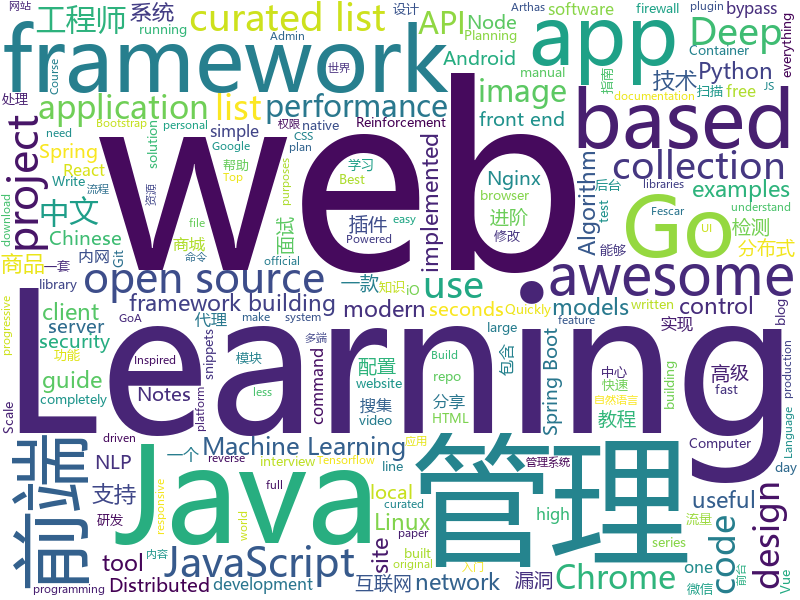

# 2019-02-19
See what the GitHub community is most excited about today.

## python
* [faceswap](https://github.com/deepfakes/faceswap)(**1,328 stars today**): Non official project based on original /r/Deepfakes thread. Many thanks to him!
* [Tensorflow-Cookbook](https://github.com/taki0112/Tensorflow-Cookbook)(**433 stars today**): Simple Tensorflow Cookbook for easy-to-use
* [gpt-2](https://github.com/openai/gpt-2)(**406 stars today**): Code for the paper "Language Models are Unsupervised Multitask Learners"
* [awesome-python](https://github.com/vinta/awesome-python)(**337 stars today**): A curated list of awesome Python frameworks, libraries, software and resources
* [PayloadsAllTheThings](https://github.com/swisskyrepo/PayloadsAllTheThings)(**282 stars today**): A list of useful payloads and bypass for Web Application Security and Pentest/CTF
* [ludwig](https://github.com/uber/ludwig)(**170 stars today**): Ludwig is a toolbox built on top of TensorFlow that allows to train and test deep learning models without the need to write code.
* [awesome-algorithm](https://github.com/apachecn/awesome-algorithm)(**165 stars today**): LeetCode, HackRank, 剑指offer, classic algorithm implementation
* [public-apis](https://github.com/toddmotto/public-apis)(**94 stars today**): A collective list of free APIs for use in software and web development.
* [system-design-primer](https://github.com/donnemartin/system-design-primer)(**76 stars today**): Learn how to design large-scale systems. Prep for the system design interview. Includes Anki flashcards.
* [Google-Machine-Learning-Course-Notes](https://github.com/AntonioErdeljac/Google-Machine-Learning-Course-Notes)(**77 stars today**): Notes taken from Google Machine Learning Course provided to public for practice & correction.
* [planet](https://github.com/google-research/planet)(**69 stars today**): Deep Planning Network: Control from pixels by latent planning with learned dynamics
* [bert](https://github.com/google-research/bert)(**60 stars today**): TensorFlow code and pre-trained models for BERT
* [clusterfuzz](https://github.com/google/clusterfuzz)(**65 stars today**): All your bug are belong to us.
* [models](https://github.com/tensorflow/models)(**49 stars today**): Models and examples built with TensorFlow
* [Python](https://github.com/TheAlgorithms/Python)(**50 stars today**): All Algorithms implemented in Python
* [CheatSheetSeries](https://github.com/OWASP/CheatSheetSeries)(**49 stars today**): The OWASP Cheat Sheet Series was created to provide a concise collection of high value information on specific application security topics.
* [youtube-dl](https://github.com/rg3/youtube-dl)(**46 stars today**): Command-line program to download videos from YouTube.com and other video sites
* [TensorFlow-Course](https://github.com/machinelearningmindset/TensorFlow-Course)(**46 stars today**): Simple and ready-to-use tutorials for TensorFlow
* [Repo-2017](https://github.com/RubensZimbres/Repo-2017)(**40 stars today**): Python codes in Machine Learning, NLP, Deep Learning and Reinforcement Learning with Keras and Theano
* [keras](https://github.com/keras-team/keras)(**40 stars today**): Deep Learning for humans
* [spinning-up-basic](https://github.com/Kaixhin/spinning-up-basic)(**47 stars today**): Basic versions of agents from Spinning Up in Deep RL written in PyTorch
* [python-cheatsheet](https://github.com/gto76/python-cheatsheet)(**42 stars today**): Comprehensive Python Cheatsheet
* [home-assistant](https://github.com/home-assistant/home-assistant)(**34 stars today**): 🏡Open source home automation that puts local control and privacy first
* [django](https://github.com/django/django)(**36 stars today**): The Web framework for perfectionists with deadlines.
* [flask](https://github.com/pallets/flask)(**36 stars today**): The Python micro framework for building web applications.

## java
* [DoraemonKit](https://github.com/didi/DoraemonKit)(**262 stars today**): 简称 "DoKit" 。一款功能齐全的客户端（ iOS 、Android ）研发助手，你值得拥有。
* [JavaGuide](https://github.com/Snailclimb/JavaGuide)(**206 stars today**): 【Java学习+面试指南】 一份涵盖大部分Java程序员所需要掌握的核心知识。
* [advanced-java](https://github.com/doocs/advanced-java)(**180 stars today**): 😮互联网 Java 工程师进阶知识完全扫盲
* [mall](https://github.com/macrozheng/mall)(**158 stars today**): mall项目是一套电商系统，包括前台商城系统及后台管理系统，基于SpringBoot+MyBatis实现。 前台商城系统包含首页门户、商品推荐、商品搜索、商品展示、购物车、订单流程、会员中心、客户服务、帮助中心等模块。 后台管理系统包含商品管理、订单管理、会员管理、促销管理、运营管理、内容管理、统计报表、财务管理、权限管理、设置等模块。
* [miaosha](https://github.com/qiurunze123/miaosha)(**75 stars today**): ⛹️🐘秒杀系统设计与实现.互联网工程师进阶与分析🙋🐓
* [AndroidMore](https://github.com/QzwJuHao/AndroidMore)(**75 stars today**): Android高级工程师成长之路：手写算法，数据结构 和 Android源码笔记
* [fescar](https://github.com/alibaba/fescar)(**71 stars today**): 🔥Fescar is an easy-to-use, high-performance, java based, open source distributed transaction solution.
* [tutorials](https://github.com/eugenp/tutorials)(**34 stars today**): The "REST With Spring" Course:
* [spring-boot](https://github.com/spring-projects/spring-boot)(**45 stars today**): Spring Boot
* [arthas](https://github.com/alibaba/arthas)(**51 stars today**): Alibaba Java Diagnostic Tool Arthas/Alibaba Java诊断利器Arthas
* [giffun](https://github.com/guolindev/giffun)(**50 stars today**): 一款开源的GIF在线分享App，乐趣就要和世界分享。
* [Java](https://github.com/TheAlgorithms/Java)(**37 stars today**): All Algorithms implemented in Java
* [spring-framework](https://github.com/spring-projects/spring-framework)(**33 stars today**): Spring Framework
* [elasticsearch](https://github.com/elastic/elasticsearch)(**36 stars today**): Open Source, Distributed, RESTful Search Engine
* [incubator-dubbo](https://github.com/apache/incubator-dubbo)(**27 stars today**): Apache Dubbo (incubating) is a high-performance, java based, open source RPC framework.
* [flink](https://github.com/apache/flink)(**29 stars today**): Apache Flink
* [jib](https://github.com/GoogleContainerTools/jib)(**36 stars today**): ⛵️Build container images for your Java applications.
* [SuperTextView](https://github.com/chenBingX/SuperTextView)(**35 stars today**): Welcome to use SuperTextView
* [EasyTransaction](https://github.com/QNJR-GROUP/EasyTransaction)(**35 stars today**): A distribute transaction solution（分布式事务） unified the usage of TCC , SAGA ,FMT (fescar AutoCompensation)， reliable message, compensate and so on;
* [java-design-patterns](https://github.com/iluwatar/java-design-patterns)(**33 stars today**): Design patterns implemented in Java
* [spring-boot-examples](https://github.com/ityouknow/spring-boot-examples)(**29 stars today**): about learning Spring Boot via examples. Spring Boot 教程、技术栈示例代码，快速简单上手教程。
* [geektime-spring-family](https://github.com/geektime-geekbang/geektime-spring-family)(**31 stars today**): 极客时间视频课程《玩转Spring全家桶》
* [apollo](https://github.com/ctripcorp/apollo)(**27 stars today**): Apollo（阿波罗）是携程框架部门研发的分布式配置中心，能够集中化管理应用不同环境、不同集群的配置，配置修改后能够实时推送到应用端，并且具备规范的权限、流程治理等特性，适用于微服务配置管理场景。
* [netty](https://github.com/netty/netty)(**24 stars today**): Netty project - an event-driven asynchronous network application framework
* [litemall](https://github.com/linlinjava/litemall)(**23 stars today**): 又一个小商城。litemall = Spring Boot后端 + Vue管理员前端 + 微信小程序用户前端

## unknown
* [How-To-Secure-A-Linux-Server](https://github.com/imthenachoman/How-To-Secure-A-Linux-Server)(**847 stars today**): An evolving how-to guide for securing a Linux server.
* [the-book-of-secret-knowledge](https://github.com/trimstray/the-book-of-secret-knowledge)(**821 stars today**): ⭐️A collection of awesome lists, manuals, blogs, hacks, one-liners, cli/web tools and more.
* [Awesome-Design-Tools](https://github.com/LisaDziuba/Awesome-Design-Tools)(**469 stars today**): The best design tools for everything.
* [awesome-startup-credits](https://github.com/dakshshah96/awesome-startup-credits)(**282 stars today**): ✨A collection of awesome companies offering free/discounted plans for eligible startups
* [100-days-of-code-frontend](https://github.com/nas5w/100-days-of-code-frontend)(**237 stars today**): Curriculum for learning front-end development during #100DaysOfCode.
* [Daily-Interview-Question](https://github.com/Advanced-Frontend/Daily-Interview-Question)(**224 stars today**): 工作日每天一道前端大厂面试题，祝大家天天进步，一年后会看到不一样的自己。
* [nginx-quick-reference](https://github.com/trimstray/nginx-quick-reference)(**216 stars today**): ⚡️This notes describes how to improve Nginx performance, security and other important things; ssllabs A+ 100%.
* [CS-Notes](https://github.com/CyC2018/CS-Notes)(**133 stars today**): 😋技术面试必备基础知识
* [toBeTopJavaer](https://github.com/hollischuang/toBeTopJavaer)(**129 stars today**): To Be Top Javaer - Java工程师成神之路
* [awesome](https://github.com/sindresorhus/awesome)(**130 stars today**): 😎Curated list of awesome lists
* [nsfw_data_source_urls](https://github.com/EBazarov/nsfw_data_source_urls)(**118 stars today**): Collection of NSFW images URLs for the purposes of training an NSFW Image Classifier
* [nlp_chinese_corpus](https://github.com/brightmart/nlp_chinese_corpus)(**116 stars today**): 大规模中文自然语言处理语料 Large Scale Chinese Corpus for NLP
* [AspNetCore-Developer-Roadmap](https://github.com/MoienTajik/AspNetCore-Developer-Roadmap)(**97 stars today**): Roadmap to becoming an ASP.NET Core developer in 2019
* [nginx-tutorial](https://github.com/dunwu/nginx-tutorial)(**90 stars today**): 这是一个 Nginx 极简教程，目的在于帮助新手快速入门 Nginx。
* [blog](https://github.com/yygmind/blog)(**75 stars today**): 我是木易杨，网易高级前端工程师，跟着我每周重点攻克一个前端面试重难点。接下来让我带你走进高级前端的世界，在进阶的路上，共勉！
* [You-Dont-Know-JS](https://github.com/getify/You-Dont-Know-JS)(**73 stars today**): A book series on JavaScript. @YDKJS on twitter.
* [awesome-shell](https://github.com/alebcay/awesome-shell)(**61 stars today**): A curated list of awesome command-line frameworks, toolkits, guides and gizmos. Inspired by awesome-php.
* [gitignore](https://github.com/github/gitignore)(**39 stars today**): A collection of useful .gitignore templates
* [project-based-learning](https://github.com/tuvtran/project-based-learning)(**50 stars today**): Curated list of project-based tutorials
* [deep-learning-drizzle](https://github.com/kmario23/deep-learning-drizzle)(**51 stars today**): Drench yourself in Deep Learning, Reinforcement Learning, Machine Learning, Computer Vision, and NLP by learning from these exciting lectures!!
* [Awesome-Chinese-NLP](https://github.com/crownpku/Awesome-Chinese-NLP)(**51 stars today**): A curated list of resources for Chinese NLP 中文自然语言处理相关资料
* [awesome-image-classification](https://github.com/weiaicunzai/awesome-image-classification)(**47 stars today**): A curated list of deep learning image classification papers and codes
* [ChromeAppHeroes](https://github.com/zhaoolee/ChromeAppHeroes)(**51 stars today**): Chrome插件英雄榜, 为优秀的Chrome插件写一本中文说明书, 让Chrome插件英雄们造福人类~ ChromePluginHeroes, Write a Chinese manual for the excellent Chrome plugin, let the Chrome plugin heroes benefit the human~
* [free-programming-books](https://github.com/EbookFoundation/free-programming-books)(**45 stars today**): 📚Freely available programming books
* [coding-interview-university](https://github.com/jwasham/coding-interview-university)(**41 stars today**): A complete computer science study plan to become a software engineer.

## javascript
* [leon](https://github.com/leon-ai/leon)(**558 stars today**): 🧠 Leon is your open-source personal assistant.
* [uppy](https://github.com/transloadit/uppy)(**202 stars today**): The next open source file uploader for web browsers🐶
* [git-history](https://github.com/pomber/git-history)(**175 stars today**): Quickly browse the history of any GitHub file
* [awesome-wechat-weapp](https://github.com/justjavac/awesome-wechat-weapp)(**128 stars today**): 微信小程序开发资源汇总💯
* [asperitas](https://github.com/d11z/asperitas)(**134 stars today**): A simple reddit clone
* [react-simple-img](https://github.com/bluebill1049/react-simple-img)(**128 stars today**): 🌅React lazy load images with IntersectionObserver API and Priority Hints
* [vue](https://github.com/vuejs/vue)(**118 stars today**): 🖖Vue.js is a progressive, incrementally-adoptable JavaScript framework for building UI on the web.
* [Motrix](https://github.com/agalwood/Motrix)(**108 stars today**): A full-featured download manager.
* [react](https://github.com/facebook/react)(**99 stars today**): A declarative, efficient, and flexible JavaScript library for building user interfaces.
* [create-react-app](https://github.com/facebook/create-react-app)(**79 stars today**): Set up a modern web app by running one command.
* [winmine-exe](https://github.com/1000hz/winmine-exe)(**86 stars today**): tonight i'm gonna party like it's nineteen ninety-five🙂😮😵😎
* [30-seconds-of-code](https://github.com/30-seconds/30-seconds-of-code)(**79 stars today**): Curated collection of useful JavaScript snippets that you can understand in 30 seconds or less.
* [react-act-examples](https://github.com/threepointone/react-act-examples)(**81 stars today**): Notes and examples on ReactTestUtils.act(...)
* [instant.page](https://github.com/instantpage/instant.page)(**69 stars today**): Make your site’s pages instant in 1 minute and improve your conversion rate by 1%
* [overreacted.io](https://github.com/gaearon/overreacted.io)(**61 stars today**): Personal blog by Dan Abramov.
* [chameleon](https://github.com/didi/chameleon)(**65 stars today**): 🦎一套代码运行多端，一端所见即多端所见
* [axios](https://github.com/axios/axios)(**63 stars today**): Promise based HTTP client for the browser and node.js
* [javascript](https://github.com/airbnb/javascript)(**53 stars today**): JavaScript Style Guide
* [javascript-algorithms](https://github.com/trekhleb/javascript-algorithms)(**57 stars today**): 📝Algorithms and data structures implemented in JavaScript with explanations and links to further readings
* [react-simple-animate](https://github.com/bluebill1049/react-simple-animate)(**60 stars today**): 🎯React UI animation made easy
* [bootstrap](https://github.com/twbs/bootstrap)(**42 stars today**): The most popular HTML, CSS, and JavaScript framework for developing responsive, mobile first projects on the web.
* [puppeteer](https://github.com/GoogleChrome/puppeteer)(**55 stars today**): Headless Chrome Node API
* [react-native](https://github.com/facebook/react-native)(**50 stars today**): A framework for building native apps with React.
* [not-paid](https://github.com/kleampa/not-paid)(**53 stars today**): Client did not pay? Add opacity to the body tag and decrease it every day until their site completely fades away
* [ant-design-pro](https://github.com/ant-design/ant-design-pro)(**44 stars today**): 👨🏻‍💻👩🏻‍💻 Use Ant Design like a Pro!

## html
* [frontendDaily](https://github.com/kujian/frontendDaily)(**65 stars today**): 前端开发技术日报，每日分享互联网最精彩的前端技术、前端资讯、后端编程、设计和资源等，欢迎关注Watch
* [30-seconds-of-css](https://github.com/30-seconds/30-seconds-of-css)(**32 stars today**): A curated collection of useful CSS snippets you can understand in 30 seconds or less.
* [WDScanner](https://github.com/TideSec/WDScanner)(**22 stars today**): WDScanner平台目前实现了如下功能：分布式web漏洞扫描、客户管理、漏洞定期扫描、网站爬虫、暗链检测、坏链检测、网站指纹搜集、专项漏洞检测、代理搜集及部署、密码定向破解、社工库查询等功能。
* [flutter-in-action](https://github.com/flutterchina/flutter-in-action)(**20 stars today**): 《Flutter实战》电子书
* [AdminLTE](https://github.com/almasaeed2010/AdminLTE)(**14 stars today**): AdminLTE - Free Premium Admin control Panel Theme Based On Bootstrap 3.x
* [styleguide](https://github.com/google/styleguide)(**16 stars today**): Style guides for Google-originated open-source projects
* [Front-end-Developer-Interview-Questions](https://github.com/h5bp/Front-end-Developer-Interview-Questions)(**18 stars today**): A list of helpful front-end related questions you can use to interview potential candidates, test yourself or completely ignore.
* [JavaScript30](https://github.com/wesbos/JavaScript30)(**8 stars today**): 30 Day Vanilla JS Challenge
* [stisla](https://github.com/stisla/stisla)(**16 stars today**): Free Bootstrap Admin Template
* [Spoon-Knife](https://github.com/octocat/Spoon-Knife)(****): This repo is for demonstration purposes only.
* [ionic](https://github.com/ionic-team/ionic)(**11 stars today**): Build amazing native and progressive web apps with open web technologies. One app running on everything🎉
* [linux-command](https://github.com/jaywcjlove/linux-command)(**11 stars today**): Linux命令大全搜索工具，内容包含Linux命令手册、详解、学习、搜集。https://git.io/linux
* [now-github-starter](https://github.com/zeit/now-github-starter)(****): Starter project to demonstrate a project whose pull requests get automatically deployed
* [swagger-codegen](https://github.com/swagger-api/swagger-codegen)(**8 stars today**): swagger-codegen contains a template-driven engine to generate documentation, API clients and server stubs in different languages by parsing your OpenAPI / Swagger definition.
* [Winds](https://github.com/GetStream/Winds)(**10 stars today**): A Beautiful Open Source RSS & Podcast App Powered by Getstream.io
* [website](https://github.com/kubernetes/website)(**7 stars today**): Kubernetes website and documentation repo:
* [foundation-sites](https://github.com/zurb/foundation-sites)(**9 stars today**): The most advanced responsive front-end framework in the world. Quickly create prototypes and production code for sites that work on any kind of device.
* [core](https://github.com/stackblitz/core)(**9 stars today**): Online IDE powered by Visual Studio Code⚡️
* [patchwork](https://github.com/jlord/patchwork)(****): All the Git-it Workshop completers!
* [WebFundamentals](https://github.com/google/WebFundamentals)(**8 stars today**): Best practices for modern web development
* [javascript-tutorial-en](https://github.com/iliakan/javascript-tutorial-en)(**7 stars today**): Modern JavaScript Tutorial
* [machine_learning_refined](https://github.com/jermwatt/machine_learning_refined)(**9 stars today**): Notes, examples, and Python demos for the textbook "Machine Learning Refined" (Cambridge University Press).
* [960gridgridgridme](https://github.com/jensimmons/960gridgridgridme)(**9 stars today**): a silly project from someone who is starting to hate 12-column symmetrical grid frameworks
* [polymer](https://github.com/Polymer/polymer)(**8 stars today**): Our original Web Component library.
* [wysiwyg-editor](https://github.com/froala/wysiwyg-editor)(**8 stars today**): A beautifully designed WYSIWYG HTML Editor based on HTML5.

## go
* [dgraph](https://github.com/dgraph-io/dgraph)(**192 stars today**): Fast, Distributed Graph DB
* [inlets](https://github.com/alexellis/inlets)(**151 stars today**): Expose your local endpoints to the Internet
* [1m-go-websockets](https://github.com/eranyanay/1m-go-websockets)(**140 stars today**): handling 1M websockets connections in Go
* [flipt](https://github.com/markphelps/flipt)(**95 stars today**): A self contained feature flag solution
* [go](https://github.com/golang/go)(**77 stars today**): The Go programming language
* [frp](https://github.com/fatedier/frp)(**72 stars today**): A fast reverse proxy to help you expose a local server behind a NAT or firewall to the internet.
* [kubernetes](https://github.com/kubernetes/kubernetes)(**69 stars today**): Production-Grade Container Scheduling and Management
* [istio](https://github.com/istio/istio)(**70 stars today**): Connect, secure, control, and observe services.
* [talos](https://github.com/autonomy/talos)(**71 stars today**): A modern Linux distribution for Kubernetes.
* [cortex](https://github.com/cortexlabs/cortex)(**58 stars today**): Machine learning infrastructure for developers
* [chashell](https://github.com/sysdream/chashell)(**47 stars today**): Chashell is a Go reverse shell that communicates over DNS. It can be used to bypass firewalls or tightly restricted networks.
* [who](https://github.com/go-who/who)(**44 stars today**): 
* [v2ray-core](https://github.com/v2ray/v2ray-core)(**43 stars today**): A platform for building proxies to bypass network restrictions.
* [go-filecoin](https://github.com/filecoin-project/go-filecoin)(**40 stars today**): Filecoin Full Node Implementation in Go
* [mkcert](https://github.com/FiloSottile/mkcert)(**41 stars today**): A simple zero-config tool to make locally trusted development certificates with any names you'd like.
* [nps](https://github.com/cnlh/nps)(**38 stars today**): 一款轻量级、功能强大的内网穿透代理服务器。支持tcp、udp流量转发，支持内网http代理、内网socks5代理，同时支持snappy压缩（节省带宽和流量）、站点保护、加密传输、多路复用、header修改等。支持web图形化管理。
* [hugo](https://github.com/gohugoio/hugo)(**37 stars today**): The world’s fastest framework for building websites.
* [gotop](https://github.com/cjbassi/gotop)(**37 stars today**): A terminal based graphical activity monitor inspired by gtop and vtop
* [CVE-2019-5736-PoC](https://github.com/Frichetten/CVE-2019-5736-PoC)(**34 stars today**): PoC for CVE-2019-5736
* [awesome-go](https://github.com/avelino/awesome-go)(**32 stars today**): A curated list of awesome Go frameworks, libraries and software
* [lorca](https://github.com/zserge/lorca)(**35 stars today**): Build cross-platform modern desktop apps in Go + HTML5
* [gin](https://github.com/gin-gonic/gin)(**33 stars today**): Gin is a HTTP web framework written in Go (Golang). It features a Martini-like API with much better performance -- up to 40 times faster. If you need smashing performance, get yourself some Gin.
* [go-elasticsearch](https://github.com/elastic/go-elasticsearch)(**35 stars today**): The official Go client for Elasticsearch
* [up](https://github.com/apex/up)(**33 stars today**): Deploy infinitely scalable serverless apps, apis, and sites in seconds to AWS.
* [the-way-to-go_ZH_CN](https://github.com/Unknwon/the-way-to-go_ZH_CN)(**30 stars today**): 《The Way to Go》中文译本，中文正式名《Go 入门指南》

## WordCloud

