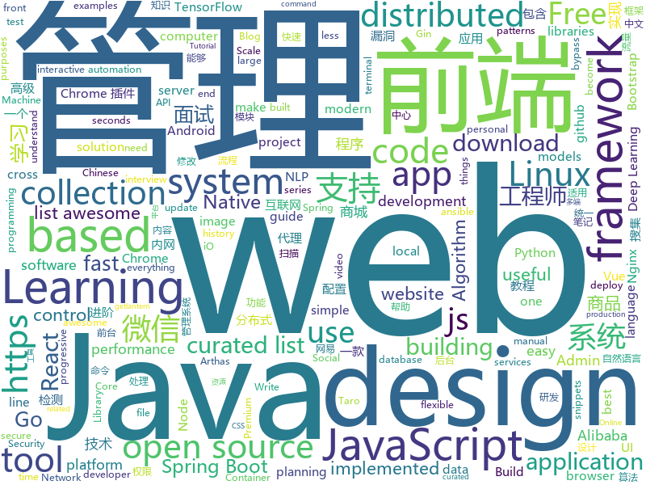

# 2019-02-20
See what the GitHub community is most excited about today.

## python
* [faceswap](https://github.com/deepfakes/faceswap)(**710 stars today**): Non official project based on original /r/Deepfakes thread. Many thanks to him!
* [gpt-2](https://github.com/openai/gpt-2)(**325 stars today**): Code for the paper "Language Models are Unsupervised Multitask Learners"
* [awesome-python](https://github.com/vinta/awesome-python)(**315 stars today**): A curated list of awesome Python frameworks, libraries, software and resources
* [Tensorflow-Cookbook](https://github.com/taki0112/Tensorflow-Cookbook)(**295 stars today**): Simple Tensorflow Cookbook for easy-to-use
* [lascar](https://github.com/Ledger-Donjon/lascar)(**142 stars today**): Ledger's Advanced Side-Channel Analysis Repository
* [Vocab](https://github.com/Mckinsey666/Vocab)(**106 stars today**): 📚A lightweight online dictionary integration to the command line. No browsers. No paperbacks.
* [PayloadsAllTheThings](https://github.com/swisskyrepo/PayloadsAllTheThings)(**100 stars today**): A list of useful payloads and bypass for Web Application Security and Pentest/CTF
* [ludwig](https://github.com/uber/ludwig)(**98 stars today**): Ludwig is a toolbox built on top of TensorFlow that allows to train and test deep learning models without the need to write code.
* [public-apis](https://github.com/toddmotto/public-apis)(**93 stars today**): A collective list of free APIs for use in software and web development.
* [python-cheatsheet](https://github.com/gto76/python-cheatsheet)(**78 stars today**): Comprehensive Python Cheatsheet
* [Python](https://github.com/TheAlgorithms/Python)(**68 stars today**): All Algorithms implemented in Python
* [models](https://github.com/tensorflow/models)(**59 stars today**): Models and examples built with TensorFlow
* [system-design-primer](https://github.com/donnemartin/system-design-primer)(**62 stars today**): Learn how to design large-scale systems. Prep for the system design interview. Includes Anki flashcards.
* [Social-Amnesia](https://github.com/Nick-Gottschlich/Social-Amnesia)(**64 stars today**): Forget the past. Social Amnesia makes sure your social media accounts only show your posts from recent history, not from "that phase" 5 years ago.
* [bert](https://github.com/google-research/bert)(**58 stars today**): TensorFlow code and pre-trained models for BERT
* [planet](https://github.com/google-research/planet)(**55 stars today**): Deep Planning Network: Control from pixels by latent planning with learned dynamics
* [keras](https://github.com/keras-team/keras)(**46 stars today**): Deep Learning for humans
* [awesome-algorithm](https://github.com/apachecn/awesome-algorithm)(**43 stars today**): LeetCode, HackRank, 剑指offer, classic algorithm implementation
* [clusterfuzz](https://github.com/google/clusterfuzz)(**46 stars today**): Scalable fuzzing infrastructure.
* [Algorithm_Interview_Notes-Chinese](https://github.com/imhuay/Algorithm_Interview_Notes-Chinese)(**34 stars today**): 2018/2019/校招/春招/秋招/算法/机器学习(Machine Learning)/深度学习(Deep Learning)/自然语言处理(NLP)/C/C++/Python/面试笔记
* [python-patterns](https://github.com/faif/python-patterns)(**40 stars today**): A collection of design patterns/idioms in Python
* [ansible](https://github.com/ansible/ansible)(**28 stars today**): Ansible is a radically simple IT automation platform that makes your applications and systems easier to deploy. Avoid writing scripts or custom code to deploy and update your applications — automate in a language that approaches plain English, using SSH, with no agents to install on remote systems. https://docs.ansible.com/ansible/
* [home-assistant](https://github.com/home-assistant/home-assistant)(**34 stars today**): 🏡Open source home automation that puts local control and privacy first
* [youtube-dl](https://github.com/rg3/youtube-dl)(**34 stars today**): Command-line program to download videos from YouTube.com and other video sites
* [activitywatch](https://github.com/ActivityWatch/activitywatch)(**40 stars today**): Log what you do on your computer. Simple (yet powerful), extensible, no third parties.

## java
* [JavaGuide](https://github.com/Snailclimb/JavaGuide)(**289 stars today**): 【Java学习+面试指南】 一份涵盖大部分Java程序员所需要掌握的核心知识。
* [advanced-java](https://github.com/doocs/advanced-java)(**226 stars today**): 😮互联网 Java 工程师进阶知识完全扫盲
* [mall](https://github.com/macrozheng/mall)(**207 stars today**): mall项目是一套电商系统，包括前台商城系统及后台管理系统，基于SpringBoot+MyBatis实现。 前台商城系统包含首页门户、商品推荐、商品搜索、商品展示、购物车、订单流程、会员中心、客户服务、帮助中心等模块。 后台管理系统包含商品管理、订单管理、会员管理、促销管理、运营管理、内容管理、统计报表、财务管理、权限管理、设置等模块。
* [DoraemonKit](https://github.com/didi/DoraemonKit)(**183 stars today**): 简称 "DoKit" 。一款功能齐全的客户端（ iOS 、Android ）研发助手，你值得拥有。
* [miaosha](https://github.com/qiurunze123/miaosha)(**105 stars today**): ⛹️🐘秒杀系统设计与实现.互联网工程师进阶与分析🙋🐓
* [fescar](https://github.com/alibaba/fescar)(**103 stars today**): 🔥Fescar is an easy-to-use, high-performance, java based, open source distributed transaction solution.
* [ldbz-shop](https://github.com/laodaobazi/ldbz-shop)(**90 stars today**): 分布式商城
* [tutorials](https://github.com/eugenp/tutorials)(**63 stars today**): The "REST With Spring" Course:
* [arthas](https://github.com/alibaba/arthas)(**69 stars today**): Alibaba Java Diagnostic Tool Arthas/Alibaba Java诊断利器Arthas
* [cim](https://github.com/crossoverJie/cim)(**67 stars today**): 📲cim(cross IM) 适用于开发者的即时通讯系统
* [spring-boot](https://github.com/spring-projects/spring-boot)(**58 stars today**): Spring Boot
* [symphony](https://github.com/b3log/symphony)(**47 stars today**): 🎶一款用 Java 实现的现代化社区（论坛/BBS/社交网络/博客）平台。https://hacpai.com
* [AndroidMore](https://github.com/QzwJuHao/AndroidMore)(**50 stars today**): Android高级工程师成长之路：手写算法，数据结构 和 Android源码笔记
* [java-design-patterns](https://github.com/iluwatar/java-design-patterns)(**44 stars today**): Design patterns implemented in Java
* [flink](https://github.com/apache/flink)(**41 stars today**): Apache Flink
* [spring-boot-examples](https://github.com/ityouknow/spring-boot-examples)(**38 stars today**): about learning Spring Boot via examples. Spring Boot 教程、技术栈示例代码，快速简单上手教程。
* [spring-framework](https://github.com/spring-projects/spring-framework)(**27 stars today**): Spring Framework
* [spring-cloud-alibaba](https://github.com/spring-cloud-incubator/spring-cloud-alibaba)(**40 stars today**): Spring Cloud Alibaba provides a one-stop solution for application development for the distributed solutions of Alibaba middleware.
* [apollo](https://github.com/ctripcorp/apollo)(**36 stars today**): Apollo（阿波罗）是携程框架部门研发的分布式配置中心，能够集中化管理应用不同环境、不同集群的配置，配置修改后能够实时推送到应用端，并且具备规范的权限、流程治理等特性，适用于微服务配置管理场景。
* [elasticsearch](https://github.com/elastic/elasticsearch)(**35 stars today**): Open Source, Distributed, RESTful Search Engine
* [jib](https://github.com/GoogleContainerTools/jib)(**32 stars today**): ⛵️Build container images for your Java applications.
* [Java](https://github.com/TheAlgorithms/Java)(**29 stars today**): All Algorithms implemented in Java
* [Magisk](https://github.com/topjohnwu/Magisk)(**31 stars today**): A Magic Mask to Alter Android System Systemless-ly
* [litemall](https://github.com/linlinjava/litemall)(**27 stars today**): 又一个小商城。litemall = Spring Boot后端 + Vue管理员前端 + 微信小程序用户前端
* [guava](https://github.com/google/guava)(**28 stars today**): Google core libraries for Java

## unknown
* [How-To-Secure-A-Linux-Server](https://github.com/imthenachoman/How-To-Secure-A-Linux-Server)(**896 stars today**): An evolving how-to guide for securing a Linux server.
* [Micro8](https://github.com/Micropoor/Micro8)(**610 stars today**): 
* [Awesome-Design-Tools](https://github.com/LisaDziuba/Awesome-Design-Tools)(**620 stars today**): The best design tools for everything.
* [the-book-of-secret-knowledge](https://github.com/trimstray/the-book-of-secret-knowledge)(**576 stars today**): ⭐️A collection of awesome lists, manuals, blogs, hacks, one-liners, cli/web tools and more.
* [nginx-quick-reference](https://github.com/trimstray/nginx-quick-reference)(**387 stars today**): ⚡️This notes describes how to improve Nginx performance, security and other important things; ssllabs A+ 100%.
* [Daily-Interview-Question](https://github.com/Advanced-Frontend/Daily-Interview-Question)(**214 stars today**): 工作日每天一道前端大厂面试题，祝大家天天进步，一年后会看到不一样的自己。
* [blog](https://github.com/yygmind/blog)(**152 stars today**): 我是木易杨，网易高级前端工程师，跟着我每周重点攻克一个前端面试重难点。接下来让我带你走进高级前端的世界，在进阶的路上，共勉！
* [awesome-startup-credits](https://github.com/dakshshah96/awesome-startup-credits)(**151 stars today**): ✨A collection of awesome companies offering free/discounted plans for eligible startups
* [nsfw_data_source_urls](https://github.com/EBazarov/nsfw_data_source_urls)(**145 stars today**): Collection of NSFW images URLs for the purposes of training an NSFW Image Classifier
* [100-days-of-code-frontend](https://github.com/nas5w/100-days-of-code-frontend)(**133 stars today**): Curriculum for learning front-end development during #100DaysOfCode.
* [CS-Notes](https://github.com/CyC2018/CS-Notes)(**118 stars today**): 😋技术面试必备基础知识
* [deep-learning-drizzle](https://github.com/kmario23/deep-learning-drizzle)(**98 stars today**): Drench yourself in Deep Learning, Reinforcement Learning, Machine Learning, Computer Vision, and NLP by learning from these exciting lectures!!
* [awesome](https://github.com/sindresorhus/awesome)(**92 stars today**): 😎Curated list of awesome lists
* [gitignore](https://github.com/github/gitignore)(**65 stars today**): A collection of useful .gitignore templates
* [toBeTopJavaer](https://github.com/hollischuang/toBeTopJavaer)(**69 stars today**): To Be Top Javaer - Java工程师成神之路
* [You-Dont-Know-JS](https://github.com/getify/You-Dont-Know-JS)(**58 stars today**): A book series on JavaScript. @YDKJS on twitter.
* [AspNetCore-Developer-Roadmap](https://github.com/MoienTajik/AspNetCore-Developer-Roadmap)(**61 stars today**): Roadmap to becoming an ASP.NET Core developer in 2019
* [nlp_chinese_corpus](https://github.com/brightmart/nlp_chinese_corpus)(**62 stars today**): 大规模中文自然语言处理语料 Large Scale Chinese Corpus for NLP
* [free-programming-books](https://github.com/EbookFoundation/free-programming-books)(**54 stars today**): 📚Freely available programming books
* [coding-interview-university](https://github.com/jwasham/coding-interview-university)(**50 stars today**): A complete computer science study plan to become a software engineer.
* [project-based-learning](https://github.com/tuvtran/project-based-learning)(**50 stars today**): Curated list of project-based tutorials
* [awesome-vue](https://github.com/vuejs/awesome-vue)(**51 stars today**): 🎉A curated list of awesome things related to Vue.js
* [the-practical-linux-hardening-guide](https://github.com/trimstray/the-practical-linux-hardening-guide)(**46 stars today**): 🔥This guide details the planning and the tools involved in creating a secure Linux production systems - work in progress.
* [ChromeAppHeroes](https://github.com/zhaoolee/ChromeAppHeroes)(**46 stars today**): Chrome插件英雄榜, 为优秀的Chrome插件写一本中文说明书, 让Chrome插件英雄们造福人类~ ChromePluginHeroes, Write a Chinese manual for the excellent Chrome plugin, let the Chrome plugin heroes benefit the human~
* [nginx-tutorial](https://github.com/dunwu/nginx-tutorial)(**44 stars today**): 这是一个 Nginx 极简教程，目的在于帮助新手快速入门 Nginx。

## javascript
* [leon](https://github.com/leon-ai/leon)(**470 stars today**): 🧠 Leon is your open-source personal assistant.
* [taro-yanxuan](https://github.com/js-newbee/taro-yanxuan)(**270 stars today**): 首个 Taro 多端统一实例 - 网易严选（小程序 + H5 + React Native） - By 趣店 FED
* [uppy](https://github.com/transloadit/uppy)(**233 stars today**): The next open source file uploader for web browsers🐶
* [codecrumbs](https://github.com/Bogdan-Lyashenko/codecrumbs)(**224 stars today**): Learn, design or document codebase by putting breadcrumbs in source code. Live updates, multi-language support, and easy sharing.
* [git-history](https://github.com/pomber/git-history)(**157 stars today**): Quickly browse the history of any GitHub file
* [vue](https://github.com/vuejs/vue)(**138 stars today**): 🖖Vue.js is a progressive, incrementally-adoptable JavaScript framework for building UI on the web.
* [awesome-wechat-weapp](https://github.com/justjavac/awesome-wechat-weapp)(**117 stars today**): 微信小程序开发资源汇总💯
* [react](https://github.com/facebook/react)(**103 stars today**): A declarative, efficient, and flexible JavaScript library for building user interfaces.
* [30-seconds-of-code](https://github.com/30-seconds/30-seconds-of-code)(**101 stars today**): Curated collection of useful JavaScript snippets that you can understand in 30 seconds or less.
* [taro](https://github.com/NervJS/taro)(**101 stars today**): 多端统一开发框架，支持用 React 的开发方式编写一次代码，生成能运行在微信/百度/支付宝/字节跳动小程序、H5、React Native 等的应用。 https://taro.js.org/
* [javascript-algorithms](https://github.com/trekhleb/javascript-algorithms)(**98 stars today**): 📝Algorithms and data structures implemented in JavaScript with explanations and links to further readings
* [nodebestpractices](https://github.com/i0natan/nodebestpractices)(**93 stars today**): The largest Node.js best practices list (February 2019)
* [capture-website](https://github.com/sindresorhus/capture-website)(**79 stars today**): Capture screenshots of websites
* [instant.page](https://github.com/instantpage/instant.page)(**74 stars today**): Make your site’s pages instant in 1 minute and improve your conversion rate by 1%
* [awesome-mac](https://github.com/jaywcjlove/awesome-mac)(**64 stars today**):  Now we have become very big, Different from the original idea. Collect premium software in various categories.
* [bootstrap](https://github.com/twbs/bootstrap)(**46 stars today**): The most popular HTML, CSS, and JavaScript framework for developing responsive, mobile first projects on the web.
* [react-native](https://github.com/facebook/react-native)(**61 stars today**): A framework for building native apps with React.
* [axios](https://github.com/axios/axios)(**55 stars today**): Promise based HTTP client for the browser and node.js
* [qoa](https://github.com/klaussinani/qoa)(**61 stars today**): 💬Minimal interactive command-line prompts
* [Motrix](https://github.com/agalwood/Motrix)(**55 stars today**): A full-featured download manager.
* [trilium](https://github.com/zadam/trilium)(**59 stars today**): Build your personal knowledge base with Trilium Notes
* [pgsh](https://github.com/sastraxi/pgsh)(**58 stars today**): Branch your PostgreSQL Database like Git
* [puppeteer](https://github.com/GoogleChrome/puppeteer)(**52 stars today**): Headless Chrome Node API
* [gatsby](https://github.com/gatsbyjs/gatsby)(**48 stars today**): Build blazing fast, modern apps and websites with React
* [ant-design-pro](https://github.com/ant-design/ant-design-pro)(**48 stars today**): 👨🏻‍💻👩🏻‍💻 Use Ant Design like a Pro!

## html
* [frontendDaily](https://github.com/kujian/frontendDaily)(**32 stars today**): 前端开发技术日报，每日分享互联网最精彩的前端技术、前端资讯、后端编程、设计和资源等，欢迎关注Watch
* [styleguide](https://github.com/google/styleguide)(**23 stars today**): Style guides for Google-originated open-source projects
* [Front-end-Developer-Interview-Questions](https://github.com/h5bp/Front-end-Developer-Interview-Questions)(**23 stars today**): A list of helpful front-end related questions you can use to interview potential candidates, test yourself or completely ignore.
* [WDScanner](https://github.com/TideSec/WDScanner)(**20 stars today**): WDScanner平台目前实现了如下功能：分布式web漏洞扫描、客户管理、漏洞定期扫描、网站爬虫、暗链检测、坏链检测、网站指纹搜集、专项漏洞检测、代理搜集及部署、密码定向破解、社工库查询等功能。
* [30-seconds-of-css](https://github.com/30-seconds/30-seconds-of-css)(**22 stars today**): A curated collection of useful CSS snippets you can understand in 30 seconds or less.
* [AdminLTE](https://github.com/almasaeed2010/AdminLTE)(**13 stars today**): AdminLTE - Free Premium Admin control Panel Theme Based On Bootstrap 3.x
* [Spoon-Knife](https://github.com/octocat/Spoon-Knife)(****): This repo is for demonstration purposes only.
* [flutter-in-action](https://github.com/flutterchina/flutter-in-action)(**18 stars today**): 《Flutter实战》电子书
* [ionic](https://github.com/ionic-team/ionic)(**14 stars today**): Build amazing native and progressive web apps with open web technologies. One app running on everything🎉
* [fastText](https://github.com/facebookresearch/fastText)(**14 stars today**): Library for fast text representation and classification.
* [patchwork](https://github.com/jlord/patchwork)(****): All the Git-it Workshop completers!
* [linux-command](https://github.com/jaywcjlove/linux-command)(**14 stars today**): Linux命令大全搜索工具，内容包含Linux命令手册、详解、学习、搜集。https://git.io/linux
* [portainer](https://github.com/portainer/portainer)(**14 stars today**): Simple management UI for Docker
* [craftinginterpreters](https://github.com/munificent/craftinginterpreters)(**14 stars today**): Repository for the book "Crafting Interpreters"
* [core](https://github.com/stackblitz/core)(**13 stars today**): Online IDE powered by Visual Studio Code⚡️
* [stisla](https://github.com/stisla/stisla)(**13 stars today**): Free Bootstrap Admin Template
* [javascript-tutorial-en](https://github.com/iliakan/javascript-tutorial-en)(**11 stars today**): Modern JavaScript Tutorial
* [zju-icicles](https://github.com/QSCTech/zju-icicles)(**11 stars today**): 浙江大学课程攻略共享计划
* [Adminator-admin-dashboard](https://github.com/puikinsh/Adminator-admin-dashboard)(**10 stars today**): Adminator is a easy to use and well design admin dashboard template for web apps, websites, services and more
* [satania.moe](https://github.com/Pizzacus/satania.moe)(**10 stars today**): Satania IS the BEST waifu, no really, she is, if you don't believe me, this website will convince you
* [wechat_web_devtools](https://github.com/cytle/wechat_web_devtools)(**10 stars today**): 微信开发者工具(微信小程序)linux完美支持
* [ctf-wiki](https://github.com/ctf-wiki/ctf-wiki)(**8 stars today**): CTF Wiki Online
* [qiubaiying.github.io](https://github.com/qiubaiying/qiubaiying.github.io)(**5 stars today**): BY Blog ->
* [gentelella](https://github.com/ColorlibHQ/gentelella)(**8 stars today**): Free Bootstrap 3 Admin Template
* [glTF](https://github.com/KhronosGroup/glTF)(**7 stars today**): glTF – Runtime 3D Asset Delivery

## go
* [inlets](https://github.com/alexellis/inlets)(**450 stars today**): Expose your local endpoints to the Internet
* [1m-go-websockets](https://github.com/eranyanay/1m-go-websockets)(**113 stars today**): handling 1M websockets connections in Go
* [dgraph](https://github.com/dgraph-io/dgraph)(**84 stars today**): Fast, Distributed Graph DB
* [frp](https://github.com/fatedier/frp)(**71 stars today**): A fast reverse proxy to help you expose a local server behind a NAT or firewall to the internet.
* [kubernetes](https://github.com/kubernetes/kubernetes)(**64 stars today**): Production-Grade Container Scheduling and Management
* [talos](https://github.com/autonomy/talos)(**70 stars today**): A modern Linux distribution for Kubernetes.
* [awesome-go](https://github.com/avelino/awesome-go)(**61 stars today**): A curated list of awesome Go frameworks, libraries and software
* [go](https://github.com/golang/go)(**54 stars today**): The Go programming language
* [mkcert](https://github.com/FiloSottile/mkcert)(**51 stars today**): A simple zero-config tool to make locally trusted development certificates with any names you'd like.
* [istio](https://github.com/istio/istio)(**49 stars today**): Connect, secure, control, and observe services.
* [tview](https://github.com/rivo/tview)(**50 stars today**): Rich interactive widgets for terminal-based UIs written in Go
* [CVE-2019-5736-PoC](https://github.com/Frichetten/CVE-2019-5736-PoC)(**44 stars today**): PoC for CVE-2019-5736
* [modd](https://github.com/cortesi/modd)(**47 stars today**): A flexible developer tool that runs processes and responds to filesystem changes
* [gravity](https://github.com/moiot/gravity)(**44 stars today**): A Data Replication Center
* [lantern](https://github.com/getlantern/lantern)(**43 stars today**): 🔴蓝灯最新版本下载 https://github.com/getlantern/download🔴Lantern Latest Download https://github.com/getlantern/download🔴
* [v2ray-core](https://github.com/v2ray/v2ray-core)(**36 stars today**): A platform for building proxies to bypass network restrictions.
* [go-tools](https://github.com/Finb/go-tools)(**39 stars today**): 
* [hugo](https://github.com/gohugoio/hugo)(**35 stars today**): The world’s fastest framework for building websites.
* [caddy](https://github.com/mholt/caddy)(**36 stars today**): Fast, cross-platform HTTP/2 web server with automatic HTTPS
* [prometheus](https://github.com/prometheus/prometheus)(**31 stars today**): The Prometheus monitoring system and time series database.
* [nps](https://github.com/cnlh/nps)(**33 stars today**): 一款轻量级、功能强大的内网穿透代理服务器。支持tcp、udp流量转发，支持内网http代理、内网socks5代理，同时支持snappy压缩（节省带宽和流量）、站点保护、加密传输、多路复用、header修改等。支持web图形化管理。
* [gin](https://github.com/gin-gonic/gin)(**33 stars today**): Gin is a HTTP web framework written in Go (Golang). It features a Martini-like API with much better performance -- up to 40 times faster. If you need smashing performance, get yourself some Gin.
* [etcd](https://github.com/etcd-io/etcd)(**29 stars today**): Distributed reliable key-value store for the most critical data of a distributed system
* [gotop](https://github.com/cjbassi/gotop)(**34 stars today**): A terminal based graphical activity monitor inspired by gtop and vtop
* [lorca](https://github.com/zserge/lorca)(**33 stars today**): Build cross-platform modern desktop apps in Go + HTML5

## WordCloud

