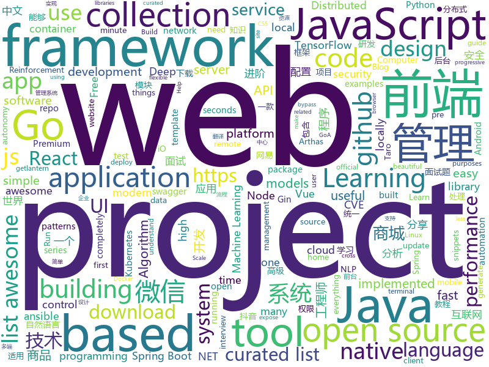

# 2019-02-21
See what the GitHub community is most excited about today.

## python
* [faceswap](https://github.com/deepfakes/faceswap)(**507 stars today**): Non official project based on original /r/Deepfakes thread. Many thanks to him!
* [awesome-python](https://github.com/vinta/awesome-python)(**330 stars today**): A curated list of awesome Python frameworks, libraries, software and resources
* [Tensorflow-Cookbook](https://github.com/taki0112/Tensorflow-Cookbook)(**298 stars today**): Simple Tensorflow Cookbook for easy-to-use
* [gpt-2](https://github.com/openai/gpt-2)(**238 stars today**): Code for the paper "Language Models are Unsupervised Multitask Learners"
* [Python](https://github.com/TheAlgorithms/Python)(**163 stars today**): All Algorithms implemented in Python
* [python-patterns](https://github.com/faif/python-patterns)(**122 stars today**): A collection of design patterns/idioms in Python
* [Jiagu](https://github.com/ownthink/Jiagu)(**96 stars today**): Jiagu深度学习自然语言处理工具 中文分词 词性标注 命名实体识别 情感分析 新词发现 关键词 文本摘要
* [system-design-primer](https://github.com/donnemartin/system-design-primer)(**79 stars today**): Learn how to design large-scale systems. Prep for the system design interview. Includes Anki flashcards.
* [public-apis](https://github.com/toddmotto/public-apis)(**82 stars today**): A collective list of free APIs for use in software and web development.
* [amemv-crawler](https://github.com/loadchange/amemv-crawler)(**79 stars today**): 🙌Easily download all the videos from TikTok(amemv).下载指定的 抖音（Douyin） 号的视频,抖音爬虫
* [ludwig](https://github.com/uber/ludwig)(**79 stars today**): Ludwig is a toolbox built on top of TensorFlow that allows to train and test deep learning models without the need to write code.
* [models](https://github.com/tensorflow/models)(**50 stars today**): Models and examples built with TensorFlow
* [mlcourse.ai](https://github.com/Yorko/mlcourse.ai)(**44 stars today**): Open Machine Learning Course
* [CheatSheetSeries](https://github.com/OWASP/CheatSheetSeries)(**55 stars today**): The OWASP Cheat Sheet Series was created to provide a concise collection of high value information on specific application security topics.
* [wukong-robot](https://github.com/wzpan/wukong-robot)(**52 stars today**): 🤖wukong-robot 是一个简单、灵活、优雅的中文语音对话机器人/智能音箱项目。
* [bert](https://github.com/google-research/bert)(**46 stars today**): TensorFlow code and pre-trained models for BERT
* [PayloadsAllTheThings](https://github.com/swisskyrepo/PayloadsAllTheThings)(**49 stars today**): A list of useful payloads and bypass for Web Application Security and Pentest/CTF
* [awesome-algorithm](https://github.com/apachecn/awesome-algorithm)(**46 stars today**): LeetCode, HackRank, 剑指offer, classic algorithm implementation
* [python-cheatsheet](https://github.com/gto76/python-cheatsheet)(**48 stars today**): Comprehensive Python Cheatsheet
* [huskarl](https://github.com/danaugrs/huskarl)(**49 stars today**): Parallel Deep Reinforcement Learning Framework
* [lascar](https://github.com/Ledger-Donjon/lascar)(**47 stars today**): Ledger's Advanced Side-Channel Analysis Repository
* [froggy-service](https://github.com/FroggyTaipei/froggy-service)(**44 stars today**): 邱威傑市民服務系統
* [ansible](https://github.com/ansible/ansible)(**34 stars today**): Ansible is a radically simple IT automation platform that makes your applications and systems easier to deploy. Avoid writing scripts or custom code to deploy and update your applications — automate in a language that approaches plain English, using SSH, with no agents to install on remote systems. https://docs.ansible.com/ansible/
* [AutoCrawler](https://github.com/YoongiKim/AutoCrawler)(**36 stars today**): Google, Naver multiprocess image web crawler (Selenium)
* [home-assistant](https://github.com/home-assistant/home-assistant)(**36 stars today**): 🏡Open source home automation that puts local control and privacy first

## java
* [JavaGuide](https://github.com/Snailclimb/JavaGuide)(**253 stars today**): 【Java学习+面试指南】 一份涵盖大部分Java程序员所需要掌握的核心知识。
* [advanced-java](https://github.com/doocs/advanced-java)(**163 stars today**): 😮互联网 Java 工程师进阶知识完全扫盲
* [mall](https://github.com/macrozheng/mall)(**127 stars today**): mall项目是一套电商系统，包括前台商城系统及后台管理系统，基于SpringBoot+MyBatis实现。 前台商城系统包含首页门户、商品推荐、商品搜索、商品展示、购物车、订单流程、会员中心、客户服务、帮助中心等模块。 后台管理系统包含商品管理、订单管理、会员管理、促销管理、运营管理、内容管理、统计报表、财务管理、权限管理、设置等模块。
* [DoraemonKit](https://github.com/didi/DoraemonKit)(**111 stars today**): 简称 "DoKit" 。一款功能齐全的客户端（ iOS 、Android ）研发助手，你值得拥有。
* [fescar](https://github.com/alibaba/fescar)(**96 stars today**): 🔥Fescar is an easy-to-use, high-performance, java based, open source distributed transaction solution.
* [Jenkins-PreAuth-RCE-PoC](https://github.com/petercunha/Jenkins-PreAuth-RCE-PoC)(**91 stars today**): Jenkins RCE PoC. From unauthenticated user to remote code execution - it's a hacker's dream! (Chaining CVE-2019-1003000, CVE-2018-1999002, and more)
* [kob](https://github.com/LianjiaTech/kob)(**95 stars today**): 
* [spring-boot](https://github.com/spring-projects/spring-boot)(**53 stars today**): Spring Boot
* [java-design-patterns](https://github.com/iluwatar/java-design-patterns)(**59 stars today**): Design patterns implemented in Java
* [arthas](https://github.com/alibaba/arthas)(**60 stars today**): Alibaba Java Diagnostic Tool Arthas/Alibaba Java诊断利器Arthas
* [ldbz-shop](https://github.com/laodaobazi/ldbz-shop)(**51 stars today**): 分布式商城
* [tutorials](https://github.com/eugenp/tutorials)(**30 stars today**): The "REST With Spring" Course:
* [miaosha](https://github.com/qiurunze123/miaosha)(**45 stars today**): ⛹️🐘秒杀系统设计与实现.互联网工程师进阶与分析🙋🐓
* [spring-boot-examples](https://github.com/ityouknow/spring-boot-examples)(**37 stars today**): about learning Spring Boot via examples. Spring Boot 教程、技术栈示例代码，快速简单上手教程。
* [Java](https://github.com/TheAlgorithms/Java)(**40 stars today**): All Algorithms implemented in Java
* [elasticsearch](https://github.com/elastic/elasticsearch)(**40 stars today**): Open Source, Distributed, RESTful Search Engine
* [spring-framework](https://github.com/spring-projects/spring-framework)(**31 stars today**): Spring Framework
* [cim](https://github.com/crossoverJie/cim)(**31 stars today**): 📲cim(cross IM) 适用于开发者的即时通讯系统
* [apollo](https://github.com/ctripcorp/apollo)(**31 stars today**): Apollo（阿波罗）是携程框架部门研发的分布式配置中心，能够集中化管理应用不同环境、不同集群的配置，配置修改后能够实时推送到应用端，并且具备规范的权限、流程治理等特性，适用于微服务配置管理场景。
* [QMUI_Android](https://github.com/Tencent/QMUI_Android)(**33 stars today**): 提高 Android UI 开发效率的 UI 库
* [flink](https://github.com/apache/flink)(**27 stars today**): Apache Flink
* [giffun](https://github.com/guolindev/giffun)(**31 stars today**): 一款开源的GIF在线分享App，乐趣就要和世界分享。
* [litemall](https://github.com/linlinjava/litemall)(**26 stars today**): 又一个小商城。litemall = Spring Boot后端 + Vue管理员前端 + 微信小程序用户前端
* [nacos](https://github.com/alibaba/nacos)(**28 stars today**): an easy-to-use dynamic service discovery, configuration and service management platform for building cloud native applications.
* [WxJava](https://github.com/Wechat-Group/WxJava)(**24 stars today**): WxJava （微信开发 Java SDK），支持包括微信支付、开放平台、小程序、企业微信/企业号和公众号等的后端开发

## unknown
* [Micro8](https://github.com/Micropoor/Micro8)(**1,870 stars today**): 
* [How-To-Secure-A-Linux-Server](https://github.com/imthenachoman/How-To-Secure-A-Linux-Server)(**729 stars today**): An evolving how-to guide for securing a Linux server.
* [Awesome-Design-Tools](https://github.com/LisaDziuba/Awesome-Design-Tools)(**701 stars today**): The best design tools for everything.
* [the-book-of-secret-knowledge](https://github.com/trimstray/the-book-of-secret-knowledge)(**582 stars today**): ⭐️A collection of awesome lists, manuals, blogs, hacks, one-liners, cli/web tools and more.
* [nginx-quick-reference](https://github.com/trimstray/nginx-quick-reference)(**302 stars today**): ⚡️This notes describes how to improve Nginx performance, security and other important things; ssllabs A+ 100%.
* [Daily-Interview-Question](https://github.com/Advanced-Frontend/Daily-Interview-Question)(**280 stars today**): 工作日每天一道前端大厂面试题，祝大家天天进步，一年后会看到不一样的自己。
* [deep-learning-drizzle](https://github.com/kmario23/deep-learning-drizzle)(**152 stars today**): Drench yourself in Deep Learning, Reinforcement Learning, Machine Learning, Computer Vision, and NLP by learning from these exciting lectures!!
* [CS-Notes](https://github.com/CyC2018/CS-Notes)(**140 stars today**): 😋技术面试必备基础知识
* [blog](https://github.com/yygmind/blog)(**120 stars today**): 我是木易杨，网易高级前端工程师，跟着我每周重点攻克一个前端面试重难点。接下来让我带你走进高级前端的世界，在进阶的路上，共勉！
* [awesome-doesnotexist](https://github.com/paubric/awesome-doesnotexist)(**114 stars today**): A curated list of awesome projects which use Machine Learning to generate synthetic content.
* [toBeTopJavaer](https://github.com/hollischuang/toBeTopJavaer)(**100 stars today**): To Be Top Javaer - Java工程师成神之路
* [awesome](https://github.com/sindresorhus/awesome)(**102 stars today**): 😎Curated list of awesome lists
* [project-based-learning](https://github.com/tuvtran/project-based-learning)(**89 stars today**): Curated list of project-based tutorials
* [gitignore](https://github.com/github/gitignore)(**66 stars today**): A collection of useful .gitignore templates
* [free-programming-books](https://github.com/EbookFoundation/free-programming-books)(**62 stars today**): 📚Freely available programming books
* [build-your-own-x](https://github.com/danistefanovic/build-your-own-x)(**59 stars today**): 🤓Build your own (insert technology here)
* [coding-interview-university](https://github.com/jwasham/coding-interview-university)(**58 stars today**): A complete computer science study plan to become a software engineer.
* [Xiaomi_Kernel_OpenSource](https://github.com/MiCode/Xiaomi_Kernel_OpenSource)(**53 stars today**): Xiaomi Mobile Phone Kernel OpenSource
* [nlp_chinese_corpus](https://github.com/brightmart/nlp_chinese_corpus)(**49 stars today**): 大规模中文自然语言处理语料 Large Scale Chinese Corpus for NLP
* [awesome-vue](https://github.com/vuejs/awesome-vue)(**47 stars today**): 🎉A curated list of awesome things related to Vue.js
* [awesome-semantic-segmentation](https://github.com/mrgloom/awesome-semantic-segmentation)(**38 stars today**): 🤘awesome-semantic-segmentation
* [awesome-podcasts](https://github.com/rShetty/awesome-podcasts)(**41 stars today**): Collection of awesome podcasts
* [gold-miner](https://github.com/xitu/gold-miner)(**35 stars today**): 🥇掘金翻译计划，可能是世界最大最好的英译中技术社区，最懂读者和译者的翻译平台：
* [awesome-nodejs](https://github.com/sindresorhus/awesome-nodejs)(**35 stars today**): ⚡️Delightful Node.js packages and resources
* [first-contributions](https://github.com/firstcontributions/first-contributions)(**14 stars today**): 🚀✨Help beginners to contribute to open source projects

## javascript
* [leon](https://github.com/leon-ai/leon)(**390 stars today**): 🧠 Leon is your open-source personal assistant.
* [codecrumbs](https://github.com/Bogdan-Lyashenko/codecrumbs)(**295 stars today**): Learn, design or document codebase by putting breadcrumbs in source code. Live updates, multi-language support, and easy sharing.
* [uppy](https://github.com/transloadit/uppy)(**270 stars today**): The next open source file uploader for web browsers🐶
* [taro-yanxuan](https://github.com/js-newbee/taro-yanxuan)(**185 stars today**): 首个 Taro 多端统一实例 - 网易严选（小程序 + H5 + React Native） - By 趣店 FED
* [vue](https://github.com/vuejs/vue)(**113 stars today**): 🖖Vue.js is a progressive, incrementally-adoptable JavaScript framework for building UI on the web.
* [bull](https://github.com/OptimalBits/bull)(**123 stars today**): Premium Queue package for handling jobs and messages in NodeJS.
* [git-history](https://github.com/pomber/git-history)(**115 stars today**): Quickly browse the history of any GitHub file
* [react](https://github.com/facebook/react)(**98 stars today**): A declarative, efficient, and flexible JavaScript library for building user interfaces.
* [taro](https://github.com/NervJS/taro)(**103 stars today**): 多端统一开发框架，支持用 React 的开发方式编写一次代码，生成能运行在微信/百度/支付宝/字节跳动小程序、H5、React Native 等的应用。 https://taro.js.org/
* [javascript-algorithms](https://github.com/trekhleb/javascript-algorithms)(**94 stars today**): 📝Algorithms and data structures implemented in JavaScript with explanations and links to further readings
* [fast-cli](https://github.com/sindresorhus/fast-cli)(**95 stars today**): Test your download and upload speed using fast.com
* [instant.page](https://github.com/instantpage/instant.page)(**93 stars today**): Make your site’s pages instant in 1 minute and improve your conversion rate by 1%
* [30-seconds-of-code](https://github.com/30-seconds/30-seconds-of-code)(**84 stars today**): Curated collection of useful JavaScript snippets that you can understand in 30 seconds or less.
* [react-native](https://github.com/facebook/react-native)(**77 stars today**): A framework for building native apps with React.
* [awesome-wechat-weapp](https://github.com/justjavac/awesome-wechat-weapp)(**74 stars today**): 微信小程序开发资源汇总💯
* [axios](https://github.com/axios/axios)(**72 stars today**): Promise based HTTP client for the browser and node.js
* [awesome-selfhosted](https://github.com/Kickball/awesome-selfhosted)(**70 stars today**): This is a list of Free Software network services and web applications which can be hosted locally. Selfhosting is the process of locally hosting and managing applications instead of renting from SaaS providers.
* [javascript](https://github.com/airbnb/javascript)(**66 stars today**): JavaScript Style Guide
* [not-paid](https://github.com/kleampa/not-paid)(**69 stars today**): Client did not pay? Add opacity to the body tag and decrease it every day until their site completely fades away
* [create-react-app](https://github.com/facebook/create-react-app)(**61 stars today**): Set up a modern web app by running one command.
* [xviz](https://github.com/uber/xviz)(**61 stars today**): A protocol for real-time transfer and visualization of autonomy data
* [next.js](https://github.com/zeit/next.js)(**60 stars today**): The React Framework
* [streetscape.gl](https://github.com/uber/streetscape.gl)(**61 stars today**): Visualization framework for autonomy and robotics data encoded
* [bootstrap](https://github.com/twbs/bootstrap)(**47 stars today**): The most popular HTML, CSS, and JavaScript framework for developing responsive, mobile first projects on the web.
* [puppeteer](https://github.com/GoogleChrome/puppeteer)(**52 stars today**): Headless Chrome Node API

## html
* [sec_profile](https://github.com/tanjiti/sec_profile)(**103 stars today**): 爬取secwiki和xuanwu.github.io,分析安全信息站点、安全趋势、提取安全工作者账号(twitter,weixin,github等)
* [Front-end-Developer-Interview-Questions](https://github.com/h5bp/Front-end-Developer-Interview-Questions)(**35 stars today**): A list of helpful front-end related questions you can use to interview potential candidates, test yourself or completely ignore.
* [styleguide](https://github.com/google/styleguide)(**21 stars today**): Style guides for Google-originated open-source projects
* [ionic](https://github.com/ionic-team/ionic)(**21 stars today**): Build amazing native and progressive web apps with open web technologies. One app running on everything🎉
* [AdminLTE](https://github.com/almasaeed2010/AdminLTE)(**17 stars today**): AdminLTE - Free Premium Admin control Panel Theme Based On Bootstrap 3.x
* [fake3d](https://github.com/akella/fake3d)(**21 stars today**): 
* [30-seconds-of-css](https://github.com/30-seconds/30-seconds-of-css)(**18 stars today**): A curated collection of useful CSS snippets you can understand in 30 seconds or less.
* [tudoficabem.github.io](https://github.com/carolcodes/tudoficabem.github.io)(**18 stars today**): Encontre psicoterapia gratuitamente ou com preço social🚧
* [flutter-in-action](https://github.com/flutterchina/flutter-in-action)(**17 stars today**): 《Flutter实战》电子书
* [Spoon-Knife](https://github.com/octocat/Spoon-Knife)(****): This repo is for demonstration purposes only.
* [javascript-tutorial-en](https://github.com/iliakan/javascript-tutorial-en)(**13 stars today**): Modern JavaScript Tutorial
* [now-github-starter](https://github.com/zeit/now-github-starter)(****): Starter project to demonstrate a project whose pull requests get automatically deployed
* [beautiful-jekyll](https://github.com/daattali/beautiful-jekyll)(**5 stars today**): ✨Build a beautiful and simple website in literally minutes. Demo at http://deanattali.com/beautiful-jekyll
* [dotnet](https://github.com/Microsoft/dotnet)(**11 stars today**): This repo is the official home of .NET on GitHub. It's a great starting point to find many .NET OSS projects from Microsoft and the community, including many that are part of the .NET Foundation.
* [tiny-slider](https://github.com/ganlanyuan/tiny-slider)(**11 stars today**): Vanilla javascript slider for all purposes.
* [D3-graph-gallery](https://github.com/holtzy/D3-graph-gallery)(**11 stars today**): A collection of simple graphics made with D3.js
* [frontendDaily](https://github.com/kujian/frontendDaily)(**10 stars today**): 前端开发技术日报，每日分享互联网最精彩的前端技术、前端资讯、后端编程、设计和资源等，欢迎关注Watch
* [portainer](https://github.com/portainer/portainer)(**10 stars today**): Simple management UI for Docker
* [web-interview](https://github.com/ravencrown/web-interview)(**10 stars today**): 前端面试题
* [fastText](https://github.com/facebookresearch/fastText)(**9 stars today**): Library for fast text representation and classification.
* [swagger-codegen](https://github.com/swagger-api/swagger-codegen)(**8 stars today**): swagger-codegen contains a template-driven engine to generate documentation, API clients and server stubs in different languages by parsing your OpenAPI / Swagger definition.
* [core](https://github.com/stackblitz/core)(**9 stars today**): Online IDE powered by Visual Studio Code⚡️
* [qiubaiying.github.io](https://github.com/qiubaiying/qiubaiying.github.io)(**5 stars today**): BY Blog ->
* [hyperHTML](https://github.com/WebReflection/hyperHTML)(**9 stars today**): A Fast & Light Virtual DOM Alternative
* [typedoc](https://github.com/TypeStrong/typedoc)(**8 stars today**): Documentation generator for TypeScript projects.

## go
* [inlets](https://github.com/alexellis/inlets)(**434 stars today**): Expose your local endpoints to the Internet
* [1m-go-websockets](https://github.com/eranyanay/1m-go-websockets)(**100 stars today**): handling 1M websockets connections in Go
* [frp](https://github.com/fatedier/frp)(**56 stars today**): A fast reverse proxy to help you expose a local server behind a NAT or firewall to the internet.
* [kubernetes](https://github.com/kubernetes/kubernetes)(**44 stars today**): Production-Grade Container Scheduling and Management
* [go](https://github.com/golang/go)(**53 stars today**): The Go programming language
* [awesome-go](https://github.com/avelino/awesome-go)(**51 stars today**): A curated list of awesome Go frameworks, libraries and software
* [istio](https://github.com/istio/istio)(**44 stars today**): Connect, secure, control, and observe services.
* [tview](https://github.com/rivo/tview)(**48 stars today**): Rich interactive widgets for terminal-based UIs written in Go
* [gotop](https://github.com/cjbassi/gotop)(**48 stars today**): A terminal based graphical activity monitor inspired by gtop and vtop
* [modd](https://github.com/cortesi/modd)(**46 stars today**): A flexible developer tool that runs processes and responds to filesystem changes
* [dgraph](https://github.com/dgraph-io/dgraph)(**45 stars today**): Fast, Distributed Graph DB
* [v2ray-core](https://github.com/v2ray/v2ray-core)(**40 stars today**): A platform for building proxies to bypass network restrictions.
* [hugo](https://github.com/gohugoio/hugo)(**39 stars today**): The world’s fastest framework for building websites.
* [gin](https://github.com/gin-gonic/gin)(**33 stars today**): Gin is a HTTP web framework written in Go (Golang). It features a Martini-like API with much better performance -- up to 40 times faster. If you need smashing performance, get yourself some Gin.
* [talos](https://github.com/autonomy/talos)(**34 stars today**): A modern Linux distribution for Kubernetes.
* [beego](https://github.com/astaxie/beego)(**30 stars today**): beego is an open-source, high-performance web framework for the Go programming language.
* [go-cloud](https://github.com/google/go-cloud)(**30 stars today**): The Go Cloud Development Kit (Go CDK): A library and tools for open cloud development in Go.
* [lantern](https://github.com/getlantern/lantern)(**28 stars today**): 🔴蓝灯最新版本下载 https://github.com/getlantern/download🔴Lantern Latest Download https://github.com/getlantern/download🔴
* [minikube](https://github.com/kubernetes/minikube)(**27 stars today**): Run Kubernetes locally
* [mkcert](https://github.com/FiloSottile/mkcert)(**28 stars today**): A simple zero-config tool to make locally trusted development certificates with any names you'd like.
* [prometheus](https://github.com/prometheus/prometheus)(**27 stars today**): The Prometheus monitoring system and time series database.
* [dive](https://github.com/wagoodman/dive)(**27 stars today**): A tool for exploring each layer in a docker image
* [CVE-2019-5736-PoC](https://github.com/Frichetten/CVE-2019-5736-PoC)(**26 stars today**): PoC for CVE-2019-5736
* [moby](https://github.com/moby/moby)(**23 stars today**): Moby Project - a collaborative project for the container ecosystem to assemble container-based systems
* [caddy](https://github.com/mholt/caddy)(**26 stars today**): Fast, cross-platform HTTP/2 web server with automatic HTTPS

## WordCloud

