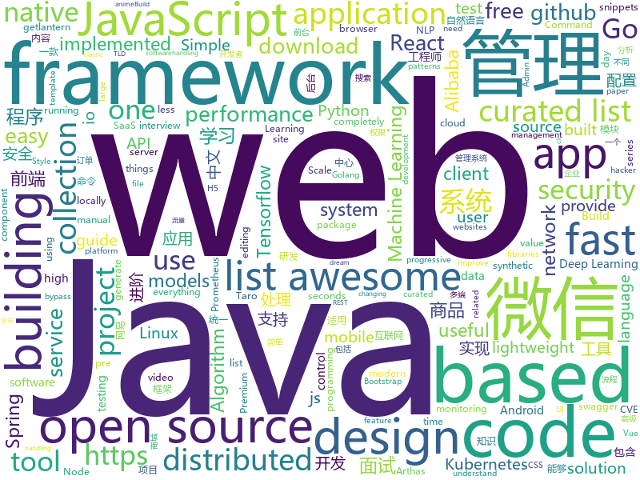

# 2019-02-22
See what the GitHub community is most excited about today.

## python
* [SC-FEGAN](https://github.com/JoYoungjoo/SC-FEGAN)(**502 stars today**): SC-FEGAN : Face Editing Generative Adversarial Network with User's Sketch and Color
* [faceswap](https://github.com/deepfakes/faceswap)(**388 stars today**): Non official project based on original /r/Deepfakes thread. Many thanks to him!
* [gpt-2](https://github.com/openai/gpt-2)(**181 stars today**): Code for the paper "Language Models are Unsupervised Multitask Learners"
* [Tensorflow-Cookbook](https://github.com/taki0112/Tensorflow-Cookbook)(**179 stars today**): Simple Tensorflow Cookbook for easy-to-use
* [awesome-python](https://github.com/vinta/awesome-python)(**171 stars today**): A curated list of awesome Python frameworks, libraries, software and resources
* [Python](https://github.com/TheAlgorithms/Python)(**164 stars today**): All Algorithms implemented in Python
* [ray](https://github.com/ray-project/ray)(**135 stars today**): A system for parallel and distributed Python that unifies the ML ecosystem.
* [ctf-tasks](https://github.com/j00ru/ctf-tasks)(**114 stars today**): An archive of low-level CTF challenges developed over the years
* [public-apis](https://github.com/toddmotto/public-apis)(**87 stars today**): A collective list of free APIs for use in software and web development.
* [wukong-robot](https://github.com/wzpan/wukong-robot)(**79 stars today**): 🤖wukong-robot 是一个简单、灵活、优雅的中文语音对话机器人/智能音箱项目。
* [models](https://github.com/tensorflow/models)(**68 stars today**): Models and examples built with TensorFlow
* [PayloadsAllTheThings](https://github.com/swisskyrepo/PayloadsAllTheThings)(**68 stars today**): A list of useful payloads and bypass for Web Application Security and Pentest/CTF
* [system-design-primer](https://github.com/donnemartin/system-design-primer)(**59 stars today**): Learn how to design large-scale systems. Prep for the system design interview. Includes Anki flashcards.
* [ludwig](https://github.com/uber/ludwig)(**63 stars today**): Ludwig is a toolbox built on top of TensorFlow that allows to train and test deep learning models without the need to write code.
* [FALSR](https://github.com/falsr/FALSR)(**60 stars today**): Fast, Accurate and Lightweight Super-Resolution models
* [onionshare](https://github.com/micahflee/onionshare)(**58 stars today**): Securely and anonymously send and receive files
* [python-patterns](https://github.com/faif/python-patterns)(**50 stars today**): A collection of design patterns/idioms in Python
* [mlcourse.ai](https://github.com/Yorko/mlcourse.ai)(**44 stars today**): Open Machine Learning Course
* [Algorithm_Interview_Notes-Chinese](https://github.com/imhuay/Algorithm_Interview_Notes-Chinese)(**46 stars today**): 2018/2019/校招/春招/秋招/算法/机器学习(Machine Learning)/深度学习(Deep Learning)/自然语言处理(NLP)/C/C++/Python/面试笔记
* [bert](https://github.com/google-research/bert)(**40 stars today**): TensorFlow code and pre-trained models for BERT
* [awesome-algorithm](https://github.com/apachecn/awesome-algorithm)(**43 stars today**): LeetCode, HackRank, 剑指offer, classic algorithm implementation
* [loguru](https://github.com/Delgan/loguru)(**44 stars today**): Python logging made (stupidly) simple
* [CheatSheetSeries](https://github.com/OWASP/CheatSheetSeries)(**38 stars today**): The OWASP Cheat Sheet Series was created to provide a concise collection of high value information on specific application security topics.
* [youtube-dl](https://github.com/rg3/youtube-dl)(**38 stars today**): Command-line program to download videos from YouTube.com and other video sites
* [FinMind](https://github.com/linsamtw/FinMind)(**36 stars today**): Open Source, more 15 kinds financial data.

## java
* [JavaGuide](https://github.com/Snailclimb/JavaGuide)(**233 stars today**): 【Java学习+面试指南】 一份涵盖大部分Java程序员所需要掌握的核心知识。
* [advanced-java](https://github.com/doocs/advanced-java)(**162 stars today**): 😮互联网 Java 工程师进阶知识完全扫盲
* [mall](https://github.com/macrozheng/mall)(**103 stars today**): mall项目是一套电商系统，包括前台商城系统及后台管理系统，基于SpringBoot+MyBatis实现。 前台商城系统包含首页门户、商品推荐、商品搜索、商品展示、购物车、订单流程、会员中心、客户服务、帮助中心等模块。 后台管理系统包含商品管理、订单管理、会员管理、促销管理、运营管理、内容管理、统计报表、财务管理、权限管理、设置等模块。
* [DoraemonKit](https://github.com/didi/DoraemonKit)(**116 stars today**): 简称 "DoKit" 。一款功能齐全的客户端（ iOS 、Android ）研发助手，你值得拥有。
* [arthas](https://github.com/alibaba/arthas)(**94 stars today**): Alibaba Java Diagnostic Tool Arthas/Alibaba Java诊断利器Arthas
* [fescar](https://github.com/alibaba/fescar)(**89 stars today**): 🔥Fescar is an easy-to-use, high-performance, java based, open source distributed transaction solution.
* [spring-boot](https://github.com/spring-projects/spring-boot)(**60 stars today**): Spring Boot
* [tutorials](https://github.com/eugenp/tutorials)(**43 stars today**): The "REST With Spring" Course:
* [apollo](https://github.com/ctripcorp/apollo)(**57 stars today**): Apollo（阿波罗）是携程框架部门研发的分布式配置中心，能够集中化管理应用不同环境、不同集群的配置，配置修改后能够实时推送到应用端，并且具备规范的权限、流程治理等特性，适用于微服务配置管理场景。
* [easyexcel](https://github.com/alibaba/easyexcel)(**58 stars today**): 快速、简单避免OOM的java处理Excel工具
* [java-design-patterns](https://github.com/iluwatar/java-design-patterns)(**48 stars today**): Design patterns implemented in Java
* [miaosha](https://github.com/qiurunze123/miaosha)(**49 stars today**): ⛹️🐘秒杀系统设计与实现.互联网工程师进阶与分析🙋🐓
* [smart-show](https://github.com/the-pig-of-jungle/smart-show)(**51 stars today**): Smart Toast & Snackbar & TopBar & Dialog
* [Jenkins-PreAuth-RCE-PoC](https://github.com/petercunha/Jenkins-PreAuth-RCE-PoC)(**52 stars today**): Jenkins RCE PoC. From unauthenticated user to remote code execution - it's a hacker's dream! (Chaining CVE-2019-1003000, CVE-2018-1999002, and more)
* [spring-cloud-alibaba](https://github.com/spring-cloud-incubator/spring-cloud-alibaba)(**51 stars today**): Spring Cloud Alibaba provides a one-stop solution for application development for the distributed solutions of Alibaba middleware.
* [spring-framework](https://github.com/spring-projects/spring-framework)(**40 stars today**): Spring Framework
* [cim](https://github.com/crossoverJie/cim)(**40 stars today**): 📲cim(cross IM) 适用于开发者的即时通讯系统
* [Sentinel](https://github.com/alibaba/Sentinel)(**37 stars today**): A lightweight powerful flow control component enabling reliability and monitoring for microservices. (轻量级的流量控制、熔断降级 Java 库)
* [nacos](https://github.com/alibaba/nacos)(**36 stars today**): an easy-to-use dynamic service discovery, configuration and service management platform for building cloud native applications.
* [Java](https://github.com/TheAlgorithms/Java)(**33 stars today**): All Algorithms implemented in Java
* [elasticsearch](https://github.com/elastic/elasticsearch)(**31 stars today**): Open Source, Distributed, RESTful Search Engine
* [incubator-dubbo](https://github.com/apache/incubator-dubbo)(**28 stars today**): Apache Dubbo (incubating) is a high-performance, java based, open source RPC framework.
* [symphony](https://github.com/b3log/symphony)(**32 stars today**): 🎶一款用 Java 实现的现代化社区（论坛/BBS/社交网络/博客）平台。https://hacpai.com
* [DroidAssist](https://github.com/didi/DroidAssist)(**32 stars today**): A lightweight Android Studio gradle plugin based on Javassist for editing bytecode in Android.
* [WxJava](https://github.com/Wechat-Group/WxJava)(**30 stars today**): WxJava （微信开发 Java SDK），支持包括微信支付、开放平台、小程序、企业微信/企业号和公众号等的后端开发

## unknown
* [Micro8](https://github.com/Micropoor/Micro8)(**2,732 stars today**): 
* [Awesome-Design-Tools](https://github.com/LisaDziuba/Awesome-Design-Tools)(**594 stars today**): The best design tools for everything.
* [How-To-Secure-A-Linux-Server](https://github.com/imthenachoman/How-To-Secure-A-Linux-Server)(**465 stars today**): An evolving how-to guide for securing a Linux server.
* [awesome-falsehood](https://github.com/kdeldycke/awesome-falsehood)(**388 stars today**): 💊Curated list of falsehoods programmers believe in.
* [Daily-Interview-Question](https://github.com/Advanced-Frontend/Daily-Interview-Question)(**355 stars today**): 工作日每天一道前端大厂面试题，祝大家天天进步，一年后会看到不一样的自己。
* [the-book-of-secret-knowledge](https://github.com/trimstray/the-book-of-secret-knowledge)(**344 stars today**): ⭐️A collection of awesome lists, manuals, blogs, hacks, one-liners, cli/web tools and more.
* [nginx-quick-reference](https://github.com/trimstray/nginx-quick-reference)(**259 stars today**): ⚡️This notes describes how to improve Nginx performance, security and other important things; ssllabs A+ 100%.
* [hacker-news-undocumented](https://github.com/minimaxir/hacker-news-undocumented)(**260 stars today**): Some of the hidden norms about Hacker News not otherwise covered in the Guidelines and the FAQ.
* [CS-Notes](https://github.com/CyC2018/CS-Notes)(**189 stars today**): 😋技术面试必备基础知识
* [deep-learning-drizzle](https://github.com/kmario23/deep-learning-drizzle)(**100 stars today**): Drench yourself in Deep Learning, Reinforcement Learning, Machine Learning, Computer Vision, and NLP by learning from these exciting lectures!!
* [awesome](https://github.com/sindresorhus/awesome)(**96 stars today**): 😎Curated list of awesome lists
* [gitignore](https://github.com/github/gitignore)(**72 stars today**): A collection of useful .gitignore templates
* [blog](https://github.com/yygmind/blog)(**83 stars today**): 我是木易杨，网易高级前端工程师，跟着我每周重点攻克一个前端面试重难点。接下来让我带你走进高级前端的世界，在进阶的路上，共勉！
* [free-programming-books](https://github.com/EbookFoundation/free-programming-books)(**64 stars today**): 📚Freely available programming books
* [project-based-learning](https://github.com/tuvtran/project-based-learning)(**63 stars today**): Curated list of project-based tutorials
* [undefined-medium](https://github.com/andirueckel/undefined-medium)(**65 stars today**): undefined medium — a free and open-source monospace typeface with 400+ characters
* [awesome-wechat-weapp](https://github.com/justjavac/awesome-wechat-weapp)(**50 stars today**): 微信小程序开发资源汇总💯
* [free-programming-books-zh_CN](https://github.com/justjavac/free-programming-books-zh_CN)(**51 stars today**): 📚免费的计算机编程类中文书籍，欢迎投稿
* [build-your-own-x](https://github.com/danistefanovic/build-your-own-x)(**49 stars today**): 🤓Build your own (insert technology here)
* [awesome-vue](https://github.com/vuejs/awesome-vue)(**42 stars today**): 🎉A curated list of awesome things related to Vue.js
* [awesome-doesnotexist](https://github.com/paubric/awesome-doesnotexist)(**41 stars today**): A curated list of awesome projects which use Machine Learning to generate synthetic content.
* [first-contributions](https://github.com/firstcontributions/first-contributions)(**15 stars today**): 🚀✨Help beginners to contribute to open source projects
* [nlp_chinese_corpus](https://github.com/brightmart/nlp_chinese_corpus)(**36 stars today**): 大规模中文自然语言处理语料 Large Scale Chinese Corpus for NLP
* [V](https://github.com/vlang-io/V)(**40 stars today**): 
* [awesome-dot-dev](https://github.com/DeveloperMode/awesome-dot-dev)(**40 stars today**): A list of awesome developer resources on the .dev TLD

## javascript
* [leon](https://github.com/leon-ai/leon)(**299 stars today**): 🧠 Leon is your open-source personal assistant.
* [codecrumbs](https://github.com/Bogdan-Lyashenko/codecrumbs)(**212 stars today**): Learn, design or document codebase by putting breadcrumbs in source code. Live updates, multi-language support, and easy sharing.
* [fast-cli](https://github.com/sindresorhus/fast-cli)(**163 stars today**): Test your download and upload speed using fast.com
* [vue](https://github.com/vuejs/vue)(**137 stars today**): 🖖Vue.js is a progressive, incrementally-adoptable JavaScript framework for building UI on the web.
* [30-seconds-of-code](https://github.com/30-seconds/30-seconds-of-code)(**120 stars today**): Curated collection of useful JavaScript snippets that you can understand in 30 seconds or less.
* [react](https://github.com/facebook/react)(**111 stars today**): A declarative, efficient, and flexible JavaScript library for building user interfaces.
* [taro-yanxuan](https://github.com/js-newbee/taro-yanxuan)(**114 stars today**): 首个 Taro 多端统一实例 - 网易严选（小程序 + H5 + React Native） - By 趣店 FED
* [uppy](https://github.com/transloadit/uppy)(**115 stars today**): The next open source file uploader for web browsers🐶
* [bull](https://github.com/OptimalBits/bull)(**103 stars today**): Premium Queue package for handling jobs and messages in NodeJS.
* [git-history](https://github.com/pomber/git-history)(**99 stars today**): Quickly browse the history of any GitHub file
* [taro](https://github.com/NervJS/taro)(**90 stars today**): 多端统一开发框架，支持用 React 的开发方式编写一次代码，生成能运行在微信/百度/支付宝/字节跳动小程序、H5、React Native 等的应用。 https://taro.js.org/
* [nsfwjs](https://github.com/infinitered/nsfwjs)(**92 stars today**): NSFW detection on the client-side via Tensorflow JS
* [not-paid](https://github.com/kleampa/not-paid)(**85 stars today**): Client did not pay? Add opacity to the body tag and decrease it every day until their site completely fades away
* [javascript-algorithms](https://github.com/trekhleb/javascript-algorithms)(**79 stars today**): 📝Algorithms and data structures implemented in JavaScript with explanations and links to further readings
* [awesome-selfhosted](https://github.com/Kickball/awesome-selfhosted)(**77 stars today**): This is a list of Free Software network services and web applications which can be hosted locally. Selfhosting is the process of locally hosting and managing applications instead of renting from SaaS providers.
* [Papers](https://github.com/maskhed/Papers)(**64 stars today**): Some papers about cyber security
* [axios](https://github.com/axios/axios)(**67 stars today**): Promise based HTTP client for the browser and node.js
* [puppeteer](https://github.com/GoogleChrome/puppeteer)(**69 stars today**): Headless Chrome Node API
* [gatsby](https://github.com/gatsbyjs/gatsby)(**61 stars today**): Build blazing fast, modern apps and websites with React
* [create-react-app](https://github.com/facebook/create-react-app)(**58 stars today**): Set up a modern web app by running one command.
* [bootstrap](https://github.com/twbs/bootstrap)(**53 stars today**): The most popular HTML, CSS, and JavaScript framework for developing responsive, mobile first projects on the web.
* [instant.page](https://github.com/instantpage/instant.page)(**64 stars today**): Make your site’s pages instant in 1 minute and improve your conversion rate by 1%
* [javascript](https://github.com/airbnb/javascript)(**58 stars today**): JavaScript Style Guide
* [next.js](https://github.com/zeit/next.js)(**52 stars today**): The React Framework
* [react-native](https://github.com/facebook/react-native)(**51 stars today**): A framework for building native apps with React.

## html
* [Screenshot-to-code](https://github.com/emilwallner/Screenshot-to-code)(**71 stars today**): A neural network that transforms a design mock-up into a static website
* [AdminLTE](https://github.com/almasaeed2010/AdminLTE)(**26 stars today**): AdminLTE - Free Premium Admin control Panel Theme Based On Bootstrap 3.x
* [Front-end-Developer-Interview-Questions](https://github.com/h5bp/Front-end-Developer-Interview-Questions)(**31 stars today**): A list of helpful front-end related questions you can use to interview potential candidates, test yourself or completely ignore.
* [sec_profile](https://github.com/tanjiti/sec_profile)(**31 stars today**): 爬取secwiki和xuanwu.github.io,分析安全信息站点、安全趋势、提取安全工作者账号(twitter,weixin,github等)
* [daily-anime](https://github.com/deepred5/daily-anime)(**33 stars today**): a vscode extension for daily anime
* [ionic](https://github.com/ionic-team/ionic)(**21 stars today**): Build amazing native and progressive web apps with open web technologies. One app running on everything🎉
* [styleguide](https://github.com/google/styleguide)(**19 stars today**): Style guides for Google-originated open-source projects
* [fake3d](https://github.com/akella/fake3d)(**24 stars today**): 
* [30-seconds-of-css](https://github.com/30-seconds/30-seconds-of-css)(**23 stars today**): A curated collection of useful CSS snippets you can understand in 30 seconds or less.
* [JavaScript30](https://github.com/wesbos/JavaScript30)(**11 stars today**): 30 Day Vanilla JS Challenge
* [matminer](https://github.com/hackingmaterials/matminer)(**17 stars today**): data mining for Materials Science
* [stisla](https://github.com/stisla/stisla)(**14 stars today**): Free Bootstrap Admin Template
* [hyperHTML](https://github.com/WebReflection/hyperHTML)(**15 stars today**): A Fast & Light Virtual DOM Alternative
* [fastText](https://github.com/facebookresearch/fastText)(**13 stars today**): Library for fast text representation and classification.
* [Spoon-Knife](https://github.com/octocat/Spoon-Knife)(****): This repo is for demonstration purposes only.
* [free-for-dev](https://github.com/ripienaar/free-for-dev)(**11 stars today**): A list of SaaS, PaaS and IaaS offerings that have free tiers of interest to devops and infradev
* [linux-command](https://github.com/jaywcjlove/linux-command)(**10 stars today**): Linux命令大全搜索工具，内容包含Linux命令手册、详解、学习、搜集。https://git.io/linux
* [javascript-tutorial-en](https://github.com/iliakan/javascript-tutorial-en)(**8 stars today**): Modern JavaScript Tutorial
* [flutter-in-action](https://github.com/flutterchina/flutter-in-action)(**9 stars today**): 《Flutter实战》电子书
* [swagger-codegen](https://github.com/swagger-api/swagger-codegen)(**7 stars today**): swagger-codegen contains a template-driven engine to generate documentation, API clients and server stubs in different languages by parsing your OpenAPI / Swagger definition.
* [portainer](https://github.com/portainer/portainer)(**8 stars today**): Simple management UI for Docker
* [ctf-wiki](https://github.com/ctf-wiki/ctf-wiki)(**8 stars today**): CTF Wiki Online
* [wechat_web_devtools](https://github.com/cytle/wechat_web_devtools)(**8 stars today**): 微信开发者工具(微信小程序)linux完美支持
* [all-contributors](https://github.com/all-contributors/all-contributors)(**8 stars today**): ✨Recognize all contributors, not just the ones who push code✨
* [owasp-mstg](https://github.com/OWASP/owasp-mstg)(**8 stars today**): The Mobile Security Testing Guide (MSTG) is a comprehensive manual for mobile app security testing and reverse engineering.

## go
* [inlets](https://github.com/alexellis/inlets)(**371 stars today**): Expose your local endpoints to the Internet
* [air](https://github.com/aofei/air)(**82 stars today**): An ideally refined web framework for Go.
* [kubernetes](https://github.com/kubernetes/kubernetes)(**59 stars today**): Production-Grade Container Scheduling and Management
* [awesome-go](https://github.com/avelino/awesome-go)(**62 stars today**): A curated list of awesome Go frameworks, libraries and software
* [1m-go-websockets](https://github.com/eranyanay/1m-go-websockets)(**54 stars today**): handling 1M websockets connections in Go
* [go](https://github.com/golang/go)(**50 stars today**): The Go programming language
* [service](https://github.com/ardanlabs/service)(**46 stars today**): Starter code for writing web services in Go
* [gin](https://github.com/gin-gonic/gin)(**42 stars today**): Gin is a HTTP web framework written in Go (Golang). It features a Martini-like API with much better performance -- up to 40 times faster. If you need smashing performance, get yourself some Gin.
* [hugo](https://github.com/gohugoio/hugo)(**39 stars today**): The world’s fastest framework for building websites.
* [helium](https://github.com/im-kulikov/helium)(**28 stars today**): Helium is a small, simple, modular constructor with some pre-built components for your convenience.
* [lantern](https://github.com/getlantern/lantern)(**33 stars today**): 🔴蓝灯最新版本下载 https://github.com/getlantern/download🔴Lantern Latest Download https://github.com/getlantern/download🔴
* [istio](https://github.com/istio/istio)(**32 stars today**): Connect, secure, control, and observe services.
* [dgraph](https://github.com/dgraph-io/dgraph)(**33 stars today**): Fast, Distributed Graph DB
* [jx](https://github.com/jenkins-x/jx)(**31 stars today**): Jenkins X provides automated CI+CD for Kubernetes with Preview Environments on Pull Requests using Jenkins, Knative Build, Prow, Skaffold and Helm
* [etcd](https://github.com/etcd-io/etcd)(**27 stars today**): Distributed reliable key-value store for the most critical data of a distributed system
* [prometheus](https://github.com/prometheus/prometheus)(**29 stars today**): The Prometheus monitoring system and time series database.
* [gotop](https://github.com/cjbassi/gotop)(**29 stars today**): A terminal based graphical activity monitor inspired by gtop and vtop
* [build-web-application-with-golang](https://github.com/astaxie/build-web-application-with-golang)(**27 stars today**): A golang ebook intro how to build a web with golang
* [helm](https://github.com/helm/helm)(**25 stars today**): The Kubernetes Package Manager
* [v2ray-core](https://github.com/v2ray/v2ray-core)(**26 stars today**): A platform for building proxies to bypass network restrictions.
* [terraform](https://github.com/hashicorp/terraform)(**24 stars today**): Terraform is a tool for building, changing, and combining infrastructure safely and efficiently.
* [kuberhealthy](https://github.com/Comcast/kuberhealthy)(**26 stars today**): Easy synthetic testing for Kubernetes clusters. Works great with Prometheus.
* [flipt](https://github.com/markphelps/flipt)(**26 stars today**): A self contained feature flag solution
* [dive](https://github.com/wagoodman/dive)(**25 stars today**): A tool for exploring each layer in a docker image
* [heimdall](https://github.com/gojektech/heimdall)(**25 stars today**): An enhanced HTTP client for Go

## WordCloud

