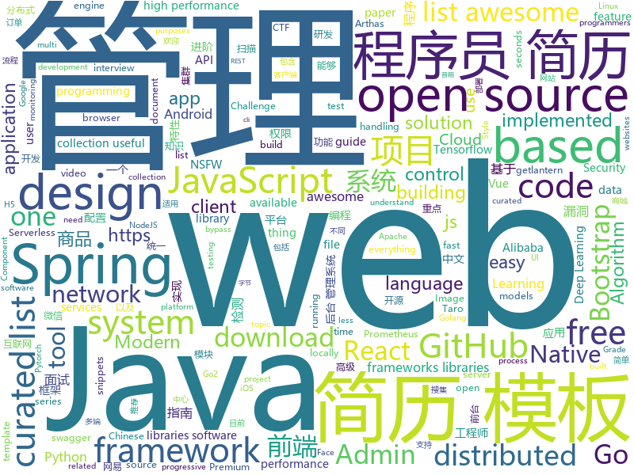

# 2019-02-23
See what the GitHub community is most excited about today.

## python
* [SC-FEGAN](https://github.com/JoYoungjoo/SC-FEGAN)(**492 stars today**): SC-FEGAN : Face Editing Generative Adversarial Network with User's Sketch and Color
* [HelloGitHub](https://github.com/521xueweihan/HelloGitHub)(**239 stars today**): 分享 GitHub 上有趣、入门级的开源项目，帮你找到编程的乐趣。欢迎推荐、自荐项目，让更多人知道你的项目⭐️
* [faceswap](https://github.com/deepfakes/faceswap)(**210 stars today**): Non official project based on original /r/Deepfakes thread. Many thanks to him!
* [gpt-2](https://github.com/openai/gpt-2)(**115 stars today**): Code for the paper "Language Models are Unsupervised Multitask Learners"
* [public-apis](https://github.com/toddmotto/public-apis)(**111 stars today**): A collective list of free APIs for use in software and web development.
* [Python](https://github.com/TheAlgorithms/Python)(**103 stars today**): All Algorithms implemented in Python
* [gpt-2-Pytorch](https://github.com/graykode/gpt-2-Pytorch)(**97 stars today**): Simple Text-Generator with OpenAI gpt-2 Pytorch Implementation
* [acefile](https://github.com/Ridter/acefile)(**84 stars today**): POC of https://research.checkpoint.com/extracting-code-execution-from-winrar/
* [super-inspire-end](https://github.com/super-inspire/super-inspire-end)(**93 stars today**): Get a clean, out of the box, temporary Linux system in under 30s.(Ubuntu, Centos, Alpine are temporarily available for testing, and more will be provided later.)
* [awesome-python](https://github.com/vinta/awesome-python)(**86 stars today**): A curated list of awesome Python frameworks, libraries, software and resources
* [Tensorflow-Cookbook](https://github.com/taki0112/Tensorflow-Cookbook)(**76 stars today**): Simple Tensorflow Cookbook for easy-to-use
* [models](https://github.com/tensorflow/models)(**57 stars today**): Models and examples built with TensorFlow
* [system-design-primer](https://github.com/donnemartin/system-design-primer)(**64 stars today**): Learn how to design large-scale systems. Prep for the system design interview. Includes Anki flashcards.
* [ray](https://github.com/ray-project/ray)(**62 stars today**): A system for parallel and distributed Python that unifies the ML ecosystem.
* [wukong-robot](https://github.com/wzpan/wukong-robot)(**56 stars today**): 🤖wukong-robot 是一个简单、灵活、优雅的中文语音对话机器人/智能音箱项目。
* [ludwig](https://github.com/uber/ludwig)(**53 stars today**): Ludwig is a toolbox built on top of TensorFlow that allows to train and test deep learning models without the need to write code.
* [clusterfuzz](https://github.com/google/clusterfuzz)(**49 stars today**): Scalable fuzzing infrastructure.
* [3DDFA](https://github.com/cleardusk/3DDFA)(**49 stars today**): The pytorch improved re-implementation of TPAMI 2017 paper: Face Alignment in Full Pose Range: A 3D Total Solution.
* [ctf-tasks](https://github.com/j00ru/ctf-tasks)(**50 stars today**): An archive of low-level CTF challenges developed over the years
* [pywonderland](https://github.com/neozhaoliang/pywonderland)(**46 stars today**): A tour in the wonderland of math with Python.
* [keras](https://github.com/keras-team/keras)(**44 stars today**): Deep Learning for humans
* [dm_control](https://github.com/deepmind/dm_control)(**49 stars today**): The DeepMind Control Suite and Package
* [awesome-algorithm](https://github.com/apachecn/awesome-algorithm)(**44 stars today**): LeetCode, HackRank, 剑指offer, classic algorithm implementation
* [youtube-dl](https://github.com/rg3/youtube-dl)(**37 stars today**): Command-line program to download videos from YouTube.com and other video sites
* [PayloadsAllTheThings](https://github.com/swisskyrepo/PayloadsAllTheThings)(**37 stars today**): A list of useful payloads and bypass for Web Application Security and Pentest/CTF

## java
* [JavaGuide](https://github.com/Snailclimb/JavaGuide)(**199 stars today**): 【Java学习+面试指南】 一份涵盖大部分Java程序员所需要掌握的核心知识。
* [advanced-java](https://github.com/doocs/advanced-java)(**154 stars today**): 😮互联网 Java 工程师进阶知识完全扫盲
* [jadx](https://github.com/skylot/jadx)(**108 stars today**): Dex to Java decompiler
* [DoraemonKit](https://github.com/didi/DoraemonKit)(**104 stars today**): 简称 "DoKit" 。一款功能齐全的客户端（ iOS 、Android ）研发助手，你值得拥有。
* [cim](https://github.com/crossoverJie/cim)(**98 stars today**): 📲cim(cross IM) 适用于开发者的即时通讯系统
* [mall](https://github.com/macrozheng/mall)(**69 stars today**): mall项目是一套电商系统，包括前台商城系统及后台管理系统，基于SpringBoot+MyBatis实现。 前台商城系统包含首页门户、商品推荐、商品搜索、商品展示、购物车、订单流程、会员中心、客户服务、帮助中心等模块。 后台管理系统包含商品管理、订单管理、会员管理、促销管理、运营管理、内容管理、统计报表、财务管理、权限管理、设置等模块。
* [miaosha](https://github.com/qiurunze123/miaosha)(**58 stars today**): ⛹️🐘秒杀系统设计与实现.互联网工程师进阶与分析🙋🐓
* [spring-boot](https://github.com/spring-projects/spring-boot)(**49 stars today**): Spring Boot
* [arthas](https://github.com/alibaba/arthas)(**54 stars today**): Alibaba Java Diagnostic Tool Arthas/Alibaba Java诊断利器Arthas
* [fescar](https://github.com/alibaba/fescar)(**56 stars today**): 🔥Fescar is an easy-to-use, high-performance, java based, open source distributed transaction solution.
* [java-design-patterns](https://github.com/iluwatar/java-design-patterns)(**46 stars today**): Design patterns implemented in Java
* [tutorials](https://github.com/eugenp/tutorials)(**28 stars today**): The "REST With Spring" Course:
* [Java](https://github.com/TheAlgorithms/Java)(**41 stars today**): All Algorithms implemented in Java
* [apollo](https://github.com/ctripcorp/apollo)(**41 stars today**): Apollo（阿波罗）是携程框架部门研发的分布式配置中心，能够集中化管理应用不同环境、不同集群的配置，配置修改后能够实时推送到应用端，并且具备规范的权限、流程治理等特性，适用于微服务配置管理场景。
* [spring-cloud-alibaba](https://github.com/spring-cloud-incubator/spring-cloud-alibaba)(**37 stars today**): Spring Cloud Alibaba provides a one-stop solution for application development for the distributed solutions of Alibaba middleware.
* [incubator-dubbo](https://github.com/apache/incubator-dubbo)(**30 stars today**): Apache Dubbo (incubating) is a high-performance, java based, open source RPC framework.
* [Sentinel](https://github.com/alibaba/Sentinel)(**34 stars today**): A lightweight powerful flow control component enabling reliability and monitoring for microservices. (轻量级的流量控制、熔断降级 Java 库)
* [AndPermission](https://github.com/yanzhenjie/AndPermission)(**35 stars today**): 🍓Permissions manager for Android platform.
* [easyexcel](https://github.com/alibaba/easyexcel)(**34 stars today**): 快速、简单避免OOM的java处理Excel工具
* [spring-framework](https://github.com/spring-projects/spring-framework)(**26 stars today**): Spring Framework
* [elasticsearch](https://github.com/elastic/elasticsearch)(**30 stars today**): Open Source, Distributed, RESTful Search Engine
* [fisher](https://github.com/fanxinglong/fisher)(**34 stars today**): 基于Spring cloud Oauth2和Element-UI-Admin的后台权限管理框架
* [smart-show](https://github.com/the-pig-of-jungle/smart-show)(**31 stars today**): Smart Toast & Snackbar & TopBar & Dialog
* [rocketmq](https://github.com/apache/rocketmq)(**21 stars today**): Mirror of Apache RocketMQ
* [redis-manager](https://github.com/ngbdf/redis-manager)(**29 stars today**): Redis 一站式管理平台，支持集群创建、管理、监控、报警

## unknown
* [Micro8](https://github.com/Micropoor/Micro8)(**1,341 stars today**): Gitbook
* [Xiaomi_Kernel_OpenSource](https://github.com/MiCode/Xiaomi_Kernel_OpenSource)(**543 stars today**): Xiaomi Mobile Phone Kernel OpenSource
* [Awesome-Design-Tools](https://github.com/LisaDziuba/Awesome-Design-Tools)(**360 stars today**): The best design tools for everything.
* [awesome-falsehood](https://github.com/kdeldycke/awesome-falsehood)(**367 stars today**): 💊Curated list of falsehoods programmers believe in.
* [the-book-of-secret-knowledge](https://github.com/trimstray/the-book-of-secret-knowledge)(**292 stars today**): ⭐️A collection of awesome lists, manuals, blogs, hacks, one-liners, cli/web tools and more.
* [Daily-Interview-Question](https://github.com/Advanced-Frontend/Daily-Interview-Question)(**286 stars today**): 工作日每天一道前端大厂面试题，祝大家天天进步，一年后会看到不一样的自己。
* [How-To-Secure-A-Linux-Server](https://github.com/imthenachoman/How-To-Secure-A-Linux-Server)(**270 stars today**): An evolving how-to guide for securing a Linux server.
* [CS-Notes](https://github.com/CyC2018/CS-Notes)(**185 stars today**): 😋技术面试必备基础知识
* [awesome-design-systems](https://github.com/alexpate/awesome-design-systems)(**140 stars today**): 💅🏻⚒A collection of awesome design systems
* [nginx-quick-reference](https://github.com/trimstray/nginx-quick-reference)(**130 stars today**): ⚡️This notes describes how to improve Nginx performance, security and other important things; @ssllabs A+ 100%.
* [awesome](https://github.com/sindresorhus/awesome)(**98 stars today**): 😎Awesome lists about all kinds of interesting topics
* [blog](https://github.com/yygmind/blog)(**93 stars today**): 我是木易杨，网易高级前端工程师，跟着我每周重点攻克一个前端面试重难点。接下来让我带你走进高级前端的世界，在进阶的路上，共勉！
* [undefined-medium](https://github.com/andirueckel/undefined-medium)(**97 stars today**): undefined medium — a free and open-source monospace typeface with 400+ characters
* [ResumeSample](https://github.com/geekcompany/ResumeSample)(**78 stars today**): Resume template for Chinese programmers . 程序员简历模板系列。包括PHP程序员简历模板、iOS程序员简历模板、Android程序员简历模板、Web前端程序员简历模板、Java程序员简历模板、C/C++程序员简历模板、NodeJS程序员简历模板、架构师简历模板以及通用程序员简历模板
* [gitignore](https://github.com/github/gitignore)(**58 stars today**): A collection of useful .gitignore templates
* [You-Dont-Know-JS](https://github.com/getify/You-Dont-Know-JS)(**63 stars today**): A book series on JavaScript. @YDKJS on twitter.
* [awesome-vue](https://github.com/vuejs/awesome-vue)(**63 stars today**): 🎉A curated list of awesome things related to Vue.js
* [deep-learning-drizzle](https://github.com/kmario23/deep-learning-drizzle)(**54 stars today**): Drench yourself in Deep Learning, Reinforcement Learning, Machine Learning, Computer Vision, and NLP by learning from these exciting lectures!!
* [circle](https://github.com/seanbaxter/circle)(**63 stars today**): Draft copy of Circle white paper
* [free-programming-books-zh_CN](https://github.com/justjavac/free-programming-books-zh_CN)(**50 stars today**): 📚免费的计算机编程类中文书籍，欢迎投稿
* [awesome-java](https://github.com/akullpp/awesome-java)(**54 stars today**): A curated list of awesome frameworks, libraries and software for the Java programming language.
* [awesome-wechat-weapp](https://github.com/justjavac/awesome-wechat-weapp)(**51 stars today**): 微信小程序开发资源汇总💯
* [free-programming-books](https://github.com/EbookFoundation/free-programming-books)(**46 stars today**): 📚Freely available programming books
* [nsfw_data_source_urls](https://github.com/EBazarov/nsfw_data_source_urls)(**31 stars today**): Collection of NSFW images URLs for the purposes of training an NSFW Image Classifier
* [awesome-public-datasets](https://github.com/awesomedata/awesome-public-datasets)(**34 stars today**): A topic-centric list of HQ open datasets in public domains. PR ☛☛☛

## javascript
* [leon](https://github.com/leon-ai/leon)(**262 stars today**): 🧠 Leon is your open-source personal assistant.
* [codecrumbs](https://github.com/Bogdan-Lyashenko/codecrumbs)(**190 stars today**): Learn, design or document codebase by putting breadcrumbs in source code. Live updates, multi-language support, and easy sharing.
* [git-history](https://github.com/pomber/git-history)(**174 stars today**): Quickly browse the history of a file from any git repository
* [vue](https://github.com/vuejs/vue)(**130 stars today**): 🖖Vue.js is a progressive, incrementally-adoptable JavaScript framework for building UI on the web.
* [30-seconds-of-code](https://github.com/30-seconds/30-seconds-of-code)(**109 stars today**): Curated collection of useful JavaScript snippets that you can understand in 30 seconds or less.
* [react](https://github.com/facebook/react)(**92 stars today**): A declarative, efficient, and flexible JavaScript library for building user interfaces.
* [bull](https://github.com/OptimalBits/bull)(**97 stars today**): Premium Queue package for handling jobs and messages in NodeJS.
* [nsfwjs](https://github.com/infinitered/nsfwjs)(**94 stars today**): NSFW detection on the client-side via Tensorflow JS
* [fast-cli](https://github.com/sindresorhus/fast-cli)(**90 stars today**): Test your download and upload speed using fast.com
* [guns-lite](https://github.com/enilu/guns-lite)(**87 stars today**): 基于spring boot脚手架项目，spring data jpa+Spring Boot2+bootstrap/vuejs完整的后台管理系统
* [uppy](https://github.com/transloadit/uppy)(**69 stars today**): The next open source file uploader for web browsers🐶
* [taro-yanxuan](https://github.com/js-newbee/taro-yanxuan)(**61 stars today**): 首个 Taro 多端统一实例 - 网易严选（小程序 + H5 + React Native） - By 趣店 FED
* [javascript](https://github.com/airbnb/javascript)(**59 stars today**): JavaScript Style Guide
* [react-spring](https://github.com/react-spring/react-spring)(**58 stars today**): ✌️A spring physics based React animation library
* [taro](https://github.com/NervJS/taro)(**58 stars today**): 多端统一开发框架，支持用 React 的开发方式编写一次代码，生成能运行在微信/百度/支付宝/字节跳动小程序、H5、React Native 等的应用。 https://taro.js.org/
* [awesome-selfhosted](https://github.com/Kickball/awesome-selfhosted)(**59 stars today**): This is a list of Free Software network services and web applications which can be hosted locally. Selfhosting is the process of locally hosting and managing applications instead of renting from SaaS providers.
* [javascript-algorithms](https://github.com/trekhleb/javascript-algorithms)(**55 stars today**): 📝Algorithms and data structures implemented in JavaScript with explanations and links to further readings
* [create-react-app](https://github.com/facebook/create-react-app)(**51 stars today**): Set up a modern web app by running one command.
* [cube.js](https://github.com/statsbotco/cube.js)(**57 stars today**): 📊Serverless Analytics Framework
* [axios](https://github.com/axios/axios)(**54 stars today**): Promise based HTTP client for the browser and node.js
* [gatsby](https://github.com/gatsbyjs/gatsby)(**53 stars today**): Build blazing fast, modern apps and websites with React
* [Gitter](https://github.com/huangjianke/Gitter)(**55 stars today**): Gitter for GitHub - 可能是目前颜值最高的GitHub小程序客户端
* [next.js](https://github.com/zeit/next.js)(**48 stars today**): The React Framework
* [yapi](https://github.com/YMFE/yapi)(**47 stars today**): YApi 是一个可本地部署的、打通前后端及QA的、可视化的接口管理平台
* [vuetify](https://github.com/vuetifyjs/vuetify)(**47 stars today**): 🐉Material Component Framework for Vue.js 2

## html
* [awesome-IT-films](https://github.com/greybax/awesome-IT-films)(**186 stars today**): 📺A curated list of awesome films about IT & geek people.
* [javascript-tutorial-en](https://github.com/iliakan/javascript-tutorial-en)(**89 stars today**): Modern JavaScript Tutorial
* [WDScanner](https://github.com/TideSec/WDScanner)(**33 stars today**): WDScanner平台目前实现了如下功能：分布式web漏洞扫描、客户管理、漏洞定期扫描、网站爬虫、暗链检测、坏链检测、网站指纹搜集、专项漏洞检测、代理搜集及部署、密码定向破解、社工库查询等功能。
* [ionic](https://github.com/ionic-team/ionic)(**29 stars today**): Build amazing native and progressive web apps with open web technologies. One app running on everything🎉
* [AdminLTE](https://github.com/almasaeed2010/AdminLTE)(**20 stars today**): AdminLTE - Free Premium Admin control Panel Theme Based On Bootstrap 3.x
* [py_stock](https://github.com/geeeeeeeek/py_stock)(**23 stars today**): python开发的A股行情看板
* [daily-anime](https://github.com/deepred5/daily-anime)(**25 stars today**): a vscode extension for daily anime
* [Screenshot-to-code](https://github.com/emilwallner/Screenshot-to-code)(**22 stars today**): A neural network that transforms a design mock-up into a static website
* [Front-end-Developer-Interview-Questions](https://github.com/h5bp/Front-end-Developer-Interview-Questions)(**21 stars today**): A list of helpful front-end related questions you can use to interview potential candidates, test yourself or completely ignore.
* [stisla](https://github.com/stisla/stisla)(**18 stars today**): Free Bootstrap Admin Template
* [30-seconds-of-css](https://github.com/30-seconds/30-seconds-of-css)(**19 stars today**): A curated collection of useful CSS snippets you can understand in 30 seconds or less.
* [styleguide](https://github.com/google/styleguide)(**11 stars today**): Style guides for Google-originated open-source projects
* [Spoon-Knife](https://github.com/octocat/Spoon-Knife)(****): This repo is for demonstration purposes only.
* [javascript-tutorial-zh](https://github.com/xitu/javascript-tutorial-zh)(**11 stars today**): Modern JavaScript Tutorial
* [JavaScript30](https://github.com/wesbos/JavaScript30)(**5 stars today**): 30 Day Vanilla JS Challenge
* [all-contributors](https://github.com/all-contributors/all-contributors)(**12 stars today**): ✨Recognize all contributors, not just the ones who push code✨
* [fonts](https://github.com/google/fonts)(**10 stars today**): Font files available from Google Fonts
* [github](https://github.com/phodal/github)(**9 stars today**): GitHub 漫游指南- a Chinese ebook on how to build a good project on Github. Explore the users' behavior. Find some thing interest.
* [swagger-codegen](https://github.com/swagger-api/swagger-codegen)(**7 stars today**): swagger-codegen contains a template-driven engine to generate documentation, API clients and server stubs in different languages by parsing your OpenAPI / Swagger definition.
* [coreui-free-bootstrap-admin-template](https://github.com/coreui/coreui-free-bootstrap-admin-template)(**8 stars today**): CoreUI is free bootstrap admin template
* [gentelella](https://github.com/ColorlibHQ/gentelella)(**8 stars today**): Free Bootstrap 3 Admin Template
* [blog_os](https://github.com/phil-opp/blog_os)(**9 stars today**): Writing an OS in Rust
* [pytorch-doc-zh](https://github.com/apachecn/pytorch-doc-zh)(**9 stars today**): PyTorch 中文文档
* [ecma262](https://github.com/tc39/ecma262)(**8 stars today**): Status, process, and documents for ECMA262
* [flutter-in-action](https://github.com/flutterchina/flutter-in-action)(**8 stars today**): 《Flutter实战》电子书

## go
* [inlets](https://github.com/alexellis/inlets)(**235 stars today**): Expose your local endpoints to the Internet
* [cds](https://github.com/ovh/cds)(**197 stars today**): Enterprise-Grade Continuous Delivery & DevOps Automation Open Source Platform
* [kubernetes](https://github.com/kubernetes/kubernetes)(**69 stars today**): Production-Grade Container Scheduling and Management
* [service](https://github.com/ardanlabs/service)(**74 stars today**): Starter code for writing web services in Go
* [awesome-go](https://github.com/avelino/awesome-go)(**63 stars today**): A curated list of awesome Go frameworks, libraries and software
* [go2-book](https://github.com/chai2010/go2-book)(**65 stars today**): 📚《Go2编程指南》开源图书，重点讲解Go2新特性，以及Go1教程中较少涉及的特性
* [go](https://github.com/golang/go)(**61 stars today**): The Go programming language
* [gin](https://github.com/gin-gonic/gin)(**46 stars today**): Gin is a HTTP web framework written in Go (Golang). It features a Martini-like API with much better performance -- up to 40 times faster. If you need smashing performance, get yourself some Gin.
* [flipt](https://github.com/markphelps/flipt)(**47 stars today**): A self contained feature flag solution
* [heimdall](https://github.com/gojektech/heimdall)(**45 stars today**): An enhanced HTTP client for Go
* [air](https://github.com/aofei/air)(**45 stars today**): An ideally refined web framework for Go.
* [dragonboat](https://github.com/lni/dragonboat)(**44 stars today**): A feature complete and high performance multi-group Raft library in Go.
* [1m-go-websockets](https://github.com/eranyanay/1m-go-websockets)(**43 stars today**): handling 1M websockets connections in Go
* [istio](https://github.com/istio/istio)(**39 stars today**): Connect, secure, control, and observe services.
* [kuberhealthy](https://github.com/Comcast/kuberhealthy)(**36 stars today**): Easy synthetic testing for Kubernetes clusters. Works great with Prometheus.
* [prometheus](https://github.com/prometheus/prometheus)(**33 stars today**): The Prometheus monitoring system and time series database.
* [etcd](https://github.com/etcd-io/etcd)(**33 stars today**): Distributed reliable key-value store for the most critical data of a distributed system
* [traefik](https://github.com/containous/traefik)(**32 stars today**): The Cloud Native Edge Router
* [hugo](https://github.com/gohugoio/hugo)(**30 stars today**): The world’s fastest framework for building websites.
* [lantern](https://github.com/getlantern/lantern)(**29 stars today**): 🔴蓝灯最新版本下载 https://github.com/getlantern/download🔴Lantern Latest Download https://github.com/getlantern/download🔴
* [dive](https://github.com/wagoodman/dive)(**30 stars today**): A tool for exploring each layer in a docker image
* [gotop](https://github.com/cjbassi/gotop)(**30 stars today**): A terminal based graphical activity monitor inspired by gtop and vtop
* [v2ray-core](https://github.com/v2ray/v2ray-core)(**29 stars today**): A platform for building proxies to bypass network restrictions.
* [Hacking-with-Go](https://github.com/parsiya/Hacking-with-Go)(**29 stars today**): Golang for Security Professionals
* [faas](https://github.com/openfaas/faas)(**28 stars today**): OpenFaaS - Serverless Functions Made Simple

## WordCloud

