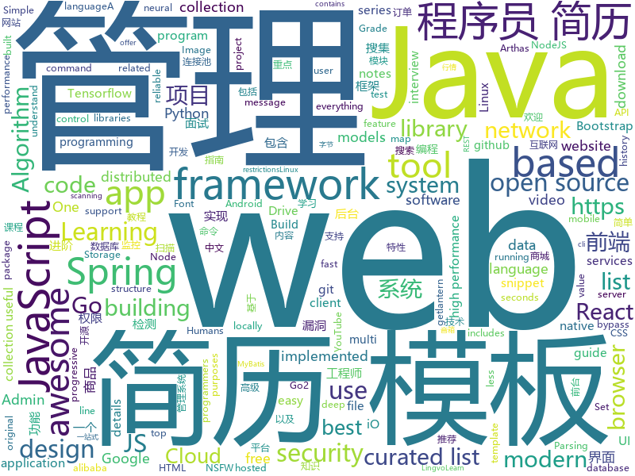

# 2019-02-24
See what the GitHub community is most excited about today.

## python
* [SC-FEGAN](https://github.com/JoYoungjoo/SC-FEGAN)(**139 stars today**): SC-FEGAN : Face Editing Generative Adversarial Network with User's Sketch and Color
* [HelloGitHub](https://github.com/521xueweihan/HelloGitHub)(**115 stars today**): 分享 GitHub 上有趣、入门级的开源项目，帮你找到编程的乐趣。欢迎推荐、自荐项目，让更多人知道你的项目⭐️
* [faceswap](https://github.com/deepfakes/faceswap)(**100 stars today**): Non official project based on original /r/Deepfakes thread. Many thanks to him!
* [gpt-2](https://github.com/openai/gpt-2)(**71 stars today**): Code for the paper "Language Models are Unsupervised Multitask Learners"
* [awesome-python](https://github.com/vinta/awesome-python)(**60 stars today**): A curated list of awesome Python frameworks, libraries, software and resources
* [cpython](https://github.com/python/cpython)(**53 stars today**): The Python programming language
* [public-apis](https://github.com/toddmotto/public-apis)(**56 stars today**): A collective list of free APIs for use in software and web development.
* [wukong-robot](https://github.com/wzpan/wukong-robot)(**47 stars today**): 🤖wukong-robot 是一个简单、灵活、优雅的中文语音对话机器人/智能音箱项目。
* [lingvo](https://github.com/tensorflow/lingvo)(**45 stars today**): Lingvo
* [system-design-primer](https://github.com/donnemartin/system-design-primer)(**41 stars today**): Learn how to design large-scale systems. Prep for the system design interview. Includes Anki flashcards.
* [message-analyser](https://github.com/vlajnaya-mol/message-analyser)(**46 stars today**): Statistical analysis of VKontakte and Telegram message history.
* [models](https://github.com/tensorflow/models)(**29 stars today**): Models and examples built with TensorFlow
* [Python](https://github.com/TheAlgorithms/Python)(**38 stars today**): All Algorithms implemented in Python
* [youtube-dl](https://github.com/rg3/youtube-dl)(**37 stars today**): Command-line program to download videos from YouTube.com and other video sites
* [leaguedirector](https://github.com/RiotGames/leaguedirector)(**31 stars today**): League Director is a tool for staging and recording videos from League of Legends replays
* [bert](https://github.com/google-research/bert)(**32 stars today**): TensorFlow code and pre-trained models for BERT
* [Tensorflow-Cookbook](https://github.com/taki0112/Tensorflow-Cookbook)(**32 stars today**): Simple Tensorflow Cookbook for easy-to-use
* [ludwig](https://github.com/uber/ludwig)(**32 stars today**): Ludwig is a toolbox built on top of TensorFlow that allows to train and test deep learning models without the need to write code.
* [awesome-algorithm](https://github.com/apachecn/awesome-algorithm)(**27 stars today**): LeetCode, HackRank, 剑指offer, classic algorithm implementation
* [pywonderland](https://github.com/neozhaoliang/pywonderland)(**28 stars today**): A tour in the wonderland of math with Python.
* [dirscraper](https://github.com/Cillian-Collins/dirscraper)(**29 stars today**): OSINT scanning tool which discovers and maps directories found in javascript files hosted on a website.
* [CheatSheetSeries](https://github.com/OWASP/CheatSheetSeries)(**28 stars today**): The OWASP Cheat Sheet Series was created to provide a concise collection of high value information on specific application security topics.
* [TensorFlow-Course](https://github.com/machinelearningmindset/TensorFlow-Course)(**28 stars today**): Simple and ready-to-use tutorials for TensorFlow
* [mindsdb](https://github.com/mindsdb/mindsdb)(**25 stars today**): Framework to streamline use of neural networks
* [keras](https://github.com/keras-team/keras)(**22 stars today**): Deep Learning for humans

## java
* [JavaGuide](https://github.com/Snailclimb/JavaGuide)(**100 stars today**): 【Java学习+面试指南】 一份涵盖大部分Java程序员所需要掌握的核心知识。
* [advanced-java](https://github.com/doocs/advanced-java)(**78 stars today**): 😮互联网 Java 工程师进阶知识完全扫盲
* [mall](https://github.com/macrozheng/mall)(**40 stars today**): mall项目是一套电商系统，包括前台商城系统及后台管理系统，基于SpringBoot+MyBatis实现。 前台商城系统包含首页门户、商品推荐、商品搜索、商品展示、购物车、订单流程、会员中心、客户服务、帮助中心等模块。 后台管理系统包含商品管理、订单管理、会员管理、促销管理、运营管理、内容管理、统计报表、财务管理、权限管理、设置等模块。
* [spring-boot](https://github.com/spring-projects/spring-boot)(**31 stars today**): Spring Boot
* [cim](https://github.com/crossoverJie/cim)(**36 stars today**): 📲cim(cross IM) 适用于开发者的即时通讯系统
* [DoraemonKit](https://github.com/didi/DoraemonKit)(**35 stars today**): 简称 "DoKit" 。一款功能齐全的客户端（ iOS 、Android ）研发助手，你值得拥有。
* [redis-manager](https://github.com/ngbdf/redis-manager)(**27 stars today**): Redis 一站式管理平台，支持集群创建、管理、监控、报警
* [fisher](https://github.com/fanxinglong/fisher)(**27 stars today**): 基于Spring cloud alibaba,oauth2和Element-UI-Admin的后台权限管理框架
* [fescar](https://github.com/alibaba/fescar)(**22 stars today**): 🔥Fescar is an easy-to-use, high-performance, java based, open source distributed transaction solution.
* [geektime-spring-family](https://github.com/geektime-geekbang/geektime-spring-family)(**22 stars today**): 极客时间视频课程《玩转Spring全家桶》
* [Java](https://github.com/TheAlgorithms/Java)(**23 stars today**): All Algorithms implemented in Java
* [java-design-patterns](https://github.com/iluwatar/java-design-patterns)(**20 stars today**): Design patterns implemented in Java
* [tutorials](https://github.com/eugenp/tutorials)(**13 stars today**): The "REST With Spring" Course:
* [miaosha](https://github.com/qiurunze123/miaosha)(**21 stars today**): ⛹️🐘秒杀系统设计与实现.互联网工程师进阶与分析🙋🐓
* [jadx](https://github.com/skylot/jadx)(**21 stars today**): Dex to Java decompiler
* [arthas](https://github.com/alibaba/arthas)(**21 stars today**): Alibaba Java Diagnostic Tool Arthas/Alibaba Java诊断利器Arthas
* [WindowTree](https://github.com/KaiXuan666/WindowTree)(**20 stars today**): 一个帮你维护界面父子层级关系的框架，轻松达成全局小红点提示，界面权限管理，界面通讯，界面自动化构建等强大功能
* [incubator-dubbo](https://github.com/apache/incubator-dubbo)(**15 stars today**): Apache Dubbo (incubating) is a high-performance, java based, open source RPC framework.
* [SpringCloudLearning](https://github.com/forezp/SpringCloudLearning)(**16 stars today**): 《史上最简单的Spring Cloud教程源码》
* [spring-framework](https://github.com/spring-projects/spring-framework)(**11 stars today**): Spring Framework
* [druid](https://github.com/alibaba/druid)(**16 stars today**): 阿里巴巴数据库事业部出品，为监控而生的数据库连接池。阿里云Data Lake Analytics(https://www.aliyun.com/product/datalakeanalytics )、DRDS、TDDL 连接池powered by Druid
* [graal](https://github.com/oracle/graal)(**16 stars today**): GraalVM: Run Programs Faster Anywhere🚀
* [SmartYouTubeTV](https://github.com/yuliskov/SmartYouTubeTV)(**16 stars today**): Watch YouTube videos on your TV and set-top-box with comfort
* [tech-weekly](https://github.com/mercyblitz/tech-weekly)(**15 stars today**): 「小马哥技术周报」
* [RxJava](https://github.com/ReactiveX/RxJava)(**14 stars today**): RxJava – Reactive Extensions for the JVM – a library for composing asynchronous and event-based programs using observable sequences for the Java VM.

## unknown
* [Micro8](https://github.com/Micropoor/Micro8)(**621 stars today**): Gitbook
* [the-book-of-secret-knowledge](https://github.com/trimstray/the-book-of-secret-knowledge)(**239 stars today**): ⭐️A collection of awesome lists, manuals, blogs, hacks, one-liners, cli/web tools and more.
* [Xiaomi_Kernel_OpenSource](https://github.com/MiCode/Xiaomi_Kernel_OpenSource)(**194 stars today**): Xiaomi Mobile Phone Kernel OpenSource
* [Awesome-Design-Tools](https://github.com/LisaDziuba/Awesome-Design-Tools)(**168 stars today**): The best design tools for everything.
* [awesome-falsehood](https://github.com/kdeldycke/awesome-falsehood)(**172 stars today**): 💊Curated list of falsehoods programmers believe in.
* [How-To-Secure-A-Linux-Server](https://github.com/imthenachoman/How-To-Secure-A-Linux-Server)(**159 stars today**): An evolving how-to guide for securing a Linux server.
* [Daily-Interview-Question](https://github.com/Advanced-Frontend/Daily-Interview-Question)(**147 stars today**): 工作日每天一道前端大厂面试题，祝大家天天进步，一年后会看到不一样的自己。
* [CS-Notes](https://github.com/CyC2018/CS-Notes)(**110 stars today**): 😋技术面试必备基础知识
* [nginx-quick-reference](https://github.com/trimstray/nginx-quick-reference)(**64 stars today**): ⚡️These notes describes how to improve Nginx performance, security and other important things; @ssllabs A+ 100%.
* [CS-Interview-Knowledge-Map](https://github.com/InterviewMap/CS-Interview-Knowledge-Map)(**59 stars today**): Build the best interview map. The current content includes JS, network, browser related, performance optimization, security, framework, Git, data structure, algorithm, etc.
* [awesome](https://github.com/sindresorhus/awesome)(**56 stars today**): 😎Awesome lists about all kinds of interesting topics
* [gitignore](https://github.com/github/gitignore)(**40 stars today**): A collection of useful .gitignore templates
* [V](https://github.com/vlang-io/V)(**49 stars today**): Fast, safe, compiled language for creating maintainable software. Supports translation from C/C++.
* [You-Dont-Know-JS](https://github.com/getify/You-Dont-Know-JS)(**41 stars today**): A book series on JavaScript. @YDKJS on twitter.
* [deep-learning-drizzle](https://github.com/kmario23/deep-learning-drizzle)(**41 stars today**): Drench yourself in Deep Learning, Reinforcement Learning, Machine Learning, Computer Vision, and NLP by learning from these exciting lectures!!
* [details-on-details](https://github.com/muan/details-on-details)(**43 stars today**): Notes from my talk at Brooklyn JS – Details on 
.
* [free-programming-books-zh_CN](https://github.com/justjavac/free-programming-books-zh_CN)(**38 stars today**): 📚免费的计算机编程类中文书籍，欢迎投稿
* [awesome-design-systems](https://github.com/alexpate/awesome-design-systems)(**40 stars today**): 💅🏻⚒A collection of awesome design systems
* [blog](https://github.com/yygmind/blog)(**38 stars today**): 我是木易杨，网易高级前端工程师，跟着我每周重点攻克一个前端面试重难点。接下来让我带你走进高级前端的世界，在进阶的路上，共勉！
* [free-programming-books](https://github.com/EbookFoundation/free-programming-books)(**34 stars today**): 📚Freely available programming books
* [ResumeSample](https://github.com/geekcompany/ResumeSample)(**32 stars today**): Resume template for Chinese programmers . 程序员简历模板系列。包括PHP程序员简历模板、iOS程序员简历模板、Android程序员简历模板、Web前端程序员简历模板、Java程序员简历模板、C/C++程序员简历模板、NodeJS程序员简历模板、架构师简历模板以及通用程序员简历模板
* [the-practical-linux-hardening-guide](https://github.com/trimstray/the-practical-linux-hardening-guide)(**30 stars today**): 🔥A practical hardening guide to advanced Linux security. OpenSCAP - C2S/CIS, STIG.
* [circle](https://github.com/seanbaxter/circle)(**29 stars today**): Draft copy of Circle white paper
* [chromium](https://github.com/jjqqkk/chromium)(**25 stars today**): Chromium browser with SSL VPN. Use this browser to unblock websites.
* [nsfw_data_source_urls](https://github.com/EBazarov/nsfw_data_source_urls)(**21 stars today**): Collection of NSFW images URLs for the purposes of training an NSFW Image Classifier

## javascript
* [codecrumbs](https://github.com/Bogdan-Lyashenko/codecrumbs)(**103 stars today**): Learn, design or document codebase by putting breadcrumbs in source code. Live updates, multi-language support, and easy sharing.
* [leon](https://github.com/leon-ai/leon)(**96 stars today**): 🧠 Leon is your open-source personal assistant.
* [vue](https://github.com/vuejs/vue)(**73 stars today**): 🖖Vue.js is a progressive, incrementally-adoptable JavaScript framework for building UI on the web.
* [git-history](https://github.com/pomber/git-history)(**70 stars today**): Quickly browse the history of a file from any git repository
* [nsfwjs](https://github.com/infinitered/nsfwjs)(**68 stars today**): NSFW detection on the client-side via Tensorflow JS
* [react](https://github.com/facebook/react)(**62 stars today**): A declarative, efficient, and flexible JavaScript library for building user interfaces.
* [berry](https://github.com/yarnpkg/berry)(**55 stars today**): 📦🐈A modern, fast, reliable, package manager; part of the Yarn organization
* [30-seconds-of-code](https://github.com/30-seconds/30-seconds-of-code)(**51 stars today**): Curated collection of useful JavaScript snippets that you can understand in 30 seconds or less.
* [create-react-app](https://github.com/facebook/create-react-app)(**45 stars today**): Set up a modern web app by running one command.
* [next.js](https://github.com/zeit/next.js)(**45 stars today**): The React Framework
* [details-menu-element](https://github.com/github/details-menu-element)(**45 stars today**): A menu opened with a 
 button.
* [uppy](https://github.com/transloadit/uppy)(**44 stars today**): The next open source file uploader for web browsers🐶
* [react-native](https://github.com/facebook/react-native)(**44 stars today**): A framework for building native apps with React.
* [react-spring](https://github.com/react-spring/react-spring)(**41 stars today**): ✌️A spring physics based React animation library
* [bull](https://github.com/OptimalBits/bull)(**42 stars today**): Premium Queue package for handling jobs and messages in NodeJS.
* [javascript-algorithms](https://github.com/trekhleb/javascript-algorithms)(**37 stars today**): 📝Algorithms and data structures implemented in JavaScript with explanations and links to further readings
* [axios](https://github.com/axios/axios)(**41 stars today**): Promise based HTTP client for the browser and node.js
* [awesome-selfhosted](https://github.com/Kickball/awesome-selfhosted)(**40 stars today**): This is a list of Free Software network services and web applications which can be hosted locally. Selfhosting is the process of locally hosting and managing applications instead of renting from SaaS providers.
* [gatsby](https://github.com/gatsbyjs/gatsby)(**36 stars today**): Build blazing fast, modern apps and websites with React
* [puppeteer](https://github.com/GoogleChrome/puppeteer)(**36 stars today**): Headless Chrome Node API
* [node](https://github.com/nodejs/node)(**30 stars today**): Node.js JavaScript runtime✨🐢🚀✨
* [bootstrap](https://github.com/twbs/bootstrap)(**29 stars today**): The most popular HTML, CSS, and JavaScript framework for developing responsive, mobile first projects on the web.
* [taro](https://github.com/NervJS/taro)(**32 stars today**): 多端统一开发框架，支持用 React 的开发方式编写一次代码，生成能运行在微信/百度/支付宝/字节跳动小程序、H5、React Native 等的应用。 https://taro.js.org/
* [nodeppt](https://github.com/ksky521/nodeppt)(**33 stars today**): This is probably the best web presentation tool so far!
* [spectrum](https://github.com/withspectrum/spectrum)(**31 stars today**): Simple, powerful online communities.

## html
* [awesome-IT-films](https://github.com/greybax/awesome-IT-films)(**110 stars today**): 📺A curated list of awesome films about IT & geek people.
* [AdminLTE](https://github.com/almasaeed2010/AdminLTE)(**18 stars today**): AdminLTE - Free Premium Admin control Panel Theme Based On Bootstrap 3.x
* [googlefonts-font-display-helper](https://github.com/iamakulov/googlefonts-font-display-helper)(**21 stars today**): A snippet generator to speed up Google Fonts rendering with font-display
* [Spoon-Knife](https://github.com/octocat/Spoon-Knife)(****): This repo is for demonstration purposes only.
* [WDScanner](https://github.com/TideSec/WDScanner)(**16 stars today**): WDScanner平台目前实现了如下功能：分布式web漏洞扫描、客户管理、漏洞定期扫描、网站爬虫、暗链检测、坏链检测、网站指纹搜集、专项漏洞检测、代理搜集及部署、密码定向破解、社工库查询等功能。
* [ionic](https://github.com/ionic-team/ionic)(**15 stars today**): Build amazing native and progressive web apps with open web technologies. One app running on everything🎉
* [javascript-tutorial-en](https://github.com/iliakan/javascript-tutorial-en)(**17 stars today**): Modern JavaScript Tutorial
* [lectures](https://github.com/uo-ec607/lectures)(**15 stars today**): Lecture notes for EC 607
* [JavaScript30](https://github.com/wesbos/JavaScript30)(**9 stars today**): 30 Day Vanilla JS Challenge
* [Front-end-Developer-Interview-Questions](https://github.com/h5bp/Front-end-Developer-Interview-Questions)(**15 stars today**): A list of helpful front-end related questions you can use to interview potential candidates, test yourself or completely ignore.
* [styleguide](https://github.com/google/styleguide)(**12 stars today**): Style guides for Google-originated open-source projects
* [stisla](https://github.com/stisla/stisla)(**10 stars today**): Free Bootstrap Admin Template
* [30-seconds-of-css](https://github.com/30-seconds/30-seconds-of-css)(**11 stars today**): A curated collection of useful CSS snippets you can understand in 30 seconds or less.
* [flutter-in-action](https://github.com/flutterchina/flutter-in-action)(**9 stars today**): 《Flutter实战》电子书
* [GTFOBins.github.io](https://github.com/GTFOBins/GTFOBins.github.io)(**8 stars today**): Curated list of Unix binaries that can be exploited to bypass system security restrictions
* [linux-command](https://github.com/jaywcjlove/linux-command)(**7 stars today**): Linux命令大全搜索工具，内容包含Linux命令手册、详解、学习、搜集。https://git.io/linux
* [coreui-free-bootstrap-admin-template](https://github.com/coreui/coreui-free-bootstrap-admin-template)(**6 stars today**): CoreUI is free bootstrap admin template
* [portainer](https://github.com/portainer/portainer)(**7 stars today**): Simple management UI for Docker
* [Screenshot-to-code](https://github.com/emilwallner/Screenshot-to-code)(**7 stars today**): A neural network that transforms a design mock-up into a static website
* [requests-html](https://github.com/kennethreitz/requests-html)(**7 stars today**): Pythonic HTML Parsing for Humans™
* [polymer](https://github.com/Polymer/polymer)(**6 stars today**): Our original Web Component library.
* [zju-icicles](https://github.com/QSCTech/zju-icicles)(**6 stars today**): 浙江大学课程攻略共享计划
* [py_stock](https://github.com/geeeeeeeek/py_stock)(**6 stars today**): python开发的A股行情看板
* [WebFundamentals](https://github.com/google/WebFundamentals)(**5 stars today**): Best practices for modern web development
* [swagger-codegen](https://github.com/swagger-api/swagger-codegen)(**5 stars today**): swagger-codegen contains a template-driven engine to generate documentation, API clients and server stubs in different languages by parsing your OpenAPI / Swagger definition.

## go
* [cds](https://github.com/ovh/cds)(**157 stars today**): Enterprise-Grade Continuous Delivery & DevOps Automation Open Source Platform
* [inlets](https://github.com/alexellis/inlets)(**79 stars today**): Expose your local endpoints to the Internet
* [Venom](https://github.com/Dliv3/Venom)(**57 stars today**): Venom - A Multi-hop Proxy for Penetration Testers Written in Go
* [kubernetes](https://github.com/kubernetes/kubernetes)(**39 stars today**): Production-Grade Container Scheduling and Management
* [go](https://github.com/golang/go)(**39 stars today**): The Go programming language
* [awesome-go](https://github.com/avelino/awesome-go)(**35 stars today**): A curated list of awesome Go frameworks, libraries and software
* [winc](https://github.com/tadvi/winc)(**31 stars today**): Common library for Go GUI apps on Windows
* [dragonboat](https://github.com/lni/dragonboat)(**29 stars today**): A feature complete and high performance multi-group Raft library in Go.
* [v2ray-core](https://github.com/v2ray/v2ray-core)(**26 stars today**): A platform for building proxies to bypass network restrictions.
* [hugo](https://github.com/gohugoio/hugo)(**22 stars today**): The world’s fastest framework for building websites.
* [Hacking-with-Go](https://github.com/parsiya/Hacking-with-Go)(**22 stars today**): Golang for Security Professionals
* [lantern](https://github.com/getlantern/lantern)(**20 stars today**): 🔴蓝灯最新版本下载 https://github.com/getlantern/download🔴Lantern Latest Download https://github.com/getlantern/download🔴
* [service](https://github.com/ardanlabs/service)(**21 stars today**): Starter code for writing web services in Go
* [dgraph](https://github.com/dgraph-io/dgraph)(**20 stars today**): Fast, Distributed Graph DB
* [1m-go-websockets](https://github.com/eranyanay/1m-go-websockets)(**19 stars today**): handling 1M websockets connections in Go
* [fzf](https://github.com/junegunn/fzf)(**20 stars today**): 🌸A command-line fuzzy finder
* [faas](https://github.com/openfaas/faas)(**19 stars today**): OpenFaaS - Serverless Functions Made Simple
* [gotop](https://github.com/cjbassi/gotop)(**19 stars today**): A terminal based graphical activity monitor inspired by gtop and vtop
* [go2-book](https://github.com/chai2010/go2-book)(**19 stars today**): 📚《Go2编程指南》开源图书，重点讲解Go2新特性，以及Go1教程中较少涉及的特性
* [etcd](https://github.com/etcd-io/etcd)(**17 stars today**): Distributed reliable key-value store for the most critical data of a distributed system
* [istio](https://github.com/istio/istio)(**16 stars today**): Connect, secure, control, and observe services.
* [rclone](https://github.com/ncw/rclone)(**17 stars today**): "rsync for cloud storage" - Google Drive, Amazon Drive, S3, Dropbox, Backblaze B2, One Drive, Swift, Hubic, Cloudfiles, Google Cloud Storage, Yandex Files
* [flipt](https://github.com/markphelps/flipt)(**17 stars today**): A self contained feature flag solution
* [prometheus](https://github.com/prometheus/prometheus)(**16 stars today**): The Prometheus monitoring system and time series database.
* [tile38](https://github.com/tidwall/tile38)(**16 stars today**): Tile38 is a geospatial database, spatial index, and realtime geofence.🌐

## WordCloud

