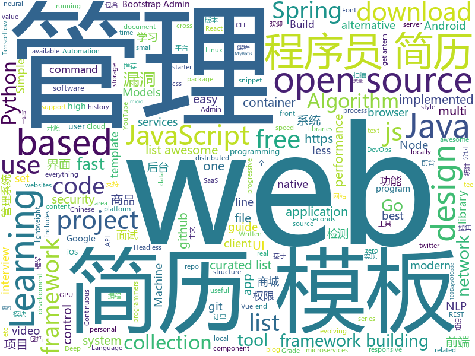

# 2019-02-25
See what the GitHub community is most excited about today.

## python
* [Algorithm_Interview_Notes-Chinese](https://github.com/imhuay/Algorithm_Interview_Notes-Chinese)(**477 stars today**): 2018/2019/校招/春招/秋招/算法/机器学习(Machine Learning)/深度学习(Deep Learning)/自然语言处理(NLP)/C/C++/Python/面试笔记
* [SC-FEGAN](https://github.com/JoYoungjoo/SC-FEGAN)(**155 stars today**): SC-FEGAN : Face Editing Generative Adversarial Network with User's Sketch and Color
* [faceswap](https://github.com/deepfakes/faceswap)(**101 stars today**): Non official project based on original /r/Deepfakes thread. Many thanks to him!
* [HelloGitHub](https://github.com/521xueweihan/HelloGitHub)(**59 stars today**): 分享 GitHub 上有趣、入门级的开源项目，帮你找到编程的乐趣。欢迎推荐、自荐项目，让更多人知道你的项目⭐️
* [public-apis](https://github.com/toddmotto/public-apis)(**57 stars today**): A collective list of free APIs for use in software and web development.
* [gpt-2](https://github.com/openai/gpt-2)(**54 stars today**): Code for the paper "Language Models are Unsupervised Multitask Learners"
* [K8tools](https://github.com/k8gege/K8tools)(**49 stars today**): K8工具(内网渗透/提权工具/远程溢出/漏洞利用/Exploit/APT/0day/Shellcode/Payload/priviledge/OverFlow/WebShell/PenTest)
* [models](https://github.com/tensorflow/models)(**38 stars today**): Models and examples built with TensorFlow
* [system-design-primer](https://github.com/donnemartin/system-design-primer)(**49 stars today**): Learn how to design large-scale systems. Prep for the system design interview. Includes Anki flashcards.
* [awesome-python](https://github.com/vinta/awesome-python)(**47 stars today**): A curated list of awesome Python frameworks, libraries, software and resources
* [Python](https://github.com/TheAlgorithms/Python)(**41 stars today**): All Algorithms implemented in Python
* [youtube-dl](https://github.com/rg3/youtube-dl)(**39 stars today**): Command-line program to download videos from YouTube.com and other video sites
* [message-analyser](https://github.com/vlajnaya-mol/message-analyser)(**34 stars today**): Statistical analysis of VKontakte and Telegram message history.
* [Tensorflow-Cookbook](https://github.com/taki0112/Tensorflow-Cookbook)(**35 stars today**): Simple Tensorflow Cookbook for easy-to-use
* [cpython](https://github.com/python/cpython)(**27 stars today**): The Python programming language
* [bert](https://github.com/google-research/bert)(**30 stars today**): TensorFlow code and pre-trained models for BERT
* [keras](https://github.com/keras-team/keras)(**26 stars today**): Deep Learning for humans
* [awesome-algorithm](https://github.com/apachecn/awesome-algorithm)(**28 stars today**): LeetCode, HackRank, 剑指offer, classic algorithm implementation
* [jax](https://github.com/google/jax)(**28 stars today**): Composable transformations of Python+NumPy programs: differentiate, vectorize, JIT to GPU/TPU, and more
* [home-assistant](https://github.com/home-assistant/home-assistant)(**22 stars today**): 🏡Open source home automation that puts local control and privacy first
* [CheatSheetSeries](https://github.com/OWASP/CheatSheetSeries)(**26 stars today**): The OWASP Cheat Sheet Series was created to provide a concise collection of high value information on specific application security topics.
* [algo](https://github.com/trailofbits/algo)(**26 stars today**): Set up a personal IPSEC VPN in the cloud
* [mindsdb](https://github.com/mindsdb/mindsdb)(**25 stars today**): Framework to streamline use of neural networks
* [flask](https://github.com/pallets/flask)(**25 stars today**): The Python micro framework for building web applications.
* [httpie](https://github.com/jakubroztocil/httpie)(****): As easy as httpie /aitch-tee-tee-pie/ 🥧 Modern command line HTTP client – user-friendly curl alternative with intuitive UI, JSON support, syntax highlighting, wget-like downloads, extensions, etc. https://twitter.com/clihttp

## java
* [JavaGuide](https://github.com/Snailclimb/JavaGuide)(**110 stars today**): 【Java学习+面试指南】 一份涵盖大部分Java程序员所需要掌握的核心知识。
* [NeroParser](https://github.com/yaoguangluo/NeroParser)(**88 stars today**): ⚡️20,000/ms Parser NLP POS AI Chinese words from complex sentence /每秒高达2700万混合分词， 高精准确率，支持病句分析，词性，词频统计，自由扩充词库的快速神经网络中文分词包.
* [advanced-java](https://github.com/doocs/advanced-java)(**68 stars today**): 😮互联网 Java 工程师进阶知识完全扫盲
* [light-4j](https://github.com/networknt/light-4j)(**48 stars today**): A fast, lightweight and more productive microservices framework
* [fisher](https://github.com/fanxinglong/fisher)(**31 stars today**): 基于Spring cloud alibaba,oauth2和Element-UI-Admin的后台权限管理框架
* [mall](https://github.com/macrozheng/mall)(**26 stars today**): mall项目是一套电商系统，包括前台商城系统及后台管理系统，基于SpringBoot+MyBatis实现。 前台商城系统包含首页门户、商品推荐、商品搜索、商品展示、购物车、订单流程、会员中心、客户服务、帮助中心等模块。 后台管理系统包含商品管理、订单管理、会员管理、促销管理、运营管理、内容管理、统计报表、财务管理、权限管理、设置等模块。
* [spring-boot](https://github.com/spring-projects/spring-boot)(**25 stars today**): Spring Boot
* [redis-manager](https://github.com/ngbdf/redis-manager)(**25 stars today**): Redis 一站式管理平台，支持集群创建、管理、监控、报警
* [tutorials](https://github.com/eugenp/tutorials)(**16 stars today**): The "REST With Spring" Course:
* [javafx-jlink-starter-gradle](https://github.com/brunoborges/javafx-jlink-starter-gradle)(**27 stars today**): A JavaFX starter project with Gradle and jlink support
* [spring-framework](https://github.com/spring-projects/spring-framework)(**16 stars today**): Spring Framework
* [WindowTree](https://github.com/KaiXuan666/WindowTree)(**23 stars today**): 一个帮你维护界面父子层级关系的框架，轻松达成全局小红点提示，界面权限管理，界面通讯，界面自动化构建等强大功能
* [cim](https://github.com/crossoverJie/cim)(**22 stars today**): 📲cim(cross IM) 适用于开发者的即时通讯系统
* [java-design-patterns](https://github.com/iluwatar/java-design-patterns)(**19 stars today**): Design patterns implemented in Java
* [corretto-8](https://github.com/corretto/corretto-8)(**21 stars today**): Amazon Corretto 8 is a no-cost, multi-platform, production-ready distribution of OpenJDK 8
* [Java](https://github.com/TheAlgorithms/Java)(**19 stars today**): All Algorithms implemented in Java
* [fescar](https://github.com/alibaba/fescar)(**19 stars today**): 🔥Fescar is an easy-to-use, high-performance, java based, open source distributed transaction solution.
* [SmartYouTubeTV](https://github.com/yuliskov/SmartYouTubeTV)(**20 stars today**): Watch YouTube videos on your TV and set-top-box with comfort
* [elasticsearch](https://github.com/elastic/elasticsearch)(**17 stars today**): Open Source, Distributed, RESTful Search Engine
* [Magisk](https://github.com/topjohnwu/Magisk)(**17 stars today**): A Magic Mask to Alter Android System Systemless-ly
* [DoraemonKit](https://github.com/didi/DoraemonKit)(**18 stars today**): 简称 "DoKit" 。一款功能齐全的客户端（ iOS 、Android ）研发助手，你值得拥有。
* [geektime-spring-family](https://github.com/geektime-geekbang/geektime-spring-family)(**14 stars today**): 极客时间视频课程《玩转Spring全家桶》
* [jadx](https://github.com/skylot/jadx)(**15 stars today**): Dex to Java decompiler
* [Sentinel](https://github.com/alibaba/Sentinel)(**13 stars today**): A lightweight powerful flow control component enabling reliability and monitoring for microservices. (轻量级的流量控制、熔断降级 Java 库)
* [litemall](https://github.com/linlinjava/litemall)(**10 stars today**): 又一个小商城。litemall = Spring Boot后端 + Vue管理员前端 + 微信小程序用户前端

## unknown
* [Micro8](https://github.com/Micropoor/Micro8)(**347 stars today**): Gitbook
* [the-book-of-secret-knowledge](https://github.com/trimstray/the-book-of-secret-knowledge)(**247 stars today**): ⭐️A collection of inspiring lists, manuals, cheatsheets, blogs, hacks, one-liners, cli/web tools and more.
* [awesome-lite-websites](https://github.com/mdibaiee/awesome-lite-websites)(**167 stars today**): A list of awesome lite websites without all the bloat
* [How-To-Secure-A-Linux-Server](https://github.com/imthenachoman/How-To-Secure-A-Linux-Server)(**155 stars today**): An evolving how-to guide for securing a Linux server.
* [Awesome-Design-Tools](https://github.com/LisaDziuba/Awesome-Design-Tools)(**132 stars today**): The best design tools for everything.
* [Daily-Interview-Question](https://github.com/Advanced-Frontend/Daily-Interview-Question)(**123 stars today**): 工作日每天一道前端大厂面试题，祝大家天天进步，一年后会看到不一样的自己。
* [CS-Notes](https://github.com/CyC2018/CS-Notes)(**94 stars today**): 😋技术面试必备基础知识
* [Xiaomi_Kernel_OpenSource](https://github.com/MiCode/Xiaomi_Kernel_OpenSource)(**87 stars today**): Xiaomi Mobile Phone Kernel OpenSource
* [awesome-falsehood](https://github.com/kdeldycke/awesome-falsehood)(**89 stars today**): 💊Curated list of falsehoods programmers believe in.
* [javascript-tips-and-tidbits](https://github.com/nas5w/javascript-tips-and-tidbits)(**80 stars today**): A continuously-evolving compendium of javascript tips based on common areas of confusion or misunderstanding.
* [gitignore](https://github.com/github/gitignore)(**45 stars today**): A collection of useful .gitignore templates
* [awesome](https://github.com/sindresorhus/awesome)(**64 stars today**): 😎Awesome lists about all kinds of interesting topics
* [100-days-of-code-frontend](https://github.com/nas5w/100-days-of-code-frontend)(**58 stars today**): Curriculum for learning front-end development during #100DaysOfCode.
* [nginx-quick-reference](https://github.com/trimstray/nginx-quick-reference)(**54 stars today**): ⚡️These notes describes how to improve Nginx performance, security and other important things; @ssllabs A+ 100%.
* [You-Dont-Know-JS](https://github.com/getify/You-Dont-Know-JS)(**37 stars today**): A book series on JavaScript. @YDKJS on twitter.
* [build-your-own-x](https://github.com/danistefanovic/build-your-own-x)(**41 stars today**): 🤓Build your own (insert technology here)
* [free-programming-books](https://github.com/EbookFoundation/free-programming-books)(**33 stars today**): 📚Freely available programming books
* [deep-learning-drizzle](https://github.com/kmario23/deep-learning-drizzle)(**34 stars today**): Drench yourself in Deep Learning, Reinforcement Learning, Machine Learning, Computer Vision, and NLP by learning from these exciting lectures!!
* [awesome-design-systems](https://github.com/alexpate/awesome-design-systems)(**34 stars today**): 💅🏻⚒A collection of awesome design systems
* [ResumeSample](https://github.com/geekcompany/ResumeSample)(**27 stars today**): Resume template for Chinese programmers . 程序员简历模板系列。包括PHP程序员简历模板、iOS程序员简历模板、Android程序员简历模板、Web前端程序员简历模板、Java程序员简历模板、C/C++程序员简历模板、NodeJS程序员简历模板、架构师简历模板以及通用程序员简历模板
* [CS-Interview-Knowledge-Map](https://github.com/InterviewMap/CS-Interview-Knowledge-Map)(**28 stars today**): Build the best interview map. The current content includes JS, network, browser related, performance optimization, security, framework, Git, data structure, algorithm, etc.
* [trackerslist](https://github.com/ngosang/trackerslist)(**27 stars today**): An updated list of public BitTorrent trackers
* [project-based-learning](https://github.com/tuvtran/project-based-learning)(**24 stars today**): Curated list of project-based tutorials
* [free-programming-books-zh_CN](https://github.com/justjavac/free-programming-books-zh_CN)(**21 stars today**): 📚免费的计算机编程类中文书籍，欢迎投稿
* [the-practical-linux-hardening-guide](https://github.com/trimstray/the-practical-linux-hardening-guide)(**25 stars today**): 🔥A practical hardening guide to advanced Linux security. OpenSCAP - C2S/CIS, STIG.

## javascript
* [cleave.js](https://github.com/nosir/cleave.js)(**571 stars today**): Format input text content when you are typing...
* [nsfwjs](https://github.com/infinitered/nsfwjs)(**131 stars today**): NSFW detection on the client-side via Tensorflow JS
* [codecrumbs](https://github.com/Bogdan-Lyashenko/codecrumbs)(**101 stars today**): Learn, design or document codebase by putting breadcrumbs in source code. Live updates, multi-language support, and easy sharing.
* [berry](https://github.com/yarnpkg/berry)(**88 stars today**): 📦🐈A modern, fast, reliable, package manager; part of the Yarn organization
* [vue](https://github.com/vuejs/vue)(**63 stars today**): 🖖Vue.js is a progressive, incrementally-adoptable JavaScript framework for building UI on the web.
* [react](https://github.com/facebook/react)(**60 stars today**): A declarative, efficient, and flexible JavaScript library for building user interfaces.
* [react-hooks-testing-library](https://github.com/mpeyper/react-hooks-testing-library)(**66 stars today**): Simple component wrapper for testing React hooks
* [nodeppt](https://github.com/ksky521/nodeppt)(**61 stars today**): This is probably the best web presentation tool so far!
* [applause-button](https://github.com/ColinEberhardt/applause-button)(**63 stars today**): A zero-configuration medium-style button for adding applause / claps / kudos to web pages and blog posts
* [leon](https://github.com/leon-ai/leon)(**59 stars today**): 🧠 Leon is your open-source personal assistant.
* [goober](https://github.com/cristianbote/goober)(**53 stars today**): 🥜goober, a less than 1KB🎉css-in-js alternative with a familiar API
* [git-history](https://github.com/pomber/git-history)(**52 stars today**): Quickly browse the history of a file from any git repository
* [create-react-app](https://github.com/facebook/create-react-app)(**49 stars today**): Set up a modern web app by running one command.
* [30-seconds-of-code](https://github.com/30-seconds/30-seconds-of-code)(**47 stars today**): Curated collection of useful JavaScript snippets that you can understand in 30 seconds or less.
* [react-native](https://github.com/facebook/react-native)(**46 stars today**): A framework for building native apps with React.
* [puppeteer](https://github.com/GoogleChrome/puppeteer)(**40 stars today**): Headless Chrome Node API
* [uppy](https://github.com/transloadit/uppy)(**39 stars today**): The next open source file uploader for web browsers🐶
* [javascript-algorithms](https://github.com/trekhleb/javascript-algorithms)(**34 stars today**): 📝Algorithms and data structures implemented in JavaScript with explanations and links to further readings
* [fast-cli](https://github.com/sindresorhus/fast-cli)(**37 stars today**): Test your download and upload speed using fast.com
* [axios](https://github.com/axios/axios)(**36 stars today**): Promise based HTTP client for the browser and node.js
* [strapi](https://github.com/strapi/strapi)(**34 stars today**): 🚀Open source Node.js Headless CMS to easily build customisable APIs
* [textblock](https://github.com/glyphic-co/textblock)(**35 stars today**): Continuously responsive typesetting.
* [awesome-selfhosted](https://github.com/Kickball/awesome-selfhosted)(**31 stars today**): This is a list of Free Software network services and web applications which can be hosted locally. Selfhosting is the process of locally hosting and managing applications instead of renting from SaaS providers.
* [json-server](https://github.com/typicode/json-server)(**32 stars today**): Get a full fake REST API with zero coding in less than 30 seconds (seriously)
* [yun_gitwms](https://github.com/hechenqingyuan/yun_gitwms)(**26 stars today**): 吉特仓储管理系统多企业，多仓库版本

## html
* [awesome-IT-films](https://github.com/greybax/awesome-IT-films)(**103 stars today**): 📺A curated list of awesome films about IT & geek people.
* [googlefonts-font-display-helper](https://github.com/iamakulov/googlefonts-font-display-helper)(**26 stars today**): A snippet generator to speed up Google Fonts rendering with font-display
* [AdminLTE](https://github.com/almasaeed2010/AdminLTE)(**15 stars today**): AdminLTE - Free Premium Admin control Panel Theme Based On Bootstrap 3.x
* [styleguide](https://github.com/google/styleguide)(**16 stars today**): Style guides for Google-originated open-source projects
* [Front-end-Developer-Interview-Questions](https://github.com/h5bp/Front-end-Developer-Interview-Questions)(**17 stars today**): A list of helpful front-end related questions you can use to interview potential candidates, test yourself or completely ignore.
* [JavaScript30](https://github.com/wesbos/JavaScript30)(**8 stars today**): 30 Day Vanilla JS Challenge
* [javascript-tutorial-en](https://github.com/iliakan/javascript-tutorial-en)(**14 stars today**): Modern JavaScript Tutorial
* [ionic](https://github.com/ionic-team/ionic)(**11 stars today**): Build amazing native and progressive web apps with open web technologies. One app running on everything🎉
* [stisla](https://github.com/stisla/stisla)(**12 stars today**): Free Bootstrap Admin Template
* [learning-area](https://github.com/mdn/learning-area)(**6 stars today**): Github repo for the MDN Learning Area.
* [portainer](https://github.com/portainer/portainer)(**10 stars today**): Simple management UI for Docker
* [WDScanner](https://github.com/TideSec/WDScanner)(**8 stars today**): WDScanner平台目前实现了如下功能：分布式web漏洞扫描、客户管理、漏洞定期扫描、网站爬虫、暗链检测、坏链检测、网站指纹搜集、专项漏洞检测、代理搜集及部署、密码定向破解、社工库查询等功能。
* [Spoon-Knife](https://github.com/octocat/Spoon-Knife)(****): This repo is for demonstration purposes only.
* [free-for-dev](https://github.com/ripienaar/free-for-dev)(**8 stars today**): A list of SaaS, PaaS and IaaS offerings that have free tiers of interest to devops and infradev
* [coreui-free-bootstrap-admin-template](https://github.com/coreui/coreui-free-bootstrap-admin-template)(**9 stars today**): CoreUI is free bootstrap admin template
* [gentelella](https://github.com/ColorlibHQ/gentelella)(**6 stars today**): Free Bootstrap 3 Admin Template
* [zju-icicles](https://github.com/QSCTech/zju-icicles)(**7 stars today**): 浙江大学课程攻略共享计划
* [all-contributors](https://github.com/all-contributors/all-contributors)(**6 stars today**): ✨Recognize all contributors, not just the ones who push code✨
* [fastText](https://github.com/facebookresearch/fastText)(**5 stars today**): Library for fast text representation and classification.
* [Screenshot-to-code](https://github.com/emilwallner/Screenshot-to-code)(**6 stars today**): A neural network that transforms a design mock-up into a static website
* [ecma262](https://github.com/tc39/ecma262)(**6 stars today**): Status, process, and documents for ECMA262
* [fonts](https://github.com/google/fonts)(**5 stars today**): Font files available from Google Fonts
* [home](https://github.com/apachecn/home)(**5 stars today**): ApacheCN 开源组织
* [fake3d](https://github.com/akella/fake3d)(**5 stars today**): 
* [pure](https://github.com/pure-css/pure)(**5 stars today**): A set of small, responsive CSS modules that you can use in every web project.

## go
* [cds](https://github.com/ovh/cds)(**137 stars today**): Enterprise-Grade Continuous Delivery & DevOps Automation Open Source Platform
* [timeliner](https://github.com/mholt/timeliner)(**77 stars today**): All your digital life on a single timeline, stored locally
* [inlets](https://github.com/alexellis/inlets)(**51 stars today**): Expose your local endpoints to the Internet
* [footloose](https://github.com/dlespiau/footloose)(**45 stars today**): Container Machines - Containers that look like Virtual Machines
* [aresdb](https://github.com/uber/aresdb)(**40 stars today**): A GPU-powered real-time analytics storage and query engine.
* [awesome-go](https://github.com/avelino/awesome-go)(**38 stars today**): A curated list of awesome Go frameworks, libraries and software
* [go](https://github.com/golang/go)(**37 stars today**): The Go programming language
* [Venom](https://github.com/Dliv3/Venom)(**29 stars today**): Venom - A Multi-hop Proxy for Penetration Testers Written in Go
* [kubernetes](https://github.com/kubernetes/kubernetes)(**27 stars today**): Production-Grade Container Scheduling and Management
* [istio](https://github.com/istio/istio)(**26 stars today**): Connect, secure, control, and observe services.
* [hugo](https://github.com/gohugoio/hugo)(**24 stars today**): The world’s fastest framework for building websites.
* [ludo](https://github.com/libretro/ludo)(**25 stars today**): A libretro frontend written in golang
* [aran](https://github.com/sch00lb0y/aran)(**23 stars today**): Key Value storage based on Ranged LSM tree
* [gotop](https://github.com/cjbassi/gotop)(**21 stars today**): A terminal based graphical activity monitor inspired by gtop and vtop
* [dragonboat](https://github.com/lni/dragonboat)(**19 stars today**): A feature complete and high performance multi-group Raft library in Go.
* [sish](https://github.com/antoniomika/sish)(**20 stars today**): An open source serveo/ngrok alternative.
* [hub](https://github.com/github/hub)(**19 stars today**): A command-line tool that makes git easier to use with GitHub.
* [lantern](https://github.com/getlantern/lantern)(**17 stars today**): 🔴蓝灯最新版本下载 https://github.com/getlantern/download🔴Lantern Latest Download https://github.com/getlantern/download🔴
* [traefik](https://github.com/containous/traefik)(**18 stars today**): The Cloud Native Edge Router
* [beep](https://github.com/faiface/beep)(**18 stars today**): A small package that brings sound to any Go program (and real-time audio processing and other casual stuff)
* [service](https://github.com/ardanlabs/service)(**18 stars today**): Starter code for writing web services in Go
* [caddy](https://github.com/mholt/caddy)(**15 stars today**): Fast, cross-platform HTTP/2 web server with automatic HTTPS
* [k9s](https://github.com/derailed/k9s)(**15 stars today**): 🐶Kubernetes CLI To Manage Your Clusters In Style!
* [syncthing](https://github.com/syncthing/syncthing)(**15 stars today**): Open Source Continuous File Synchronization
* [moby](https://github.com/moby/moby)(**14 stars today**): Moby Project - a collaborative project for the container ecosystem to assemble container-based systems

## WordCloud

