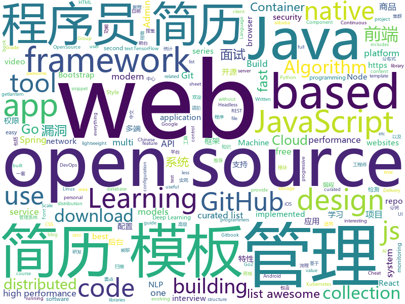

# 2019-02-26
See what the GitHub community is most excited about today.

## python
* [Algorithm_Interview_Notes-Chinese](https://github.com/imhuay/Algorithm_Interview_Notes-Chinese)(**841 stars today**): 2018/2019/校招/春招/秋招/算法/机器学习(Machine Learning)/深度学习(Deep Learning)/自然语言处理(NLP)/C/C++/Python/面试笔记
* [K8tools](https://github.com/k8gege/K8tools)(**240 stars today**): K8工具(内网渗透/提权工具/远程溢出/漏洞利用/Exploit/APT/0day/Shellcode/Payload/priviledge/OverFlow/WebShell/PenTest)
* [faceswap](https://github.com/deepfakes/faceswap)(**237 stars today**): Non official project based on original /r/Deepfakes thread. Many thanks to him!
* [subsync](https://github.com/smacke/subsync)(**231 stars today**): Automagically synchronize subtitles with video.
* [SC-FEGAN](https://github.com/JoYoungjoo/SC-FEGAN)(**151 stars today**): SC-FEGAN : Face Editing Generative Adversarial Network with User's Sketch and Color
* [ludwig](https://github.com/uber/ludwig)(**85 stars today**): Ludwig is a toolbox built on top of TensorFlow that allows to train and test deep learning models without the need to write code.
* [gpt-2](https://github.com/openai/gpt-2)(**81 stars today**): Code for the paper "Language Models are Unsupervised Multitask Learners"
* [HelloGitHub](https://github.com/521xueweihan/HelloGitHub)(**82 stars today**): 分享 GitHub 上有趣、入门级的开源项目，帮你找到编程的乐趣。欢迎推荐、自荐项目，让更多人知道你的项目⭐️
* [models](https://github.com/tensorflow/models)(**61 stars today**): Models and examples built with TensorFlow
* [algo](https://github.com/trailofbits/algo)(**78 stars today**): Set up a personal IPSEC VPN in the cloud
* [public-apis](https://github.com/toddmotto/public-apis)(**72 stars today**): A collective list of free APIs for use in software and web development.
* [awesome-python](https://github.com/vinta/awesome-python)(**64 stars today**): A curated list of awesome Python frameworks, libraries, software and resources
* [system-design-primer](https://github.com/donnemartin/system-design-primer)(**62 stars today**): Learn how to design large-scale systems. Prep for the system design interview. Includes Anki flashcards.
* [entendrepreneur-web](https://github.com/jonadsimon/entendrepreneur-web)(**63 stars today**): web app for generating funny portmanteaus and rhymes
* [lingvo](https://github.com/tensorflow/lingvo)(**58 stars today**): Lingvo
* [Python](https://github.com/TheAlgorithms/Python)(**54 stars today**): All Algorithms implemented in Python
* [owoScript](https://github.com/ThePlasmaRailgun/owoScript)(**59 stars today**): An OwO based, stack-oriented programming language
* [CheatSheetSeries](https://github.com/OWASP/CheatSheetSeries)(**50 stars today**): The OWASP Cheat Sheet Series was created to provide a concise collection of high value information on specific application security topics.
* [bert_ner](https://github.com/Kyubyong/bert_ner)(**48 stars today**): Feature Based Ner with Bert
* [bert](https://github.com/google-research/bert)(**38 stars today**): TensorFlow code and pre-trained models for BERT
* [youtube-dl](https://github.com/rg3/youtube-dl)(**40 stars today**): Command-line program to download videos from YouTube.com and other video sites
* [federated](https://github.com/tensorflow/federated)(**43 stars today**): A framework for implementing federated learning
* [awesome-algorithm](https://github.com/apachecn/awesome-algorithm)(**37 stars today**): LeetCode, HackRank, 剑指offer, classic algorithm implementation
* [keras](https://github.com/keras-team/keras)(**36 stars today**): Deep Learning for humans
* [mindsdb](https://github.com/mindsdb/mindsdb)(**39 stars today**): Framework to streamline use of neural networks

## java
* [JavaGuide](https://github.com/Snailclimb/JavaGuide)(**225 stars today**): 【Java学习+面试指南】 一份涵盖大部分Java程序员所需要掌握的核心知识。
* [advanced-java](https://github.com/doocs/advanced-java)(**123 stars today**): 😮互联网 Java 工程师进阶知识完全扫盲
* [NeroParser](https://github.com/yaoguangluo/NeroParser)(**98 stars today**): ⚡️20,000/ms Parser NLP POS AI Chinese emotion words from complex sentence /每秒高达2700万混合分词， 高精准确率，支持病句分析，词性，词频统计，自由扩充词库的快速神经网络中文带情感分词包.
* [DoraemonKit](https://github.com/didi/DoraemonKit)(**98 stars today**): 简称 "DoKit" 。一款功能齐全的客户端（ iOS 、Android ）研发助手，你值得拥有。
* [mall](https://github.com/macrozheng/mall)(**70 stars today**): mall项目是一套电商系统，包括前台商城系统及后台管理系统，基于SpringBoot+MyBatis实现。 前台商城系统包含首页门户、商品推荐、商品搜索、商品展示、购物车、订单流程、会员中心、客户服务、帮助中心等模块。 后台管理系统包含商品管理、订单管理、会员管理、促销管理、运营管理、内容管理、统计报表、财务管理、权限管理、设置等模块。
* [cim](https://github.com/crossoverJie/cim)(**62 stars today**): 📲cim(cross IM) 适用于开发者的即时通讯系统
* [concurrency-limits](https://github.com/Netflix/concurrency-limits)(**59 stars today**): 
* [spring-boot](https://github.com/spring-projects/spring-boot)(**49 stars today**): Spring Boot
* [fisher](https://github.com/fanxinglong/fisher)(**56 stars today**): 基于Spring cloud alibaba,oauth2和Element-UI-Admin的后台权限管理框架
* [fescar](https://github.com/alibaba/fescar)(**51 stars today**): 🔥Fescar is an easy-to-use, high-performance, java based, open source distributed transaction solution.
* [redis-manager](https://github.com/ngbdf/redis-manager)(**47 stars today**): Redis 一站式管理平台，支持集群创建、管理、监控、报警
* [tutorials](https://github.com/eugenp/tutorials)(**34 stars today**): The "REST With Spring" Course:
* [jadx](https://github.com/skylot/jadx)(**45 stars today**): Dex to Java decompiler
* [Java](https://github.com/TheAlgorithms/Java)(**39 stars today**): All Algorithms implemented in Java
* [spring-framework](https://github.com/spring-projects/spring-framework)(**30 stars today**): Spring Framework
* [incubator-dubbo](https://github.com/apache/incubator-dubbo)(**30 stars today**): Apache Dubbo (incubating) is a high-performance, java based, open source RPC framework.
* [corretto-8](https://github.com/corretto/corretto-8)(**34 stars today**): Amazon Corretto 8 is a no-cost, multi-platform, production-ready distribution of OpenJDK 8
* [apollo](https://github.com/ctripcorp/apollo)(**33 stars today**): Apollo（阿波罗）是携程框架部门研发的分布式配置中心，能够集中化管理应用不同环境、不同集群的配置，配置修改后能够实时推送到应用端，并且具备规范的权限、流程治理等特性，适用于微服务配置管理场景。
* [elasticsearch](https://github.com/elastic/elasticsearch)(**31 stars today**): Open Source, Distributed, RESTful Search Engine
* [arthas](https://github.com/alibaba/arthas)(**32 stars today**): Alibaba Java Diagnostic Tool Arthas/Alibaba Java诊断利器Arthas
* [rocketmq](https://github.com/apache/rocketmq)(**24 stars today**): Mirror of Apache RocketMQ
* [SpringCloudLearning](https://github.com/forezp/SpringCloudLearning)(**27 stars today**): 《史上最简单的Spring Cloud教程源码》
* [nacos](https://github.com/alibaba/nacos)(**28 stars today**): an easy-to-use dynamic service discovery, configuration and service management platform for building cloud native applications.
* [incubator-skywalking](https://github.com/apache/incubator-skywalking)(**28 stars today**): A distributed tracing system, and APM ( Application Performance Monitoring )
* [Sentinel](https://github.com/alibaba/Sentinel)(**25 stars today**): A lightweight powerful flow control component enabling reliability and monitoring for microservices. (轻量级的流量控制、熔断降级 Java 库)

## unknown
* [Micro8](https://github.com/Micropoor/Micro8)(**486 stars today**): Gitbook
* [the-book-of-secret-knowledge](https://github.com/trimstray/the-book-of-secret-knowledge)(**265 stars today**): ⭐️A collection of inspiring lists, manuals, cheatsheets, blogs, hacks, one-liners, cli/web tools and more.
* [Daily-Interview-Question](https://github.com/Advanced-Frontend/Daily-Interview-Question)(**210 stars today**): 工作日每天一道前端大厂面试题，祝大家天天进步，一年后会看到不一样的自己。
* [How-To-Secure-A-Linux-Server](https://github.com/imthenachoman/How-To-Secure-A-Linux-Server)(**210 stars today**): An evolving how-to guide for securing a Linux server.
* [CS-Notes](https://github.com/CyC2018/CS-Notes)(**181 stars today**): 😋技术面试必备基础知识
* [Awesome-Design-Tools](https://github.com/LisaDziuba/Awesome-Design-Tools)(**191 stars today**): The best design tools for everything.
* [awesome-lite-websites](https://github.com/mdibaiee/awesome-lite-websites)(**193 stars today**): A list of awesome lightweight websites without all the bloat
* [Xiaomi_Kernel_OpenSource](https://github.com/MiCode/Xiaomi_Kernel_OpenSource)(**165 stars today**): Xiaomi Mobile Phone Kernel OpenSource
* [how-to-learn-robotics](https://github.com/qqfly/how-to-learn-robotics)(**157 stars today**): 开源机器人学学习指南
* [awesome-design-systems](https://github.com/alexpate/awesome-design-systems)(**127 stars today**): 💅🏻⚒A collection of awesome design systems
* [MiBox_Kernel_OpenSource](https://github.com/MiCode/MiBox_Kernel_OpenSource)(**79 stars today**): kernel opensource for MiBox
* [awesome](https://github.com/sindresorhus/awesome)(**83 stars today**): 😎Awesome lists about all kinds of interesting topics
* [You-Dont-Know-JS](https://github.com/getify/You-Dont-Know-JS)(**80 stars today**): A book series on JavaScript. @YDKJS on twitter.
* [blog](https://github.com/yygmind/blog)(**81 stars today**): 我是木易杨，网易高级前端工程师，跟着我每周重点攻克一个前端面试重难点。接下来让我带你走进高级前端的世界，在进阶的路上，共勉！
* [free-programming-books-zh_CN](https://github.com/justjavac/free-programming-books-zh_CN)(**65 stars today**): 📚免费的计算机编程类中文书籍，欢迎投稿
* [gitignore](https://github.com/github/gitignore)(**49 stars today**): A collection of useful .gitignore templates
* [nginx-quick-reference](https://github.com/trimstray/nginx-quick-reference)(**65 stars today**): ⚡️These notes describes how to improve Nginx performance, security and other important things; @ssllabs A+ 100%.
* [javascript-tips-and-tidbits](https://github.com/nas5w/javascript-tips-and-tidbits)(**59 stars today**): A continuously-evolving compendium of javascript tips based on common areas of confusion or misunderstanding.
* [deep-learning-drizzle](https://github.com/kmario23/deep-learning-drizzle)(**48 stars today**): Drench yourself in Deep Learning, Reinforcement Learning, Machine Learning, Computer Vision, and NLP by learning from these exciting lectures!!
* [CS-Interview-Knowledge-Map](https://github.com/InterviewMap/CS-Interview-Knowledge-Map)(**49 stars today**): Build the best interview map. The current content includes JS, network, browser related, performance optimization, security, framework, Git, data structure, algorithm, etc.
* [free-programming-books](https://github.com/EbookFoundation/free-programming-books)(**45 stars today**): 📚Freely available programming books
* [AspNetCore-Developer-Roadmap](https://github.com/MoienTajik/AspNetCore-Developer-Roadmap)(**47 stars today**): Roadmap to becoming an ASP.NET Core developer in 2019
* [awesome-falsehood](https://github.com/kdeldycke/awesome-falsehood)(**46 stars today**): 💊Curated list of falsehoods programmers believe in.
* [FlutterExamples](https://github.com/TakeoffAndroid/FlutterExamples)(**44 stars today**): An ultimate cheatbook of curated designs
* [ResumeSample](https://github.com/geekcompany/ResumeSample)(**37 stars today**): Resume template for Chinese programmers . 程序员简历模板系列。包括PHP程序员简历模板、iOS程序员简历模板、Android程序员简历模板、Web前端程序员简历模板、Java程序员简历模板、C/C++程序员简历模板、NodeJS程序员简历模板、架构师简历模板以及通用程序员简历模板

## javascript
* [cleave.js](https://github.com/nosir/cleave.js)(**842 stars today**): Format input text content when you are typing...
* [nsfwjs](https://github.com/infinitered/nsfwjs)(**455 stars today**): NSFW detection on the client-side via Tensorflow JS
* [Motrix](https://github.com/agalwood/Motrix)(**355 stars today**): A full-featured download manager.
* [codecrumbs](https://github.com/Bogdan-Lyashenko/codecrumbs)(**213 stars today**): Learn, design or document codebase by putting breadcrumbs in source code. Live updates, multi-language support, and easy sharing.
* [chameleon](https://github.com/didi/chameleon)(**202 stars today**): 🦎一套代码运行多端，一端所见即多端所见
* [video-maker](https://github.com/filipedeschamps/video-maker)(**152 stars today**): Projeto open source para fazer vídeos automatizados
* [vue](https://github.com/vuejs/vue)(**141 stars today**): 🖖Vue.js is a progressive, incrementally-adoptable JavaScript framework for building UI on the web.
* [react](https://github.com/facebook/react)(**96 stars today**): A declarative, efficient, and flexible JavaScript library for building user interfaces.
* [git-history](https://github.com/pomber/git-history)(**101 stars today**): Quickly browse the history of a file from any git repository
* [nodeppt](https://github.com/ksky521/nodeppt)(**100 stars today**): This is probably the best web presentation tool so far!
* [taro](https://github.com/NervJS/taro)(**91 stars today**): 多端统一开发框架，支持用 React 的开发方式编写一次代码，生成能运行在微信/百度/支付宝/字节跳动小程序、H5、React Native 等的应用。 https://taro.js.org/
* [Gitter](https://github.com/huangjianke/Gitter)(**89 stars today**): Gitter for GitHub - 可能是目前颜值最高的GitHub小程序客户端
* [leon](https://github.com/leon-ai/leon)(**77 stars today**): 🧠 Leon is your open-source personal assistant.
* [applause-button](https://github.com/ColinEberhardt/applause-button)(**75 stars today**): A zero-configuration medium-style button for adding applause / claps / kudos to web pages and blog posts
* [berry](https://github.com/yarnpkg/berry)(**73 stars today**): 📦🐈A modern, fast, reliable, package manager; part of the Yarn organization
* [javascript-algorithms](https://github.com/trekhleb/javascript-algorithms)(**63 stars today**): 📝Algorithms and data structures implemented in JavaScript with explanations and links to further readings
* [json-server](https://github.com/typicode/json-server)(**65 stars today**): Get a full fake REST API with zero coding in less than 30 seconds (seriously)
* [create-react-app](https://github.com/facebook/create-react-app)(**58 stars today**): Set up a modern web app by running one command.
* [30-seconds-of-code](https://github.com/30-seconds/30-seconds-of-code)(**63 stars today**): Curated collection of useful JavaScript snippets that you can understand in 30 seconds or less.
* [react-native](https://github.com/facebook/react-native)(**56 stars today**): A framework for building native apps with React.
* [puppeteer](https://github.com/GoogleChrome/puppeteer)(**58 stars today**): Headless Chrome Node API
* [strapi](https://github.com/strapi/strapi)(**59 stars today**): 🚀Open source Node.js Headless CMS to easily build customisable APIs
* [axios](https://github.com/axios/axios)(**57 stars today**): Promise based HTTP client for the browser and node.js
* [gatsby](https://github.com/gatsbyjs/gatsby)(**48 stars today**): Build blazing fast, modern apps and websites with React
* [uppy](https://github.com/transloadit/uppy)(**54 stars today**): The next open source file uploader for web browsers🐶

## html
* [awesome-IT-films](https://github.com/greybax/awesome-IT-films)(**62 stars today**): 📺A curated list of awesome films about IT & geek people.
* [training-kit](https://github.com/github/training-kit)(**6 stars today**): Open source on demand courses and cheat sheets for Git and GitHub
* [googlefonts-font-display-helper](https://github.com/iamakulov/googlefonts-font-display-helper)(**46 stars today**): A snippet generator to speed up Google Fonts rendering with font-display
* [AdminLTE](https://github.com/almasaeed2010/AdminLTE)(**28 stars today**): AdminLTE - Free Premium Admin control Panel Theme Based On Bootstrap 3.x
* [stisla](https://github.com/stisla/stisla)(**27 stars today**): Free Bootstrap Admin Template
* [Front-end-Developer-Interview-Questions](https://github.com/h5bp/Front-end-Developer-Interview-Questions)(**21 stars today**): A list of helpful front-end related questions you can use to interview potential candidates, test yourself or completely ignore.
* [WDScanner](https://github.com/TideSec/WDScanner)(**17 stars today**): WDScanner平台目前实现了如下功能：分布式web漏洞扫描、客户管理、漏洞定期扫描、网站爬虫、暗链检测、坏链检测、网站指纹搜集、专项漏洞检测、代理搜集及部署、密码定向破解、社工库查询等功能。
* [ionic](https://github.com/ionic-team/ionic)(**15 stars today**): Build amazing native and progressive web apps with open web technologies. One app running on everything🎉
* [styleguide](https://github.com/google/styleguide)(**14 stars today**): Style guides for Google-originated open-source projects
* [zju-icicles](https://github.com/QSCTech/zju-icicles)(**15 stars today**): 浙江大学课程攻略共享计划
* [JavaScript30](https://github.com/wesbos/JavaScript30)(**8 stars today**): 30 Day Vanilla JS Challenge
* [javascript-tutorial-en](https://github.com/iliakan/javascript-tutorial-en)(**16 stars today**): Modern JavaScript Tutorial
* [fastText](https://github.com/facebookresearch/fastText)(**13 stars today**): Library for fast text representation and classification.
* [Spoon-Knife](https://github.com/octocat/Spoon-Knife)(****): This repo is for demonstration purposes only.
* [free-for-dev](https://github.com/ripienaar/free-for-dev)(**14 stars today**): A list of SaaS, PaaS and IaaS offerings that have free tiers of interest to devops and infradev
* [flutter-in-action](https://github.com/flutterchina/flutter-in-action)(**13 stars today**): 《Flutter实战》电子书
* [coreui-free-bootstrap-admin-template](https://github.com/coreui/coreui-free-bootstrap-admin-template)(**13 stars today**): CoreUI is free bootstrap admin template
* [learning-area](https://github.com/mdn/learning-area)(**7 stars today**): Github repo for the MDN Learning Area.
* [Micro8-Gitbook](https://github.com/maskhed/Micro8-Gitbook)(**12 stars today**): Micro8 Gitbook(Backup), New Repo:
* [csswg-drafts](https://github.com/w3c/csswg-drafts)(**11 stars today**): CSS Working Group Editor Drafts
* [ai-deadlines](https://github.com/abhshkdz/ai-deadlines)(**11 stars today**): ⏰AI conference deadline countdowns
* [all-contributors](https://github.com/all-contributors/all-contributors)(**9 stars today**): ✨Recognize all contributors, not just the ones who push code✨
* [dragon-book-exercise-answers](https://github.com/fool2fish/dragon-book-exercise-answers)(**10 stars today**): Compilers Principles, Techniques, & Tools (purple dragon book) second edition exercise answers. 编译原理（紫龙书）第2版习题答案。
* [requests-html](https://github.com/kennethreitz/requests-html)(**9 stars today**): Pythonic HTML Parsing for Humans™
* [material-design-lite](https://github.com/google/material-design-lite)(****): Material Design Components in HTML/CSS/JS

## go
* [cds](https://github.com/ovh/cds)(**255 stars today**): Enterprise-Grade Continuous Delivery & DevOps Automation Open Source Platform
* [k9s](https://github.com/derailed/k9s)(**123 stars today**): 🐶Kubernetes CLI To Manage Your Clusters In Style!
* [inlets](https://github.com/alexellis/inlets)(**81 stars today**): Expose your local endpoints to the Internet
* [go](https://github.com/golang/go)(**63 stars today**): The Go programming language
* [kubernetes](https://github.com/kubernetes/kubernetes)(**55 stars today**): Production-Grade Container Scheduling and Management
* [sish](https://github.com/antoniomika/sish)(**63 stars today**): An open source serveo/ngrok alternative. HTTP(S)/WS(S)/TCP Tunnels to localhost using only SSH.
* [talos](https://github.com/autonomy/talos)(**55 stars today**): A modern Linux distribution for Kubernetes.
* [footloose](https://github.com/dlespiau/footloose)(**54 stars today**): Container Machines - Containers that look like Virtual Machines
* [aresdb](https://github.com/uber/aresdb)(**53 stars today**): A GPU-powered real-time analytics storage and query engine.
* [space-cloud](https://github.com/spaceuptech/space-cloud)(**46 stars today**): Space Cloud is an open source, high performance web service which provides instant Realtime APIs on the database of your choice. Build Internet Scale apps with the agility of a prototype!
* [awesome-go](https://github.com/avelino/awesome-go)(**43 stars today**): A curated list of awesome Go frameworks, libraries and software
* [go2-book](https://github.com/chai2010/go2-book)(**42 stars today**): 📚《Go2编程指南》开源图书，重点讲解Go2新特性，以及Go1教程中较少涉及的特性
* [dgraph](https://github.com/dgraph-io/dgraph)(**39 stars today**): Fast, Distributed Graph DB
* [dragonboat](https://github.com/lni/dragonboat)(**40 stars today**): A feature complete and high performance multi-group Raft library in Go.
* [go-tagexpr](https://github.com/bytedance/go-tagexpr)(**39 stars today**): An interesting go struct tag expression syntax for field validation, etc.
* [hugo](https://github.com/gohugoio/hugo)(**37 stars today**): The world’s fastest framework for building websites.
* [lantern](https://github.com/getlantern/lantern)(**34 stars today**): 🔴蓝灯最新版本下载 https://github.com/getlantern/download🔴Lantern Latest Download https://github.com/getlantern/download🔴
* [prometheus](https://github.com/prometheus/prometheus)(**33 stars today**): The Prometheus monitoring system and time series database.
* [coredns](https://github.com/coredns/coredns)(**28 stars today**): CoreDNS is a DNS server that chains plugins
* [ludo](https://github.com/libretro/ludo)(**32 stars today**): A libretro frontend written in golang
* [Venom](https://github.com/Dliv3/Venom)(**30 stars today**): Venom - A Multi-hop Proxy for Penetration Testers Written in Go
* [aran](https://github.com/sch00lb0y/aran)(**29 stars today**): Key Value storage based on Ranged LSM tree
* [emitter](https://github.com/emitter-io/emitter)(**28 stars today**): High performance, distributed and low latency publish-subscribe platform.
* [drone](https://github.com/drone/drone)(**27 stars today**): Drone is a Container-Native, Continuous Delivery Platform
* [gitea](https://github.com/go-gitea/gitea)(**27 stars today**): Git with a cup of tea, painless self-hosted git service

## WordCloud

