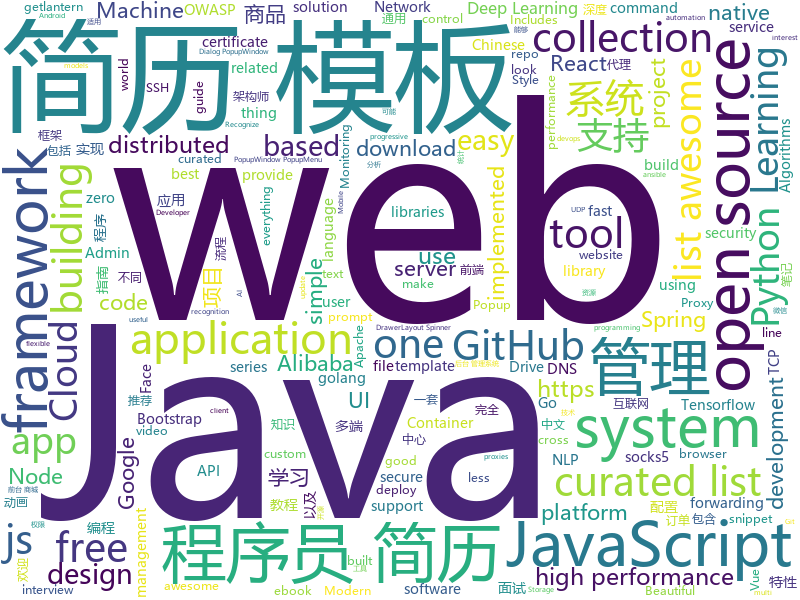

# 2019-02-27
See what the GitHub community is most excited about today.

## python
* [subsync](https://github.com/smacke/subsync)(**1,290 stars today**): Automagically synchronize subtitles with video.
* [zero](https://github.com/remoteinterview/zero)(**1,107 stars today**): Zero is a web server to simplify web development.
* [Algorithm_Interview_Notes-Chinese](https://github.com/imhuay/Algorithm_Interview_Notes-Chinese)(**765 stars today**): 2018/2019/校招/春招/秋招/算法/机器学习(Machine Learning)/深度学习(Deep Learning)/自然语言处理(NLP)/C/C++/Python/面试笔记
* [bullet](https://github.com/Mckinsey666/bullet)(**737 stars today**): 🚅Beautiful Python prompts made simple. Build a prompt like stacking blocks.
* [AdaBound](https://github.com/Luolc/AdaBound)(**570 stars today**): An optimizer that trains as fast as Adam and as good as SGD.
* [faceswap](https://github.com/deepfakes/faceswap)(**363 stars today**): Non official project based on original /r/Deepfakes thread. Many thanks to him!
* [lingvo](https://github.com/tensorflow/lingvo)(**290 stars today**): Lingvo
* [gpt-2](https://github.com/openai/gpt-2)(**130 stars today**): Code for the paper "Language Models are Unsupervised Multitask Learners"
* [face.evoLVe.PyTorch](https://github.com/ZhaoJ9014/face.evoLVe.PyTorch)(**110 stars today**): 🔥🔥High-Performance Face Recognition Library on PyTorch🔥🔥
* [public-apis](https://github.com/toddmotto/public-apis)(**106 stars today**): A collective list of free APIs for use in software and web development.
* [Tensorflow-Cookbook](https://github.com/taki0112/Tensorflow-Cookbook)(**88 stars today**): Simple Tensorflow Cookbook for easy-to-use
* [models](https://github.com/tensorflow/models)(**71 stars today**): Models and examples built with TensorFlow
* [DeepFaceLab](https://github.com/iperov/DeepFaceLab)(**75 stars today**): DeepFaceLab is a tool that utilizes deep learning to recognize and swap faces in pictures and videos. Includes prebuilt ready to work standalone Windows 7,8,10 binary (look readme.md).
* [SC-FEGAN](https://github.com/JoYoungjoo/SC-FEGAN)(**73 stars today**): SC-FEGAN : Face Editing Generative Adversarial Network with User's Sketch and Color
* [awesome-python-applications](https://github.com/mahmoud/awesome-python-applications)(**69 stars today**): 💿Free software that works great, and also happens to be open-source Python.
* [awesome-python](https://github.com/vinta/awesome-python)(**69 stars today**): A curated list of awesome Python frameworks, libraries, software and resources
* [system-design-primer](https://github.com/donnemartin/system-design-primer)(**65 stars today**): Learn how to design large-scale systems. Prep for the system design interview. Includes Anki flashcards.
* [Python](https://github.com/TheAlgorithms/Python)(**48 stars today**): All Algorithms implemented in Python
* [K8tools](https://github.com/k8gege/K8tools)(**48 stars today**): K8工具(内网渗透/提权工具/远程溢出/漏洞利用/Exploit/APT/0day/Shellcode/Payload/priviledge/OverFlow/WebShell/PenTest)
* [CheatSheetSeries](https://github.com/OWASP/CheatSheetSeries)(**52 stars today**): The OWASP Cheat Sheet Series was created to provide a concise collection of high value information on specific application security topics.
* [bert](https://github.com/google-research/bert)(**44 stars today**): TensorFlow code and pre-trained models for BERT
* [HelloGitHub](https://github.com/521xueweihan/HelloGitHub)(**42 stars today**): 分享 GitHub 上有趣、入门级的开源项目，帮你找到编程的乐趣。欢迎推荐、自荐项目，让更多人知道你的项目⭐️
* [keras](https://github.com/keras-team/keras)(**37 stars today**): Deep Learning for humans
* [ansible](https://github.com/ansible/ansible)(**35 stars today**): Ansible is a radically simple IT automation platform that makes your applications and systems easier to deploy. Avoid writing scripts or custom code to deploy and update your applications — automate in a language that approaches plain English, using SSH, with no agents to install on remote systems. https://docs.ansible.com/ansible/
* [face_recognition](https://github.com/ageitgey/face_recognition)(**39 stars today**): The world's simplest facial recognition api for Python and the command line

## java
* [JavaGuide](https://github.com/Snailclimb/JavaGuide)(**269 stars today**): 【Java学习+面试指南】 一份涵盖大部分Java程序员所需要掌握的核心知识。
* [XPopup](https://github.com/li-xiaojun/XPopup)(**190 stars today**): 🔥功能强大，UI简洁，交互优雅的通用弹窗！可以替代Dialog，PopupWindow，PopupMenu，BottomSheet，DrawerLayout，Spinner等组件，自带十几种效果良好的动画， 支持完全的UI和动画自定义！(Powerful and Beautiful Popup，can absolutely replace Dialog，PopupWindow，PopupMenu，BottomSheet，DrawerLayout，Spinner. With built-in animators , very easy to custom Popup View.)
* [advanced-java](https://github.com/doocs/advanced-java)(**130 stars today**): 😮互联网 Java 工程师进阶知识完全扫盲
* [DoraemonKit](https://github.com/didi/DoraemonKit)(**120 stars today**): 简称 "DoKit" 。一款功能齐全的客户端（ iOS 、Android ）研发助手，你值得拥有。
* [mall](https://github.com/macrozheng/mall)(**79 stars today**): mall项目是一套电商系统，包括前台商城系统及后台管理系统，基于SpringBoot+MyBatis实现。 前台商城系统包含首页门户、商品推荐、商品搜索、商品展示、购物车、订单流程、会员中心、客户服务、帮助中心等模块。 后台管理系统包含商品管理、订单管理、会员管理、促销管理、运营管理、内容管理、统计报表、财务管理、权限管理、设置等模块。
* [tutorials](https://github.com/eugenp/tutorials)(**58 stars today**): The "REST With Spring" Course:
* [spring-boot](https://github.com/spring-projects/spring-boot)(**58 stars today**): Spring Boot
* [fescar](https://github.com/alibaba/fescar)(**59 stars today**): 🔥Fescar is an easy-to-use, high-performance, java based, open source distributed transaction solution.
* [spring-framework](https://github.com/spring-projects/spring-framework)(**44 stars today**): Spring Framework
* [nacos](https://github.com/alibaba/nacos)(**52 stars today**): an easy-to-use dynamic service discovery, configuration and service management platform for building cloud native applications.
* [arthas](https://github.com/alibaba/arthas)(**51 stars today**): Alibaba Java Diagnostic Tool Arthas/Alibaba Java诊断利器Arthas
* [Java](https://github.com/TheAlgorithms/Java)(**45 stars today**): All Algorithms implemented in Java
* [spring-cloud-alibaba](https://github.com/spring-cloud-incubator/spring-cloud-alibaba)(**47 stars today**): Spring Cloud Alibaba provides a one-stop solution for application development for the distributed solutions of Alibaba middleware.
* [SpringCloudLearning](https://github.com/forezp/SpringCloudLearning)(**41 stars today**): 《史上最简单的Spring Cloud教程源码》
* [elasticsearch](https://github.com/elastic/elasticsearch)(**44 stars today**): Open Source, Distributed, RESTful Search Engine
* [guava](https://github.com/google/guava)(**45 stars today**): Google core libraries for Java
* [miaosha](https://github.com/qiurunze123/miaosha)(**46 stars today**): ⭐⭐⭐⭐秒杀系统设计与实现.互联网工程师进阶与分析🙋🐓
* [incubator-skywalking](https://github.com/apache/incubator-skywalking)(**43 stars today**): A distributed tracing system, and APM ( Application Performance Monitoring )
* [incubator-dubbo](https://github.com/apache/incubator-dubbo)(**37 stars today**): Apache Dubbo (incubating) is a high-performance, java based, open source RPC framework.
* [NeroParser](https://github.com/yaoguangluo/NeroParser)(**43 stars today**): ⚡️20,000/ms Parser NLP POS AI Chinese emotion & words segmentation from complex sentence /每秒高达2700万中文混合分词， 高精准确率，支持病句分析，词性，词频统计，自由扩充词库的快速神经网络带情感分词包.
* [halo](https://github.com/ruibaby/halo)(**40 stars today**): Halo可能是最好的Java博客系统😉
* [JGrowing](https://github.com/javagrowing/JGrowing)(**41 stars today**): Java is Growing up but not only Java。Java成长路线，但学到不仅仅是Java。
* [apollo](https://github.com/ctripcorp/apollo)(**32 stars today**): Apollo（阿波罗）是携程框架部门研发的分布式配置中心，能够集中化管理应用不同环境、不同集群的配置，配置修改后能够实时推送到应用端，并且具备规范的权限、流程治理等特性，适用于微服务配置管理场景。
* [cim](https://github.com/crossoverJie/cim)(**30 stars today**): 📲cim(cross IM) 适用于开发者的即时通讯系统
* [rocketmq](https://github.com/apache/rocketmq)(**22 stars today**): Mirror of Apache RocketMQ

## unknown
* [Awesome-Design-Tools](https://github.com/LisaDziuba/Awesome-Design-Tools)(**546 stars today**): The best design tools for everything.
* [Awesome-WAF](https://github.com/0xInfection/Awesome-WAF)(**434 stars today**): 🔥A curated list of awesome web-app firewall (WAF) stuff.
* [Micro8](https://github.com/Micropoor/Micro8)(**313 stars today**): Gitbook
* [Nodejs-Developer-Roadmap](https://github.com/aliyr/Nodejs-Developer-Roadmap)(**260 stars today**): A Developer Roadmap to becoming a Node.js developer in 2019
* [Daily-Interview-Question](https://github.com/Advanced-Frontend/Daily-Interview-Question)(**216 stars today**): 工作日每天一道前端大厂面试题，祝大家天天进步，一年后会看到不一样的自己。
* [CS-Notes](https://github.com/CyC2018/CS-Notes)(**184 stars today**): 😋技术面试必备基础知识
* [the-book-of-secret-knowledge](https://github.com/trimstray/the-book-of-secret-knowledge)(**172 stars today**): ⭐️A collection of inspiring lists, manuals, cheatsheets, blogs, hacks, one-liners, cli/web tools and more.
* [awesome-css-learning](https://github.com/micromata/awesome-css-learning)(**161 stars today**): A tiny list limited to the best CSS Learning Resources
* [ShadowsocksBio](https://github.com/JadaGates/ShadowsocksBio)(**147 stars today**): 记录一下SS的前世今生，以及一个简单的教程总结
* [deep-learning-drizzle](https://github.com/kmario23/deep-learning-drizzle)(**133 stars today**): Drench yourself in Deep Learning, Reinforcement Learning, Machine Learning, Computer Vision, and NLP by learning from these exciting lectures!!
* [architect-awesome](https://github.com/xingshaocheng/architect-awesome)(**109 stars today**): 后端架构师技术图谱
* [How-To-Secure-A-Linux-Server](https://github.com/imthenachoman/How-To-Secure-A-Linux-Server)(**112 stars today**): An evolving how-to guide for securing a Linux server.
* [gitignore](https://github.com/github/gitignore)(**69 stars today**): A collection of useful .gitignore templates
* [awesome](https://github.com/sindresorhus/awesome)(**81 stars today**): 😎Awesome lists about all kinds of interesting topics
* [You-Dont-Know-JS](https://github.com/getify/You-Dont-Know-JS)(**80 stars today**): A book series on JavaScript. @YDKJS on twitter.
* [OpenAPI-Specification](https://github.com/OAI/OpenAPI-Specification)(**78 stars today**): The OpenAPI Specification Repository
* [awesome-design-systems](https://github.com/alexpate/awesome-design-systems)(**70 stars today**): 💅🏻⚒A collection of awesome design systems
* [free-programming-books-zh_CN](https://github.com/justjavac/free-programming-books-zh_CN)(**55 stars today**): 📚免费的计算机编程类中文书籍，欢迎投稿
* [free-programming-books](https://github.com/EbookFoundation/free-programming-books)(**57 stars today**): 📚Freely available programming books
* [Xiaomi_Kernel_OpenSource](https://github.com/MiCode/Xiaomi_Kernel_OpenSource)(**50 stars today**): Xiaomi Mobile Phone Kernel OpenSource
* [nginx-quick-reference](https://github.com/trimstray/nginx-quick-reference)(**52 stars today**): ⚡️These notes describes how to improve Nginx performance, security and other important things; @ssllabs A+ 100%.
* [ResumeSample](https://github.com/geekcompany/ResumeSample)(**46 stars today**): Resume template for Chinese programmers . 程序员简历模板系列。包括PHP程序员简历模板、iOS程序员简历模板、Android程序员简历模板、Web前端程序员简历模板、Java程序员简历模板、C/C++程序员简历模板、NodeJS程序员简历模板、架构师简历模板以及通用程序员简历模板
* [awesome-vue](https://github.com/vuejs/awesome-vue)(**49 stars today**): 🎉A curated list of awesome things related to Vue.js
* [awesome-wechat-weapp](https://github.com/justjavac/awesome-wechat-weapp)(**46 stars today**): 微信小程序开发资源汇总💯
* [awesome-falsehood](https://github.com/kdeldycke/awesome-falsehood)(**46 stars today**): 💊Curated list of falsehoods programmers believe in.

## javascript
* [cleave.js](https://github.com/nosir/cleave.js)(**403 stars today**): Format input text content when you are typing...
* [react-three-fiber](https://github.com/drcmda/react-three-fiber)(**376 stars today**): 👌React-fiber renderer for THREE.js
* [nsfwjs](https://github.com/infinitered/nsfwjs)(**335 stars today**): NSFW detection on the client-side via Tensorflow JS
* [Motrix](https://github.com/agalwood/Motrix)(**298 stars today**): A full-featured download manager.
* [chameleon](https://github.com/didi/chameleon)(**186 stars today**): 🦎一套代码运行多端，一端所见即多端所见
* [30-seconds-of-code](https://github.com/30-seconds/30-seconds-of-code)(**134 stars today**): Curated collection of useful JavaScript snippets that you can understand in 30 seconds or less.
* [vue](https://github.com/vuejs/vue)(**119 stars today**): 🖖Vue.js is a progressive, incrementally-adoptable JavaScript framework for building UI on the web.
* [filepond](https://github.com/pqina/filepond)(**115 stars today**): 🌊A flexible and fun JavaScript file upload library
* [video-maker](https://github.com/filipedeschamps/video-maker)(**96 stars today**): Projeto open source para fazer vídeos automatizados
* [react-native](https://github.com/facebook/react-native)(**88 stars today**): A framework for building native apps with React.
* [react](https://github.com/facebook/react)(**80 stars today**): A declarative, efficient, and flexible JavaScript library for building user interfaces.
* [ColorUI](https://github.com/weilanwl/ColorUI)(**81 stars today**): 鲜亮的高饱和色彩，专注视觉的小程序组件库
* [taro](https://github.com/NervJS/taro)(**73 stars today**): 多端统一开发框架，支持用 React 的开发方式编写一次代码，生成能运行在微信/百度/支付宝/字节跳动小程序、H5、React Native 等的应用。 https://taro.js.org/
* [Gitter](https://github.com/huangjianke/Gitter)(**71 stars today**): Gitter for GitHub - 可能是目前颜值最高的GitHub小程序客户端
* [puppeteer](https://github.com/GoogleChrome/puppeteer)(**64 stars today**): Headless Chrome Node API
* [git-history](https://github.com/pomber/git-history)(**67 stars today**): Quickly browse the history of a file from any git repository
* [codecrumbs](https://github.com/Bogdan-Lyashenko/codecrumbs)(**66 stars today**): Learn, design or document codebase by putting breadcrumbs in source code. Live updates, multi-language support, and easy sharing.
* [create-react-app](https://github.com/facebook/create-react-app)(**54 stars today**): Set up a modern web app by running one command.
* [leon](https://github.com/leon-ai/leon)(**62 stars today**): 🧠 Leon is your open-source personal assistant.
* [javascript-algorithms](https://github.com/trekhleb/javascript-algorithms)(**58 stars today**): 📝Algorithms and data structures implemented in JavaScript with explanations and links to further readings
* [accessibility-guide](https://github.com/fejes713/accessibility-guide)(**62 stars today**): A curated collection of web accessibility tips, tricks, and best practices
* [htm](https://github.com/developit/htm)(**61 stars today**): Hyperscript Tagged Markup: JSX alternative using standard tagged templates, with compiler support.
* [mapkeep](https://github.com/salvozappa/mapkeep)(**59 stars today**): The map that doesn't track you.
* [axios](https://github.com/axios/axios)(**55 stars today**): Promise based HTTP client for the browser and node.js
* [bootstrap](https://github.com/twbs/bootstrap)(**42 stars today**): The most popular HTML, CSS, and JavaScript framework for developing responsive, mobile first projects on the web.

## html
* [AdminLTE](https://github.com/almasaeed2010/AdminLTE)(**22 stars today**): AdminLTE - Free Premium Admin control Panel Theme Based On Bootstrap 3.x
* [ionic](https://github.com/ionic-team/ionic)(**25 stars today**): Build amazing native and progressive web apps with open web technologies. One app running on everything🎉
* [deeplearning_ai_books](https://github.com/fengdu78/deeplearning_ai_books)(**21 stars today**): deeplearning.ai（吴恩达老师的深度学习课程笔记及资源）
* [Front-end-Developer-Interview-Questions](https://github.com/h5bp/Front-end-Developer-Interview-Questions)(**22 stars today**): A list of helpful front-end related questions you can use to interview potential candidates, test yourself or completely ignore.
* [googlefonts-font-display-helper](https://github.com/iamakulov/googlefonts-font-display-helper)(**23 stars today**): A snippet generator to speed up Google Fonts rendering with font-display
* [JavaScript30](https://github.com/wesbos/JavaScript30)(**15 stars today**): 30 Day Vanilla JS Challenge
* [fastText](https://github.com/facebookresearch/fastText)(**21 stars today**): Library for fast text representation and classification.
* [Spoon-Knife](https://github.com/octocat/Spoon-Knife)(****): This repo is for demonstration purposes only.
* [awesome-IT-films](https://github.com/greybax/awesome-IT-films)(**22 stars today**): 📺A curated list of awesome films about IT & geek people.
* [styleguide](https://github.com/google/styleguide)(**17 stars today**): Style guides for Google-originated open-source projects
* [ecma262](https://github.com/tc39/ecma262)(**17 stars today**): Status, process, and documents for ECMA262
* [patchwork](https://github.com/jlord/patchwork)(****): All the Git-it Workshop completers!
* [flutter-in-action](https://github.com/flutterchina/flutter-in-action)(**15 stars today**): 《Flutter实战》电子书
* [stisla](https://github.com/stisla/stisla)(**13 stars today**): Free Bootstrap Admin Template
* [free-for-dev](https://github.com/ripienaar/free-for-dev)(**13 stars today**): A list of SaaS, PaaS and IaaS offerings that have free tiers of interest to devops and infradev
* [Unshaky](https://github.com/aahung/Unshaky)(**13 stars today**): An attempt to address the "double key press" issue on Apple's butterfly keyboard
* [coreui-free-bootstrap-admin-template](https://github.com/coreui/coreui-free-bootstrap-admin-template)(**12 stars today**): CoreUI is free bootstrap admin template
* [portainer](https://github.com/portainer/portainer)(**12 stars today**): Simple management UI for Docker
* [website](https://github.com/kubernetes/website)(**6 stars today**): Kubernetes website and documentation repo:
* [javascript-tutorial-en](https://github.com/iliakan/javascript-tutorial-en)(**9 stars today**): Modern JavaScript Tutorial
* [all-contributors](https://github.com/all-contributors/all-contributors)(**10 stars today**): ✨Recognize all contributors, not just the ones who push code✨
* [NodeGoat](https://github.com/OWASP/NodeGoat)(****): The OWASP NodeGoat project provides an environment to learn how OWASP Top 10 security risks apply to web applications developed using Node.js and how to effectively address them.
* [fastclick](https://github.com/ftlabs/fastclick)(**8 stars today**): Polyfill to remove click delays on browsers with touch UIs
* [github](https://github.com/phodal/github)(**9 stars today**): GitHub 漫游指南- a Chinese ebook on how to build a good project on Github. Explore the users' behavior. Find some thing interest.
* [EIPs](https://github.com/ethereum/EIPs)(**7 stars today**): The Ethereum Improvement Proposal repository

## go
* [k3s](https://github.com/rancher/k3s)(**381 stars today**): Lightweight Kubernetes. 5 less than k8s.
* [go2-book](https://github.com/chai2010/go2-book)(**134 stars today**): 📚《Go2编程指南》开源图书，重点讲解Go2新特性，以及Go1教程中较少涉及的特性
* [cds](https://github.com/ovh/cds)(**89 stars today**): Enterprise-Grade Continuous Delivery & DevOps Automation Open Source Platform
* [go](https://github.com/golang/go)(**73 stars today**): The Go programming language
* [kubernetes](https://github.com/kubernetes/kubernetes)(**64 stars today**): Production-Grade Container Scheduling and Management
* [inlets](https://github.com/alexellis/inlets)(**52 stars today**): Expose your local endpoints to the Internet
* [awesome-go](https://github.com/avelino/awesome-go)(**49 stars today**): A curated list of awesome Go frameworks, libraries and software
* [Amass](https://github.com/OWASP/Amass)(**48 stars today**): In-depth DNS Enumeration and Network Mapping
* [dgraph](https://github.com/dgraph-io/dgraph)(**46 stars today**): Fast, Distributed Graph DB
* [cli](https://github.com/smallstep/cli)(**43 stars today**): A zero trust swiss army knife for working with X509, OAuth, JWT, OATH OTP, etc.
* [istio](https://github.com/istio/istio)(**36 stars today**): Connect, secure, control, and observe services.
* [hugo](https://github.com/gohugoio/hugo)(**41 stars today**): The world’s fastest framework for building websites.
* [v2ray-core](https://github.com/v2ray/v2ray-core)(**35 stars today**): A platform for building proxies to bypass network restrictions.
* [caddy](https://github.com/mholt/caddy)(**40 stars today**): Fast, cross-platform HTTP/2 web server with automatic HTTPS
* [wal-g](https://github.com/wal-g/wal-g)(**40 stars today**): Archival and Restoration for Postgres
* [mkcert](https://github.com/FiloSottile/mkcert)(**38 stars today**): A simple zero-config tool to make locally trusted development certificates with any names you'd like.
* [dragonboat](https://github.com/lni/dragonboat)(**37 stars today**): A feature complete and high performance multi-group Raft library in Go.
* [footloose](https://github.com/dlespiau/footloose)(**34 stars today**): Container Machines - Containers that look like Virtual Machines
* [rclone](https://github.com/ncw/rclone)(**31 stars today**): "rsync for cloud storage" - Google Drive, Amazon Drive, S3, Dropbox, Backblaze B2, One Drive, Swift, Hubic, Cloudfiles, Google Cloud Storage, Yandex Files
* [certificates](https://github.com/smallstep/certificates)(**32 stars today**): 🛡️An online certificate authority and related tools for secure automated certificate management, so you can use TLS everywhere.
* [build-web-application-with-golang](https://github.com/astaxie/build-web-application-with-golang)(**26 stars today**): A golang ebook intro how to build a web with golang
* [goproxy](https://github.com/snail007/goproxy)(**28 stars today**): Proxy is a high performance HTTP(S), websocket, TCP, UDP,Secure DNS, Socks5 proxy server implemented by golang. Now, it supports chain-style proxies,nat forwarding in different lan,TCP/UDP port forwarding, SSH forwarding.Proxy是golang实现的高性能http,https,websocket,tcp,防污染DNS,socks5代理服务器,支持内网穿透,链式代理,通讯加密,智能HTTP,SOCKS5代理,域名黑白名单,跨平台,KCP协议支持,集成外部API。
* [prometheus](https://github.com/prometheus/prometheus)(**26 stars today**): The Prometheus monitoring system and time series database.
* [lantern](https://github.com/getlantern/lantern)(**26 stars today**): 🔴蓝灯最新版本下载 https://github.com/getlantern/download🔴Lantern Latest Download https://github.com/getlantern/download🔴
* [fzf](https://github.com/junegunn/fzf)(**28 stars today**): 🌸A command-line fuzzy finder

## WordCloud

