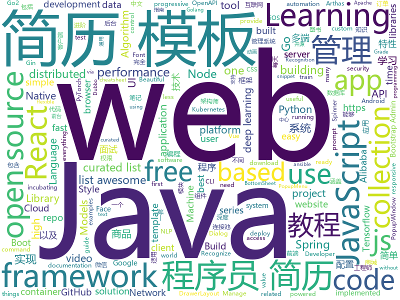

# 2019-02-28
See what the GitHub community is most excited about today.

## python
* [zero](https://github.com/remoteinterview/zero)(**979 stars today**): Zero is a web server to simplify web development.
* [AdaBound](https://github.com/Luolc/AdaBound)(**813 stars today**): An optimizer that trains as fast as Adam and as good as SGD.
* [Algorithm_Interview_Notes-Chinese](https://github.com/imhuay/Algorithm_Interview_Notes-Chinese)(**657 stars today**): 2018/2019/校招/春招/秋招/算法/机器学习(Machine Learning)/深度学习(Deep Learning)/自然语言处理(NLP)/C/C++/Python/面试笔记
* [subsync](https://github.com/smacke/subsync)(**510 stars today**): Automagically synchronize subtitles with video.
* [faceswap](https://github.com/deepfakes/faceswap)(**391 stars today**): Non official project based on original /r/Deepfakes thread. Many thanks to him!
* [bullet](https://github.com/Mckinsey666/bullet)(**363 stars today**): 🚅Beautiful Python prompts made simple. Build a prompt like stacking blocks.
* [lingvo](https://github.com/tensorflow/lingvo)(**197 stars today**): Lingvo
* [Tensorflow-Cookbook](https://github.com/taki0112/Tensorflow-Cookbook)(**164 stars today**): Simple Tensorflow Cookbook for easy-to-use
* [face.evoLVe.PyTorch](https://github.com/ZhaoJ9014/face.evoLVe.PyTorch)(**128 stars today**): 🔥🔥High-Performance Face Recognition Library on PyTorch🔥🔥
* [DeepFaceLab](https://github.com/iperov/DeepFaceLab)(**90 stars today**): DeepFaceLab is a tool that utilizes deep learning to recognize and swap faces in pictures and videos. Includes prebuilt ready to work standalone Windows 7,8,10 binary (look readme.md).
* [gpt-2](https://github.com/openai/gpt-2)(**91 stars today**): Code for the paper "Language Models are Unsupervised Multitask Learners"
* [models](https://github.com/tensorflow/models)(**72 stars today**): Models and examples built with TensorFlow
* [public-apis](https://github.com/toddmotto/public-apis)(**72 stars today**): A collective list of free APIs for use in software and web development.
* [awesome-python](https://github.com/vinta/awesome-python)(**69 stars today**): A curated list of awesome Python frameworks, libraries, software and resources
* [SC-FEGAN](https://github.com/JoYoungjoo/SC-FEGAN)(**65 stars today**): SC-FEGAN : Face Editing Generative Adversarial Network with User's Sketch and Color
* [datasets](https://github.com/tensorflow/datasets)(**63 stars today**): A collection of datasets ready to use with TensorFlow
* [CheatSheetSeries](https://github.com/OWASP/CheatSheetSeries)(**58 stars today**): The OWASP Cheat Sheet Series was created to provide a concise collection of high value information on specific application security topics.
* [claf](https://github.com/naver/claf)(**59 stars today**): CLaF: Clova Language Framework
* [Python](https://github.com/TheAlgorithms/Python)(**47 stars today**): All Algorithms implemented in Python
* [bert](https://github.com/google-research/bert)(**47 stars today**): TensorFlow code and pre-trained models for BERT
* [face_recognition](https://github.com/ageitgey/face_recognition)(**49 stars today**): The world's simplest facial recognition api for Python and the command line
* [youtube-dl](https://github.com/rg3/youtube-dl)(**44 stars today**): Command-line program to download videos from YouTube.com and other video sites
* [ludwig](https://github.com/uber/ludwig)(**43 stars today**): Ludwig is a toolbox built on top of TensorFlow that allows to train and test deep learning models without the need to write code.
* [awesome-algorithm](https://github.com/apachecn/awesome-algorithm)(**36 stars today**): LeetCode, HackRank, 剑指offer, classic algorithm implementation
* [ansible](https://github.com/ansible/ansible)(**30 stars today**): Ansible is a radically simple IT automation platform that makes your applications and systems easier to deploy. Avoid writing scripts or custom code to deploy and update your applications — automate in a language that approaches plain English, using SSH, with no agents to install on remote systems. https://docs.ansible.com/ansible/

## java
* [JavaGuide](https://github.com/Snailclimb/JavaGuide)(**276 stars today**): 【Java学习+面试指南】 一份涵盖大部分Java程序员所需要掌握的核心知识。
* [spring-boot-examples](https://github.com/ityouknow/spring-boot-examples)(**264 stars today**): about learning Spring Boot via examples. Spring Boot 教程、技术栈示例代码，快速简单上手教程。
* [XPopup](https://github.com/li-xiaojun/XPopup)(**131 stars today**): 🔥功能强大，UI简洁，交互优雅的通用弹窗！可以替代Dialog，PopupWindow，PopupMenu，BottomSheet，DrawerLayout，Spinner等组件，自带十几种效果良好的动画， 支持完全的UI和动画自定义！(Powerful and Beautiful Popup，can absolutely replace Dialog，PopupWindow，PopupMenu，BottomSheet，DrawerLayout，Spinner. With built-in animators , very easy to custom Popup View.)
* [advanced-java](https://github.com/doocs/advanced-java)(**110 stars today**): 😮互联网 Java 工程师进阶知识完全扫盲
* [JGrowing](https://github.com/javagrowing/JGrowing)(**109 stars today**): Java is Growing up but not only Java。Java成长路线，但学到不仅仅是Java。
* [DoraemonKit](https://github.com/didi/DoraemonKit)(**109 stars today**): 简称 "DoKit" 。一款功能齐全的客户端（ iOS 、Android ）研发助手，你值得拥有。
* [mall](https://github.com/macrozheng/mall)(**82 stars today**): mall项目是一套电商系统，包括前台商城系统及后台管理系统，基于SpringBoot+MyBatis实现。 前台商城系统包含首页门户、商品推荐、商品搜索、商品展示、购物车、订单流程、会员中心、客户服务、帮助中心等模块。 后台管理系统包含商品管理、订单管理、会员管理、促销管理、运营管理、内容管理、统计报表、财务管理、权限管理、设置等模块。
* [spring-boot](https://github.com/spring-projects/spring-boot)(**58 stars today**): Spring Boot
* [tutorials](https://github.com/eugenp/tutorials)(**45 stars today**): The "REST With Spring" Course:
* [fescar](https://github.com/alibaba/fescar)(**55 stars today**): 🔥Fescar is an easy-to-use, high-performance, java based, open source distributed transaction solution.
* [elasticsearch](https://github.com/elastic/elasticsearch)(**49 stars today**): Open Source, Distributed, RESTful Search Engine
* [spring-framework](https://github.com/spring-projects/spring-framework)(**42 stars today**): Spring Framework
* [incubator-dubbo](https://github.com/apache/incubator-dubbo)(**44 stars today**): Apache Dubbo (incubating) is a high-performance, java based, open source RPC framework.
* [miaosha](https://github.com/qiurunze123/miaosha)(**48 stars today**): ⭐⭐⭐⭐秒杀系统设计与实现.互联网工程师进阶与分析🙋🐓
* [SpringCloudLearning](https://github.com/forezp/SpringCloudLearning)(**39 stars today**): 《史上最简单的Spring Cloud教程源码》
* [guava](https://github.com/google/guava)(**38 stars today**): Google core libraries for Java
* [apollo](https://github.com/ctripcorp/apollo)(**36 stars today**): Apollo（阿波罗）是携程框架部门研发的分布式配置中心，能够集中化管理应用不同环境、不同集群的配置，配置修改后能够实时推送到应用端，并且具备规范的权限、流程治理等特性，适用于微服务配置管理场景。
* [Java](https://github.com/TheAlgorithms/Java)(**38 stars today**): All Algorithms implemented in Java
* [arthas](https://github.com/alibaba/arthas)(**38 stars today**): Alibaba Java Diagnostic Tool Arthas/Alibaba Java诊断利器Arthas
* [cim](https://github.com/crossoverJie/cim)(**33 stars today**): 📲cim(cross IM) 适用于开发者的即时通讯系统
* [flink](https://github.com/apache/flink)(**26 stars today**): Apache Flink
* [SpringBoot-Learning](https://github.com/dyc87112/SpringBoot-Learning)(**31 stars today**): Spring Boot教程
* [druid](https://github.com/alibaba/druid)(**28 stars today**): 阿里巴巴数据库事业部出品，为监控而生的数据库连接池。阿里云Data Lake Analytics(https://www.aliyun.com/product/datalakeanalytics )、DRDS、TDDL 连接池powered by Druid
* [spring-cloud-alibaba](https://github.com/spring-cloud-incubator/spring-cloud-alibaba)(**29 stars today**): Spring Cloud Alibaba provides a one-stop solution for application development for the distributed solutions of Alibaba middleware.
* [incubator-dubbo-ops](https://github.com/apache/incubator-dubbo-ops)(**29 stars today**): The ops and reference implementation for Apache Dubbo (incubating)

## unknown
* [Awesome-WAF](https://github.com/0xInfection/Awesome-WAF)(**443 stars today**): 🔥A curated list of awesome web-app firewall (WAF) stuff.
* [Micro8](https://github.com/Micropoor/Micro8)(**263 stars today**): Gitbook
* [Awesome-Design-Tools](https://github.com/LisaDziuba/Awesome-Design-Tools)(**264 stars today**): The best design tools for everything.
* [CyC-Notes](https://github.com/CyC2018/CyC-Notes)(**190 stars today**): 😋技术面试必备基础知识
* [Nodejs-Developer-Roadmap](https://github.com/aliyr/Nodejs-Developer-Roadmap)(**208 stars today**): A Developer Roadmap to becoming a Node.js developer in 2019
* [Daily-Interview-Question](https://github.com/Advanced-Frontend/Daily-Interview-Question)(**193 stars today**): 工作日每天一道前端大厂面试题，祝大家天天进步，一年后会看到不一样的自己。
* [awesome-css-learning](https://github.com/micromata/awesome-css-learning)(**131 stars today**): A tiny list limited to the best CSS Learning Resources
* [the-book-of-secret-knowledge](https://github.com/trimstray/the-book-of-secret-knowledge)(**105 stars today**): ⭐️A collection of inspiring lists, manuals, cheatsheets, blogs, hacks, one-liners, cli/web tools and more.
* [architect-awesome](https://github.com/xingshaocheng/architect-awesome)(**86 stars today**): 后端架构师技术图谱
* [gitignore](https://github.com/github/gitignore)(**67 stars today**): A collection of useful .gitignore templates
* [You-Dont-Know-JS](https://github.com/getify/You-Dont-Know-JS)(**76 stars today**): A book series on JavaScript. @YDKJS on twitter.
* [tech-companies-in-portugal](https://github.com/marmelo/tech-companies-in-portugal)(**72 stars today**): 🇵🇹List of technology companies in Portugal.
* [deep-learning-drizzle](https://github.com/kmario23/deep-learning-drizzle)(**73 stars today**): Drench yourself in Deep Learning, Reinforcement Learning, Machine Learning, Computer Vision, and NLP by learning from these exciting lectures!!
* [react-typescript-cheatsheet](https://github.com/sw-yx/react-typescript-cheatsheet)(**74 stars today**): a cheatsheet for react users using typescript with react for the first (or nth!) time
* [awesome](https://github.com/sindresorhus/awesome)(**68 stars today**): 😎Awesome lists about all kinds of interesting topics
* [How-To-Secure-A-Linux-Server](https://github.com/imthenachoman/How-To-Secure-A-Linux-Server)(**73 stars today**): An evolving how-to guide for securing a Linux server.
* [ShadowsocksBio](https://github.com/JadaGates/ShadowsocksBio)(**71 stars today**): 记录一下SS的前世今生，以及一个简单的教程总结
* [free-programming-books-zh_CN](https://github.com/justjavac/free-programming-books-zh_CN)(**54 stars today**): 📚免费的计算机编程类中文书籍，欢迎投稿
* [OpenAPI-Specification](https://github.com/OAI/OpenAPI-Specification)(**53 stars today**): The OpenAPI Specification Repository
* [free-programming-books](https://github.com/EbookFoundation/free-programming-books)(**53 stars today**): 📚Freely available programming books
* [chromium](https://github.com/jjqqkk/chromium)(**50 stars today**): Chromium browser with SSL VPN. Use this browser to unblock websites.
* [awesome-vue](https://github.com/vuejs/awesome-vue)(**45 stars today**): 🎉A curated list of awesome things related to Vue.js
* [awesome-wechat-weapp](https://github.com/justjavac/awesome-wechat-weapp)(**42 stars today**): 微信小程序开发资源汇总💯
* [ResumeSample](https://github.com/geekcompany/ResumeSample)(**38 stars today**): Resume template for Chinese programmers . 程序员简历模板系列。包括PHP程序员简历模板、iOS程序员简历模板、Android程序员简历模板、Web前端程序员简历模板、Java程序员简历模板、C/C++程序员简历模板、NodeJS程序员简历模板、架构师简历模板以及通用程序员简历模板
* [nginx-quick-reference](https://github.com/trimstray/nginx-quick-reference)(**42 stars today**): ⚡️These notes describes how to improve Nginx performance, security and other important things; @ssllabs A+ 100%.

## javascript
* [react-three-fiber](https://github.com/drcmda/react-three-fiber)(**426 stars today**): 👌React-fiber renderer for THREE.js
* [Motrix](https://github.com/agalwood/Motrix)(**349 stars today**): A full-featured download manager.
* [cleave.js](https://github.com/nosir/cleave.js)(**290 stars today**): Format input text content when you are typing...
* [nsfwjs](https://github.com/infinitered/nsfwjs)(**208 stars today**): NSFW detection on the client-side via Tensorflow JS
* [eslint-config-wesbos](https://github.com/wesbos/eslint-config-wesbos)(**207 stars today**): No-Sweat™ Eslint and Prettier Setup - with or without VS Code
* [filepond](https://github.com/pqina/filepond)(**156 stars today**): 🌊A flexible and fun JavaScript file upload library
* [vue](https://github.com/vuejs/vue)(**135 stars today**): 🖖Vue.js is a progressive, incrementally-adoptable JavaScript framework for building UI on the web.
* [chameleon](https://github.com/didi/chameleon)(**138 stars today**): 🦎一套代码运行多端，一端所见即多端所见
* [30-seconds-of-code](https://github.com/30-seconds/30-seconds-of-code)(**110 stars today**): Curated collection of useful JavaScript snippets that you can understand in 30 seconds or less.
* [react](https://github.com/facebook/react)(**90 stars today**): A declarative, efficient, and flexible JavaScript library for building user interfaces.
* [taro](https://github.com/NervJS/taro)(**82 stars today**): 多端统一开发框架，支持用 React 的开发方式编写一次代码，生成能运行在微信/百度/支付宝/字节跳动小程序、H5、React Native 等的应用。 https://taro.js.org/
* [ColorUI](https://github.com/weilanwl/ColorUI)(**79 stars today**): 鲜亮的高饱和色彩，专注视觉的小程序组件库
* [NodeMail](https://github.com/Vincedream/NodeMail)(**68 stars today**): 用Node写一个爬虫脚本每天定时给女朋友发一封暖心邮件
* [puppeteer](https://github.com/GoogleChrome/puppeteer)(**70 stars today**): Headless Chrome Node API
* [react-native](https://github.com/facebook/react-native)(**69 stars today**): A framework for building native apps with React.
* [create-react-app](https://github.com/facebook/create-react-app)(**59 stars today**): Set up a modern web app by running one command.
* [realworld](https://github.com/gothinkster/realworld)(**65 stars today**): "The mother of all demo apps" — Exemplary fullstack Medium.com clone powered by React, Angular, Node, Django, and many more🏅
* [accessibility-guide](https://github.com/fejes713/accessibility-guide)(**64 stars today**): A curated collection of web accessibility tips, tricks, and best practices
* [javascript](https://github.com/airbnb/javascript)(**53 stars today**): JavaScript Style Guide
* [Gitter](https://github.com/huangjianke/Gitter)(**60 stars today**): Gitter for GitHub - 可能是目前颜值最高的GitHub小程序客户端
* [leon](https://github.com/leon-ai/leon)(**60 stars today**): 🧠 Leon is your open-source personal assistant.
* [video-maker](https://github.com/filipedeschamps/video-maker)(**56 stars today**): Projeto open source para fazer vídeos automatizados
* [axios](https://github.com/axios/axios)(**56 stars today**): Promise based HTTP client for the browser and node.js
* [javascript-algorithms](https://github.com/trekhleb/javascript-algorithms)(**52 stars today**): 📝Algorithms and data structures implemented in JavaScript with explanations and links to further readings
* [bootstrap](https://github.com/twbs/bootstrap)(**45 stars today**): The most popular HTML, CSS, and JavaScript framework for developing responsive, mobile first projects on the web.

## html
* [AdminLTE](https://github.com/almasaeed2010/AdminLTE)(**24 stars today**): AdminLTE - Free Premium Admin control Panel Theme Based On Bootstrap 3.x
* [Front-end-Developer-Interview-Questions](https://github.com/h5bp/Front-end-Developer-Interview-Questions)(**33 stars today**): A list of helpful front-end related questions you can use to interview potential candidates, test yourself or completely ignore.
* [ionic](https://github.com/ionic-team/ionic)(**22 stars today**): Build amazing native and progressive web apps with open web technologies. One app running on everything🎉
* [deeplearning_ai_books](https://github.com/fengdu78/deeplearning_ai_books)(**21 stars today**): deeplearning.ai（吴恩达老师的深度学习课程笔记及资源）
* [flutter-in-action](https://github.com/flutterchina/flutter-in-action)(**21 stars today**): 《Flutter实战》电子书
* [JavaScript30](https://github.com/wesbos/JavaScript30)(**14 stars today**): 30 Day Vanilla JS Challenge
* [ecma262](https://github.com/tc39/ecma262)(**18 stars today**): Status, process, and documents for ECMA262
* [awesome-IT-films](https://github.com/greybax/awesome-IT-films)(**17 stars today**): 📺A curated list of awesome films about IT & geek people.
* [Spoon-Knife](https://github.com/octocat/Spoon-Knife)(****): This repo is for demonstration purposes only.
* [fastText](https://github.com/facebookresearch/fastText)(**12 stars today**): Library for fast text representation and classification.
* [learning-area](https://github.com/mdn/learning-area)(**6 stars today**): Github repo for the MDN Learning Area.
* [styleguide](https://github.com/google/styleguide)(**11 stars today**): Style guides for Google-originated open-source projects
* [portainer](https://github.com/portainer/portainer)(**13 stars today**): Simple management UI for Docker
* [website](https://github.com/kubernetes/website)(**7 stars today**): Kubernetes website and documentation repo:
* [stisla](https://github.com/stisla/stisla)(**12 stars today**): Free Bootstrap Admin Template
* [swagger-codegen](https://github.com/swagger-api/swagger-codegen)(**10 stars today**): swagger-codegen contains a template-driven engine to generate documentation, API clients and server stubs in different languages by parsing your OpenAPI / Swagger definition.
* [website](https://github.com/parcel-bundler/website)(**10 stars today**): 🌎Parcel website
* [javascript-tutorial-en](https://github.com/iliakan/javascript-tutorial-en)(**10 stars today**): Modern JavaScript Tutorial
* [googlefonts-font-display-helper](https://github.com/iamakulov/googlefonts-font-display-helper)(**11 stars today**): A snippet generator to speed up Google Fonts rendering with font-display
* [all-contributors](https://github.com/all-contributors/all-contributors)(**9 stars today**): ✨Recognize all contributors, not just the ones who push code✨
* [pytorch-doc-zh](https://github.com/apachecn/pytorch-doc-zh)(**10 stars today**): PyTorch 中文文档
* [coreui-free-bootstrap-admin-template](https://github.com/coreui/coreui-free-bootstrap-admin-template)(**10 stars today**): CoreUI is free bootstrap admin template
* [responsive-html-email-template](https://github.com/leemunroe/responsive-html-email-template)(**7 stars today**): A free simple responsive HTML email template
* [Markdown-Resume](https://github.com/CyC2018/Markdown-Resume)(**8 stars today**): ⭐️Markdown 简历模版
* [gentelella](https://github.com/ColorlibHQ/gentelella)(**6 stars today**): Free Bootstrap 3 Admin Template

## go
* [k3s](https://github.com/rancher/k3s)(**1,222 stars today**): Lightweight Kubernetes. 5 less than k8s.
* [wal-g](https://github.com/wal-g/wal-g)(**143 stars today**): Archival and Restoration for Postgres
* [go2-book](https://github.com/chai2010/go2-book)(**125 stars today**): 📚《Go2编程指南》开源图书，重点讲解Go2新特性，以及Go1教程中较少涉及的特性
* [cortex](https://github.com/cortexlabs/cortex)(**90 stars today**): Machine learning platform for developers
* [build-web-application-with-golang](https://github.com/astaxie/build-web-application-with-golang)(**76 stars today**): A golang ebook intro how to build a web with golang
* [kubernetes](https://github.com/kubernetes/kubernetes)(**59 stars today**): Production-Grade Container Scheduling and Management
* [go](https://github.com/golang/go)(**58 stars today**): The Go programming language
* [awesome-go](https://github.com/avelino/awesome-go)(**57 stars today**): A curated list of awesome Go frameworks, libraries and software
* [istio-operator](https://github.com/banzaicloud/istio-operator)(**61 stars today**): An operator that manages Istio deployments on Kubernetes
* [rakkess](https://github.com/corneliusweig/rakkess)(**59 stars today**): Review Access - kubectl plugin to show an access matrix for all available resources
* [inlets](https://github.com/alexellis/inlets)(**54 stars today**): Expose your local endpoints to the Internet
* [k9s](https://github.com/derailed/k9s)(**46 stars today**): 🐶Kubernetes CLI To Manage Your Clusters In Style!
* [micro](https://github.com/micro/micro)(**42 stars today**): A microservice toolkit
* [istio](https://github.com/istio/istio)(**38 stars today**): Connect, secure, control, and observe services.
* [v2ray-core](https://github.com/v2ray/v2ray-core)(**36 stars today**): A platform for building proxies to bypass network restrictions.
* [cds](https://github.com/ovh/cds)(**39 stars today**): Enterprise-Grade Continuous Delivery & DevOps Automation Open Source Platform
* [advanced-go-programming-book](https://github.com/chai2010/advanced-go-programming-book)(**34 stars today**): 📚《Go语言高级编程》开源图书，涵盖CGO、Go汇编语言、RPC实现、Protobuf插件实现、Web框架实现、分布式系统等高阶主题(完稿)
* [hugo](https://github.com/gohugoio/hugo)(**35 stars today**): The world’s fastest framework for building websites.
* [gin](https://github.com/gin-gonic/gin)(**28 stars today**): Gin is a HTTP web framework written in Go (Golang). It features a Martini-like API with much better performance -- up to 40 times faster. If you need smashing performance, get yourself some Gin.
* [prometheus](https://github.com/prometheus/prometheus)(**30 stars today**): The Prometheus monitoring system and time series database.
* [dgraph](https://github.com/dgraph-io/dgraph)(**30 stars today**): Fast, Distributed Graph DB
* [etcd](https://github.com/etcd-io/etcd)(**28 stars today**): Distributed reliable key-value store for the most critical data of a distributed system
* [moby](https://github.com/moby/moby)(**28 stars today**): Moby Project - a collaborative project for the container ecosystem to assemble container-based systems
* [traefik](https://github.com/containous/traefik)(**24 stars today**): The Cloud Native Edge Router
* [Amass](https://github.com/OWASP/Amass)(**25 stars today**): In-depth DNS Enumeration and Network Mapping

## WordCloud

