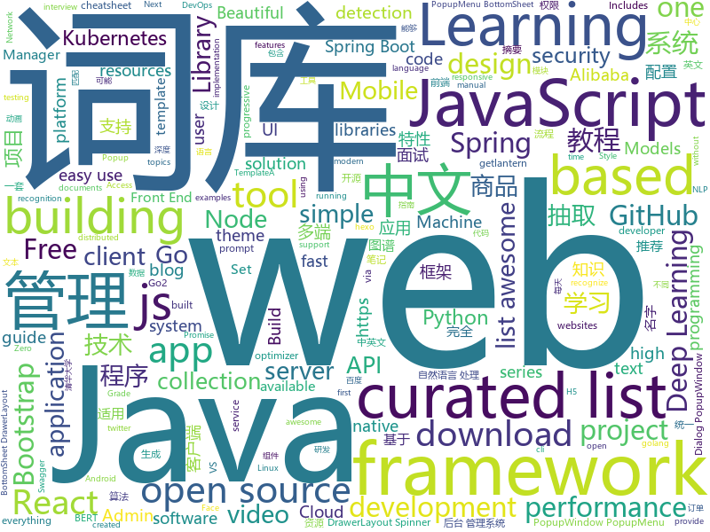

# 2019-03-01
See what the GitHub community is most excited about today.

## python
* [zero](https://github.com/remoteinterview/zero)(**470 stars today**): Zero is a web server to simplify web development.
* [Algorithm_Interview_Notes-Chinese](https://github.com/imhuay/Algorithm_Interview_Notes-Chinese)(**391 stars today**): 2018/2019/校招/春招/秋招/算法/机器学习(Machine Learning)/深度学习(Deep Learning)/自然语言处理(NLP)/C/C++/Python/面试笔记
* [AdaBound](https://github.com/Luolc/AdaBound)(**432 stars today**): An optimizer that trains as fast as Adam and as good as SGD.
* [faceswap](https://github.com/deepfakes/faceswap)(**326 stars today**): Non official project based on original /r/Deepfakes thread. Many thanks to him!
* [lazynlp](https://github.com/chiphuyen/lazynlp)(**275 stars today**): Library to scrape and clean web pages to create massive datasets.
* [bullet](https://github.com/Mckinsey666/bullet)(**208 stars today**): 🚅Beautiful Python prompts made simple. Build a prompt like stacking blocks.
* [subsync](https://github.com/smacke/subsync)(**191 stars today**): Automagically synchronize subtitles with video.
* [Tensorflow-Cookbook](https://github.com/taki0112/Tensorflow-Cookbook)(**164 stars today**): Simple Tensorflow Cookbook for easy-to-use
* [HelloGitHub](https://github.com/521xueweihan/HelloGitHub)(**131 stars today**): 分享 GitHub 上有趣、入门级的开源项目，帮你找到编程的乐趣。欢迎推荐、自荐项目，让更多人知道你的项目⭐️
* [SC-FEGAN](https://github.com/JoYoungjoo/SC-FEGAN)(**114 stars today**): SC-FEGAN : Face Editing Generative Adversarial Network with User's Sketch and Color
* [public-apis](https://github.com/toddmotto/public-apis)(**96 stars today**): A collective list of free APIs for use in software and web development.
* [DeepFaceLab](https://github.com/iperov/DeepFaceLab)(**71 stars today**): DeepFaceLab is a tool that utilizes deep learning to recognize and swap faces in pictures and videos. Includes prebuilt ready to work standalone Windows 7,8,10 binary (look readme.md).
* [DL-Seq2Seq](https://github.com/GauravBh1010tt/DL-Seq2Seq)(**80 stars today**): Implementation of papers on Deep Seq2seq learning using Pytorch.
* [models](https://github.com/tensorflow/models)(**53 stars today**): Models and examples built with TensorFlow
* [gpt-2](https://github.com/openai/gpt-2)(**72 stars today**): Code for the paper "Language Models are Unsupervised Multitask Learners"
* [awesome-python](https://github.com/vinta/awesome-python)(**59 stars today**): A curated list of awesome Python frameworks, libraries, software and resources
* [system-design-primer](https://github.com/donnemartin/system-design-primer)(**55 stars today**): Learn how to design large-scale systems. Prep for the system design interview. Includes Anki flashcards.
* [CheatSheetSeries](https://github.com/OWASP/CheatSheetSeries)(**59 stars today**): The OWASP Cheat Sheet Series was created to provide a concise collection of high value information on specific application security topics.
* [keras](https://github.com/keras-team/keras)(**49 stars today**): Deep Learning for humans
* [lingvo](https://github.com/tensorflow/lingvo)(**52 stars today**): Lingvo
* [bert](https://github.com/google-research/bert)(**45 stars today**): TensorFlow code and pre-trained models for BERT
* [funNLP](https://github.com/fighting41love/funNLP)(**42 stars today**): 中英文敏感词、语言检测、中外手机/电话归属地/运营商查询、名字推断性别、手机号抽取、身份证抽取、邮箱抽取、中日文人名库、中文缩写库、拆字词典、词汇情感值、停用词、反动词表、暴恐词表、繁简体转换、英文模拟中文发音、汪峰歌词生成器、职业名称词库、同义词库、反义词库、否定词库、汽车品牌词库、汽车零件词库、连续英文切割、各种中文词向量、公司名字大全、古诗词库、IT词库、财经词库、成语词库、地名词库、历史名人词库、诗词词库、医学词库、饮食词库、法律词库、汽车词库、动物词库、中文聊天语料、中文谣言数据、百度中文问答数据集、句子相似度匹配算法集合、bert资源、文本生成&摘要相关工具、cocoNLP信息抽取工具、国内电话号码正则匹配、清华大学XLORE:中英文跨语言百科知识图谱、清华大学人工智能技术…
* [cpython](https://github.com/python/cpython)(**39 stars today**): The Python programming language
* [youtube-dl](https://github.com/rg3/youtube-dl)(**41 stars today**): Command-line program to download videos from YouTube.com and other video sites
* [simpledet](https://github.com/TuSimple/simpledet)(**41 stars today**): A Simple and Versatile Framework for Object Detection and Instance Recognition

## java
* [spring-boot-examples](https://github.com/ityouknow/spring-boot-examples)(**338 stars today**): about learning Spring Boot via examples. Spring Boot 教程、技术栈示例代码，快速简单上手教程。
* [JavaGuide](https://github.com/Snailclimb/JavaGuide)(**314 stars today**): 【Java学习+面试指南】 一份涵盖大部分Java程序员所需要掌握的核心知识。
* [JGrowing](https://github.com/javagrowing/JGrowing)(**138 stars today**): Java is Growing up but not only Java。Java成长路线，但学到不仅仅是Java。
* [advanced-java](https://github.com/doocs/advanced-java)(**122 stars today**): 😮互联网 Java 工程师进阶知识完全扫盲
* [DoraemonKit](https://github.com/didi/DoraemonKit)(**116 stars today**): 简称 "DoKit" 。一款功能齐全的客户端（ iOS 、Android ）研发助手，你值得拥有。
* [XPopup](https://github.com/li-xiaojun/XPopup)(**80 stars today**): 🔥功能强大，UI简洁，交互优雅的通用弹窗！可以替代Dialog，PopupWindow，PopupMenu，BottomSheet，DrawerLayout，Spinner等组件，自带十几种效果良好的动画， 支持完全的UI和动画自定义！(Powerful and Beautiful Popup，can absolutely replace Dialog，PopupWindow，PopupMenu，BottomSheet，DrawerLayout，Spinner. With built-in animators , very easy to custom Popup View.)
* [mall](https://github.com/macrozheng/mall)(**65 stars today**): mall项目是一套电商系统，包括前台商城系统及后台管理系统，基于SpringBoot+MyBatis实现。 前台商城系统包含首页门户、商品推荐、商品搜索、商品展示、购物车、订单流程、会员中心、客户服务、帮助中心等模块。 后台管理系统包含商品管理、订单管理、会员管理、促销管理、运营管理、内容管理、统计报表、财务管理、权限管理、设置等模块。
* [SpringBoot-Learning](https://github.com/dyc87112/SpringBoot-Learning)(**64 stars today**): Spring Boot教程
* [spring-boot](https://github.com/spring-projects/spring-boot)(**54 stars today**): Spring Boot
* [arthas](https://github.com/alibaba/arthas)(**56 stars today**): Alibaba Java Diagnostic Tool Arthas/Alibaba Java诊断利器Arthas
* [tutorials](https://github.com/eugenp/tutorials)(**36 stars today**): The "REST With Spring" Course:
* [halo](https://github.com/ruibaby/halo)(**47 stars today**): ✍ Halo 可能是最好的 Java 博客系统
* [fescar](https://github.com/alibaba/fescar)(**46 stars today**): 🔥Fescar is an easy-to-use, high-performance, java based, open source distributed transaction solution.
* [spring-framework](https://github.com/spring-projects/spring-framework)(**32 stars today**): Spring Framework
* [incubator-dubbo](https://github.com/apache/incubator-dubbo)(**35 stars today**): Apache Dubbo (incubating) is a high-performance, java based, open source RPC framework.
* [APIJSON](https://github.com/TommyLemon/APIJSON)(**43 stars today**): 🚀A JSON Transmission Protocol and an ORM Library for auto providing APIs and Documents.
* [HanLP](https://github.com/hankcs/HanLP)(**41 stars today**): 自然语言处理 中文分词 词性标注 命名实体识别 依存句法分析 新词发现 关键词短语提取 自动摘要 文本分类聚类 拼音简繁
* [cim](https://github.com/crossoverJie/cim)(**38 stars today**): 📲cim(cross IM) 适用于开发者的即时通讯系统
* [apollo](https://github.com/ctripcorp/apollo)(**33 stars today**): Apollo（阿波罗）是携程框架部门研发的分布式配置中心，能够集中化管理应用不同环境、不同集群的配置，配置修改后能够实时推送到应用端，并且具备规范的权限、流程治理等特性，适用于微服务配置管理场景。
* [Java](https://github.com/TheAlgorithms/Java)(**29 stars today**): All Algorithms implemented in Java
* [guava](https://github.com/google/guava)(**35 stars today**): Google core libraries for Java
* [okhttp](https://github.com/square/okhttp)(**33 stars today**): An HTTP+HTTP/2 client for Android and Java applications.
* [SpringCloudLearning](https://github.com/forezp/SpringCloudLearning)(**30 stars today**): 《史上最简单的Spring Cloud教程源码》
* [nacos](https://github.com/alibaba/nacos)(**26 stars today**): an easy-to-use dynamic service discovery, configuration and service management platform for building cloud native applications.
* [spring-cloud-alibaba](https://github.com/spring-cloud-incubator/spring-cloud-alibaba)(**29 stars today**): Spring Cloud Alibaba provides a one-stop solution for application development for the distributed solutions of Alibaba middleware.

## unknown
* [Micro8](https://github.com/Micropoor/Micro8)(**376 stars today**): Gitbook
* [awesome-mental-health](https://github.com/dreamingechoes/awesome-mental-health)(**360 stars today**): A curated list of awesome articles, websites and resources about mental health in the software industry.
* [Awesome-Design-Tools](https://github.com/LisaDziuba/Awesome-Design-Tools)(**222 stars today**): The best design tools for everything.
* [Awesome-WAF](https://github.com/0xInfection/Awesome-WAF)(**189 stars today**): 🔥A curated list of awesome web-app firewall (WAF) stuff.
* [CS-Notes](https://github.com/CyC2018/CS-Notes)(**169 stars today**): 😋技术面试必备基础知识
* [awesome-vscode-cn](https://github.com/formulahendry/awesome-vscode-cn)(**120 stars today**): 中文版 Awesome VS Code
* [Daily-Interview-Question](https://github.com/Advanced-Frontend/Daily-Interview-Question)(**114 stars today**): 工作日每天一道前端大厂面试题，祝大家天天进步，一年后会看到不一样的自己。
* [awesome-deep-text-detection-recognition](https://github.com/hwalsuklee/awesome-deep-text-detection-recognition)(**97 stars today**): A curated list of resources for text detection/recognition (optical character recognition ) with deep learning methods.
* [awesome](https://github.com/sindresorhus/awesome)(**93 stars today**): 😎Awesome lists about all kinds of interesting topics
* [architect-awesome](https://github.com/xingshaocheng/architect-awesome)(**86 stars today**): 后端架构师技术图谱
* [nginx-quick-reference](https://github.com/trimstray/nginx-quick-reference)(**98 stars today**): ⚡️These notes describes how to improve Nginx performance, security and other important things; @ssllabs A+ 100%.
* [react-typescript-cheatsheet](https://github.com/sw-yx/react-typescript-cheatsheet)(**98 stars today**): a cheatsheet for react users using typescript with react for the first (or nth!) time
* [You-Dont-Know-JS](https://github.com/getify/You-Dont-Know-JS)(**76 stars today**): A book series on JavaScript. @YDKJS on twitter.
* [free-programming-books](https://github.com/EbookFoundation/free-programming-books)(**75 stars today**): 📚Freely available programming books
* [gitignore](https://github.com/github/gitignore)(**61 stars today**): A collection of useful .gitignore templates
* [How-To-Secure-A-Linux-Server](https://github.com/imthenachoman/How-To-Secure-A-Linux-Server)(**80 stars today**): An evolving how-to guide for securing a Linux server.
* [the-book-of-secret-knowledge](https://github.com/trimstray/the-book-of-secret-knowledge)(**65 stars today**): ⭐️A collection of inspiring lists, manuals, cheatsheets, blogs, hacks, one-liners, cli/web tools and more.
* [new-moon](https://github.com/taniarascia/new-moon)(**68 stars today**): The optimized dark theme for web development. Intuitive syntax highlighting for all your apps.
* [deep-learning-drizzle](https://github.com/kmario23/deep-learning-drizzle)(**60 stars today**): Drench yourself in Deep Learning, Reinforcement Learning, Machine Learning, Computer Vision, and NLP by learning from these exciting lectures!!
* [Nodejs-Developer-Roadmap](https://github.com/aliyr/Nodejs-Developer-Roadmap)(**63 stars today**): A Developer Roadmap to becoming a Node.js developer in 2019
* [awesome-falsehood](https://github.com/kdeldycke/awesome-falsehood)(**63 stars today**): 💊Curated list of falsehoods programmers believe in.
* [project-based-learning](https://github.com/tuvtran/project-based-learning)(**49 stars today**): Curated list of project-based tutorials
* [Xiaomi_Kernel_OpenSource](https://github.com/MiCode/Xiaomi_Kernel_OpenSource)(**44 stars today**): Xiaomi Mobile Phone Kernel OpenSource
* [100-Days-Of-ML-Code](https://github.com/Avik-Jain/100-Days-Of-ML-Code)(**42 stars today**): 100 Days of ML Coding

## javascript
* [gpu.js](https://github.com/gpujs/gpu.js)(**389 stars today**): GPU Accelerated JavaScript
* [Motrix](https://github.com/agalwood/Motrix)(**268 stars today**): A full-featured download manager.
* [grapesjs](https://github.com/artf/grapesjs)(**222 stars today**): Free and Open source Web Builder Framework. Next generation tool for building templates without coding
* [cleave.js](https://github.com/nosir/cleave.js)(**198 stars today**): Format input text content when you are typing...
* [react-three-fiber](https://github.com/drcmda/react-three-fiber)(**179 stars today**): 👌React-fiber renderer for THREE.js
* [vue](https://github.com/vuejs/vue)(**154 stars today**): 🖖Vue.js is a progressive, incrementally-adoptable JavaScript framework for building UI on the web.
* [ColorUI](https://github.com/weilanwl/ColorUI)(**147 stars today**): 鲜亮的高饱和色彩，专注视觉的小程序组件库
* [omi](https://github.com/Tencent/omi)(**149 stars today**): 下一代前端统一框架 - 支持桌面Web、移动H5和小程序 - Next Front End Framework
* [taro](https://github.com/NervJS/taro)(**117 stars today**): 多端统一开发框架，支持用 React 的开发方式编写一次代码，生成能运行在微信/百度/支付宝/字节跳动小程序、H5、React Native 等的应用。 https://taro.js.org/
* [react](https://github.com/facebook/react)(**98 stars today**): A declarative, efficient, and flexible JavaScript library for building user interfaces.
* [create-react-app](https://github.com/facebook/create-react-app)(**93 stars today**): Set up a modern web app by running one command.
* [30-seconds-of-code](https://github.com/30-seconds/30-seconds-of-code)(**102 stars today**): Curated collection of useful JavaScript snippets that you can understand in 30 seconds or less.
* [nsfwjs](https://github.com/infinitered/nsfwjs)(**99 stars today**): NSFW detection on the client-side via Tensorflow JS
* [chameleon](https://github.com/didi/chameleon)(**82 stars today**): 🦎一套代码运行多端，一端所见即多端所见
* [puppeteer](https://github.com/GoogleChrome/puppeteer)(**68 stars today**): Headless Chrome Node API
* [terser](https://github.com/terser-js/terser)(**69 stars today**): JavaScript parser, mangler, optimizer and beautifier toolkit for ES6+
* [NodeMail](https://github.com/Vincedream/NodeMail)(**62 stars today**): 💗用Node写一个爬虫脚本每天定时给女朋友发一封暖心邮件
* [leon](https://github.com/leon-ai/leon)(**65 stars today**): 🧠 Leon is your open-source personal assistant.
* [xiangxuema](https://github.com/xland/xiangxuema)(**65 stars today**): “想学吗”个人知识管理工具客户端
* [eslint-config-wesbos](https://github.com/wesbos/eslint-config-wesbos)(**67 stars today**): No-Sweat™ Eslint and Prettier Setup - with or without VS Code
* [node](https://github.com/nodejs/node)(**60 stars today**): Node.js JavaScript runtime✨🐢🚀✨
* [Gitter](https://github.com/huangjianke/Gitter)(**62 stars today**): Gitter for GitHub - 可能是目前颜值最高的GitHub小程序客户端
* [three.js](https://github.com/mrdoob/three.js)(**51 stars today**): JavaScript 3D library.
* [axios](https://github.com/axios/axios)(**58 stars today**): Promise based HTTP client for the browser and node.js
* [bootstrap](https://github.com/twbs/bootstrap)(**40 stars today**): The most popular HTML, CSS, and JavaScript framework for developing responsive, mobile first projects on the web.

## html
* [AdminLTE](https://github.com/almasaeed2010/AdminLTE)(**23 stars today**): AdminLTE - Free Premium Admin control Panel Theme Based On Bootstrap 3.x
* [stisla](https://github.com/stisla/stisla)(**28 stars today**): Free Bootstrap Admin Template
* [Front-end-Developer-Interview-Questions](https://github.com/h5bp/Front-end-Developer-Interview-Questions)(**22 stars today**): A list of helpful front-end related questions you can use to interview potential candidates, test yourself or completely ignore.
* [styleguide](https://github.com/google/styleguide)(**19 stars today**): Style guides for Google-originated open-source projects
* [fastText](https://github.com/facebookresearch/fastText)(**17 stars today**): Library for fast text representation and classification.
* [deeplearning_ai_books](https://github.com/fengdu78/deeplearning_ai_books)(**15 stars today**): deeplearning.ai（吴恩达老师的深度学习课程笔记及资源）
* [Spoon-Knife](https://github.com/octocat/Spoon-Knife)(****): This repo is for demonstration purposes only.
* [ionic](https://github.com/ionic-team/ionic)(**16 stars today**): Build amazing native and progressive web apps with open web technologies. One app running on everything🎉
* [free-for-dev](https://github.com/ripienaar/free-for-dev)(**16 stars today**): A list of SaaS, PaaS and IaaS offerings that have free tiers of interest to devops and infradev
* [now-github-starter](https://github.com/zeit/now-github-starter)(****): Starter project to demonstrate a project whose pull requests get automatically deployed
* [qiubaiying.github.io](https://github.com/qiubaiying/qiubaiying.github.io)(**5 stars today**): BY Blog ->
* [flutter-in-action](https://github.com/flutterchina/flutter-in-action)(**13 stars today**): 《Flutter实战》电子书
* [proposal-promise-any](https://github.com/tc39/proposal-promise-any)(**13 stars today**): ECMAScript proposal: Promise.any
* [ecma262](https://github.com/tc39/ecma262)(**12 stars today**): Status, process, and documents for ECMA262
* [hexo-theme-matery](https://github.com/blinkfox/hexo-theme-matery)(**10 stars today**): A beautiful hexo blog theme with material design and responsive design.一个基于材料设计和响应式设计而成的全面、美观的Hexo主题。
* [data](https://github.com/the-pudding/data)(**11 stars today**): Data sets created for stories on The Pudding, open to the public.
* [all-contributors](https://github.com/all-contributors/all-contributors)(**11 stars today**): ✨Recognize all contributors, not just the ones who push code✨
* [swagger-codegen](https://github.com/swagger-api/swagger-codegen)(**8 stars today**): swagger-codegen contains a template-driven engine to generate documentation, API clients and server stubs in different languages by parsing your OpenAPI / Swagger definition.
* [bootstrap-table](https://github.com/wenzhixin/bootstrap-table)(**9 stars today**): An extended Bootstrap table with radio, checkbox, sort, pagination, and other added features. (supports twitter bootstrap v2, v3 and v4)
* [gentelella](https://github.com/ColorlibHQ/gentelella)(**9 stars today**): Free Bootstrap 3 Admin Template
* [hyperHTML](https://github.com/WebReflection/hyperHTML)(**9 stars today**): A Fast & Light Virtual DOM Alternative
* [javascript-tutorial-en](https://github.com/iliakan/javascript-tutorial-en)(**8 stars today**): Modern JavaScript Tutorial
* [nginxconfig.io](https://github.com/valentinxxx/nginxconfig.io)(**9 stars today**): ⚙️NGiИX config generator on steroids💉
* [owasp-mstg](https://github.com/OWASP/owasp-mstg)(**9 stars today**): The Mobile Security Testing Guide (MSTG) is a comprehensive manual for mobile app security testing and reverse engineering.
* [webcomponentsjs](https://github.com/webcomponents/webcomponentsjs)(**9 stars today**): A suite of polyfills supporting the HTML Web Components specs

## go
* [k3s](https://github.com/rancher/k3s)(**745 stars today**): Lightweight Kubernetes. 5 less than k8s.
* [gomacro](https://github.com/cosmos72/gomacro)(**181 stars today**): Interactive Go interpreter and debugger with REPL, Eval, generics and Lisp-like macros
* [kubernetes](https://github.com/kubernetes/kubernetes)(**64 stars today**): Production-Grade Container Scheduling and Management
* [1m-go-tcp-server](https://github.com/smallnest/1m-go-tcp-server)(**68 stars today**): benchmarks for implementation of servers which support 1 million connections
* [micro](https://github.com/micro/micro)(**68 stars today**): A microservice toolkit
* [go](https://github.com/golang/go)(**63 stars today**): The Go programming language
* [cds](https://github.com/ovh/cds)(**56 stars today**): Enterprise-Grade Continuous Delivery & DevOps Automation Open Source Platform
* [rakkess](https://github.com/corneliusweig/rakkess)(**58 stars today**): Review Access - kubectl plugin to show an access matrix for all available resources
* [go2-book](https://github.com/chai2010/go2-book)(**55 stars today**): 📚《Go2编程指南》开源图书，重点讲解Go2新特性，以及Go1教程中较少涉及的特性
* [build-web-application-with-golang](https://github.com/astaxie/build-web-application-with-golang)(**47 stars today**): A golang ebook intro how to build a web with golang
* [1m-go-websockets](https://github.com/eranyanay/1m-go-websockets)(**43 stars today**): handling 1M websockets connections in Go
* [awesome-go](https://github.com/avelino/awesome-go)(**40 stars today**): A curated list of awesome Go frameworks, libraries and software
* [istio-operator](https://github.com/banzaicloud/istio-operator)(**42 stars today**): An operator that manages Istio deployments on Kubernetes
* [gin](https://github.com/gin-gonic/gin)(**39 stars today**): Gin is a HTTP web framework written in Go (Golang). It features a Martini-like API with much better performance -- up to 40 times faster. If you need smashing performance, get yourself some Gin.
* [k9s](https://github.com/derailed/k9s)(**39 stars today**): 🐶Kubernetes CLI To Manage Your Clusters In Style!
* [prometheus](https://github.com/prometheus/prometheus)(**35 stars today**): The Prometheus monitoring system and time series database.
* [hugo](https://github.com/gohugoio/hugo)(**36 stars today**): The world’s fastest framework for building websites.
* [helm](https://github.com/helm/helm)(**35 stars today**): The Kubernetes Package Manager
* [lantern](https://github.com/getlantern/lantern)(**30 stars today**): 🔴蓝灯最新版本下载 https://github.com/getlantern/download🔴Lantern Latest Download https://github.com/getlantern/download🔴
* [inlets](https://github.com/alexellis/inlets)(**32 stars today**): Expose your local endpoints to the Internet
* [mkcert](https://github.com/FiloSottile/mkcert)(**32 stars today**): A simple zero-config tool to make locally trusted development certificates with any names you'd like.
* [cortex](https://github.com/cortexlabs/cortex)(**31 stars today**): Machine learning platform for developers
* [wal-g](https://github.com/wal-g/wal-g)(**30 stars today**): Archival and Restoration for Postgres
* [v2ray-core](https://github.com/v2ray/v2ray-core)(**27 stars today**): A platform for building proxies to bypass network restrictions.
* [talos](https://github.com/autonomy/talos)(**28 stars today**): A modern Linux distribution for Kubernetes.

## WordCloud

