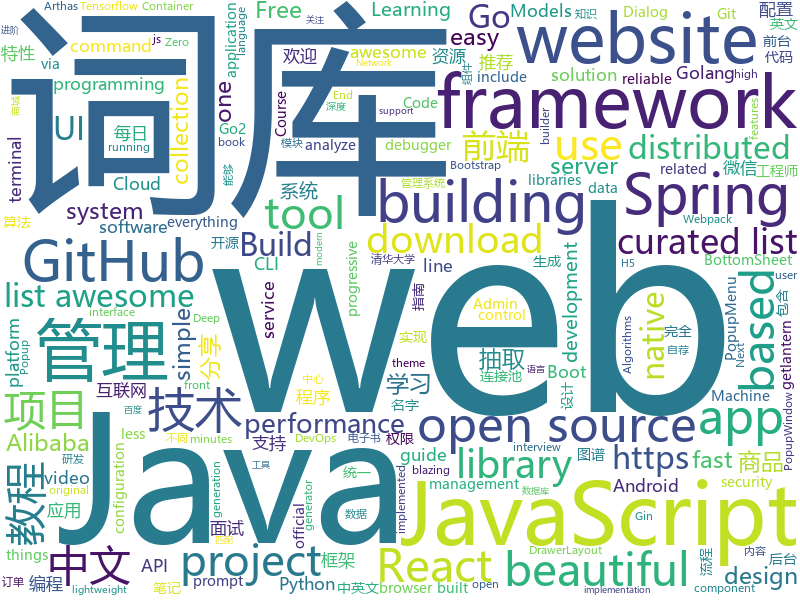

# 2019-03-02
See what the GitHub community is most excited about today.

## python
* [zero](https://github.com/remoteinterview/zero)(**385 stars today**): Zero is a web server to simplify web development.
* [Algorithm_Interview_Notes-Chinese](https://github.com/imhuay/Algorithm_Interview_Notes-Chinese)(**316 stars today**): 2018/2019/校招/春招/秋招/算法/机器学习(Machine Learning)/深度学习(Deep Learning)/自然语言处理(NLP)/C/C++/Python/面试笔记
* [public-apis](https://github.com/toddmotto/public-apis)(**343 stars today**): A collective list of free APIs for use in software and web development.
* [faceswap](https://github.com/deepfakes/faceswap)(**190 stars today**): Non official project based on original /r/Deepfakes thread. Many thanks to him!
* [lazynlp](https://github.com/chiphuyen/lazynlp)(**209 stars today**): Library to scrape and clean web pages to create massive datasets.
* [bullet](https://github.com/Mckinsey666/bullet)(**201 stars today**): 🚅Beautiful Python prompts made simple. Build a prompt like stacking blocks.
* [subsync](https://github.com/smacke/subsync)(**169 stars today**): Automagically synchronize subtitles with video.
* [AdaBound](https://github.com/Luolc/AdaBound)(**164 stars today**): An optimizer that trains as fast as Adam and as good as SGD.
* [SC-FEGAN](https://github.com/JoYoungjoo/SC-FEGAN)(**103 stars today**): SC-FEGAN : Face Editing Generative Adversarial Network with User's Sketch and Color
* [HelloGitHub](https://github.com/521xueweihan/HelloGitHub)(**89 stars today**): 分享 GitHub 上有趣、入门级的开源项目，帮你找到编程的乐趣。欢迎推荐、自荐项目，让更多人知道你的项目⭐️
* [Tensorflow-Cookbook](https://github.com/taki0112/Tensorflow-Cookbook)(**77 stars today**): Simple Tensorflow Cookbook for easy-to-use
* [DeepLearningMugenKnock](https://github.com/yoyoyo-yo/DeepLearningMugenKnock)(**74 stars today**): でぃーぷらーにんぐを無限にやってディープラーニングでディープラニングするためのもの
* [models](https://github.com/tensorflow/models)(**55 stars today**): Models and examples built with TensorFlow
* [gitsome](https://github.com/donnemartin/gitsome)(**69 stars today**): A supercharged Git/GitHub command line interface (CLI). An official integration for GitHub and GitHub Enterprise: https://github.com/works-with/category/desktop-tools
* [pghoard](https://github.com/aiven/pghoard)(**67 stars today**): PostgreSQL backup and restore service
* [system-design-primer](https://github.com/donnemartin/system-design-primer)(**61 stars today**): Learn how to design large-scale systems. Prep for the system design interview. Includes Anki flashcards.
* [DL-Seq2Seq](https://github.com/GauravBh1010tt/DL-Seq2Seq)(**64 stars today**): Implementation of papers on Deep Seq2seq learning using Pytorch.
* [awesome-python](https://github.com/vinta/awesome-python)(**55 stars today**): A curated list of awesome Python frameworks, libraries, software and resources
* [zulip](https://github.com/zulip/zulip)(**51 stars today**): Zulip server - powerful open source team chat
* [bert](https://github.com/google-research/bert)(**48 stars today**): TensorFlow code and pre-trained models for BERT
* [gpt-2](https://github.com/openai/gpt-2)(**48 stars today**): Code for the paper "Language Models are Unsupervised Multitask Learners"
* [youtube-dl](https://github.com/rg3/youtube-dl)(**47 stars today**): Command-line program to download videos from YouTube.com and other video sites
* [funNLP](https://github.com/fighting41love/funNLP)(**41 stars today**): 中英文敏感词、语言检测、中外手机/电话归属地/运营商查询、名字推断性别、手机号抽取、身份证抽取、邮箱抽取、中日文人名库、中文缩写库、拆字词典、词汇情感值、停用词、反动词表、暴恐词表、繁简体转换、英文模拟中文发音、汪峰歌词生成器、职业名称词库、同义词库、反义词库、否定词库、汽车品牌词库、汽车零件词库、连续英文切割、各种中文词向量、公司名字大全、古诗词库、IT词库、财经词库、成语词库、地名词库、历史名人词库、诗词词库、医学词库、饮食词库、法律词库、汽车词库、动物词库、中文聊天语料、中文谣言数据、百度中文问答数据集、句子相似度匹配算法集合、bert资源、文本生成&摘要相关工具、cocoNLP信息抽取工具、国内电话号码正则匹配、清华大学XLORE:中英文跨语言百科知识图谱、清华大学人工智能技术…
* [Python](https://github.com/TheAlgorithms/Python)(**41 stars today**): All Algorithms implemented in Python
* [magenta](https://github.com/tensorflow/magenta)(**44 stars today**): Magenta: Music and Art Generation with Machine Intelligence

## java
* [spring-boot-examples](https://github.com/ityouknow/spring-boot-examples)(**254 stars today**): about learning Spring Boot via examples. Spring Boot 教程、技术栈示例代码，快速简单上手教程。
* [JavaGuide](https://github.com/Snailclimb/JavaGuide)(**216 stars today**): 【Java学习+面试指南】 一份涵盖大部分Java程序员所需要掌握的核心知识。
* [advanced-java](https://github.com/doocs/advanced-java)(**112 stars today**): 😮互联网 Java 工程师进阶知识完全扫盲
* [JGrowing](https://github.com/javagrowing/JGrowing)(**86 stars today**): Java is Growing up but not only Java。Java成长路线，但学到不仅仅是Java。
* [mall](https://github.com/macrozheng/mall)(**70 stars today**): mall项目是一套电商系统，包括前台商城系统及后台管理系统，基于SpringBoot+MyBatis实现。 前台商城系统包含首页门户、商品推荐、商品搜索、商品展示、购物车、订单流程、会员中心、客户服务、帮助中心等模块。 后台管理系统包含商品管理、订单管理、会员管理、促销管理、运营管理、内容管理、统计报表、财务管理、权限管理、设置等模块。
* [arthas](https://github.com/alibaba/arthas)(**74 stars today**): Alibaba Java Diagnostic Tool Arthas/Alibaba Java诊断利器Arthas
* [DoraemonKit](https://github.com/didi/DoraemonKit)(**67 stars today**): 简称 "DoKit" 。一款功能齐全的客户端（ iOS 、Android ）研发助手，你值得拥有。
* [spring-cloud-alibaba](https://github.com/spring-cloud-incubator/spring-cloud-alibaba)(**56 stars today**): Spring Cloud Alibaba provides a one-stop solution for application development for the distributed solutions of Alibaba middleware.
* [bubble-navigation](https://github.com/gauravk95/bubble-navigation)(**62 stars today**): 🎉[Android Library] A light-weight library to make beautiful Navigation Bar easily with ton of🎨customization option.
* [fescar](https://github.com/alibaba/fescar)(**52 stars today**): 🔥Fescar is an easy-to-use, high-performance, java based, open source distributed transaction solution.
* [spring-boot](https://github.com/spring-projects/spring-boot)(**37 stars today**): Spring Boot
* [tutorials](https://github.com/eugenp/tutorials)(**33 stars today**): The "REST With Spring" Course:
* [SpringCloudLearning](https://github.com/forezp/SpringCloudLearning)(**44 stars today**): 《史上最简单的Spring Cloud教程源码》
* [spring-framework](https://github.com/spring-projects/spring-framework)(**30 stars today**): Spring Framework
* [apollo](https://github.com/ctripcorp/apollo)(**34 stars today**): Apollo（阿波罗）是携程框架部门研发的分布式配置中心，能够集中化管理应用不同环境、不同集群的配置，配置修改后能够实时推送到应用端，并且具备规范的权限、流程治理等特性，适用于微服务配置管理场景。
* [emulator](https://github.com/zhkl0228/emulator)(**31 stars today**): Allows you to emulate an Android ARM32 and/or ARM64 native library
* [elasticsearch](https://github.com/elastic/elasticsearch)(**33 stars today**): Open Source, Distributed, RESTful Search Engine
* [XPopup](https://github.com/li-xiaojun/XPopup)(**36 stars today**): 🔥功能强大，UI简洁，交互优雅的通用弹窗！可以替代Dialog，PopupWindow，PopupMenu，BottomSheet，DrawerLayout，Spinner等组件，自带十几种效果良好的动画， 支持完全的UI和动画自定义！(Powerful and Beautiful Popup，can absolutely replace Dialog，PopupWindow，PopupMenu，BottomSheet，DrawerLayout，Spinner. With built-in animators , very easy to custom Popup View.)
* [incubator-dubbo](https://github.com/apache/incubator-dubbo)(**31 stars today**): Apache Dubbo (incubating) is a high-performance, java based, open source RPC framework.
* [druid](https://github.com/alibaba/druid)(**32 stars today**): 阿里巴巴数据库事业部出品，为监控而生的数据库连接池。阿里云Data Lake Analytics(https://www.aliyun.com/product/datalakeanalytics )、DRDS、TDDL 连接池powered by Druid
* [Java](https://github.com/TheAlgorithms/Java)(**30 stars today**): All Algorithms implemented in Java
* [SpringBoot-Learning](https://github.com/dyc87112/SpringBoot-Learning)(**35 stars today**): Spring Boot教程
* [nacos](https://github.com/alibaba/nacos)(**33 stars today**): an easy-to-use dynamic service discovery, configuration and service management platform for building cloud native applications.
* [RCT](https://github.com/xaecbd/RCT)(**32 stars today**): RCT (Redis Computed Tomography) include parse redis rdb , slowlog analyze and clientlist analyze
* [miaosha](https://github.com/qiurunze123/miaosha)(**31 stars today**): ⭐⭐⭐⭐秒杀系统设计与实现.互联网工程师进阶与分析🙋🐓

## unknown
* [Awesome-Design-Tools](https://github.com/LisaDziuba/Awesome-Design-Tools)(**361 stars today**): The best design tools for everything.
* [Micro8](https://github.com/Micropoor/Micro8)(**300 stars today**): Gitbook
* [awesome-mental-health](https://github.com/dreamingechoes/awesome-mental-health)(**338 stars today**): A curated list of awesome articles, websites and resources about mental health in the software industry.
* [CS-Notes](https://github.com/CyC2018/CS-Notes)(**149 stars today**): 😋技术面试必备基础知识
* [Awesome-WAF](https://github.com/0xInfection/Awesome-WAF)(**131 stars today**): 🔥A curated list of awesome web-app firewall (WAF) stuff.
* [the-book-of-secret-knowledge](https://github.com/trimstray/the-book-of-secret-knowledge)(**97 stars today**): ⭐️A collection of inspiring lists, manuals, cheatsheets, blogs, hacks, one-liners, cli/web tools and more.
* [awesome](https://github.com/sindresorhus/awesome)(**79 stars today**): 😎Awesome lists about all kinds of interesting topics
* [nginx-quick-reference](https://github.com/trimstray/nginx-quick-reference)(**74 stars today**): ⚡️These notes describes how to improve Nginx performance, security and other important things; @ssllabs A+ 100%.
* [How-To-Secure-A-Linux-Server](https://github.com/imthenachoman/How-To-Secure-A-Linux-Server)(**73 stars today**): An evolving how-to guide for securing a Linux server.
* [You-Dont-Know-JS](https://github.com/getify/You-Dont-Know-JS)(**68 stars today**): A book series on JavaScript. @YDKJS on twitter.
* [Daily-Interview-Question](https://github.com/Advanced-Frontend/Daily-Interview-Question)(**68 stars today**): 工作日每天一道前端大厂面试题，祝大家天天进步，一年后会看到不一样的自己。
* [architect-awesome](https://github.com/xingshaocheng/architect-awesome)(**60 stars today**): 后端架构师技术图谱
* [gitignore](https://github.com/github/gitignore)(**51 stars today**): A collection of useful .gitignore templates
* [GitHubDaily](https://github.com/GitHubDaily/GitHubDaily)(**58 stars today**): GitHubDaily 分享内容定期整理与分类。欢迎推荐、自荐项目，让更多人知道你的项目。
* [statrethinking_winter2019](https://github.com/rmcelreath/statrethinking_winter2019)(**54 stars today**): Statistical Rethinking course at MPI-EVA from Dec 2018 through Feb 2019
* [100-Days-Of-ML-Code](https://github.com/Avik-Jain/100-Days-Of-ML-Code)(**48 stars today**): 100 Days of ML Coding
* [new-moon](https://github.com/taniarascia/new-moon)(**53 stars today**): The optimized dark theme for web development. Intuitive syntax highlighting for all your apps.
* [free-programming-books](https://github.com/EbookFoundation/free-programming-books)(**48 stars today**): 📚Freely available programming books
* [awesome-f2e-libs](https://github.com/sorrycc/awesome-f2e-libs)(**50 stars today**): 🎉整理我平时关注的前端库。
* [awesome-vscode-cn](https://github.com/formulahendry/awesome-vscode-cn)(**50 stars today**): 中文版 Awesome VS Code
* [weekly](https://github.com/ruanyf/weekly)(**48 stars today**): 技术分享周刊，每周五发布
* [chromium](https://github.com/jjqqkk/chromium)(**36 stars today**): Chromium browser with SSL VPN. Use this browser to unblock websites.
* [awesome-design-systems](https://github.com/alexpate/awesome-design-systems)(**38 stars today**): 💅🏻⚒A collection of awesome design systems
* [awesome-vue](https://github.com/vuejs/awesome-vue)(**37 stars today**): 🎉A curated list of awesome things related to Vue.js

## javascript
* [gpu.js](https://github.com/gpujs/gpu.js)(**263 stars today**): GPU Accelerated JavaScript
* [ColorUI](https://github.com/weilanwl/ColorUI)(**252 stars today**): 鲜亮的高饱和色彩，专注视觉的小程序组件库
* [grapesjs](https://github.com/artf/grapesjs)(**246 stars today**): Free and Open source Web Builder Framework. Next generation tool for building templates without coding
* [Motrix](https://github.com/agalwood/Motrix)(**197 stars today**): A full-featured download manager.
* [cleave.js](https://github.com/nosir/cleave.js)(**174 stars today**): Format input text content when you are typing...
* [vue](https://github.com/vuejs/vue)(**121 stars today**): 🖖Vue.js is a progressive, incrementally-adoptable JavaScript framework for building UI on the web.
* [omi](https://github.com/Tencent/omi)(**118 stars today**): 下一代前端统一框架 - 支持桌面Web、移动H5和小程序 - Next Front End Framework
* [fx](https://github.com/antonmedv/fx)(**108 stars today**): Command-line tool and terminal JSON viewer🔥
* [react](https://github.com/facebook/react)(**90 stars today**): A declarative, efficient, and flexible JavaScript library for building user interfaces.
* [fx-completion](https://github.com/antonmedv/fx-completion)(**102 stars today**): Bash completion for fx
* [taro](https://github.com/NervJS/taro)(**95 stars today**): 多端统一开发框架，支持用 React 的开发方式编写一次代码，生成能运行在微信/百度/支付宝/字节跳动小程序、H5、React Native 等的应用。 https://taro.js.org/
* [frenchkiss.js](https://github.com/koala-interactive/frenchkiss.js)(**98 stars today**): The blazing fast lightweight i18n module for javascript
* [create-react-app](https://github.com/facebook/create-react-app)(**75 stars today**): Set up a modern web app by running one command.
* [react-three-fiber](https://github.com/drcmda/react-three-fiber)(**82 stars today**): 👌React-fiber renderer for THREE.js
* [nsfwjs](https://github.com/infinitered/nsfwjs)(**76 stars today**): NSFW detection on the client-side via Tensorflow JS
* [x-spreadsheet](https://github.com/myliang/x-spreadsheet)(**74 stars today**): A web-based JavaScript（canvas） spreadsheet
* [with-react-hooks](https://github.com/kesne/with-react-hooks)(**70 stars today**): Add support for React Hooks in your class components. Live your own life and break the rules.
* [wechatBot](https://github.com/gengchen528/wechatBot)(**61 stars today**): 微信每日说，每日自动发送微信消息
* [30-seconds-of-code](https://github.com/30-seconds/30-seconds-of-code)(**56 stars today**): Curated collection of useful JavaScript snippets that you can understand in 30 seconds or less.
* [bootstrap](https://github.com/twbs/bootstrap)(**46 stars today**): The most popular HTML, CSS, and JavaScript framework for developing responsive, mobile first projects on the web.
* [gatsby](https://github.com/gatsbyjs/gatsby)(**48 stars today**): Build blazing fast, modern apps and websites with React
* [leon](https://github.com/leon-ai/leon)(**51 stars today**): 🧠 Leon is your open-source personal assistant.
* [javascript](https://github.com/airbnb/javascript)(**48 stars today**): JavaScript Style Guide
* [microbundle](https://github.com/developit/microbundle)(**52 stars today**): 📦Zero-configuration bundler for tiny modules.
* [react-native](https://github.com/facebook/react-native)(**48 stars today**): A framework for building native apps with React.

## html
* [deeplearning_ai_books](https://github.com/fengdu78/deeplearning_ai_books)(**33 stars today**): deeplearning.ai（吴恩达老师的深度学习课程笔记及资源）
* [why-openbsd.rocks](https://github.com/noqqe/why-openbsd.rocks)(**27 stars today**): A website that helps me showing people why OpenBSD rocks
* [javascript-tutorial-en](https://github.com/iliakan/javascript-tutorial-en)(**26 stars today**): Modern JavaScript Tutorial
* [AdminLTE](https://github.com/almasaeed2010/AdminLTE)(**18 stars today**): AdminLTE - Free Premium Admin control Panel Theme Based On Bootstrap 3.x
* [styleguide](https://github.com/google/styleguide)(**18 stars today**): Style guides for Google-originated open-source projects
* [flutter-in-action](https://github.com/flutterchina/flutter-in-action)(**19 stars today**): 《Flutter实战》电子书
* [Front-end-Developer-Interview-Questions](https://github.com/h5bp/Front-end-Developer-Interview-Questions)(**17 stars today**): A list of helpful front-end related questions you can use to interview potential candidates, test yourself or completely ignore.
* [portainer](https://github.com/portainer/portainer)(**17 stars today**): Simple management UI for Docker
* [free-for-dev](https://github.com/ripienaar/free-for-dev)(**15 stars today**): A list of SaaS, PaaS and IaaS offerings that have free tiers of interest to devops and infradev
* [fastText](https://github.com/facebookresearch/fastText)(**15 stars today**): Library for fast text representation and classification.
* [Spoon-Knife](https://github.com/octocat/Spoon-Knife)(****): This repo is for demonstration purposes only.
* [now-github-starter](https://github.com/zeit/now-github-starter)(****): Starter project to demonstrate a project whose pull requests get automatically deployed
* [ecma262](https://github.com/tc39/ecma262)(**13 stars today**): Status, process, and documents for ECMA262
* [stisla](https://github.com/stisla/stisla)(**13 stars today**): Free Bootstrap Admin Template
* [hugo-academic](https://github.com/gcushen/hugo-academic)(**12 stars today**): The website builder for Hugo. Build and deploy a beautiful website in minutes🚀
* [polymer](https://github.com/Polymer/polymer)(**13 stars today**): Our original Web Component library.
* [frontendDaily](https://github.com/kujian/frontendDaily)(**12 stars today**): 前端开发技术日报，每日分享互联网最精彩的前端技术、前端资讯、后端编程、设计和资源等，欢迎关注Watch
* [ionic](https://github.com/ionic-team/ionic)(**11 stars today**): Build amazing native and progressive web apps with open web technologies. One app running on everything🎉
* [electron-api-demos](https://github.com/electron/electron-api-demos)(**11 stars today**): Explore the Electron APIs
* [beautiful-jekyll](https://github.com/daattali/beautiful-jekyll)(**7 stars today**): ✨Build a beautiful and simple website in literally minutes. Demo at http://deanattali.com/beautiful-jekyll
* [javascript-tutorial-zh](https://github.com/xitu/javascript-tutorial-zh)(**10 stars today**): Modern JavaScript Tutorial
* [visual-vocabulary-vega](https://github.com/gramener/visual-vocabulary-vega)(**10 stars today**): Visual Vocabulary with Vega
* [nginxconfig.io](https://github.com/valentinxxx/nginxconfig.io)(**9 stars today**): ⚙️NGiИX config generator on steroids💉
* [typedoc](https://github.com/TypeStrong/typedoc)(**9 stars today**): Documentation generator for TypeScript projects.
* [dive-into-webpack](https://github.com/gwuhaolin/dive-into-webpack)(**8 stars today**): 全面的Webpack教程《深入浅出Webpack》电子书

## go
* [k3s](https://github.com/rancher/k3s)(**377 stars today**): Lightweight Kubernetes. 5 less than k8s.
* [gomacro](https://github.com/cosmos72/gomacro)(**93 stars today**): Interactive Go interpreter and debugger with REPL, Eval, generics and Lisp-like macros
* [kubernetes](https://github.com/kubernetes/kubernetes)(**68 stars today**): Production-Grade Container Scheduling and Management
* [1m-go-tcp-server](https://github.com/smallnest/1m-go-tcp-server)(**60 stars today**): benchmarks for implementation of servers which support 1 million connections
* [go](https://github.com/golang/go)(**56 stars today**): The Go programming language
* [micro](https://github.com/micro/micro)(**54 stars today**): A microservice toolkit
* [CovenantSQL](https://github.com/CovenantSQL/CovenantSQL)(**42 stars today**): a SQL database with Blockchain features.
* [awesome-go](https://github.com/avelino/awesome-go)(**40 stars today**): A curated list of awesome Go frameworks, libraries and software
* [cds](https://github.com/ovh/cds)(**42 stars today**): Enterprise-Grade Continuous Delivery & DevOps Automation Open Source Platform
* [lantern](https://github.com/getlantern/lantern)(**38 stars today**): 🔴蓝灯最新版本下载 https://github.com/getlantern/download🔴Lantern Latest Download https://github.com/getlantern/download🔴
* [v2ray-core](https://github.com/v2ray/v2ray-core)(**38 stars today**): A platform for building proxies to bypass network restrictions.
* [gin](https://github.com/gin-gonic/gin)(**35 stars today**): Gin is a HTTP web framework written in Go (Golang). It features a Martini-like API with much better performance -- up to 40 times faster. If you need smashing performance, get yourself some Gin.
* [dive](https://github.com/wagoodman/dive)(**34 stars today**): A tool for exploring each layer in a docker image
* [istio](https://github.com/istio/istio)(**32 stars today**): Connect, secure, control, and observe services.
* [containerd](https://github.com/containerd/containerd)(**31 stars today**): An open and reliable container runtime
* [lazygit](https://github.com/jesseduffield/lazygit)(**32 stars today**): simple terminal UI for git commands
* [1m-go-websockets](https://github.com/eranyanay/1m-go-websockets)(**31 stars today**): handling 1M websockets connections in Go
* [build-web-application-with-golang](https://github.com/astaxie/build-web-application-with-golang)(**30 stars today**): A golang ebook intro how to build a web with golang
* [delve](https://github.com/go-delve/delve)(**27 stars today**): Delve is a debugger for the Go programming language.
* [etcd](https://github.com/etcd-io/etcd)(**25 stars today**): Distributed reliable key-value store for the most critical data of a distributed system
* [k9s](https://github.com/derailed/k9s)(**26 stars today**): 🐶Kubernetes CLI To Manage Your Clusters In Style!
* [gotop](https://github.com/cjbassi/gotop)(**25 stars today**): A terminal based graphical activity monitor inspired by gtop and vtop
* [hugo](https://github.com/gohugoio/hugo)(**21 stars today**): The world’s fastest framework for building websites.
* [gosec](https://github.com/securego/gosec)(**22 stars today**): Golang security checker
* [go2-book](https://github.com/chai2010/go2-book)(**22 stars today**): 📚《Go2编程指南》开源图书，重点讲解Go2新特性，以及Go1教程中较少涉及的特性

## WordCloud

